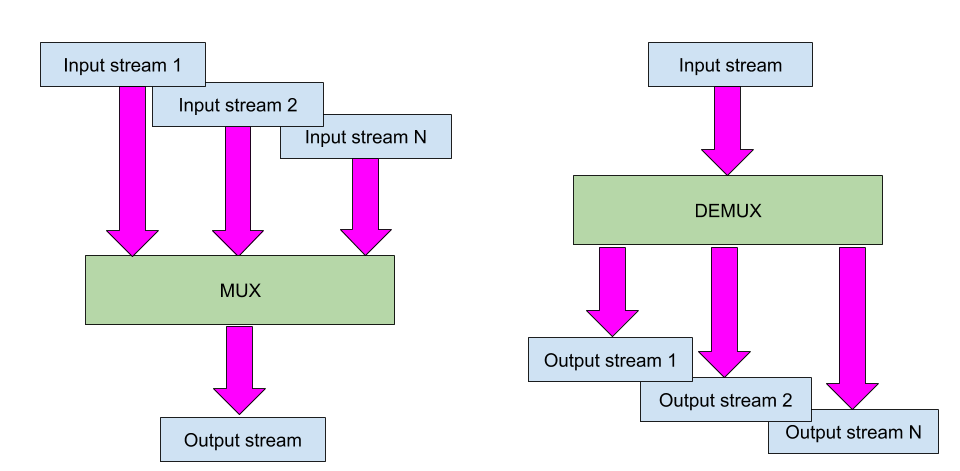
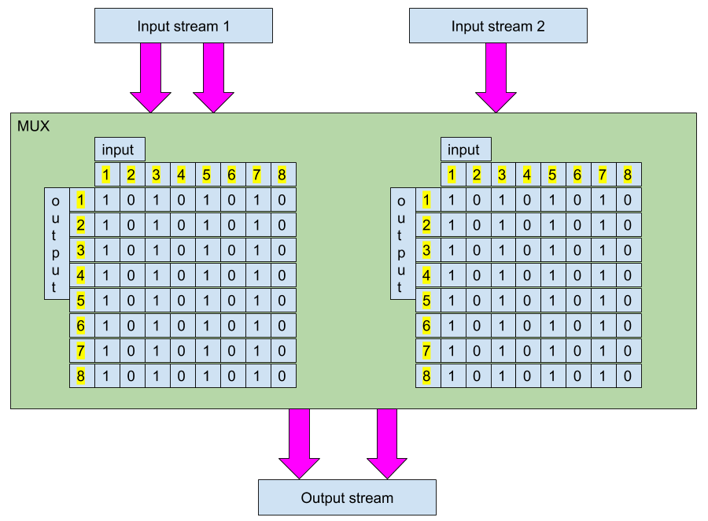
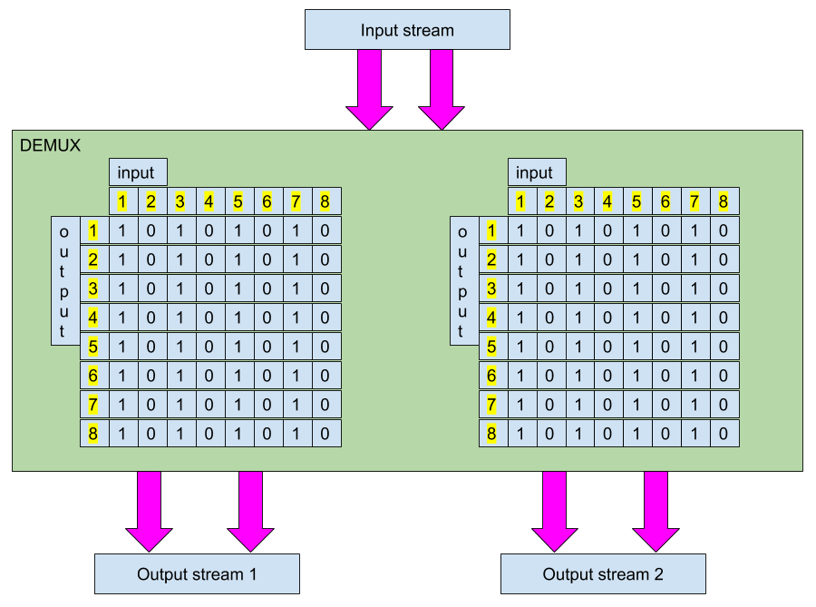

.. _demux:

Multiplexer/Demultiplexer
#########################

Introduction
************

The multiplexer/demultiplexer component copies its input audio channels
into output audio channels according to a specific routing
matrix. Multiplexer has multiple input audio streams and a single
audio output stream. Demultiplexer has a single input stream and
multiple output streams. In the SOF codebase, multiplexer and demultiplexer
are implemented in a single component as the operations and
configurations overlap heavily.

   Multiplexer has exactly 1 output stream and demultiplexer has exactly
   1 input stream.

Configuration
=============

The component configuration defines how audio channels are copied from
input to output stream. As the ASoC/SOF audio stream can have up to 8
audio channels, a stream-to-stream specific 8 x 8 routing matrix
defines the channel mapping from input to output. Because every stream
is fully configurable, we have a matrix for all multiplexer input
streams or all demultiplexer output streams. The 8 x 8 binary matrix takes up
to 64 bits and is controlled with eight unsigned char values.

   Example of multiplexer configuration matrices with 2 input streams.
   In this artificial mux example, Input stream 1’s channel 1 is copied
   to both output channels; Input stream 2’s single channel is copied
   to output channel 1.

   Example of demultiplexer configuration matrices with 2 output streams.
   In this artificial demux example, Input stream’s channel 1 is copied to
   all output streams channels (1 channel to 4 identical channels in 2
   output streams).

Using a routing matrix means also that this component can leave out
channels or mix multiple channels into one.

Topology
========

Previous figures show that the routing matrix is difficult to
parametrize in order to be easily understandable. As it is sent to firmware
with 64 bits, it is quite tedious to easily see the binary routings from
hexadecimal or integer values. SOF topology m4 macros have helpers to
"visualize" the matrix for easier configuration.

The following example from pipe-volume-demux-playback.m4 shows how to define
2 routing matrices and a demux component:

.. code-block:: text

		# pipeline_id, channels, matrix_rows
		define(matrix1, `ROUTE_MATRIX(PIPELINE_ID, 2,
					     `BITS_TO_BYTE(1, 0, 0 ,0 ,0 ,0 ,0 ,0)',
					     `BITS_TO_BYTE(0, 1, 0 ,0 ,0 ,0 ,0 ,0)',
					     `BITS_TO_BYTE(0, 0, 1 ,0 ,0 ,0 ,0 ,0)',
					     `BITS_TO_BYTE(0, 0, 0 ,1 ,0 ,0 ,0 ,0)',
					     `BITS_TO_BYTE(0, 0, 0 ,0 ,1 ,0 ,0 ,0)',
					     `BITS_TO_BYTE(0, 0, 0 ,0 ,0 ,1 ,0 ,0)',
					     `BITS_TO_BYTE(0, 0, 0 ,0 ,0 ,0 ,1 ,0)',
					     `BITS_TO_BYTE(0, 0, 0 ,0 ,0 ,0 ,0 ,1)')')

		# pipeline_id, channels, matrix_rows
		define(matrix2, `ROUTE_MATRIX(5, 2,
					     `BITS_TO_BYTE(1, 0, 0 ,0 ,0 ,0 ,0 ,0)',
					     `BITS_TO_BYTE(0, 1, 0 ,0 ,0 ,0 ,0 ,0)',
					     `BITS_TO_BYTE(0, 0, 1 ,0 ,0 ,0 ,0 ,0)',
					     `BITS_TO_BYTE(0, 0, 0 ,1 ,0 ,0 ,0 ,0)',
					     `BITS_TO_BYTE(0, 0, 0 ,0 ,1 ,0 ,0 ,0)',
					     `BITS_TO_BYTE(0, 0, 0 ,0 ,0 ,1 ,0 ,0)',
					     `BITS_TO_BYTE(0, 0, 0 ,0 ,0 ,0 ,1 ,0)',
					     `BITS_TO_BYTE(0, 0, 0 ,0 ,0 ,0 ,0 ,1)')')

		# frame_format, num_channels, num_streams, route_matrix
		MUXDEMUX_CONFIG(demux_priv, 2, 2, 2, LIST(`	', `matrix1,', `matrix2'))

		# demux Bytes control with max value of 255
		C_CONTROLBYTES(DEMUX, PIPELINE_ID,
			CONTROLBYTES_OPS(bytes, 258 binds the mixer control to bytes get/put handlers, 258, 258),
			CONTROLBYTES_EXTOPS(258 binds the mixer control to bytes get/put handlers, 258, 258),
			, , ,
			CONTROLBYTES_MAX(, 304),
			,
			demux_priv)

		# Mux 0 has 2 sink and source periods.
		W_MUXDEMUX(0, 1, PIPELINE_FORMAT, 2, 2, LIST(`	       ', "DEMUX"))

In the above example you can see that the routing matrices have only
"diagonal" 1's, which means that input stream's channels are copied to
corresponding output streams channels.

ALSA control
============

Multiplexer configuration is loaded in the kernel/firmware boot as part of
the ALSA binary control in topology, but can be also controlled through ALSA
controls.

The complex binary control blob can be created with a generic
python tool:

.. code-block:: python

		python sof_gen_blob.py -a 3 14 0 -t 18 -m 3H I 1B 8B 3B I 1B 8B 3B -v "2 2 2" "1" "2" "1 2 4 8 16 32 64 128" "0 0 0" "5" "1" "1 1 4 8 16 32 64 128" "0 0 0"

It produces the following output:

.. code-block:: text

		sof m4 and ALSA conf format:
		`       bytes "0x53,0x4f,0x46,0x00,0x12,0x00,0x00,0x00,0x3c,'
		`       0x00,0x00,0x00,0x00,0xe0,0x00,0x03,0x00,'
		`       0x00,0x00,0x00,0x02,0x00,0x02,0x00,0x02,'
		`       0x00,0x00,0x00,0x01,0x00,0x00,0x00,0x02,'
		`       0x01,0x02,0x04,0x08,0x10,0x20,0x40,0x80,'
		`       0x00,0x00,0x00,0x05,0x00,0x00,0x00,0x01,'
		`       0x01,0x01,0x04,0x08,0x10,0x20,0x40,0x80,'
		`       0x00,0x00,0x00,'

		sof ctl tool format:
		(4607827, 18, 60, 50388992, 0, 2, 2, 2, 1, 2, 1, 2, 4, 8, 16, 32, 64, 128, 0, 0, 0, 5, 1, 1, 1, 4, 8, 16, 32, 64, 128, 0, 0, 0)

The sof-ctl tool can be then used to set the parameters through ALSA control:

.. code-block:: bash

		sof-ctl -Dhw:0 -n 22 -s demux_coeffs.txt
