.. _equalizers_tuning:

Equalizers, IIR and FIR
#######################

.. contents::
   :depth: 3

Introduction
************

Frequency response is the system output level specific to a
frequency. It can be measured in acoustical, electrical analog, or
digital domain. Standards such as AES17 [1]_ define how it is measured
and reported.

The frequency response between e.g. 20 Hz and 20 kHz, that
is typical human max. range, is measured by sweeping signal generator
frequency and observing and recording the system output level into a
curve.

The speaker frequency responses can rarely be optimized by mechanical
and acoustical design in the mass market devices. The industrial
design and miniaturization typically limit the performance. The
non-flat frequency response is a form of linear distortion. It causes
the sound reproduction to be unnatural in a way that could be called
thin, dark, etc. Such systematic issues in speaker frequency response
can be improved with equalization.

Equalization is a simple technique that creates by signal processing
in an open loop pre-defined opposite linear distortion into signal to
cancel the linear distortion caused by speaker. However the cancel
cannot be perfect since the fixed equalization response need to be in
practice common for all production devices. Optimizing for one device
could cause another device to fail if the characteristic at that
frequency would differ. Hence the equalization can address only
systematic issues in the frequency response.  Also when applying
equalization the system performance is impacted. Equalization nearly
always reduces achievable peak sound pressure level (SPL) and reduces
system dynamic range (DR). When tuning the equalization the trade-offs
need to be considered.

The document describes speaker equalization. Microphones equalization
is similar but measurements are done in opposite domain: Acoustical ->
digital. In both cases use of calibrated reference microphone is
needed.

Preparations
************

The device should allow remote ssh without password for the automatic
scripts to work. Since the developers have usually their public and
private keys setup only this is needed. Find out the IP address from
ifconfig command output on your device.

.. code-block:: bash

		ssh-copy-id -i ~/.ssh/id_rsa.pub user@aa.bb.cc.dd

For ssh to work with low delay the development PC and tuned device
should be on the same local IP network. You can check that remote
playback works to DUT with example command:

.. code-block:: bash

		ssh user@aa.bb.cc.dd "aplay -l"

Since the tests are done with low-level ALSA aplay and arecord
utilities it is recommended to temporarily rename in DUT the audio
servers to disable them. Kill manually the processes or reboot to
avoid them continue running. The audio servers can be disabled from OS
system control in more elegant way but it is harder to remember how to
do it and restore to normal vs. the brute force way.

.. code-block:: bash

		cd /usr/bin
		sudo mv pulseaudio pulseaudio.disabled
		sudo mv pipewire pipewire.disabled

Frequency response measurement
******************************

Note: More professional audio analyzer systems are recommended to be
used for final tuning. The procedures described in this document are
for coarse initial settings. Final tuning, especially if dependence
to regulations and standards need to be done with care in professional
environment with calibrated measurement equipment.

To measure speakers an omnidirectional USB measurement microphone is
recommended, e.g. UMM6 [2]_ or UMIK-1 [3]_. Such microphones are
inexpensive and do not necessarily have a flat frequency response but
the manufacturers provide a serial number based downloadable
calibration file for them. The calibration can be applied to these
measurements in SOF as well by referencing the downloaded calibration
data to measurement script.

Next step up are analog condenser measurement microphones with a
high-end USB sound card that can provide the 48V phantom voltage. But
analog microphones add more calibration consideration for analog
level. The measurement microphones can be also calibrated for absolute
level with dedicated microphone calibrators those can output into the
sealed compartment a reference 94 dBSPL tone.

The tools for measurement and EQ design are in located in directory
$SOF_WORKSPACE/sof/tools/tune/eq. The test setup is such that the DUT
device plays back the measurement wav file via ssh commands and the
development PC connected USB microphone captures the output. To
achieve this the configuration files for playback and capture need to
be edited.

The capture device UMM6 is hw:3.0 (card 3, device 0), this can be seen
from output of arecord command on a the development PC example. We
also know that this device supports one capture channel.

.. code-block:: bash

		arecord -l
		**** List of CAPTURE Hardware Devices ****
		card 0: PCH [HDA Intel PCH], device 0: ALC257 Analog [ALC257 Analog]
		  Subdevices: 1/1
		  Subdevice #0: subdevice #0
		card 1: Ultra [Fast Track Ultra], device 0: USB Audio [USB Audio]
		  Subdevices: 1/1
		  Subdevice #0: subdevice #0
		card 2: Audio [ThinkPad Dock USB Audio], device 0: USB Audio [USB Audio]
		  Subdevices: 1/1
		  Subdevice #0: subdevice #0
		card 3: UMM6 [UMM-6], device 0: USB Audio [USB Audio]
		  Subdevices: 1/1
		  Subdevice #0: subdevice #0

The settings file

.. code-block:: bash

		$ cat mls_rec_config.txt
		%% Recording device configuration

		rec.ssh = 0;             % Set to 1 for remote capture
		rec.user = '';           % Set to user@domain for ssh
		rec.dir = '/tmp';        % Directory for temporary files
		rec.dev = 'hw:3,0';      % Audio capture device
		rec.nch = 1;             % Number audio capture channels to use

		% Use '' if calibration is not needed. Otherwise set to
		% e.g. '1234567.txt'. Such calibration data format is supported for
		% some reasonably priced measurement microphones. The ASCII text
		% calibration data file is the measured frequency response of the used
		% microphone. Lines in the beginning those start with character " are
		% treated as comment. The successive lines should be <frequency>
		% <magnitude> number pairs. Their unit must be Hz and dB.
		rec.cal = '';

Similarly check with remote aplay command the playback devices and
then edit the playback settings.

.. code-block:: bash

		ssh user@aa.bb.cc.dd "aplay -l"
		**** List of PLAYBACK Hardware Devices ****
		card 0: sofglkda7219max [sof-glkda7219max], device 0: Speakers (*) []
		  Subdevices: 1/1
		  Subdevice #0: subdevice #0
		card 0: sofglkda7219max [sof-glkda7219max], device 1: Headset (*) []
		  Subdevices: 1/1
		  Subdevice #0: subdevice #0
		card 0: sofglkda7219max [sof-glkda7219max], device 5: HDMI1 (*) []
		  Subdevices: 1/1
		  Subdevice #0: subdevice #0
		card 0: sofglkda7219max [sof-glkda7219max], device 6: HDMI2 (*) []
		  Subdevices: 1/1
		  Subdevice #0: subdevice #0
		card 0: sofglkda7219max [sof-glkda7219max], device 7: HDMI3 (*) []
		  Subdevices: 1/1
		  Subdevice #0: subdevice #0

On the DUT the speakers are provided by device hw:0,0. It's known that
there's two playback channels in the device.

.. code-block:: bash

		$ cat mls_play_config.txt
		play.ssh = 1;         % Set to use remote ssh commands
		play.user = 'user@aa.bb.cc.dd'; % Set user@domain for ssh
		play.dir = '/tmp';    % directory for temporary files
		play.dev = 'hw:0,0';  % Audio device for playback
		play.nch = 2;         % Number of playback channels to test

Next the measurement orientation and measurement microphone place is
considered. A notebook could be placed on top of a table symmetrically
where the measurement microphone location should be symmetrical to
display center axis. The microphone location could be near the center
of user’s ears. If the measurement microphone capture is too silent or
disturbed by ambient noise the microphone should be placed closer into
near field.

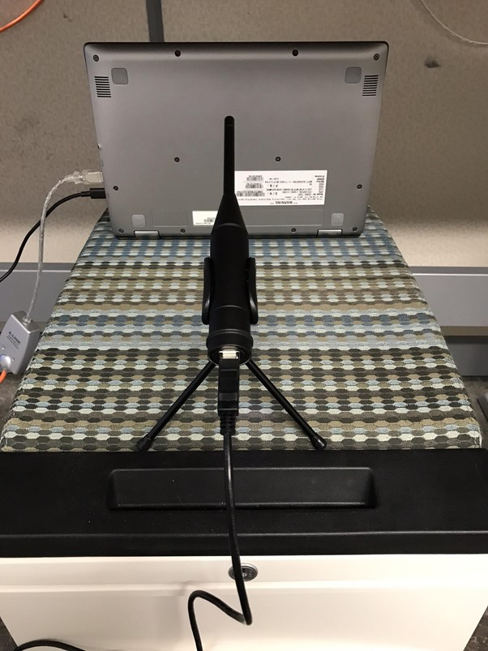

   On-axis measurement position for bottom located speakers.

Since this example device is a convertible type with a near 360 degree
display hinge there are several usage orientations. It was chosen to
measure the speakers from about their firing axis. Since the response
is impacted by orientation this was felt as safest choice. It also
gave the flattest looking frequency response.

The MLS measurement tolerates some noise but the more silent the
environment is the better it is. An anechoic chamber would be ideal
naturally. The used MLS signal sets stress for the speakers so start
with a low volume setting with “alsamixer -Dhw:0”. Find the speaker
playback volume control PGA or volume controlin speaker amplifier and
start with e.g. 50%.

Start Octave and launch the measurement

.. code-block:: octave

   [f, m] = mls_freq_resp('DUT');

If the script warns about too silent audio increase the volume and/or
bring the microphone closer to the device. If the device has small
speakers and test signal playback sounds like at being near to their
capability limit, it is best to ignore the warning. The speakers may
permanently damage if the playback is too loud.

If problems the script contains a self test for quick integrity
check. The self test measures a recursive filter that simulates a
non-flat response. The measurement and theoretical response that’s
computed directly from filter coefficients should match.

.. code-block:: octave

   [f, m] = mls_freq_resp('selftest');

The test signal contains two chirps and a few times repeated
pseudo-random numbers sequence. The chirps are used to locate and
extract the MLS part. The MLS sequence has such a characteristic the
the correlation with itself is minimal. The sufficient length of the
sequence is used to suppress room reverberation from the
measurement. It provides nearly similar measured frequency responses
as achieved in anechoic conditions. As in anechoic chamber the setup
should be as much as possible like free-field. The desk/stand where
the device is measured should be away from reflecting surfaces.

This MLS measurement would naturally also benefit from doing in
anechoic chamber since the MLS technique cannot eliminate all reverb
impact form measurement. Though usually in chambers there’s
professional equipment available like Audio Precision ® and other. If
such are available this measurement step with SOF can be avoided and
continued from next section for data import for tuning.

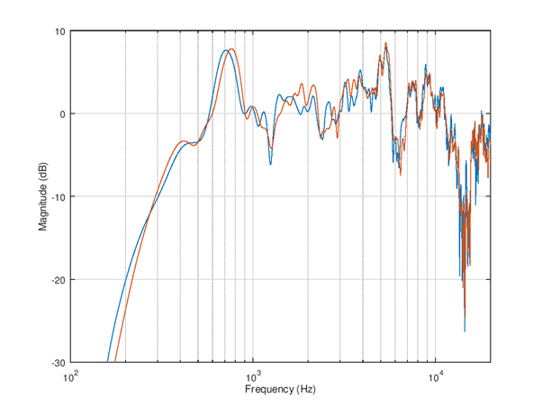

   Frequency response measurement. The first channel is aligned to 0
   dB at 1 kHz. The second channel is shown with true offset
   vs. first.

After a successful measurement a plot with frequency (Hz) and
magnitude (dB) as x and y axis will be shown. The variable f will
contain the frequency response and variable m the magnitude. If the
number of measured channels was larger than 1 the m is a matrix. The
result can be saved for equalizer design into a .mat file.

.. code-block:: octave

		save example_dut.mat f m

Equalizer design
****************

It can be seen from the picture that the output of speakers is weak at
below 200 Hz. There’s two resonances, first at about 700 Hz and second
at about 5 kHz (better visible on table orientation). The response is
within -10 .. +10 dB in about 300 - 13000 Hz range. The equalization
should not be applied outside these frequencies to avoid a large loss
of SPL. It can be also seen that the left and right speaker have
slightly different frequency response.

Next the measurement data is imported to SOF. It can be done by load
of previously saved file or importing e.g. in MS Excel format from
other equipment. The matrix columns for frequency and channel specific
levels need to be known.

The tool in SOF is a set of functions to be used in user created
script. Therefore programming knowledge is needed. The benefit of
using script is the procedure is easy to repeat and documented by
itself.

FIR equalizer
*************

The finite impulse response (FIR) filter type has the advantages that
design for any finite time impulse response / frequency response is
simple and robust. The filters do not oscillate by design so the
rounding errors do not appear as noise. The rounding of coefficients
into a fixed word length only impairs slightly the response but the
effect can be usually ignored. Therefore the FIR equalizers especially
when used with 24 and 32 bit audio format are compatible with studio
like 24 bit audio quality.

Due finite response (often limited by DSP resources) the FIR filters
are not practical for lowest frequencies unless very long filters are
used. The longer the filter is the more DSP RAM and MCPS the
processing consumes. However FIR filters are great for mid and high
frequencies equalization. The next example equalizes those frequencies
for the previously done measurement.

The initial script for tuning is shown below. Alternatively for other
equipment the data import could be done in Excel format and use
function xlsread(); to read a matrix and then extract the frequency
and magnitude columns.

.. code-block:: octave

		%% Load measurement data, variable f and m
		load example_dut.mat;

		%%  EQ settings
		eq1 = eq_defaults();         % Get defaults
		eq1.fs = 48e3;               % Set sample rate
		eq1.norm_type = 'loudness';  % Normalize criteria can be loudness/peak/1k
		eq1.norm_offs_db = -3;       % Offset in dB to normalize, -3dB loudness
		eq1.logsmooth_plot = 1.0;    % Smooth over 1.0 octaves
		eq1.logsmooth_eq = 1.0;      % Smooth over 1.0 octaves
		eq1.enable_fir = 1;          % By default both FIR and IIR disabled
		eq1.fir_beta = 3.0;          % Lower beta is more accurate but be careful
		eq1.fir_length = 90;         % Minimize this vs. fmin/fmax choice
		eq1.fir_autoband = 0;        % Select manually frequency limits
		eq1.fmin_fir = 700;          % Equalization starts from 800 Hz
		eq1.fmax_fir = 13e3;         % Equalization ends at 13 kHz
		eq1.fir_minph = 1;           % Check result carefully if 1 is used, 0 is safe
		eq2 = eq1;                   % Copy settings to second EQ

		%% Design left channel EQ
		eq1.raw_f = f;               % Measurement Hz
		eq1.raw_m_db = m(:,1);       % Measurement dB, left ch
		eq1 = eq_compute(eq1);
		eq_plot(eq1, 10);

The run of this script creates these plots. Note the choice of 1.0
octaves smoothing for both plotting and EQ target derivation. It’s
best to start carefully with such a high amount of smoothing to avoid
to equalize highly uncertain details of frequency response.

The smoothed version of the response becomes very flat in the
equalized version. However the simulated raw response still contains a
lot of ripple especially at high bands. It’s an industry standard to
use ⅓ octaves smoothing since it quite well matches human ear
psycho-acoustics. Therefore ⅓ octaves should be the smallest feasible
width of octaves smoothing to use.

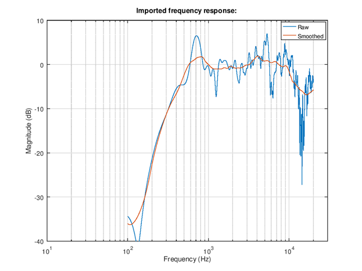

   Imported frequency response with and without octaves
   smoothing. Note that the strong 1.0 octaves wide smoothing
   “flattens” most of the narrow (high Q) resonances and leaves the
   two mentioned resonances at 700 Hz and 4 kHz.

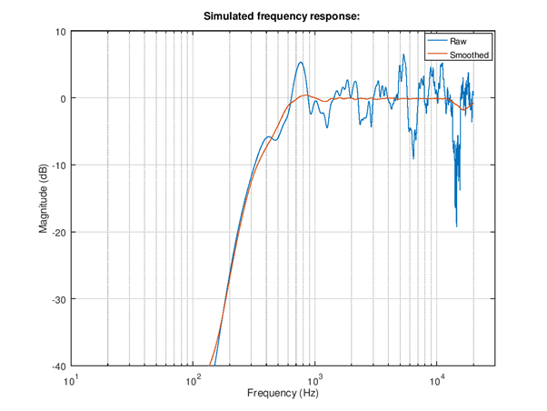

   Simulated frequency response after equalization

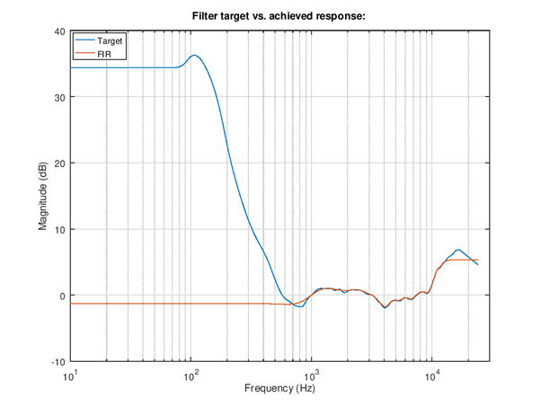

   Frequency response of equalizer. The blue curve is the ideal
   inverse response including the smoothing. The red curve is the band
   limited and filter design parameters constrained actual EQ
   response. The y-axis is offset in such way that 1 kHz frequency is
   shifted to 0 dB. Try the impact of filter length to see how it
   impacts the accuracy and find a fair compromise.

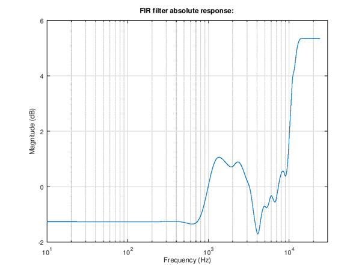

   Frequency response of equalizer. This curve shows the absolute gain
   of the equalization. It can be seen that the normalization of
   loudness (-3 dB) does some fairly high gain above 10 kHz. The
   attenuation of frequencies below 200 Hz may or may not be
   sufficient to give signal headroom for this boost. Need to watch
   out for distortion in playback, if observed the loudness need to be
   decreased.

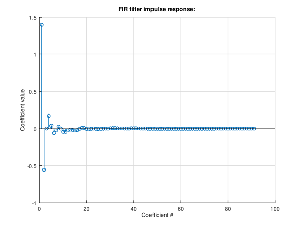

   Impulse response of equalizer. The chosen minimum phase
   non-symmetrical impulse response can be seen in the shape. A linear
   phase response would have symmetrical pre- and post oscillation in
   the impulse response.

Add of right channel measurement import and EQ design is done by
adding these lines to above script.

.. code-block:: octave

		%% Design right channel EQ
		eq2.raw_f = f;               % Measurement Hz
		eq2.raw_m_db = m(:,2);       % Measurement dB, right ch
		eq2 = eq_compute(eq2);
		eq_plot(eq2, 20);

The resulting EQ can be seen from these plots. If the left and right
channel results are different need to know if it is due to
non-symmetrical mechanics. If there’s designed non-symmetry it’s safe
to go ahead and design different EQ for left and right channels. If
the hardware is symmetrical then it is likely to better to equalize
e.g. average response of left and right instead.

Note: The left and right responses are quite similar. The mechanics &
acoustics is likely symmetrical so a common EQ could be the best
choice. The average of left and right response could be suitable to
use. However in this in this case the design is done as stereo for
tutorial purpose.

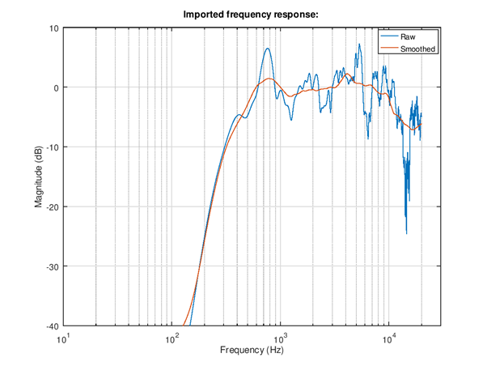

   Import right channel frequency response.

   Simulated  response of equalizer.

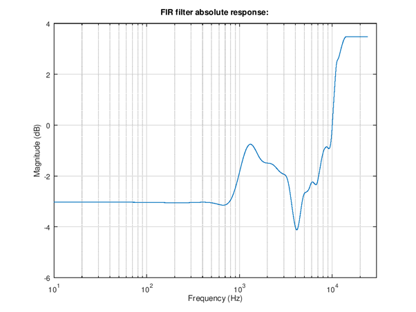

   Frequency response of the right channel filter. Notice the difference to left channel filter.

The next step is to check the stereo EQ design. The left and right
channels should as equalized have similar loudness. Since the SOF tool
currently does not add much help to multi-channel design this step
needs some additional own code.

.. code-block:: octave

		%% Stereo EQ
		figure(30);
		l_ch = eq1.m_db+eq1.fir_eq_db;
		r_ch = eq2.m_db+eq2.fir_eq_db;
		semilogx(eq1.f, l_ch, eq2.f, r_ch);
		grid on;
		axis([100 20e3 -20 10]);
		xlabel('Frequency (Hz)');
		ylabel('Magnitude (dB)');

		%% Calculate level offset at 1 - 4 kHz from RMS
		idx0 = find(eq1.f < 4e3);
		idx = find(eq1.f(idx0) > 1e3);
		l_lev = 20*log10(sqrt(mean(10.^(l_ch(idx)/10))));
		r_lev = 20*log10(sqrt(mean(10.^(r_ch(idx)/10))));
		fprintf('L ch level %3.1f dB\n', l_lev);
		fprintf('R ch level %3.1f dB\n', r_lev);
		delta_lev = l_lev-r_lev;
		fprintf('delta %3.1f dB\n', delta_lev);

The plot shows the raw data plus EQ impact. Since the offset is hard
to judge from the non-smoothed plot (the smoothed data is
unfortunately for this purpose 1 kHz, 0 dB aligned) the offset is
computed from RMS level difference in 1 - 4 kHz band. In this example
the difference was 0.2 dB. The offset is next added to right channel
align.

.. code-block:: octave

		%% Design right channel EQ
		eq2.norm_offs_db = -3 + 0.2; % Offset in dB to normalize, -3dB plus L-R
		eq2.raw_f = f;               % Measurement Hz
		eq2.raw_m_db = m(:,2);       % Measurement dB, right ch
		eq2 = eq_compute(eq2);
		eq_plot(eq2, 20);

.. figure:: Picture_simulated_left_and_right_channel_responses.png
   :width: 600

   Simulated frequency responses of left and right speaker channels.

The complete tuning script is shown below for completeness. It can be a
starting point for your own stereo speaker equalizer design case!

.. code-block:: octave

	%% Load measurement data, variable f and m
	load example_dut.mat;

	%%  EQ settings
	eq1 = eq_defaults();         % Get defaults
	eq1.fs = 48e3;               % Set sample rate
	eq1.norm_type = 'loudness';  % Normalize criteria can be loudness/peak/1k
	eq1.norm_offs_db = -3;       % Offset in dB to normalize, -3dB loudness
	eq1.logsmooth_plot = 1.0;    % Smooth over 1.0 octaves
	eq1.logsmooth_eq = 1.0;      % Smooth over 1.0 octaves
	eq1.enable_fir = 1;          % By default both FIR and IIR disabled
	eq1.fir_beta = 3.0;          % Lower beta is more accurate but be careful
	eq1.fir_length = 90;         % Minimize this vs. fmin/fmax choice
	eq1.fir_autoband = 0;        % Select manually frequency limits
	eq1.fmin_fir = 700;          % Equalization starts from 800 Hz
	eq1.fmax_fir = 13e3;         % Equalization ends at 20 kHz
	eq1.fir_minph = 1;           % Check result carefully if 1 is used, 0 is safe
	eq2 = eq1;                   % Copy settings to second EQ

	%% Design left channel EQ
	eq1.raw_f = f;               % Measurement Hz
	eq1.raw_m_db = m(:,1);       % Measurement dB, left ch
	eq1 = eq_compute(eq1);
	eq_plot(eq1, 10);

	%% Design right channel EQ
	eq2.norm_offs_db = -3 + 0.2; % Offset in dB to normalize, -3dB plus L-R
	eq2.raw_f = f;               % Measurement Hz
	eq2.raw_m_db = m(:,2);       % Measurement dB, right ch
	eq2 = eq_compute(eq2);
	eq_plot(eq2, 20);

	%% Stereo EQ
	figure(30);
	l_ch = eq1.m_db+eq1.fir_eq_db;
	r_ch = eq2.m_db+eq2.fir_eq_db;
	semilogx(eq1.f, l_ch, eq2.f, r_ch);
	grid on;
	axis([100 20e3 -20 10]);
	xlabel('Frequency (Hz)');
	ylabel('Magnitude (dB)');

	%% Calculate level offset at 1 - 4 kHz from RMS
	idx0 = find(eq1.f < 4e3);
	idx = find(eq1.f(idx0) > 1e3);
	l_lev = 20*log10(sqrt(mean(10.^(l_ch(idx)/10))));
	r_lev = 20*log10(sqrt(mean(10.^(r_ch(idx)/10))));
	fprintf('L ch level %3.1f dB\n', l_lev);
	fprintf('R ch level %3.1f dB\n', r_lev);
	delta_lev = l_lev-r_lev;
	fprintf('delta %3.1f dB\n', delta_lev);

IIR equalizer
*************

Infinite impulse response (IIR) filter is the other main filter type
for equalization. Here it’s described after FIR because despite the
simpler look (much lower filter orders needed) using them needs more
expertise. An IIR design can fail fatally if not used with care and
plenty of testing. Therefore it is recommended to use simple low order
filters and do the more complex response manipulation with FIR. The
risks of IIR are in stability (unwanted loud oscillation), noise, and
loss of SNR due to scaling need. However IIR filters are great for
enhancing frequency response at lowest frequencies and generally doing
stronger adjustment.

The tool in SOF does not support automatic design. Instead the design
is manual with parametric first and second order blocks. The second
order blocks are called often bi-quads. The parametric blocks are
specified by their type (high-pass, low-pass, low-shelf, high-shelf,
peak/notch). The shelving and peaking filters are second order. The
high-pass and low-pass filters can be first or second order. Therefore
the parametric blocks are called with abbreviations HP1, HP2, LP1,
LP2, LS2, HS2, and PN2. All parametric blocks have a resonant
frequency parameter in Hz. The shelving filters and peaking filters
have also gain in Decibels as parameter. Finally the peaking filter
has a Q-value parameter. The higher the Q-value is the narrower is the
resonance. The syntax for describing parametric EQ is shown below:

.. code-block:: octave

	eq1.peq =  [ eq1.PEQ_HP2  200    0   0 ; ...
                     eq1.PEQ_PN2  750 -5.0 1.3 ; ...
                     eq1.PEQ_PN2 5000 -4.0 0.6 ; ...
		   ];

The example can be equalized with IIR only. First, since there is very
little output from the speaker below 200 Hz we can with second order
high-pass suppress the not audible frequencies from output. It
increases the headroom for equalization a lot since typical music and
speech content has large energy there. Then, a peaking EQ is set to
attenuate the 750 Hz region by 5 dB and Q-value 1.3 for flatter
response. Finally, a peaking filter is set to attenuate the wide bump
at 5 kHz by 4 dB and Q-value 0.6. The resulting EQ is 6th order. It
also could be possible to boost the low frequencies at 400 Hz a bit
with a low-shelf but it is not done here to keep filter order
low. Boost at low frequencies creates risk for signal clipping while
the achievable bandwidth extension is not large.

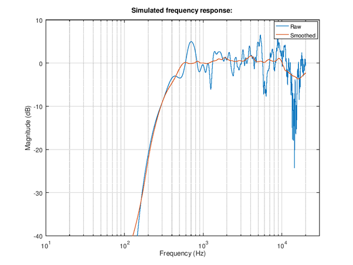

   Simulated frequency response. The difference in parametric
   low-order IIR can be seen as more remaining small ripple in the
   smoothed equalized response vs. FIR.

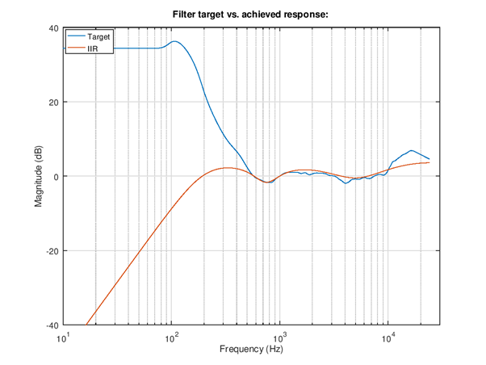

   IIR filter response vs. ideal target.

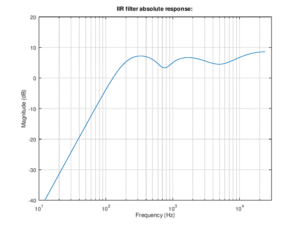

   Absolute response. The loudness normalize suggests a fairly high
   gain for the filter since a lot of loudness is lost due to suppress
   of lowest frequencies. Need to be careful with this.

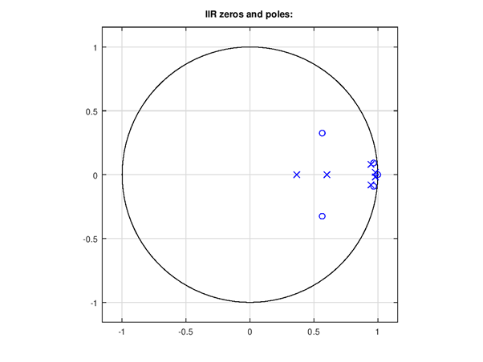

   Poles and zeros plot. In recursive filters the poles (x) need to be
   inside unit circle for stable design. This plot is for 64 bit float
   coefficients, fixed scaled coefficients could have issues even if
   this looks OK.

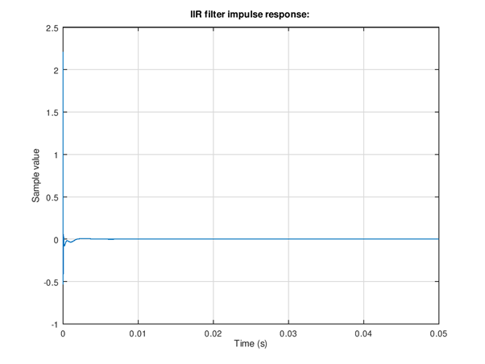

   Impulse response. The main purpose of this to do another stability
   check. A stable filter decays to zero while an unstable design
   might remain oscillation at steady or increasing amplitude.

The right channel is tuned similarly. The resulting non-smoothed
left/right balance corrected responses and the complete code for
tuning are shown below.

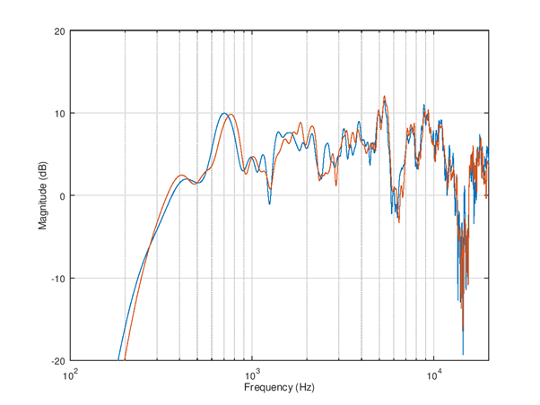

   Simulated frequency responses of left and right speakers with
   IIR equalizer.

.. code-block:: octave

		%% Load measurement data, variable f and m
		load example_dut.mat;

		%%  EQ settings
		eq1 = eq_defaults();         % Get defaults
		eq1.fs = 48e3;               % Set sample rate
		eq1.norm_type = 'loudness';  % Normalize criteria can be loudness/peak/1k
		eq1.norm_offs_db = -3;       % Offset in dB to normalize, -3 dB loudness
		eq1.logsmooth_plot = 1.0;    % Smooth over 1.0 octaves
		eq1.logsmooth_eq = 1.0;      % Smooth over 1.0 octaves
		eq1.enable_iir = 1;          % By default both FIR and IIR disabled
		eq2 = eq1;                   % Copy settings to second EQ

		%% Design left channel EQ
		eq1.raw_f = f;               % Measurement Hz
		eq1.raw_m_db = m(:,1);       % Measurement dB, left ch
		eq1.peq =  [ eq1.PEQ_HP2  200    0   0 ; ...
		             eq1.PEQ_PN2  750 -5.0 1.3 ; ...
		             eq1.PEQ_PN2 5000 -4.0 0.6 ; ...
		];
		eq1 = eq_compute(eq1);
		eq_plot(eq1, 10);

		%% Design right channel EQ
		eq2.norm_offs_db = -3 + 0.1; % Offset in dB to normalize, -3dB plus L-R
		eq2.raw_f = f;               % Measurement Hz
		eq2.raw_m_db = m(:,2);       % Measurement dB, right ch
		eq2.peq =  [ eq2.PEQ_HP2  200    0   0 ; ...
		             eq2.PEQ_PN2  750 -5.0 1.4 ; ...
		             eq2.PEQ_PN2 4500 -4.0 0.6 ; ...
		];
		eq2 = eq_compute(eq2);
		eq_plot(eq2, 20);

		%% Stereo EQ
		figure(30);
		l_ch = eq1.m_db+eq1.iir_eq_db;
		r_ch = eq2.m_db+eq2.iir_eq_db;
		semilogx(eq1.f, l_ch, eq2.f, r_ch);
		grid on;
		axis([100 20e3 -20 20]);
		xlabel('Frequency (Hz)');
		ylabel('Magnitude (dB)');

		%% Calculate level offset at 1 - 4 kHz from RMS
		idx0 = find(eq1.f < 4e3);
		idx = find(eq1.f(idx0) > 1e3);
		l_lev = 20*log10(sqrt(mean(10.^(l_ch(idx)/10))));
		r_lev = 20*log10(sqrt(mean(10.^(r_ch(idx)/10))));
		fprintf('L ch level %3.1f dB\n', l_lev);
		fprintf('R ch level %3.1f dB\n', r_lev);
		delta_lev = l_lev-r_lev;
		fprintf('delta %3.1f dB\n', delta_lev);

Combined IIR and FIR
********************

The EQ tool can support use of both types simultaneously. The IIR type
is applied first and the impact is subtracted from the target. This
allows the FIR to fine tune the response where IIR could not match
fully the target.

For this example the IIR high shelf is left out because FIR can do it
efficiently. Instead of boosting at 2 kHz this script tests
attenuation at 700 Hz to flatten and extend a bit the flat frequency
response region down.

Note: In current version the norm_offs_db parameter impacts both FIR
and IIR part by the given amount. Therefore the level adjust need to
be entered as 0.5*adjust.

.. figure:: Picture_IIR_FIR_target_vs_achieved_response.png
   :width: 600

   Right channel equalization filters. The red solid plot is the combined IIR and FIR response
   that matches well the smoothed target response in solid blue. The dashed yellow and purple
   lines show the IIR and FIR responses.

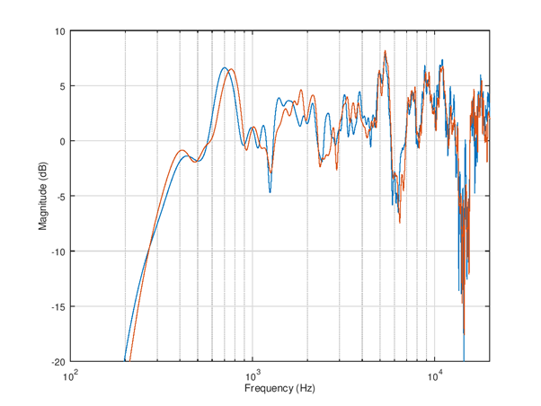

   Simulated raw frequency response

Exporting coefficients to SOF
*****************************

The coefficients can be exported into a format for m4 topology for
automatic boot time setup. The topology file can include the m4
scripts instead of the default “flat” response coefficients. It is
also possible to set up an equalizer with .txt or .bin format blob in
device run-time with sof-ctl utility to test the response and iterate
the design.

The complete script for equalizers tuning and coefficients export for
the previous example is shown below.

.. code-block:: octave

		%% Load measurement data, variable f and m
		load example_dut.mat;

		%%  EQ settings
		eq1 = eq_defaults();         % Get defaults
		eq1.fs = 48e3;               % Set sample rate
		eq1.norm_type = 'loudness';  % Normalize criteria can be loudness/peak/1k
		eq1.norm_offs_db = -3;       % Offset in dB to normalize, -3dB loudness
		eq1.logsmooth_plot = 1.0;    % Smooth over 1.0 octaves
		eq1.logsmooth_eq = 1.0;      % Smooth over 1.0 octaves
		eq1.enable_fir = 1;          % By default both FIR and IIR disabled
		eq1.enable_iir = 1;          % Enable too
		eq1.fir_beta = 3.0;          % Lower beta is more accurate but be careful
		eq1.fir_length = 40;         % Minimize this vs. fmin/fmax choice
		eq1.fir_autoband = 0;        % Select manually frequency limits
		eq1.fmin_fir = 700;          % Equalization starts from 800 Hz
		eq1.fmax_fir = 13e3;         % Equalization ends at 13 kHz
		eq1.fir_minph = 1;           % Check result carefully if 1 is used, 0 is safe
		eq2 = eq1;                   % Copy settings to second EQ

		%% Design left channel EQ
		eq1.raw_f = f;               % Measurement Hz
		eq1.raw_m_db = m(:,1);       % Measurement dB, left ch
		eq1.peq =  [ eq1.PEQ_HP2 200    0   0 ; ...
		             eq1.PEQ_PN2 750 -5.0 1.3 ; ...
		];
		eq1 = eq_compute(eq1);
		eq_plot(eq1, 10);

		%% Design right channel EQ
		eq2.norm_offs_db = -3 + 0.1; % Offset in dB to normalize, -4dB plus L-R
		eq2.raw_f = f;               % Measurement Hz
		eq2.raw_m_db = m(:,2);       % Measurement dB, right ch
		eq2.peq =  [ eq2.PEQ_HP2 200    0   0 ; ...
		             eq2.PEQ_PN2 750 -5.0 1.4 ; ...
		];
		eq2 = eq_compute(eq2);
		eq_plot(eq2, 20);

		%% Stereo EQ
		figure(30);
		l_ch = eq1.m_db+eq1.tot_eq_db;
		r_ch = eq2.m_db+eq2.tot_eq_db;
		semilogx(eq1.f, l_ch, eq2.f, r_ch);
		grid on;
		axis([100 20e3 -20 10]);
		xlabel('Frequency (Hz)');
		ylabel('Magnitude (dB)');

		%% Calculate level offset at 1 - 4 kHz from RMS
		idx0 = find(eq1.f < 4e3);
		idx = find(eq1.f(idx0) > 1e3);
		l_lev = 20*log10(sqrt(mean(10.^(l_ch(idx)/10))));
		r_lev = 20*log10(sqrt(mean(10.^(r_ch(idx)/10))));
		fprintf('L ch level %3.1f dB\n', l_lev);
		fprintf('R ch level %3.1f dB\n', r_lev);
		delta_lev = l_lev-r_lev;
		fprintf('delta %3.1f dB\n', delta_lev);

		%% Export FIR
		fir_ascii_fn = 'dut_spk_fir.txt';
		fir_tplg_fn = 'dut_spk_fir.m4';
		fir_eq1_quant = eq_fir_blob_quant(eq1.b_fir);
		fir_eq2_quant = eq_fir_blob_quant(eq2.b_fir);
		channels_in_config = 2;    % Setup max 2 channels EQ
		assign_response = [0 1];   % Switch to response #0 and #1
		num_responses = 2;         % Two responses
		fir_bm = eq_fir_blob_merge(channels_in_config, ...
		num_responses, ...
		assign_response, ...
		[fir_eq1_quant fir_eq2_quant]);
		fir_bp = eq_fir_blob_pack(fir_bm);
		eq_alsactl_write(fir_ascii_fn, fir_bp);
		eq_tplg_write(fir_tplg_fn, fir_bp, 'FIR');

		%% Export IIR
		iir_ascii_fn = 'dut_spk_iir.txt';
		iir_tplg_fn = 'dut_spk_iir.m4';
		iir_eq1_quant = eq_iir_blob_quant(eq1.p_z, eq1.p_p, eq1.p_k);
		iir_eq2_quant = eq_iir_blob_quant(eq2.p_z, eq2.p_p, eq2.p_k);
		iir_bm = eq_iir_blob_merge(channels_in_config, ...
		num_responses, ...
		assign_response, ...
		[iir_eq1_quant iir_eq2_quant]);
		iir_bp = eq_iir_blob_pack(iir_bm);
		eq_alsactl_write(iir_ascii_fn, iir_bp);
		eq_tplg_write(iir_tplg_fn, iir_bp, 'IIR');

Testing the response with sof-ctl
*********************************

The sof-ctl tool is practical for testing new EQ settings and iterate
the design without need to reboot the device. The pre-requisite is that
the DUT runs for speaker path a topology that contains the IIR and FIR
equalizers. 

First the numids of the equalizers are found out with amixer
command. The lines with prompt $ are user entered commands and other
text shown is command output.

.. code-block:: bash

	$ amixer -Dhw:0 controls | grep EQIIR
	numid=66,iface=MIXER,name='EQIIR1.0 EQIIR'
 
	$ amixer -Dhw:0 controls | grep EQFIR
	numid=67,iface=MIXER,name='EQFIR1.0 EQFIR'

The numids are in this device 66 and 67 for IIR and FIR. Next the
exported ALSA binary controls are passed to equalizers with sof-ctl:

.. code-block:: bash

	$ ./sof-eqctl -n 66 -s dut_spk_iir.txt 
	Applying configuration "dut_spk_iir.txt" into device hw:0 control numid=66. 

	4607827,0,196,50331648,0,0,0,0,196,2,2,0,0,0,0,0,1,2,2,0,0,0,0,3260252783,2107733822,
	528275171,3238416955,528275171,0,16384,3324016838,2034846530,497901563,3275128193,
	526872106,4294967293,20454,2,2,0,0,0,0,3260252783,2107733822,528275171,3238416955,
	528275171,0,16384,3317002057,2041827532,500647939,3271629404,527641448,4294967293,20551 

	Success. 

	$ ./sof-eqctl -n 67 -s dut_spk_fir.txt 
	Applying configuration "dut_spk_fir.txt" into device hw:0 control numid=67. 

	4607827,0,244,50331648,0,0,0,0,244,131074,0,0,0,0,65536,44,0,0,0,0,3801503801,233243489,
	4293068324,74908123,1901269,7733144,6422742,4290772934,17039467,1114313,4293328827,
	4291756033,4289658785,4291297224,4293459912,589833,4294115318,4294246391,4294442989,
	1310731,13,0,44,0,0,0,0,3785054386,221118972,13436579,74515002,8520459,10551247,10944817,
	4292018112,23789790,4291559609,4293984167,4288479207,4290576265,4293394406,131047,1179673,
	4293853177,4293853167,4294901744,851980,6,0 

	Success. 

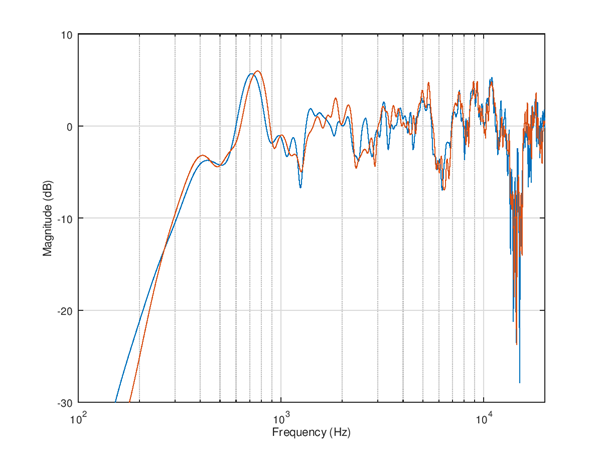

   The response is simple to test acoustically by re-running
   mls_freq_resp(); The overall response is now much more flat and is
   very similar to previously shown simulated response.

Using the EQ settings in topology
*********************************

The generated .m4 suffix files for FIR and IIR can be included or
embedded into topology m4 scripts. There are a few examples of such
topologies in $SOF_WORKSPACE/sof/tools/topology/topology1/development.
The CMakeLists.txt file builds e.g. topologies
sof-cml-rt1011-rt5682-eq.tplg and sof-hda-generic-2ch-loud.tplg those
can be used as example.

The playback pipeline is set with -DSPKPROC=eq-iir-eq-fir-volume
or -DHSPROC=eq-iir-eq-fir-volume to contain the equalizers and volume
control components. The macros -DHSPROC_FILTER1=eq_iir_coef_pass.m4
and -DHSPROC_FILTER2=eq_fir_coef_pass.m4 are flat default responses.

Setting -DHSPROC_FILTER1=dut_spk_iir.m4 and
-DHSPROC_FILTER2=dut_spk_fir.m4 would set the just exported equalizer
tuning to be applied at device boot.

Note: Unfortunately the SOF topology1 equalizers definitions at top
CMakeLists.txt are not very systematic and there may be bugs with some
platforms triggered by small topology changes. The new topology needs
extensive testing for all audio endpoints (that other existing filters
are not modified) and preferably manual inspection of topology .conf
file that the m4 parsed output matches expectation.

The development now focuses to to topology2 and hopefully this part
can be cleaned up and made easier for product audio tuning.

References
**********

.. [1] AES17-2020: AES standard method for digital audio engineering - Measurement of digital audio equipment,
       https://www.aes.org/publications/standards/search.cfm?docID=21

.. [2] Dayton audio UMM-6 USB measurement microphone,
       https://www.daytonaudio.com/product/1116/umm-6-usb-measurement-microphone

.. [3] MiniDSP UMIK-1 USB measurement microphone,
       https://www.minidsp.com/products/acoustic-measurement/umik-1
