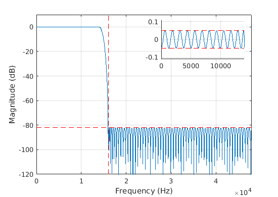
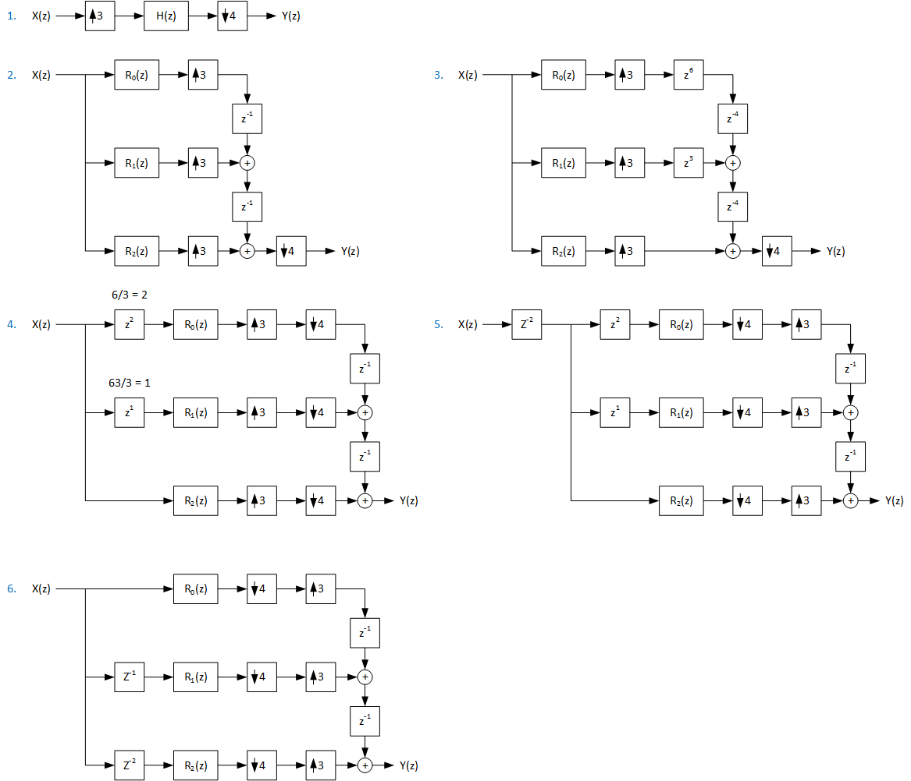

.. _sample_rate_conversion:

Sample Rate Conversion
######################

Introduction
************

The sample rate converter (SRC) component utilizes FIR polyphase
decomposition that is described in [1]_. In a linear system the order
of operations can be altered while preserving the transfer function
from system input to output. The purpose of polyphase optimization is
to move the processing operations to lowest sample rate possible and
omit computing of intermediate results those would be discarded. The
benefit of polyphase conversion is capability to scale to very high
quality like true 24 bit studio quality, since the filtering is a
linear operation and the performance depends on the time-invariant
filter characteristics. The algorithm does not limit the audio
conversion quality.

The SRC component is synchronous type that converts the rates with
exact rational M/N fraction and cannot adjust for any small drift of
sample rate. Per every call to SRC the algorithm consumes exactly N
input samples and M output samples.

As an example if input to SRC is 11025 Hz and output is 48000 Hz the
fraction for conversion is 640/147. For every 147 input samples there
are 640 output samples at 48 kHz. Such processing block would require
13.3 ms of buffering. To shorten the latency and ease the conversion
fractions some of the conversions are executed in two stages. The
fraction 640/174 can be factored as 32/21*20/7. With the two fractions
approach the SRC will input with 21 frames granularity and output with
20 frames granularity. The internal buffer between the stages places
an internal constraing for processing block sizes. Still the approach
provides much shorter latency than using a single fraction.

In some cases it might be possible to design and use a converter that
is intentionally non-exact. E.g. 48000/11000 conversion that is a lot
easier faction 48/11 and provides much lower SRC latency. But use of
such approximation with as low as 0.2% error would result to
systematic slow drift of audio presentation so it is not
recommended. Fortunately conversions in the 48 kHz family rates such
as 32 kHz to 48 kHz is much lower latency with the 3/2 fraction with
need for only 63 us additional buffer.

Note: Another asynchronous SRC (ASRC) type is needed when the ratio
drifts during time or if a M/N fraction does not exist within required
conversion precision or if the fraction requires too complex filters
to handle with very large M or N.

Use of SRC generator tool
*************************

Prerequisites
=============

GNU Octave tool or Matlab® is needed to run the support scripts. In
Ubuntu desktop the Octave and required signal package can be installed
from stock apt repository with the following command.

.. code-block:: bash

   sudo apt-get install octave octave-signal

Octave users need to create a file into home directory called
.octaverc. The file should contain next lines to load the signal
package and disable the pager (need to press space key while the
scripts print intermediate information about progress).

.. code-block:: octave

		more off
		pkg load signal

Basic usage
===========

First an Octave shell is launched from the tool directory:

.. code-block:: bash

		cd tools/tune/src
		octave --gui
		
SRC component is set up with script src_generate.m. A help for
script usage is printed with Octave shell command:

.. code-block:: octave

   >> help src_generate

To create SRC coefficients for input rates 32, 44.1, and 48 kHz and
output rates 44.1 and 48 kHz command would be

.. code-block:: octave

   >> src_generate([32e3 48e3],[44.1e3 48e3])

If the script is called without arguments in computes a larger set of
default conversions. The text output in the end of script reports the
fractions M/N used for conversions, and estimated millions of
operations per second (MOPS) for filter arithmetic. Some more complex
fractions are handled with M1/N1 x M2/N2 two stage conversion to ease
internal filters computation. In the end estimate of coefficient
storage RAM and component data RAM are shown.

.. literalinclude:: src_2stage.txt
		    :language: none

This same output is stored into text file reports/src_2stage.txt to
keep record of generated conversions.

To apply the generated coefficients to SOF firmware the execution of
this script outputs to directory “include” the C header files. They
can be then copied as such to SOF source directory
src/include/sof/audio/coefficients/src/ . In these header files
src_<ctype>_define.h contains #define statements for some SRC filter
maximum characteristics. The header file src_<ctype>_table.h includes
all needed individual filter header files and constructs a table of
SRC stages to use when a mode with certain input and output rate is
initialized. The missing conversions refer to a minimal pass-through
filter setup. An example of generated include file “src_std_int32_table.h”
is shown below.

.. literalinclude:: src_std_int32_table.h
		    :language: c

The header file first includes the coefficient vectors. The last four
values in the file names are for fraction, passband end relative to
sample rate x1000, stop band start relative to sample rate x1000. Many
of the conversions are reused for other rates combinations with same
fractions.

The vectors src_in_fs and src_out_fs list supported input and output
rates. The arrays of structs src_table1 and src_table2 refer to the
FIR filters coefficients used for the rates matrix. A special single
tap FIR with coefficient 1.0 (Q2.30) is used when filtering is not
needed. E.g. when input and output rate are equal or if a SRC stage is
not used.

Coefficient precision
=====================

The coefficients can be generated as int16, int24, int32 or float
type. The type is the 3rd argument for src_2stage(in_rates, out_rates,
ctype) function call. It defaults to ‘int16’ that is the least memory
consuming type that provides the minimum quality.  The 16 bit
coefficients may achieve near up to 80-90 dB stopband that will give
“near CD quality” conversion. The int32 and float type are capable to
provide “CD quality” and better with a higher filter spec that is
explained later.

The SRC component is using depending on build a "tiny" int16 or "std"
int32 coefficient set. The testbench and FW build with xtensa compiler
defaults to 32 bit coefficients. The gcc build build for firmware
uses 16 bit coefficients. The scripts those were use to generated them
are src_tiny_int16.m and src_std_int32.m.

Exclusion of non-needed conversions
===================================

If from previous call conversion set there would be no need for
converting from 32 to 44.1 kHz it can be achieved by adding a matrix
with zero in the place of the non-wanted conversion. This will help
save memory that is needed to store the conversion coefficients.

.. code-block:: octave

   >> src_generate([32e3 44.1e3 48e3],[44.1e3 48e3],[0 1; 1 1; 1 1])

In the script output the removed conversion is marked with an ‘x’ and
correspond filters are not calculated.

Adjustment of SRC filter specification
======================================

The default conversions are tuned with the stopband specification to
provide min -80 dBFs THD+N performance. The requested stop-band
attenuation has been chosen that the THD+N criteria is met in the
worst-case modes.

The bandwidth is about 20 kHz bandwidth for 44.1 kHz and 48 kHz sample
rates. The bandwidth scales with minimum sample rate of
conversion. However for rates higher than 88.1 kHz the bandwidth is
kept as about 30 kHz to provide a measurable band extension but
however not stretch it near Nyquist Fs/2 as for lower sample rates.

The transition band starts from filter pass-band bandwidth and ends at
stop-band start. It is e.g. from 20 kHz to Nyquist rate Fs/2. The
transition band is don’t care region for filter-design but with the
used filter design method it connects end of pass-band to start of
stop-band with near constant dB/log frequency line them.

These are defined in Octave function src_param.m in the fields of
returned struct cnv. The ratio of pass-band bandwidth to min. sample
rate is defined in c_pb. The ratio of stop-band frequency to
min. sample rate is defined in c_sb. Stopband attenuation is
rs. Passband ripple is rp. The ripple is doubled for conversions those
use both stages, so this should be the desired value divided by two.

The end of script defines exceptions for high sample rate to reduce
complexity. Note that use of exceptions for pass-band width may create
unnecessary duplicates of conversions. If the c_pb and c_sb are
unmodified then the conversions like 1/2x or 2x get maximal reuse.

Note: The other parameters than c_pb and c_sb can’t be used in
exceptions without hazard (e.g. stopband). The rest of parameters need
to be kept the same for all conversions. As seen from the coefficient
include file names the individual filters are differentiated only by
their conversion fraction and these bandwidths.

.. code-block:: octave

		%% Default SRC quality
		cnv.c_pb = q * 20/44.1; % Gives 20 kHz BW @ 44.1 kHz
		cnv.c_sb = 0.5; % Start stopband at Fs/2
		cnv.rs = 70; % Stopband attenuation in dB
		cnv.rp = 0.1; % Passband ripple in dB
		cnv.rp_tot = 0.1; % Max +/- passband ripple allowed, used in test script only
		cnv.gain = -1; % Gain in decibels at 0 Hz

The next plots show the difference between firpm and kaiser SRC filter
characteristic. In equiripple the passband and stopband are just at
the allowed limit across the pass and stopband. Equiripple design is
selected with option cnv.design set to ‘firpm’. However in Octave it
fails in many conversion due to apparent bug in remez() function. In
Matlab function firpm() is used and it can be used up to about 2000
order filters.

The cnv.design set to ‘kaiser’ is robust choise for all conversions
but results to somewhat longer filters due to stopband and passband
shape. The stopband attenuation increases towards higher frequencies
so the specified "rs" can be lower for this filter type for
firmpm. Utilizing full allowed passband ripple may be possible but it
could not be achieved in this version. As it can be seen the ripple is
much less than specified maximum.

   Equiripple SRC filter characteristic

.. figure:: kaiser.png

   Kaiser SRC filter characteristic

Testing of SRC component
************************

Build of testbench executable
==============================

The FW component for SRC can be compiled to a desktop Linux executable
with test bench C sources in directory tools/testbench. It is built
from top level SOF tree with command:

.. code-block:: bash

		scripts/host-build-all.sh 

The executable can be run with commands to see the command line
parameters help:

.. code-block:: bash

		cd tools/testbench/build_testbench
		./testbench -h

The executable can be debugged with any C debugger/IDE tool and any
code analysis tools such as valgrind and gprof. Some tips for
debugging:

- In interactive debugging it can be useful to remove the default -O2
  optimization to get linear stepping of code lines and accurate
  breakpoints.
      
- In gdb based debuggers when debugging audio processing it can be
  useful to plot with gnuplot vectors of numerical values as
  graphs. Instructions for setting it up is available in
  https://sourceware.org/gdb/wiki/PlottingFromGDB .

Tests for quality
=================

A set of test has been implemented that follows AES17 recommended test
metric [2]_. However the scripts provide only an indication of expected
AES17 performance since the scripts have not been calibrated and have
not been not verified.

It is useful to run for the exported coefficient set to see the impact
of tuned quality or see performance of the new conversion modes
added. These are gain, frequency response, dynamic range, attenuation
of alias products, and attenuation of image products.

In addition for quick visual indication of conversion characteristic a
spectrogram of a chirp is plotted.  A pass/fail count is reported for
a simple criteria for the used performance indicators. The test is
executed from an Octave shell with command:
  
.. code-block:: bash

		cd tools/test/audio/
		./src_test.sh

A subset of the test can be started from Octave command line. 

.. code-block:: bash

		octave
		>> src_test(32, 32, 32000, 48000);
		
The test script can be more friendly for detailed study of a
conversion with small edit into src_test.m.

.. code-block:: diff

		diff --git a/tools/test/audio/src_test.m b/tools/test/audio/src_test.m
		index 5d9b95e44da4..c89b2e4c555c 100644
		--- a/tools/test/audio/src_test.m
		+++ b/tools/test/audio/src_test.m
		@@ -66,9 +66,9 @@ t.full_test = 1;       % 0 is quick check only, 1 is full set
		%  visibility set to to 0 only console text is seen. The plots are
		%  exported into plots directory in png format and can be viewed from
		%  there.
		-t.plot_close_windows = 1;  % Workaround for visible windows if Octave hangs
		-t.plot_visible = 'off';    % Use off for batch tests and on for interactive
		-t.files_delete = 1;        % Set to 0 to inspect the audio data files
		+t.plot_close_windows = 0;  % Workaround for visible windows if Octave hangs
		+t.plot_visible = 'on';     % Use off for batch tests and on for interactive
		+t.files_delete = 0;        % Set to 0 to inspect the audio data files
		
		%% Init for test loop
		n_test = 7; % We have next seven test cases for SRC

Tips for debugging
==================

As additional information for debugging there's some prints from
script run to see the command line arguments that src_test.m uses for
the shell script src_run.sh and the testbench executable. In this case
the output is:

.. code-block:: none

		Running './src_run.sh  32 32 32000 48000 chirp_test_in.raw chirp_test_out.raw'...
		Command:     ../../testbench/build_testbench/install/bin/testbench
		Arg:         -d -r 32000 -R 48000 -i chirp_test_in.raw -o chirp_test_out.raw -t ../../test/topology/test-playback-ssp2-mclk-0-I2S-src-s32le-s32le-48k-24576k-nocodec.tplg -a src=libsof_src.so -b S32_LE
		Ld lib path: ../../testbench/build_testbench/sof_ep/install/lib:../../testbench/build_testbench/sof_parser/install/lib

When debugging the testbench library path need to be appended to
environment variable LD_LIBRARY_PATH and the shown arguments need to
be set for the debugger such as text mode gdb or graphical ddd. If the
option to not delete audio data files the test input files can be used
for debugging as well.

Currently the testbench can be debugged only as host
(x86) gcc build but debugging possibility with xt-gdb will be restored
to be able to debug also xtensa optimized version of component in
testbench.
   
Polyphase decomposition
***********************

The SRC component implementation is based on this algorithm level
optimization. The next figure shows derivation of polyphase fractional
resampler for 3/4 ratio that is used in e.g. 32 to 24 kHz conversion.

   Polyphase decomposition for fractional 32 to 24 kHz conversion (3/4)

1. the basic conversion is shown. 

2. The interpolation is changed to polyphase filter where low-pass
   filter H(z) is split to three sub-filters R\ :sub:`0`\(z),
   R\ :sub:`1`\(z), and R\ :sub:`2`\(z).

3. The “3 to 1 commutator” structure the z\ :sup:`-1` unit delays are
   multiplicated to match the decimation rate of 4. The subfilter outputs
   need to be compensated with additional negative delay (zp, p > 0)
   added to preserve the sub-filter out to whole filter chain output
   Y(z).

4. The added negative delays are moved to filter input side by
   dividing the negative delay by interpolation factor. Also the
   decimation at filter output is moved to commutator input side.

5. The order of decimation and interpolation swapped to have
   decimation first. Also a delay is added to input to compensate for
   negative delay used to make the filter causal.

6. The input side delays are merged.

Note that the sub-filters R(z) in practical implementation share the
same delay line. The delay length is defined the length of the longest
delay chain needed.

Also in a practical implementation this delay length include the
length of processing block length and store multiple channels of
audio.

In this example the output commutator after the reformatting remained
unit delays based. In case of non-unit delays a more complex
interleaving output buffer structure is needed.

In the next example rate conversion up-samples with ratio of 3/2 for
e.g. 32 kHz to 48 kHz conversion. The structure is the same for
down-sampling conversion

.. figure:: poly32.png

   Polyphase decomposition for fractional 32 to 48 kHz conversion (3/2)

1. The steps 1-2 similar as previous case.

2. The only difference is decimation by 2.

3. The multiplication of unit delays in output commutator is done with
   higher than decimation factor of 3 since the negative delay
   elements added need to be divide with the interpolation
   factor. Hence the unit delays are made z\ :sup:`-4`. This is needed because
   otherwise the order of interpolation and decimation could not be
   reversed.

4. Similar as previous example

5. Similar as previous example

6. In the remaining structure the output commutator delays are doubled
   z\ :sup:`-2`. The output needs hence a circular interleaving
   buffer. There is no need to sum/mix samples but write them with a
   stride and read linearly with just sufficient delay that ensures all
   delay slots have been written.

References
**********

.. [1] P. P. Vaidyanathan: “Multirate Systems and Filter Banks”, Prentice Hall Signal Processing Series, 1993

.. [2] AES17-2015 Standard, http://www.aes.org/publications/standards/search.cfm?docID=21
