.. _time-domain-fixed-beamformer:

Time Domain Fixed Beamformer (TDFB)
###################################

.. contents::
   :depth: 3
	    
Introduction
************

The beamformer is a pre-processing component for microphones. It
improves the microphone capture signal-to-noise by providing spatial
noise suppression for ambient noise. Also the non-correlated
self-noise of the microphones and electronics is mitigated due to
summing of two or more microphones into an output channel stream.

The beamformer's operation is easiest to understand with delay-and-sum
beamformer type for a line array shape. The microphones are assumed to
be in far-field of the sound source. At sufficient distance the
spherical waves from e.g. person's mouth appear as planar. The waves
propagate at slightly temperature dependent speed of 340 m/s. The
beamformer should sum the microphones outputs in-phase for the look
direction. The direction is called here the azimuth angle.

The beamformer could also, if desired, be set up to do the opposite to
null the signal from specified angle by delaying the signal for
opposite phase sum.

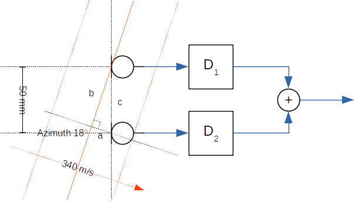
   
   Example delay-and-sum beamformer with two microphones at 50 mm
   distance. The sound waves arrive from 18 degree azimuth angle.

In the above example the plane waves arrive from source at 18 degrees
azimuth angle versus the normal of line array axis. The task is to
determine the needed delay values for delay elements D\ :sub:`1` and
D\ :sub:`2`. Since the first microphone receives the wave before the
second microphone, the signal from first microphone need to be delayed
by D\ :sub:`1` before the summing operation. The Delay value of D\
:sub:`2` is set to zero.

The needed delay value is the sound propagation time equivalent length
of edge a in the formed right triangle with edges a, b, and c. The
lengths of edges are time values those are computed from known microphones
distance, speed of sound, and azimuth angle.

The length of edge c is

:math:`t_c = \frac{d}{v} = \frac{50~mm}{340~m/s} \approx 147~us`
     
The angle between edges a and c is 90 - az. Therefore the arrival time
difference t\ :sub:`a` to apply for D\ :sub:`1` with 18 degree steer
angle (az) is

:math:`t_a = t_c \cos (90 - azimuth) \approx 45~us`

With different az angles it can be seen that the delay to apply varies
between 0 (az = 0) and 147 us (az = 90). For negative azimuth angles
the applied delays for D\ :sub:`1` and D\ :sub:`2` are swapped.

Such delay is typically applied by all-pass digital filter. The beam
patterns for line shape one dimensional arrays have a rotational
symmetrical beam pattern. For the above example with D\ :sub:`1` and
D\ :sub:`2` set the array would also pass the waveform from 180 - az
direction. The beam shape resembles a bent ellipse for broadside. A
3D cone like beam pattern is possible only for end-fire angles +90
or -90 degrees. A 2D array like circular shape can provide a 360
degree steerable cone in azimuth plane.

The analog directional microphones with e.g. 3D cardioid shape for
end-fire angle are actually single or dual diaphragm microphones with
tuned acoustical ports or analog all-pass electronics to achieve
similar additional delays for delay-and-sum. Due to large mechanical
size they are common only in studio equipment. Consumer electronics
such as notebooks form factors can fortunately provide various shape
microphone arrays while the studio microphones like approach is
impossible.

Beamformer types
****************

The main beamformer types are fixed and adaptive. The implementations
can be in time or frequency domain.

This TDFB type algorithm is the simplest time domain and fixed type
with a pre-defined look angle (azimuth, elevation). The audio source
is not tracked automatically. Audio waveforms from other angles are
attenuated. The beam shape is not particularly narrow with a low
microphones count such as 2 -4 so there's no need to track the subject
automatically we know the approximate angle for the use case.

Adaptive beamformers usually target to minimize the output signal
while unblocking the configured pass direction. The fixed beamformer
has the assumed or theoretical noise characteristic
pre-programmed. There is no delay to adapt (same performance from the
beginning) or risk for mis-adaptation (desired signal corrupts) but
the practical performance is somewhat limited from performance in a
theoretical noise field. The time domain implementation is also
low-latency without added delay for signal framing for transform
domain. It can compute nearly any number of stream frames due to no
block size constraints. The filter bank adds a small delay, e.g. 2 -
10 ms that depends on configuration.

The fixed beamformer needs to be configured per every different
microphone array geometry. The beam can be steered by applying a new
filters programming (with presets in later version of TDFB) if the
capture subject angle has changed based on camera face recognition or
acoustical direction of arrival estimation. Also quick beam direction
switching by rotating the input channels at algorithm input can be
made possible for some array geometries.

Microphone array geometries
***************************

Line
====

In the line array the microphones are in locations those form a
straight line. The numbering convention of microphones is shown in the
figure below. The microphones numbers correspond to audio channels
at beamformer input. In stereo audio channel 1 is the left channel.

The array size is described my microphones count and the space between
two neighbor microphones. In the example the spacing of the four
microphones is 30 mm. The steer azimuth angle is 90 degrees. The beam
direction for positive angles (0 to 90) is towards microphone 1. The
beam directions towards last microphone are set up with negative angle
(0 to -90).

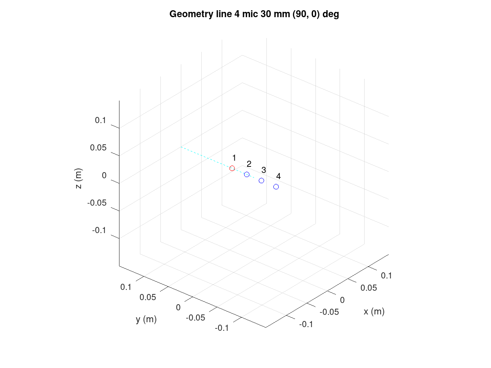
   
   Line array with four microphones.

The code to create the above design is below. The Octave GUI need to
be started from the TDFB tune directory:

.. code-block:: bash

   cd $SOF_WORKSPACE/sof/tools/tune/tdfb
   octave --gui &

In the Octave shell enter the next commands or create a short script
(e.g. ex_line.m) and run it. Remember to end the lines with semicolon
to avoid long prints of internal data structures.

.. code-block:: octave

   bf = bf_defaults(); % Get defaults
   bf.array = 'line';  % Calculate xyz coordinates for line array
   bf.mic_n = 4;       % four microphones
   bf.mic_d = 30e-3;   % 30 mm spacing
   bf.steer_az = 90;   % Azimuth angle 90 deg
   bf = bf_design(bf);
   
The above design is simplified and it lacks the output files
definition and assumes default four microphones to one output channel
configuration but it creates the plots for geometry and theoretical
characteristics.

   
Circular
========

In the circular array the microphones are at equal radius with equal
angular spacing. The microphones are numbered counterclockwise when
looking at array from above (positive z-axis).

The azimuth angle (-180 to +180) is in the example 90 degrees. 0
degrees angle points exactly to microphone 1 direction. The circular
array is a two dimensional array. If the elevation angle (-90 to 90
degrees) is set to non-zero value the look direction can be tilted up
or down. A positive elevation angle tilts the beam upwards.

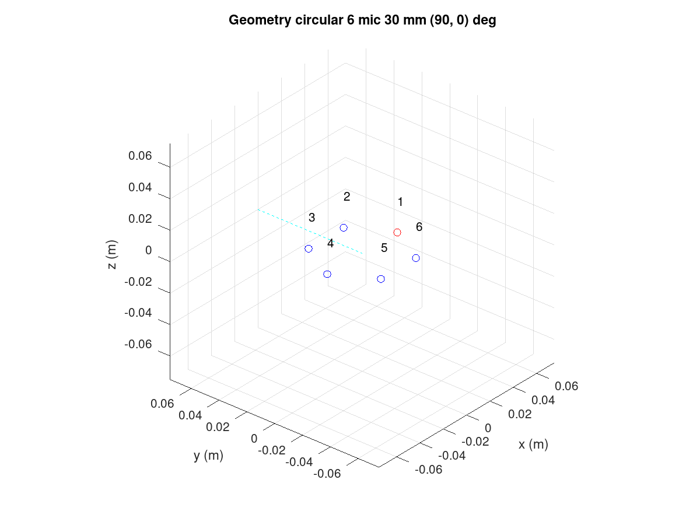
   
   Circular array with six microphones.

The design was done with commands. The plot_box is optional, it only
zooms the the plot axis to a 150 mm wide cube.

.. code-block:: octave

   bf = bf_defaults();    % Get defaults
   bf.array = 'circular'; % Calculate xyz coordinates for line array
   bf.mic_n = 6;          % six microphones
   bf.mic_r = 30e-3;      % 30 mm radius
   bf.steer_az = 90;      % Azimuth angle 90 deg
   bf.plot_box = 150e-3;
   bf = bf_design(bf);

The view can be rotated as normal 3D plot. In Matlab mouse rotate is
available. In Octave it can be done with command view() to watch the
array from other angle.

.. code-block:: octave

   figure(1)
   v = view()
   view(130, 30)
		
The view azimuth was rotated by 180 degrees (-50 to +130). The view has
no impact to beamformer design.

Rectangular
===========

A rectangular array is shown below. The numbering of microphones for
the first row is line for line array. The number continues from the
leftmost microphone of the next row.

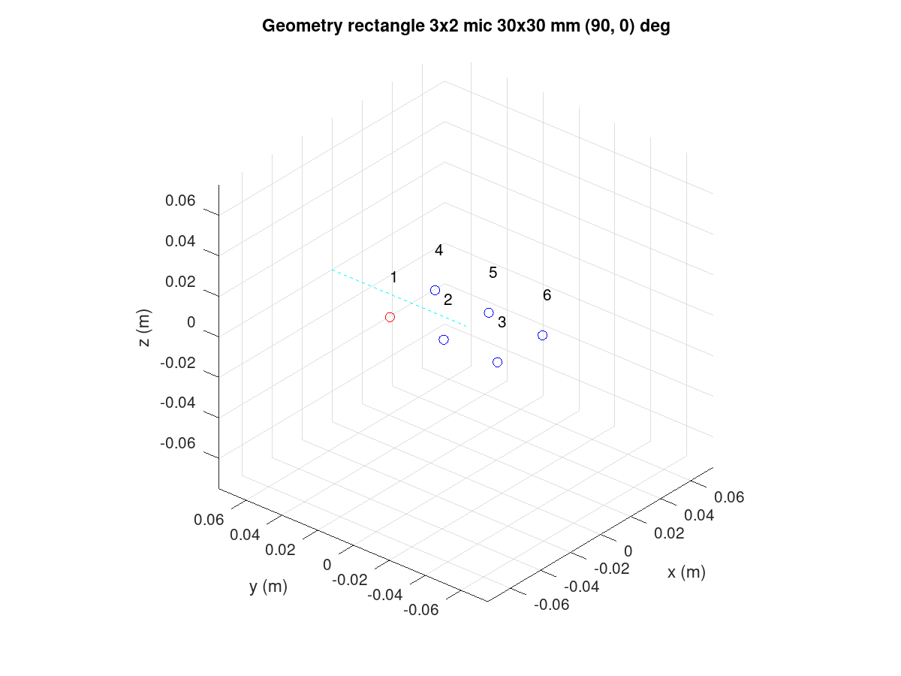
   
   Rectangular array with six microphones.

The code for the design is

.. code-block:: octave

   bf = bf_defaults();         % Get defaults
   bf.array = 'rectangle';     % Calculate xyz coordinates for rectangular array
   bf.mic_nxy = [3 2];         % of 3 x 2
   bf.mic_dxy = [30e-3 30e-3]; % Same x and y spacing
   bf.plot_box = 150e-3;
   bf = bf_design(bf);	

L-shape
=======

The L-shape array is much like rectangular but only the left and
bottom edge of microphones rectangle is populated.

.. figure:: lshape_array.png
   :width: 600
   
   L-shape array with four microphones.

It was produced by

.. code-block:: octave

   bf = bf_defaults();         % Get defaults
   bf.array = 'lshape';        % Calculate xyz coordinates for rectangular array
   bf.mic_nxy = [3 2];         % of 3 x 2
   bf.mic_dxy = [30e-3 30e-3]; % Same x and y spacing
   bf.steer_az = 90;           % Azimuth angle 90 deg
   bf.plot_box = 150e-3;
   bf = bf_design(bf);

Arbitrary XYZ
=============

It's also possible to define all microphone coordinates manually. The
example shows a tetrahedron shape with four microphones. The microphones
order is as they are presented in the design script.

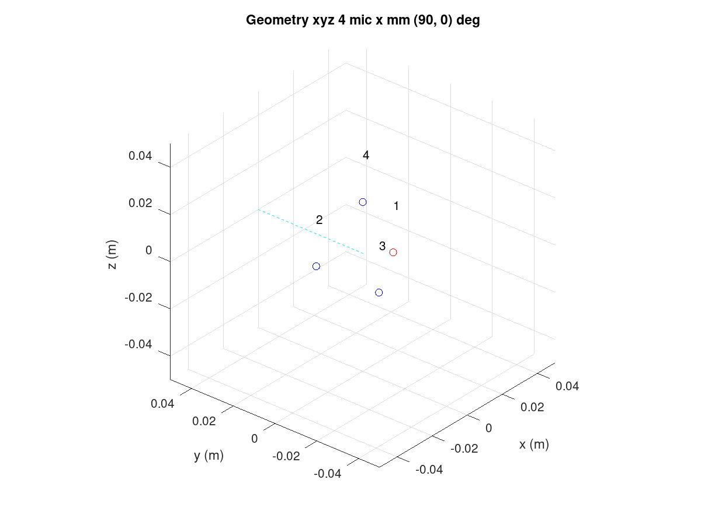
   
   XYZ array with four microphones.

The tetrahedron shape was made with next script

.. code-block:: octave

   bf = bf_defaults();   % Get defaults
   bf.array = 'xyz';     % Enter xyz directly, note that script centers it
   bf.plot_box = 100e-3; % Small 100 mm plot box
   bf.steer_az = 90;     % Steer array to 90 deg azimuth
   
   % Coordinates from https://en.wikipedia.org/wiki/Tetrahedron
   s = 30e-3/sqrt(8/3); % Scale to 30 mm
   bf.mic_x = [ sqrt(8/9) -sqrt(2/9) -sqrt(2/9) 0] * s;
   bf.mic_y = [ 0          sqrt(2/3) -sqrt(2/3) 0] * s;
   bf.mic_z = [-sqrt(1/3) -sqrt(1/3) -sqrt(1/3) 1] * s;

   bf = bf_design(bf);

Note that the beamformer design is totally unaware of surface effects
of the object. The design equations assume the microphones "float" in
free space. Particularly a 3D array will be impacted by device
mechanics and custom design equations may be needed.

Rotation of the array
=====================

The array orientation can be changed with array_angle with X, Y, and Z
axis rotation angle. The next example rotates the array like it would
be on a notebook display lid corner at 60 degree angle. The steer
azimuth is set to 0 degrees towards notebook user. The plot view angle
is changed also.

.. code-block:: octave

   bf = bf_defaults();          % Get defaults
   bf.array = 'lshape';         % Calculate xyz coordinates for rectangular array
   bf.mic_nxy = [3 2];          % of 3 x 2
   bf.mic_dxy = [30e-3 30e-3];  % Same x and y spacing
   bf.steer_az = 0;             % Azimuth angle 90 deg
   bf.array_angle = [180 60 0]; % Array rotation angles for xyz
   bf.plot_box = 150e-3;
   bf = bf_design(bf);
   figure(1)
   view(140,30)

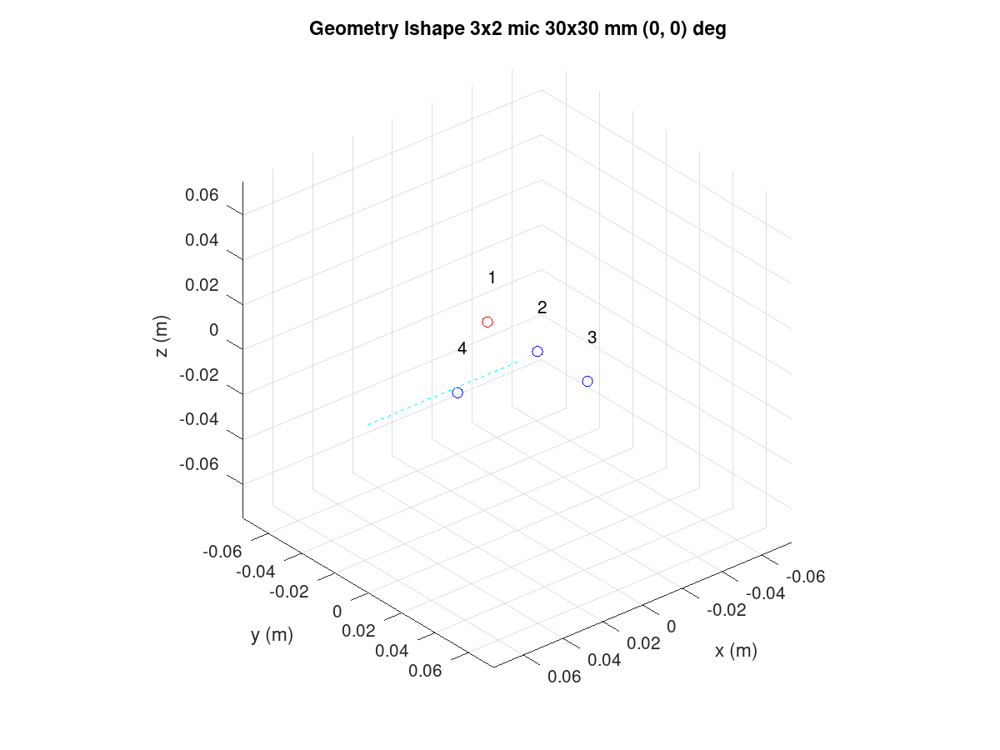
   
   Rotated L-shape array

Filter bank design procedure
****************************

The procedure is in file bf_design.m. As coarse description the design
of filter bank is done entirely in (FFT) frequency domain with default
of 512 bins. The conversion to a time domain FIR filter bank for
desired filter length is done with IFFT and kaiser window. The longer
the filters are the less they deviate from the super-directive
frequency domain design.

The procedure is based on equations equations published in paper
"Superdirective Microphone Arrays" by Joerg Bitzer and K. Uwe
Simmer. It is available in book "Microphone Arrays" by Michael
Brandstein and Darren Ward (Springer 2001).

The procedure starts with computation of (x, y, z) coordinates of
virtual sound source at specified azimuth (steer_az) and elevation
(steer_el) angle. The point is by default 5m radius away that is
enough for far field with planar sound waves with typical array
dimensions but can be altered (steer_r). Near field (e.g. less than
1m) design may suffer from lack of sound level compensation for
microphone channels.

The noise field is assumed to me theoretical homogeneous type and a
coherence matrix is formed with knowledge of the microphones
geometry. The super-directive design is set of coefficients that
minimize the noise power spectral density of filtered and summed
microphone signals but provides a distortion-less response towards the
look direction. The used design equations compute a Minimum Variance
Distortion-less Response (MVDR) beamformer. The details are found from
script bf_design.m and the above mentioned book.

The elegance of the frequency domain design is that the equations can
be solved per each single frequency bin in FFT domain. Since the
process is potentially numerically unstable there is a diagonal
loading factor that is added to the coherence matrix prior to
inversion. The parameters is mu_db. It defaults to -50 dB but smaller
or larger values can be tested for best results. Smaller than default
values need to be used with care. The self noise of the microphones,
via white noise gain (WNG), could get even boosted with near zero
diagonal load designs. Large diagonal load improves robustness of the
design but may compromise other characteristic like beam pattern or
diffuse noise field suppression.

After solving the equation for all frequencies the filters for each
microphone channel are converted to time domain with IFFT and window
function. The window function shortens the impulse responses to
desired length. The windowing naturally changes the characteristics so
different filter lengths (fir_beta) should be tested.

Design examples
***************

Circular array
==============

If e.g. circular array design is revisited the design creates several
plot windows in addition to the geometry and steer direction plot. The
next two show the beam pattern characteristic. The polar plot shows
only frequencies 1, 2, 3, and 4 kHz. The colorful frequency vs. angle
shows more detailed view for the same with all frequencies up to
Nyquist Fs/2.

It can be seen that the beam patterns are different for different
frequencies. There is a beamformer type for constant directivity but
the performance against diffuse noise is not as good. The narrower
beam towards higher frequencies in super-directive achieves the higher
ambient noise suppression.

At frequencies above 5 kHz there are side lobes those pass the signal
as well as the main beam. Those are caused by spatial aliasing. The
wave length of audio gets smaller than the array microphones
distance. The array dimensions need to be decreased if spatial
aliasing needs to be avoided. In most cases some it can be tolerated
somewhat.

In the look direction beam there's some attenuation at lowest and
highest frequencies. The response can be made more flat by increasing
the filter length from default 64 (fir_length).

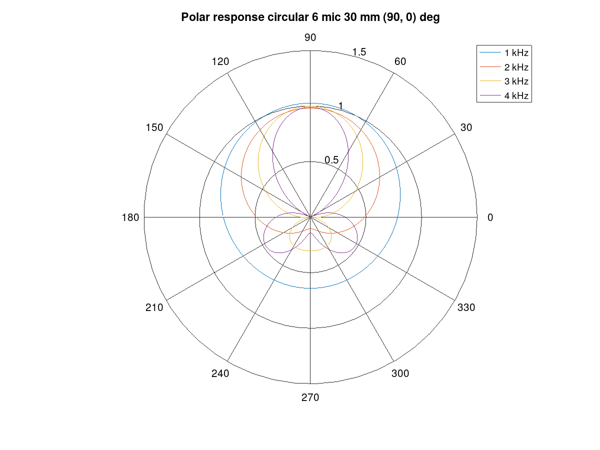
   
   Polar response of the circular array

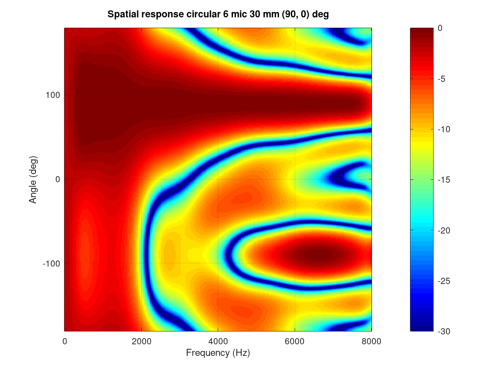
   
   Frequency vs. angle response of the circular array

The performance of the array and beamformer can be also characterized
with White Noise Gain (WNG) and Directivity Index (DI) plots. The WNG
plot shows the amount attenuation the design provides for uncorrelated
noise. E.g. self noise of the microphones is uncorrelated noise
type. The directivity index shows the attenuation of noise that
arrives from other directions than steer direction. The noise that
arrives from surrounding noise sources and reflects from walls and
other surfaces and is correlated is called diffuse field noise.

The impact of diagonal load mu_db in e.g. range -100 to -20 can be
tried and seen best in these plots. A near zero diagonal load with
value -200 dB makes the directivity even negative at some
frequencies. Such beamformer design would boost noise at those
frequencies!

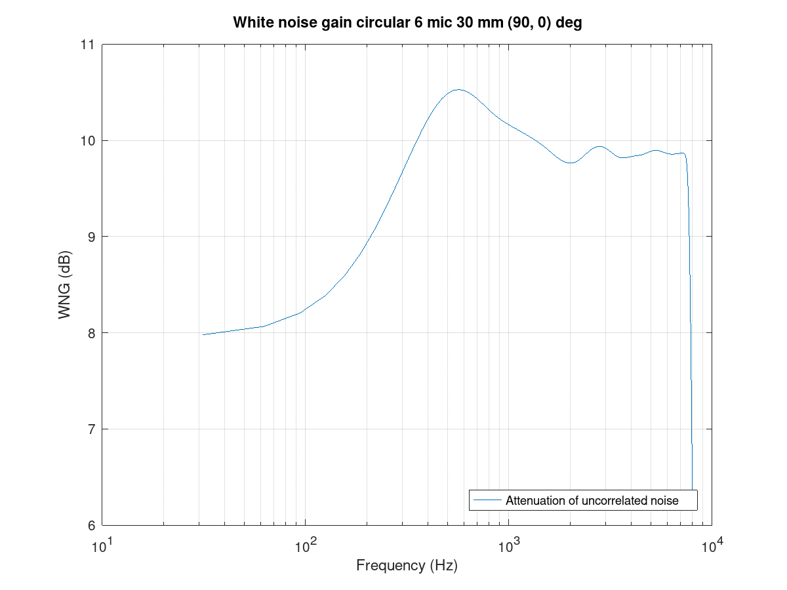
   
   White noise gain of the circular array

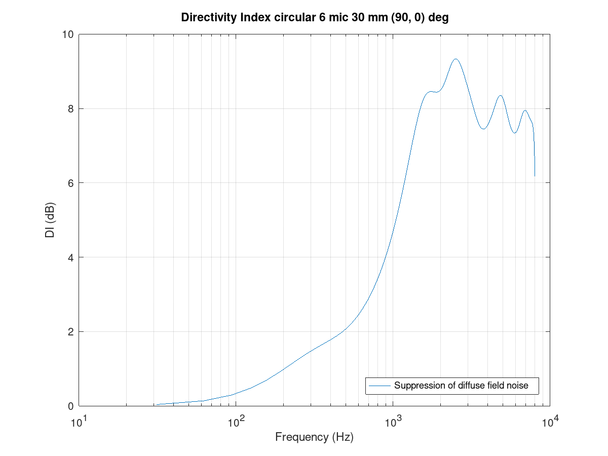
   
   Directivity index of the circular array

Finally the FIR coefficients plot can be checked for sane looking result. The shown
plot shows a typical symmetrical FIR impulse response

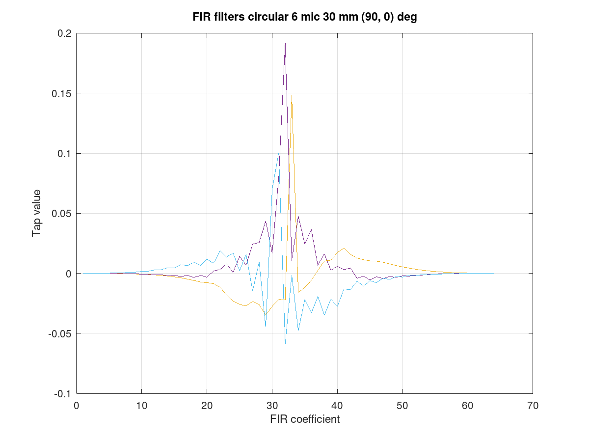

   Filter coefficients for the circular array

Line array
==========
	   
The circular arrays have the nice characteristic of nearly similar beam
pattern to any direction. As exercise compare the beam patterns of a
4 mic line array to 0 degrees azimuth steer vs. 90 or -90 degrees.

Limitations
===========

The above examples defaulted to N microphones to single channel
output. However due to a current limitation in SOF the pipeline the
PCM and DAI need to have the same word length. The limitation will be
addressed in a next release of SOF.

As workaround the beamformer can duplicate it's output channel to
needed number of channels and/or there can be several beams in the
design for different output channels. The latter is actually preferred
for generic stereo capture PCM in typical notebooks. The typical array
dimensions do not provide much subjective stereo sensation.

Dual mono example
-----------------

A complete dual mono 0 degree azimuth beamformer could be designed and
exported with script. The beam characteristics are those of 50 mm
spaced pair but the setting of num_output_channels and
output_channel_mix alter the configuration of output mixer of TDFB.

.. code-block:: octave

   bf = bf_defaults(); % Get defaults
   bf.array = 'line';  % Calculate xyz coordinates for line array
   bf.mic_n = 2;       % two microphones
   bf.mic_d = 50e-3;   % 50 mm spacing
   bf.fs = 16e3;       % 16 kHz rate
   bf.steer_az = 0;    % 0 degree azimuth
   
   % Two output channels
   bf.num_output_channels = 2;
   
   % Mix filter 1 output to channels 0 and 1 (2^0 + 2^1 = 3)
   % Mix filter 2 output to channels 0 and 1 (2^0 + 2^1 = 3)
   bf.output_channel_mix = [3 3];
   
   bf = bf_filenames_helper(bf);
   bf = bf_design(bf);
   bf_export(bf);

Example with two beams
----------------------

This example creates for left channel a -10 degree beam and for right
channel a +10 degrees azimuth beam. It's quite suitable for notebooks
with emphasis for user direction (and opposite due to rotational
symmetry of line array) and still noticeable channel separation.

The procedure uses bf_merge() to combine bf1 and bf2 designs. The
different out_channel_mix vectors does summing of the filters to
proper channels. The filenames are redefined to avoid to overwrite the
single beam files.

.. code-block:: octave

   % Get defaults
   bf1 = bf_defaults();
   bf1.fs = 48e3;
   
   % Setup array
   bf1.array='line';
   bf1.mic_n = 2;
   bf1.mic_d = 50e-3;
   
   % Copy settings for bf2
   bf2 = bf1;
   
   % Design beamformer 1 (left)
   bf1.steer_az = -10;
   bf1.input_channel_select = [0 1];  % Input two channels
   bf1.output_channel_mix   = [1 1];  % Mix both filters to channel 2^0
   bf1.fn = 10;                       % Figs 10....
   bf1 = bf_filenames_helper(bf1);
   bf1 = bf_design(bf1);
   
   % Design beamformer 2 (right)
   bf2.steer_az = +10;
   bf2.input_channel_select = [0 1];  % Input two channels
   bf2.output_channel_mix   = [2 2];  % Mix both filters to channel 2^1
   bf2.fn = 20;                       % Figs 20....
   bf2 = bf_filenames_helper(bf2);
   bf2 = bf_design(bf2);
   
   % Merge two beamformers into single description, set file names
   bfm = bf_merge(bf1, bf2);
   bfm.sofctl_fn = fullfile(bfm.sofctl_path, 'coef_line2_50mm_pm10deg_48khz.txt');
   bfm.tplg_fn = fullfile(bfm.tplg_path, 'coef_line2_50mm_pm10deg_48khz.txt');
   
   % Export files for topology and sof-ctl
   bf_export(bfm);

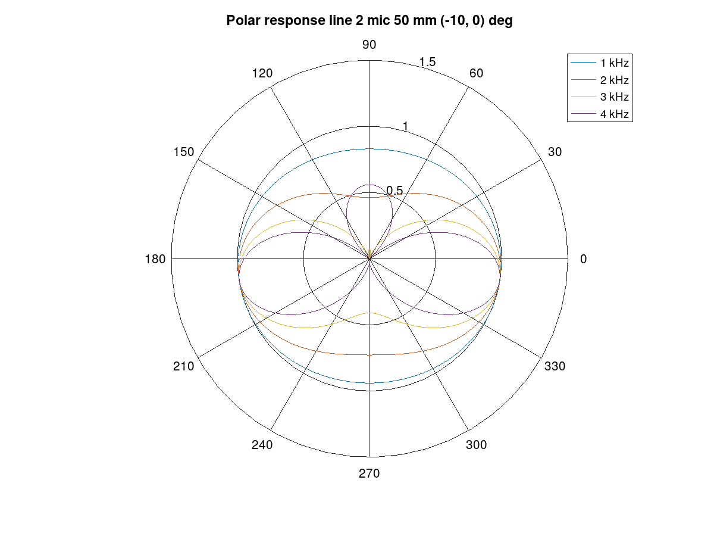

   Beam pattern for the left channel

      
	   
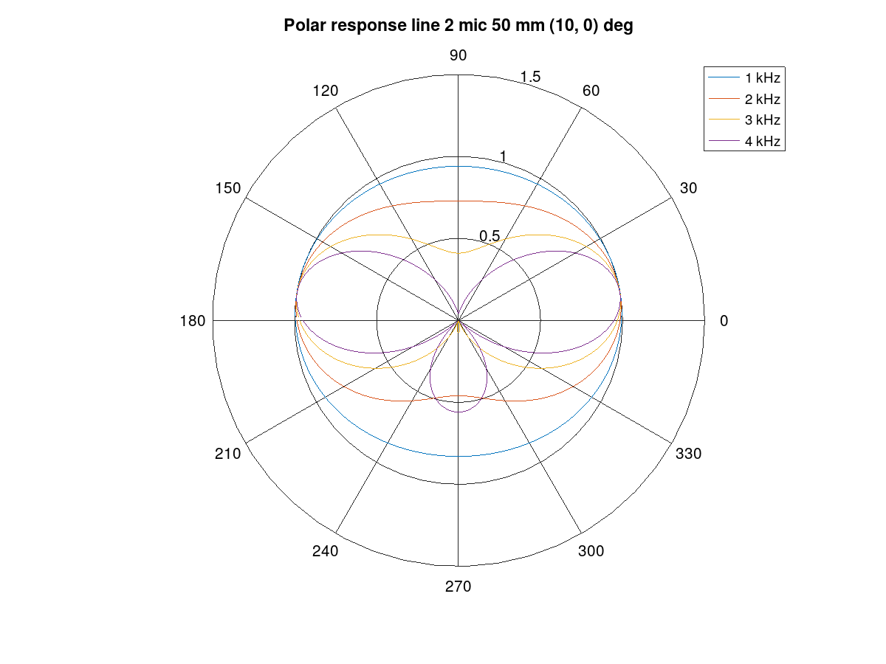

   Beam pattern for thr right channel

Simulation
**********

Measurement in anechoic chamber is recommended for validation. A quick
check is however available to check correctness of the configuration
blob and C code version TDFB operation.

The script tdbf_test.m does a beam patten test. To test own beamformer
design the proper file name need to be edited to test-placback.m4
(currently coef_line2_50mm_pm90deg_48khz.m4) and the test topologies
regenerated.

.. code-block:: bash

   cd $SOF_WORKSPACE/sof/
   scripts/build-tools.sh -t
   scripts/rebuild-testbench.sh
   cd cd tools/test/audio
   octave --gui &
   tdfb_test

This simulation is emprical and executed with testbench. The previous
bf_design() call for the array created the sine rotation, diffuse
field, and random field waveform data files that the simulation run
used. The theoretical and simulated beam patterns should match.
