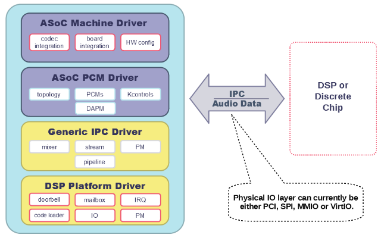

.. _sof_driver_arch:

SOF Linux Driver Architecture
#############################

|SOF| can either operate as a standalone firmware or alongside a host OS
driver for configuration and control. The |SOF| OS driver is responsible for
loading firmware, loading configuration and managing firmware use cases.
Currently |SOF| has a driver for the Linux OS.

The |SOF| driver code is dual licensed GPLv2 and BSD and this means the user
can choose which licence they want to use (either BSD or GPLv2). The driver
stack is designed with maximum resuse so that large portions of it can be
taken and integrated into other OSs or RTOSs.

.. contents::
   :local:
   :depth: 1

Overview
********

Audio Driver Architecture
=========================

The Sound Open Firmware (SOF)-based audio driver stack consists of an architecture-independent SOF driver core, an SOF DSP driver for Intel High Definition Audio (HD-Audio) platforms, an ALSA System-on-Chip (ASoC)-compliant audio codec driver, and a hardware-specific machine driver.

Sound Open Firmware
===================

Sound Open Firmware (SOF) is an open source audio Digital Signal Processing (DSP) firmware infrastructure and SDK. SOF provides infrastructure, real-time control pieces, and audio drivers. A generic SOF subsystem is implemented in Linux as a subsystem of ALSA ASoC.

ALSA and ASoC
=============

The Advanced Linux Sound Architecture `(ALSA) <https://www.alsa-project.org/wiki/Main_Page>`_ provides audio and MIDI functionality to the Linux operating system. The ALSA System-on-Chip `(ASoC) <https://alsa-project.org/wiki/ASoC>`_ is a subsystem of ALSA. ASoC provides a modular architecture to share audio codec drivers across different SoC implementations, unify the controls provided to applications, and provide a common infrastructure to manage SoC audio component power and clocks.

Related ALSA Drivers
====================

The upstream Linux kernel has a few drivers that are related to the SOF-based audio driver stack described in this document. These drivers include the Intel AZX HD Audio driver (``linux/sound/pci/hda``) and the Intel SST Audio driver (``linux/sound/soc/intel/``).

The AZX driver is intended to be used with Intel HD Audio PCI hardware when the Audio DSP is disabled (e.g. BIOS configuration). The AZX driver should be used instead of SOF when the DSP is not used.

The SST Audio implements an ASoC-compliant driver for Intel HD Audio hardware, utilizing the Intel SST firmware. SST is primarily used with older generations of Intel processors for which SOF firmware support is not available. The SST driver and firmware should be used when the DSP is enabled and SOF firmware is not available for the platform.

Driver Probe
************

The probe callback in the SOF PCI/APCI driver is responsible for allocating the platform data that is used to store the machine information including the PCI device ID, name, and the ACPI mach description. For Intel platforms, it uses the ACPI matching tables to determine the correct machine driver to load. The probe callback also sets up the SOF platform driver, initializes the Inter-Process Communication (IPC) to communicate with the DSP, and registers the SOF PCM component driver and the machine driver. Upon completion, it enables the runtime power management for the platform, if supported.

SOF Platform Driver
*******************

The SOF platform driver is a platform-specific driver that abstracts the low-level platform DSP hardware into a common generic API that is used by the upper layers. This includes code that will initialize the DSP and boot the firmware. The platform driver is responsible for setting up platform-specific ops for the device. The mandatory and optional platform ops are defined in ``struct snd_sof_dsp_ops``. It also describes the chip info the DUT by populating the ``struct sof_intel_dsp_desc`` fields necessary for DSP initialization.

Platform Driver Probe
=====================

The SOF platform driver detects the presence of a DSP in the platform by checking the PCI ``class/sub-class/prog-id`` information. It sets up the platform devices (ex: HDA device, dmic device), the DSP Base Address Registers, and initializes the streams and the interrupt vectors. Finally, it initializes the DSP capabilities and enables the DSP processing pipe capability interrupts.

Firmware Loading and Booting
============================

On SKL+ platforms, firmware loading is performed using a dedicated DMA for code loading which is responsible for copying the FW into DSP memory. The DSP cores are powered up in a predetermined sequence and the host driver waits for the appropriate ROM init status to be written into the ROM status register to indicate initialization. This step is attempted a few times until the ROM status registers returns the successful ROM init status. Upon successful completion, the host driver triggers the code loader DMA to start copying the FW into DSP memory and boot it while waiting for the notification from the DSP. When the FW has successfully booted, the DSP sends the firmware-ready IPC message to notify the host. Further details are provided in **IPC Processing**, below.

IPC Processing
**************

Introduction
============

The SOF Audio DSP firmware uses IPC to communicate with the host. IPC is also used by the preinstalled DSP ROM, so it is used at least to load and start an SOF image. During that phase, the host communicates with the DSP ROM. Once ROM initialization is complete and the SOF FW has booted, the consequent IPC is performed with the firmware.

IPC is bi-directional; messages can be initiated by the host and then acknowledged by the DSP. Similarly, they can be initiated by the DSP and acknowledged by the host. To indicate the direction of the communication, terms **initiator** and **target** are used.

After SOF completes its boot process, it informs the host that it is ready for operation. Prior to receiving this message from the DSP, the mailbox offsets are not configured. Therefore, the message is read out from the DSP-to-host mailbox configured in the PCI mailbox BAR. Once read out, the message is parsed to determine the exact layout of all the IPC mailbox buffers. After that, the host sends further IPC messages to perform DSP configuration and initialization.

At run-time, IPC is used for streaming control and buffer management, as well as for firmware traces.

IPC Hardware Implementation
===========================

On most systems, the DSP and the host CPUs can access the same memory, such as where the DSP is implemented as a PCI device on the host system. On other systems, the DSP is implemented as a stand-alone device, connected to the host by a serial bus such as SPI.

Intel IPC
=========

At the hardware level, IPC support is implemented using a set of doorbell
registers and mailbox buffers. Details of the implementation can vary between
architectures. In general, sending an IPC message and replying to it involves
the following steps:

#. If the IPC message is supposed to contain a payload, which is almost always the case with SOF, the initiator first copies the payload to the respective mailbox buffer.
#. The initiator sets a BUSY bit in an initiator-side IPC register, which then sets a BUSY bit on the target side.
#. If configured, this can also generate an interrupt on the target side.
#. When the target completes processing the received message, it clears the BUSY bit on its own side. This is then reflected to the initiator side, where as a result the BUSY bit is cleared and the DONE bit is set.
#. Setting the DONE bit can also generate an interrupt on the initiator side.
#. The initiator processes the reply from the target and clears the DONE bit.

SOF on both the host and the DSP serializes the sending of their IPC messages. Therefore, a new message cannot be initiated before the target has finished processing the previous one. However, both the host and the DSP can initiate their messages simultaneously. This cannot lead to a race because both the host and the DSP have separate target and initiator IPC registers.

.. note:: The IPCCTL register is common for target and initiator operations
   and is used to mask and unmask BUSY and DONE interrupts. Therefore, in
   theory, a race is possible where one context would try to mask or unmask
   one of the bits (e.g. BUSY) while a different context, running on a
   different core, would try to mask or unmask the other bit (DONE). This
   can lead to inconsistent register contents. To avoid this, the software
   has to make sure to lock the read-modify-write operations on the IPCCTL.

SPI
===

IPC messages have the same structure as in the PCI case, but they are sent and received over an SPI bus. The SPI transfer is always initiated by the SPI provider, which is the host. Therefore, the DSP cannot send asynchronous messages to the host using only the SPI bus. To overcome this limitation, an additional GPIO line is used by the DSP to trigger an interrupt on the host to request it to read out an IPC message. Support for such devices is still experimental in SOF. Details will be added later.

iMX IPC
=======

Information on this subject matter is forthcoming.

IPC Messages
============

IPC messages are divided into several groups: global reply, topology, power management, component, stream, DAI, trace, and a separate "firmware ready" message. Multiple messages can also be grouped into a message that belong to a compound group. For all IPC message definitions, see ``include/sound/sof/header.h``. Most messages are sent by the host to the DSP; only the following messages are sent by the DSP to the host:

- firmware ready: sent only once during initialization
- trace: optional, contains firmware trace data
- position update: only used if position data cannot be transferred in a memory window or if forced by the kernel configuration

PCM Driver
**********

The SOF PCM driver creates ALSA PCMs, DAPM, and kcontrols based on the
:ref:`topology` data loaded at runtime. The PCM driver also allocates
buffers for DMA and registers with runtime PM. It contains architecture-
and platform-generic code. The PCM driver implements the low-level
functions defined by the ALSA PCM middle layer in ``struct
snd_pcm_ops``. These functions implement the platform-generic parts and
invoke platform-specific ops to access the hardware.

When the machine driver is probed and the sound card is registered, the SOF PCM component driver gets probed when the dai links in the sound card are bound to the card. The SOF PCM component probe callback loads the topology file for the DUT. The SOF topology defines the audio processing pipelines, FE DAIs, and the BE DAI configuration for the BE dai links defined in the machine driver. Therefore, it is important to make sure that the DAI link IDs for the BE DAIs are identical in the topology and the machine driver. A mismatch in the DAI links ID will cause the sound card registration to fail.

Topology Loading
================

The SOF PCM component probe invokes ``snd_sof_load_topology()`` to load the topology binary and triggers the parsing and loading of all the defined components. The topology operations pertinent to the loading/unloading of the various topology components are defined in ``struct snd_soc_tplg_ops`` in ``topology.c``. The topology parser invokes these callbacks to perform driver-specific loading operations for each component/widget. The load callback for each type of component in topology performs two main functions:

#. Parse the component specific tokens associated with the component and populate the IPC structure.
#. Send the IPC to the DSP to set up, configure, and link the components.

The unload callback is responsible for freeing the memory associated with the component and remove it from the list of components. Currently, the SOF driver supports loading only one topology file during boot up. This might be extended in the future to support multiple topologies that can be dynamically loaded/unloaded at runtime.

The topology file also defines the IO callbacks for the kcontrols supported by the SOF topology, namely mixer, enum, and byte controls.

Kcontrol IO
-----------

The kcontrol IO callbacks are all defined in ``control.c``. The three types of kcontrol supported by SOF are:

#. Volume: The volume kcontrol put callback is responsible for translating the user setting for volume level to the appropriate dB value and sending the IPC to the DSP. The get callback reads the volume dB value set in the DSP and determines the appropriate user space setting.
#. Enum: The enum put callback reads the user set value of the enum kcontrol and sends the IPC to the DSP to set the corresponding value in the FW. The get callback reads the enum value from the DSP and updates the user space setting.
#. Bytes: The byte control put callback is used for passing binary data from the user to the DSP FW. Depending on the size of the binary data being sent, the driver splits the data across multiple IPC messages. The FW is responsible for consolidating the data at the other end when the last segment of the data has been received from the host. The get callback gets the binary data from the DSP and passes it to the user space. As with the put callback, this is accomplished either in a single IPC or multiple IPCs, depending on the size of the binary data being read.

Stream Management
=================

The SOF PCM driver handles all stream control operations initiated by ALSA such as pcm open, close, hw_params, and trigger start/stop. It includes the code for the generic PCM operations while invoking the platform-specific callbacks to access the hardware.

PCM open/close
--------------

When a pcm is opened, the SOF pcm open ``ioctl`` assigns the stream for the host DMA and the stream is released when the pcm is closed.

PCM HW Params/Free
------------------

During the hw_params step, the SOF PCM driver performs the following operations:

#. Allocates audio buffer pages.
#. Invokes the platform-specific stream hw_params op. For SKL+ platforms, this involves decoupling host and link DMA engines, resetting the streams, setting up and programming the BDLs, and enabling the DMA interrupts.
#. Sends IPC to the FW to set up the stream params in the DSP.

The PCM free ``ioctl`` undoes the operations performed during hw_params.

PCM Trigger
-----------

When the trigger ``ioctl`` is invoked, the SOF PCM driver invokes the platform-specific stream trigger operation and then sends the corresponding stream trigger IPC message to the DSP. The platform-specific stream trigger operation is responsible for starting/stopping the stream DMA, depending on the trigger command being invoked.

PCM Prepare
-----------

The SOF PCM driver does not advertise ``SNDRV_PCM_INFO_RESUME`` in the runtime configuration for pcm streams. This means that upon resuming from system suspend, the streams that were active prior to suspend will be restarted instead of being resumed. Therefore, when restarting the suspended streams, the hw_params needs to set up again before triggering them. The SOF driver utilizes the prepare ``ioctl`` that is invoked upon resuming to determine if the hw_params needs to set up again or not.

Power Management
****************

Overview
========

The SOF framework implements the standard Linux kernel power management interface for devices. The SOF core exports the following standard methods:

- snd_sof_runtime_suspend()
- snd_sof_runtime_resume()
- snd_sof_suspend()
- snd_sof_resume()

On Intel HDA platforms, the PCI device registered in ``linux/sound/soc/sof/sof-pci-dev.c`` uses the above exported symbols to fill the Linux PM struct ``dev_pm_ops``.

SOF is configured to support both system sleep and runtime power management. In a typical configuration, the SOF device is runtime-suspended if no ALSA PCM streams are active and no ALSA mixer controls (kcontrols) are used by user space applications. Currently for Intel platforms, the only two power states supported for the DSP are D0 (DSP is on) and D3 (DSP is powered off).

Suspend Flow
============

- Firmware trace is released (if enabled).
- Debugfs state is cached (if enabled, affects debugfs nodes linked to DSP memory that will lose its state in suspend).
- Context-save IPC (SAVE_CTX) message is sent to firmware to notify the DSP of upcoming D3 entry.
- DSP-specific suspend flow is run.

  - On the Intel HDA; this involves logic to reset the HDA controller, disable IRQs, and power down the DSP cores.
  - Runtime and system suspend flows have their own code paths.

Resume Flow
===========

- DSP specific resume flow.

  - On Intel HDA, this involves logic to take the HDA controller out of reset, power up the DSP cores, and enable IRQs.
  - Runtime and system resume flows have their own code paths.

- Firmware boot
- Firmware trace is re-enabled (if configured).
- Existing PCM pipelines are restored to the firmware, using cached data maintained in the SOF driver (see sof_restore_pipelines()).
- Kcontrol values are restored from the cached data.
- Resume is completed by notifying the firmware with the Context Restored (CTX_RESTORE) IPC message.

Interaction with Codec Drivers
==============================

The audio codec drivers (compliant with the ALSA ASoC framework) are created as children of the SOF platform device in the Linux device hierarchy. While the codec drivers (located typically under ``linux/sound/soc/codecs/``) manage their power flows independently, the parent-child relationship guarantees ordering between SOF platform device and the codecs. For suspend, the codecs are suspended before the SOF platform device and, similarly for resume, the platform driver is resumed first and then the codec driver.

Intel Drivers
*************

Intel HDA SOF DSP Platform Driver
=================================

SOF implementation for Intel platforms is performed by the DSP Platform drivers. A platform driver implements the generic SOF ``struct snd_sof_dsp_ops`` interface, including functions such as doorbell, IPC messages send and receive, firmware load, and power up/down. The platform implements these methods for a given hardware target. The Intel platform drivers are located in the ``linux/sound/soc/sof/intel/`` folder of the Linux kernel tree.

Intel HDA DSP Driver for CNL/CML/WHL
====================================

The hardware interface for the Cannon Lake, Comet Lake, and Whiskey Lake platforms are defined in the ``linux/sound/soc/sof/intel/cnl.c`` file. For simplicity, all three platforms will be addressed with the CNL acronym in this section. This file defines the DSP ops required for initializing the SOF driver. Most of the DSP ops for the CNL are shared with the other Intel HDA platforms such as APL. The key changes in the CNL DSP driver are the doorbell registers and the corresponding IPC IRQ implementation.

Intel Machine Drivers
=====================

The ALSA SoC Layer (ASoC) includes machine drivers. A machine driver glues together various software components (e.g. drivers for codecs, platforms, and digital audio interfaces), describes the relationships between the components, and registers the result as an ALSA sound card to the kernel. A machine driver can be generic, handling a family of similar systems, or can be very specific, targeting a single product.

A set of machine drivers is included in the Linux kernel and provides support for a variety of systems with the Intel Audio DSP. These drivers are located in ``linux/soc/intel/boards``. The generic SOF HD-Audio machine driver (``skl_hda_dsp_generic.c``) can handle any system that meets the following criteria:

- HDMI/DP codec in Intel Graphics
- Optional: 1 external HDA codec
- Optional: 1 to 4 digital microphones directly connected to PCH (not via codec)

If the system has any I2S audio codecs or MIPI SoundWire codecs, the generic HD-Audio machine driver cannot be used and a dedicated machine driver is required instead.

.. note:: Some existing machine drivers were previously developed for Intel closed source audio firmware (SST firmware, Intel® Smart Sound Technology). The SOF platform driver works with the existing machine drivers and requires no changes. The one big difference, though, is that the SOF PCM driver ignores the FE DAI links defined in the machine driver and overrides them with the ones defined in the SOF topology.

Support for High Definition Audio (HD-Audio)
********************************************

Generic HD-Audio Support
========================

The Intel HD Audio controller is the standard audio host controller widely adopted in the PC platform; the industry standard Intel HD Audio driver software is available for Linux-based OSs. This driver is often referred to as the legacy HD-Audio driver. HDA DMA is used to transmit data between the host memory and the HD-A bus, and then to the external HDA codecs.

On Intel’s platforms after Skylake (SKL+ platforms), the HDA controller is converged with the Audio DSP, and the HDA DMA is split into two parts, the host DMA and the link DMA. The host DMA is used to transmit data between the host memory and DSP memory so data can be processed by DSP firmware. The link DMA is used to transmit data between the DSP memory and the ``HDA/iDisp/I2S/SoundWire`` bus (and then to the ``HDA/HDMI/I2S/SoundWire`` codecs). The SOF driver plus firmware can support this HDA DSP-converged architecture.

In the Linux ALSA framework, use of the audio DSP is optional. The common HDA library (hdac library, in ``sound/hda/``) is designed for both legacy HDA and HDA via Audio DSP support. It implements the HDA framework-level support, including the HDA bus, the HDA controller, and the HDA stream management.

In SOF, the HDA driver (``sound/soc/sof/intel/hda*.c``) uses the hdac library to initialize the HDA bus and controller, probe codecs, and add SOF-specific stream management. Please note that HDA controller initialization and stream management are mandatory for Intel SKL+ platforms even if no HDA/HDMI-codec support is required, because the host DMA and stream control registers are part of HDA controller.

The Legacy HD-Audio driver and SOF driver can coexist in one Linux distribution. The ``snd-intel-dspcfg`` kernel driver implements logic to select the correct driver based on ACPI table contents and platform capabilities detected at runtime. For example, if no specific configuration is defined in ACPI tables and digital microphones are directly attached to the PCH (Intel Platform Control Hub), an audio DSP is required and thus the SOF driver is chosen automatically.

HD-Audio Codec Support
======================

In ASoC, the HD-Audio codec is implemented in ``hdac_hda.c`` in the ``soc/codec`` directory. It reuses the legacy HD-Audio codec driver and implements the features required by ASoC, such as registering the audio codec component driver, dapm routes, and codec dai operators. Three dai links are supported: Analog, Digital, and Alt Analog codec dai. Since power management is implemented in the legacy hda codec driver, there is no PM function in this codec driver.

Display Audio Support
=====================

SOF also supports the Intel i915 audio codec driver. The Intel HDMI audio codec driver supports HDMI audio, Single Stream Transport (SST) Display Port (DP) audio, and Multi Stream Transport (MST) DP audio. It fully supports 3+ PCM playback streams; it does not support capture streams.

When an HDMI/DP display with audio support is connected, it is attached to a free ALSA PCM node from the pool of nodes reserved for HDMI. The status of HDMI/DP PCM connections is exposed via the ALSA mixer card controls **HDMI/DP,pcm=X Jack**, where X is the PCM device number. When a connection is detected, another ALSA mixer PCM control, **name='ELD',device=X**, describes the connected monitor. This data is formatted as ELD data (**EDID Like Data**, where EDID is Extended Display Identification Data), as defined in the `HDA <https://www.intel.com/content/dam/www/public/us/en/documents/product-specifications/high-definition-audio-specification.pdf>`_ specification.

Starting with Linux kernel version 5.5, HDMI/DP audio is implemented with an architecture that is similar to other HDA codecs. Implementation of the HDMI/DP codec is in ``snd-hda-codec-hdmi`` (``sound/pci/hda/patch_hdmi.c``).

In older versions of Linux, a dedicated codec driver was used (``sound/soc/codec/hdac_hdmi.c``) but is now deprecated.

Dependency on Intel Graphics Driver (i915)
------------------------------------------

The HDMI/DP audio codec is integrated in the graphics card. This means the SOF HDMI/DP audio codec driver directly depends on the Intel i915 graphic driver.

The graphics driver and the HDMI/DP audio codec driver use the “component” model to handle the upper communication between the graphics driver and the audio driver. The graphics driver is bound to the audio driver as a component. This interface is used to request power, clocks, get notifications of monitor connection changes, and to get access to auxiliary information about the monitor. The main structure that is used in the graphic and audio communication is ``struct drm_audio_component``. Refer to ``drm_audio_component.h`` for more information on the structure.

The graphics card includes an Audio Power Domain which is dedicated to the audio power setting. Any audio operation on the HDMI/DP audio codec requires the Audio Power Domain to be turned on. After an operation, the audio driver should turn off the Audio Power Domain. The HDMI/DP audio codec clock domain is located in the graphic card. Whenever the audio sample rate/bit rate is changed, the audio driver requires the graphic driver to modify the clock setting correspondingly.

Audio for DisplayPort Multi-Stream Transport (DP-MST)
-----------------------------------------------------

The Multi-Stream Transport (DP-MST) feature was first introduced in the DP 1.2 specification. It allows graphics to transfer multiple streams on a single connection. In a typical implementation, the multiplexed stream is terminated at a DP-MST hub which routes the individual streams into separate displays.

The SOF HDMI/DP audio codec driver handles DP-MST audio streams transparently, and a DP-MST is treated in a similar way as any HDMI or DP-SST stream.

.. note:: With Linux kernel versions 5.4 and older, the HDMI/DP implementation is using another codec driver and DP-MST interface to user-space is difference. With the old codec implementation, user-space software can determine the connection matrix between the monitors and the DP-MST port though **Pin#n-Port#m Mux** kcontrols in the alsamixer tool.

Kernel Configuration/Kconfig
****************************

Refer to the `README <https://github.com/thesofproject/kconfig/blob/master/README.md/>`_ file of the SOF kconfig repository.

Debug Options
*************

SOF provides multiple options to enable developers to quickly bring up new platforms and debug errors/crashes that occur during audio test cases. The most notable ones are as below:

Nocodec Mode
============

The no-codec mode is specifically meant for speeding up the process of bringing up SOF on new platforms. This mode enables developers to quickly verify basic audio functionality on the available Digital Audio Interfaces (DAI) on the platform. This is also useful to rule out issues due to potential errors in the codec drivers.

Debugfs
=======

SOF exposes several memory windows to the user space through the kernel debugfs filesystem. Developers can read or dump out the contents of these debugfs entries to infer the state of the DSP in case of a panic or a crash. Some of the most useful debugfs entries SOF exposes are mailbox, exception, and trace.

Firmware Tracing
================

The tracing feature in the SOF firmware allows the DSP to send trace messages to the host. This tracing feature fills in for the lack of a printf feature while executing firmware code on the DSP. The host configures and sets up the DMA buffer for receiving the trace messages from the DSP. Once the trace DMA triggers, the DSP periodically initiates a DMA transfer to copy over the trace messages to the host. These messages can then be parsed using the sof-logger utility which prints out the messages in chronological order.

More information is available in the firmware debuggability sections for :ref:`dbg-traces` and :ref:`dbg-logger`.

IPC Flooding
============

The IPC flooding feature is useful to determine the throughput when sending IPCs from the host to the DSP at a very high rate. It is also useful for exposing race conditions which might cause IPC timeouts to occur. Two available options allow the user to either flood the DSP with a specified number of IPCs or flood the DSP with IPCs for the specified duration.

Force IPC Position
==================

Sending position update IPC from the firmware to the host is a generic method to generate period interrupts to meet the requirement from the ALSA IRQ mode (e.g. ``snd_pcm_period_elapsed()``). On some HDA-integrated platforms (e.g. Intel SKL+ ones), this interrupt can be generated using the `HDA <https://www.intel.com/content/dam/www/public/us/en/documents/product-specifications/high-definition-audio-specification.pdf>`_ period IOC (interrupt on complete) and the real-time buffer pointers can be read back from the DPIB (DMA Pointer In Buffer). On these platforms, the position update IPC is only the fallback choice and is not used by default.

In order to debug issues with IOC/DPIB, the force IPC position kernel
debug config can be selected. On Intel SKL- platforms, the stream
position update IPC is used whether or not this option is selected.
