.. _contribute:

Contributing to the Project
###########################

As an open-source project, we welcome and encourage the community to submit
patches for code, documentation, tests, and audio algorithms directly to the
Sound Open Firmware (SOF) project. In our collaborative open-source environment,
standards and methods for submitting changes help ensure high code quality,
architectural consistency, and smooth community collaboration.

This document serves as the comprehensive single-page reference for all aspects
of contributing to SOF:

* :ref:`contribute_guidelines`: Licensing (BSD-3-Clause), Developer Certificate of Origin (DCO), and prerequisites.
* :ref:`development_tree`: Linux SOF kernel drivers, git trees, upstream workflow, and maintainers.
* :ref:`SOF_ABI_changes`: Firmware-to-driver ABI change process, RFC reviews, and compatibility.
* :ref:`bug_tracking`: Bug life cycle, issue triage labels, reporting guidelines, and audio quality proof captures.
* :ref:`doc_guidelines`: Documentation formatting in reStructuredText and Sphinx.
* :ref:`dox-source-code`: Documenting source code headers with Doxygen annotations.
* :ref:`sof_doc`: Building, previewing, and publishing SOF documentation locally and with Docker.

.. _contribute_guidelines:

Contribution Guidelines
***********************

As an open-source project, we welcome and encourage the community to
submit patches directly to the SOF project. In our collaborative open
source environment, standards and methods for submitting changes help
reduce the chaos that can result from an active development community.

This section explains how to participate in project conversations, log
and track bugs and enhancement requests, and submit patches to the
project so your patch will be accepted quickly in the codebase.

Licensing
=========

Licensing is very important to open source projects. It helps ensure the
software continues to be available under the terms that the author
desired.

The SOF project uses a BSD-3-Clause license, as found in the
:git-sof-mainline:`LICENCE` file in the project's GitHub repo.

A license tells you what rights you have as a developer, as provided by
the copyright holder. It is important that the contributor fully
understands the licensing rights and agrees to them. Sometimes the
copyright holder isn't the contributor, such as when the contributor is
doing work on behalf of a company.

.. _DCO:

Developer Certification of Origin (DCO)
=======================================

To make a good faith effort to ensure licensing criteria are met,
project SOF requires the Developer Certificate of Origin (DCO) process
to be followed.

The DCO is an attestation attached to every contribution made by every
developer. In the commit message of the contribution, the developer
adds a ``Signed-off-by`` statement and thereby agrees to the DCO.

When a developer submits a patch, it is a commitment that the
contributor has the right to submit the patch per the license. The DCO
agreement is shown below and at http://developercertificate.org/.

.. code-block:: none

    Developer's Certificate of Origin 1.1

    By making a contribution to this project, I certify that:

    (a) The contribution was created in whole or in part by me and I
        have the right to submit it under the open source license
        indicated in the file; or

    (b) The contribution is based upon previous work that, to the
        best of my knowledge, is covered under an appropriate open
        source license and I have the right under that license to
        submit that work with modifications, whether created in whole
        or in part by me, under the same open source license (unless
        I am permitted to submit under a different license), as
        Indicated in the file; or

    (c) The contribution was provided directly to me by some other
        person who certified (a), (b) or (c) and I have not modified
        it.

    (d) I understand and agree that this project and the contribution
        are public and that a record of the contribution (including
        all personal information I submit with it, including my
        sign-off) is maintained indefinitely and may be redistributed
        consistent with this project or the open source license(s)
        involved.

DCO Sign-Off Methods
--------------------

The DCO requires that a sign-off message, in the following format,
appears on each commit in the pull request::

   Signed-off-by: Random J Developer <developer@example.com>

The DCO text can either be manually added to your commit body, or you can add
either ``-s`` or ``--signoff`` to your usual Git commit commands. If you forget
to add the sign-off, you can also amend a previous commit with the sign-off by
running ``git commit --amend -s``. If you have already pushed your changes to GitHub,
you will need to force push your branch after this with ``git push -f``.

.. note::
   The name and email address of the account you use to submit your PR must
   match the name and email address on the ``Signed-off-by`` line in
   your commit message.

Prerequisites
=============

.. _SOF project website: https://sofproject.org

As a contributor, familiarize yourself with the SOF project, how to
configure, install, and use it as explained on the
`SOF project website`_, and how to set up your development environment
as introduced in the project's :ref:`getting_started`.

You should be familiar with common developer tools such as Git and
platforms such as GitHub.

If you have not already done so, create a (free) GitHub account
on https://github.com and have Git tools available on your development system.

.. _development_tree:

Linux SOF Driver Development
****************************

Background
==========

Linux development is split by subsystems. All SOF contributions are
merged through the sound/system (maintained by Takashi Iwai) and the
sound/soc subsystem (maintained by Mark Brown).

All SOF patches merged by the two maintainers will be used for
linux-next (as a first pass of integration to detect conflicts with
other subsystems or compilation issues) and eventually merged in the
mainline by Linus Torvalds.

Instructions for SOF Developers
===============================

ABI Changes
-----------

One fundamental and non-negotiable premise of Linux kernel development
is "we don't break the userspace." More specifically, users may update
their kernels at any time while keeping the SOF firmware binary and
topology files stored in the root filesystem unchanged. The
expectation is that the SOF Linux driver does not generate any errors
and that audio functionality remains unchanged.

Conversely, when a capability is introduced in a new firmware release, the
expectation is that the kernel shall be updated as well. In other words,
a new firmware does not need to include any backwards-compatibility
code to interface with an older kernel.

When the ABI changes, the developer or maintainer shall tag it in
GitHub, and the ABI level change will be recorded in the official ABI
change tracker:

https://github.com/orgs/thesofproject/projects/2

The process for firmware ABI changes is documented in :ref:`SOF_ABI_changes`.

When the ABI is not backwards-compatible, Pull Requests on the
kernel side shall include code that deals with older firmware and
topology files.

Development Branch
------------------

All SOF development takes place on the ``topic/sof-dev`` branch in the SOF tree:

``git@github.com:thesofproject/linux.git``

Developers are required to submit Pull Requests (PRs) against the
``topic/sof-dev`` branch. The Continuous Integration (CI) runs a set
of static analysis, builds, and on-device testing.

Two approvers are required for each PR. SOF admins may in some
exceptions use their privileges to merge PRs, such as to restore
functionality and broken builds.

When a PR is submitted by an SOF admin, another admin must approve that PR.
The PRs are integrated into the SOF tree using the 'rebase-and-merge' method
which keeps the integrated patches in a linear order.

Rebasing Tree
-------------

In addition to the ``topic/sof-dev`` branch, the SOF project maintains a
parallel ``topic/sof-dev-rebase`` branch. This branch is not intended for
development, but to make upstream contributions easier to manage.
As its name indicates, commit SHA1s in ``topic/sof-dev-rebase`` are volatile
and should not be relied on. SHA1s in ``topic/sof-dev`` are immutable.

Upstream Merges
---------------

During Linux development, patches to the ALSA/ASoC cores, dependencies such
as audio codecs, or bug fixes may be contributed by the community. SOF Linux
maintainers will, on a regular basis (typically weekly), merge all upstream
contributions into the SOF tree.

.. _sof_drv_maintainer_list:

Development Flow
================

SOF Linux Maintainers
---------------------

.. list-table::
   :header-rows: 1
   :widths: 25 35 40

   * - Organization
     - Maintainer
     - GitHub Handle
   * - Consultant
     - Pierre Bossart
     - `@plbossart <https://github.com/plbossart>`_
   * - Intel
     - Kai Vehmanen
     - `@kv2019i <https://github.com/kv2019i>`_
   * - Intel
     - Peter Ujfalusi
     - `@ujfalusi <https://github.com/ujfalusi>`_
   * - Intel
     - Bard Liao
     - `@bardliao <https://github.com/bardliao>`_
   * - NXP
     - Daniel Baluta
     - `@dbaluta <https://github.com/dbaluta>`_

SOF Maintainers Process
-----------------------

Mirror all SOF patches to topic/sof-dev-rebase:
   This mirroring consists in doing a set of git "cherry-pick" operations
   from ``topic/sof-dev`` to ``topic/sof-dev-rebase``. Once all development
   patches are applied, SOF maintainers will add the relevant
   Signed-off-by and Reviewed-by tags.

   In specific cases, incremental patches will be squashed to simplify
   upstream reviews, commit messages will be made clearer, and the order of
   patches will be changed, but in all cases the intent is that both
   ``topic/sof-dev`` and ``topic/sof-dev-rebase`` provide the same code (as seen
   with git diff or diff -r).

Upstream merge/rebase:
   When the two branches are integrated, the SOF maintainer will create
   an upstream baseline. This baseline is then merged locally on top of
   ``topic/sof-dev``, then pushed as a dedicated PR and run through the CI
   tests. The merge may in some cases create conflicts that have to be
   resolved locally by the maintainer. Once the PR is deemed suitable for
   integration, the maintainer will use a 'Commit merge' operation (in
   contrast to the 'rebase-and-merge' used for development).

   In parallel, the ``topic/sof-dev-rebase`` branch is rebased on top of the
   same baseline, and again compared to the ``topic/sof-dev`` branch. After
   the two separate operations of merge and rebase on the two branches,
   these two branches should again be identical. The net effect of the
   rebase is that all patches already integrated by ALSA/ASoC maintainers
   'disappear.' In other words, comparing sof-dev with sof-dev-rebase
   shows all patches not currently merged upstream. This includes a limited
   number of infrastructure changes that will never be merged upstream
   such as github's CODEOWNERS file.

Upstream contributions:
   The SOF maintainer generates patch sets and sends them with a cover
   to the alsa-devel mailing list, with the maintainers in Cc:. In most
   cases the patches are approved without issues, but the ALSA/ASoC
   maintainers or members of the community may provide feedback and
   request some changes. In those cases, the changes are applied on
   ``topic/sof-dev``, then mirrored and squashed on ``topic/sof-dev-rebase``, and
   submitted again. Under no circumstances should the SOF maintainer handle
   changes to the ``topic/sof-dev-rebase`` directly.

Exceptions:
   In very specific cases, such as for HDMI-related patches, it might be easier
   for an SOF developer to submit the patches directly to alsa-devel. By
   default, though, the process is that all patches are first submitted
   to the SOF GitHub, CI-tested. Only when maintainers provide a written
   agreement should developers submit SOF-related patches directly to the
   alsa-devel mailing list.

   To avoid disrupting the development and rewriting its history, all
   upstream patches are integrated using the "Merge commit" option.

Development Summary
===================

::

      +----reject-----------+                      +--------merge----------------+
      |                     |                      |                             |
      v                     |                      v                             |
 +----+------+        +-----+-------+       +------+--------+           +--------+----------+
 | developer +------->+ SOF reviews +--ok-->+ topic/sof-dev |         +-+ upstream baseline |
 | PR        |        | CI tests    |       |               |         | |                   |
 +-----------+        +-----+-------+       +------+--------+         | +---------+---------+
                            |                      |                  |           ^
                            |                               +--rebase-+           |
                            |                      |        |             ALSA maintainers ok
                            |                      |        v                     |
                            |           +----------v--------+--+         +--------+----------+
                            |           | topic/sof-dev-rebase +-email-->+    alsa-devel     |
                            |           |                      |         |    mailing list   |
                            |           +----------------------+         +--------+----------+
                            |                                                     ^
                            |                                                     |
                            |                                                     |
                            +-----------------direct path (exceptions)------------+

.. _SOF_ABI_changes:

Firmware ABI Change Process
***************************

SOF ABI Definitions
===================

The SOF ABI consists of public structs used in host-FW communication
defined in:

- ``src/include/kernel/``
- ``src/include/ipc/``
- ``src/include/user/``

SOF ABI versioning is defined in firmware source code documentation:
:git-sof-mainline:`src/include/kernel/abi.h`.

Change Process
==============

When a firmware change requires extending or modifying the public
SOF ABI, the developer must go through the ABI change process as defined
in this section. The developer must drive this process, contact the
stakeholders, request reviews (and re-reviews when needed) and coordinate
with the driver maintainers.

The main steps of the process are depicted in the following
state diagram:

.. _ABI Change Tracker: https://github.com/orgs/thesofproject/projects/2

The pull requests are classified in GitHub using the official `ABI Change Tracker`_.

.. uml:: images/abiprocess.pu
   :caption: ABI process state diagram

When the ABI change is not backwards-compatible, Pull Requests on the
kernel side shall include code that deals with older firmware and
topology files. See :ref:`development_tree` for kernel side
documentation.

Document Modified Fields
========================

When the interface is extended with a backwards-compatible (MINOR) interface
change, each added or modified interface field must be documented
with a reference to the interface version where the change was
first implemented.

Some code examples:

.. code-block:: c

   struct foo {
           uint8_t group_id;           /**< group ID, 0 means no group (ABI3.17) */
   } __attribute__((packed));

.. code-block:: c

   enum bar {
         EXT_MAN_ELEM_FOO_DATA = 7,    /**< ABI3.18 */
   };

ABI Change Approvers
====================

TSC
---

Approval from an SOF :ref:`tsc` member is needed for all ABI changes.

SOF Driver Maintainers
----------------------

Linux driver team approval for changes can be granted by any member of the
SOF Linux driver maintainer team. The current list of members is maintained
in :ref:`sof_drv_maintainer_list`.

.. _bug_tracking:

Bug Tracking & Reporting
************************

Bug-type issues have the label |label-bug|.

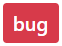

GitHub issues only have two states: open, closed. Dedicated *labels* are defined
to assist SOF bug tracking and triage.

Life Cycle of a Bug
===================

The life cycle of a bug represents the end-to-end resolution workflow:

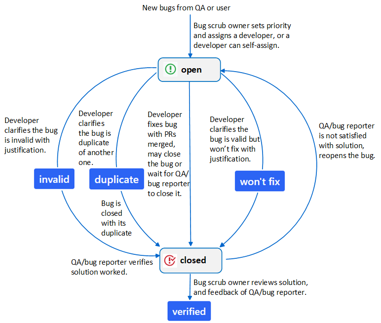

Issue Labels
============

Please find all labels at https://github.com/thesofproject/sof/labels.

* *Solution*, *priority* and *platform* labels are common across SOF
  firmware, Linux kernel driver, and tool repositories.
* *Branch* labels are repository-specific.

Solution Labels
---------------

Usually a developer will fix a bug by submitting pull requests. This
is the default solution and doesn't require an extra solution label.

Otherwise, **developers** add the label |label-invalid|,
|label-duplicate|, or |label-won't-fix| to indicate the solution with
justification:


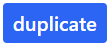


The label |label-verified| is added exclusively by the **bug scrub owner** after
reviewing the solution and confirmation from QA and the reporter:

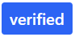

Priority Labels
---------------

The **bug scrub owner** assigns priority to a bug according to its impact:

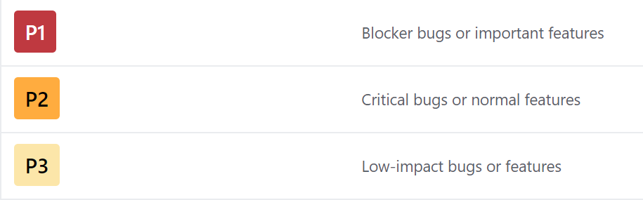

Platform and Branch Labels
--------------------------

Used by **QA** and the **bug reporter**.

*Platform* labels specify the platform or multiple platforms on
which a bug is observed, e.g. |label-byt|, |label-apl|, |label-glk| ...

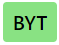


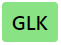

*Branch* labels specify the branch or branches on which a bug is observed,
e.g. |label-branch-v1.2|, |label-branch-glk| ...


.. note::
    *Platform* labels should always be applied.

    *Branch* labels are usually only applied when the branch is not
    the default branch for developing/release on the platform.

    **QA** should *update (add/remove)* platform and branch labels
    according to the latest bug status.

Dependency Labels
-----------------

Two optional labels can be used to call for attention:

* |label-blocked| - Blocked by an external dependency (feature implementation or bug reproduction).
* |label-need-info| - Further information is requested from the reporter.

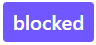

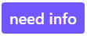

How to Report a Bug
===================

Please `create an issue <https://help.github.com/articles/creating-an-issue/>`_
and apply the label |label-bug|.

Please provide the following information:

* **Title**:
  * Clear, unique, and descriptive summary of the bug. Avoid generic titles like "ipc timeout" or "topology failed to load".
  * Include keywords from the kernel, firmware, or user space error message.
  * Prefix indicating the area of failure, e.g. ``ipc:``, ``topology:``, ``pipeline:``.

* **Environment**:
  * Branch name and commit hash of three repositories: ``sof`` (firmware), ``linux`` (kernel driver), and ``sof-tools`` (tools & topology).
  * Exact topology file name (e.g. ``sof-tgl-nocodec.tplg``).
  * Target platform(s) on which the bug is observed.
  * Reproducibility Rate (e.g. 5/5, or 2/10 intermittent).

* **Steps to Reproduce**:
  * Precise, numbered steps from beginning to end so developers can reproduce the exact scenario.

* **Expected Result**:
  * What the user expected to happen.

* **Actual Result**:
  * What actually occurred in contrast to expected behavior.

* **Proof & Diagnostic Logs**:
  * Paste relevant ``dmesg`` and firmware trace logs into the comment box (including 10 lines before the crash/error).
  * For firmware boot failures, include the **trace point** indicating boot progress:

    |trace-point|

  * Attach full kernel message buffers and firmware trace output.
  * If audio playback/capture is silent, attach current ``amixer`` settings.
  * For audio quality anomalies (noise, glitch sound, distortion):
    * Play/capture a reference sine wave and attach the captured WAV file.
    * Specify frequency, sample rate, bit format, and channel count.
    * Provide Audacity waveform screenshots showing the glitch/distortion (> 10ms):

      |sine-wav|

      Sine wave with audio glitch:

      |sine-with-glitch|

      Zoomed in at glitch start:

      |start-of-glitch|

      Zoomed in at glitch end:

      |end-of-glitch|

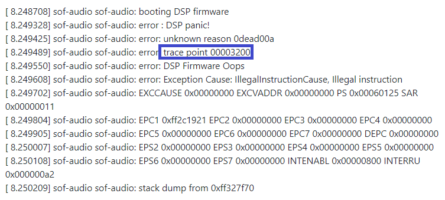

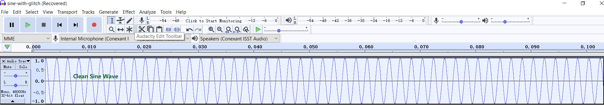

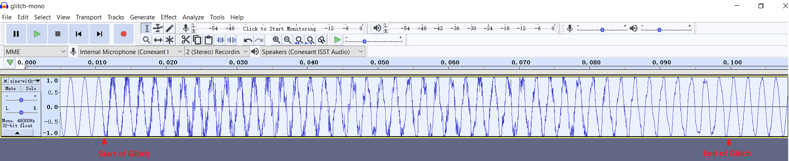

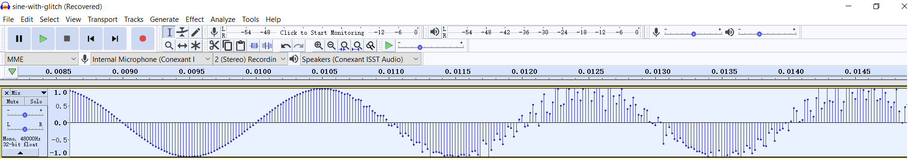

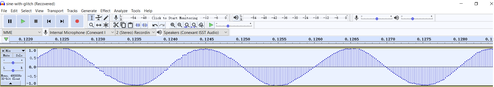

.. note::
    If you encounter multiple separate issues, please file them separately so they can
    be tracked and resolved independently.

    Please use GitHub markdown code fences (`````) for formatting logs, diffs, and terminal commands.

How to Close a Bug
==================

* **Bugs fixed by pull requests**:
  Developers can use GitHub keywords (e.g. ``Fixes #1234``) in commit messages to automatically close bugs when merged.
  Developers can also leave the bug open for QA verification; QA closes the issue once verified.
* **Invalid or Won't Fix**:
  For bugs labeled |label-invalid| or |label-won't-fix|, developers should close them with an explanation.
* **Duplicates**:
  For bugs with label |label-duplicate|, keep the issue open until the primary duplicate issue is resolved and closed.

.. note::
    After a pull request is merged, the developer should always mention (``@``) the bug reporter and QA engineer to verify the resolution.

.. _doc_guidelines:

Documentation Guidelines
************************

The SOF project documentation is authored using `reStructuredText`_ (``.rst``)
with Sphinx extensions, producing the static HTML website hosted at
https://thesofproject.github.io.

Developers can inspect ``.rst`` source files directly or generate the HTML
output locally using ``make html``.

.. _reStructuredText: http://docutils.sourceforge.net/docs/ref/rst/restructuredtext.html
.. _Sphinx extensions: http://www.sphinx-doc.org/en/stable/contents.html
.. _Sphinx Inline Markup: http://sphinx-doc.org/markup/inline.html#inline-markup

Headings
========

Document sections are identified by an underline beneath the title text.
For consistency across the SOF project documentation, use the following underline characters:

* Use ``#`` for Document Title (top level)
* Use ``*`` for First sub-section heading level
* Use ``=`` for Second sub-section heading level
* Use ``-`` for Third sub-section heading level

The heading underline must be at least as long as the title text.

Content Highlighting
====================

Common reST inline markup:

* Single asterisk: ``*text*`` for emphasis (*italics*)
* Double asterisks: ``**text**`` for strong emphasis (**boldface**)
* Double backticks: ````text```` for ``inline code`` and literals

If asterisks or backquotes appear in running prose and could be confused with
inline markup delimiters, prefix them with a backslash (``\``).

Lists
=====

For bullet lists, place an asterisk (``*``) or hyphen (``-``) at
the start of a paragraph and indent continuation lines by two spaces.
Always insert a blank line before the first list item.

For numbered lists, start with ``1.`` and continue with autonumbering using ``#.``:

.. code-block:: rest

   1. First ordered step
   #. Second ordered step
   #. Third ordered step

Definition lists provide a clean term-and-description presentation:

.. code-block:: rest

   make html
      Generates Sphinx HTML documentation output.

   make clean
      Cleans generated documentation build artifacts.

Multi-Column Lists
==================

For long bullet lists with short entries, render them in columns with ``.. hlist::``:

.. code-block:: rest

   .. hlist::
      :columns: 3

      * Item A
      * Item B
      * Item C
      * Item D
      * Item E
      * Item F

File Names and Commands
=======================

Sphinx provides semantic inline roles:

* Files: ``:file:`filename.c```
* Commands: ``:command:`make```
* Double backticks (````code````) can also be used for code symbols and paths.

.. _internal-linking:

Internal Cross-Reference Linking
================================

To create cross-page hyperlinks across the documentation site, define an anchor label
immediately above a section heading:

.. code-block:: rst

   .. _my_unique_target:

   Section Title
   =============

Reference the anchor from any file in the documentation using ``:ref:`my_unique_target```
(renders as the section heading) or ``:ref:`Custom Link Text <my_unique_target>```.

Non-ASCII Characters
====================

Special character substitutions are defined in ``sphinx_build/substitutions.txt``:

.. literalinclude:: ../substitutions.txt
   :language: rst

Code and Command Examples
=========================

Use the ``code-block`` directive to display syntax-highlighted source code or shell sessions:

.. code-block:: rest

   .. code-block:: c

      struct sof_ipc_cmd {
          uint32_t size;
          uint32_t cmd;
      };

Supported languages include ``c``, ``python``, ``bash``, ``console``, ``rst``, and ``none``.

Indentation & Formatting
========================

Indentation is syntactically significant in reST. Use spaces (not tabs).
Directives and list continuations must align with the first character of the parent directive name or list text.
Keep line lengths under 100 characters for optimal review in GitHub pull requests.

.. _dox-source-code:

Documenting Source Code (Doxygen)
*********************************

All public firmware and driver source code items—including functions, structures,
enums, macros, and API declarations in header files—must be documented using
Doxygen (dox) annotations.

Basic Rules
===========

1. All Doxygen comments begin with ``/**`` and end with ``*/``.
2. Short comments appended to structure members begin with ``/**<``. Keep them concise.
3. For multi-line documentation, start with a ``\brief`` summary followed by a blank line and the detailed description.
4. Function parameters are documented with ``\param[in]``, ``\param[out]``, or ``\param[in,out]``, followed by ``\return``.

Examples
========

.. code-block:: c
   :caption: Function Documentation

   /**
    * \brief Allocates and initializes an audio stream buffer.
    * \param[in,out] dev Pointer to the SOF core device structure.
    * \param[in] size Requested buffer capacity in bytes.
    * \param[in] flags Memory allocation flags (e.g. SOF_MEM_ZONE_SYS).
    * \return Pointer to allocated sof_buffer, or NULL on allocation failure.
    */
   struct sof_buffer *sof_buffer_alloc(struct sof_dev *dev, size_t size, uint32_t flags);

.. code-block:: c
   :caption: Structure Documentation

   /**
    * \brief Header for non-IPC ABI component data structures.
    */
   struct sof_abi_hdr {
       uint32_t magic;     /**< 'S', 'O', 'F', '\0' */
       uint32_t type;      /**< Component specific type */
       uint32_t size;      /**< Size in bytes of payload */
       uint32_t abi;       /**< SOF ABI version */
       uint32_t comp_abi;  /**< Component specific ABI version */
       char data[0];
   } __attribute__((packed));

.. code-block:: c
   :caption: Macro Documentation

   /** \brief Current SOF ABI Major Version */
   #define SOF_ABI_VERSION 1

.. _sof_doc:

Building & Publishing Documentation
***********************************

These instructions explain how to build, preview, and publish the SOF documentation
website locally or via Docker.

Documentation Overview
======================

The SOF project documentation sources reside in the `sof-docs <https://github.com/thesofproject/sof-docs>`_
repository. Documentation is built using Sphinx with the PyData Sphinx theme,
the Breathe extension (integrating Doxygen XML generated from the `sof` firmware repository),
and custom data-generation scripts.

Setting Up Working Repositories
===============================

The recommended directory structure stages `sof` and `sof-docs` side-by-side:

.. code-block:: bash

   mkdir -p ~/thesofproject && cd ~/thesofproject
   git clone https://github.com/thesofproject/sof-docs.git
   git clone https://github.com/thesofproject/sof.git
   cd sof-docs
   git remote add upstream https://github.com/thesofproject/sof-docs.git

Installing Documentation Tools
==============================

Install system prerequisites for your operating system:

* **Ubuntu / Debian**:

  .. code-block:: bash

     sudo apt-get install doxygen python3-pip python3-venv make \
        graphviz cmake ninja-build default-jre

* **Fedora / RHEL**:

  .. code-block:: bash

     sudo dnf install doxygen python3-pip make graphviz cmake ninja-build java

Create and activate a dedicated Python virtual environment:

.. code-block:: bash

   cd ~/thesofproject/sof-docs
   python3 -m venv .venv
   source .venv/bin/activate
   pip install -r scripts/requirements.txt -c scripts/constraints.txt

.. _run_documentation_processors:

Running Documentation Processors
================================

Local Build
-----------

To generate the complete HTML documentation:

.. code-block:: bash

   cd ~/thesofproject/sof-docs
   source .venv/bin/activate
   make clean html

The generated static website is located at ``_build/html/index.html``. Open it in any browser:

.. code-block:: bash

   python3 -m http.server 8085 -d _build/html

Docker Build
------------

As an alternative to installing dependencies directly on your workstation, use the Docker builder:

.. code-block:: bash

   cd ~/thesofproject
   ./sof-docs/scripts/docker_build/docker-build.sh

Publishing Content
==================

If you have publishing rights to ``thesofproject.github.io``, you can update the public website:

.. code-block:: bash

   cd ~/thesofproject
   git clone git@github.com:thesofproject/thesofproject.github.io.git
   cd ~/thesofproject/sof-docs
   make publish

Troubleshooting
===============

* **Missing Virtual Environment / Dependencies**:
  Ensure your virtual environment is active (``source .venv/bin/activate``) and all packages from ``scripts/requirements.txt`` are installed.
* **Doxygen API XML Missing**:
  When building without a local ``sof`` checkout, run ``make html LAX=1`` to compile documentation using lax mode.
* **PlantUML Version Incompatibility**:
  Verify the PlantUML compiler version with:

  .. code-block:: bash

     java -jar ./scripts/plantuml.jar -version
