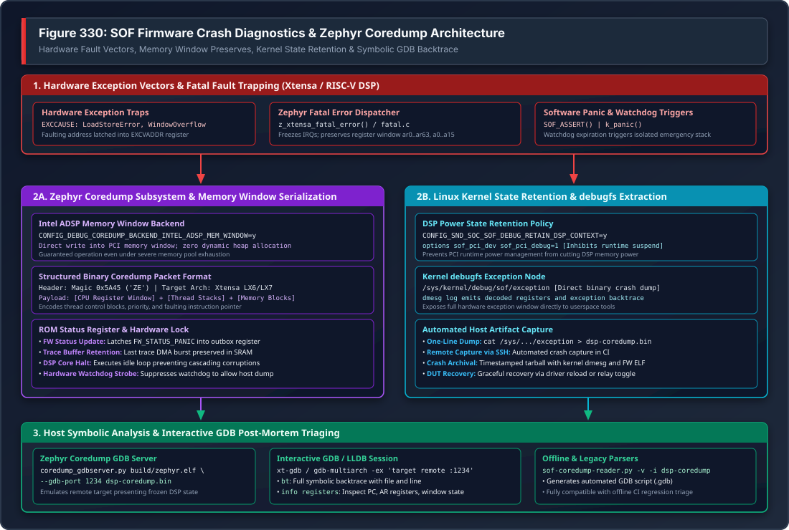

.. _dbg-coredump-reader:

DSP Crash Diagnostics & Zephyr Coredump
#######################################

Sound Open Firmware (SOF) incorporates an automated crash preservation and post-mortem analysis framework. Because embedded audio DSPs frequently operate without virtual memory management units (MMUs) or operating system paging, memory safety violations, unaligned memory accesses, or software assertions result in immediate CPU exception traps.

To prevent critical fault telemetry from being lost upon a crash, modern SOF running on the **Zephyr RTOS** captures processor register state, call frames, and memory segments into hardware memory windows, enabling full symbolic post-mortem backtracing under GDB.

   Figure 330: SOF Firmware Crash Diagnostics & Zephyr Coredump Architecture

---

Architecture Overview
*********************

The crash diagnostics framework spans four coordinated execution tiers:

1. **Hardware Fault Trapping**: When a fatal fault occurs on the DSP core, the hardware exception vector invokes Zephyr's architecture-specific fatal error handler (``arch/xtensa/core/fatal.c``), freezing interrupts and capturing the CPU register state.
2. **Zero-Allocation In-Memory Dump**: The Intel ADSP Memory Window coredump backend (``coredump_backend_intel_adsp_mem_window.c``) serializes register blocks, thread metadata, and active stack frames directly into a shared PCI memory window without performing any dynamic heap allocations.
3. **Kernel Power Retention**: The Linux ``snd-sof`` driver inhibits runtime power management, preventing the host operating system from powering down DSP SRAM and erasing crash telemetry. The crash image is exposed via ``debugfs``.
4. **Interactive GDB Post-Mortem**: Host tools (``coredump_gdbserver.py`` or ``sof-coredump-reader.py``) parse the binary crash dump and establish a GDB session against the firmware ELF binary, providing full symbolic backtraces and variable inspection.

---

Zephyr Coredump Subsystem Configuration
***************************************

SOF enables the native Zephyr coredump framework using the following Kconfig directives in target board configurations:

.. code-block:: cfg

   # Enable Zephyr Coredump Core
   CONFIG_DEBUG_COREDUMP=y
   CONFIG_DEBUG_COREDUMP_BACKEND_INTEL_ADSP_MEM_WINDOW=y
   CONFIG_DEBUG_COREDUMP_MEMORY_DUMP_MIN=y

   # Capture thread stacks and register windows
   CONFIG_DEBUG_COREDUMP_SHELL=n

Memory Window Backend Mechanics
===============================

During a fatal exception, the DSP heap may be corrupted, exhausted, or inaccessible. The ``coredump_backend_intel_adsp_mem_window`` backend operates under strict emergency constraints:

* **Static Buffering**: Writes directly into the pre-mapped host-accessible DSP memory window (SRAM Window 0/3).
* **Zero Allocation**: Executes without calling ``k_malloc()``, ``malloc()``, or acquiring RTOS synchronization primitives.
* **ROM Status Handshake**: Latches ``FW_STATUS_PANIC`` into the DSP status outbox register, signaling the host kernel that a panic dump is ready for extraction.
* **Halt Loop**: Enters a controlled low-power idle loop to prevent cascading memory corruption or repeated exception loops.

---

Captured Processor Architecture State
*************************************

On Tensilica Xtensa DSP architectures (e.g. Intel cAVS 2.5 on Tiger Lake, ACE 1.5 on Arrow Lake, ACE 3.0 on Panther Lake), the coredump captures complete architectural state:

Special Registers
=================

* **``PC`` (Program Counter)**: Exact instruction address executing at the time of the fault.
* **``PS`` (Processor State)**: CPU privilege level, interrupt mask, and register window pointer.
* **``EXCCAUSE`` (Exception Cause)**: Hardware fault code identifying the failure type.
* **``EXCVADDR`` (Exception Virtual Address)**: Memory address that triggered the violation (for load/store errors).
* **``EPC1`` .. ``EPC7``**: Saved program counters across nested interrupt priority levels.

Register Window File
====================

Xtensa processors employ a windowed register architecture consisting of up to 64 physical registers (``ar0`` .. ``ar63``). At any given moment, the active function operates on a 16-register sliding window (``a0`` .. ``a15``):

* **``a0``**: Function return address (used to reconstruct caller stack frames).
* **``a1``**: Stack pointer (points to local variables and spilled register frames).
* **``a2`` .. ``a7``**: Incoming function parameters and return values.
* **``a8`` .. ``a15``**: Local variables and temporary registers.

The coredump backend dumps both the active register window and the spilled register frames on the stack, allowing GDB to reconstruct the full call hierarchy across all active function calls.

---

Kernel State Retention & Crash Extraction
*****************************************

Preventing Runtime D3 Power-Off
===============================

By default, Linux runtime power management (Runtime PM) automatically places idle audio DSPs into low-power D3 suspend, cutting power to DSP SRAM. If a crash occurs and the audio stream halts, Runtime PM would power off the DSP and permanently erase the coredump before the developer can inspect it.

To preserve the crash telemetry in memory, configure the driver retention policy:

1. **Kernel Configuration**:
   Ensure ``CONFIG_SND_SOC_SOF_DEBUG_RETAIN_DSP_CONTEXT=y`` is enabled in the host kernel.

2. **Module Parameter**:
   Set ``sof_pci_debug=1`` in ``/etc/modprobe.d/sof.conf``:

   .. code-block:: text

      # Prevent DSP power-down on fatal exceptions
      options snd_sof_pci sof_pci_debug=1

Extracting the Dump File
========================

Once an exception occurs, the Linux driver logs the failure in ``dmesg`` and populates the ``debugfs`` exception node:

.. code-block:: bash

   # Verify crash event in dmesg
   sudo dmesg | grep -i "dsp exception"

   # Extract raw coredump binary
   sudo cat /sys/kernel/debug/sof/exception > /tmp/dsp-coredump.bin

   # Check dump size
   ls -lh /tmp/dsp-coredump.bin

---

Interactive GDB Post-Mortem Debugging Runbook
*********************************************

Step 1: Launch Zephyr Coredump GDB Server
=========================================

The Zephyr RTOS provides ``coredump_gdbserver.py``, which reads the binary dump file, maps the frozen DSP register and memory state, and emulates a live GDB remote stub:

.. code-block:: bash

   # Launch GDB server on localhost:1234
   python3 ~/work/sof-tgl/zephyr/scripts/coredump/coredump_gdbserver.py \
       --gdb-port 1234 \
       build-sof-staging/sof/sof-tgl.elf \
       /tmp/dsp-coredump.bin

Step 2: Connect Interactive GDB Session
=======================================

In a second terminal, launch the target-specific cross-debugger (``xt-gdb`` or ``gdb-multiarch``) with the matching firmware ELF binary:

.. code-block:: bash

   # For Cadence Xtensa toolchain:
   xt-gdb build-sof-staging/sof/sof-tgl.elf -ex 'target remote :1234'

   # For Open-Source LLVM / multiarch toolchains:
   gdb-multiarch build-sof-staging/sof/sof-tgl.elf -ex 'target remote :1234'

Step 3: Post-Mortem Triage Commands
===================================

Once attached, execute standard GDB inspection commands:

.. code-block:: text

   (gdb) bt
   #0  eq_fir_process (dev=0x9e0a4e78) at src/audio/eq_fir/eq_fir.c:142
   #1  0xbe02fb29 in comp_copy (dev=0x9e0a4e78) at src/audio/component.c:85
   #2  0xbe04e277 in pipeline_task (arg=0x9e0a37d0) at src/audio/pipeline/pipeline.c:320
   #3  0xbe050a28 in z_thread_entry (entry=0xbe04e200, p1=0x9e0a37d0, p2=0, p3=0)

   (gdb) info registers
   pc             0xbe051b00       0xbe051b00 <eq_fir_process+124>
   ps             0x60020          393248
   exccause       0xc              12 (LoadStoreError)
   excvaddr       0xdeadbeef       -559038737
   a0             0xbe02fb29       -1107092695
   a1             0x9e0a4044       -1643495356
   a2             0x9e0a4e78       -1643491720

   (gdb) frame 0
   (gdb) print *dev
   $1 = {state = 2, frames = 48, rate = 48000, channels = 2, ...}

   (gdb) list
   140         for (int i = 0; i < dev->frames; i++) {
   141             /* Attempting to read filter coefficients from unmapped address */
   142             int32_t coef = cd->fir_coefs[i];
   143             accum += (sample * coef) >> 15;

---

Legacy & Offline Coredump Reader
********************************

For environments without Python GDB server support or when triaging pre-Zephyr dumps, the ``sof-coredump-reader.py`` tool converts binary dumps into GDB script files:

.. code-block:: bash

   # Convert dump to GDB script
   python3 tools/coredumper/sof-coredump-reader.py -v -l 4 \
       -i /tmp/dsp-coredump.bin \
       -o /tmp/dsp-coredump.gdb

   # Run xt-gdb with generated script
   xt-gdb build-sof-staging/sof/sof-tgl.elf --command=/tmp/dsp-coredump.gdb

Command-Line Options
====================

.. list-table:: sof-coredump-reader.py Flags
   :widths: 20 80
   :header-rows: 1

   * - Option
     - Description
   * - ``-a <arch>``
     - Target architecture format (``LE32bit`` or ``LE64bit``).
   * - ``-v``
     - Increase output verbosity, printing raw stack offsets and registers.
   * - ``-l <cols>``
     - Group memory and stack dump columns for improved terminal readability.
   * - ``-i <file>``
     - Path to binary crash dump extracted from ``/sys/kernel/debug/sof/exception``.
   * - ``-o <file>``
     - Output path for generated GDB batch command script.

---

Common DSP Exception Causes & Triage Guide
******************************************

.. list-table:: Common Xtensa EXCCAUSE Fault Codes & Resolutions
   :widths: 15 20 65
   :header-rows: 1

   * - Cause Code
     - Exception Name
     - Typical Root Cause & Debugging Action
   * - **0**
     - ``IllegalInstruction``
     - Execution jumped to an invalid memory location or uninitialized function pointer. Inspect ``a0`` (return address) and stack backtrace to identify corrupt callback structures.
   * - **9**
     - ``LoadStoreAlignment``
     - An unaligned 32-bit or 64-bit load/store was attempted on an odd address boundary. Ensure audio sample pointers are aligned to 4 or 8 bytes (``ALIGN_UP(ptr, 4)``).
   * - **12**
     - ``InstructionFetchError``
     - Attempted to execute code from non-executable or powered-off DSP memory bank. Check dynamic power gating of SRAM banks or LLEXT dynamic module memory permissions.
   * - **13**
     - ``LoadStoreError``
     - Attempted to access non-existent MMIO address or unmapped host DMA window. Inspect ``excvaddr`` in GDB to determine the illegal pointer address.
   * - **28**
     - ``IntegerDivideByZero``
     - Division by zero in audio rate calculation or period size. Validate sample rate and channel count configurations received via IPC before dividing.
   * - **Software Panic**
     - ``k_panic() / SOF_ASSERT``
     - Explicit assertion failure triggered by defensive runtime checks (e.g. buffer size overrun). Locate the assertion line from the symbol table and verify parameter constraints.
