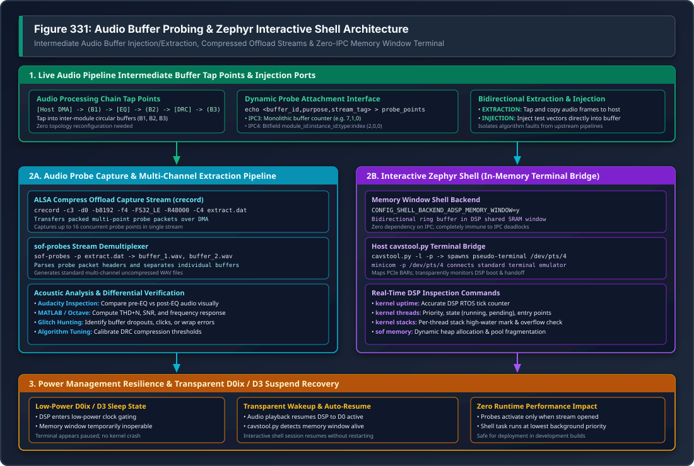

.. _dbg-probes:

Audio Data Probes & Network Telemetry
#####################################

In complex audio DSP processing graphs, a playback or capture pipeline contains multiple sequential processing modules (such as Volume, Equalizers, Dynamic Range Compressors, Sample Rate Converters, and Mixers) connected by intermediate circular audio buffers. When audio distortion, phase cancellation, or audible dropouts occur, inspecting only the final hardware endpoint does not reveal which component in the graph corrupted the audio stream.

The SOF **Probe Subsystem** provides a dynamic, non-intrusive tap mechanism that allows developers to:

1. **Extract Intermediate Audio Data**: Tap into any circular audio buffer in the pipeline graph in real time and capture raw audio samples via ALSA Compress Offload.
2. **Inject Test Audio Vectors**: Feed synthetic test signals (chirps, impulse responses, multi-tone bursts) directly into an intermediate component buffer, isolating downstream algorithm behavior.
3. **Stream High-Throughput Firmware Telemetry**: Utilize dedicated probe DMA channels to stream binary logs over the network via the **TCP Probe Server** (port 9999).

   Figure 331: Audio Buffer Probes & Zephyr Interactive Shell Architecture

---

Enabling Probes in Kernel and Firmware
**************************************

Kernel Configuration
====================

Probes operate as an ALSA SOF client driver backed by ``debugfs``:

1. **Kernel Kconfig Options**:

   .. code-block:: cfg

      CONFIG_SND_SOC_SOF_DEBUG_PROBES=y
      CONFIG_DEBUG_FS=y

2. **Module Configuration** (``/etc/modprobe.d/sof.conf``):
   Enable the probes client driver upon boot and optionally lock its card slot assignment (e.g. Card 3):

   .. code-block:: text

      options snd_sof_probes enable=1
      options snd slots=,,,snd_sof_probes

3. **Reload Driver**:

   .. code-block:: bash

      sudo rmmod snd_sof_probes 2>/dev/null
      sudo modprobe snd_sof_probes
      cat /proc/asound/cards | grep -i "sofprobes"

Firmware Configuration
======================

In the SOF firmware Zephyr build, enable probe points in Kconfig:

.. code-block:: cfg

   # Enable runtime audio buffer probes
   CONFIG_PROBE=y
   CONFIG_PROBE_POINTS_MAX=16

   # Enable probe logging backend
   CONFIG_LOG_BACKEND_SOF_PROBE=y
   CONFIG_ZEPHYR_LOG=y

No modifications to the ALSA Topology file are required; probe tap points are attached dynamically to running pipelines at runtime.

---

Audio Buffer Extraction & Injection Workflow
********************************************

Step 1: Discover Buffer IDs
===========================

To attach a probe point, determine the internal buffer identifier of the target module:

For IPC3 Platforms
------------------
Buffer IDs follow component instantiation order. Inspect kernel ``dmesg``:

.. code-block:: bash

   dmesg | grep "tplg: widget "
   # Output:
   # snd_sof: tplg: widget 2 (gain.1.1) is ready [type: 6, pipe: 1, pins: 1 / 1]
   # snd_sof: tplg: widget 3 (eq_fir.1.1) is ready [type: 12, pipe: 1, pins: 1 / 1]
   # snd_sof: tplg: widget 7 (dai-copier.HDA.playback) is ready [type: 27, pipe: 1, pins: 1 / 0]

For IPC4 Platforms
------------------
On IPC4 platforms (e.g. Tiger Lake, Meteor Lake, Arrow Lake, Panther Lake), the buffer ID is a structured 32-bit bitfield (``probe_point_id_t``):

.. code-block:: c

   typedef union probe_point_id {
       uint32_t full_id;
       struct {
           uint32_t module_id   : 16; /**< Target module ID (e.g. 2 for gain) */
           uint32_t instance_id : 8;  /**< Module instance counter (e.g. 0) */
           uint32_t type        : 2;  /**< Probe point type (input vs output queue) */
           uint32_t index       : 6;  /**< Pin/queue index within target module */
       } fields;
   } probe_point_id_t;

Step 2: Start Compress Offload Capture (crecord)
================================================

The probe stream is captured through the ALSA Compress Offload interface using the ``crecord`` tool (provided by `tinycompress <https://github.com/alsa-project/tinycompress>`_):

.. code-block:: bash

   # Start capture on Card 3, Device 0 with 8KB buffer and 4 periods
   crecord -c3 -d0 -b8192 -f4 -FS32_LE -R48000 -C4 /tmp/extract.dat &
   CRECORD_PID=$!

Step 3: Attach Probe Points via debugfs
=======================================

Write the probe attachment triplet into ``/sys/kernel/debug/sof/probe_points``:

.. code-block:: bash

   # Format: echo <buffer_id>,<purpose>,<stream_tag> > /sys/kernel/debug/sof/probe_points

   # IPC3 Example: Extract from buffer 3 (EQ output), purpose=1 (EXTRACTION), stream_tag=0
   echo 3,1,0 | sudo tee /sys/kernel/debug/sof/probe_points

   # IPC4 Example: Extract from module 2, instance 0, purpose=0 (EXTRACTION), stream_tag=0
   echo 2,0,0 | sudo tee /sys/kernel/debug/sof/probe_points

Step 4: Play Audio & Stop Capture
=================================

.. code-block:: bash

   # Start audio playback through the pipeline
   aplay -D hw:0 -r 48000 -c 2 -f S16_LE /path/to/test_sweep.wav

   # When complete, terminate crecord
   kill -SIGINT $CRECORD_PID

---

Multi-Channel Demultiplexing (sof-probes)
*****************************************

Because a single compress capture stream can aggregate audio data from up to 16 simultaneous probe tap points, the raw ``extract.dat`` file contains interleaved multi-point packet frames.

Use the **``sof-probes``** utility with the ``-p`` (parse) flag to demultiplex the stream into separate, uncompressed standard WAV files:

.. code-block:: bash

   # Demux raw probe extraction file
   sof-probes -p /tmp/extract.dat

   # Output generated:
   # sof-probes: Parsing file: /tmp/extract.dat
   # sof-probes: Creating wave file for buffer id: 3 -> buffer_3.wav
   # sof-probes: Creating wave file for buffer id: 7 -> buffer_7.wav
   # sof-probes: done

Inspect the resulting ``buffer_*.wav`` files in audio analysis tools such as **Audacity**, MATLAB, or GNU Octave:

* Compare pre-processing vs post-processing waveforms side-by-side.
* Calculate Total Harmonic Distortion + Noise (THD+N) and Signal-to-Noise Ratio (SNR).
* Visually identify clipping, unaligned sample phase, or dropped audio frames.

---

High-Throughput Network Probe Server (Port 9999)
************************************************

On remote hardware test stations (DUTs), running file-based captures over SSH introduces terminal overhead and network latency. SOF provides the **``sof_probe_server``** C streaming daemon listening on TCP port **9999**:

.. code-block:: text

   +-------------------------------------------------------------------------+
   |                       Target DUT (Linux Kernel)                         |
   |                                                                         |
   |  [ DSP Audio Pipeline ] ---> [ Trace / Probe DMA ]                      |
   |                                     |                                   |
   |                                     v                                   |
   |                         [ /dev/snd/comprC3D0 ]                          |
   |                                     |                                   |
   |                                     v                                   |
   |                   [ sof_probe_server (TCP :9999) ]                      |
   |                   (1MB Thread-Safe Circular Queue)                      |
   +-------------------------------------------------------------------------+
                                        |
                          Private Lab Network Stream
                                        v
   +-------------------------------------------------------------------------+
   |                       Host Analysis Workstation                         |
   |                                                                         |
   |  [ sof_probe_client.py ]       or       [ dut-monitor Dashboard ]       |
   |   --display ascii --out /tmp/data.bin    (Live Decoded Logs: Section 4) |
   +-------------------------------------------------------------------------+

C Server Architecture
=====================

* **ALSA Compress Interface**: Directly opens ``/dev/snd/comprC*D*`` using native ALSA compress ioctls.
* **1 MB Circular Buffer**: Uses a POSIX mutex and condition variable (``pthread_mutex_t`` / ``pthread_cond_t``) circular buffer to completely decouple kernel DMA extraction from network TCP socket writes.
* **Low CPU Overhead**: Consumes negligible CPU cycles (<1%) on host and embedded cores.

Running Probe Server on DUT
===========================

.. code-block:: bash

   # Launch probe server on target DUT
   timeout 15 ssh -o ConnectTimeout=5 root@<dut> \
       'nohup /usr/local/bin/sof_probe_server -c 3 -d 0 -p 9999 -v > /tmp/probe_server.log 2>&1 &'

Remote Data Collection via Python Client
========================================

On the development workstation, run ``sof_probe_client.py``:

.. code-block:: bash

   # Stream and save raw binary probe data
   python3 tools/sof-probe-server/sof_probe_client.py \
       --host <dut-ip> --port 9999 \
       --output /tmp/dut_probe_data.bin

   # Display live ASCII logs decoded from probe stream
   python3 tools/sof-probe-server/sof_probe_client.py \
       --host <dut-ip> --port 9999 \
       --display ascii

   # Preview raw packet headers in hexadecimal
   python3 tools/sof-probe-server/sof_probe_client.py \
       --host <dut-ip> --port 9999 \
       --display hex

Integrated dut-monitor Multi-Pane Dashboard
===========================================

The ``dut-monitor`` terminal monitoring suite automatically connects to ``sof_probe_server`` on TCP port 9999. Decoded DSP firmware logs are displayed in real-time in **Section 4**, synchronized with live hardware power consumption telemetry (port 8080) and CPU thermal metrics.

---

Early Boot Probe Logging (snd-sof-probes)
*****************************************

The ``snd-sof-probes`` kernel module provides the ``logging_boot_enable`` parameter to capture initialization logs from the very start of firmware execution:

.. code-block:: bash

   # 1. Enable boot logging in kernel module
   timeout 20 ssh -o ConnectTimeout=5 root@<dut> '
       rmmod snd_sof_probes 2>/dev/null
       modprobe snd_sof_probes logging_boot_enable=1
       dmesg | grep "logging_boot"
   '

   # 2. Start probe server and initiate dummy stream to drain pre-buffered logs (up to 4 KB)
   timeout 15 ssh -o ConnectTimeout=5 root@<dut> '
       pkill -f sof_probe_server; pkill aplay; sleep 1
       nohup /usr/local/bin/sof_probe_server -c 3 -d 0 -p 9999 -v > /tmp/probe.log 2>&1 &
       nohup aplay -D hw:0 -r 48000 -c 2 -f S16_LE /dev/zero > /dev/null 2>&1 &
   '

   # 3. Stream early boot trace to workstation
   timeout 60 python3 tools/sof-probe-server/sof_probe_client.py \
       --host <dut-ip> --port 9999 --display ascii --out /tmp/boot_trace.bin

Subsequent test sessions can be launched back-to-back without reloading the kernel driver, as the ``fw_probe_active`` state machine tracks extraction state across multiple stream lifetimes.

---

Intel Arrow Lake mtrace Buffer Extraction
*****************************************

On Intel Arrow Lake (ARL-S) platforms running ACE 1.5, firmware logs can also be retrieved directly from the hardware ``mtrace`` buffer:

.. code-block:: bash

   # Start mtrace reader prior to test execution or driver reload
   timeout 15 ssh -o ConnectTimeout=5 root@<dut> \
       'nohup ./mtrace-reader.py > /tmp/fw_mtrace.log 2>&1 &'

   # Execute test audio pipeline
   timeout 30 ssh -o ConnectTimeout=5 root@<dut> \
       'aplay -D hw:0 -r 48000 -c 2 -f S16_LE /dev/zero -d 5'

   # Retrieve formatted mtrace log
   scp root@<dut>:/tmp/fw_mtrace.log ./fw_mtrace.log

   # Terminate reader
   timeout 15 ssh -o ConnectTimeout=5 root@<dut> 'pkill -f mtrace-reader'
