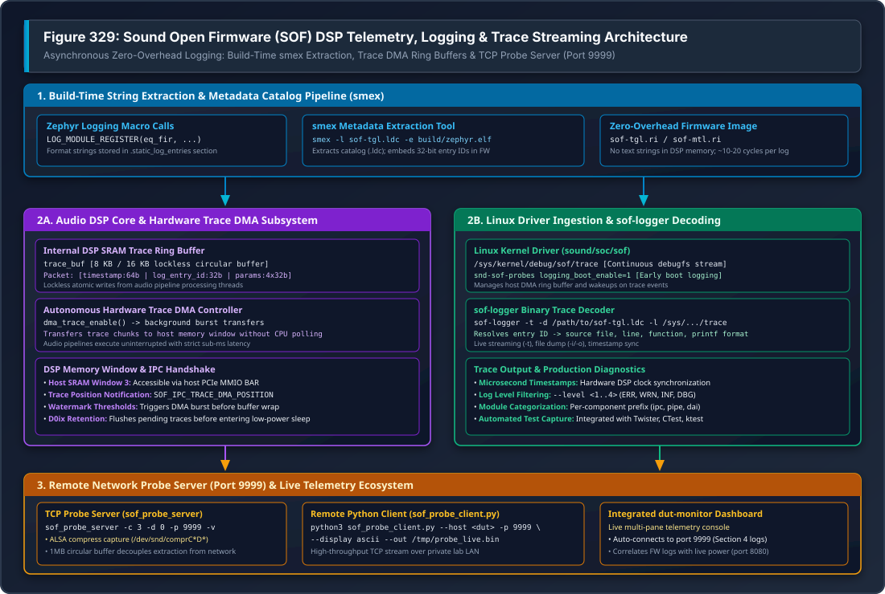

.. _dbg-traces:

DSP Telemetry, Logging & Traces
###############################

Sound Open Firmware (SOF) features a high-performance, asynchronous logging and telemetry infrastructure designed specifically for hard real-time embedded audio DSPs. Because audio signal processing operates on strict sub-millisecond scheduling deadlines (e.g. 1 ms or 200 µs periods), DSP firmware cannot block on slow UART serial writes or synchronous host communications. Instead, SOF combines compile-time string dictionary extraction (**smex**), hardware DMA circular buffers, native Zephyr RTOS structured logging, and network-accessible telemetry servers.

   Figure 329: Sound Open Firmware (SOF) DSP Telemetry, Logging & Trace Streaming Architecture

---

Architecture Overview
*********************

The SOF logging infrastructure is split into three decoupled operational stages:

1. **Build-Time Dictionary Extraction**: C source strings and format specifications are stripped from the target executable and saved into an external Log Dictionary Catalog (``.ldc``), embedding only 32-bit metadata IDs into the firmware binary.
2. **Runtime Execution & Autonomous DMA**: The DSP core writes fixed-size binary trace packets into an internal SRAM circular ring buffer. A dedicated background hardware DMA channel transfers trace chunks to a shared host memory window without stalling audio pipeline processing loops.
3. **Host-Side Ingestion & Real-Time Decoding**: The host Linux kernel exposes binary trace buffers via ``debugfs``, and user-space utilities (``sof-logger``, ``sof_probe_server``) decode entry IDs against the ``.ldc`` dictionary in real time.

---

Zephyr Structured Logging Integration
*************************************

Modern SOF firmware natively integrates with the Zephyr RTOS logging subsystem (`zephyr/logging/log.h`). Each firmware module registers its logging domain and default verbosity level:

.. code-block:: c

   #include <zephyr/logging/log.h>
   #include <sof/audio/component_ext.h>

   /* Register module with Kconfig-defined default log level */
   LOG_MODULE_REGISTER(eq_fir, CONFIG_SOF_LOG_LEVEL);

   int eq_fir_process(struct comp_dev *dev)
   {
       LOG_DBG("eq_fir_process: dev %p, frame count %u", dev, dev->frames);

       if (dev->state != COMP_STATE_ACTIVE) {
           LOG_WRN("eq_fir: processing called while state=%u not active", dev->state);
           return -EINVAL;
       }

       /* Processing inner loop executes without logging overhead */
       return 0;
   }

Standard Logging Levels
=======================

SOF utilizes four standard log levels mapped directly to Zephyr severity ratings:

.. list-table:: SOF Logging Macro Severity & Guidelines
   :widths: 15 15 70
   :header-rows: 1

   * - Logging Macro
     - Numeric Level
     - Recommended Production & Debug Usage
   * - ``LOG_ERR(...)``
     - Level 1
     - Critical runtime failures, unrecoverable hardware errors, invalid IPC state transitions, memory allocations faults. Always enabled in production.
   * - ``LOG_WRN(...)``
     - Level 2
     - Recoverable boundary conditions, parameter sanitization clamps, non-fatal buffer underrun/overrun warnings.
   * - ``LOG_INF(...)``
     - Level 3
     - Milestone events: component instantiation, pipeline binding, audio stream start/stop, clock frequency changes, power state transitions (D0 $\leftrightarrow$ D0ix).
   * - ``LOG_DBG(...)``
     - Level 4
     - Verbose per-buffer execution traces, coefficient updates, DMA pointer offsets. Disabled in release builds to save CPU cycles and DMA bandwidth.

---

Compile-Time String Extraction with smex
****************************************

To minimize the DSP memory footprint and avoid transmitting bulky ASCII text across memory buses, SOF employs the **smex** (String Metadata Extractor) build tool:

1. **Linker Placement**: String literals, filenames, line numbers, and printf format arguments in ``LOG_*`` invocations are placed in a dedicated read-only section (``.static_log_entries``) of the ELF binary.
2. **Metadata Harvesting**: During the firmware build, ``smex`` parses the ``.static_log_entries`` section of ``zephyr.elf``:

   .. code-block:: bash

      smex -l build/sof-tgl.ldc -e build/zephyr/zephyr.elf

3. **Dictionary Catalog (``.ldc``)**: ``smex`` extracts format strings and argument typing into the ``.ldc`` catalog file. In the binary firmware image (``.ri`` / ``.bin``), the compiler and linker emit compact 32-bit integer entry IDs.
4. **Footprint Reduction**: This reduces firmware binary size by 40–70% and reduces DSP trace logging execution to approximately 10–20 clock cycles per event.

---

Runtime DSP Trace DMA Engine
****************************

At runtime, logging operations must never interrupt audio pipelines executing on strict DMA-driven period boundaries:

.. code-block:: text

   +-------------------------------------------------------------------------+
   |                      DSP Internal SRAM (trace_buf)                      |
   |                                                                         |
   |  [ Audio Thread ] ---> Lockless Atomic Write -> [ Packet 0 | Packet 1 ] |
   +-------------------------------------------------------------------------+
                                        |
                          Autonomous Trace DMA Transfer
                                        v
   +-------------------------------------------------------------------------+
   |                  Host Shared Memory (SRAM Window 3)                     |
   |                                                                         |
   |  [ DMA Position IPC ] -> Host Driver Interrupt -> [ Linux debugfs trace]|
   +-------------------------------------------------------------------------+

Trace Packet Structure
======================

Each binary trace entry emitted into the internal SRAM circular buffer contains a packed binary header:

.. code-block:: c

   struct sof_log_entry {
       uint64_t timestamp;     /**< Hardware DSP timer tick count */
       uint32_t log_entry_id;  /**< 32-bit metadata ID resolved via .ldc catalog */
       uint32_t params[4];     /**< Up to 4 runtime 32-bit format arguments */
   } __attribute__((packed));

Autonomous Background Transfer
==============================

* **Lockless Ring Buffer**: The internal trace buffer (typically 8 KB or 16 KB) operates locklessly. Audio processing threads append trace packets using atomic pointer operations without acquiring mutexes or disabling interrupts.
* **Trace DMA Controller**: A background hardware DMA channel transfers accumulated trace chunks to host shared memory (SRAM Window 3 on Intel cAVS/ACE architectures).
* **Watermark Triggering**: When the buffer reaches its configured watermark threshold or a periodic timer fires, the DMA burst executes autonomously without DSP CPU polling.
* **Trace Position IPC**: The DSP notifies the host kernel of newly available trace data by posting an asynchronous ``SOF_IPC_TRACE_DMA_POSITION`` message containing the write pointer offset.

---

Host-Side Ingestion & Decoding
******************************

Linux Kernel debugfs Trace Node
===============================

On Linux hosts with the mainline SOF driver loaded, the raw binary trace buffer is exposed via ``debugfs``:

.. code-block:: text

   /sys/kernel/debug/sof/trace

Reading this file yields the continuous binary stream emitted by the DSP Trace DMA engine.

Early Boot Logging (snd-sof-probes)
===================================

To capture early firmware initialization messages prior to userspace audio server startup, the ``snd-sof-probes`` client driver provides the ``logging_boot_enable`` parameter:

.. code-block:: bash

   # Reload probe driver with boot logging enabled
   sudo rmmod snd_sof_probes 2>/dev/null
   sudo modprobe snd_sof_probes logging_boot_enable=1

   # Verify boot logging initialization in kernel dmesg
   dmesg | grep "logging_boot"

When enabled, the driver automatically allocates extraction DMA channels during probe registration and drains pre-buffered firmware initialization logs (up to 4 KB) before ALSA audio streams open.

---

Using sof-logger
****************

The ``sof-logger`` host utility reads the binary trace stream, resolves metadata entry IDs using the ``.ldc`` catalog, and prints formatted messages with microsecond-accurate timestamps:

Live Continuous Streaming
=========================

.. code-block:: bash

   # Stream and decode live traces directly from debugfs
   sof-logger -t -l /lib/firmware/intel/sof-ipc4/tgl/community/sof-tgl.ldc

Offline Binary Trace Decoding
=============================

If a binary trace dump was captured during an automated test run or hardware crash:

.. code-block:: bash

   # Dump raw trace buffer to file
   cat /sys/kernel/debug/sof/trace > /tmp/fw_trace.bin

   # Decode offline trace file
   sof-logger -d /path/to/sof-tgl.ldc -i /tmp/fw_trace.bin -o /tmp/decoded_trace.txt

Command-Line Options
====================

.. list-table:: sof-logger Common Flags
   :widths: 20 80
   :header-rows: 1

   * - Flag
     - Description & Usage
   * - ``-t``
     - Enable continuous real-time streaming mode (follows stream until interrupted).
   * - ``-l <file.ldc>``
     - Specify the Log Dictionary Catalog file matching the target firmware build.
   * - ``-i <input.bin>``
     - Read binary trace data from a saved file instead of the default debugfs node.
   * - ``-o <output.txt>``
     - Write human-readable decoded trace output to the specified file.
   * - ``-p``
     - Strip ANSI color formatting codes for clean file logging.
   * - ``--level <1..4>``
     - Filter messages below the specified severity level (1=ERR, 2=WRN, 3=INF, 4=DBG).

---

Network Probe Server Streaming (Port 9999)
******************************************

On remote development and automated validation setups (DUTs), running ``sof-logger`` over SSH introduces significant network latency and terminal process overhead. SOF provides a high-throughput C streaming daemon—**``sof_probe_server``**—listening on TCP port **9999**:

.. code-block:: text

   +--------------------------+                 +--------------------------+
   |   Target DUT (Spider)    |                 | Host Analysis Workstation|
   |                          |                 |                          |
   | [ DSP Trace DMA ]        |                 |                          |
   |         |                |                 |                          |
   |         v                |                 |                          |
   | [/dev/snd/comprC3D0]     |                 |                          |
   |         |                |                 |                          |
   |         v                |                 |                          |
   | [sof_probe_server :9999] | --- TCP/LAN --> | [sof_probe_client.py]    |
   |   (1MB Ring Buffer)      |   (Port 9999)   |          or              |
   |                          |                 | [dut-monitor Dashboard] |
   +--------------------------+                 +--------------------------+

Running the Probe Server on Target DUT
======================================

.. code-block:: bash

   # Launch probe server on target board in background
   timeout 15 ssh -o ConnectTimeout=5 root@spider \
       'nohup /usr/local/bin/sof_probe_server -c 3 -d 0 -p 9999 -v > /tmp/probe_server.log 2>&1 &'

Streaming via Host Python Client
================================

On the host workstation, stream and preview logs over the network:

.. code-block:: bash

   # Connect to DUT probe server and stream live ASCII log output
   python3 ~/work/sof-tgl/tools/sof-probe-server/sof_probe_client.py \
       --host spider --port 9999 --display ascii --out /tmp/spider_trace.bin

Integrated dut-monitor Dashboard
================================

The ``dut-monitor`` terminal dashboard automatically connects to ``sof_probe_server`` on TCP port 9999 and renders live decoded DSP logs in **Section 4**, alongside synchronized power telemetry (port 8080) and CPU metrics.

---

Troubleshooting & Diagnostics
*****************************

Trace Buffer Wraparound & Missing Entries
=========================================

* **Symptom**: ``sof-logger`` prints ``[DROPPED X ENTRIES]`` or non-sequential timestamps.
* **Root Cause**: Host reader cannot consume trace DMA packets quickly enough during bursts of ``LOG_DBG`` calls, overflowing the internal SRAM buffer.
* **Resolution**:
  1. Filter out high-frequency debug logs by raising ``CONFIG_SOF_LOG_LEVEL`` to ``CONFIG_LOG_DEFAULT_LEVEL=3`` (INFO).
  2. Increase internal trace buffer size in Kconfig: ``CONFIG_SOF_TRACE_BUF_SIZE=16384``.
  3. Stream via ``sof_probe_server`` using its 1 MB host-side circular queue rather than reading directly through debugfs over SSH.

Dictionary Mismatch (Unresolved IDs)
====================================

* **Symptom**: ``sof-logger`` outputs ``<unknown log entry 0x12ab34cd>``.
* **Root Cause**: The ``.ldc`` dictionary supplied to ``sof-logger`` does not match the exact binary running on the DSP.
* **Resolution**: Ensure the ``.ldc`` file corresponds to the identical Git commit and build configuration:

  .. code-block:: bash

     sof-logger -l build-sof-staging/sof/sof-tgl.ldc -t

Zero Data from debugfs Node
===========================

* **Symptom**: ``cat /sys/kernel/debug/sof/trace`` returns 0 bytes.
* **Root Cause**: Trace DMA is not enabled or the DSP core is suspended in D0ix sleep.
* **Resolution**:
  1. Start an audio playback stream to bring the DSP into active D0 state: ``aplay -D hw:0 -r 48000 -c 2 -f S16_LE /dev/zero &``.
  2. Verify kernel probe module: ``modprobe snd-sof-probes logging_boot_enable=1``.
