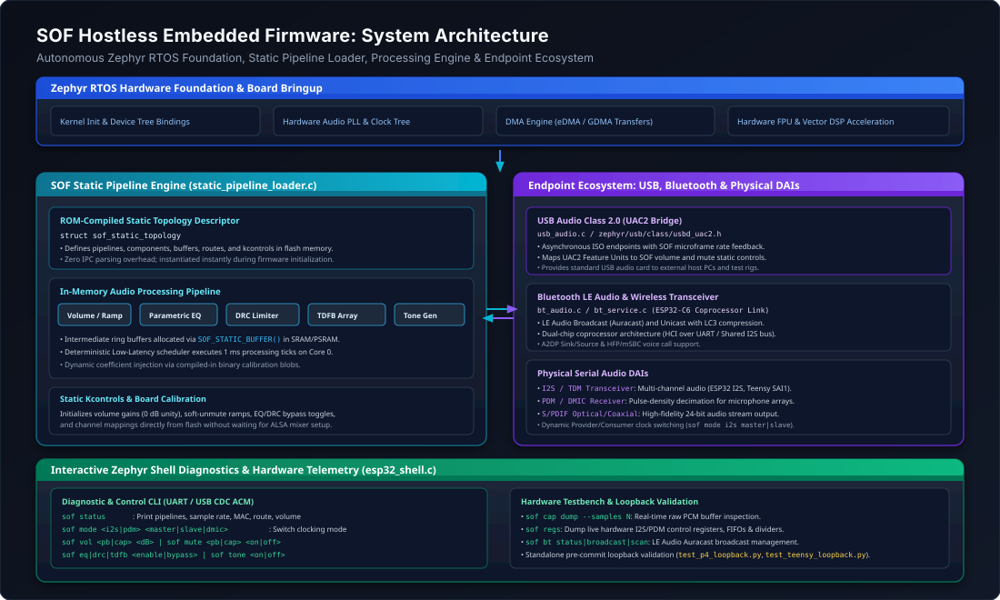
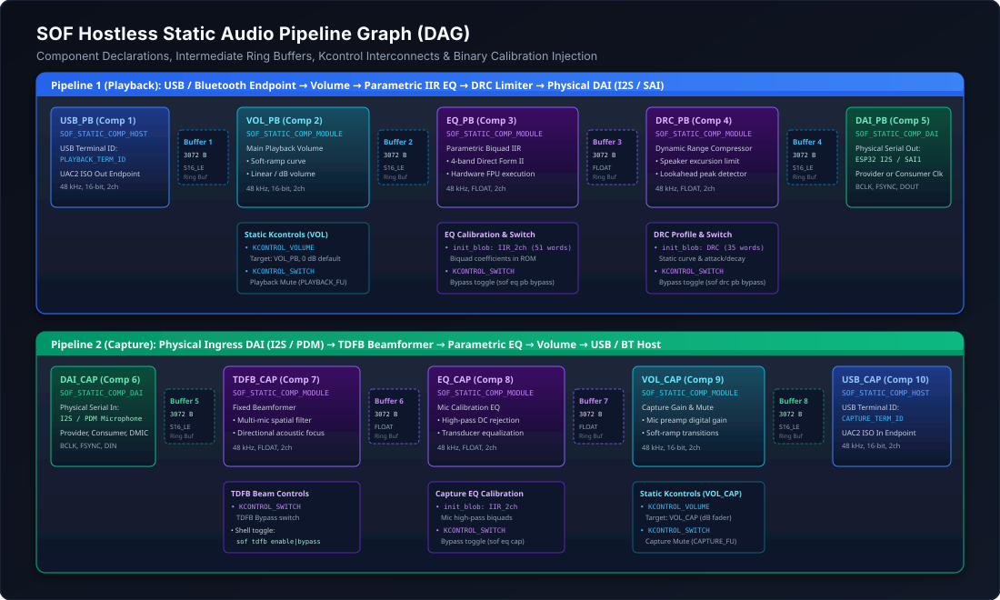
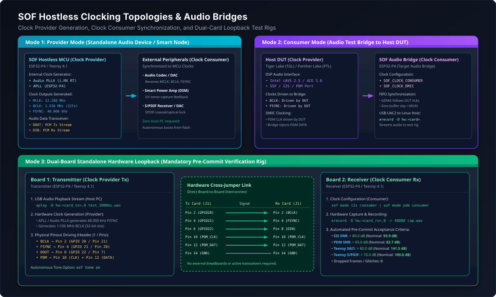

.. _sof_hostless_firmware:

Hostless Embedded Firmware Architecture
#######################################

While Sound Open Firmware (SOF) is widely deployed as an audio DSP coprocessor driven by an upstream Linux host kernel driver (``snd-sof``), SOF also natively supports **hostless embedded operation**. In hostless mode, the firmware boots autonomously under the **Zephyr RTOS**, establishes audio processing graphs from compiled-in **Static Topologies**, and executes deterministic real-time audio signal processing without requiring an external host operating system or IPC mailbox connection.

This architecture enables SOF deployment across standalone microcontrollers, dedicated USB/Bluetooth audio bridges, smart speakers, hearing augmentation devices, and embedded IoT appliances.

   System-level architecture showing the autonomous Zephyr RTOS foundation, SOF Static Pipeline Loader, in-memory processing engine, endpoint ecosystem, and interactive Zephyr Shell diagnostics.

Architectural Paradigm: Host-Driven vs. Hostless
************************************************

In a standard host-driven architecture, the DSP firmware operates as a subordinate subsystem: an external host operating system (Linux, ChromeOS, Android, Windows) powers on the DSP, downloads signed firmware and topology binaries over DMA, dynamically instantiates pipelines via IPC messages (IPC3 or IPC4), and continuously configures mixer gains and algorithm controls via ALSA user-space daemons.

In contrast, **Hostless Embedded Operation** shifts full system autonomy to the DSP microcontroller:

.. list-table:: Architectural Comparison: Host-Driven vs. Hostless Embedded SOF
   :widths: 22 39 39
   :header-rows: 1

   * - Architectural Dimension
     - Host-Driven Mode (Coprocessor)
     - Hostless Embedded Mode (Autonomous)
   * - **System Executive**
     - External Host OS (Linux ``snd-sof``) via PCIe/HDA/I2S
     - Native **Zephyr RTOS** running directly on DSP / MCU
   * - **Topology Source**
     - Dynamic binary blobs (``.tplg``) streamed over IPC
     - Compiled-in static C graph structures in flash memory
   * - **Buffer Allocation**
     - Dynamic heap allocation triggered by host IPC stream open
     - Pre-allocated static ring buffers in SRAM / PSRAM
   * - **Control & Calibration**
     - ALSA mixer kcontrols, UCM profiles, and topology blobs
     - Static default structs, flash calibration, or Zephyr Shell
   * - **Boot Latency**
     - Hundreds of milliseconds (PCIe link up, DMA handshake)
     - Sub-10 millisecond autonomous cold-boot from flash
   * - **Hardware Endpoints**
     - Host DMA buffers, SoundWire, Intel SSP, HDA links
     - USB Audio Class 2.0 (UAC2), Bluetooth LE Audio, I2S/SAI, PDM, S/PDIF
   * - **Target Platforms**
     - Intel cAVS/ACE, AMD ACP, NXP i.MX8 DSP cores
     - PJRC Teensy 4.1 (i.MX RT1062), Espressif ESP32-P4 / ESP32-C6

Static Pipeline Architecture
****************************

Hostless platforms define their audio topology graph directly in compiled C source structures rather than parsing serialized ALSA topology binaries at runtime. The SOF Static Pipeline subsystem (``src/audio/pipeline/static_pipeline_loader.c``) interprets these structures at boot time and configures the audio processing pipeline graph.

   Directed Acyclic Graph (DAG) of the hostless playback and capture pipelines showing component bindings, intermediate ring buffers, static kcontrols, and binary calibration injection points.

Static Topology Data Structures
===============================

The static pipeline API (``include/sof/audio/pipeline/static_pipeline.h``) defines a declarative schema for audio components, buffers, routes, and controls:

.. code-block:: c

   #include <sof/audio/pipeline/static_pipeline.h>
   #include <sof/audio/component_ext.h>

   /* 1. Component Declaration */
   struct sof_static_comp {
       uint32_t id;                     /* Unique component ID */
       uint32_t pipeline_id;            /* Owning pipeline ID */
       const char *name;                /* Human-readable component name */
       enum sof_static_comp_type type;  /* Host/USB Terminal, Module, or DAI */
       const struct sof_uuid *uuid;     /* Component RFC 4122 UUID */
       uint32_t direction;              /* SOF_IPC_STREAM_PLAYBACK or CAPTURE */
       struct sof_static_caps caps;     /* Formats, rates, channel masks */

       /* Hardware endpoint configuration */
       enum sof_static_ep_type ep_type;
       union {
           struct { uint32_t terminal_id; } usb;
           struct { uint32_t dai_type; uint32_t dai_index; uint32_t format; } dai;
       } ep;

       /* Static configuration blob (ABI header + coefficients) */
       const void *init_blob;
       size_t init_blob_size;
   };

   /* 2. Intermediate Buffer Declaration */
   struct sof_static_buffer {
       uint32_t id;                     /* Unique buffer identifier */
       size_t size;                     /* Buffer capacity in bytes */
       enum sof_ipc_frame fmt;          /* Frame format (S16_LE, FLOAT, S32_LE) */
       uint32_t flags;                  /* SOF_MEM_FLAG_DMA | SOF_MEM_FLAG_USER */
   };

   /* 3. Pipeline Interconnect Route */
   struct sof_static_route {
       uint32_t src_comp_id;            /* Upstream producer component */
       uint32_t buffer_id;              /* Shared circular ring buffer */
       uint32_t sink_comp_id;           /* Downstream consumer component */
   };

   /* 4. Static Kcontrol Definition */
   struct sof_static_kcontrol {
       uint32_t id;                     /* Control identifier */
       const char *name;                /* Display name (e.g. "Main Playback Volume") */
       enum sof_static_ctrl_type type;  /* Volume, Switch, Enum, Binary */
       uint32_t target_comp_id;         /* Attached processing component */
       int32_t min;                     /* Minimum control value */
       int32_t max;                     /* Maximum control value */
       int32_t def;                     /* Default initial value */
       uint8_t uac2_entity_id;          /* Bound USB Audio Feature Unit ID */
   };

   /* 5. Root Topology Container */
   struct sof_static_topology {
       const char *name;
       size_t num_pipelines;
       const struct sof_static_pipeline_desc *pipelines;
       size_t num_comps;
       const struct sof_static_comp *comps;
       size_t num_buffers;
       const struct sof_static_buffer *buffers;
       size_t num_routes;
       const struct sof_static_route *routes;
       size_t num_controls;
       const struct sof_static_kcontrol *controls;
   };

Static Pipeline Loader Initialization Flow
==========================================

When the firmware boots, ``sof_static_pipelines_init()`` invokes ``sof_static_topology_init()`` to instantiate the pipeline graph:

1. **Pipeline Creation**: For each ``sof_static_pipeline_desc``, a kernel pipeline scheduling object is created via ``pipeline_new()``, specifying priority, execution period (typically 1000 µs), and core affinity.
2. **Component Instantiation**: The loader iterates through ``comps[]``, resolving each component's driver via its UUID (``comp_driver_find()``), allocating the ``struct comp_dev`` instance, and applying any embedded ``init_blob`` coefficients (e.g., initial IIR filter taps or DRC speaker limit profiles).
3. **Circular Buffer Allocation**: Audio ring buffers declared in ``buffers[]`` are allocated in DMA-accessible memory using ``buffer_alloc()``, enforcing cache-line alignment and page constraints.
4. **Graph Routing Connection**: Each entry in ``routes[]`` binds the source component's output sink to the designated buffer and connects that buffer to the downstream sink component via ``pipeline_connect()``.
5. **Kcontrol Binding**: Default gain faders, mute switches, and bypass controls are attached to target components and mapped to external entities (such as USB Audio Class 2.0 Feature Units).
6. **Trigger Pipeline**: Pipelines configured with ``auto_start = true`` or triggered via the shell transition through ``COMP_TRIGGER_PREPARE`` and ``COMP_TRIGGER_START``, arming the Zephyr Low-Latency timer scheduler.

Supported Hostless Hardware Platforms
*************************************

SOF hostless firmware is ported and validated across multiple 32-bit and 64-bit embedded microcontroller architectures:

.. list-table:: Supported Hostless Embedded Platforms Matrix
   :widths: 20 22 18 20 20
   :header-rows: 1

   * - Hardware Platform
     - Core Architecture
     - Clock Speed
     - Digital Audio Interfaces
     - Endpoint Connectivity
   * - **PJRC Teensy 4.1**
     - NXP i.MX RT1062 (ARM Cortex-M7)
     - 600 MHz
     - SAI1 (I2S / TDM), S/PDIF TX/RX
     - USB High-Speed UAC2, eDMA
   * - **Espressif ESP32-P4**
     - Dual-Core RISC-V (HP Core) + FPU/SIMD
     - 400 MHz
     - I2S0, I2S1, PDM RX / TX
     - USB 2.0 OTG (UAC2), GDMA
   * - **Espressif ESP32-C6**
     - Single-Core 32-bit RISC-V
     - 160 MHz
     - I2S, PDM
     - Wi-Fi 6, Bluetooth 5.4 LE Audio

PJRC Teensy 4.1 (NXP i.MX RT1062)
=================================

The **Teensy 4.1** platform delivers high-performance audio processing on an ARM Cortex-M7 microcontroller:

* **Audio PLL4 Clock Architecture**: Generates fractional audio root clocks (MCLK, e.g. 12.288 MHz or 24.576 MHz) with low phase noise and jitter, providing exact sample rates for 44.1 kHz and 48 kHz families.
* **Synchronous Audio Interface (SAI)**: Hardware SAI1 supports multi-channel I2S and TDM streaming up to 32-bit depth.
* **Hardware S/PDIF**: Dedicated S/PDIF transmitter and receiver peripheral with biphase mark encoding, verified in automated loopback testing with SNR exceeding 100 dB.
* **Dual-Board Loopback Test Rig**: Board A (Clock Provider / Tx) and Board B (Clock Consumer / Rx) are cross-connected to provide automated pre-commit hardware qualification.

Espressif ESP32-P4
==================

The **ESP32-P4** features dual RISC-V cores with dedicated vector DSP extensions and hardware floating-point units:

* **Dual-Core Processing Engine**: Core 0 executes real-time pipeline scheduling and DAI transfers, while Core 1 can execute computationally demanding floating-point signal processing (such as Time-Domain Fixed Beamforming or Mel-Frequency Cepstral Coefficient extraction).
* **High-Speed USB 2.0 PHY**: Integrated 480 Mbps USB High-Speed transceiver running USB Audio Class 2.0, streaming up to 192 kHz multi-channel audio with microframe asynchronous rate feedback.
* **Dual Audio Interfaces**: Two independent I2S controllers and dedicated PDM hardware decimation filters for microphone arrays.

Espressif ESP32-C6
==================

The **ESP32-C6** operates as an ultra-compact, low-power wireless audio coprocessor or standalone audio beacon:

* **Wireless Standards**: Integrated 2.4 GHz Wi-Fi 6 (802.11ax), Bluetooth 5.4 LE Audio, and IEEE 802.15.4 (Zigbee / Thread).
* **Coprocessor Link**: Connects to the primary ESP32-P4 host controller over a high-speed UART / HCI bridge and shared I2S audio bus, offloading Bluetooth Low Energy Audio broadcast processing.

Endpoint Ecosystem: USB Audio Class 2.0 & Bluetooth
***************************************************

Hostless firmware seamlessly bridges external digital transports directly into the SOF audio pipeline.

USB Audio Class 2.0 (UAC2) Bridge
=================================

SOF integrates with Zephyr's modular USB device stack (``zephyr/usb/class/usbd_uac2.h``) via ``src/audio/usb_audio.c``:

.. code-block:: text

   Host PC (ALSA / WASAPI / CoreAudio)
                 |
                 |  High-Speed USB 2.0 (480 Mbps ISO Endpoints)
                 v
   +-------------------------------------------------------------+
   |             Zephyr USB Device Stack (USBD UAC2)             |
   |   - Input Terminal (USB Streaming Out -> Playback Pipeline) |
   |   - Output Terminal (Capture Pipeline -> USB Streaming In) |
   |   - Feature Units (Volume & Mute Entity Descriptors)        |
   +-------------------------------------------------------------+
                 |
                 v  (Asynchronous Rate Feedback & PCM FIFO)
   +-------------------------------------------------------------+
   |                SOF Host Component (USB_PB / USB_CAP)        |
   |              SOF_STATIC_COMP_HOST (.ep.usb.terminal_id)     |
   +-------------------------------------------------------------+

* **Asynchronous Rate Feedback**: The firmware computes fractional sample rate deviations between the local audio hardware clock and USB bus SOF (Start-of-Frame) microframe tokens, transmitting rate feedback packets to the USB host to prevent buffer overrun or underrun.
* **Entity Mapping**: Hardware volume and mute changes from the host OS are routed directly to static kcontrols bound to ``PLAYBACK_FU_ID`` and ``CAPTURE_FU_ID``.

Bluetooth LE Audio & Wireless Streaming
=======================================

On platforms equipped with wireless transceivers (ESP32-P4 paired with ESP32-C6), SOF incorporates a dedicated Bluetooth Audio service (``src/audio/bt_service.c`` and ``bt_audio.c``):

* **LE Audio & Auracast**: Broadcasts and receives Low Complexity Communication Codec (LC3) compressed streams over Bluetooth Low Energy isochronous channels.
* **Classic A2DP & HFP**: Standard Advanced Audio Distribution Profile (SBC/AAC) and Hands-Free Profile with mSBC wideband speech encoding.
* **Dynamic Audio Routing**: The firmware routes audio seamlessly between USB, physical DAIs, and Bluetooth using the shell command ``sof route <usb_dai|bt_dai|usb_bt>``.

Clocking Topologies & Audio Test Bridges
****************************************

Clock synchronization is critical in hostless operation, where the firmware may run as an autonomous clock provider or synchronize its converters as a clock consumer to an external device under test (DUT).

   Clock distribution and synchronization modes: Mode 1 (Clock Provider), Mode 2 (Clock Consumer bridge to DUT), and Mode 3 (Dual-card standalone pre-commit loopback test rig).

Clock Synchronization Modes
===========================

The clocking mode of physical interfaces (I2S and PDM) is governed by ``sof_static_pipeline_set_clock_mode()``:

1. **Clock Provider Mode**:
   The microcontroller's internal PLL generates Bit Clock (BCLK), Frame Sync (FSYNC / LRCK), and audio root clock (MCLK). BCLK frequency satisfies:

   .. math::

      f_{\text{BCLK}} = 2 \times f_s \times \text{slot\_width}

   For a standard 48.0 kHz 2-channel 32-bit slot configuration:

   .. math::

      f_{\text{BCLK}} = 2 \times 48000 \times 32 = 3.072\text{ MHz}

   The internal audio PLL drives external DACs, smart amplifiers, and codecs.

2. **Clock Consumer Mode**:
   The microcontroller disables its internal bit-clock dividers and synchronizes its DMA receiver/transmitter to external BCLK and FSYNC lines driven by a host DUT (such as Intel Tiger Lake CAVS or Panther Lake ACE). The microcontroller FIFO tracks external word clocks with zero phase slip.

3. **DMIC Injector Mode**:
   Specialized clocking configuration where the host DUT drives the PDM clock line, and the hostless bridge generates a phase-aligned PDM microphone bitstream on the data pin, simulating hardware digital microphones for driver automated testing.

Dual-Card Pre-Commit Loopback Rig
=================================

To prevent regressions in driver registers, DMA controllers, and processing components, hostless boards are deployed in paired cross-over test configurations:

.. list-table:: Header J1 Hardware Cross-Jumper Interconnect (Pallas Tx to Ceres Rx)
   :widths: 25 25 50
   :header-rows: 1

   * - Pallas Pin (Provider Tx)
     - Ceres Pin (Consumer Rx)
     - Signal Description & Hardware Verification
   * - **Pin 2 (GPIO 20)**
     - **Pin 2 (GPIO 20)**
     - I2S Bit Clock (BCLK, 1.536 MHz or 3.072 MHz)
   * - **Pin 4 (GPIO 21)**
     - **Pin 4 (GPIO 21)**
     - I2S Frame Sync (FSYNC / Word Select, 48.000 kHz)
   * - **Pin 6 (GPIO 22)**
     - **Pin 8 (GPIO 23)**
     - I2S Audio Data Out (Pallas DOUT) to Data In (Ceres DIN)
   * - **Pin 10 (GPIO 24)**
     - **Pin 10 (GPIO 24)**
     - PDM Microphone Clock (PDM_CLK, 3.072 MHz)
   * - **Pin 12 (GPIO 25)**
     - **Pin 12 (GPIO 25)**
     - PDM Microphone Bitstream (PDM_DAT)
   * - **Pin 14 (GND)**
     - **Pin 14 (GND)**
     - Common digital signal ground reference

Interactive Zephyr Shell Diagnostics
************************************

Hostless firmware embeds an interactive command-line diagnostic shell (``src/debug/shell/esp32_shell.c``) accessible via UART or USB CDC ACM virtual serial ports.

Diagnostic Command Reference
============================

.. list-table:: SOF Zephyr Shell Diagnostic Commands
   :widths: 30 70
   :header-rows: 1

   * - Command Syntax
     - Description & Operational Behavior
   * - ``sof status``
     - Dumps complete firmware telemetry: active pipelines, sample rate, MAC address, clock mode, route, volume, mute, and algorithm bypass states.
   * - ``sof mode <i2s|pdm> <master|slave|dmic>``
     - Dynamically switches clocking roles without rebooting the microcontroller.
   * - ``sof vol <pb|cap> <dB>``
     - Adjusts playback or capture volume in decibels (e.g. ``sof vol pb -6``).
   * - ``sof mute <pb|cap> <on|off>``
     - Mutes or unmutes stream with soft ramping to prevent acoustic pops.
   * - ``sof play <start|stop>``
     - Starts or stops the playback pipeline scheduler.
   * - ``sof cap <start|stop|stats|dump>``
     - Controls capture pipeline; ``dump`` prints raw PCM sample buffers to console.
   * - ``sof tone <on|off> [freq]``
     - Generates an onboard sine wave (default 1000 Hz) for audio path verification.
   * - ``sof eq <pb|cap> <enable|bypass>``
     - Toggles parametric IIR equalizer processing on playback or capture paths.
   * - ``sof drc <enable|bypass>``
     - Toggles dynamic range compressor / speaker excursion limiter.
   * - ``sof tdfb <enable|bypass>``
     - Toggles Time-Domain Fixed Beamformer microphone array filter.
   * - ``sof route <usb_dai|bt_dai|usb_bt>``
     - Selects audio routing matrix between USB, serial DAI, and Bluetooth transceivers.
   * - ``sof bt <status|format|broadcast|scan>``
     - Manages Bluetooth LE Audio streaming, format presets, and Auracast broadcasts.
   * - ``sof regs``
     - Dumps low-level peripheral hardware registers (I2S/PDM FIFOs, DMA descriptors, clock dividers).

Example Interactive Shell Session
=================================

.. code-block:: text

   uart:~$ sof status
   === Sound Open Firmware (SOF) Status ===
     MAC Address:       dc:54:75:e8:87:c0
     Playback Pipeline: RUNNING
     Capture Pipeline:  RUNNING
     Active Interface:  I2S0
     Clock Mode:        SLAVE (Default)
     Audio Route:       USB <-> DAI (Default)
     BT Audio Stream:   DISABLED
     Sample Rate:       48000 Hz
     Playback Volume:   0 dB (Mute: NO)
     Capture Volume:    0 dB (Mute: NO)
     Playback EQ:       ENABLED
     Playback DRC:      ENABLED
     Capture TDFB:      BYPASS
     Capture EQ:        ENABLED
   ========================================

   uart:~$ sof mode i2s master
   Configured I2S0 clock mode to MASTER (BCLK: 1536 kHz, FSYNC: 48 kHz).

   uart:~$ sof tone on 1000
   Generating 1000 Hz sine wave on Playback Pipeline...

   uart:~$ sof cap dump --samples 8
   [00] 0x0000 0x0124 0x02a8 0x03fe 0x04f1 0x05a0 0x0602 0x05f8

Developer Tutorial: Authoring a Custom Hostless Pipeline
********************************************************

Follow this step-by-step workflow to implement a custom static audio processing topology on an embedded platform.

Step 1: Define Static Topology in C
===================================

Create a new pipeline definition file (e.g. ``src/platform/my_mcu/my_pipeline_def.c``):

.. code-block:: c

   #include <sof/audio/pipeline/static_pipeline.h>
   #include <sof/audio/component_ext.h>

   /* Extern module UUIDs */
   extern const struct sof_uuid usb_audio_uuid;
   extern const struct sof_uuid volume_uuid;
   extern const struct sof_uuid eq_iir_uuid;
   extern const struct sof_uuid dai_uuid;

   /* 1. Component instances */
   static const struct sof_static_comp my_comps[] = {
       SOF_STATIC_COMP_HOST(
           .id = 1, .pipeline_id = 1, .name = "USB_IN",
           .uuid = &usb_audio_uuid, .direction = SOF_IPC_STREAM_PLAYBACK,
           .caps = SOF_STATIC_CAPS(SOF_IPC_FRAME_S16_LE, 48000, 2),
           .ep.usb.terminal_id = 1
       ),
       SOF_STATIC_COMP_MODULE(
           .id = 2, .pipeline_id = 1, .name = "VOL_MAIN",
           .uuid = &volume_uuid, .direction = SOF_IPC_STREAM_PLAYBACK,
           .caps = SOF_STATIC_CAPS(SOF_IPC_FRAME_S16_LE, 48000, 2)
       ),
       SOF_STATIC_COMP_DAI(
           .id = 3, .pipeline_id = 1, .name = "DAI_OUT",
           .uuid = &dai_uuid, .direction = SOF_IPC_STREAM_PLAYBACK,
           .caps = SOF_STATIC_CAPS(SOF_IPC_FRAME_S16_LE, 48000, 2),
           .ep.dai.dai_type = SOF_DAI_ESP32_I2S,
           .ep.dai.dai_index = 0,
           .ep.dai.format = SOF_DAI_FMT_I2S
       ),
   };

   /* 2. Circular ring buffers */
   static const struct sof_static_buffer my_buffers[] = {
       SOF_STATIC_BUFFER(.id = 1, .size = 3072, .fmt = SOF_IPC_FRAME_S16_LE),
       SOF_STATIC_BUFFER(.id = 2, .size = 3072, .fmt = SOF_IPC_FRAME_S16_LE),
   };

   /* 3. Audio routes connecting components */
   static const struct sof_static_route my_routes[] = {
       SOF_STATIC_ROUTE(.src_comp_id = 1, .buffer_id = 1, .sink_comp_id = 2),
       SOF_STATIC_ROUTE(.src_comp_id = 2, .buffer_id = 2, .sink_comp_id = 3),
   };

   /* 4. Playback pipeline descriptor */
   static const struct sof_static_pipeline_desc my_pipelines[] = {
       {
           .pipeline_id = 1,
           .name = "Playback Pipeline",
           .direction = SOF_IPC_STREAM_PLAYBACK,
           .priority = 0,
           .core = 0,
           .period = 1000,
           .frames_per_sched = 48,
           .time_domain = SOF_TIME_DOMAIN_TIMER,
           .sched_comp_id = 1,
           .source_comp_id = 1,
           .sink_comp_id = 3,
       }
   };

   /* 5. Root topology structure */
   const struct sof_static_topology g_my_static_topology = {
       .name = "My Custom Audio Topology",
       .num_pipelines = ARRAY_SIZE(my_pipelines),
       .pipelines = my_pipelines,
       .num_comps = ARRAY_SIZE(my_comps),
       .comps = my_comps,
       .num_buffers = ARRAY_SIZE(my_buffers),
       .buffers = my_buffers,
       .num_routes = ARRAY_SIZE(my_routes),
       .routes = my_routes,
   };

Step 2: Enable Static Pipeline in Kconfig
=========================================

Enable the static pipeline loader and selected processing modules in ``prj.conf``:

.. code-block:: kconfig

   CONFIG_SOF_STATIC_PIPELINE=y
   CONFIG_COMP_VOLUME=y
   CONFIG_COMP_EQ_IIR=y
   CONFIG_COMP_TONE=y
   CONFIG_USB_DEVICE_STACK_NEXT=y
   CONFIG_USBD_AUDIO_CLASS_2=y
   CONFIG_SHELL=y
   CONFIG_SOF_DEBUG_SHELL=y

Step 3: Build, Flash & Verify
=============================

Build the firmware using Zephyr's ``west`` tool:

.. code-block:: bash

   # Build for ESP32-P4
   west build -b esp32p4_function_ev_board app -- -DEXTRA_CONF_FILE="prj_hostless.conf"

   # Flash board over USB serial
   west flash

   # Verify audio loopback playback and capture
   python3 scripts/test_p4_loopback.py --mode i2s

Troubleshooting & Diagnostic Matrix
***********************************

.. list-table:: Common Hostless Firmware Issues & Diagnostic Recipes
   :widths: 25 35 40
   :header-rows: 1

   * - Error Symptom
     - Root Cause
     - Diagnostic & Resolution Procedure
   * - **Audio Glitches / Periodic Clicks**
     - Clock drift between USB SOF tokens and physical I2S word clock.
     - Verify asynchronous rate feedback endpoint in ``usb_audio.c``; ensure feedback interval is 1 ms and DMA period matches ``frames_per_sched`` (48 frames at 48 kHz).
   * - **Buffer Starvation (XRUN)**
     - Microcontroller configured as Clock Provider while connected to an active Clock Provider DUT.
     - Switch clocking role: execute ``sof mode i2s slave`` via the shell so microcontroller FIFOs synchronize to incoming external BCLK/FSYNC.
   * - **Static Noise on Floating-Point Processing**
     - Bit-depth quantization mismatch between S16_LE buffers and FLOAT processing modules.
     - Check ``struct sof_static_buffer`` declarations; ensure PCM converters or format flags match module capability masks (e.g. S16_LE for Volume, FLOAT for EQ/DRC).
   * - **DMIC Capture Silence**
     - Missing PDM clock or incorrect GPIO multiplexing.
     - Inspect peripheral registers with ``sof regs``; verify PDM clock divider generates nominal 3.072 MHz and pinmux connects PDM_CLK and PDM_DAT.
   * - **Teensy S/PDIF Unlock**
     - Fractional divider on Audio PLL4 uncalibrated.
     - Check PLL4 numerator/denominator registers in ``imx_rt_clk.c``; ensure PLL4 locks to exactly 48.000 kHz phase lock.

Terminal Diagnostic Recipes
===========================

* **Test Waveform Playback from Host PC**:

  .. code-block:: bash

     # Stream 1000 Hz test sine wave into hostless USB audio bridge
     aplay -D hw:CARD=P4,DEV=0 -r 48000 -f S16_LE -c 2 test_1000hz.wav

* **Inspect USB Audio Class 2.0 Descriptors**:

  .. code-block:: bash

     # Query terminal descriptors and feature units
     lsusb -d 303a: -v | grep -A 10 "AudioControl"

* **Capture Recorded Audio from Digital Bridge**:

  .. code-block:: bash

     # Record captured audio stream for FFT and SNR calculation
     arecord -D hw:CARD=P4,DEV=0 -r 48000 -f S16_LE -c 2 -d 4 capture.wav
