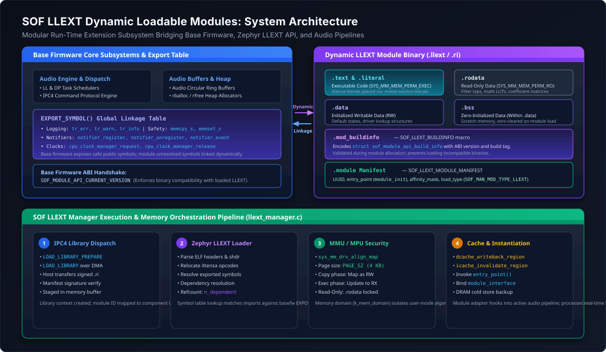
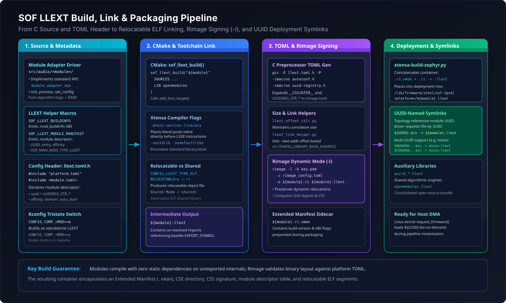
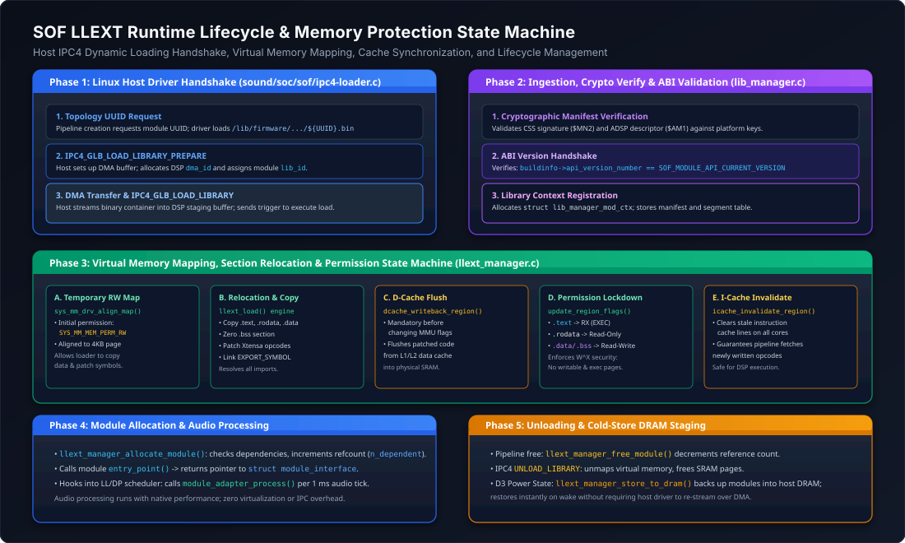

.. _llext_modules:

LLEXT Dynamic Loadable Modules Architecture
###########################################

Sound Open Firmware (SOF) incorporates dynamic runtime loading of audio processing components using the **Zephyr Linkable Loadable Extensions (LLEXT)** subsystem. Rather than compiling every audio filter, codec, algorithm, and vendor processing library into a single monolithic firmware executable, LLEXT enables components to be built as standalone, relocatable Executable and Linkable Format (ELF) objects (``.llext`` files).

These modular objects are signed using **Rimage** in dynamic library mode (``rimage -l``), staged on the host filesystem under ``/lib/firmware/intel/sof-ipc4/``, and loaded dynamically into audio DSP memory on demand by the Linux kernel driver (``snd-sof``) via the Intel IPC4 protocol when audio pipelines are created.

   System-level architecture showing relationships between Base Firmware, Zephyr LLEXT API, SOF LLEXT Manager, relocatable modules, and memory protection boundaries.

Architectural Motivation & Design Goals
***************************************

The transition from monolithic firmware builds to dynamically loadable LLEXT modules addresses several critical architectural challenges in modern audio DSP platforms:

1. **SRAM Footprint Optimization**:
   Embedded DSP High-Performance SRAM (HP-SRAM) is constrained (often 2 MB to 4 MB). A monolithic image containing dozens of audio processing algorithms (reverberation, beamforming, active noise reduction, multi-band dynamic range compression, keyword spotting, neural network models) quickly exhausts available SRAM. LLEXT allows the DSP to keep only the base operating system and currently active stream modules in memory, freeing SRAM when pipelines are stopped.
2. **Post-Silicon Extensibility & Rapid Delivery**:
   New audio processing algorithms or bug fixes can be packaged, cryptographically signed, and distributed to end-user systems as standalone module files without updating or rebooting the base firmware.
3. **Vendor IP & Proprietary Algorithm Isolation**:
   Third-party acoustic processing algorithms (e.g., proprietary speaker protection, spatial audio synthesizers, licensed decoders) can be compiled against the SOF Module Adapter API and distributed as pre-compiled, relocatable binaries without exposing vendor source code or linking against the full GPL/BSD base firmware source tree.
4. **Fine-Grained Memory Protection**:
   Dynamic modules run within dedicated Zephyr memory domains (``struct k_mem_domain``) with hardware MPU/MMU enforcement (:math:`W \oplus X` security policy), isolating algorithmic processing from critical RTOS data structures and interrupt handlers.

Module Binary Anatomy & Section Descriptors
*******************************************

An LLEXT module is an ELF32 relocatable object file (or shared library) containing standard code/data sections along with specialized SOF metadata sections required for runtime ABI validation and manifest registration.

.. list-table:: LLEXT Module ELF Section Hierarchy
   :widths: 18 20 22 40
   :header-rows: 1

   * - Section Name
     - Section Type
     - Memory Permissions
     - Description & Contents
   * - ``.text``
     - ``SHT_PROGBITS``
     - ``SYS_MM_MEM_PERM_EXEC`` (RX)
     - Executable machine instructions. On Xtensa, literal pools are colocated via ``-mtext-section-literals``.
   * - ``.rodata``
     - ``SHT_PROGBITS``
     - Read-Only (RO)
     - Constant data, coefficient tables, filter tap matrices, and math lookup tables.
   * - ``.data``
     - ``SHT_PROGBITS``
     - Read-Write (RW)
     - Initialized global and static variables.
   * - ``.bss``
     - ``SHT_NOBITS``
     - Read-Write (RW)
     - Zero-initialized variables. Enforced to reside contiguously within or adjacent to ``.data`` memory boundaries.
   * - ``.mod_buildinfo``
     - ``SHT_PROGBITS``
     - Read-Only (RO)
     - Contains ``struct sof_module_api_build_info``. Defines the module API version, format tag, and build hash.
   * - ``.module``
     - ``SHT_PROGBITS``
     - Read-Only (RO)
     - Contains ``struct sof_man_module_manifest``. Specifies module UUID, entry point, affinity mask, and load type.

LLEXT Integration Macros
========================

SOF provides standardized macros in ``include/module/module/llext.h`` to simplify module authoring:

ABI Compatibility Check (``SOF_LLEXT_BUILDINFO``)
-------------------------------------------------

.. code-block:: c

   #define SOF_LLEXT_BUILDINFO \
   static const struct sof_module_api_build_info buildinfo \
       __section(".mod_buildinfo") __used = { \
       .format = SOF_MODULE_API_BUILD_INFO_FORMAT, \
       .api_version_number.full = SOF_MODULE_API_CURRENT_VERSION, \
   }

When the module is loaded, ``llext_manager_allocate_module()`` inspects the ``.mod_buildinfo`` section. If ``buildinfo->api_version_number.full`` does not match ``SOF_MODULE_API_CURRENT_VERSION`` in the running base firmware, the load request is rejected with ``-EINVAL``, preventing runtime panics caused by ABI drift.

Module Manifest Registration (``SOF_LLEXT_MODULE_MANIFEST``)
------------------------------------------------------------

.. code-block:: c

   #define SOF_LLEXT_MODULE_MANIFEST(manifest_name, entry, affinity, mod_uuid, instances, ...) \
   { \
       .module = { \
           .name = manifest_name, \
           .uuid = mod_uuid, \
           .entry_point = (uint32_t)(entry), \
           .instance_max_count = instances, \
           .type = { \
               .load_type = SOF_MAN_MOD_TYPE_LLEXT, \
               .domain_ll = 1, \
           }, \
           .affinity_mask = (affinity), \
       } \
   }

This macro registers:

* **UUID**: The 128-bit RFC 4122 component identifier matched against ALSA Topology widget UUIDs.
* **Entry Point**: Function pointer (e.g. ``module_init``) called upon instantiation, returning the driver's ``struct module_interface *``.
* **Affinity Mask**: Bitmask of DSP cores permitted to run the module (e.g. ``0x1`` for Core 0, ``0x3`` for Cores 0 and 1).
* **Load Type**: Set to ``SOF_MAN_MOD_TYPE_LLEXT`` (``2``) for standard processing modules, or ``SOF_MAN_MOD_TYPE_LLEXT_AUX`` (``3``) for auxiliary helper libraries.

Symbol Export Linkage (``EXPORT_SYMBOL``)
=========================================

LLEXT modules do not link against a copy of the RTOS or C library. Instead, unresolved external symbols are resolved at load time against symbols explicitly exported by the base firmware using the ``EXPORT_SYMBOL()`` macro in ``zephyr/include/zephyr/llext/symbol.h``:

.. code-block:: c

   /* Example base firmware symbol exports in SOF core */
   EXPORT_SYMBOL(tr_err);
   EXPORT_SYMBOL(tr_warn);
   EXPORT_SYMBOL(tr_info);
   EXPORT_SYMBOL(memcpy_s);
   EXPORT_SYMBOL(memset_s);
   EXPORT_SYMBOL(rballoc);
   EXPORT_SYMBOL(rfree);
   EXPORT_SYMBOL(notifier_register);
   EXPORT_SYMBOL(notifier_unregister);
   EXPORT_SYMBOL(notifier_event);
   EXPORT_SYMBOL(cpu_clock_manager_request);
   EXPORT_SYMBOL(cpu_clock_manager_release);

Any attempt by an LLEXT module to call a function not marked with ``EXPORT_SYMBOL()`` in the base firmware will fail during runtime relocation linking, preventing unauthorized access to private kernel internals.

Multi-Module Packaging (Shared Codebases)
*****************************************

In many audio processing pipelines, multiple distinct component drivers share a single common codebase. A primary example is ``src/audio/mixin_mixout/``, where both the **MIXIN** (audio stream multiplexer) and **MIXOUT** (audio stream fanout) component drivers reside in the same source files.

LLEXT natively supports packaging multiple component drivers into a single ``.llext`` binary container:

1. **Manifest Array**: The source file declares an array of ``struct sof_man_module_manifest`` structures, with each entry binding a distinct UUID, entry point, and component name:

   .. code-block:: c

      /* In mixin_mixout.c */
      static const struct sof_man_module_manifest mixin_mixout_manifest[] __section(".module") = {
          SOF_LLEXT_MODULE_MANIFEST("MIXIN", mixin_init, 0x3, UUIDREG_STR_MIXIN, 8),
          SOF_LLEXT_MODULE_MANIFEST("MIXOUT", mixout_init, 0x3, UUIDREG_STR_MIXOUT, 8),
      };

2. **TOML Preprocessor Descriptor**: The platform TOML preprocessor template (``llext.toml.h``) declares multiple ``[[module.entry]]`` blocks corresponding to each UUID.
3. **Symlink Generation**: When ``xtensa-build-zephyr.py`` packages the build, it reads all UUIDs associated with the target from ``llext.uuid`` and generates individual deployment symlinks pointing to the single shared container:

   .. code-block:: text

      39656EB2-3B71-4049-8D3F-F92CD5C43C09.bin  -> mixin_mixout.llext  (MIXIN)
      3C56505A-24D7-418F-BDDC-C1F5A3AC2AE0.bin  -> mixin_mixout.llext  (MIXOUT)

Auxiliary Libraries & Shared Engines
====================================

Components that rely on large shared math algorithms (such as FIR filter convolution or IIR biquad matrix engines) can be factored into **Auxiliary Libraries** (``SOF_MAN_MOD_TYPE_LLEXT_AUX``). Auxiliary libraries are loaded once and linked against dependent LLEXT modules using refcounted tracking (``LLEXT_MAX_DEPENDENCIES``).

Build System & Toolchain Pipeline
*********************************

LLEXT modules are built using Zephyr's CMake extensions and signed using Rimage.

   End-to-end LLEXT compilation, relocatable linking, C-preprocessor TOML generation, Rimage dynamic signing, and deployment symlink assembly.

Kconfig Tristate Integration
============================

Audio modules in SOF support tristate Kconfig definitions (``n``, ``m``, ``y``):

.. code-block:: kconfig

   config COMP_VOLUME
       tristate "Volume control component"
       default y
       help
         Select 'y' to link volume statically into base firmware.
         Select 'm' to compile volume as an LLEXT loadable module.
         Select 'n' to disable the component.

When ``CONFIG_LLEXT_FORCE_ALL_MODULAR=y`` is enabled, all processing components configured as tristate are automatically built as modular LLEXT packages, minimizing base firmware size.

The ``sof_llext_build()`` CMake Function
========================================

In each module's ``llext/CMakeLists.txt``, the build is defined using SOF's high-level helper function:

.. code-block:: cmake

   # Example: src/audio/volume/llext/CMakeLists.txt
   sof_llext_build("volume"
       SOURCES
           ../volume_generic.c
           ../volume_hifi3.c
           ../volume_hifi4.c
           ../volume_hifi5.c
           ../volume_generic_with_peakvol.c
           ../volume_hifi3_with_peakvol.c
           ../volume_hifi4_with_peakvol.c
           ../volume_hifi5_with_peakvol.c
           ../volume.c
           ../volume_ipc4.c
       LIB openmodules
   )

Compiler & Linker Directives
----------------------------

Under the hood, ``sof_llext_build()`` executes the following critical build steps:

1. **Xtensa Literal Placement**:
   Injects ``-mtext-section-literals``. Because LLEXT modules are linked without a full linker script, literal pools must be emitted inline directly preceding the ``L32R`` instructions that reference them, preventing out-of-range PC-relative displacement faults.
2. **Library Stripping**:
   Applies ``-nostdlib -nodefaultlibs`` to eliminate duplicate C runtime dependencies.
3. **Relocatable Linking**:
   When ``CONFIG_LLEXT_TYPE_ELF_RELOCATABLE=y``, the linker produces an incremental relocatable object (``-r``), preserving symbol relocation tables for the Zephyr runtime loader.
4. **Preprocessed TOML Configuration**:
   Invokes the C preprocessor on ``llext.toml.h`` with autoconf macros to generate ``rimage_config.toml``.
5. **Rimage Dynamic Signing** (``-l``):
   Executes Rimage with the ``-l`` flag:

   .. code-block:: bash

      rimage -l -k keys/otc_private.pem \
             -c rimage_config.toml \
             -o build/volume_llext/volume.ri \
             build/volume_llext/volume.llext

   The ``-l`` flag instructs Rimage that the input ELF is a dynamic module rather than a bootloader executable, calculating module segment digests, appending the module table entry (``$AME``), and generating an Extended Manifest sidecar (``volume.ri.xman``).

Helper Utilities
================

The build pipeline leverages specialized Python utilities in ``scripts/``:

* ``llext_link_helper.py``: Calculates section VMA placements according to ``CONFIG_LIBRARY_BASE_ADDRESS``.
* ``llext_offset_calc.py``: Maintains a cumulative persistent module size counter, guaranteeing non-overlapping memory regions.
* ``llext_write_uuids.cmake``: Inspects module headers and writes ``llext.uuid`` containing all component UUIDs for deployment packaging.

Runtime Lifecycle & Memory Management
*************************************

The runtime lifecycle of an LLEXT module is managed jointly by the Linux host driver (``sound/soc/sof/ipc4-loader.c``), the SOF Library Manager (``src/library_manager/lib_manager.c``), and the SOF LLEXT Manager (``src/library_manager/llext_manager.c``).

   Detailed runtime execution flow: Host IPC4 loading handshake, virtual memory allocation, permission transitions, cache maintenance, and teardown.

Phase 1: Host IPC4 Loading Protocol
===================================

When an audio use case is triggered (e.g., playback stream opening), the ALSA topology parser determines which component modules are required by the pipeline. If a module is not currently resident in DSP memory:

1. **Firmware File Resolution**: The host driver requests the firmware binary from the filesystem by UUID: ``/lib/firmware/intel/sof-ipc4/<platform>/<UUID>.bin``.
2. **Library Prepare** (``SOF_IPC4_GLB_LOAD_LIBRARY_PREPARE``):
   The host sends an IPC message allocating a host-to-DSP DMA stream buffer (``dma_id``) and assigning a numeric library identifier (``lib_id``, typically 1 to 15).
3. **DMA Payload Transfer**:
   The host streams the signed LLEXT container (Extended Manifest + CPD + CSS + ELF payload) into the pre-allocated DSP memory window.
4. **Library Trigger** (``SOF_IPC4_GLB_LOAD_LIBRARY``):
   The host signals the DSP to initiate image parsing and dynamic linking.

Phase 2: Authentication & ABI Handshake
=======================================

On the DSP, the IPC4 message is received by ``ipc4_load_library()`` and dispatched to ``lib_manager_load_library()``:

1. **Cryptographic Validation**: The CSS signature (``$MN2``) and ADSP descriptor (``$AM1``) are authenticated against platform verification keys.
2. **ABI Verification**: The LLEXT manager locates the ``.mod_buildinfo`` section and verifies that ``buildinfo->api_version_number.full == SOF_MODULE_API_CURRENT_VERSION``.
3. **Context Allocation**: A ``struct lib_manager_mod_ctx`` is allocated in DSP heap, binding the ``lib_id`` to the module's manifest table.

Phase 3: Virtual Memory Mapping & Permissions State Machine
===========================================================

Memory mapping is performed by ``llext_manager_load_data_from_storage()`` using Zephyr's system memory management driver (``sys_mm_drv``):

.. list-table:: LLEXT Memory Protection State Machine
   :widths: 15 25 30 30
   :header-rows: 1

   * - Step
     - Function Invoked
     - Memory Permission
     - Operational Objective
   * - **1. Staging**
     - ``sys_mm_drv_align_map()``
     - ``SYS_MM_MEM_PERM_RW``
     - Maps virtual SRAM pages aligned to ``PAGE_SZ`` (4 KB) with full Read-Write permissions.
   * - **2. Copy & Link**
     - ``llext_load()`` / ``memcpy_s()``
     - ``SYS_MM_MEM_PERM_RW``
     - Copies ``.text``, ``.rodata``, and ``.data`` into place; clears ``.bss``; resolves external symbols via ``EXPORT_SYMBOL`` table.
   * - **3. Cache Flush**
     - ``dcache_writeback_region()``
     - ``SYS_MM_MEM_PERM_RW``
     - Flushes patched executable instructions and data from L1/L2 data cache lines to physical SRAM.
   * - **4. Lockdown**
     - ``sys_mm_drv_update_region_flags()``
     - ``SYS_MM_MEM_PERM_EXEC`` / Read-Only / Read-Write
     - Enforces :math:`W \oplus X` security: ``.text`` is locked to RX (executable, no write); ``.rodata`` is locked to Read-Only; ``.data``/``.bss`` remains RW.
   * - **5. Invalidate**
     - ``icache_invalidate_region()``
     - ``SYS_MM_MEM_PERM_EXEC``
     - Flushes instruction cache lines across all active DSP cores, ensuring instruction pipelines fetch freshly relocated opcodes.

Phase 4: Component Instantiation & Real-Time Processing
=======================================================

When an audio pipeline creates an instance of the component:

1. ``llext_manager_allocate_module()`` checks all declared dependencies (``LLEXT_MAX_DEPENDENCIES``) and increments their reference counters (``dep->n_dependent++``).
2. The module entry point function (``entry_point()``) is invoked, returning a pointer to the driver's ``struct module_interface``.
3. The component binds to the SOF Module Adapter framework and is registered with the Low-Latency (LL) or Data Processing (DP) task scheduler.
4. During streaming, the scheduler calls ``module_adapter_process()`` periodically (e.g. every 1 ms), processing PCM audio buffers with native DSP performance and zero virtualization overhead.

Phase 5: Teardown & Cold-Store DRAM Staging
===========================================

* **Instance Teardown**: When an audio stream closes, ``llext_manager_free_module()`` releases instance memory and decrements dependency refcounts.
* **Library Unloading**: When the host sends ``SOF_IPC4_GLB_UNLOAD_LIBRARY``, the LLEXT manager unmaps virtual memory regions via ``sys_mm_drv_unmap_region()``, freeing SRAM pages back to the global pool.
* **Low-Power D3 Staging** (``llext_manager_dram.c``):
  When the system transitions into low-power suspend (D3), ``llext_manager_store_to_dram()`` backs up loaded module images into host DRAM carveouts. Upon system wake, ``llext_manager_restore_from_dram()`` rapidly restores the modules without requiring the Linux host driver to re-stream multi-megabyte binaries over DMA, slashing wake latency.

Developer Tutorial: Authoring a New LLEXT Module
************************************************

To create a new loadable audio processing component (e.g., ``my_filter``), follow this step-by-step workflow:

Step 1: Implement the Module Adapter Driver
===========================================

In ``src/audio/my_filter/my_filter.c``, implement standard processing hooks:

.. code-block:: c

   #include <sof/audio/module_adapter/module/generic.h>
   #include <module/module/llext.h>

   /* 1. Declare ABI build info */
   SOF_LLEXT_BUILDINFO;

   static int my_filter_init(struct processing_module *mod)
   {
       /* Initialize component state */
       return 0;
   }

   static int my_filter_process(struct processing_module *mod,
                                struct input_stream_buffer *bsource,
                                struct output_stream_buffer *bsink)
   {
       /* Execute audio processing */
       return 0;
   }

   static struct module_interface my_filter_interface = {
       .init = my_filter_init,
       .process = my_filter_process,
   };

   static struct module_interface *my_filter_entry(void)
   {
       return &my_filter_interface;
   }

   /* 2. Declare hardware manifest */
   static const struct sof_man_module_manifest my_filter_manifest
       __section(".module") = SOF_LLEXT_MODULE_MANIFEST(
           "MY_FILTER",
           my_filter_entry,
           0x1,                             /* Affinity: Core 0 */
           UUIDREG_STR_MY_FILTER,           /* Component UUID */
           4                                /* Max 4 instances */
       );

Step 2: Create the CMake LLEXT Definition
=========================================

Create ``src/audio/my_filter/llext/CMakeLists.txt``:

.. code-block:: cmake

   # Copyright (c) 2026 Sound Open Firmware
   # SPDX-License-Identifier: Apache-2.0

   sof_llext_build("my_filter"
       SOURCES
           ../my_filter.c
       LIB openmodules
   )

Step 3: Create the TOML Header Template
=======================================

Create ``src/audio/my_filter/llext/llext.toml.h``:

.. code-block:: c

   #include "platform.toml"
   #include <audio/my_filter/my_filter.toml>

Step 4: Update Kconfig
======================

In ``src/audio/Kconfig``, add the tristate configuration entry:

.. code-block:: kconfig

   config COMP_MY_FILTER
       tristate "Custom Audio Filter Component"
       default m
       help
         Build my_filter as a dynamically loadable LLEXT module.

Step 5: Build, Package and Verify
=================================

Build the firmware and module using ``west build``:

.. code-block:: bash

   # Build firmware with relocatable modules
   west build -b intel_adsp_ace30_ptl app -- \
       -DEXTRA_CONF_FILE="app/llext_relocatable.conf" \
       -DCONFIG_COMP_MY_FILTER=m

   # Verify generated deployment artifacts
   ls -la build/zephyr/llext/
   # Expected output:
   # my_filter.llext
   # my_filter.ri
   # <UUID>.bin -> my_filter.llext

Troubleshooting & Diagnostic Matrix
***********************************

.. list-table:: Common LLEXT Loading & Runtime Errors
   :widths: 28 32 40
   :header-rows: 1

   * - Error Symptom
     - Root Cause
     - Diagnostic & Resolution Procedure
   * - ``llext_load: unresolved external symbol: <func>``
     - The module calls a base firmware function that was not marked with ``EXPORT_SYMBOL()``.
     - Run ``readelf -s build/my_filter.llext | grep UND``. Locate the missing symbol in base firmware and add ``EXPORT_SYMBOL(<func>)`` in ``src/include/`` or the defining source file.
   * - ``Unsupported module API version``
     - The module was compiled against an outdated ``SOF_MODULE_API_CURRENT_VERSION``.
     - Rebuild the module against the current base firmware source tree. Check ``include/module/module/api_ver.h`` to verify version synchronization.
   * - ``.bss %#x @%p isn't within writable data``
     - The linker placed the ``.bss`` section in a memory region detached or non-contiguous with ``.data``.
     - Verify compiler flags. Ensure ``-mtext-section-literals`` is passed and check the module's section layout with ``readelf -S <module>.llext``.
   * - ``Illegal Instruction / DSP Panic on first module tick``
     - Missing instruction cache invalidation after relocation writeback.
     - Ensure ``icache_invalidate_region()`` is called after updating page permissions to ``SYS_MM_MEM_PERM_EXEC``.
   * - ``IPC4 LOAD_LIBRARY error: invalid manifest or CSS signature``
     - The module was signed with an incorrect key or platform TOML configuration.
     - Inspect Rimage signing log. Verify that the key passed to ``rimage -k`` matches the public key hash configured in the base firmware or platform eFuses.
   * - ``Driver: failed to load library UUID: file not found``
     - The deployment symlink ``${UUID}.bin`` is missing from ``/lib/firmware/intel/sof-ipc4/<platform>/``.
     - Check ``llext.uuid`` in the module build directory. Ensure ``xtensa-build-zephyr.py`` successfully created the symlink in the deployment staging directory.

Inspection Recipes
==================

Inspect Module Symbols & Undefined Imports
------------------------------------------

.. code-block:: bash

   # List all undefined symbols that must be resolved by base firmware:
   xtensa-elf-readelf -s build/volume_llext/volume.llext | grep UND

Inspect ELF Section Headers and Relocations
-------------------------------------------

.. code-block:: bash

   # Verify .mod_buildinfo and .module sections:
   xtensa-elf-readelf -S build/volume_llext/volume.llext

   # Inspect relocations to ensure literal pools are properly referenced:
   xtensa-elf-objdump -r build/volume_llext/volume.llext

Inspect Kernel Module Loading Logs
----------------------------------

.. code-block:: bash

   # Trace IPC4 library loading handshake in host kernel dmesg:
   dmesg | grep -i "sof.*lib\|load_library"
   # Example success output:
   # sof-audio-pci-intel-ptl: IPC4 library 2 loaded successfully, uuid: 4b293c...
