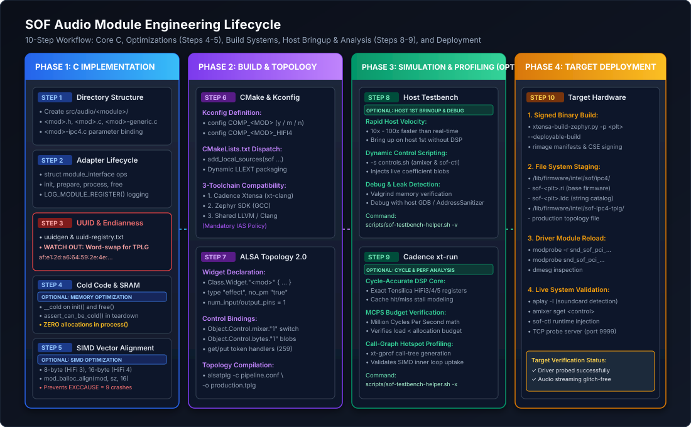
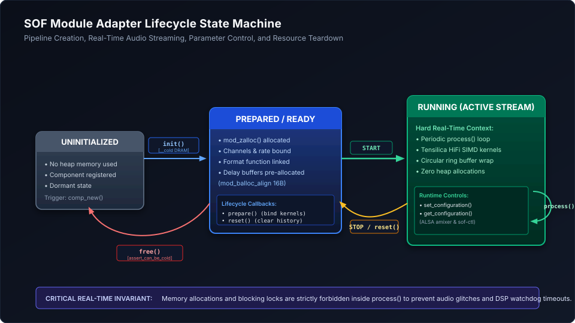

.. _module_creation_integration_guide:

How-To Guide: Creating and Integrating Audio Processing Modules
###############################################################

.. contents::
   :local:
   :depth: 3

Sound Open Firmware (SOF) provides a modular, extensible audio processing architecture based on the **Module Adapter Framework**. This framework enables developers to author new digital signal processing (DSP) components, port existing third-party audio algorithms, compile modules either statically into the base firmware or dynamically as loadable extensions (:ref:`llext_modules`), and deploy them onto diverse DSP architectures (Intel cAVS/ACE, NXP i.MX, and embedded microcontrollers).

This comprehensive, step-by-step developer guide walks through the end-to-end engineering workflow for creating, configuring, building, testing, and deploying a new audio module.

---

End-to-End Workflow Overview
****************************

Creating and integrating an audio module follows a structured 10-step development lifecycle. While the full process covers end-to-end component creation, specific stages are optional optimizations or development velocity boosters:

* **Core Implementation Path (Mandatory)**: Steps 1, 2, 3, 6, 7, and 10 form the essential path required to author, configure, build, and deploy a functioning audio component on target hardware.
* **Optimization Stages (Steps 4 & 5 - Optional)**: Steps 4 (Memory Tiering & Cold Code) and 5 (SIMD Alignment & Vectorization) are optimizations. During initial functional prototyping or algorithmic bringup, developers can use standard portable C scalar code and default memory allocations. Once functional correctness is established, apply cold-code memory tiering (Step 4) to conserve scarce DSP SRAM and implement SIMD vectorization with strict byte alignment (Step 5) to minimize MCPS and meet production performance targets.
* **Host Bringup, Velocity & Performance Analysis (Steps 8 & 9 - Optional)**: Steps 8 (Host Testbench) and 9 (Cadence xt-run) are optional stages designed for debugging, performance analysis, and accelerating development velocity. Instead of waiting for slow embedded flash cycles, driver reloads, or board reboots, developers can bring up and validate their module on the host workstation first (Step 8) at 10x-100x real-time speed. Cadence ``xt-run`` (Step 9) provides cycle-accurate MCPS budget verification and hotspot profiling before deploying to physical DSP hardware.

   Figure 320: End-to-end engineering workflow for creating and integrating an audio module in Sound Open Firmware.

.. list-table:: Audio Module Implementation Stages
   :widths: 10 25 15 50
   :header-rows: 1

   * - Step
     - Stage Name
     - Requirement
     - Primary Responsibilities & Artifacts
   * - **Step 1**
     - Directory Structure & Taxonomy
     - **Mandatory**
     - Establish module source tree under ``src/audio/<module>/`` with standard file roles.
   * - **Step 2**
     - Headers & Interface Callbacks
     - **Mandatory**
     - Implement ``struct module_interface`` lifecycle hooks (init, prepare, process, config, free).
   * - **Step 3**
     - UUID Generation & Endianness
     - **Mandatory**
     - Generate RFC 4122 UUID, register in ``uuid-registry.txt``, and format for Topology 2 / IPC4.
   * - **Step 4**
     - Memory Placement & Cold Code
     - **Optional** (Optimization)
     - Optimize scarce DSP SRAM by isolating cold setup routines (``__cold``) from real-time paths. Can be deferred during initial functional prototyping.
   * - **Step 5**
     - Vector Alignment & SIMD Kernels
     - **Optional** (Optimization)
     - Guarantee 8/16/32-byte data alignment for Tensilica HiFi, ARM Helium/Neon, and RISC-V SIMD. Modules can run portable C reference loops initially.
   * - **Step 6**
     - CMake & Kconfig Integration
     - **Mandatory**
     - Declare build symbols, source targets, in-tree/LLEXT rules, and verify across 3 toolchains.
   * - **Step 7**
     - ALSA Topology 2.0 Integration
     - **Mandatory**
     - Author component widget definition, attach mixer/byte controls, and compile topology.
   * - **Step 8**
     - Host Testbench Verification
     - **Optional** (Velocity & Debug)
     - Rapid offline WAV-to-WAV pipeline simulation, dynamic IPC control validation, and Valgrind memory checks to debug and bring up the module on the host first, dramatically increasing development velocity.
   * - **Step 9**
     - Cadence xt-run Simulation
     - **Optional** (Perf Analysis)
     - Run cycle-accurate DSP simulation, compute MCPS budgets, and profile hotspots with ``xt-gprof`` for in-depth performance analysis before deploying to hardware.
   * - **Step 10**
     - Build & Target Deployment
     - **Mandatory**
     - Compile signed firmware image, stage deployable tree, transfer to target, and reload driver.

---

Step 1: Directory Structure & File Taxonomy
*******************************************

Audio processing components reside under ``src/audio/<module_name>/`` in the main SOF firmware repository (`thesofproject/sof <https://github.com/thesofproject/sof>`_). When integrating third-party libraries (such as TensorFlow Lite Micro or proprietary acoustic libraries), external code is typically referenced via ``modules/audio/`` or vendor submodules while maintaining a thin SOF adapter inside ``src/audio/<module_name>/``.

A fully-formed SOF audio component utilizes the following file structure:

.. code-block:: text

   src/audio/<module_name>/
   ├── CMakeLists.txt             # Component build rules and toolchain flags
   ├── Kconfig                    # Configuration options and dependency definitions
   ├── README.md                  # Algorithmic documentation and API specification
   ├── <module_name>.h            # Internal component definitions, structs, and prototypes
   ├── <module_name>.c            # Module adapter interface hooks and lifecycle state machine
   ├── <module_name>-generic.c    # Architecture-agnostic portable C audio processing kernel
   ├── <module_name>-ipc4.c       # IPC4 parameter serialization, config get/set, and large blobs
   ├── <module_name>-ipc3.c       # Optional: Legacy IPC3 parameter serialization
   ├── <module_name>.toml         # Manifest configuration entry for rimage packaging
   └── llext/                     # Optional: Dynamic loadable linkable extension packaging
       ├── CMakeLists.txt         # LLEXT ELF build target definition
       └── llext.toml.h           # Dynamic module manifest header for rimage

.. list-table:: Component File Responsibilities
   :widths: 25 75
   :header-rows: 1

   * - File Name
     - Responsibility in Audio Pipeline Architecture
   * - ``<module>.h``
     - Defines private component state structures, channel configuration arrays, function pointer maps for format-specific inner loops, and coefficient structs.
   * - ``<module>.c``
     - Implements ``struct module_interface`` callbacks (``init``, ``prepare``, ``process``, ``reset``, ``free``), logging initialization, and driver registration macros.
   * - ``<module>-generic.c``
     - Implements scalar processing for standard PCM formats (``S16_LE``, ``S24_4LE``, ``S32_LE``, ``FLOAT``). Serves as the functional reference across all platforms.
   * - ``<module>-hifi4.c``
     - Optional: Architecture-specific SIMD vectorized processing kernel utilizing Tensilica HiFi 4 intrinsics (or ``-hifi3.c``, ``-hifi5.c``).
   * - ``<module>-ipc4.c``
     - Translates runtime ALSA control blobs, model parameters, and module configurations received over IPC4 messages into internal struct parameters.
   * - ``<module>.toml``
     - Defines component attributes (memory size, affinity mask, pin configuration, scheduling capabilities) consumed by ``rimage`` for static firmware manifests.

---

Step 2: Core Headers & Interface Lifecycle
******************************************

Every audio processing component interfaces with the SOF scheduler and pipeline manager through the **Module Adapter API**.

Essential Header Includes
=========================

Include the core module adapter and buffer management headers:

.. code-block:: c

   // SPDX-License-Identifier: BSD-3-Clause
   // Copyright(c) 2026 Sound Open Firmware authors.

   #include <sof/audio/module_adapter/module/generic.h>
   #include <sof/audio/component.h>
   #include <sof/audio/sink_api.h>
   #include <sof/audio/source_api.h>
   #include <sof/audio/sink_source_utils.h>
   #include <sof/trace/trace.h>
   #include <rtos/init.h>
   #include <stdbool.h>
   #include <stdint.h>
   #include "my_filter.h"

Component Logging & Registration
================================

Register the module's unique logging facility and define its runtime UUID:

.. code-block:: c

   /* Register unique UUID symbol linked against uuid-registry.txt */
   SOF_DEFINE_REG_UUID(my_filter);

   /* Register component-level logging facility with system log level */
   LOG_MODULE_REGISTER(my_filter, CONFIG_SOF_LOG_LEVEL);

Lifecycle Callback State Machine
================================

The module adapter exposes seven lifecycle hooks through ``struct module_interface``:

   Figure 321: Audio Module Lifecycle State Machine from creation to teardown.

1. Initialization (``init``)
----------------------------

Invoked when the pipeline is instantiated. Allocates component private state using ``mod_zalloc()`` and sets default parameters:

.. code-block:: c

   __cold static int my_filter_init(struct processing_module *mod)
   {
       struct module_data *md = &mod->priv;
       struct comp_dev *dev = mod->dev;
       struct my_filter_comp_data *cd;

       comp_info(dev, "my_filter_init entry");

       /* Allocate private state in module heap */
       cd = mod_zalloc(mod, sizeof(*cd));
       if (!cd)
           return -ENOMEM;

       /* Set default parameter states */
       cd->enabled = true;
       cd->gain_factor = 1.0f;

       md->private = cd;
       return 0;
   }

2. Stream Preparation (``prepare``)
-----------------------------------

Invoked immediately prior to pipeline startup when stream audio formats (rate, channels, PCM sample format) are fully resolved. Binds the fast-path processing function pointer to avoid branching inside the real-time processing loop:

.. code-block:: c

   static int my_filter_prepare(struct processing_module *mod,
                                struct sof_source **sources, int num_of_sources,
                                struct sof_sink **sinks, int num_of_sinks)
   {
       struct my_filter_comp_data *cd = module_get_private_data(mod);
       struct comp_dev *dev = mod->dev;
       enum sof_ipc_frame source_format;

       comp_dbg(dev, "my_filter_prepare entry");

       if (num_of_sources != 1 || num_of_sinks != 1)
           return -EINVAL;

       cd->channels = source_get_channels(sources[0]);
       cd->frame_bytes = source_get_frame_bytes(sources[0]);
       cd->rate = source_get_rate(sources[0]);
       source_format = source_get_frm_fmt(sources[0]);

       /* Bind processing function pointer based on negotiated PCM format */
       cd->process_func = my_filter_find_proc_func(source_format);
       if (!cd->process_func) {
           comp_err(dev, "Unsupported PCM frame format: %d", source_format);
           return -EINVAL;
       }

       return 0;
   }

3. Real-Time Processing (``process``)
-------------------------------------

Called periodically by the SOF scheduler during audio streaming. Must adhere to strict real-time audio constraints:

.. code-block:: c

   static int my_filter_process(struct processing_module *mod,
                                struct sof_source **sources, int num_of_sources,
                                struct sof_sink **sinks, int num_of_sinks)
   {
       struct my_filter_comp_data *cd = module_get_private_data(mod);
       struct sof_source *source = sources[0];
       struct sof_sink *sink = sinks[0];

       /* Calculate minimum available frames between source and sink */
       int frames = source_get_data_frames_available(source);
       int sink_frames = sink_get_free_frames(sink);
       frames = MIN(frames, sink_frames);

       if (frames == 0)
           return 0;

       if (cd->enabled) {
           /* Execute active digital filter kernel */
           return cd->process_func(mod, source, sink, frames);
       }

       /* Pass-through bypass copy */
       source_to_sink_copy(source, sink, true, frames * cd->frame_bytes);
       return 0;
   }

4. Parameter Control (``set_configuration`` & ``get_configuration``)
--------------------------------------------------------------------

Handles runtime parameter injection (ALSA mixer switches, volume levels, EQ filter coefficient blobs):

.. code-block:: c

   int my_filter_set_config(struct processing_module *mod,
                            uint32_t param_id,
                            enum module_cfg_fragment_position pos,
                            uint32_t data_offset_size,
                            const uint8_t *fragment,
                            size_t fragment_size,
                            uint8_t *response,
                            size_t response_size)
   {
       struct my_filter_comp_data *cd = module_get_private_data(mod);

       switch (param_id) {
       case MY_FILTER_PARAM_SWITCH:
           if (fragment_size < sizeof(uint32_t))
               return -EINVAL;
           cd->enabled = *(uint32_t *)fragment != 0;
           return 0;
       case MY_FILTER_PARAM_COEFFICIENTS:
           return my_filter_update_coefficients(cd, fragment, fragment_size);
       default:
           return -EINVAL;
       }
   }

5. Reset & Teardown (``reset`` & ``free``)
------------------------------------------

Clears runtime history when audio stops, and frees heap resources when the pipeline is destroyed:

.. code-block:: c

   static int my_filter_reset(struct processing_module *mod)
   {
       struct my_filter_comp_data *cd = module_get_private_data(mod);

       comp_dbg(mod->dev, "my_filter_reset");
       /* Clear filter delay lines and history buffers */
       memset(cd->history, 0, sizeof(cd->history));
       return 0;
   }

   __cold static int my_filter_free(struct processing_module *mod)
   {
       struct my_filter_comp_data *cd = module_get_private_data(mod);

       assert_can_be_cold();
       comp_dbg(mod->dev, "my_filter_free");

       /* Free all auxiliary aligned memory allocations */
       if (cd->delay_buffer)
           mod_free(mod, cd->delay_buffer);

       /* Free main component struct */
       mod_free(mod, cd);
       return 0;
   }

Declaring the Module Interface
==============================

Bind operations into the static dispatch table and register the module:

.. code-block:: c

   static const struct module_interface my_filter_interface = {
       .init = my_filter_init,
       .prepare = my_filter_prepare,
       .process = my_filter_process,
       .set_configuration = my_filter_set_config,
       .get_configuration = my_filter_get_config,
       .reset = my_filter_reset,
       .free = my_filter_free
   };

   #if CONFIG_COMP_MY_FILTER_MODULE
   /* Dynamic Loadable Module (LLEXT) manifest export */
   #include <module/module/api_ver.h>
   #include <module/module/llext.h>
   #include <rimage/sof/user/manifest.h>

   static const struct sof_man_module_manifest mod_manifest __section(".module") __used =
       SOF_LLEXT_MODULE_MANIFEST("MY_FILTER", &my_filter_interface, 1,
                                 SOF_REG_UUID(my_filter), 40);

   SOF_LLEXT_BUILDINFO;
   #else
   /* Statically linked in-tree module adapter */
   DECLARE_TR_CTX(my_filter_tr, SOF_UUID(my_filter_uuid), LOG_LEVEL_INFO);
   DECLARE_MODULE_ADAPTER(my_filter_interface, my_filter_uuid, my_filter_tr);
   SOF_MODULE_INIT(my_filter, sys_comp_module_my_filter_interface_init);
   #endif

---

Step 3: UUID Generation & Endianness Rules
******************************************

Every SOF component is uniquely identified across the entire firmware subsystem, host topology parser, and Linux kernel driver by a 128-bit **Universally Unique Identifier (UUID)**.

Generating the RFC 4122 UUID
============================

Generate a version 4 UUID using standard Linux tools:

.. code-block:: bash

   uuidgen
   # Example output: a62de1af-5964-4e2e-b167-7fdc97279a29

Registering in ``uuid-registry.txt``
====================================

Append the UUID and component name to the global registry file located at the root of the SOF repository (`uuid-registry.txt <file:///home/lrg/work/sof-ptl/sof/uuid-registry.txt>`_):

.. code-block:: text

   # In $SOF_WORKSPACE/sof/uuid-registry.txt
   a62de1af-5964-4e2e-b167-7fdc97279a29 my_filter

The build system executes ``scripts/gen-uuid-reg.py`` to automatically generate:
- ``UUIDREG_STR_MY_FILTER`` (string literal for manifests and topology)
- ``SOF_DEFINE_REG_UUID(my_filter)`` (C variable definition in firmware)
- ``SOF_REG_UUID(my_filter)`` (macro reference)

.. warning::
   **Crucial Architectural Pitfall: Little-Endian Word Swapping in ALSA Topology 2.0 & IPC4**

   The RFC 4122 textual format presents UUID fields in big-endian network byte order:

   .. code-block:: text

      RFC 4122:   time_low - time_mid - time_hi_and_version - clock_seq - node
      Hex Value:  a62de1af -   5964   -        4e2e         -   b167    - 7fdc97279a29

   However, the **Windows GUID / Intel IPC4 specification and ALSA Topology 2.0** represent the first three fields in **little-endian** order when encoded as byte sequences!

   .. list-table:: UUID Byte Conversion Matrix
      :widths: 25 35 40
      :header-rows: 1

      * - Field Name
        - RFC 4122 Representation
        - Topology 2.0 / IPC4 Wire Order
      * - ``time_low`` (uint32)
        - ``a62de1af`` (big-endian)
        - **``af:e1:2d:a6``** (reversed)
      * - ``time_mid`` (uint16)
        - ``5964`` (big-endian)
        - **``64:59``** (reversed)
      * - ``time_hi_version`` (uint16)
        - ``4e2e`` (big-endian)
        - **``2e:4e``** (reversed)
      * - ``clock_seq_and_node`` (8 bytes)
        - ``b167-7fdc97279a29``
        - **``b1:67:7f:dc:97:27:9a:29``** (unchanged)

   Therefore, the string declared in your Topology 2.0 component definition **must** be:

   .. code-block:: text

      uuid "af:e1:2d:a6:64:59:2e:4e:b1:67:7f:dc:97:27:9a:29"

   If this word-swap is omitted, the Linux kernel driver or firmware IPC4 dispatch will fail with:

   .. code-block:: text

      kernel: [SOF] error: module UUID mismatch, unable to bind widget my_filter

---

Step 4: Memory Tiering & Cold-Code Placement (Optional - Optimization)
**********************************************************************

.. note::
   **Optimization Stage**:

   Step 4 is an **optional optimization**. For early functional prototyping and initial proof-of-concept bringup, standard memory placement functions work out of the box without special section attributes. This step becomes important when preparing production firmware builds to minimize precious internal DSP SRAM consumption, avoid cache thrashing, and meet platform low-power memory budgets.

Digital signal processors feature complex, non-uniform memory architectures (NUMA). On Intel cAVS and ACE platforms, memory consists of:
1. **L1 High-Speed Instruction/Data SRAM & Tightly-Coupled Memory (TCM)**: Ultra-fast, single-cycle access, strictly limited capacity (e.g. 64 KB - 512 KB per core).
2. **L2 Cached System SRAM**: Shared on-die memory, accessible by all DSP cores and DMA controllers.
3. **External DRAM / Host System Memory**: Massive capacity (megabytes to gigabytes) with high latency (tens of nanoseconds) requiring bus clocking and power domain transitions.

Cold Code Directives (``__cold``)
=================================

Routines that execute only during setup or teardown must **never** occupy precious internal DSP L1/L2 SRAM. SOF uses the ``__cold`` attribute to instruct the compiler and linker to locate functions into cold memory sections loaded into slower, high-capacity DRAM.

Rules for Cold-Code Placement:
- Mark ``init()`` and ``free()`` functions with ``__cold``.
- Inside ``free()``, insert the ``assert_can_be_cold();`` verification macro.
- Mark static filter coefficient tables or lookup tables (LUTs) used only during initialization with ``__cold_const``.

.. code-block:: c

   /* Initialization placed in cold DRAM */
   __cold static int my_filter_init(struct processing_module *mod) { ... }

   /* Destruction placed in cold DRAM */
   __cold static int my_filter_free(struct processing_module *mod)
   {
       assert_can_be_cold();
       ...
   }

.. important::
   **Zero-Allocation Rule in Real-Time Paths**:

   Under **no circumstances** should memory allocation functions (``mod_alloc``, ``mod_zalloc``, ``malloc``) or blocking primitives (``k_mutex_lock`` with timeout) be invoked inside ``process()`` or within high-priority audio timer threads! All memory buffers, delay lines, and state structures must be pre-allocated during ``init()`` or ``prepare()``. Any allocation failure in ``process()`` causes immediate pipeline underflow or fatal DSP watchdog reboot.

Memory Allocation APIs
======================

The module adapter framework provides managed memory allocators tracked per module instance:

.. list-table:: Module Memory Allocation Functions
   :widths: 35 65
   :header-rows: 1

   * - Allocator Function
     - Intended Use Case
   * - ``mod_zalloc(mod, size)``
     - Allocates zero-initialized memory for general component state structures. Automatically aligned to ``PLATFORM_DCACHE_ALIGN``.
   * - ``mod_alloc_align(mod, size, align)``
     - Allocates memory with specific byte alignment (e.g. 16-byte for SIMD vectors).
   * - ``mod_balloc(mod, size)``
     - Allocates large buffer memory (e.g. multi-channel audio delay lines) from dedicated buffer heap pools.
   * - ``mod_balloc_align(mod, size, align)``
     - Allocates large audio buffers with strict hardware alignment.
   * - ``mod_free(mod, ptr)``
     - Releases memory back to the module heap and updates high-water mark accounting.

---

Step 5: Vector Data Alignment & SIMD Optimization (Optional - Optimization)
***************************************************************************

.. note::
   **Optimization Stage**:

   Step 5 is an **optional optimization**. SOF audio modules typically start with a portable scalar C reference implementation in ``<mod>-generic.c`` that runs correctly across all architectures. Once the baseline audio algorithm is functionally verified, you can optionally implement architecture-specific SIMD vector acceleration (e.g. Tensilica HiFi 3/4/5, ARM Neon/Helium, RISC-V Vector) and enforce strict hardware memory alignment to maximize throughput and minimize MCPS.

To achieve real-time throughput within strict battery power budgets, audio DSP algorithms rely heavily on Single Instruction, Multiple Data (SIMD) vector processing.

Alignment Requirements by Architecture
======================================

.. list-table:: Architecture Alignment Requirements
   :widths: 20 20 30 30
   :header-rows: 1

   * - Architecture Target
     - SIMD Extension
     - Minimum Alignment
     - Hardware Penalty if Unaligned
   * - **Tensilica Xtensa**
     - HiFi 3 (64-bit)
     - **8 bytes** (64 bits)
     - Multi-cycle alignment cycle stall.
   * - **Tensilica Xtensa**
     - HiFi 4 (128-bit)
     - **16 bytes** (128 bits)
     - Fatal Exception (``EXCCAUSE = 9: LoadStoreAlignmentCause``) or split loads.
   * - **Tensilica Xtensa**
     - HiFi 5 (256/512-bit)
     - **32 / 64 bytes**
     - Fatal Exception or reduced throughput.
   * - **ARM Cortex-M**
     - Helium (MVE)
     - **16 bytes**
     - Unaligned load multi-cycle penalties.
   * - **RISC-V**
     - RVV 1.0 Vector
     - **Vector length ($VLEN$)**
     - Hardware trap or non-vector fallback.

Declaring Aligned Structs & Buffers
===================================

When declaring delay lines, filter states, or scratch vectors:

.. code-block:: c

   struct my_filter_comp_data {
       /* 16-byte aligned vector array for 4-way SIMD parallel processing */
       int32_t delay_line[MAX_CHANNELS][FILTER_TAPS] __aligned(16);

       /* Aligned coefficient pointer allocated dynamically */
       int32_t *coeffs_aligned;

       int channels;
       bool enabled;
   } __aligned(PLATFORM_DCACHE_ALIGN);

Allocating Aligned Buffers at Runtime
=====================================

When allocating audio delay buffers dynamically during ``prepare()``:

.. code-block:: c

   /* Allocate a 16-byte aligned circular delay line buffer */
   size_t buffer_bytes = cd->channels * MAX_DELAY_FRAMES * sizeof(int32_t);
   cd->delay_buffer = mod_balloc_align(mod, buffer_bytes, 16);
   if (!cd->delay_buffer) {
       comp_err(dev, "Failed to allocate 16-byte aligned delay buffer");
       return -ENOMEM;
   }

Scalar vs. Vectorized Separation
================================

Maintain clean code separation:
1. **``my_filter-generic.c``**: Pure ISO C99 scalar implementation. Must compile and execute identically on host POSIX, x86-64, ARM, and Xtensa.
2. **``my_filter-hifi4.c``**: Hardware-accelerated SIMD implementation utilizing Cadence Xtensa HiFi 4 C intrinsics (``ae_int32x4``, ``AE_MULFP32X2RAS``, ``AE_L32X2_XC``). Guard this file under ``#if CONFIG_COMP_MY_FILTER_HIFI4``.

---

Step 6: CMake & Kconfig Build Integration
*****************************************

SOF firmware builds with **Zephyr CMake** and the **Kconfig** configuration system.

Defining Component Kconfig
==========================

Create ``src/audio/my_filter/Kconfig``:

.. code-block:: kconfig

   # SPDX-License-Identifier: BSD-3-Clause

   config COMP_MY_FILTER
       tristate "Custom Audio Filter Component"
       default y
       help
         Select this option to compile the Custom Audio Filter component.
         Supports mono, stereo, and multi-channel parametric equalization.
         Set to 'y' to link statically in-tree, or 'm' to compile as a
         dynamically loadable linkable extension (LLEXT).

   config COMP_MY_FILTER_HIFI4
       bool "HiFi 4 SIMD Optimization for My Filter"
       default y
       depends on COMP_MY_FILTER && XTENSA_HAVE_HIFI4
       help
         Enables 128-bit vectorized inner loop kernels utilizing Tensilica
         HiFi 4 DSP intrinsics for 4x parallel audio sample throughput.

Defining Component ``CMakeLists.txt``
=====================================

Create ``src/audio/my_filter/CMakeLists.txt``:

.. code-block:: cmake

   # SPDX-License-Identifier: BSD-3-Clause

   if(CONFIG_COMP_MY_FILTER STREQUAL "m" AND DEFINED CONFIG_LLEXT)
     # Dynamic LLEXT loadable module build
     add_subdirectory(llext ${PROJECT_BINARY_DIR}/my_filter_llext)
     add_dependencies(app my_filter)
   else()
     # Static in-tree firmware build
     add_local_sources(sof my_filter.c)
     add_local_sources(sof my_filter-generic.c)

     if(CONFIG_COMP_MY_FILTER_HIFI4)
       add_local_sources(sof my_filter-hifi4.c)
     endif()

     if(CONFIG_IPC_MAJOR_4)
       add_local_sources(sof my_filter-ipc4.c)
     elseif(CONFIG_IPC_MAJOR_3)
       add_local_sources(sof my_filter-ipc3.c)
     endif()
   endif()

Registering in Parent Build Files
=================================

1. Add ``rsource "my_filter/Kconfig"`` to `src/audio/Kconfig <file:///home/lrg/work/sof-ptl/sof/src/audio/Kconfig>`_.
2. Add ``add_subdirectory_ifdef(CONFIG_COMP_MY_FILTER my_filter)`` to `src/audio/CMakeLists.txt <file:///home/lrg/work/sof-ptl/sof/src/audio/CMakeLists.txt>`_.

Multi-Toolchain Compatibility Verification
==========================================

Verify that your code compiles across all three supported toolchains:

.. list-table:: SOF Toolchain Build Validation Commands
   :widths: 25 35 40
   :header-rows: 1

   * - Toolchain
     - Environment Setup
     - Firmware Build Command
   * - **1. Cadence Xtensa Tools**
     - Proprietary Cadence XCC / ``xt-clang``
     - ``./scripts/xtensa-build-zephyr.py -p ptl``
   * - **2. Zephyr SDK**
     - Open-source GCC cross-compiler
     - ``ZEPHYR_TOOLCHAIN_VARIANT=zephyr ./scripts/xtensa-build-zephyr.py -p ptl``
   * - **3. Experimental LLVM/Clang**
     - Shared LLVM toolchain with mandatory IAS
     - ``ZEPHYR_TOOLCHAIN_VARIANT=llvm ./scripts/xtensa-build-zephyr.py -p ptl``

---

Step 7: ALSA Topology 2.0 Integration
*************************************

To instantiate the new component inside an audio pipeline graph, define its ALSA Topology 2.0 configuration.

Defining Component Topology Widget
==================================

Create `tools/topology/topology2/include/components/my_filter.conf <file:///home/lrg/work/sof-ptl/sof/tools/topology/topology2/include/components/>`_:

.. code-block:: text

   #
   # MY_FILTER Component Definition for ALSA Topology 2.0
   #

   <include/controls/mixer.conf>
   <include/controls/bytes.conf>

   Class.Widget."my_filter" {
       DefineAttribute."index" {
           type "integer"
       }
       DefineAttribute."instance" {
           type "integer"
       }

       <include/components/widget-common.conf>

       attributes {
           !constructor [
               "index"
               "instance"
           ]
           !mandatory [
               "num_input_pins"
               "num_output_pins"
               "num_input_audio_formats"
               "num_output_audio_formats"
           ]
           !immutable [
               "uuid"
               "type"
           ]
           unique "instance"
       }

       # Runtime ALSA Mixer switch control (Bypass / Enable)
       Object.Control {
           mixer."1" {
               Object.Base.channel.1 {
                   name "fc"
                   shift 0
               }
               Object.Base.ops.1 {
                   name "ctl"
                   info "volsw"
                   get 259
                   put 259
               }
               max 1
           }
       }

       # Component default parameters (Word-swapped little-endian GUID)
       uuid "af:e1:2d:a6:64:59:2e:4e:b1:67:7f:dc:97:27:9a:29"
       type "effect"
       no_pm "true"
       num_input_pins 1
       num_output_pins 1
   }

Instantiating in Pipeline Topology
==================================

Instantiate the widget in your target topology (e.g. `sof-hda-generic.conf`):

.. code-block:: text

   Object.Widget.my_filter."1" {
       index 1
       instance 1
   }

Compile the topology binary using ``alsatplg``:

.. code-block:: bash

   alsatplg -c tools/topology/topology2/sof-hda-generic.conf \
            -o tools/build_tools/topology/topology2/production/sof-hda-generic.tplg

---

Step 8: Verification with Host Testbench (Optional - Velocity & Debug)
**********************************************************************

.. tip::
   **Host-First Bringup & Velocity Accelerator**:

   Step 8 is **optional** but strongly recommended to **increase development velocity, perform offline debugging, and conduct initial performance analysis**. 

   Bringing up a new DSP module directly on embedded target hardware involves compiling full firmware images, staging binaries, reloading kernel drivers, and inspecting remote dmesg/probe logs. The **Host Testbench** (:ref:`testbench`) allows you to bring up and debug your module on your host workstation first:

   * **Rapid Iteration**: Execute rapid offline WAV-to-WAV simulations running **10x to 100x faster than real time** without requiring physical DSP hardware or embedded boot servers.
   * **Host Debugging**: Run under standard native debuggers (GDB, LLDB), trace audio sample transformations frame-by-frame, and inspect internal component state directly.
   * **IPC Control Scripting**: Inject dynamic mixer controls, mute switches, and byte parameter presets using shell scripts (``controls.sh``) to verify IPC handling before topology deployment.
   * **Memory Leak Detection**: Catch memory leaks, out-of-bounds array indexing, and uninitialized reads immediately using Valgrind and AddressSanitizer (ASan).

The **Host Testbench** (:ref:`testbench`) provides rapid offline pipeline simulation running **10x to 100x faster than real time** on development workstations without requiring DSP hardware.

Compiling the Testbench
=======================

.. code-block:: bash

   cd $SOF_WORKSPACE/sof
   # Build required host tools and parser libraries
   scripts/build-tools.sh
   # Build native x86-64 host testbench binary
   scripts/rebuild-testbench.sh

Executing Offline WAV-to-WAV Simulation
=======================================

Run your component against a reference 48 kHz 32-bit stereo WAV audio stream:

.. code-block:: bash

   # 1. Convert reference audio to raw 32-bit PCM
   sox /usr/share/sounds/alsa/Front_Center.wav -L -r 48000 -c 2 -b 32 in.raw

   # 2. Run simulation with Host Testbench (IPC4 engine)
   tools/testbench/build_testbench/install/bin/sof-testbench4 \
       -r 48000 -c 2 -b S32_LE -p 1,2 \
       -t tools/build_tools/topology/topology2/development/sof-hda-benchmark-myfilter32.tplg \
       -i in.raw -o out.raw

   # 3. Convert processed output back to WAV and inspect
   sox -L -r 48000 -c 2 -b 32 out.raw out.wav
   aplay out.wav

Simulating Dynamic Control Injections
=====================================

Create a control script ``controls.sh`` to simulate runtime ``amixer`` or ``sof-ctl`` commands:

.. code-block:: bash

   #!/bin/sh
   # controls.sh: Toggle filter bypass and adjust coefficient parameters
   amixer -c0 cset name='My Filter Switch' off
   sleep 1
   amixer -c0 cset name='My Filter Switch' on
   sleep 1
   sof-ctl -c name='My Filter Bytes' -s tools/ctl/ipc4/my_filter/preset_bassboost.txt

Execute testbench with the control script attached:

.. code-block:: bash

   tools/testbench/build_testbench/install/bin/sof-testbench4 \
       -r 48000 -c 2 -b S32_LE -p 1,2 \
       -t sof-hda-benchmark-myfilter32.tplg \
       -i in.raw -o out.raw -s controls.sh

Checking Memory Leaks with Valgrind
===================================

Verify zero memory leaks and clean pointer deallocations:

.. code-block:: bash

   scripts/sof-testbench-helper.sh -v -m my_filter

---

Step 9: Cycle-Accurate Simulation with Cadence xt-run (Optional - Performance Analysis)
***************************************************************************************

.. note::
   **Performance Analysis & Profiling Stage**:

   Step 9 is **optional** and is used for **cycle-accurate performance analysis, MCPS budget verification, and compiler optimization profiling**. 

   While the Host Testbench (Step 8) validates algorithmic correctness and IPC behavior on the host PC, ``xt-run`` (:ref:`xtrun`) simulates the exact Tensilica Xtensa DSP core pipeline, register files, and cache hierarchy. It enables developers to:

   * Measure exact hardware execution cycles per audio processing frame.
   * Compute precise Million Cycles Per Second (MCPS) budgets across diverse sample rates and channel counts.
   * Profile hotspots and call graphs with ``xt-gprof`` to confirm that time-critical inner loops are fully vectorized by the compiler rather than executing scalar fallback paths.
   * Validate audio algorithms against hardware alignment faults (such as unaligned load/store exceptions) before deploying to real physical silicon.

To evaluate the mathematical precision and computational efficiency of SIMD vector kernels, run cycle-accurate DSP simulation using the **Cadence Xtensa Simulator** (``xt-run``, see :ref:`xtrun`).

Building Testbench for Target DSP Platform
==========================================

Compile the testbench binary targeted for the DSP core (e.g. Meteor Lake / Arrow Lake or Panther Lake):

.. code-block:: bash

   export XTENSA_TOOLS_ROOT=~/xtensa/XtDevTools
   export ZEPHYR_TOOLCHAIN_VARIANT=xt-clang

   # Build target-compiled testbench for target platform
   scripts/rebuild-testbench.sh -p ptl

Executing xt-run Simulation & MCPS Profiling
============================================

Execute the simulation with the ``-x`` simulator flag:

.. code-block:: bash

   scripts/sof-testbench-helper.sh -x -m my_filter \
       -i /usr/share/sounds/alsa/Front_Center.wav \
       -p profile-my_filter.txt

Evaluating MCPS Telemetry
=========================

At the conclusion of the simulated run, ``xt-run`` calculates exact cycle counts and Million Cycles Per Second (MCPS) budgets:

.. code-block:: text

   ============================================================
   SOF PIPELINE EXECUTION SUMMARY (xt-run Cycle Simulation)
   ============================================================
   Execution time:         3.000 seconds
   Total cycles elapsed:   14,400,000 cycles
   Average DSP Frequency:  800.000 MHz
   Total Component Load:   4.800 MCPS (0.60% DSP core utilization)
   Cache Miss Penalty:     0.012%
   Pipeline Stalls:        0.004%
   ============================================================

Call-Graph Profiling with ``xt-gprof``
======================================

Inspect `profile-my_filter.txt` to identify performance bottlenecks in inner loops:

.. code-block:: text

   Flat profile:

   Each sample counts as 0.01 seconds.
     %   cumulative   self              self     total           
    time   seconds   seconds    calls  ms/call  ms/call  name    
    82.4      0.28     0.28     3000     0.09     0.09  my_filter_hifi4_s32
    12.1      0.32     0.04     3000     0.01     0.01  source_to_sink_copy
     5.5      0.34     0.02     3000     0.01     0.01  my_filter_process

If the scalar fallback appears in the profile instead of `my_filter_hifi4_s32`, inspect data alignment and compiler flags.

---

Step 10: Building Firmware & Device Deployment
**********************************************

Building Signed Target Firmware
===============================

Build and sign the complete SOF firmware image for the target platform:

.. code-block:: bash

   # Activate the SOF Python virtual environment
   source .venv/bin/activate

   # Build signed firmware with deployable filesystem layout
   ./sof/scripts/xtensa-build-zephyr.py -p ptl --deployable-build

Staged Output Hierarchy
=======================

The deployable build stages the binaries in `build-sof-staging/sof/`:

.. code-block:: text

   build-sof-staging/sof/
   └── ipc4/
       └── ptl/
           ├── sof-ptl.ri             # Signed base firmware image
           ├── sof-ptl.ldc            # String dictionary for sof-logger
           └── my_filter.llext        # Optional dynamic module binary (if CONFIG_LLEXT=y)

Deploying to Target Hardware
============================

Transfer the firmware binary and topology to the target device (or PXE boot server):

.. code-block:: bash

   # Copy signed firmware and string dictionary
   scp build-sof-staging/sof/ipc4/ptl/sof-ptl.ri root@<target_ip>:/lib/firmware/intel/sof/ipc4/
   scp build-sof-staging/sof/ipc4/ptl/sof-ptl.ldc root@<target_ip>:/lib/firmware/intel/sof/ipc4/

   # Copy compiled ALSA topology binary
   scp tools/build_tools/topology/topology2/production/sof-hda-generic.tplg \
       root@<target_ip>:/lib/firmware/intel/sof-ipc4-tplg/

Reloading the Linux Kernel Driver
=================================

Reload the Linux SOF kernel driver module to load the updated firmware:

.. code-block:: bash

   # Remove sound card modules
   ssh root@<target_ip> 'modprobe -r snd_sof_pci_intel_ptl snd_sof_intel_hda_common snd_sof'

   # Reload driver and inspect kernel dmesg
   ssh root@<target_ip> 'modprobe snd_sof_pci_intel_ptl && dmesg | grep -i "sof"'

Verifying Real-Time Operation
=============================

1. Verify ALSA soundcard detection:

   .. code-block:: bash

      ssh root@<target_ip> 'aplay -l'

2. Verify component ALSA mixer controls:

   .. code-block:: bash

      ssh root@<target_ip> "amixer -c0 sget 'My Filter Switch'"

3. Play test audio and inspect real-time trace telemetry (:ref:`dbg-traces`):

   .. code-block:: bash

      ssh root@<target_ip> 'aplay -Dhw:0,0 -r 48000 -c 2 -f S32_LE /usr/share/sounds/alsa/Front_Center.wav'

---

Summary: Common Pitfalls Checklist ("Watch Out")
************************************************

Before opening a pull request for a new audio module, review this essential engineering checklist:

.. list-table:: Developer Verification Checklist
   :widths: 20 40 40
   :header-rows: 1

   * - Inspection Area
     - Common Developer Pitfall
     - Correct Implementation & Rule
   * - **UUID Endianness**
     - Copying RFC 4122 string directly into Topology 2.0 without word-swapping.
     - Convert first 3 fields (uint32, uint16, uint16) to little-endian byte pairs before declaring in topology.
   * - **Memory Allocation**
     - Calling ``mod_alloc``, ``malloc``, or mutex locks inside ``process()``.
     - **Zero allocation rule**: Pre-allocate all buffers in ``init()`` or ``prepare()``.
   * - **SIMD Vector Alignment**
     - Dereferencing unaligned 16-byte pointers on Tensilica HiFi 4 DSPs.
     - Use ``mod_balloc_align(..., 16)`` and annotate structs with ``__aligned(16)``.
   * - **Cold Code Sections**
     - Leaving ``init()`` and ``free()`` in SRAM, wasting limited L1/L2 memory.
     - Annotate with ``__cold`` and call ``assert_can_be_cold()`` in ``free()``.
   * - **Circular Buffer Wrap**
     - Incrementing sample pointers past circular buffer boundaries without checking wrap offsets.
     - Calculate ``samples_without_wrap`` and perform modulo pointer resets.
   * - **Multi-Toolchain Build**
     - Relying on GCC-specific extensions not supported by Cadence XCC or Clang.
     - Compile and verify with Cadence Xtensa Tools, Zephyr SDK, and LLVM with Integrated Assembler.
   * - **Topology Widget Tokens**
     - Missing mandatory widget attributes (pins, audio formats).
     - Include ``widget-common.conf`` and declare valid constructor attributes in Topology 2.0.
