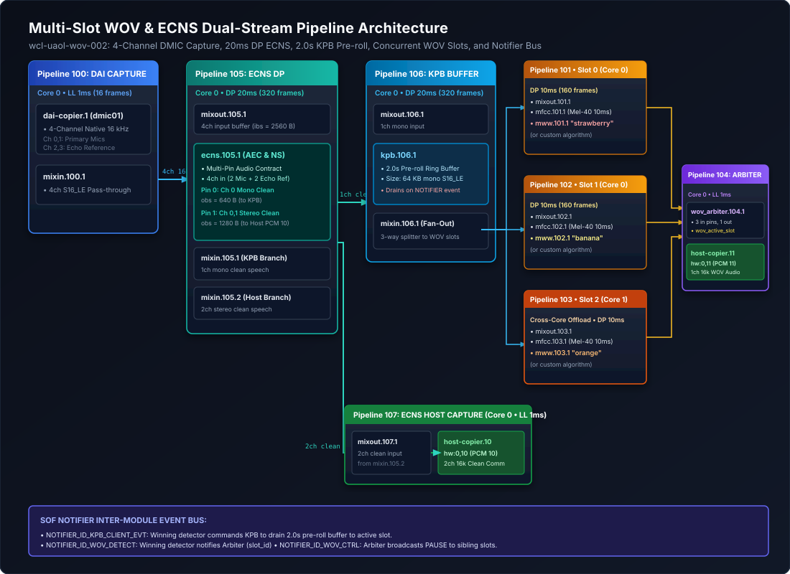
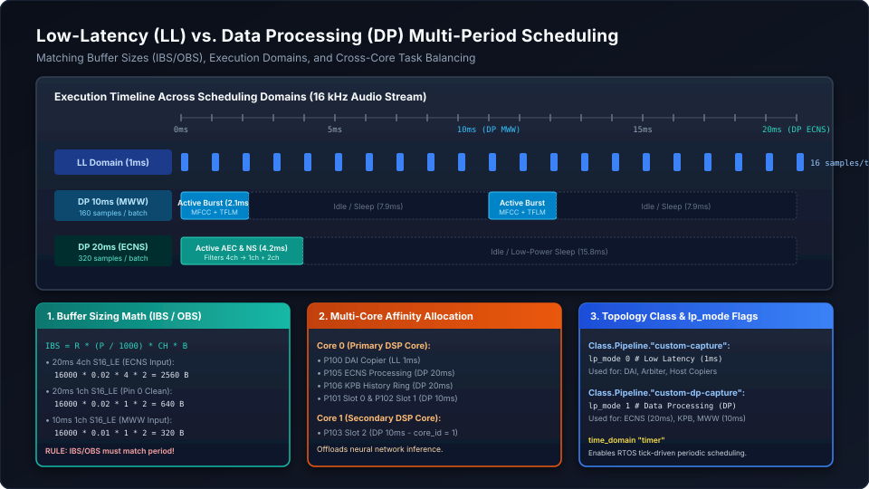

.. _wov_ecns_pipeline_guide:

How-To Guide: Customizing Multi-Slot WOV & ECNS Pipelines
#########################################################

.. contents::
   :local:
   :depth: 3

Sound Open Firmware (SOF) features an advanced, multi-pipeline **Multi-Slot Wake-on-Voice (WOV) and Echo Cancellation & Noise Suppression (ECNS)** subsystem developed on the ``wcl-uaol-wov-002`` branch. This architecture enables simultaneous full-duplex communications and multi-keyword spotting from a single Digital Microphone (DMIC) array.

This comprehensive developer guide details how the subsystem is structured, how inter-module communication is coordinated locklessly via the **SOF Notifier**, and provides a step-by-step walkthrough on how to **replace the ECNS and WOV modules with custom or third-party algorithms**, modify scheduling periods, adjust buffer constraints (IBS/OBS), and reconfigure ALSA Topology 2.0.

---

Subsystem Architecture & Signal Flow
************************************

The baseline architecture coordinates eight interconnected pipelines spanning two distinct host audio capture streams originating from a single Digital Microphone (DMIC) physical interface:

1. **ECNS Communication Stream (ALSA PCM 10 / ``hw:0,10``)**: Captures clean, noise-suppressed stereo 16 kHz speech. This stream is routed to host-side teleconferencing applications (e.g. Teams, Zoom, WebRTC) or audio recorders requiring high-fidelity voice transmission free from acoustic feedback and room reverberation.
2. **WOV Keyword & Audio Stream (ALSA PCM 11 / ``hw:0,11``)**: Captures pre-roll audio (2.0 seconds of cached historical audio from the Key Phrase Buffer) seamlessly concatenated with live speech from whichever keyword spotting slot triggered detection. This stream feeds host voice assistants (e.g. Alexa, Google Assistant, custom on-device wake-word engines).

A physical 4-channel 16 kHz DMIC array supplies the DSP with two primary channels of near-end acoustic speech (Microphones 0 and 1) and two channels of far-end acoustic echo reference (Speaker Channels 2 and 3 looped back from the playback audio subsystem). By co-locating near-end speech and far-end echo in the same synchronous 4-channel DMIC stream, the hardware guarantees zero sample-drift and deterministic phase alignment between speaker playback and microphone capture.

The audio graph processes this stream through three distinct functional phases:

* **Phase 1: Low-Latency DAI Capture (Pipeline 100)**: Ingests raw 4-channel 16 kHz audio from the DMIC hardware at 1 ms intervals (16 frames per tick), maintaining minimum input latency before handing off to processing.
* **Phase 2: Data Processing & Dual-Pin Separation (Pipelines 105 & 106)**: Batches samples into a 20 ms period (320 frames). The ECNS module cancels speaker echo using the reference channels and removes ambient noise, generating two independent output streams:
  - **Pin 0 (Clean Mono Speech)**: Fed to Pipeline 106 (Key Phrase Buffer), which continuously maintains a 2.0-second circular ring buffer in DSP memory.
  - **Pin 1 (Clean Stereo Speech)**: Fed directly to Pipeline 107 (ECNS Host Copier) for teleconferencing on PCM 10.
* **Phase 3: Multi-Slot Keyword Detection & Arbitration (Pipelines 101–104)**: The KPB fans out the mono clean speech across three concurrent detector slots running in 10 ms Data Processing periods. When a slot matches its target keyword model, it triggers the KPB to drain its 2.0-second history buffer and commands the WOV Arbiter to multiplex that slot's audio to PCM 11.

   Figure 322: Multi-Slot WOV & ECNS Pipeline Architecture across 4ch DMIC capture, 20ms DP ECNS, 2.0s KPB pre-roll, 3 concurrent detector slots, WOV Arbiter, and the SOF Notifier event bus.

Pipeline Graph Breakdown
========================

.. list-table:: Multi-Slot WOV and ECNS Pipeline Map
   :widths: 12 18 20 50
   :header-rows: 1

   * - Pipeline ID
     - Name
     - Scheduling Domain
     - Components & Signal Flow
   * - **Pipeline 100**
     - DAI Capture
     - Core 0 • LL 1 ms (16 frames)
     - ``dai-copier.1`` (4ch 16 kHz S16_LE) → ``mixin.100.1`` (4ch pass-through).
   * - **Pipeline 105**
     - ECNS Processing
     - Core 0 • DP 20 ms (320 frames)
     - ``mixout.105.1`` → ``ecns.105.1`` (AEC & NS). Produces:
       - **Pin 0**: Mono clean mic → ``mixin.105.1`` (to KPB).
       - **Pin 1**: Stereo clean mic → ``mixin.105.2`` (to Host Copier 10).
   * - **Pipeline 106**
     - KPB History Buffer
     - Core 0 • DP 20 ms (320 frames)
     - ``mixout.106.1`` → ``kpb.106.1`` (2.0s = 64 KB mono ring buffer) → ``mixin.106.1`` (3-way fanout mixin).
   * - **Pipeline 101**
     - WOV Slot 0
     - Core 0 • DP 10 ms (160 frames)
     - ``mixout.101.1`` → ``mfcc.101.1`` → ``mww.101.1`` (keyword model: "strawberry").
   * - **Pipeline 102**
     - WOV Slot 1
     - Core 0 • DP 10 ms (160 frames)
     - ``mixout.102.1`` → ``mfcc.102.1`` → ``mww.102.1`` (keyword model: "banana").
   * - **Pipeline 103**
     - WOV Slot 2
     - **Core 1** • DP 10 ms (160 frames)
     - ``mixout.103.1`` → ``mfcc.103.1`` → ``mww.103.1`` (keyword model: "orange"). Demonstrates **cross-core task offload**.
   * - **Pipeline 104**
     - WOV Host Capture
     - Core 0 • LL 1 ms (16 frames)
     - ``wov_arbiter.104.1`` (3 input pins, 1 output pin) → ``host-copier.11`` (ALSA PCM 11, ``hw:0,11``).
   * - **Pipeline 107**
     - ECNS Host Capture
     - Core 0 • LL 1 ms (16 frames)
     - ``mixout.107.1`` (stereo clean input from ``mixin.105.2``) → ``host-copier.10`` (ALSA PCM 10, ``hw:0,10``).

---

SOF Notifier Inter-Module Event Bus
***********************************

A central architectural innovation in this subsystem is the lockless, zero-IPC event dispatch provided by the **SOF Notifier**. Because all modules execute inside the same DSP address space, inter-module events are dispatched synchronously without serialization or kernel intervention:

.. list-table:: SOF Notifier Events in WOV/ECNS Architecture
   :widths: 25 20 20 35
   :header-rows: 1

   * - Notifier Event ID
     - Producer
     - Consumer
     - Action & Payload
   * - ``NOTIFIER_ID_WOV_DETECT``
     - Triggered Detector (e.g. Slot 0)
     - ``wov_arbiter``
     - Passes ``slot_id`` (0, 1, or 2). Arbiter switches the active audio route to this slot and unmuts audio.
   * - ``NOTIFIER_ID_KPB_CLIENT_EVT``
     - Triggered Detector
     - ``kpb`` (Key Phrase Buffer)
     - Commands KPB to transition to drain mode (``KPB_EVENT_DRAIN``), emptying 2.0s of cached history audio.
   * - ``NOTIFIER_ID_WOV_CTRL``
     - ``wov_arbiter``
     - Sibling Detectors
     - Broadcasts ``WOV_CMD_PAUSE`` to prevent competing slots from firing, or ``WOV_CMD_RESUME`` on host stream reset.

Notifier Registration & Dispatch Pattern
========================================

The SOF Notifier provides a lockless, publish-subscribe event mechanism that coordinates DSP processing components executing within the firmware address space without incurring host IPC latency, kernel transitions, or DMA overhead.

Notifier Registration & Lifecycle
---------------------------------

Modules subscribe to events using ``notifier_register()``, typically during the component's ``prepare()`` or ``init()`` lifecycle phases:

.. code-block:: c

   #include <sof/lib/notifier.h>
   #include <sof/audio/wov_arbiter.h>
   #include <sof/audio/kpb.h>

   /* Prototype:
    * void notifier_register(struct comp_dev *dev, void *caller_data,
    *                        enum notify_id type,
    *                        void (*cb)(void *arg, enum notify_id type, void *data),
    *                        uint32_t flags);
    */
   notifier_register(dev, cd, NOTIFIER_ID_WOV_CTRL, my_wov_ctrl_callback, 0);

Key parameters for registration:

* ``dev``: Pointer to the component device (``struct comp_dev *``).
* ``caller_data``: Private context pointer passed back as the first argument (``void *arg``) to the callback function (e.g. ``struct my_wov_comp_data *cd``).
* ``type``: The unique enumeration value identifying the event class (e.g. ``NOTIFIER_ID_WOV_CTRL``).
* ``cb``: Callback function pointer invoked synchronously whenever matching events are dispatched.
* ``flags``: Operational modifiers (typically ``0`` for standard synchronous delivery).

.. warning::
   **Mandatory Unregistration**:
   Any module that registers a notifier callback **must** explicitly call ``notifier_unregister(dev, cd, NOTIFIER_ID_WOV_CTRL)`` during its ``reset()`` and ``free()`` lifecycle routines. Failing to unregister leaves dangling function pointers in the global notifier dispatch table, causing fatal DSP exception faults (null-pointer or unmapped memory dereferences) when subsequent events are fired after pipeline teardown.

Callback Execution Context & Rules
----------------------------------

Notifier callbacks are executed **synchronously within the thread/task context of the component that dispatches the event** via ``notifier_event()``:

.. code-block:: c

   static void my_wov_ctrl_callback(void *arg, enum notify_id type, void *data)
   {
       struct my_wov_comp_data *cd = (struct my_wov_comp_data *)arg;
       struct wov_ctrl_event_data *ctrl = (struct wov_ctrl_event_data *)data;

       if (ctrl->cmd == WOV_CMD_PAUSE) {
           cd->paused = true;
       } else if (ctrl->cmd == WOV_CMD_RESUME) {
           cd->paused = false;
           cd->detected = false;
           my_model_reset(cd->model_context);
       }
   }

Because the callback runs directly on the caller's execution thread, strict real-time rules apply:

* **Non-Blocking Execution**: Callbacks must never sleep, yield, or pend on semaphores or mutexes.
* **Zero Dynamic Allocation**: Never allocate memory (``rballoc``, ``malloc``) inside a callback.
* **Minimal State Manipulation**: Limit logic to setting volatile state flags, resetting pointer offsets, or triggering internal state machines.

Synchronous Event Dispatch & Payloads
-------------------------------------

When a keyword detector achieves confidence scoring above its operational threshold, it issues two back-to-back synchronous notifications:

.. code-block:: c

   static void my_wov_trigger_detection(struct comp_dev *dev, int slot_id)
   {
       struct kpb_event_data kpb_evt = {
           .event_id = KPB_EVENT_DRAIN,
           .client_id = slot_id,
       };
       struct wov_detect_event_data arb_evt = {
           .slot_id = slot_id,
       };

       /* 1. Command KPB to drain 2.0 seconds of pre-roll history audio */
       notifier_event(dev, NOTIFIER_ID_KPB_CLIENT_EVT,
                      CORE_SPECIFIC_BROADCAST, &kpb_evt, sizeof(kpb_evt));

       /* 2. Inform WOV Arbiter of winning slot to route audio to PCM 11 */
       notifier_event(dev, NOTIFIER_ID_WOV_DETECT,
                      CORE_SPECIFIC_BROADCAST, &arb_evt, sizeof(arb_evt));
   }

Dispatch Mechanics:

* ``core_mask``: Specifying ``CORE_SPECIFIC_BROADCAST`` instructs the notifier infrastructure to dispatch the event locally on the current core and cross-dispatch to secondary cores (e.g. Core 1) via DSP Inter-Processor Interrupts (IPI).
* ``NOTIFIER_ID_KPB_CLIENT_EVT``: Ingested by ``kpb.106.1``. The ``KPB_EVENT_DRAIN`` payload causes the Key Phrase Buffer to cease circular overwriting and rapidly pump its 64 KB history ring buffer downstream into the active slot's pipeline.
* ``NOTIFIER_ID_WOV_DETECT``: Ingested by ``wov_arbiter.104.1``. The ``slot_id`` payload instructs the arbiter to lock its audio multiplexer to that slot's input pin, unmute the stream to ``host-copier.11`` (ALSA PCM 11), and broadcast a ``WOV_CMD_PAUSE`` event across ``NOTIFIER_ID_WOV_CTRL`` to suppress sibling slots from firing.

---

Step-by-Step Guide: Replacing the ECNS Module
*********************************************

The ECNS module performs Acoustic Echo Cancellation (AEC) and Noise Suppression (NS). Developers can replace the reference ECNS module with custom neural noise suppressors (e.g. RNNoise, DeepFilterNet), open-source algorithms (SpeexDSP, WebRTC AEC3), or proprietary vendor DSP libraries.

Step 1: Understand the Multi-Pin Contract
=========================================

In full-duplex communication systems, microphones pick up both the near-end user's voice and the far-end speaker playback echoing off the room walls and device chassis. To eliminate this acoustic coupling without distorting speech, the ECNS component must ingest both the microphone signals and an uncorrupted echo reference, and provide separate outputs tailored for voice trigger and communications.

An ECNS component in this topology must adhere to a strict multi-pin input/output contract:

* **Input Pin 0 (4-Channel 16 kHz S16_LE Capture)**:
  - **Channels 0 and 1 (Microphones)**: Primary physical microphone signals containing near-end speech, ambient noise, and acoustic speaker echo.
  - **Channels 2 and 3 (Echo Reference)**: Digital loopback of the speaker audio currently being rendered by the DAC/amplifier. The AEC adaptive filter cross-correlates this reference with the microphone input to model the room impulse response and subtract the loudspeaker echo.
* **Output Pin 0 (Mono Clean Speech - 1 Channel 16 kHz S16_LE)**:
  - Feeds ``mixin.105.1`` → ``kpb.106.1`` for keyword spotting.
  - Keyword spotting engines (e.g. MFCC feature extractors, DNN classifiers) require a single, normalized, echo-free mono channel. Spatial cues or stereo phase differences can degrade acoustic model recognition accuracy.
* **Output Pin 1 (Stereo Clean Speech - 2 Channels 16 kHz S16_LE)**:
  - Feeds ``mixin.105.2`` → ``host-copier.10`` (ALSA PCM 10) for human teleconferencing.
  - Preserves natural stereo spatial imaging for VoIP, meeting applications, and host-side recordings while stripping out background noise and speaker feedback.

Step 2: Implement the Component Interface
=========================================

Implement the multi-pin audio adapter in ``src/audio/my_ecns/my_ecns.c`` using the SOF processing module framework:

Module Lifecycle Architecture
-----------------------------

A compliant SOF processing module must implement several key lifecycle handlers:

1. **``init()``**: Allocates the component's private context structure (``struct my_ecns_comp_data``) using ``mod_alloc()`` and initializes default algorithmic parameters.
2. **``prepare()``**: Invoked before audio streaming commences. The module queries negotiated stream configurations, validates buffer parameters via ``comp_verify_params()``, and allocates large runtime memory buffers (e.g. AEC filter state, FFT scratch memory) using ``rballoc_align()`` with ``SOF_MEM_ZONE_SYS_RUNTIME`` and ``SOF_MEM_CAPS_RAM``.
3. **``process()``**: The core audio processing routine called repeatedly by the pipeline scheduler.
4. **``reset()`` and ``free()``**: Tears down the module, frees all dynamically allocated memory via ``rfree()``, and cleans up registered notifiers.
5. **Runtime IPC Tuning (``set_value()`` / ``get_value()``)**: Processes large configuration blobs sent from host user space (e.g. ``sof-ctl`` or ALSA mixer controls) to dynamically tune filter adaptation speeds, double-talk sensitivity, and noise attenuation decibels.

Component Implementation Template
---------------------------------

.. code-block:: c

   // SPDX-License-Identifier: BSD-3-Clause
   #include <sof/audio/module_adapter/module/generic.h>
   #include <sof/audio/sink_api.h>
   #include <sof/audio/source_api.h>
   #include <sof/audio/component.h>
   #include <rtos/init.h>

   SOF_DEFINE_REG_UUID(my_ecns);
   LOG_MODULE_REGISTER(my_ecns, CONFIG_SOF_LOG_LEVEL);

   struct my_ecns_comp_data {
       void *aec_state;
       int period_frames;      /* 320 frames for 20ms @ 16 kHz */
       int16_t scratch[1280] __aligned(16);
   };

   static int my_ecns_init(struct processing_module *mod)
   {
       struct comp_dev *dev = mod->dev;
       struct my_ecns_comp_data *cd;

       cd = mod_alloc(sizeof(*cd));
       if (!cd)
           return -ENOMEM;

       mod->priv_data = cd;
       cd->period_frames = 320; /* 20ms period */
       return 0;
   }

   static int my_ecns_prepare(struct processing_module *mod)
   {
       struct my_ecns_comp_data *cd = module_get_private_data(mod);

       /* Allocate algorithm filter state cache-aligned to 16 bytes */
       cd->aec_state = rballoc_align(0, SOF_MEM_CAPS_RAM,
                                     SOF_MEM_ZONE_SYS_RUNTIME, 16,
                                     my_aec_get_state_size());
       if (!cd->aec_state)
           return -ENOMEM;

       my_aec_init(cd->aec_state, 16000, 4, 1);
       return 0;
   }

   static int my_ecns_process(struct processing_module *mod,
                              struct sof_source **sources, int num_of_sources,
                              struct sof_sink **sinks, int num_of_sinks)
   {
       struct my_ecns_comp_data *cd = module_get_private_data(mod);
       struct sof_source *src = sources[0];
       struct sof_sink *sink_clean_mono = sinks[0];   /* Pin 0 -> KPB */
       struct sof_sink *sink_clean_stereo = sinks[1]; /* Pin 1 -> Host */

       int in_frames = source_get_data_frames_available(src);
       int out_frames_0 = sink_get_free_frames(sink_clean_mono);
       int out_frames_1 = sink_get_free_frames(sink_clean_stereo);

       /* Determine the maximum common frames that can be safely processed */
       int frames = MIN(in_frames, MIN(out_frames_0, out_frames_1));
       if (frames < cd->period_frames)
           return 0; /* Wait until a full 20ms period (320 frames) is available */

       /* Retrieve read pointer from 4-channel input and write pointers for sinks */
       int16_t *in_ptr = source_get_read_ptr(src);
       int16_t *out_mono_ptr = sink_get_write_ptr(sink_clean_mono);
       int16_t *out_stereo_ptr = sink_get_write_ptr(sink_clean_stereo);

       /* Execute custom acoustic echo cancellation & noise suppression */
       my_custom_aec_process(cd->aec_state, in_ptr, out_mono_ptr,
                             out_stereo_ptr, cd->period_frames);

       /* Commit consumed input frames and produced output frames */
       source_seek_read_ptr(src, cd->period_frames * source_get_frame_bytes(src));
       sink_seek_write_ptr(sink_clean_mono, cd->period_frames * sink_get_frame_bytes(sink_clean_mono));
       sink_seek_write_ptr(sink_clean_stereo, cd->period_frames * sink_get_frame_bytes(sink_clean_stereo));

       return 0;
   }

   static int my_ecns_reset(struct processing_module *mod)
   {
       struct my_ecns_comp_data *cd = module_get_private_data(mod);

       if (cd->aec_state) {
           rfree(cd->aec_state);
           cd->aec_state = NULL;
       }
       return 0;
   }

Step 3: Update Buffer Sizing in Topology 2.0 (IBS & OBS Deep Dive)
==================================================================

In ALSA Topology 2.0, two essential configuration tokens govern audio buffer scheduling and memory allocation:

* **``ibs`` (Input Buffer Size)**: Specifies the minimum number of **bytes** required in the component's input buffer before the pipeline scheduler triggers the module's ``process()`` callback.
* **``obs`` (Output Buffer Size)**: Specifies the minimum number of **free bytes** required in the downstream sink buffer before the module can execute, and represents the byte quantity produced by the module in a single execution period.

Why IBS and OBS are Critical to Pipeline Execution
--------------------------------------------------

1. **Topology Memory Allocation**: When the SOF kernel driver parses the topology manifest, it allocates inter-component circular ring buffers sized as integer multiples of ``ibs`` and ``obs`` (typically :math:`2 \times \text{ibs}` or :math:`3 \times \text{ibs}` to allow double or triple buffering). An incorrect token will allocate either insufficient memory (causing overrun) or excessive memory (wasting tightly constrained DSP SRAM).
2. **Scheduler Execution Thresholds**: The SOF pipeline scheduler queries ``source_get_data_available()`` and ``sink_get_free_size()``. It will **only** dispatch the module when:

   .. math::

      \text{data\_available} \ge \text{ibs} \quad \text{and} \quad \text{free\_space} \ge \text{obs}

   If ``ibs`` is mistakenly set to 128 bytes (1 ms) while the C module internally waits for 2560 bytes (20 ms), the pipeline scheduler will wake the component 20 times per period, 19 of which will immediately exit without processing data. This introduces severe CPU scheduling overhead and prevents the DSP from entering low-power sleep states.
3. **Parameter Validation Handshake**: During stream startup, the firmware invokes ``comp_verify_params()`` to cross-check that the component's configured algorithmic frame chunk matches the topology's declared ``ibs`` and ``obs``. If a discrepancy exists, the driver fails with an IPC parameter error (``-EINVAL``).

Mathematical Calculation for Multi-Pin ECNS
-------------------------------------------

The buffer size in bytes is determined by the standard chunk formula:

.. math::

   \text{Size (bytes)} = \text{Sample Rate (Hz)} \times \left(\frac{\text{Period (ms)}}{1000}\right) \times \text{Channels} \times \text{Bytes Per Sample}

For our 20 ms ECNS configuration at 16 kHz S16_LE (2 bytes per sample, 320 frames per chunk):

* **Input Pin 0 (4 Channels)**:
  :math:`16000 \times 0.020 \times 4 \times 2 = \mathbf{2560\text{ bytes}} \implies \mathbf{ibs\ 2560}`
* **Output Pin 0 (Mono Clean to KPB - 1 Channel)**:
  :math:`16000 \times 0.020 \times 1 \times 2 = \mathbf{640\text{ bytes}} \implies \mathbf{obs\ 640}`
* **Output Pin 1 (Stereo Clean to Host - 2 Channels)**:
  :math:`16000 \times 0.020 \times 2 \times 2 = \mathbf{1280\text{ bytes}} \implies \mathbf{obs\ 1280}`

Topology 2.0 Widget Declaration
-------------------------------

In `tools/topology/topology2/dmic-wov-multi-4ch-manifest.conf <file:///home/lrg/work/sof-tgl/sof-wov/tools/topology/topology2/dmic-wov-multi-4ch-manifest.conf>`_, declare the ECNS widget with separate output audio format blocks matching each output pin index:

.. code-block:: text

   Object.Widget.ecns.1 {
       uuid $MY_ECNS_UUID
       num_input_pins  1
       num_output_pins 2
       num_input_audio_formats  1
       num_output_audio_formats 2

       Object.Base.input_audio_format [
           {
               in_rate            16000
               in_channels        4
               in_bit_depth       16
               in_valid_bit_depth 16
               ibs                2560    # 20ms @ 16 kHz 4ch S16_LE
           }
       ]
       Object.Base.output_audio_format [
           # Pin 0: Mono clean to KPB (output_pin_index 0)
           {
               output_pin_index    0
               out_rate            16000
               out_channels        1
               out_bit_depth       16
               out_valid_bit_depth 16
               obs                 640     # 20ms @ 16 kHz 1ch S16_LE
           }
           # Pin 1: Stereo clean to Host (output_pin_index 1)
           {
               output_pin_index    1
               out_rate            16000
               out_channels        2
               out_bit_depth       16
               out_valid_bit_depth 16
               obs                 1280    # 20ms @ 16 kHz 2ch S16_LE
           }
       ]
   }

---

Step-by-Step Guide: Replacing the WOV / Keyword Detector Module
***************************************************************

In multi-slot keyword spotting architectures, multiple detector modules run in parallel pipelines, each monitoring the clean mono speech stream for a specific trigger phrase (e.g. Slot 0 for "strawberry", Slot 1 for "banana", Slot 2 for "orange"). Developers can replace the reference ``mww`` (microWakeWord) or ``detect_test`` component with custom neural acoustic models, TensorFlow Lite for Microcontrollers (TFLM) models, or third-party engines (e.g. Picovoice Porcupine, Sensory TrulyHandsfree).

Step 1: Implement the Detector Interface
========================================

A keyword detector component in SOF must handle two concurrent responsibilities:
1. **Real-Time Acoustic Inference**: Continuously stream mono 16 kHz audio frames (typically in 10 ms chunks = 160 frames), extract features (e.g. Mel filterbanks), and execute the neural network classifier.
2. **Asynchronous Arbitration & State Synchronization**: Respond to Arbiter control events (pause/resume) and trigger downstream pre-roll draining when a keyword is recognized.

Streaming Detector Architecture
-------------------------------

In ``src/audio/my_wov/my_wov.c``, implement the detector module adapter:

.. code-block:: c

   // SPDX-License-Identifier: BSD-3-Clause
   #include <sof/audio/module_adapter/module/generic.h>
   #include <sof/audio/wov_arbiter.h>
   #include <sof/audio/kpb.h>
   #include <sof/lib/notifier.h>

   SOF_DEFINE_REG_UUID(my_wov);
   LOG_MODULE_REGISTER(my_wov, CONFIG_SOF_LOG_LEVEL);

   struct my_wov_comp_data {
       int slot_id;            /* 0, 1, or 2 assigned via topology */
       bool paused;            /* Suppressed when a sibling slot wins */
       bool detected;          /* Latched true upon keyword trigger */
       void *model_context;    /* Neural network / TFLM runtime state */
   };

   /* Notifier callback: Arbiter commands this slot to PAUSE or RESUME */
   static void my_wov_ctrl_cb(void *arg, enum notify_id type, void *data)
   {
       struct comp_dev *dev = arg;
       struct my_wov_comp_data *cd = module_get_private_data(dev->mod);
       struct wov_ctrl_event_data *ctrl = data;

       if (ctrl->cmd == WOV_CMD_PAUSE) {
           /* Sibling slot triggered: pause local inference to save DSP MCPS */
           cd->paused = true;
       } else if (ctrl->cmd == WOV_CMD_RESUME) {
           /* Host stream reset: re-arm detector for the next trigger */
           cd->paused = false;
           cd->detected = false;
           my_model_reset(cd->model_context);
       }
   }

   static int my_wov_init(struct processing_module *mod)
   {
       struct comp_dev *dev = mod->dev;
       struct my_wov_comp_data *cd;

       cd = mod_alloc(sizeof(*cd));
       if (!cd)
           return -ENOMEM;

       mod->priv_data = cd;
       cd->slot_id = dev->ipc_config.index; /* Slot ID from topology widget index */
       cd->paused = false;
       cd->detected = false;
       return 0;
   }

   static int my_wov_prepare(struct processing_module *mod)
   {
       struct comp_dev *dev = mod->dev;
       struct my_wov_comp_data *cd = module_get_private_data(mod);

       /* Initialize acoustic model engine and allocate scratch buffers */
       cd->model_context = my_model_init();
       if (!cd->model_context)
           return -ENOMEM;

       /* Register callback to receive PAUSE / RESUME commands from Arbiter */
       notifier_register(dev, cd, NOTIFIER_ID_WOV_CTRL, my_wov_ctrl_cb, 0);
       return 0;
   }

   static int my_wov_process(struct processing_module *mod,
                             struct sof_source **sources, int num_of_sources,
                             struct sof_sink **sinks, int num_of_sinks)
   {
       struct my_wov_comp_data *cd = module_get_private_data(mod);
       struct sof_source *source = sources[0];
       struct sof_sink *sink = sinks[0];
       int frames = source_get_data_frames_available(source);

       if (frames == 0)
           return 0;

       /* If active and not paused by arbiter, run acoustic model inference */
       if (!cd->paused && !cd->detected) {
           if (my_model_detect_keyword(cd->model_context, source, frames)) {
               cd->detected = true;

               /* 1. Command KPB to drain 2.0s pre-roll buffer to active slot */
               /* 2. Inform Arbiter that this slot won detection */
               my_wov_trigger_detection(mod->dev, cd->slot_id);
           }
       }

       /* Forward audio downstream to maintain pipeline continuity */
       source_to_sink_copy(source, sink, true, frames * source_get_frame_bytes(source));
       return 0;
   }

   static int my_wov_reset(struct processing_module *mod)
   {
       struct comp_dev *dev = mod->dev;
       struct my_wov_comp_data *cd = module_get_private_data(mod);

       /* Mandatory: Unregister notifier to avoid dangling callbacks */
       notifier_unregister(dev, cd, NOTIFIER_ID_WOV_CTRL);

       if (cd->model_context) {
           my_model_free(cd->model_context);
           cd->model_context = NULL;
       }
       return 0;
   }

Step 2: Configure Model Parameters in Topology
==============================================

To integrate the custom keyword detector into ALSA Topology 2.0, declare the widget class in `tools/topology/topology2/include/components/my_wov.conf`:

Understanding the Topology 2.0 Widget Definition
------------------------------------------------

* **Attributes**:
  - ``index``: Pipeline index where the widget is instantiated.
  - ``instance``: Unique instance number across all detector widgets.
  - ``cpc``: Cycles Per Chunk (CPC) estimate for the scheduler's dynamic load balancer.
* **UUID Binding**:
  - The ``uuid`` string must match the 16-byte UUID defined via ``SOF_DEFINE_REG_UUID(my_wov)`` in the C driver.
* **Pin Counts**:
  - Single input pin (``num_input_pins 1``) receiving 1ch clean mono speech from KPB.
  - Single output pin (``num_output_pins 1``) routing to ``wov_arbiter``.
* **Buffer Constraints**:
  - Sized for a 10 ms Data Processing period: :math:`16000 \times 0.010 \times 1 \times 2 = \mathbf{320\text{ bytes}}` (``ibs 320``, ``obs 320``).

Widget Class Definition
-----------------------

.. code-block:: text

   Class.Widget."my_wov" {
       DefineAttribute."index"    { type "integer" }
       DefineAttribute."instance" { type "integer" }
       DefineAttribute."cpc"      { token_ref "comp.word" }

       <include/components/widget-common.conf>

       attributes {
           !constructor [ "index", "instance" ]
           !mandatory   [ "uuid", "num_input_audio_formats", "num_output_audio_formats" ]
           unique "instance"
       }

       uuid "1f:d5:a8:eb:27:78:b5:47:82:ee:de:6e:77:43:af:67"
       type "effect"
       no_pm "true"
       num_input_pins 1
       num_output_pins 1
   }

In the multi-slot manifest (`dmic-wov-multi-4ch-manifest.conf <file:///home/lrg/work/sof-tgl/sof-wov/tools/topology/topology2/dmic-wov-multi-4ch-manifest.conf>`_), instantiate the widget within each detector pipeline (Pipelines 101, 102, 103), binding the model-specific binary data blobs (such as trained neural network weight files or detection threshold structures).

---

Scheduling, Periods & Core Affinity in Topology 2.0
***************************************************

Configuring a high-performance audio graph requires matching **Execution Domains**, **Scheduling Periods**, and **Multi-Core Affinities**:

   Figure 323: Scheduling domains, period boundaries (1ms LL vs 10ms/20ms DP), and multi-core affinity assignments.

Low-Latency (LL) vs. Data Processing (DP) Domains
=================================================

1. **Low-Latency Domain (``lp_mode 0``, 1 ms period)**:
   - Synchronized directly to the hardware 1 ms timer tick.
   - Processes small sample chunks (16 frames at 16 kHz).
   - Applied to hardware DAIs (``dai-copier``), ``wov_arbiter``, and host PCMs (``host-copier``) to maintain minimum end-to-end latency.
2. **Data Processing Domain (``lp_mode 1``, 10 ms or 20 ms period)**:
   - Batches samples into larger algorithmic frames (160 frames for 10 ms; 320 frames for 20 ms).
   - Applied to compute-intensive algorithms (ECNS, MFCC, microWakeWord, TFLM).
   - **Power Optimization**: Allows the DSP core to execute heavy vector math in a brief burst and sleep in low-power idle states between chunks.

Mathematical Period & Buffer Sizing Rule
========================================

When configuring an audio component in ALSA Topology 2.0, input buffer size (``ibs``) and output buffer size (``obs``) must satisfy the sample chunk equation:

.. math::

   \text{Buffer Size (bytes)} = \text{Sample Rate (Hz)} \times \left(\frac{\text{Period (ms)}}{1000}\right) \times \text{Channels} \times \text{Bytes Per Sample}

.. list-table:: Standard Buffer Sizing Lookup Matrix (16 kHz, S16_LE = 2 Bytes)
   :widths: 25 20 20 35
   :header-rows: 1

   * - Processing Block
     - Period
     - Channels
     - Calculated Buffer Size (IBS / OBS)
   * - **LL 1ms Capture**
     - 1 ms
     - 4 channels
     - :math:`16000 \times 0.001 \times 4 \times 2 = \mathbf{128\text{ bytes}}`
   * - **DP 10ms Keyword Slot**
     - 10 ms
     - 1 channel (mono)
     - :math:`16000 \times 0.010 \times 1 \times 2 = \mathbf{320\text{ bytes}}`
   * - **DP 20ms ECNS Input**
     - 20 ms
     - 4 channels
     - :math:`16000 \times 0.020 \times 4 \times 2 = \mathbf{2560\text{ bytes}}`
   * - **DP 20ms Clean Mono**
     - 20 ms
     - 1 channel (mono)
     - :math:`16000 \times 0.020 \times 1 \times 2 = \mathbf{640\text{ bytes}}`
   * - **DP 20ms Clean Stereo**
     - 20 ms
     - 2 channels
     - :math:`16000 \times 0.020 \times 2 \times 2 = \mathbf{1280\text{ bytes}}`

.. warning::
   If the topology ``ibs`` or ``obs`` token differs from the buffer size expected by the firmware module, pipeline initialization will fail with an IPC buffer alignment error (``-EINVAL``) during ``comp_verify_params()``.

Cross-Core Task Affinity (``core_id``)
======================================

Multi-keyword spotting workloads execute continuous STFT framing, Mel filterbank feature generation, and neural network matrix multiplications. On multi-core DSP architectures (such as Intel cAVS 2.5 on Tiger Lake and ACE on Meteor Lake / Arrow Lake / Panther Lake), running three or more concurrent keyword detectors on Core 0 can saturate the primary core, starving real-time audio copiers and causing audible buffer underruns.

Inter-Core Audio Routing Architecture
-------------------------------------

To achieve deterministic real-time performance, SOF supports cross-core task affinity in ALSA Topology 2.0:

* **Core 0 (Primary Core)**: Runs real-time hardware copiers and preprocessing:
  - Pipeline 100 (DAI Capture, LL 1ms)
  - Pipeline 105 (ECNS Processing, DP 20ms)
  - Pipeline 106 (KPB History Buffer, DP 20ms)
  - Pipeline 101 (Slot 0 Detector, DP 10ms)
  - Pipeline 102 (Slot 1 Detector, DP 10ms)
  - Pipeline 104 (WOV Arbiter & PCM 11 Copier, LL 1ms)
  - Pipeline 107 (ECNS Host Copier & PCM 10, LL 1ms)
* **Core 1 (Secondary Core)**: Offloaded compute-intensive detector:
  - Pipeline 103 (Slot 2 Detector, DP 10ms)

SOF manages inter-core audio communication locklessly using decoupled ring buffers located in shared DSP SRAM. When Pipeline 106 on Core 0 pushes audio into its output mixin (``mixin.106.1``), Pipeline 103 on Core 1 reads from ``mixout.103.1`` across DSP cache boundaries without requiring kernel mutex locks or blocking synchronization.

Configuring Core Affinity in Topology 2.0
-----------------------------------------

To assign a pipeline to a secondary core, set the ``core_id`` token in the pipeline widget definition:

.. code-block:: text

   # Pipeline 103: WOV Slot 2 offloaded to DSP Core 1
   Object.Pipeline."custom-dp-capture" [
       {
           index 103

           Object.Widget.pipeline.1 {
               priority 0
               lp_mode  1
               core_id  1    # Cross-core execution on Core 1!
           }
       }
   ]

---

Building, Deploying & Verifying the Pipeline
********************************************

Compiling Topology with the NHLT Preprocessor Plugin
====================================================

The Non-HD-Audio Link Table (NHLT) is an ACPI BIOS data structure that defines microphone physical geometry, hardware PDM decimation filters, clock configurations, and vendor-specific audio endpoints.

Under normal circumstances, the SOF Linux driver parses the NHLT table supplied by the host PC's BIOS. However, on pre-production development hardware, BIOS ACPI tables frequently lack 4-channel native 16 kHz DMIC descriptors (often providing only generic 2-channel 48 kHz tables). To resolve this, the ALSA topology compiler (``alsatplg``) utilizes a dedicated **NHLT Preprocessor Plugin** to generate and embed a validated 16 kHz 4-channel NHLT blob directly into the binary topology file:

.. code-block:: bash

   cd $SOF_WORKSPACE/sof
   TPLG2=$(pwd)/tools/topology/topology2
   ALSA_TMP=/tmp/alsa-tplg-wov

   mkdir -p $ALSA_TMP
   cp /usr/share/alsa/alsa.conf $ALSA_TMP/
   ln -sf $TPLG2/include  $ALSA_TMP/include
   ln -sf $TPLG2/platform $ALSA_TMP/platform

   # Compile Native 16 kHz 4-Channel Multi-WOV Topology with embedded NHLT
   ALSA_CONFIG_DIR=$ALSA_TMP ALSA_TOPOLOGY_PLUGIN_DIR=/usr/lib/alsa-topology alsatplg \
       -I $TPLG2 -p \
       -c tools/topology/topology2/dmic-wov-multi-4ch-manifest.conf \
       -o /tmp/sof-tgl-dmic-wov-multi-4ch.tplg

BIOS NHLT Table Override (``sof_use_tplg_nhlt=1``)
==================================================

To instruct the Linux SOF kernel driver to bypass the incomplete host BIOS ACPI table and consume the NHLT table packaged inside the topology file, configure the driver module option ``sof_use_tplg_nhlt=1``.

Add to `/etc/modprobe.d/sof.conf` on the target device:

.. code-block:: ini

   options snd_sof tplg_path=intel/sof-ipc4-tplg tplg_filename=sof-tgl-dmic-wov-multi-4ch.tplg
   options snd_sof_intel_hda_common sof_use_tplg_nhlt=1

Reload the audio driver stack to apply the override:

.. code-block:: bash

   ssh root@<target_ip> '
     modprobe -r snd_sof_pci_intel_tgl snd_sof_intel_hda_common snd_sof
     modprobe snd_sof_intel_hda_common sof_use_tplg_nhlt=1
     modprobe snd_sof_pci_intel_tgl
   '

Inspect the kernel log via ``dmesg | grep -i nhlt`` to confirm successful activation:

.. code-block:: text

   sof-audio-pci-intel-tgl: using topology NHLT table instead of ACPI

Verifying Both Audio Streams on Target Hardware
===============================================

Step 1: Inspect ALSA Capture Endpoints
--------------------------------------

Verify that the kernel has enumerated both host copier endpoints:

.. code-block:: bash

   ssh root@<target_ip> 'arecord -l'

Expected output should list both PCM 10 and PCM 11:

.. code-block:: text

   card 0: sofhdadsp [sof-hda-dsp], device 10: ECNS Capture (*) []
     Subdevices: 1/1
     Subdevice #0: subdevice #0
   card 0: sofhdadsp [sof-hda-dsp], device 11: WOV Capture (*) []
     Subdevices: 1/1
     Subdevice #0: subdevice #0

Step 2: Verify Simultaneous ECNS Teleconferencing Audio (PCM 10)
----------------------------------------------------------------

Record a 5-second sample from PCM 10 to confirm that the ECNS module is actively processing 2-channel clean speech:

.. code-block:: bash

   ssh root@<target_ip> 'arecord -D hw:0,10 -c 2 -r 16000 -f S16_LE -d 5 /tmp/ecns_clean.wav'

Play back `/tmp/ecns_clean.wav` to verify that speaker playback echo is cancelled and ambient room noise is suppressed.

Step 3: Monitor Active Keyword Slot State via ALSA Mixer
--------------------------------------------------------

Query the ALSA mixer control exposed by the WOV Arbiter to observe slot detection status:

.. code-block:: bash

   ssh root@<target_ip> "amixer -c0 sget 'wov_active_slot'"

Output states:
* ``0``: Idle / Listening mode across all detector slots.
* ``1``: Slot 0 detected ("strawberry").
* ``2``: Slot 1 detected ("banana").
* ``3``: Slot 2 detected ("orange").

Step 4: Capture Triggered Keyword Audio with 2.0s Pre-Roll (PCM 11)
-------------------------------------------------------------------

When speaking a trigger phrase (e.g. "strawberry"), capture the drained audio stream from PCM 11:

.. code-block:: bash

   ssh root@<target_ip> 'arecord -D hw:0,11 -c 1 -r 16000 -f S16_LE -d 4 /tmp/wov_trigger.wav'

Verify the recorded waveform in an audio editor (e.g. Audacity or MHWaveEdit). The file should contain approximately 2.0 seconds of history buffer audio preceding the trigger point, followed seamlessly by live spoken speech.

---

Summary: Developer "Watch Out" Checklist
****************************************

.. list-table:: WOV & ECNS Customization Checklist
   :widths: 20 40 40
   :header-rows: 1

   * - Domain
     - Common Failure Mode
     - Correct Engineering Rule
   * - **Multi-Pin Output**
     - Attempting to output both mono and stereo streams from a single output pin.
     - Declare 2 output pins on ECNS: Pin 0 = 1ch mono (to KPB), Pin 1 = 2ch stereo (to Host Copier 10).
   * - **Buffer Sizing (IBS/OBS)**
     - Mismatched ``ibs`` or ``obs`` in topology versus component frame chunk size.
     - Calculate exact byte size: :math:`\text{Rate} \times \text{Period} \times \text{Channels} \times \text{Bytes}`.
   * - **Notifier Callbacks**
     - Forgetting to register for ``NOTIFIER_ID_WOV_CTRL``.
     - All detector slots must handle ``WOV_CMD_PAUSE`` and ``WOV_CMD_RESUME`` to prevent race conditions.
   * - **Pre-Roll Sizing**
     - Setting KPB history buffer depth too small in topology.
     - Set ``KPB_BUFF_TIME_MS "2000"`` (2.0s = 64 KB mono) to capture complete trigger words.
   * - **Cross-Core Affinity**
     - Placing all compute-intensive neural network models on Core 0.
     - Assign secondary detector slots to ``core_id 1`` in Topology 2.0 to distribute DSP utilization.
   * - **NHLT ACPI Descriptors**
     - DMIC failing to open natively at 16 kHz on 4 channels due to outdated BIOS ACPI table.
     - Enable ``options snd_sof_intel_hda_common sof_use_tplg_nhlt=1`` to override with topology NHLT.
