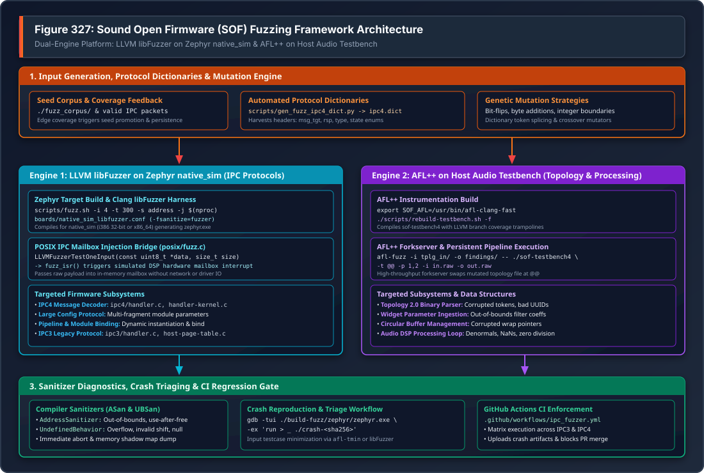
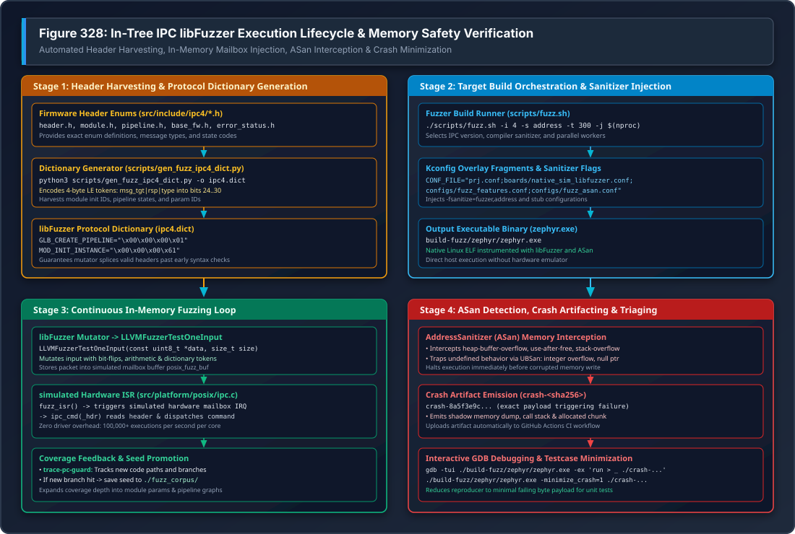

.. _fuzzing-components:
.. _sof_fuzzing:

Firmware Fuzzing Architecture & Protocol Security Guide
#######################################################

.. contents::
   :local:
   :depth: 3

Sound Open Firmware (SOF) incorporates automated coverage-guided fuzzing
across its firmware architecture to proactively detect memory corruption,
protocol parsing vulnerabilities, buffer overflows, and undefined behavior.

Because DSP firmware processes untrusted binary payloads delivered from the
host operating system kernel and user space (including Inter-Processor
Communication mailboxes, dynamic runtime configuration blobs, and ALSA
Topology 2.0 graphs), robust memory safety is critical. SOF deploys a
dual-engine fuzzing framework combining in-tree **LLVM libFuzzer** on the
Zephyr ``native_sim`` target with **AFL++** on the host audio pipeline
simulation testbench (:ref:`testbench`).

.. toctree::
   :maxdepth: 1

   testbench_afl_fuzzing

---

Overview & Threat Modeling in Embedded Audio DSPs
*************************************************

In modern audio subsystems, the Digital Signal Processor (DSP) acts as an
isolated compute coprocessor receiving real-time commands from the host
application processor.

Trust Boundaries & Attack Surfaces
==================================

.. list-table:: SOF Firmware Attack Surfaces & Fuzzing Targets
   :widths: 24 38 38
   :header-rows: 1

   * - Attack Surface
     - Firmware Subsystem & Parser
     - Security Risk & Failure Modes
   * - **IPC Message Decoders**
     - ``src/ipc/ipc4/handler.c``, ``ipc3/handler.c``
     - Malformed headers, invalid message targets, payload length spoofing,
       out-of-bounds buffer writes.
   * - **Runtime Parameter Blobs**
     - ``comp_data_blob_handler()``, Large Config Set
     - Fragmented multi-packet payload reassembly overflows, corrupted
       module parameters.
   * - **Topology 2.0 Parsers**
     - Topology manifest parser, widget graphs
     - Malformed token arrays, cyclical pipeline routing, corrupted UUIDs,
       memory exhaustion.
   * - **Audio DSP Algorithms**
     - Volume, DRC, EQ, SRC, RTNR inner loops
     - Denormal numbers, NaNs, floating-point exceptions, divide-by-zero,
       unaligned SIMD vector access.

Memory Safety Challenges in DSP Firmware
========================================

Unlike desktop operating systems equipped with virtual memory paging and
Memory Management Units (MMUs), many embedded DSP architectures operate in flat
physical memory without fine-grained memory protection. A buffer overflow or
corrupted pointer in a single audio processing component can overwrite adjacent
ring buffers, corrupt interrupt vector tables, or hang the DSP core, requiring
a full system hardware power-cycle.

SOF addresses this challenge by compiling firmware components natively for
POSIX user space targets instrumented with **AddressSanitizer (ASan)** and
**UndefinedBehaviorSanitizer (UBSan)**, exposing micro-architectural memory
flaws within milliseconds during fuzzing.

---

SOF Fuzzing Framework Architecture
**********************************

The SOF fuzzing architecture separates input generation, protocol dictionary
synthesis, execution sandboxing, and crash triage into modular tiers.

.. _fuzzing_architecture_overview:

   Figure 327: Sound Open Firmware (SOF) Fuzzing Framework Architecture

Architectural Tiers Breakdown
==============================

The framework illustrated in :numref:`fuzzing_architecture_overview` is
organized into four operational tiers:

1. **Input Generation, Protocol Dictionaries & Mutation Engine**:
   Maintains a corpus of valid seeds (``./fuzz_corpus/``) and uses coverage
   feedback to promote inputs exploring new execution branches. Automated
   dictionary generators (``scripts/gen_fuzz_ipc4_dict.py`` and
   ``scripts/gen_fuzz_ipc3_dict.py``) harvest protocol enums directly from
   firmware headers, allowing mutators to splice valid 4-byte message headers
   and bypass superficial syntax validation.

2. **Dual Fuzzing Execution Engines**:

   * **Engine 1 (LLVM libFuzzer on Zephyr native_sim)**: Focuses on the
     firmware IPC protocol stack. Runs natively as an instrumented POSIX
     executable (``zephyr.exe``). The test harness passes mutated buffers
     directly to an in-memory simulated hardware mailbox interrupt
     (``fuzz_isr()``), executing over **100,000 fuzz iterations per second**
     per CPU core without hardware driver or kernel context switch overhead.
   * **Engine 2 (AFL++ on Host Audio Testbench)**: Focuses on audio pipeline
     topologies and signal processing routines. Uses AFL++ forkserver
     snapshots to feed mutated Topology 2.0 binaries and raw PCM audio streams
     into ``sof-testbench4``.

3. **Compiler Sanitizers & Runtime Monitors**:
   All fuzzing targets are compiled with Clang sanitizers:

   * **AddressSanitizer (ASan)**: Instruments all memory allocations with
     shadow memory, catching out-of-bounds buffer accesses, use-after-free, and
     stack corruption at the exact instruction of occurrence.
   * **UndefinedBehaviorSanitizer (UBSan)**: Traps signed integer overflow,
     invalid bitwise shifts, null pointer dereferences, and division by zero.
   * **Sanitizer Coverage (``trace-pc-guard``)**: Tracks control flow edges
     and feeds branch discovery metrics back to the mutator.

4. **Sanitizer Diagnostics, Crash Triaging & CI Enforcement**:
   When a bug is detected, the fuzzer halts immediately, writes a standalone
   crash reproducer file (``crash-<sha256>``), and emits an ASan stack trace.
   Automated GitHub Actions workflows run continuous fuzzing on pull requests,
   blocking code merges upon sanitizer failure.

---

Engine 1: In-Tree libFuzzer on Zephyr native_sim
************************************************

Engine 1 represents SOF's primary protocol fuzzer, directly testing firmware
IPC message handlers and state machines within an in-memory Zephyr POSIX
sandbox.

.. _ipc_libfuzzer_lifecycle:

   Figure 328: In-Tree IPC libFuzzer Execution Lifecycle & Memory Safety Verification

Lifecycle & Execution Mechanics
===============================

As detailed in :numref:`ipc_libfuzzer_lifecycle`, the execution lifecycle
proceeds through four distinct stages:

Stage 1: Pre-Build Header Harvesting & Dictionary Generation
------------------------------------------------------------

Fuzzing highly structured protocols like IPC4 from scratch with random
bit-flips is inefficient because the parser rejects 99.99% of inputs at the
header check. To solve this, SOF uses ``scripts/gen_fuzz_ipc4_dict.py`` to
harvest constants directly from ``src/include/ipc4/*.h``:

.. code-block:: bash

   # Generate IPC4 dictionary from in-tree headers
   python3 scripts/gen_fuzz_ipc4_dict.py -o ipc4.dict

The script parses C enum declarations and encodes 4-byte little-endian tokens:

* **Global Primary Message Headers** (``global_pri``): Encodes message type
  into bits 24..28 with ``msg_tgt=0`` and ``rsp=0`` (e.g.
  ``GLB_CREATE_PIPELINE``, ``GLB_DELETE_PIPELINE``, ``GLB_SET_PIPELINE_STATE``).
* **Module Primary Message Headers** (``module_pri``): Encodes module message
  type with ``msg_tgt=1`` (e.g. ``MOD_INIT_INSTANCE``, ``MOD_BIND``,
  ``MOD_SET_LARGE_CONFIG``).
* **32-Bit Parameter Identifiers** (``u32``): Encodes pipeline states,
  notification types, and large configuration IDs.

Stage 2: Target Build Orchestration & Sanitizer Injection
---------------------------------------------------------

The runner script ``scripts/fuzz.sh`` builds the firmware application using
Zephyr's ``native_sim`` target (32-bit i386 or 64-bit x86_64) using host Clang:

.. code-block:: bash

   # Build and fuzz IPC4 for 300 seconds with AddressSanitizer
   ./scripts/fuzz.sh -i 4 -s address -t 300 -j $(nproc) -d ipc4.dict

Under the hood, ``fuzz.sh`` passes specialized Kconfig overlay fragments to
``west build``:

* ``boards/native_sim_libfuzzer.conf``: Enables ``CONFIG_LIBFUZZER=y`` and
  compiler fuzzer instrumentation flags.
* ``configs/fuzz_features.conf``: Stubs out hardware peripherals, timers, and
  external DMA drivers.
* ``configs/fuzz_IPC4_features.conf``: Selects ``CONFIG_IPC_MAJOR_4=y`` and
  enables IPC4 message gateway decoders.
* ``configs/fuzz_asan.conf``: Injects ``-fsanitize=address`` and AddressSanitizer
  memory limits.

Stage 3: Continuous In-Memory Fuzzing Loop
------------------------------------------

Once built, ``build-fuzz/zephyr/zephyr.exe`` executes. For every testcase,
libFuzzer invokes the standard entry point defined in
``src/platform/posix/fuzz.c``:

.. code-block:: c
   :caption: src/platform/posix/fuzz.c

   int LLVMFuzzerTestOneInput(const uint8_t *data, size_t size)
   {
       // Store fuzzer candidate input into simulated mailbox buffer
       posix_fuzz_buf = data;
       posix_fuzz_sz = size;

       // Trigger the simulated hardware mailbox interrupt in Zephyr POSIX arch
       posix_fuzz_case_begin();
       posix_fuzz_irq_raise();

       // Let Zephyr scheduler run ISR and process IPC command
       while (posix_fuzz_case_pending()) {
           k_yield();
       }

       return 0;
   }

In ``src/platform/posix/ipc.c``, the simulated interrupt service routine
(``fuzz_isr``) receives the buffer and dispatches it directly into the firmware
IPC subsystem:

.. code-block:: c
   :caption: src/platform/posix/ipc.c

   static void fuzz_isr(const void *arg)
   {
       struct ipc_cmd_hdr *hdr = (struct ipc_cmd_hdr *)posix_fuzz_buf;

       // Pass raw fuzzing bytes directly to standard firmware IPC dispatcher
       ipc_cmd(hdr);

       posix_fuzz_case_abort();
   }

This architecture achieves maximum execution velocity because each testcase is
processed completely in-memory without inter-process communication, file I/O,
or virtualization overhead.

Stage 4: ASan Detection, Crash Artifacting & Debugging
------------------------------------------------------

When an input triggers an out-of-bounds access or assertion failure:

1. AddressSanitizer halts the process instantly, preventing memory corruption
   from cascading.
2. libFuzzer writes the failing payload to a local artifact file named
   ``crash-<sha256>`` (e.g. ``crash-8a5f3e9c70b4...``).
3. The crash stack trace and shadow memory state are output to stderr.

---

Engine 2: AFL++ on Host Audio Pipeline Testbench
************************************************

While Engine 1 targets protocol message parsing, Engine 2 targets audio
topology binary parsers, widget lifecycle hooks, and audio DSP processing loops
using **AFL++** and the host audio pipeline testbench (:ref:`testbench`).

Building the Instrumented Testbench
===================================

The testbench build system supports automated fuzzer compiler injection via
the ``-f`` flag in ``scripts/rebuild-testbench.sh``:

.. code-block:: bash

   # Specify AFL++ compiler wrapper
   export SOF_AFL=/usr/bin/afl-clang-fast

   # Rebuild testbench with AFL branch coverage instrumentation
   ./scripts/rebuild-testbench.sh -f

This compiles ``sof-testbench4`` with compile-time edge coverage hooks and an
optimized forkserver.

Fuzzing Topology 2.0 Manifests
==============================

To fuzz the ALSA Topology 2.0 parser, construct a seed corpus containing valid
pre-compiled topology binaries (e.g. from
``tools/topology/topology2/development/``):

.. code-block:: bash

   # Create input seed corpus and output findings directory
   mkdir -p fuzz_in fuzz_out
   cp tools/topology/topology2/development/*.tplg fuzz_in/

   # Launch AFL++ fuzzer targeting topology parser
   afl-fuzz -i fuzz_in/ -o fuzz_out/ \
       -- tools/testbench/build_testbench/install/bin/sof-testbench4 \
       -t @@ -p 1,2 -i tools/testbench/test_48k_stereo.raw -o /dev/null

AFL replaces the ``@@`` token with mutated topology binaries. The forkserver
executes the testbench, validating that invalid tokens, negative buffer sizes,
and cyclical pipeline connection graphs are handled gracefully without memory
corruption.

---

Compiler Sanitizers & Configuration Matrix
******************************************

SOF uses modular Kconfig fragments under ``app/configs/`` to configure compiler
sanitizers and feature stubs:

.. list-table:: SOF Fuzzing Kconfig Configuration Matrix
   :widths: 28 32 40
   :header-rows: 1

   * - Configuration File
     - Key Kconfig Options
     - Target Focus & Scope
   * - ``boards/native_sim_libfuzzer.conf``
     - ``CONFIG_LIBFUZZER=y``, ``CONFIG_HAS_COVERAGE=y``
     - Enables LLVM libFuzzer runtime on Zephyr ``native_sim``.
   * - ``configs/fuzz_asan.conf``
     - ``CONFIG_ASAN=y``, ``-fsanitize=address``
     - AddressSanitizer: heap/stack overflows, use-after-free.
   * - ``configs/fuzz_ubsan.conf``
     - ``CONFIG_UBSAN=y``, ``-fsanitize=undefined``
     - UndefinedBehaviorSanitizer: integer overflow, divide-by-zero.
   * - ``configs/fuzz_coverage.conf``
     - ``CONFIG_COVERAGE=y``, ``-fsanitize-coverage=...``
     - Generates branch coverage data for corpus optimization.
   * - ``configs/fuzz_features.conf``
     - ``CONFIG_STUB=y``, hardware stubs
     - Disables hardware timers, physical DMA, and DSP IRQ controllers.
   * - ``configs/fuzz_IPC4_features.conf``
     - ``CONFIG_IPC_MAJOR_4=y``
     - Compiles IPC4 message handlers and Large Config Set protocols.
   * - ``configs/fuzz_IPC3_features.conf``
     - ``CONFIG_IPC_MAJOR_3=y``
     - Compiles legacy IPC3 message handlers and host page table logic.

---

Continuous Integration & GitHub Actions Enforcement
***************************************************

SOF enforces continuous fuzzing in GitHub Actions through
``.github/workflows/ipc_fuzzer.yml``.

Workflow Pipeline Operation
===========================

The automated CI workflow executes on every pull request and scheduled nightly
builds:

1. **Environment Provisioning**: Provisions an Ubuntu runner and installs the
   ``i386`` multiarch architecture libraries (``libasan8:i386``,
   ``libubsan1:i386``, ``libc6-dev:i386``) alongside Clang and LLVM.
2. **Matrix Execution**: Spawns parallel jobs across IPC matrix configurations:

   * Matrix Job 1: ``IPC: 3`` (IPC3 Protocol Fuzzer)
   * Matrix Job 2: ``IPC: 4`` (IPC4 Protocol Fuzzer)

3. **Dynamic Dictionary Harvesting**: Executes ``gen_fuzz_ipc3_dict.py`` and
   ``gen_fuzz_ipc4_dict.py`` against the current PR branch headers to ensure the
   dictionary reflects any modified enums or added message types.
4. **Fuzz Execution**: Runs ``scripts/fuzz.sh`` for a minimum of 300 seconds
   (5 minutes) per matrix job across all available CPU cores.
5. **Artifact Upload & PR Gating**: If an AddressSanitizer failure occurs, the
   runner captures the ``crash-*`` reproducer files and stdout logs as CI
   artifacts and marks the pull request check as **FAILED**.

---

Crash Triaging, Minimization & Reproduction Runbook
***************************************************

When the fuzzer encounters a bug, follow this systematic runbook to minimize the
testcase, isolate the root cause, and author a regression test.

Step 1: Reproducing the Crash under GDB
=======================================

Launch the instrumented Zephyr executable inside GDB, feeding the crash artifact
as input:

.. code-block:: bash

   # Launch GDB with text user interface (TUI)
   gdb -tui ./build-fuzz/zephyr/zephyr.exe

   # Inside GDB: execute with crash payload
   (gdb) run > _ ./crash-8a5f3e9c70b4a1...

   # Inspect call stack upon AddressSanitizer SIGABRT
   (gdb) backtrace

Step 2: Testcase Minimization
=============================

Fuzzers often produce crash inputs containing hundreds of extraneous bytes
unrelated to the failure. Minimize the payload to its smallest reproducible
size:

Using libFuzzer:
----------------

.. code-block:: bash

   ./build-fuzz/zephyr/zephyr.exe -minimize_crash=1 -max_total_time=60 \
       ./crash-8a5f3e9c70b4a1... -exact_artifact_path=minimized_crash.bin

Using AFL++:
------------

.. code-block:: bash

   afl-tmin -i findings/crashes/id:000000,... -o minimized_tplg.bin \
       -- tools/testbench/build_testbench/install/bin/sof-testbench4 -t @@

Step 3: Authoring a Regression Unit Test
========================================

Convert the minimized crash payload into a permanent regression test within the
Zephyr Ztest framework (:ref:`unit_tests`):

.. code-block:: c
   :caption: test/ztest/src/ipc/ipc_regression_test.c

   #include <zephyr/ztest.h>
   #include <sof/ipc/handler.h>

   ZTEST(ipc_security, test_cve_reproducer_regression)
   {
       // Minimized failing byte payload harvested from fuzzer crash
       static const uint8_t malformed_ipc_payload[] = {
           0x00, 0x00, 0x00, 0x61, 0xFF, 0xFF, 0x00, 0x00,
           0x12, 0x34, 0x56, 0x78, 0x00, 0x00, 0x00, 0x00
       };

       struct ipc_cmd_hdr *hdr = (struct ipc_cmd_hdr *)malformed_ipc_payload;

       // The message handler must return an error code rather than crashing
       int ret = ipc_cmd(hdr);
       zassert_not_equal(ret, 0, "IPC handler must reject malformed payload");
   }

---

Systematic Troubleshooting & Diagnostics
****************************************

.. list-table:: Systematic Troubleshooting for SOF Fuzzing Framework
   :widths: 26 34 40
   :header-rows: 1

   * - Error Symptom
     - Underlying Root Cause
     - Remediation Procedure
   * - ``AddressSanitizer: heap-buffer-overflow``
     - An IPC parser read or wrote beyond the allocated boundary of a message
       buffer or parameter struct.
     - Inspect the reported byte offset and buffer allocation size in the ASan
       report. Enforce bounds checking using ``MAX(size, sizeof(expected))``.
   * - ``AddressSanitizer: SEGV on unknown address 0x0``
     - Null pointer dereference in IPC command dispatcher (e.g. accessing an
       unallocated component or uninitialized pipeline pointer).
     - Add explicit null checks on component lookup: ``if (!comp) return
       -EINVAL;`` before dereferencing struct fields.
   * - ``cannot find -lasan8:i386``
     - The host system lacks 32-bit AddressSanitizer runtime multiarch
       libraries required for the 32-bit ``native_sim`` target.
     - Install 32-bit multiarch libraries: ``sudo dpkg --add-architecture
       i386 && sudo apt-get update && sudo apt-get install libasan8:i386
       libc6-dev-i386``. Alternatively, run with 64-bit target:
       ``./scripts/fuzz.sh -a x86_64``.
   * - ``Dictionary warning: enum tag not found``
     - A header file under ``src/include/ipc4/`` was renamed or an enum was
       modified to use non-literal initializers.
     - Check the enum definition in the source header. Ensure all entries use
       explicit integer literals so ``gen_fuzz_ipc4_dict.py`` can parse them.
   * - ``Fuzzer hangs indefinitely without progress``
     - Target code entered an infinite loop or wait condition without yielding
       to the simulated scheduler.
     - Set execution timeout per input: ``-timeout=2`` (libFuzzer) or ``-t 1000``
       (AFL++). Inspect loops for missing termination counters.