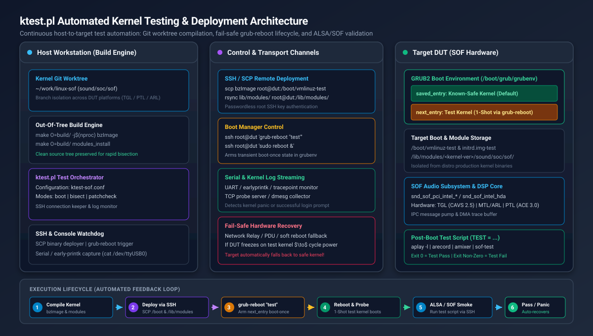
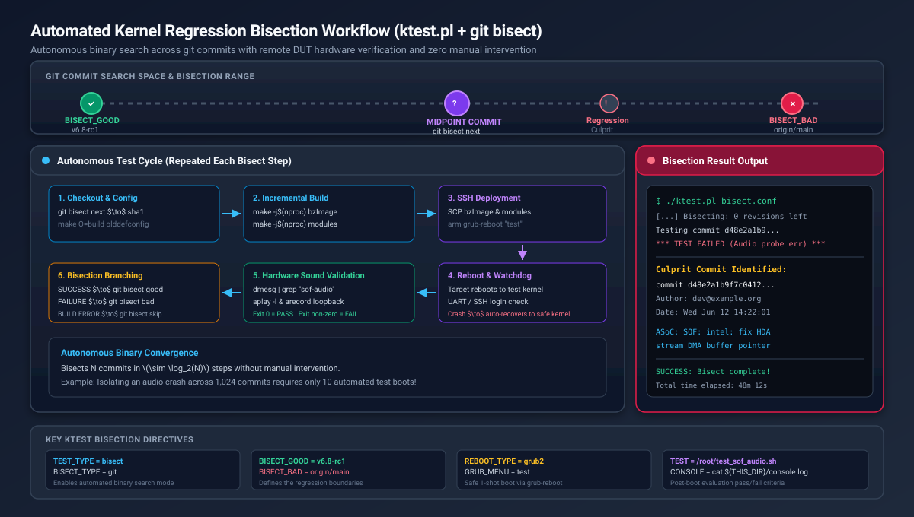

.. _setup-ktest-environment:

Automated Kernel Testing and Bisection with ktest
#################################################

.. contents::
   :local:
   :depth: 3

Overview and Motivation
***********************

Developing Linux kernel drivers for Sound Open Firmware (SOF)—including the
core ALSA SoC infrastructure (``sound/soc/sof/``), platform glue layers, DSP IPC
message pumps, and hardware DAI interfaces—requires frequent testing on real
silicon target hardware (Devices Under Test, or DUTs).

Iterating manually on target hardware (compiling locally, copying modules over
the network, updating bootloaders, manually rebooting, and testing audio
streams) is slow, repetitive, and dangerous: a kernel panic or driver deadlock
can leave the target in an unbootable state requiring physical power button or
reflash recovery.

The upstream Linux kernel provides a powerful, native test automation framework
called **ktest** (located at ``tools/testing/ktest/ktest.pl`` in the kernel
source tree). Combined with Git worktrees, fail-safe bootloader management, and
automated test scripts, ``ktest.pl`` delivers an end-to-end continuous validation
environment for SOF developers.

Key Capabilities for SOF Development
====================================

* **Automated Build and Deployment**: Automatically compiles the kernel image
  (``bzImage``) and kernel modules, transfers binaries to the remote DUT over
  SSH or NFS, updates the target's initramfs, and triggers a clean system reboot.
* **Fail-Safe "Boot-Once" Protection**: Leverages GRUB2 ``grub-reboot`` or Boot
  Loader Specification (BLS) one-shot booting. The DUT attempts to boot the new
  test kernel *exactly once*. If the test kernel crashes, hangs, or panics, the
  hardware watchdog or a subsequent power cycle automatically boots the system
  back into a verified, stable reference kernel.
* **Autonomous Regression Bisection (`git bisect`)**: Identifies the exact git
  commit that introduced a kernel panic, driver probe regression, or audio
  stream underflow across hundreds of commits overnight with zero manual
  intervention.
* **Multi-DUT and Multi-Branch Worktrees**: By combining ``ktest.pl`` with Git
  worktrees, developers can drive multiple hardware platforms (e.g. Tiger Lake,
  Panther Lake, Arrow Lake, or generic development laptops) concurrently from a
  single host workstation without repository conflicts.

.. _ktest-architecture:

System Architecture
*******************

The ``ktest.pl`` automated testing architecture decouples the host workstation
(which handles computationally intensive compilation and git orchestration) from
the target DUT (which executes the compiled kernel and exercises audio DSP
hardware).

   ktest.pl Automated Testing and Deployment Architecture

Architecture Components
=======================

1. **Host Workstation (Build Engine)**:

   * **Kernel Source & Git Worktrees**: Maintains clean kernel working trees
     (e.g. ``~/work/linux-sof``) and dedicated out-of-tree build directories
     (``make O=build/``).
   * **ktest Orchestrator (``ktest.pl``)**: Reads target-specific configuration
     files (``sof-ktest.conf``), manages the testing lifecycle, monitors
     consoles, and coordinates git bisection steps.
   * **Console & Network Watchdog**: Streams serial UART logs or SSH session
     transcripts to monitor early kernel boot, driver probe logs, and panic
     dumps.

2. **Transport & Control Link**:

   * **SSH / SCP**: Transfers compiled kernel images, module archives, and
     initiates bootloader commands without interactive passwords.
   * **Serial Console / UART**: Connects to the target serial port (e.g. via
     ``/dev/ttyUSB0``) to capture early printk and DSP traceDMA outputs even if
     the network stack fails to initialize.
   * **Hardware Power Cycle / Relays**: Network-controlled relays or smart PDUs
     allow ``ktest.pl`` to hard-cycle target power automatically when a kernel
     hangs completely.

3. **Target Device Under Test (DUT)**:

   * **GRUB2 Boot Environment**: Maintains a dual-kernel environment in
     ``/boot/grub/grubenv`` consisting of a permanent, known-safe reference
     kernel (``saved_entry``) and a transient test kernel (``next_entry``).
   * **Isolated Kernel Binaries**: Test kernels reside in ``/boot/vmlinuz-test``
     and ``/boot/initrd.img-test``, preventing corruption of the system's
     production distribution kernel.
   * **Audio DSP Hardware**: Exercises Intel CAVS / ACE audio DSP hardware,
     SoundWire links, and HDA/I2S codecs through the SOF Linux driver stack.
   * **Automated Audio Test Script**: A target-side test harness executed via
     SSH that verifies driver initialization, ALSA sound card enumeration, and
     PCM audio playback/capture.

.. _ktest-target-setup:

Target Device Setup
*******************

Follow these steps to configure a target hardware platform (e.g. an Ubuntu,
Debian, or Fedora development machine or DUT) for automated testing over SSH.

Step 1: Configure Passwordless SSH Access
=========================================

``ktest.pl`` requires root SSH access to deploy kernel images, install modules,
and execute bootloader commands. For security, configure key-based
authentication and disable interactive password logins for root.

1. On your host development machine, generate a dedicated SSH keypair for ktest:

   .. code-block:: bash

      ssh-keygen -t ed25519 -f ~/.ssh/id_ktest -C "ktest-automation"

2. Copy the public key to the target DUT:

   .. code-block:: bash

      ssh-copy-id -i ~/.ssh/id_ktest.pub root@<target-ip>

3. Test the passwordless connection from your host:

   .. code-block:: bash

      ssh -i ~/.ssh/id_ktest root@<target-ip> "uname -a"

4. Configure your host's ``~/.ssh/config`` to simplify invocation and set
   mandatory connection timeouts:

   .. code-block:: text

      Host ktest-dut
          HostName <target-ip>
          User root
          IdentityFile ~/.ssh/id_ktest
          ConnectTimeout 5
          ServerAliveInterval 15
          ServerAliveCountMax 3
          StrictHostKeyChecking accept-new

5. On the target DUT, configure the SSH daemon to enforce key-only authentication
   by setting ``PermitRootLogin prohibit-password`` in ``/etc/ssh/sshd_config``:

   .. code-block:: bash

      sudo sed -i 's/^#\?PermitRootLogin .*/PermitRootLogin prohibit-password/' /etc/ssh/sshd_config
      sudo systemctl restart ssh || sudo systemctl restart sshd

Step 2: Establish the Dual-Kernel Framework
===========================================

To guarantee that a broken test kernel never bricks the target DUT, create a
permanent copy of your current, known-working kernel as the "safe" kernel, and
create a separate "test" placeholder kernel.

On the target DUT (Ubuntu / Debian):

.. code-block:: bash

   # Verify the running known-good kernel
   CURRENT_KERN=$(uname -r)
   echo "Current safe kernel: ${CURRENT_KERN}"

   # Create the permanent test kernel placeholders
   sudo cp /boot/vmlinuz-${CURRENT_KERN} /boot/vmlinuz-test
   sudo cp /boot/initrd.img-${CURRENT_KERN} /boot/initrd.img-test

On Fedora / RHEL / BLS systems:

.. code-block:: bash

   CURRENT_KERN=$(uname -r)
   sudo cp /boot/vmlinuz-${CURRENT_KERN} /boot/vmlinuz-test
   sudo cp /boot/initramfs-${CURRENT_KERN}.img /boot/initramfs-test.img
   sudo grubby --add-kernel /boot/vmlinuz-test --initrd=/boot/initramfs-test.img --title="test"

Step 3: Configure GRUB2 for One-Shot Booting
============================================

By default, GRUB boots whichever kernel is marked as default. For automated
testing, GRUB must be configured with:

1. ``GRUB_DEFAULT=saved``: Boot the kernel stored in ``/boot/grub/grubenv``.
2. ``GRUB_SAVEDEFAULT=false``: Do not permanently change the default entry when
   a kernel boots.
3. ``GRUB_DISABLE_SUBMENU=y``: Flatten all menu entries into a single list so
   entry indexes remain stable and predictable.

On Ubuntu / Debian:

1. Create a dedicated configuration snippet in ``/etc/default/grub.d/ktest.cfg``:

   .. code-block:: bash

      sudo tee /etc/default/grub.d/ktest.cfg << 'EOF'
      GRUB_DEFAULT=saved
      GRUB_SAVEDEFAULT=false
      GRUB_DISABLE_SUBMENU=y
      EOF

2. Re-generate the GRUB configuration:

   .. code-block:: bash

      sudo update-grub

3. Identify the menu index of your known-safe baseline kernel:

   .. code-block:: bash

      awk -F"'" '/menuentry / {print i++, $2}' /boot/grub/grub.cfg

   Example output:

   .. code-block:: text

      0 Ubuntu, with Linux 6.8.0-40-generic
      1 Ubuntu, with Linux test
      2 Ubuntu, with Linux 6.5.0-28-generic

4. Set your stable distribution kernel as the permanent default (for example, index ``0``):

   .. code-block:: bash

      sudo grub-set-default 0

5. Verify the GRUB environment file:

   .. code-block:: bash

      grub-editenv list

   The output should show:

   .. code-block:: text

      saved_entry=0

Understanding the Fail-Safe One-Shot Lifecycle
----------------------------------------------

The one-shot boot mechanism works through ``grub-reboot``:

1. When ``ktest.pl`` finishes deploying a new test kernel, it executes
   ``grub-reboot "test"`` (or passes the numerical menu entry index of ``test``).
2. ``grub-reboot`` writes ``next_entry=test`` into ``/boot/grub/grubenv``.
3. On reboot, GRUB reads ``grubenv``, sees ``next_entry=test``, deletes the
   ``next_entry`` setting from the environment, and boots the test kernel.
4. If the test kernel boots successfully, ``ktest.pl`` executes the audio test
   suite.
5. If the test kernel crashes, deadlocks, or panics, the host power cycle
   reboots the target. Because ``next_entry`` was already cleared, GRUB falls
   back to ``saved_entry`` (the known-safe kernel). The system recovers
   automatically without manual intervention!

You can test this behavior manually on the target:

.. code-block:: bash

   # Arm one-shot boot into the test kernel
   sudo grub-reboot "Ubuntu, with Linux test"

   # Inspect grubenv: next_entry is now primed
   grub-editenv list
   # Output:
   # saved_entry=0
   # next_entry=Ubuntu, with Linux test

   # Reboot into the test kernel
   sudo reboot

   # After boot, verify uname -r reports 'test', and grubenv has cleared next_entry:
   uname -r
   grub-editenv list
   # Output:
   # saved_entry=0

.. _ktest-host-setup:

Host Environment and Git Worktrees
**********************************

To keep your main development repository clean and avoid build collisions when
testing multiple platforms or running bisection, use `Git worktrees <https://git-scm.com/docs/git-worktree>`_.

Step 1: Create an Isolated Worktree
===================================

From your main Linux kernel repository, create a dedicated worktree and build
directory:

.. code-block:: bash

   cd ~/work/linux
   git fetch origin

   # Create a dedicated branch and worktree for ktest
   git worktree add -b ktest-sof-tgl ~/work/linux-ktest-tgl origin/main

   # Create a dedicated directory for ktest operational files
   mkdir -p ~/work/sof-ktest-run
   cd ~/work/sof-ktest-run

   # Copy the upstream ktest.pl script from the kernel tree
   cp ~/work/linux-ktest-tgl/tools/testing/ktest/ktest.pl .
   chmod +x ktest.pl

Step 2: Prepare the Baseline Kernel Configuration
=================================================

``ktest.pl`` requires an out-of-tree build directory to keep the source tree
pristine. Prepare a baseline `.config` containing all required SOF options:

.. code-block:: bash

   # Create out-of-tree build directory
   mkdir -p ~/work/sof-ktest-run/build-tgl

   cd ~/work/linux-ktest-tgl
   # Generate base configuration
   make O=~/work/sof-ktest-run/build-tgl defconfig

   # Merge required SOF kernel options
   ./scripts/config --file ~/work/sof-ktest-run/build-tgl/.config \
       --enable CONFIG_SOUND \
       --enable CONFIG_SND \
       --enable CONFIG_SND_SOC \
       --enable CONFIG_SND_SOC_SOF_TOPLEVEL \
       --enable CONFIG_SND_SOC_SOF_PCI \
       --enable CONFIG_SND_SOC_SOF_INTEL_TOPLEVEL \
       --enable CONFIG_SND_SOC_SOF_INTEL_HDA_COMMON \
       --enable CONFIG_SND_SOC_SOF_HDA \
       --enable CONFIG_SND_SOC_SOF_PROBES \
       --enable CONFIG_SND_SOC_SOF_DEVELOPER_SUPPORT \
       --enable CONFIG_SND_SOC_SOF_DEBUG_PROBES

   make O=~/work/sof-ktest-run/build-tgl olddefconfig

   # Save this configuration as the reference baseline
   cp ~/work/sof-ktest-run/build-tgl/.config ~/work/sof-ktest-run/sof-dev-defconfig

.. _ktest-config:

Production ktest Configuration
******************************

Save the following configuration as ``~/work/sof-ktest-run/sof-ktest.conf``.
This file contains the complete, production-grade configuration for building,
deploying, and validating SOF kernels on a GRUB2 target DUT.

.. code-block:: ini

   # ==============================================================================
   # ktest.pl Production Configuration for Sound Open Firmware (SOF)
   # ==============================================================================

   # ------------------------------------------------------------------------------
   # 1. Target Machine and Network Credentials
   # ------------------------------------------------------------------------------
   MACHINE = ktest-dut
   SSH_USER = root
   CLEAR_LOG = 1

   # ------------------------------------------------------------------------------
   # 2. Host Build and Path Variables
   # ------------------------------------------------------------------------------
   THIS_DIR := ${PWD}
   BUILD_DIR = ${HOME}/work/linux-ktest
   OUTPUT_DIR = ${THIS_DIR}/build-tgl
   LOG_FILE = ${OUTPUT_DIR}/ktest-execution.log

   # Build targets and compiler options
   BUILD_TARGET = arch/x86/boot/bzImage
   BUILD_OPTIONS = -j16

   # ------------------------------------------------------------------------------
   # 3. Kernel Versioning and Target Image Path
   # ------------------------------------------------------------------------------
   # Use a constant 'test' localversion suffix to map directly to /boot/vmlinuz-test
   LOCALVERSION = test
   TARGET_IMAGE = /boot/vmlinuz-${LOCALVERSION}

   # ------------------------------------------------------------------------------
   # 4. Bootloader Configuration (GRUB2 Boot-Once)
   # ------------------------------------------------------------------------------
   REBOOT_TYPE = grub2
   GRUB_FILE = /boot/grub/grub.cfg
   GRUB_MENU = Ubuntu, with Linux test
   GRUB_REBOOT = grub-reboot

   # ------------------------------------------------------------------------------
   # 5. Remote Reboot and Power Cycle Hooks
   # ------------------------------------------------------------------------------
   # Wrap reboot commands with timeout to prevent hanging the host script
   REBOOT = timeout 15 ssh -o ConnectTimeout=5 $SSH_USER@$MACHINE 'sudo reboot > /dev/null 2>&1 &'

   # Power-cycle fallback if DUT freezes or panics (e.g. via lab network relay)
   POWER_CYCLE = echo "r2 toggle" | nc 127.0.0.1 8081; sleep 10

   # Serial console capture (optional: stream serial UART logs into a FIFO)
   CONSOLE = cat ${THIS_DIR}/console.fifo

   # ------------------------------------------------------------------------------
   # 6. Post-Install Hook: Initramfs Generation & Module Deployment
   # ------------------------------------------------------------------------------
   # ktest automatically runs 'make modules_install' to a temporary staging path,
   # transfers modules to /lib/modules/$KERNEL_VERSION on the DUT, and then calls POST_INSTALL.
   # Re-generate the test initramfs with the newly installed modules:
   POST_INSTALL = ssh $SSH_USER@$MACHINE "mkinitramfs -o /boot/initrd.img-${LOCALVERSION} ${KERNEL_VERSION}"

   # ------------------------------------------------------------------------------
   # 7. Test Definition and Validation Suite
   # ------------------------------------------------------------------------------
   TEST_START
   TEST_TYPE = test
   BUILD_TYPE = useconfig:${THIS_DIR}/sof-dev-defconfig
   BUILD_NOCLEAN = 1

   # Execute the automated SOF audio test script on the target
   TEST = timeout 60 ssh -o ConnectTimeout=5 $SSH_USER@$MACHINE '/root/test_sof_audio.sh'

Configuration Directives Reference
==================================

The table below explains the key directives used in ``sof-ktest.conf``:

.. list-table::
   :widths: 25 20 55
   :header-rows: 1

   * - Directive
     - Type
     - Description
   * - ``MACHINE``
     - Hostname/IP
     - Network address or ``~/.ssh/config`` host alias of the target DUT.
   * - ``BUILD_DIR``
     - Directory path
     - Root directory of the kernel Git source tree (worktree).
   * - ``OUTPUT_DIR``
     - Directory path
     - Out-of-tree compilation output directory (``make O=...``).
   * - ``LOCALVERSION``
     - String
     - Suffix appended to the kernel release version. Using ``test`` keeps
       target filenames predictable (``/boot/vmlinuz-test``).
   * - ``TARGET_IMAGE``
     - File path
     - Absolute destination path on the target for the compiled kernel image.
   * - ``REBOOT_TYPE``
     - Identifier
     - Bootloader control method. Set to ``grub2`` for modern GRUB2 systems.
   * - ``GRUB_MENU``
     - String / Index
     - Exact title or zero-based index of the test kernel entry in ``grub.cfg``.
   * - ``POST_INSTALL``
     - Command
     - Command executed on the target after module transfer (typically generates
       the test initramfs).
   * - ``TEST``
     - Command
     - Validation command or script executed after the target reboots. Exit
       code ``0`` denotes success; any non-zero exit code denotes failure.

.. _ktest-audio-verification:

Automated Audio Verification Test Script
****************************************

For ``ktest.pl`` to determine whether a kernel passed or failed, you must
provide a test script that validates the audio subsystem and returns ``0`` on
success or non-zero on failure.

Deploy the following script to ``/root/test_sof_audio.sh`` on your target DUT
(and make it executable with ``chmod +x /root/test_sof_audio.sh``):

.. code-block:: bash

   #!/usr/bin/env bash
   # ==============================================================================
   # SOF Kernel Automated Audio Smoke Test for ktest.pl
   # Returns 0 on PASS, 1 on FAIL
   # ==============================================================================
   set -euo pipefail

   echo "=== [1/5] Checking Kernel and System Status ==="
   uname -a
   uptime

   echo "=== [2/5] Verifying SOF DSP Firmware Initialization ==="
   # Search dmesg for successful firmware boot signature
   if ! dmesg | grep -iE "SOF: (firmware boot complete|FW loaded successfully)"; then
       echo "ERROR: SOF DSP firmware failed to boot or register!"
       dmesg | tail -n 50
       exit 1
   fi
   echo "SUCCESS: SOF firmware boot verified."

   echo "=== [3/5] Verifying ALSA Sound Card Enumeration ==="
   cat /proc/asound/cards
   if ! grep -qi "sof" /proc/asound/cards; then
       echo "ERROR: No SOF sound card registered in /proc/asound/cards!"
       aplay -l || true
       exit 1
   fi
   echo "SUCCESS: SOF sound card detected."

   echo "=== [4/5] Inspecting ALSA PCM Streams and Controls ==="
   aplay -l
   # Ensure at least one playback PCM device exists
   if ! aplay -l | grep -q "^card"; then
       echo "ERROR: No playback PCM devices detected!"
       exit 1
   fi

   echo "=== [5/5] Performing Audio Playback & Record Smoke Test ==="
   # Find the primary SOF card number
   CARD_NUM=$(cat /proc/asound/cards | awk '/\[sof/ {print $1; exit}')
   if [ -z "${CARD_NUM}" ]; then
       # Fallback to card 0
       CARD_NUM=0
   fi
   echo "Using sound card index: ${CARD_NUM}"

   # Unmute channels and set volume to 75%
   amixer -c "${CARD_NUM}" set "Speaker" 75% unmute 2>/dev/null || amixer -c "${CARD_NUM}" set "Playback" 75% unmute 2>/dev/null || true

   # Generate a 2-second 48kHz stereo test tone and play to card
   TEST_WAV="/tmp/ktest_smoke.wav"
   RECORD_WAV="/tmp/ktest_record.wav"
   rm -f "${TEST_WAV}" "${RECORD_WAV}"

   # Generate sine wave using sox or python if available, else play short silence
   python3 -c "
   import wave, struct, math
   f = wave.open('${TEST_WAV}', 'wb')
   f.setnchannels(2); f.setsampwidth(2); f.setframerate(48000)
   for i in range(96000):
       sample = int(32767.0 * 0.5 * math.sin(2.0 * math.pi * 440.0 * i / 48000.0))
       f.writeframes(struct.pack('<hh', sample, sample))
   f.close()
   "

   echo "Executing audio playback test..."
   if ! aplay -D "plughw:${CARD_NUM},0" -d 2 "${TEST_WAV}"; then
       echo "ERROR: Playback smoke test failed!"
       dmesg | tail -n 40
       exit 1
   fi

   echo "=== Checking dmesg for Driver Panics or Oops ==="
   if dmesg | grep -iE "(kernel NULL pointer|kernel BUG|panic - not syncing|dsp error)"; then
       echo "ERROR: Kernel panic or DSP error detected in dmesg!"
       exit 1
   fi

   echo "=== ALL AUDIO SMOKE TESTS PASSED SUCCESSFULLY ==="
   exit 0

.. _ktest-bisection:

Automated Kernel Regression Bisection
*************************************

One of the most valuable capabilities of ``ktest.pl`` is its ability to perform
automated regression bisection (``TEST_TYPE = bisect`` with ``BISECT_TYPE = git``).

When a bug is detected (e.g. audio stops working between kernel ``v6.8`` and
``v6.9``), ``ktest.pl`` performs a binary search through git commits, builds
each candidate kernel, boots the target, runs the audio test suite, and marks
the commit as good or bad automatically.

   Automated Kernel Regression Bisection Workflow

Bisection Configuration Template
================================

Create a dedicated bisection configuration file ``~/work/sof-ktest-run/sof-bisect.conf``:

.. code-block:: ini

   # ==============================================================================
   # ktest.pl Git Bisection Configuration for SOF Audio Regressions
   # ==============================================================================

   MACHINE = ktest-dut
   SSH_USER = root
   CLEAR_LOG = 1

   THIS_DIR := ${PWD}
   BUILD_DIR = ${HOME}/work/linux-ktest
   OUTPUT_DIR = ${THIS_DIR}/build-tgl
   LOG_FILE = ${OUTPUT_DIR}/ktest-bisect.log

   BUILD_TARGET = arch/x86/boot/bzImage
   BUILD_OPTIONS = -j16

   LOCALVERSION = test
   TARGET_IMAGE = /boot/vmlinuz-${LOCALVERSION}

   REBOOT_TYPE = grub2
   GRUB_FILE = /boot/grub/grub.cfg
   GRUB_MENU = Ubuntu, with Linux test
   GRUB_REBOOT = grub-reboot

   REBOOT = timeout 15 ssh -o ConnectTimeout=5 $SSH_USER@$MACHINE 'sudo reboot > /dev/null 2>&1 &'
   POWER_CYCLE = <power-cycle-command>; sleep 10

   POST_INSTALL = ssh $SSH_USER@$MACHINE "mkinitramfs -o /boot/initrd.img-${LOCALVERSION} ${KERNEL_VERSION}"

   # ------------------------------------------------------------------------------
   # Automated Git Bisection Parameters
   # ------------------------------------------------------------------------------
   TEST_START
   TEST_TYPE = bisect
   BISECT_TYPE = git

   # Known good baseline where audio worked reliably
   BISECT_GOOD = v6.8

   # Known bad commit or branch where regression occurs
   BISECT_BAD = origin/main

   # Automatically skip commits that fail compilation
   BISECT_SKIP = 1

   # Do not pause for manual confirmation between steps
   BISECT_MANUAL = 0

   # Build settings
   BUILD_TYPE = useconfig:${THIS_DIR}/sof-dev-defconfig
   BUILD_NOCLEAN = 1

   # The pass/fail verification script
   TEST = timeout 90 ssh -o ConnectTimeout=5 $SSH_USER@$MACHINE '/root/test_sof_audio.sh'

Running the Bisection
=====================

Launch the automated bisection from your host workstation:

.. code-block:: bash

   cd ~/work/sof-ktest-run
   ./ktest.pl sof-bisect.conf

``ktest.pl`` will proceed through the bisection steps autonomously:

1. Checks out the midpoint commit between ``BISECT_GOOD`` and ``BISECT_BAD``.
2. Compiles ``bzImage`` and modules using the out-of-tree build directory.
3. If compilation fails and ``BISECT_SKIP = 1`` is set, it marks the commit as
   skipped (``git bisect skip``) and advances to the next candidate.
4. Transfers the kernel and modules to the target DUT.
5. Arms ``grub-reboot "test"`` and executes the system reboot.
6. Waits for the DUT to boot and establish network connectivity.
7. Executes ``/root/test_sof_audio.sh``.
8. If the test passes (exit 0), marks the commit as ``git bisect good``.
9. If the test fails, times out, or the target crashes, marks the commit as
   ``git bisect bad``.
10. Repeats until the exact culprit commit is isolated:

.. code-block:: text

   ***************************************
   Bisection finished successfully!
   First bad commit:
   commit d48e2a1b9f7c04128a30ef14890c91ba05e197c3
   Author: Driver Developer <dev@example.org>
   Date:   Wed Jun 12 14:22:01 2026 +0200

       ASoC: SOF: intel: fix HDA stream DMA buffer pointer calculations
   ***************************************

.. _ktest-specialized-setups:

Advanced Environments: Network Boot and Relays
**********************************************

PXE / TFTP / NFS Diskless Lab Integration
=========================================

In laboratory environments where DUTs boot over
the network using PXE/TFTP for the kernel and NFS for the root filesystem,
``ktest.pl`` can be adapted to write binaries directly to host server export
paths rather than transferring over SSH:

.. code-block:: ini

   # Direct TFTP kernel deployment
   POST_BUILD = cp ${OUTPUT_DIR}/arch/x86/boot/bzImage /srv/tftp/bzImage-test

   # Install modules directly into NFS rootfs
   POST_INSTALL = make O=${OUTPUT_DIR} modules_install INSTALL_MOD_PATH=/srv/nfs/<dut>-rootfs/

Hardware Relay Power Management
===============================

For target boards that do not have an automated BMC or IPMI controller, power
cycling during hard lockups can be delegated to a networked power relay or
USB-controlled relay bank:

.. code-block:: ini

   # Example: Trigger relay toggle via TCP socket control server
   POWER_CYCLE = echo "<relay_id> toggle" | nc 127.0.0.1 8081; sleep 8

.. _ktest-troubleshooting:

Troubleshooting and Maintenance Runbook
***************************************

Target Hangs on Test Kernel Boot
================================

* **Symptom**: The DUT fails to respond after reboot; SSH connection times out.
* **Mechanism**: The test kernel encountered an early panic, deadlock, or missing
  storage/network driver before user space initialized.
* **Resolution**: Power cycle the target using your hardware relay or power
  button. Because GRUB's ``next_entry`` was consumed during the initial boot,
  the subsequent boot automatically launches ``saved_entry`` (your stable
  reference kernel). Once booted, inspect the serial console log or target
  ``/var/log/`` to diagnose the failure.

GRUB Submenus Break Entry Indexes
=================================

* **Symptom**: ``ktest.pl`` boots into the wrong kernel or fails with "Entry not found".
* **Cause**: GRUB auto-generation places older kernels into an "Advanced options"
  submenu, shifting the flat index expected by ``grub-reboot``.
* **Resolution**: Ensure ``GRUB_DISABLE_SUBMENU=y`` is set in
  ``/etc/default/grub.d/ktest.cfg`` and run ``sudo update-grub`` on the target.

Missing Firmware or Audio Modules in Initramfs
==============================================

* **Symptom**: Kernel boots, but no audio cards appear; dmesg reports
  "Direct firmware load for intel/sof/... failed with error -2".
* **Cause**: The test initramfs does not include the latest SOF firmware binaries
  or DSP modules.
* **Resolution**: Ensure ``/lib/firmware/intel/sof/`` and
  ``/lib/firmware/intel/sof-tplg/`` are installed on the target, and ensure
  ``MODULES=most`` is set in ``/etc/initramfs-tools/initramfs.conf`` on Debian/Ubuntu.

Module Disk Space Bloat
=======================

* **Symptom**: Target root filesystem runs out of disk space during long
  bisection runs.
* **Cause**: Each distinct kernel build generates a unique directory in
  ``/lib/modules/<kernel-version>-test+``.
* **Resolution**: Periodically clean up obsolete test module directories on the
  target DUT:

  .. code-block:: bash

     # Prune test module directories older than 3 days
     sudo find /lib/modules -maxdepth 1 -name "*-test*" -mtime +3 -exec rm -rf {} +
