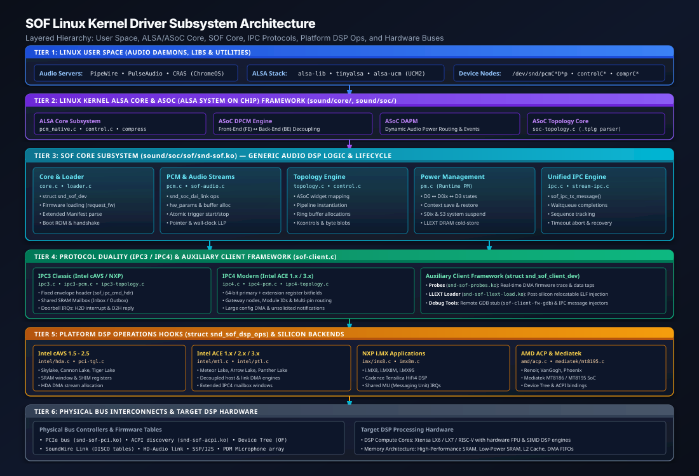
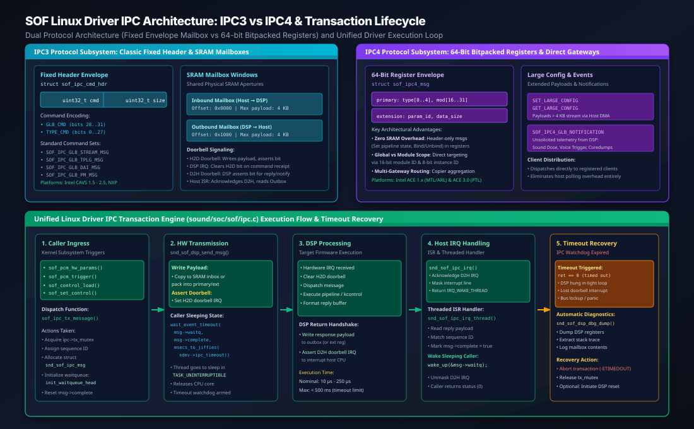
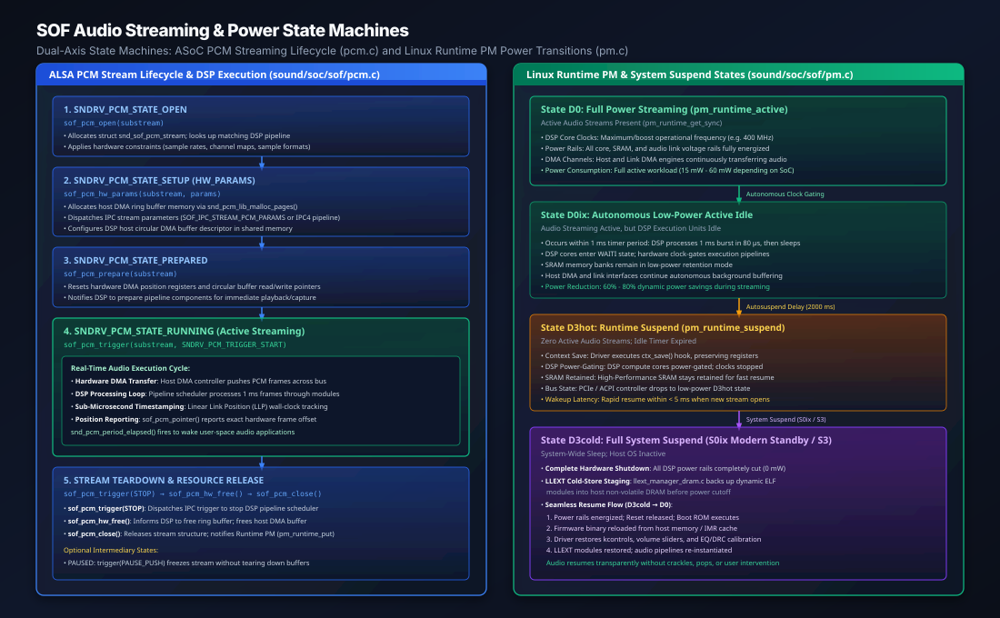

.. _sof_linux_driver_architecture:

Linux Driver Architecture
#########################

The Sound Open Firmware (SOF) Linux kernel driver resides in the upstream Linux kernel source tree under ``sound/soc/sof/``. Operating as an integral subsystem of the Advanced Linux Sound Architecture (ALSA) System on Chip (ASoC) framework, the SOF driver provides a hardware-agnostic digital signal processor (DSP) audio infrastructure across Intel (cAVS, ACE 1.x, ACE 2.x, ACE 3.0), NXP (i.MX8, i.MX8M, i.MX95, RT1062), AMD (ACP), and MediaTek platforms.

The driver decouples generic audio stream management, dynamic topology parsing, and power management from vendor-specific bus controllers and DSP core architectures.

Architectural Overview & Layered Hierarchy
******************************************

The SOF driver architecture is structured into six layered tiers that isolate user-space audio applications from low-level silicon registers:

   SOF Linux kernel driver layered hierarchy from Linux user space through ALSA/ASoC Core, SOF Core, IPC protocols, platform DSP ops, and physical hardware buses.

Subsystem Responsibility Matrix
===============================

.. list-table:: SOF Linux Driver Layered Subsystem Responsibility Matrix
   :header-rows: 1
   :widths: 20 25 55

   * - Architectural Layer
     - Kernel Modules / Source Files
     - Core Functional Responsibilities
   * - **User Space**
     - ``pipewire``, ``pulseaudio``, ``alsa-lib``, ``tinyalsa``, ``alsa-ucm``
     - Audio routing, stream mixing, latency policy, application volume controls, and hardware profile mapping (UCM2).
   * - **ALSA & ASoC Core**
     - ``sound/core/``, ``sound/soc/``, ``soc-topology.c``
     - Standard character device nodes (``/dev/snd/pcm*``, ``control*``), Dynamic PCM (DPCM) Front-End / Back-End decoupling, and Dynamic Audio Power Management (DAPM).
   * - **SOF Core Subsystem**
     - ``snd-sof.ko`` (``core.c``, ``loader.c``, ``pcm.c``, ``topology.c``, ``pm.c``, ``ipc.c``)
     - Hardware-agnostic DSP management: device registration, firmware authentication, PCM stream lifecycle, dynamic topology graph instantiation, and power state machines.
   * - **Protocol Subsystems**
     - ``ipc3*.c``, ``ipc4*.c``, ``stream-ipc.c``
     - Bidirectional IPC encoding, mailbox and bitpacked register marshalling, sequence tracking, completion waitqueues, and timeout watchdog handling.
   * - **Auxiliary Clients**
     - ``sof-client.c``, ``snd-sof-probes.ko``, ``snd-sof-llext-load.ko``
     - Modular auxiliary drivers (``snd_sof_client_dev``): real-time DMA firmware trace streaming, dynamic relocatable LLEXT module injection, GDB debugging, and test fuzzers.
   * - **Platform DSP Drivers**
     - ``snd-sof-pci.ko``, ``intel/``, ``imx/``, ``amd/``, ``mediatek/``
     - Hardware abstraction hooks (``struct snd_sof_dsp_ops``): core reset, power rail gating, memory-mapped I/O, doorbell interrupt service routines, and host/link DMA stream setup.
   * - **Bus Interconnects**
     - PCIe, ACPI, SoundWire Link, HD-Audio, I2S / SSP, PDM
     - Physical bus enumeration, descriptor table parsing (NHLT, SoundWire DISCO ``_DSD``), clock distribution, and high-speed DMA transport.

Core Device Registration & Driver Lifecycle
*******************************************

The core driver entry point resides in ``sound/soc/sof/core.c``, coordinating initialization between bus wrappers (PCI, ACPI, Device Tree) and the ASoC sound card instance.

Device Probe & Binding Sequence
===============================

When a supported audio DSP device is enumerated by the kernel bus driver (for example, ``sof-pci-dev.c`` matching a PCI vendor/device ID on Intel Tiger Lake or Panther Lake):

1. **Private Data Allocation**:
   The bus driver allocates the primary driver context structure, ``struct snd_sof_dev``, initializing locking primitives, waitqueues, and subsystem list heads:

   .. code-block:: c

      struct snd_sof_dev *sdev;
      sdev = devm_kzalloc(dev, sizeof(*sdev), GFP_KERNEL);
      sdev->dev = dev;
      sdev->pdata = plat_data;

2. **DSP Operations Binding**:
   The platform driver binds its hardware-specific implementation of ``struct snd_sof_dsp_ops`` to ``sdev->pdata->desc->ops``, establishing concrete function pointers for core reset, memory access, interrupts, and IPC transmission.

3. **Memory Aperture Mapping**:
   The driver maps the memory-mapped I/O (MMIO) BARs required for DSP communication:
   * **DSP Shim / Control Registers**: Core reset, clock gating, and power domain controls.
   * **Shared Mailbox Windows**: Inbound (Inbox) and Outbound (Outbox) SRAM apertures for IPC payloads.
   * **Host DMA Trace Window**: Circular buffers for real-time firmware debug tracing.

4. **Firmware Loading & Validation** (``sound/soc/sof/loader.c``):
   The driver requests the signed firmware binary image from user-space filesystem storage (``/lib/firmware/intel/sof/``) via ``request_firmware()``.
   * **Extended Manifest Parsing**: The driver calls ``snd_sof_fw_ext_man_parse()`` to parse the Rimage extended manifest header, extracting firmware version, hardware configuration flags, and compiler build metadata.
   * **Authentication Handshake**: For platforms with hardware Root-of-Trust (Intel MEU / Boot ROM eFuses), the driver streams the signed manifest (CSS / MAN4) to the Boot ROM via Host DMA.

5. **DSP Boot & FW Ready Notification**:
   * The driver releases the primary DSP core from reset via ``snd_sof_dsp_run()``.
   * The host thread enters an interruptible wait state on ``sdev->boot_wait``.
   * Upon completing self-initialization, the DSP firmware writes a boot notification envelope (``SOF_IPC_FW_READY`` in IPC3 or IPC4 FW Boot notification) into the outbox and fires the host doorbell interrupt.
   * The interrupt handler wakes ``sdev->boot_wait``, confirming operational firmware status.

6. **ASoC Component Registration**:
   With the DSP active, the driver registers the ASoC platform component via ``snd_soc_register_component()``, exposing audio PCM interfaces, routing nodes, and mixer controls.

Audio Streaming & ASoC PCM Operations
*************************************

Audio playback and capture streaming is managed in ``sound/soc/sof/pcm.c``, which implements the standard Linux ALSA PCM operations table (``struct snd_pcm_ops``).

Dynamic PCM (DPCM) Front-End / Back-End Decoupling
==================================================

SOF relies on ASoC's Dynamic PCM (DPCM) architecture to separate user-space software endpoints from physical digital audio links:

* **Front-End (FE) PCM Interfaces**:
  Exposed to user space as virtual PCM devices (e.g. ``hw:0,0`` for Media Playback, ``hw:0,1`` for DeepBuffer, ``hw:0,2`` for Speech Capture). User-space applications configure sample rates and buffer sizes on the FE independently of hardware link constraints.
* **Back-End (BE) DAI Links**:
  Represent physical hardware links (SSP/I2S codecs, SoundWire speaker amplifiers, PDM microphone arrays, HD-Audio links). The DSP mixes, sample-rate converts, and routes audio between FEs and BEs dynamically according to the active topology graph.

PCM Operations Lifecycle
========================

The interaction between ALSA user space, the SOF Linux driver, and the DSP firmware follows a strict operational state sequence:

.. list-table:: ASoC PCM Operations to SOF DSP Lifecycle Mapping
   :header-rows: 1
   :widths: 22 28 50

   * - ALSA PCM Operation
     - Driver Handler (``pcm.c``)
     - Operational Behavior & DSP Interaction
   * - ``open()``
     - ``sof_pcm_open()``
     - Allocates ``struct snd_sof_pcm_stream``; queries topology to locate matching DSP pipeline; applies hardware constraints (rates, channel masks, formats); increments runtime PM usage counter (``pm_runtime_get_sync``).
   * - ``hw_params()``
     - ``sof_pcm_hw_params()``
     - Allocates host-side circular DMA ring buffer pages in host DRAM via ``snd_pcm_lib_malloc_pages()``; computes buffer descriptor table; sends IPC stream parameters message to DSP (``SOF_IPC_STREAM_PCM_PARAMS`` in IPC3 or pipeline creation in IPC4).
   * - ``prepare()``
     - ``sof_pcm_prepare()``
     - Resets DMA read/write pointer registers; verifies pipeline status; transitions DSP stream state to ``PREPARED`` ready for immediate sample transfer.
   * - ``trigger(START)``
     - ``sof_pcm_trigger()``
     - Dispatches atomic IPC trigger command (``SOF_IPC_STREAM_TRIG_START`` or IPC4 ``SET_PIPELINE_STATE``); enables host DMA channels; activates physical DAI links.
   * - ``pointer()``
     - ``sof_pcm_pointer()``
     - Queries current hardware stream position in audio frames. Dispatches to platform hardware DMA position registers or queries DSP Linear Link Position (LLP) wall-clock timestamp.
   * - ``trigger(STOP)``
     - ``sof_pcm_trigger()``
     - Dispatches atomic IPC trigger stop command; halts host DMA transfers; flushes internal DSP component FIFOs.
   * - ``hw_free()``
     - ``sof_pcm_hw_free()``
     - Dispatches IPC command to tear down DSP stream buffers; frees allocated host DMA ring buffer memory pages.
   * - ``close()``
     - ``sof_pcm_close()``
     - Releases stream context; decrements runtime PM usage counter (``pm_runtime_put``), allowing DSP to enter low-power idle.

Sub-Microsecond Position Reporting: DMA Position vs DSP Wall-Clock LLP
======================================================================

Accurate audio synchronization (essential for lip-sync, professional DAWs, and echo cancellation) requires precise stream position reporting:

1. **Hardware DMA Position Counters**:
   For standard audio playback, the driver reads the hardware DMA controller's Link Position (LP) or Buffer Complete counters directly from memory-mapped registers without interrupting the DSP.
2. **DSP Wall-Clock Linear Link Position (LLP)**:
   For non-HD-Audio interfaces (SoundWire, SSP/I2S, DMIC), hardware counters may lack direct register access. The DSP maintains a 64-bit monotonically increasing frame counter linked to hardware timer ticks. The driver queries this value via shared SRAM or reads periodic asynchronous position updates sent during period interrupts.

Inter-Processor Communication (IPC) Subsystem
*********************************************

Communication between the host CPU and the DSP firmware is orchestrated by the IPC subsystem (``sound/soc/sof/ipc.c``). The driver supports two distinct protocol architectures: classic **IPC3** and modern **IPC4**.

   Comparative IPC architecture illustrating Classic IPC3 fixed-envelope SRAM mailboxes, Modern IPC4 bitpacked 64-bit register envelopes, and the unified driver transaction lifecycle with completion waitqueues and timeout recovery.

IPC3 vs IPC4 Architectural Comparison
=====================================

.. list-table:: IPC3 vs IPC4 Architectural Comparison Matrix
   :header-rows: 1
   :widths: 22 38 40

   * - Parameter
     - IPC3 Classic Protocol
     - IPC4 Modern Protocol
   * - **Primary Platforms**
     - Intel cAVS 1.5 - 2.5 (SKL, APL, CNL, TGL), NXP i.MX
     - Intel ACE 1.x / 2.x / 3.x (MTL, ARL, LNL, PTL)
   * - **Header Format**
     - Fixed envelope struct: ``struct sof_ipc_cmd_hdr`` (32-bit ``cmd``, 32-bit ``size``)
     - Bit-packed 64-bit register header: ``struct sof_ipc4_msg`` (32-bit ``primary``, 32-bit ``extension``)
   * - **Messaging Medium**
     - Shared physical SRAM mailbox apertures (Inbox & Outbox)
     - Hardware SHIM bitpacked registers for small commands; Host DMA for large payloads
   * - **Zero-Copy Small Commands**
     - No: All commands require copying data into SRAM mailbox
     - Yes: Control commands (Set Pipeline State, Bind/Unbind) fit entirely in 64-bit registers
   * - **Component Addressing**
     - Flat component ID integers (``comp_id``)
     - Hierarchical 16-bit Module ID + 8-bit Instance ID
   * - **Large Payload Mechanism**
     - Multi-page fragmented mailbox streaming
     - Large Configuration buffers (``SET_LARGE_CONFIG`` / ``GET_LARGE_CONFIG``) over dedicated DMA
   * - **Telemetry & Logging**
     - Polled or trace DMA buffers (``dtrace``)
     - Unsolicited notifications (``SOF_IPC4_GLB_NOTIFICATION``) and high-speed memory trace (``mtrace``)

Unified Transaction Lifecycle & Timeout Watchdog
================================================

All IPC requests follow a deterministic transaction sequence governed by ``sof_ipc_tx_message()``:

1. **Transaction Staging**:
   The caller acquires the driver-wide transmission mutex (``ipc->tx_mutex``). A unique sequence counter is assigned to the message descriptor (``struct snd_sof_ipc_msg``), and a completion waitqueue is initialized (``init_waitqueue_head(&msg->waitq)``).

2. **Hardware Marshalling & Doorbell Assertion**:
   The platform driver writes the message header and payload into hardware registers or the SRAM inbox aperture via ``snd_sof_dsp_send_msg()``. The host asserts the Host-to-DSP (H2D) doorbell interrupt bit.

3. **Uninterruptible Sleep**:
   The caller thread sleeps waiting on the completion flag:

   .. code-block:: c

      ret = wait_event_timeout(msg->waitq, msg->complete,
                               msecs_to_jiffies(sdev->ipc_timeout));

4. **DSP Execution & Reply**:
   The DSP handles the interrupt, executes the requested command, formats the reply into the outbound mailbox (or extension register), clears the H2D doorbell, and asserts the DSP-to-Host (D2H) doorbell interrupt.

5. **Interrupt Service Routine & Threaded Wakeup**:
   * The primary host ISR (``snd_sof_ipc_irq()``) acknowledges and masks the hardware interrupt, returning ``IRQ_WAKE_THREAD``.
   * The threaded interrupt handler (``snd_sof_ipc_irq_thread()``) copies the reply payload, validates the sequence counter, sets ``msg->complete = true``, and wakes the sleeping caller via ``wake_up(&msg->waitq)``.

6. **Timeout Watchdog & Panic Diagnostics**:
   If the DSP fails to acknowledge the message before ``sdev->ipc_timeout`` (default: 500 ms) expires:
   * The wait returns ``0`` (timeout).
   * The driver logs an error (``dev_err(sdev->dev, "IPC timeout ...")``).
   * The driver invokes ``snd_sof_dsp_dbg_dump()`` to dump DSP core registers, execution stack traces, and mailbox contents to ``dmesg``.
   * The transaction is aborted with ``-ETIMEDOUT``, and the recovery subsystem is notified.

Dynamic Topology Parsing & Runtime Graph Engine
***********************************************

The SOF topology engine (``sound/soc/sof/topology.c``) translates compiled ALSA binary topology files (``.tplg`` files generated by ``alsatplg`` from human-readable ALSA topology text files) into runtime DSP processing pipelines:

1. **Binary Ingestion**:
   During driver initialization, ASoC loads the topology file matching the detected hardware machine driver. The SOF topology parser steps through manifest blocks, vendor-specific tokens, and component definitions.

2. **DAPM Widget to DSP Component Translation**:
   Each ALSA DAPM widget in the topology binary is mapped to a concrete DSP processing component:
   * **Host Endpoints**: Ingests or sinks host DMA streams.
   * **Physical DAI Endpoints**: Binds to physical serial hardware controllers (SSP, SoundWire, PDM).
   * **Processing Modules**: Volume control, Parametric Equalizer (EQ FIR/IIR), Dynamic Range Compressor (DRC), Sample Rate Converter (SRC), Mixer, and Time-Domain Fixed Beamformer (TDFB).

3. **Pipeline Construction & Priority Scheduling**:
   Components are grouped into pipelines. Each pipeline is assigned an execution priority, a core affinity mask (Core 0 vs Core 1), and a scheduling time period (typically 1 ms for standard audio, or 125 µs for low-latency voice streams).

4. **Buffer Allocation & Routing**:
   The topology engine allocates circular ring buffers between components in DSP SRAM, setting buffer sizes to accommodate pipeline scheduling periods and rate differences. Inter-component routes define the directed audio processing graph.

5. **Kcontrol Creation & Calibration Ingestion**:
   ALSA mixer controls (volume faders, mute toggles, enumerated routing switches, and private byte control calibration blobs) are extracted from topology metadata and registered with ALSA user space. When an equalizer curve or compressor profile is loaded, the driver formats the data into IPC parameter payloads and sends them to the respective DSP module.

Power Management & Runtime PM State Transitions
***********************************************

Client PC platforms mandate aggressive power management to achieve multi-day battery endurance. The SOF driver implements fine-grained runtime power management in ``sound/soc/sof/pm.c``.

   Dual-axis state machines illustrating the ALSA PCM stream lifecycle (sound/soc/sof/pcm.c) and Linux Runtime PM power transitions across D0, D0ix, D3hot, and D3cold (sound/soc/sof/pm.c).

Power States Continuum
======================

* **State D0: Active Streaming**:
  * Audio streams are active; host DMA engines continuously pump PCM frames across the system bus.
  * DSP compute cores operate at full operational clock frequency.
  * Power rails are fully energized; power consumption ranges between 15 mW and 60 mW.
* **State D0ix: Autonomous Low-Power Active Idle**:
  * Audio playback or capture is ongoing, but DSP execution units have finished processing the current 1 ms audio frame burst (which takes approximately 80 µs).
  * The DSP firmware enters a hardware ``WAITI`` instruction state.
  * Internal clock gates dynamically shut down execution pipelines, while low-power SRAM retention modes preserve buffer contents.
  * Provides 60% to 80% dynamic power reduction during active streaming without host driver involvement.
* **State D3hot: Runtime Suspend**:
  * No audio streams have been active for the autosuspend timeout window (default: 2000 ms).
  * The driver saves volatile DSP register contexts via ``ctx_save()``.
  * DSP compute cores are power-gated, host DMA engines are suspended, and the PCIe device enters the D3hot low-power link state.
  * Wakeup latency to resume streaming is less than 5 ms.
* **State D3cold: Full System Suspend (S0ix Modern Standby / S3)**:
  * Complete system sleep.
  * All active audio streams are torn down.
  * Dynamic loadable LLEXT modules are backed up to non-volatile host DRAM (``llext_manager_dram.c``).
  * DSP power rails are completely disconnected (0 mW power consumption).
  * On system resume, the driver repowers the DSP, deasserts reset, reloads the firmware binary from IMR cache, restores kcontrol and calibration states, and resumes normal audio processing seamlessly.

Auxiliary Client Driver Framework
*********************************

To maintain modularity and avoid bloat in the core audio driver, non-audio DSP features are implemented as auxiliary client drivers via the client framework in ``sound/soc/sof/sof-client.c``.

Client Device Lifecycle
=======================

Auxiliary client drivers bind to the SOF core through the ``struct snd_sof_client_dev`` abstraction:

.. code-block:: c

   struct snd_sof_client_dev {
       struct device dev;
       const char *name;
       struct snd_sof_dev *sdev;
       struct list_head list;
       void *data;
   };

When the core SOF driver boots successfully, it enumerates and instantiates registered client devices. Supported auxiliary client drivers include:

1. **DSP Firmware Probes & Real-Time Logging** (``snd-sof-probes.ko``):
   * Provides real-time firmware trace log extraction without debug UART overhead.
   * Manages dedicated DMA stream channels between the DSP trace buffer and user-space tools (``mtrace``, ``sof-logger``).
   * Supports dynamic runtime probe injection, allowing test engineers to tap audio data at any internal topology buffer.

2. **LLEXT Dynamic Module Loader** (``snd-sof-llext-load.ko``):
   * Exposes a user-space character device interface for injecting relocatable ELF (``.llext``) audio processing modules into a running DSP.
   * Manages library authentication, virtual memory mapping, and cache maintenance across load and unload operations.

3. **Remote Firmware GDB Debug Stub** (``sof-client-fw-gdb.c``):
   * Provides a remote GDB serial debug protocol bridge over kernel debugfs, enabling developers to connect ``xt-gdb`` or ``gdb-multiarch`` directly to live DSP hardware cores.

4. **IPC Test & Fuzzing Injectors**:
   * ``sof-client-ipc-msg-injector.c``: Exposes debugfs nodes for sending raw, handcrafted IPC messages to the DSP.
   * ``sof-client-ipc-flood-test.c``: Stress-tests the IPC subsystem by flooding the mailbox with rapid-fire messages to verify deadlock prevention and queue stability.

Platform DSP Operations Abstraction
***********************************

Hardware platforms implement the ``struct snd_sof_dsp_ops`` operations table (defined in ``sound/soc/sof/sof-priv.h`` and wrapped in ``ops.h``), establishing a unified hardware abstraction layer.

Operations & Platform Dispatch Matrix
=====================================

.. list-table:: struct snd_sof_dsp_ops Operations & Platform Dispatch Matrix
   :header-rows: 1
   :widths: 22 28 50

   * - Hook Category
     - Function Pointers (``snd_sof_dsp_ops``)
     - Platform Implementation Details
   * - **Lifecycle & Initialization**
     - ``probe``, ``remove``, ``shutdown``, ``run``, ``reset``
     - Programs hardware power rails, enables PCI bus DMA initiator controls, resets DSP compute cores, and monitors Boot ROM handshake registers.
   * - **Core Power Management**
     - ``core_get``, ``core_put``, ``stall``
     - Dynamically powers up secondary DSP cores (Core 1..3) when multi-core pipelines are scheduled; gates cores when idle.
   * - **Memory & Register I/O**
     - ``block_read``, ``block_write``, ``read``, ``write``
     - Performs memory-mapped I/O across hardware BAR apertures, managing memory window offsets and cache alignment.
   * - **Mailbox & IPC**
     - ``mailbox_read``, ``mailbox_write``, ``send_msg``
     - Copies IPC command buffers to SRAM inbox/outbox windows; writes bitpacked headers to primary/extension registers.
   * - **Interrupt Handling**
     - ``irq_handler``, ``irq_thread``
     - Top-half primary ISR checks hardware interrupt status bit; bottom-half threaded handler processes replies and unsolicited notifications.
   * - **Audio PCM Streaming**
     - ``pcm_open``, ``pcm_hw_params``, ``pcm_trigger``, ``pcm_pointer``
     - Sets up host DMA stream channels; configures buffer descriptors in DSP memory; latches sub-microsecond hardware stream positions.
   * - **Firmware Loading**
     - ``load_firmware``, ``load_module``
     - Streams signed firmware binaries into DSP SRAM or IMR memory via Host DMA controllers.
   * - **Power State Transitions**
     - ``suspend``, ``resume``, ``runtime_suspend``, ``runtime_resume``
     - Executes context save and restore routines; powers down clock oscillators; manages low-power sleep states.
   * - **Debug & Telemetry**
     - ``dbg_dump``, ``debugfs_add_region_item``
     - Captures DSP registers, execution stack traces, and mailbox dumps upon watchdog timeout or firmware panic.

Debugfs Telemetry, Tracing & Diagnostics
****************************************

The SOF driver exposes an extensive debugfs hierarchy located under ``/sys/kernel/debug/sof/`` for real-time observability, profiling, and debugging.

Kernel Debugfs Hierarchy
========================

* ``/sys/kernel/debug/sof/dsp_stack_dump``: Dumps the live program counter, stack pointer, and register state of each DSP compute core.
* ``/sys/kernel/debug/sof/ipc_flood_test``: Allows user space to trigger rapid IPC stress tests.
* ``/sys/kernel/debug/sof/ipc_msg_injector``: Enables manual injection of raw IPC binary payloads.
* ``/sys/kernel/debug/sof/memory_info``: Reports real-time memory allocation statistics across High-Performance and Low-Power SRAM.
* ``/sys/kernel/debug/sof/fw_profile``: Profiles firmware execution execution timing and CPU core load.

Troubleshooting & Diagnostic Matrix
===================================

.. list-table:: Common Linux Driver Issues, Root Causes, and Diagnostic Procedures
   :header-rows: 1
   :widths: 22 30 48

   * - Error Symptom
     - Probable Root Cause
     - Diagnostic & Resolution Procedure
   * - **Firmware Boot Timeout**
       (``error: status ... timeout``)
     - Missing firmware binary, invalid cryptographic signature, or disabled DSP power rail in BIOS.
     - Inspect ``dmesg | grep sof-audio``; verify signed binary exists in ``/lib/firmware/intel/sof/``; verify BIOS has HD-Audio / DSP enabled.
   * - **IPC Timeout**
       (``IPC timeout ... dumping DSP stack``)
     - DSP core hung in infinite loop, unhandled firmware exception, or dropped doorbell interrupt.
     - Examine stack trace dumped to ``dmesg``; verify DSP mailbox contents; check if custom processing module exceeded 1 ms processing deadline.
   * - **Topology Parsing Failure**
       (``error: tplg component ...``)
     - Topology binary version mismatch, invalid widget token, or missing processing module driver.
     - Verify kernel topology file corresponds to firmware ABI version; check ``dmesg`` for specific component ID failure; recompile topology with ``alsatplg``.
   * - **Audio Underrun / Overrun**
       (``XRUN ... period elapsed``)
     - Host scheduling jitter, DMA ring buffer exhaustion, or incorrect period size in user-space daemon.
     - Inspect PipeWire / PulseAudio latency settings; increase period size or buffer count in topology; check ``ftrace`` for CPU latency spikes.
   * - **Sound Card Missing**
       (``aplay -l: no soundcards found``)
     - Machine driver failed to match system DMI strings or missing ACPI / SoundWire DISCO tables.
     - Check ``dmesg | grep -i snd``; verify machine driver quirk table matches system vendor and product SKU; inspect ACPI NHLT table via ``iasl -d /sys/firmware/acpi/tables/NHLT``.

Terminal Diagnostic Recipes
===========================

Inspect Driver Initialization & Firmware Handshake:

.. code-block:: bash

   # Filter kernel log for SOF driver initialization messages
   dmesg | grep -E "sof-audio|snd_sof|fw_ready|ext_man"

Verify Active Sound Cards & PCM Frontends:

.. code-block:: bash

   # List all registered ALSA sound cards and PCM playback streams
   aplay -l

Monitor Kernel Ftrace Events for SOF IPC:

.. code-block:: bash

   # Enable SOF trace events and stream IPC transaction latency
   sudo trace-cmd record -e "sof:*" -e "snd_soc:*" aplay -D hw:0,0 test.wav
   sudo trace-cmd report

Dump DSP Memory Usage via Debugfs:

.. code-block:: bash

   # Inspect live DSP memory allocation
   sudo cat /sys/kernel/debug/sof/memory_info
