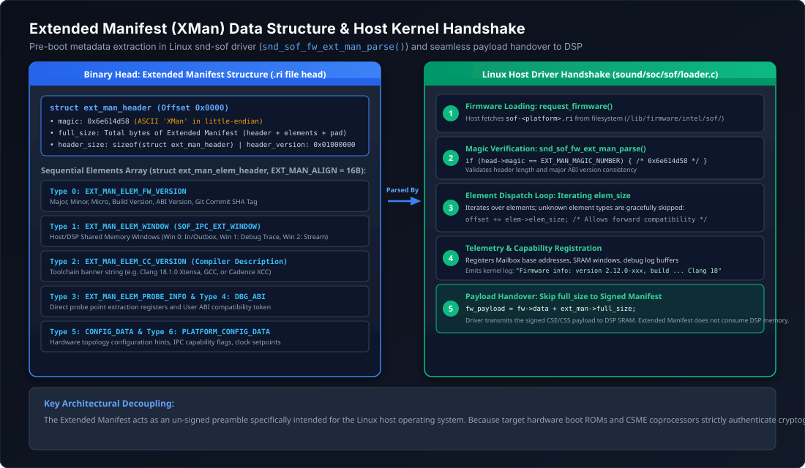

.. _extended_manifest:

Extended Manifest Architecture & Host Handshake
###############################################

The **Extended Manifest** (abbreviated as **XMan**) is an extensible, un-signed metadata container embedded at the very beginning (offset ``0x0000``) of compiled Sound Open Firmware binary images (``.ri`` files). It conveys vital compile-time hardware, toolchain, and ABI configuration details to the host operating system kernel (Linux ``snd-sof``) **before** the audio DSP is initialized or booted.

Because the host driver parses the extended manifest prior to initiating DSP reset and DMA transfer, the host dynamically verifies ABI compatibility, configures memory windows for IPC mailboxes and debug dumps, and logs firmware version information without requiring the DSP core to be powered on. Crucially, the extended manifest is stripped or bypassed by the host DMA loader, ensuring **zero memory footprint** inside the DSP SRAM.

   Extended Manifest architecture, element taxonomy, and Linux kernel host driver handshake flow.

Extended Manifest Binary Header
*******************************

The extended manifest begins with a fixed, backwards-compatible header defined in ``include/sound/sof/ext_manifest.h``:

.. code-block:: c

   /* Magic number in ASCII: 'XMan' (0x6e614d58 in little-endian) */
   #define SOF_EXT_MAN_MAGIC_NUMBER    0x6e614d58

   /* Version encoding: MMmmmppp (Major: bits 31-24, Minor: bits 23-12, Patch: bits 11-0) */
   #define SOF_EXT_MAN_BUILD_VERSION(MAJOR, MINOR, PATCH) ( \
       ((uint32_t)(MAJOR) << 24) | \
       ((uint32_t)(MINOR) << 12) | \
       (uint32_t)(PATCH))

   #define SOF_EXT_MAN_VERSION         SOF_EXT_MAN_BUILD_VERSION(1, 0, 0)

   /* Structural alignment required for every extended manifest element */
   #define EXT_MAN_ALIGN               16

   struct sof_ext_man_header {
       uint32_t magic;          /* Identification magic: EXT_MAN_MAGIC_NUMBER */
       uint32_t full_size;      /* Full size of ext_man in bytes (header + all elements + padding) */
       uint32_t header_size;    /* Size of this header in bytes (enables future header growth) */
       uint32_t header_version; /* Header version: SOF_EXT_MAN_VERSION */

       /* Immediately followed by contiguous sequence of struct sof_ext_man_elem_header elements */
   } __packed;

Header Invariant Rules
======================

1. **Magic Identification**: The host driver inspects the first 4 bytes of any requested firmware file. If ``magic != 0x6e614d58``, the driver deduces that no extended manifest is present and treats offset ``0x0000`` as the hardware payload.
2. **Forward & Backward Compatibility**:
   - If a newer firmware binary expands ``sof_ext_man_header`` with additional fields, older drivers read only up to ``header_size`` bytes and start element parsing at ``iptr = fw->data + head->header_size``.
   - Version consistency is checked using the major version mask: ``SOF_EXT_MAN_VERSION_INCOMPATIBLE(host_ver, cli_ver)`` checks ``(host_ver & 0xFF000000) != (cli_ver & 0xFF000000)``.
3. **Payload Offset Isolation**: The ``full_size`` field indicates the exact byte count of the extended manifest region. Once parsing succeeds, the Linux driver configures ``sdev->basefw.payload_offset = head->full_size``, directing the hardware DMA engine to skip this un-signed metadata entirely.

Element Taxonomy & Structures
*****************************

Following the main header, the extended manifest contains an arbitrary sequence of self-describing metadata elements. Each element begins with a generic element header:

.. code-block:: c

   struct sof_ext_man_elem_header {
       uint32_t type;  /* Element type enum: SOF_EXT_MAN_ELEM_* */
       uint32_t size;  /* Total size in bytes, including this 8-byte header and payload */

       /* Immediately followed by type-dependent payload struct */
   } __packed;

Standard Element Types
======================

The Linux kernel and SOF firmware define standard element types in ``enum sof_ext_man_elem_type``:

.. list-table:: Standard Extended Manifest Element Types
   :widths: 10 32 58
   :header-rows: 1

   * - Type ID
     - Enumeration Constant
     - Description & Payload Structure
   * - ``0``
     - ``SOF_EXT_MAN_ELEM_FW_VERSION``
     - **Firmware Version Metadata**: Contains ``struct sof_ipc_fw_version`` (major, minor, micro, build, tag, commit hash) and ABI flags.
   * - ``1``
     - ``SOF_EXT_MAN_ELEM_WINDOW``
     - **Memory Windows**: Contains ``struct sof_ipc_window``, defining host-accessible memory windows for IPC mailboxes, debug/panic dumps, and trace buffers.
   * - ``2``
     - ``SOF_EXT_MAN_ELEM_CC_VERSION``
     - **Compiler & Toolchain Version**: Contains ``struct sof_ipc_cc_version`` describing the C compiler, LLVM/Clang version, and build flags used to compile the binary.
   * - ``3``
     - ``SOF_EXT_MAN_ELEM_PROBE_INFO``
     - **Trace Probe Configuration**: Describes dynamic trace probe instrumentation points and DMA stream allocation.
   * - ``4``
     - ``SOF_EXT_MAN_ELEM_DBG_ABI``
     - **Debug ABI Information**: Contains ``struct ext_man_dbg_abi`` defining the ABI version used by debugfs and telemetry interfaces.
   * - ``5``
     - ``SOF_EXT_MAN_ELEM_CONFIG_DATA``
     - **Hardware Configuration Tokens**: Hardware configuration parameters, clock frequencies, and power management defaults.
   * - ``6``
     - ``SOF_EXT_MAN_ELEM_PLATFORM_CONFIG_DATA``
     - **Platform Configuration Data**: Platform-specific board overrides parsed by ``snd_sof_dsp_parse_platform_ext_manifest()``.

IPC4 Extended Manifest 4 ($AE1)
===============================

For modern Intel platforms running the IPC4 protocol (cAVS 2.5 and ACE 1.5/2.0/3.0), SOF also supports **Extended Manifest 4**, identified by the ASCII magic ``$AE1`` (``0x31454124``):

.. code-block:: c

   #define SOF_EXT_MAN4_MAGIC_NUMBER    0x31454124

   struct sof_ext_manifest4_hdr {
       uint32_t id;                  /* Magic: 0x31454124 ($AE1) */
       uint32_t len;                 /* Length of extension manifest */
       uint16_t version_major;       /* Header version major */
       uint16_t version_minor;       /* Header version minor */
       uint32_t num_module_entries;  /* Count of module entries described */
   } __packed;

Extended Manifest 4 provides detailed component descriptors, module UUIDs, scheduling capabilities (sample period multipliers), pin direction caps, and supported audio sample rates directly to the IPC4 pipeline manager in the kernel.

Build-Time Generation in Rimage
*******************************

Rimage extracts extended manifest elements directly from the compiled firmware ELF executable during image packaging:

1. **Metadata Section Declaration**:
   Firmware source files declare metadata structures in C and place them in the dedicated ``.fw_metadata`` ELF section:

   .. code-block:: c

      /* Example: Firmware version metadata element in SOF source */
      static const struct {
          struct sof_ext_man_elem_header elem_header;
          struct sof_ipc_fw_version version;
          uint32_t flags;
      } fw_ver_elem __section(".fw_metadata") __aligned(EXT_MAN_ALIGN) = {
          .elem_header = {
              .type = SOF_EXT_MAN_ELEM_FW_VERSION,
              .size = sizeof(fw_ver_elem),
          },
          .version = {
              .major = SOF_MAJOR,
              .minor = SOF_MINOR,
              .micro = SOF_MICRO,
              .build = SOF_BUILD,
              .tag = SOF_TAG,
          },
          .flags = 0,
      };

2. **Linker Placement**:
   The platform linker script collects all symbols marked with ``__section(".fw_metadata")`` into a contiguous, non-allocatable ELF section named ``.fw_metadata``.
3. **Extraction & Validation**:
   Rimage inspects the primary ELF executable using ``elf_section_header_get_by_name()``. It calls ``ext_man_validate()`` to verify two critical integrity constraints:
   - Every element header specifies a non-zero ``size`` that is an exact multiple of ``EXT_MAN_ALIGN`` (16 bytes).
   - The cumulative sum of all element sizes matches the total size of the ``.fw_metadata`` section exactly, ensuring no trailing garbage or unaligned offsets exist.
4. **Binary Emission**:
   Rimage writes the ``struct ext_man_header`` at byte 0 of the destination ``.ri`` file, followed by the contents of ``.fw_metadata``. In addition, if requested, Rimage writes an un-signed standalone file named ``<output>.xman`` for host validation tooling.

Linux Kernel Host Driver Handshake
**********************************

When the Linux kernel sound driver loads the firmware file via the standard firmware subsystem, the following handshake occurs in ``sound/soc/sof/loader.c`` and ``sound/soc/sof/ipc3-loader.c``:

.. code-block:: text

   [ User / Udev ]
          |
          v
   request_firmware(&sdev->basefw.fw, fw_filename, sdev->dev)
          |
          v
   sdev->ipc->ops->fw_loader->parse_ext_manifest(sdev)
          |
          +---> ipc3_fw_ext_man_size(sdev, fw)
          |        |
          |        +---> Check head->magic == 0x6e614d58 ("XMan")
          |        +---> Return head->full_size
          |
          +---> Loop over elements: iptr = fw->data + head->header_size
          |        |
          |        +---> elem_hdr->type == SOF_EXT_MAN_ELEM_FW_VERSION
          |        |        Parse version, commit hash, display in dmesg
          |        |
          |        +---> elem_hdr->type == SOF_EXT_MAN_ELEM_WINDOW
          |        |        Map PCI BAR memory windows for IPC & trace
          |        |
          |        +---> elem_hdr->type == SOF_EXT_MAN_ELEM_CC_VERSION
          |        |        Store compiler version in debugfs
          |        |
          |        +---> default:
          |                 Safely skip unknown elements via elem_hdr->size
          |
          v
   sdev->basefw.payload_offset = ext_man_size
          |
          v
   DSP DMA Loader transfers payload starting at sdev->basefw.payload_offset
   (Extended Manifest is NOT copied to DSP SRAM)

Graceful Fallback & Extensibility
=================================

The kernel parser loop guarantees robust forward compatibility:

.. code-block:: c

   while (remaining > sizeof(*elem_hdr)) {
       elem_hdr = (struct sof_ext_man_elem_header *)iptr;

       if (elem_hdr->size < sizeof(*elem_hdr) || elem_hdr->size > remaining) {
           dev_err(sdev->dev, "invalid sof_ext_man header size, type %d size %#x\n",
                   elem_hdr->type, elem_hdr->size);
           return -EINVAL;
       }

       switch (elem_hdr->type) {
       case SOF_EXT_MAN_ELEM_FW_VERSION:
           ret = ipc3_fw_ext_man_get_version(sdev, elem_hdr);
           break;
       case SOF_EXT_MAN_ELEM_WINDOW:
           ret = ipc3_fw_ext_man_get_windows(sdev, elem_hdr);
           break;
       /* ... additional element types ... */
       default:
           dev_info(sdev->dev, "unknown sof_ext_man header type %d size %#x\n",
                    elem_hdr->type, elem_hdr->size);
           break;
       }

       /* Advance pointer to next element using declared element size */
       iptr += elem_hdr->size;
       remaining -= elem_hdr->size;
   }

If a newer firmware image contains novel element types, older Linux kernels log an informational message (``unknown sof_ext_man header type ...``) and advance to the next element without failing firmware initialization.

Guide: Adding a New Extended Manifest Element
*********************************************

To add a new metadata element to Sound Open Firmware, follow this four-step procedure across firmware, rimage, and the kernel:

Step 1: Declare the Element in Header Files
===========================================

In the SOF firmware tree (``src/include/kernel/ext_manifest.h``) and the Linux kernel tree (``include/sound/sof/ext_manifest.h``), define the new element type and payload structure:

.. code-block:: c

   /* 1. Add new element type to enum */
   enum sof_ext_man_elem_type {
       /* ... existing elements ... */
       SOF_EXT_MAN_ELEM_CUSTOM_TELEMETRY = 7,
   };

   /* 2. Define packed structure with mandatory elem_header */
   struct sof_ext_man_custom_telemetry {
       struct sof_ext_man_elem_header hdr;
       uint32_t sampling_interval_ms;
       uint32_t feature_flags;
       uint8_t  custom_name[32];
   } __packed;

Step 2: Instantiate Element in Firmware Code
============================================

In the relevant firmware platform or subsystem file, declare an instance of the struct and place it in the ``.fw_metadata`` section:

.. code-block:: c

   #include <kernel/ext_manifest.h>

   static const struct sof_ext_man_custom_telemetry custom_telem
       __section(".fw_metadata") __aligned(EXT_MAN_ALIGN) = {
       .hdr = {
           .type = SOF_EXT_MAN_ELEM_CUSTOM_TELEMETRY,
           .size = sizeof(struct sof_ext_man_custom_telemetry),
       },
       .sampling_interval_ms = 100,
       .feature_flags = 0x00000003,
       .custom_name = "SOF_TELEMETRY_V1",
   };

.. note::
   Ensure that ``sizeof(struct sof_ext_man_custom_telemetry)`` is an exact multiple of ``EXT_MAN_ALIGN`` (16 bytes). Use explicit padding fields if necessary to prevent ``ext_man_validate()`` from rejecting the binary during build.

Step 3: Implement Parser Handler in Linux Kernel
================================================

In ``sound/soc/sof/ipc3-loader.c`` (or ``ipc4-loader.c``), add a case branch to handle the new element type:

.. code-block:: c

   static int ipc3_fw_ext_man_get_custom_telemetry(struct snd_sof_dev *sdev,
                                                   const struct sof_ext_man_elem_header *hdr)
   {
       const struct sof_ext_man_custom_telemetry *telem =
           (const struct sof_ext_man_custom_telemetry *)hdr;

       dev_info(sdev->dev, "Custom Telemetry: %s, interval %u ms, flags 0x%08x\n",
                telem->custom_name, telem->sampling_interval_ms, telem->feature_flags);

       /* Store telemetry configuration in sdev private context */
       sdev->custom_telemetry_interval = telem->sampling_interval_ms;
       return 0;
   }

   /* In sof_ipc3_fw_parse_ext_man(): */
   case SOF_EXT_MAN_ELEM_CUSTOM_TELEMETRY:
       ret = ipc3_fw_ext_man_get_custom_telemetry(sdev, elem_hdr);
       break;

Step 4: Verification and Debugging
==================================

1. Rebuild the firmware using ``west build`` and inspect the Rimage output:

   .. code-block:: bash

      # Rimage logs verbose parsing of all discovered fw_metadata elements:
      Extended manifest found module, type: 0x0007 size: 0x0030 (  48) offset: 0x0070

2. Deploy the signed ``.ri`` binary to the target DUT and reload the kernel driver:

   .. code-block:: bash

      # Verify kernel dmesg output on the DUT:
      dmesg | grep -i "sof_ext_man\|telemetry"
      # Expected output:
      # sof-audio-pci-intel-tgl: found sof_ext_man header type 7 size 0x30
      # sof-audio-pci-intel-tgl: Custom Telemetry: SOF_TELEMETRY_V1, interval 100 ms, flags 0x00000003