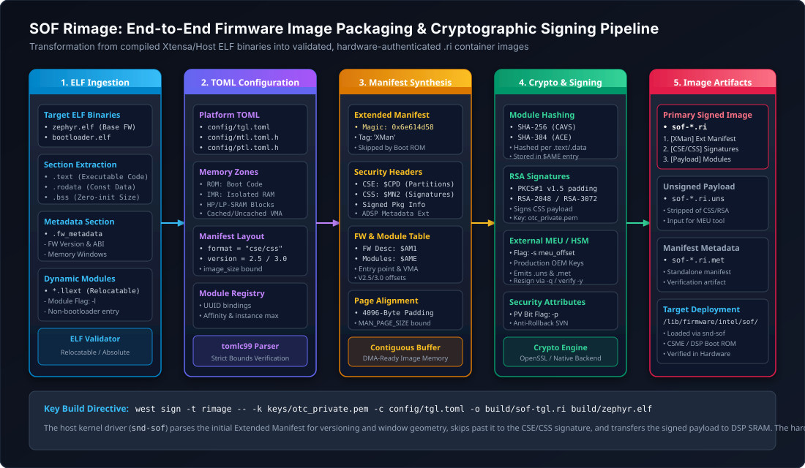
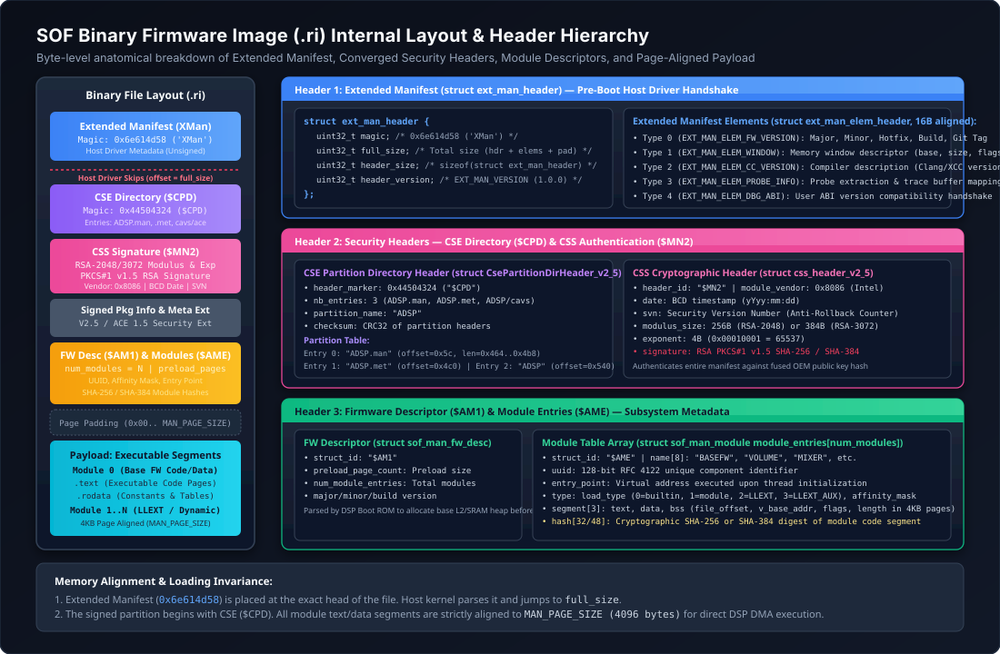
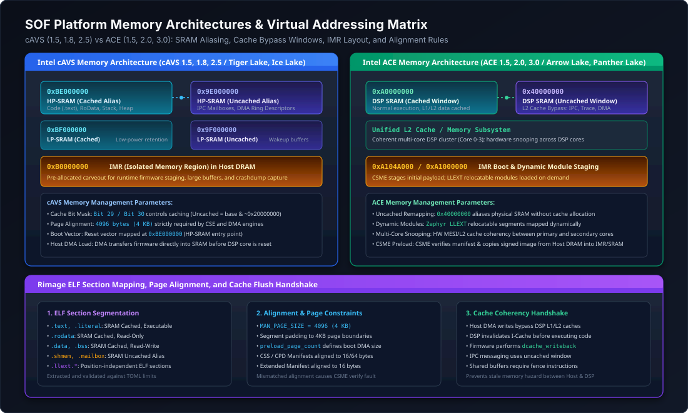
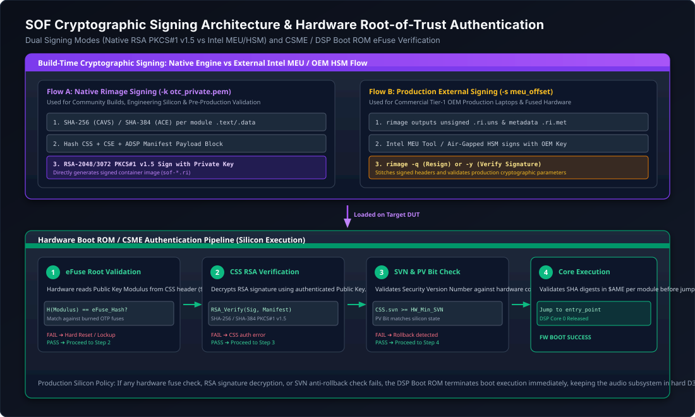

.. _rimage:

Rimage Firmware Packaging & Signing Architecture
################################################

**Rimage** is the official firmware image creation, packaging, and cryptographic signing toolchain for Sound Open Firmware (SOF). It translates compiled Executable and Linkable Format (ELF) object files produced by the Xtensa/LLVM compiler into validated, secure, hardware-bootable binary images (``.ri`` files).

Rimage is responsible for enforcing platform memory boundaries, generating Converged Security Engine (CSE) partition manifests, computing cryptographic digest hashes, inserting the un-signed Extended Manifest for host kernel initialization, bundling relocatable dynamic modules (Zephyr LLEXT), and applying digital signatures required by hardware boot ROMs and Silicon Root-of-Trust (RoT) engines.

   End-to-end Rimage 5-stage packaging pipeline: ELF extraction, TOML hardware mapping, manifest synthesis, cryptographic signing, and binary assembly.

.. toctree::
   :maxdepth: 1

   extended_manifest

Architecture & Dual Implementations
***********************************

Rimage exists in two implementations within the Sound Open Firmware ecosystem:

1. **Production C99 Toolchain** (``tools/rimage/``):
   The authoritative packaging tool integrated directly into the SOF build tree and invoked by Zephyr's CMake/west build system. Implemented in high-performance C99, it utilizes `tomlc99` for TOML parsing and OpenSSL (`libcrypto`) for cryptographic hashing and RSA PKCS#1 v1.5 digital signing. This tool is built on-the-fly or executed from the host system during firmware compilation.
2. **Upstream Rust Implementation** (``thesofproject/rimage``):
   A modular, memory-safe reimplementation in Rust designed to provide clean library crates for ELF parsing, manifest serialization, and cryptographic verification, supporting modern continuous integration pipelines.

Both implementations adhere to the identical binary layout specifications, TOML schemas, cryptographic structures, and hardware alignment constraints described in this guide.

Binary Image Layout & Header Hierarchy
**************************************

A fully packaged Sound Open Firmware binary file (``.ri``) consists of a multi-tiered header stack followed by page-aligned executable and data payloads. The image is structured so that each layer can be parsed and validated by the relevant hardware or software entity: the Linux host driver, the Intel Converged Security Engine (CSME), the DSP Boot ROM, and finally the SOF Base Firmware runtime.

   Comprehensive byte-level binary layout of an SOF ``.ri`` firmware image from offset ``0x0000`` to end-of-file.

Binary Structure Anatomy
========================

The following table summarizes the structural hierarchy of a modern SOF image:

.. list-table:: SOF Binary Image (``.ri``) Section Hierarchy
   :widths: 14 18 20 48
   :header-rows: 1

   * - Offset
     - Structure / Magic
     - Target Consumer
     - Function & Key Fields
   * - ``0x0000``
     - ``sof_ext_man_header`` (``0x6e614d58`` / ``XMan``)
     - Linux Host Driver (``snd-sof``)
     - **Extended Manifest**: Un-signed compile-time metadata. Conveys firmware version, compiler version, IPC memory windows, and debug ABI. Skipped during DSP DMA transfer.
   * - ``+full_size``
     - ``cse_header`` (``0x44504324`` / ``$CPD``)
     - Intel CSME / Hardware Boot ROM
     - **CSE Partition Directory**: Declares image partitions: ``ADSP.man`` (manifest), ``ADSP.met`` (metadata), and ``ADSP`` (executable payload).
   * - Variable
     - ``css_header`` (``0x324e4d24`` / ``$MN2``)
     - CSME / Boot ROM Cryptographic Engine
     - **Common Security Signature**: Contains vendor ID (``0x8086``), BCD date, security version number (SVN), RSA modulus (2048/3072-bit), exponent (``0x10001``), and PKCS#1 v1.5 digital signature.
   * - Variable
     - Signed Package Info & Metadata
     - Boot ROM Verifier
     - Security extension metadata and ADSP partition integrity hashes.
   * - Page-aligned
     - ``adsp_fw_desc`` (``0x314d4124`` / ``$AM1``)
     - DSP Boot ROM / Base Firmware Loader
     - **Firmware Descriptor**: Specifies preload page count, entry point address, and the count of executable modules.
   * - Variable
     - ``adsp_module_entry`` (``0x454d4124`` / ``$AME``)
     - DSP Module Loader / IPC4 Dispatcher
     - **Module Descriptor Table**: Array of module definitions with UUIDs, entry points, memory segment lists (text/data/bss), and cryptographic hashes.
   * - ``4096``-aligned
     - Executable Payload Segments
     - Audio DSP Core Execution
     - High-Performance SRAM and IMR code/data pages loaded via DMA bursts.

Alignment Constraints
=====================

Strict alignment rules are enforced by Rimage to guarantee hardware compatibility:

- **Page Alignment** (``MAN_PAGE_SIZE = 4096``): Executable segments and binary partitions must be aligned to 4 KB page boundaries to allow direct DMA streaming into DSP SRAM without partial-page DMA faults.
- **Extended Manifest Alignment** (``EXT_MAN_ALIGN = 16``): All extended manifest element structures must be aligned to 16 bytes.
- **Cryptographic Manifest Alignment**: The CSS manifest and signature blocks must be aligned to 64 bytes for hardware SHA-256 and SHA-384 hardware acceleration blocks.

Platform Memory Architectures & Addressing Matrix
*************************************************

Intel audio DSP architectures are divided into two primary evolutionary families: **cAVS** (Intel Converged Audio, Voice and Speech) and **ACE** (Intel Audio Core Engine). Each architecture defines distinct virtual memory maps, cache bypass windows, and Isolated Memory Region (IMR) interfaces.

   Memory architectural comparison between Intel cAVS and ACE platforms: virtual addressing, cached/uncached aliasing, and IMR windows.

cAVS Memory Architecture (cAVS 1.5, 1.8, 2.5)
==============================================

Platforms such as Apollo Lake (cAVS 1.5), Cannon Lake (cAVS 1.8), and Tiger Lake (cAVS 2.5) utilize an Xtensa DSP core memory architecture where caching behavior is controlled by high-order virtual address bits:

- **Cached HP-SRAM Alias** (``0xBE000000``): High-Performance SRAM accessed via the L1 instruction and data caches. Executable code (``.text``), read-only data (``.rodata``), stack, and heap are mapped here.
- **Uncached HP-SRAM Alias** (``0x9E000000``): Physical SRAM accessed by bypassing the L1 cache. Used for inter-processor communication (IPC) mailboxes, DMA ring buffers, and host-DSP shared telemetry memory.
- **Low-Power SRAM (LP-SRAM)**: Mapped at cached ``0xBF000000`` and uncached ``0x9F000000``. Retained during low-power D3 states for Wake-on-Voice (WOV) buffering.
- **Isolated Memory Region (IMR)**: Mapped at ``0xB0000000`` in host DRAM carveout, used for runtime firmware staging and large audio stream buffering.

ACE Memory Architecture (ACE 1.5, 2.0, 3.0)
===========================================

Starting with Meteor Lake / Arrow Lake (ACE 1.5), Lunar Lake (ACE 2.0), and Panther Lake (ACE 3.0), the memory architecture was redesigned around a unified L2 cache subsystem and dynamic module loading:

- **Cached SRAM Window** (``0xA0000000``): Unified DSP SRAM mapped with L1/L2 hardware cache snooping. Core 0 reset vector is located at ``0xA0000000``.
- **Uncached / Cache-Bypass Window** (``0x40000000``): Physical SRAM alias that completely bypasses the L2 cache controller. Essential for host DMA buffers, IPC descriptors, and trace logging streams to prevent cache stale hazards.
- **ACE IMR Window** (``0xA104A000`` / ``0xA1000000``): Dedicated DRAM carveout managed by the Intel Converged Security and Management Engine (CSME) for cold-store firmware execution and dynamic loadable library (LLEXT) staging.

Memory Mapping Comparison
=========================

.. list-table:: Platform Memory Mapping Comparison Matrix
   :widths: 24 26 26 24
   :header-rows: 1

   * - Parameter / Region
     - cAVS 2.5 (Tiger Lake)
     - ACE 1.5 (Arrow Lake)
     - ACE 3.0 (Panther Lake)
   * - **HP-SRAM Cached**
     - ``0xBE000000``
     - ``0xA0000000``
     - ``0xA0000000``
   * - **HP-SRAM Uncached**
     - ``0x9E000000``
     - ``0x40000000``
     - ``0x40000000``
   * - **IMR Base Address**
     - ``0xB0000000``
     - ``0xA1000000``
     - ``0xA104A000``
   * - **Cache Control Mechanism**
     - Virtual address bit flipping
     - Window remapping (``0x40000000``)
     - Window remapping + HW snooping
   * - **Hash Algorithm**
     - SHA-256
     - SHA-384
     - SHA-384
   * - **Signature Algorithm**
     - RSA-2048 / 3072 PKCS#1 v1.5
     - RSA-3072 PKCS#1 v1.5
     - RSA-3072 PKCS#1 v1.5

Cryptographic Digital Signing Architecture
******************************************

Sound Open Firmware enforces cryptographic authentication to protect the audio DSP subsystem from unauthorized code execution. During system boot, the hardware CSME and DSP Boot ROM verify the digital signature embedded in the CSS manifest before releasing the DSP reset vector.

   Cryptographic signing pipeline comparing native Rimage RSA signing against the external Intel MEU / OEM HSM workflow, followed by Boot ROM eFuse verification.

Dual Signing Workflows
======================

Rimage supports two distinct cryptographic signing flows depending on the target deployment environment:

Native Rimage Signing Engine (Development & Community)
------------------------------------------------------

In development environments and for engineering hardware, Rimage signs the binary directly using an RSA private key supplied via the command line (``-k <key.pem>``):

1. **Digest Calculation**: Rimage hashes the manifest header and executable module payloads using SHA-256 (cAVS) or SHA-384 (ACE).
2. **PKCS#1 v1.5 Formatting**: The digest is encapsulated in an ASN.1 ``DigestInfo`` prefix and padded according to RSA PKCS#1 v1.5 standards.
3. **Modular Exponentiation**: The signature is computed using OpenSSL's RSA engine:

   .. math::

      S = M^d \pmod{n}

4. **Public Key Embedding**: The RSA public modulus (*n*) and exponent (*e* = ``0x10001``) are written into the CSS manifest header alongside the signature (*S*).

External Intel MEU & OEM HSM Signing (Production Devices)
---------------------------------------------------------

On commercial production platforms, the private signing key resides within a secure Hardware Security Module (HSM) or an Intel Management Engine Utility (MEU) signing pipeline. Rimage accommodates this workflow via the ``-s`` offset parameter:

1. Rimage builds the complete image structure, calculates all module hashes, formats the CSS header, and leaves a blank signature placeholder of specified size.
2. The partial image is submitted to the OEM HSM or Intel MEU signing server.
3. The HSM signs the CSS manifest and injects the resulting signature and production certificate chain back into the ``.ri`` binary.
4. Rimage verifies the final signature using its verification option: ``rimage -c <config> -y <signed.ri> -k <pubkey.pem>``.

Hardware Root-of-Trust (RoT) Authentication Flow
================================================

When the signed binary is loaded by the host driver:

1. **CSME Pre-Boot Inspection**: The Intel CSME DMA engine transfers the image from Host DRAM into IMR memory.
2. **eFuse Hash Match**: The CSME reads the public key modulus from the CSS manifest, calculates its cryptographic hash, and compares it against one-time-programmable (OTP) eFuses burned into the SoC silicon:

   .. math::

      H_{\text{computed}} = \text{SHA-384}(K_{\text{public}}) \stackrel{?}{=} \text{eFuse}_{\text{OEM\_KEY\_HASH}}

3. **Signature Verification**: If the key hash matches the hardware fuses, the CSME decrypts the signature using the embedded public key and confirms that the decrypted hash matches the calculated image digest.
4. **Boot Vector Release**: If verification succeeds, power is applied to DSP Core 0, the reset line is de-asserted, and execution begins at the entry point specified in the manifest. If verification fails, the DSP remains held in reset and a security error is reported to the host via IPC.

Dynamic Modular Packaging (Zephyr LLEXT)
****************************************

Modern Sound Open Firmware architectures (IPC4 on MTL, ARL, LNL, and PTL) support dynamic loading of audio processing modules as **Linkable Loadable Extensions (LLEXT)**. Instead of linking every audio codec, filter, and algorithm into a monolithic base firmware image, modules are compiled as standalone relocatable ELF objects (e.g. ``volume.llext``, ``eq_iir.llext``, ``copier.llext``) and packaged into the firmware release.

Rimage Dynamic Module Mode (``-l``)
===================================

When invoked with the ``-l`` flag, Rimage alters its packaging logic:

- **No Bootloader Assumption**: Rimage does not treat the first ELF module as a DSP bootloader; instead, all segments are treated as dynamic library modules.
- **Module Table Generation**: An ``adsp_module_entry`` (``$AME``) descriptor is constructed for each module, containing:
  - 128-bit Component UUID (registered in SOF topology files).
  - Module entry point and symbol relocations.
  - Memory footprint requirements (text, data, bss).
  - Core affinity mask (e.g. ``0x1`` for Core 0, ``0x3`` for Cores 0 and 1).
- **Runtime Host Loading**: At runtime, the Linux host driver loads these modular ``.ri`` files into DSP memory on demand using IPC4 ``LARGE_CONFIG_SET`` commands when an audio pipeline containing that module is instantiated.

Declarative Platform Configuration (TOML)
*****************************************

Rimage uses declarative TOML (Tom's Obvious Minimal Language) files combined with the C preprocessor to define hardware platform parameters.

Platform TOML Anatomy (``platform-*.toml``)
===========================================

Base platform files (e.g. ``platform-ptl.toml``, ``platform-tgl.toml``) declare static hardware boundaries:

.. code-block:: toml

   # Example: Panther Lake platform definition (platform-ptl.toml)
   version = [3, 0]

   [adsp]
   name = "ptl"
   image_size = "0x2C0000"     # 22 memory banks * 128 KB
   alias_mask = "0xE0000000"

   [[adsp.mem_zone]]
   type = "ROM"
   base = "0x1FF80000"
   size = "0x400"

   [[adsp.mem_zone]]
   type = "IMR"
   base = "0xA104A000"
   size = "0x2000"

   [[adsp.mem_zone]]
   type = "SRAM"
   base = "0xA00F0000"
   size = "0x100000"

   [[adsp.mem_alias]]
   type = "uncached"
   base = "0x40000000"

   [[adsp.mem_alias]]
   type = "cached"
   base = "0xA0000000"

   [cse]
   partition_name = "ADSP"

   [[cse.entry]]
   name = "ADSP.man"
   offset = "0x5c"
   length = "0x4b8"

   [[cse.entry]]
   name = "ADSP.met"
   offset = "0x4c0"
   length = "0x70"

   [[cse.entry]]
   name = "ADSP"
   offset = "0x540"
   length = "0x0"              # Computed automatically by rimage

   [css]

   [signed_pkg]
   name = "ADSP"
   [[signed_pkg.module]]
   name = "ADSP.met"

   [adsp_file]
   [[adsp_file.comp]]
   base_offset = "0x2000"

   [fw_desc.header]
   name = "ADSPFW"
   load_offset = "0x40000"

C Preprocessor TOML Templates (``*.toml.h``)
============================================

To synchronize firmware module IDs and Kconfig features with Rimage, platform templates (e.g. ``ptl.toml.h``) leverage the C preprocessor:

.. code-block:: c

   /* Excerpt from ptl.toml.h */
   #include "platform-ptl.toml"

   [[module.entry]]
   name = "BRNGUP"
   uuid = UUIDREG_STR_BRNGUP
   affinity_mask = "0x1"
   instance_count = "1"
   domain_types = "0"
   load_type = "0"
   module_type = "0"
   auto_start = "0"
   index = __COUNTER__

   [[module.entry]]
   name = "BASEFW"
   uuid = UUIDREG_STR_BASEFW
   affinity_mask = "3"
   instance_count = "1"
   domain_types = "0"
   load_type = "0"
   module_type = "0"
   auto_start = "0"
   index = __COUNTER__

   #if defined(CONFIG_COMP_VOLUME) || defined(LLEXT_FORCE_ALL_MODULAR)
   #include <audio/volume/volume.toml>
   #endif

   #if defined(CONFIG_COMP_COPIER) || defined(LLEXT_FORCE_ALL_MODULAR)
   #include <audio/copier/copier.toml>
   #endif

During build, the preprocessor expands macro definitions and includes module snippets, generating a final, self-contained TOML file passed directly to Rimage via the ``-c`` argument.

Command-Line Interface & Build Integration
******************************************

Rimage CLI Options
==================

.. list-table:: Complete Rimage Command-Line Options
   :widths: 15 25 60
   :header-rows: 1

   * - Flag
     - Argument
     - Description & Operation
   * - ``-c``
     - ``<path>``
     - **Platform Configuration**: Path to target platform TOML descriptor file.
   * - ``-o``
     - ``<path>``
     - **Output File**: Path to the generated binary image (``.ri``).
   * - ``-k``
     - ``<path>``
     - **Signing Key**: Path to RSA private key in PEM format.
   * - ``-v``
     - None
     - **Verbose Output**: Prints detailed section allocations, segment offsets, and hash digests.
   * - ``-r``
     - None
     - **Relocatable ELF**: Enables relocatable ELF input parsing.
   * - ``-s``
     - ``<offset>``
     - **MEU Signing Offset**: Reserves an unsigned offset window for external Intel MEU / HSM signing.
   * - ``-i``
     - ``<type>``
     - **IMR Type Override**: Overrides target Isolated Memory Region memory type.
   * - ``-f``
     - ``<major.minor.micro>``
     - **Firmware Version**: Sets semantic version string in the Extended Manifest.
   * - ``-b``
     - ``<build_num>``
     - **Build Number**: Sets numeric build sequence identifier or git revision hash.
   * - ``-e``
     - None
     - **Extended Manifest**: Generates and attaches un-signed Extended Manifest (``XMan``) to image.
   * - ``-l``
     - None
     - **Loadable Module**: Builds loadable module image (does not treat first module as bootloader).
   * - ``-y``
     - ``<path>``
     - **Verify Image**: Verifies signature of pre-signed ``.ri`` binary against public key.
   * - ``-q``
     - ``<path>``
     - **Resign Binary**: Resigns an existing binary file and validates the output signature.
   * - ``-p``
     - None
     - **Production Verification**: Sets the Production Verification (PV) bit in the CSS manifest.
   * - ``-d``
     - None
     - **Ignore Detached**: Ignores detached ELF debug sections.
   * - ``-Q``, ``--quiet``
     - None
     - **Quiet Mode**: Suppresses informational console output.

CMake and West Integration
==========================

In the Zephyr build system, Rimage is invoked as a custom post-build target within CMake:

.. code-block:: cmake

   # CMake post-processing command executed after linking zephyr.elf
   add_custom_command(
       TARGET sof_firmware_bin POST_BUILD
       COMMAND ${RIMAGE_TOOL}
           -k ${RIMAGE_KEY_PATH}
           -c ${RIMAGE_CONFIG_FILE}
           -f ${SOF_VERSION_MAJOR}.${SOF_VERSION_MINOR}.${SOF_VERSION_MICRO}
           -b ${SOF_BUILD_NUMBER}
           -e
           -v
           -o ${BUILD_DIR}/sof-${PLATFORM_NAME}.ri
           ${BUILD_DIR}/zephyr/zephyr.elf
       DEPENDS ${BUILD_DIR}/zephyr/zephyr.elf
       COMMENT "Executing Rimage signing and packaging for ${PLATFORM_NAME}"
   )

Standalone Invocations
======================

Developers can package or inspect images directly using the command line:

.. code-block:: bash

   # 1. Sign Tiger Lake (cAVS 2.5) firmware with community test key
   rimage -k keys/otc_private.pem \
          -c config/platform-tgl.toml \
          -f 2.12.0 -b 9452 -e -v \
          -o build/sof-tgl.ri \
          build/zephyr/zephyr.elf

   # 2. Package dynamic LLEXT audio module for Panther Lake (ACE 3.0)
   rimage -k keys/otc_private.pem \
          -c config/platform-ptl.toml \
          -l -v \
          -o build/modules/volume.ri \
          build/modules/volume.llext

   # 3. Cryptographically verify a signed binary image
   rimage -c config/platform-mtl.toml \
          -k keys/otc_public.pem \
          -y build/sof-mtl.ri

Troubleshooting & Diagnostic Guide
**********************************

.. list-table:: Common Rimage Packaging & Signing Failures
   :widths: 28 32 40
   :header-rows: 1

   * - Error Message / Symptom
     - Root Cause
     - Diagnostic & Resolution Procedure
   * - ``error: invalid extended manifest element size``
     - An element in ``.fw_metadata`` has a size that is zero or not a multiple of 16 bytes (``EXT_MAN_ALIGN``).
     - Inspect structures in ``src/include/kernel/ext_manifest.h``. Ensure every element struct is padded to 16 bytes and declared with ``__aligned(EXT_MAN_ALIGN)``.
   * - ``error: fw_metadata section is inconsistent``
     - The cumulative length of all parsed elements does not match the total size of the ``.fw_metadata`` ELF section.
     - Check linker script placement. Ensure no dangling data, alignment gaps, or non-element variables were placed in ``.fw_metadata``.
   * - ``error: segment overlaps memory zone``
     - The ELF linker mapped code or data segments outside the valid physical SRAM/IMR boundaries specified in the TOML file.
     - Run ``readelf -l build/zephyr/zephyr.elf`` and verify that segment virtual addresses fall within ``[[adsp.mem_zone]]`` ranges defined in ``platform-*.toml``.
   * - ``CSME authentication failed (error -EACCES)``
     - Hardware boot ROM rejected image signature during boot.
     - Ensure the signing key matches the eFuse hash burned into the SoC silicon. For pre-production silicon, ensure the OTP manifest type and PV bit (``-p``) match hardware configuration.
   * - ``error: failed to open key file``
     - Specified RSA private key PEM file is missing or unreadable.
     - Check path passed to ``-k``. Verify file permissions and ensure key is in valid RSA 2048/3072 PEM format (``openssl rsa -in key.pem -check``).
   * - ``Host driver: firmware contains unsupported or invalid extended manifest``
     - Linux kernel failed magic check or version consistency check in ``ipc3_fw_ext_man_size()``.
     - Verify binary header with ``hexdump -C -n 32 <file>.ri``. Ensure the first 4 bytes are ``58 4d 61 6e`` (``XMan``). If corrupted, rebuild with ``-e``.

Inspection Recipes
==================

Inspect Binary Headers with Hexdump
-----------------------------------

.. code-block:: bash

   # Verify Extended Manifest magic ('XMan' = 0x6e614d58) and header fields:
   hexdump -C -n 32 build/sof-tgl.ri
   # 00000000  58 4d 61 6e 60 00 00 00  10 00 00 00 00 00 00 01  |XMan`...........|

   # Verify CSE Partition Directory Header ('$CPD' = 0x44504324) following XMan:
   hexdump -C -s 96 -n 32 build/sof-tgl.ri
   # 00000060  24 43 50 44 03 00 00 00  01 00 00 00 00 00 00 00  |$CPD............|

Inspect ELF Segments with GNU Readelf
-------------------------------------

.. code-block:: bash

   # Check section allocations and entry points before running rimage:
   readelf -l build/zephyr/zephyr.elf
