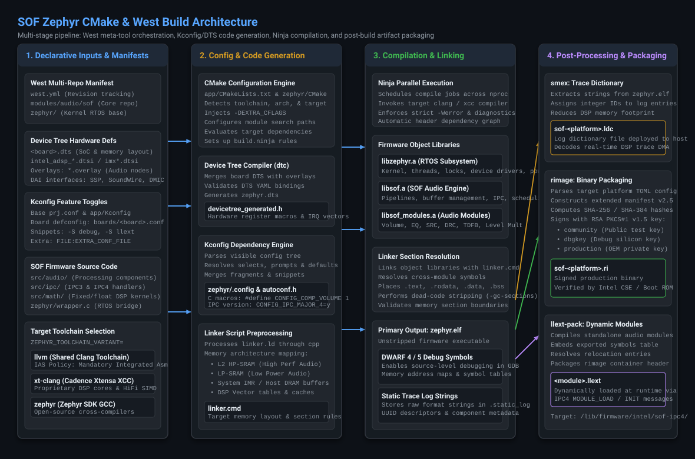
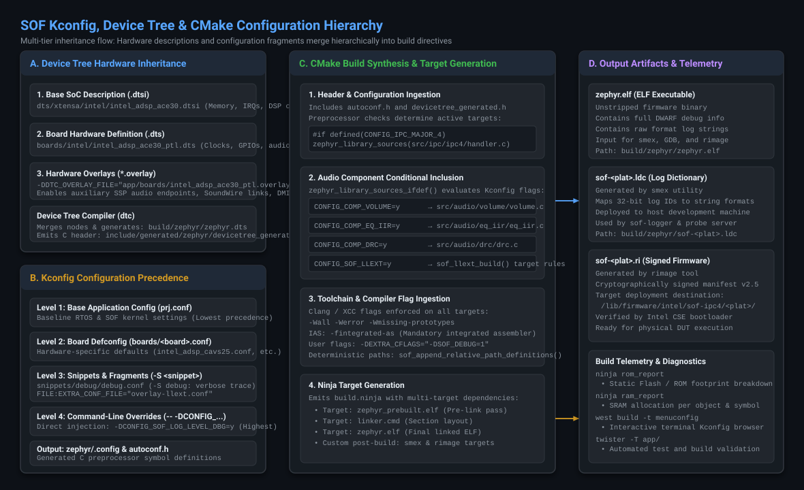

.. _cmake:

Zephyr CMake & Build Configuration
==================================

Overview & Modern Build Paradigm
--------------------------------

Sound Open Firmware (SOF) builds as a native `Zephyr RTOS <https://www.zephyrproject.org/>`_
application and module using CMake, Ninja, and the ``west`` meta-tool. This modern architecture
replaces legacy standalone build systems with a unified, reproducible build pipeline across all
supported Digital Signal Processor (DSP) architectures, microcontroller audio bridges, and host
simulation targets.

In modern SOF, the firmware is structured as a native Zephyr module (registered in
``zephyr/module.yml``) alongside the primary application entry point in ``app/``. The build system
standardizes:

* **Board & SoC Hardware Descriptions**: Declarative Device Tree source files (``.dts``, ``.dtsi``)
  and runtime hardware overlays (``.overlay``).
* **Feature Selection & Toggles**: Standardized Kconfig configuration trees, board defconfigs,
  and modular snippets.
* **Multi-Toolchain Backends**: Out-of-the-box support across three distinct compiler backends:
  Cadence Xtensa Tools (the production default for Xtensa DSP targets), the official
  Zephyr SDK (generating compliant binaries across targets, without SIMD on Xtensa),
  and the experimental LLVM/Clang toolchain (compiling HiFi for Xtensa SIMD).
* **Post-Processing & Security Pipelines**: Automated trace string dictionary extraction
  (``smex``) and cryptographic RSA binary signing (``rimage``) to generate production-ready
  firmware images (``.ri``) and dynamic loadable modules (``.llext``).

.. note::

   Always activate the Python virtual environment before executing build commands:

   .. code-block:: bash

      source .venv/bin/activate

Build System Architecture
-------------------------

The SOF build pipeline coordinates four sequential phases, orchestrated by ``west`` and
executed via CMake and Ninja:

   Figure 323: Multi-stage SOF Zephyr build pipeline: Declarative inputs, configuration & code generation, Ninja compilation, and post-build artifact packaging.

1. **Declarative Inputs & Manifests**:
   The ``west.yml`` manifest tracks exact Git revisions for the SOF core repository, the Zephyr
   kernel, hardware abstraction layers (HALs), and external libraries (CMSIS, mbedTLS). Hardware
   definitions, Kconfig feature defaults, C sources, and toolchain environments feed into the
   configuration stage.
2. **Configuration & Code Generation**:
   CMake processes ``app/CMakeLists.txt`` and ``zephyr/CMakeLists.txt``. The Device Tree Compiler
   (``dtc``) compiles hardware nodes into ``devicetree_generated.h``. The Kconfig engine resolves
   symbol dependencies, producing ``zephyr/.config`` and the C preprocessor macro header
   ``autoconf.h``. Linker scripts (``linker.ld``) are preprocessed into target memory layouts.
3. **Compilation & Section Linking**:
   Ninja schedules parallel compilation jobs across workstation CPU cores. Object libraries
   (``libzephyr.a``, ``libsof.a``, ``libsof_modules.a``) are compiled using strict diagnostic
   flags (``-Wall -Werror``) and linked into the unstripped executable ``zephyr.elf`` containing
   full DWARF debug symbols.
4. **Post-Processing & Artifact Packaging**:
   Custom post-link commands process ``zephyr.elf``:

   * ``smex`` strips static trace format strings and UUID hashes, exporting them to an external
     log dictionary (``.ldc``) to minimize DSP SRAM usage.
   * ``rimage`` constructs the manifest header (v2.5), computes cryptographic SHA-256/384 hashes,
     and digitally signs the binary using RSA PKCS#1 v1.5 keys, producing the signed production
     firmware image (``.ri``).
   * ``llext-pack`` packages dynamic loadable modules (``.llext``) for runtime component insertion.

Configuration & Overlay Hierarchy
---------------------------------

SOF utilizes a multi-tiered inheritance model for both hardware definitions and software feature
toggles, ensuring that general defaults can be surgically overridden without modifying upstream
files:

   Figure 324: Multi-tier inheritance and convergence flow of Device Tree hardware descriptions and Kconfig configuration fragments into CMake build directives.

Device Tree Resolution Hierarchy
~~~~~~~~~~~~~~~~~~~~~~~~~~~~~~~~

Hardware topology is defined through hierarchical Device Tree files:

1. **Base SoC Definition (``.dtsi``)**:
   Located in ``dts/xtensa/intel/`` or ``dts/arm/nxp/``. Defines on-chip DSP cores, interrupt
   controllers, memory regions (L2 SRAM, LP-SRAM, HP-SRAM, IMR), and hardware DMA channels.
2. **Board Hardware Definition (``.dts``)**:
   Located in ``boards/<vendor>/<board>/``. Instantiates platform clocks, external codecs, audio
   serial interfaces (SSP, SoundWire, DMIC), and GPIO routing.
3. **Runtime Hardware Overlays (``.overlay``)**:
   Passed during the build via ``-DDTC_OVERLAY_FILE="path/to/file.overlay"``. Enables testing
   auxiliary audio DAI links, alternate pin multiplexing, or development board loops.

Kconfig Configuration Precedence
~~~~~~~~~~~~~~~~~~~~~~~~~~~~~~~~

Software configuration resolves through five levels of precedence (from lowest to highest):

1. **Level 1: Base Application Config (``app/prj.conf``)**:
   Mandatory kernel and SOF baseline defaults common across all platforms.
2. **Level 2: Board Defconfig (``app/boards/<board>.conf``)**:
   Platform-specific hardware and memory configurations (e.g. enabling CAVS 2.5 vs ACE 3.0
   drivers, core count, and default IPC version).
3. **Level 3: Reusable Feature Snippets (``-S <snippet>``)**:
   Predefined modular configuration bundles in ``snippets/`` (e.g. ``-S debug`` for verbose
   tracing, ``-S llext`` for dynamic modules).
4. **Level 4: Configuration Fragments (``FILE:EXTRA_CONF_FILE``)**:
   Targeted overlay files (e.g. ``overlay-debug.conf``).
5. **Level 5: Command-Line Overrides (``-- -DCONFIG_...=y``)**:
   Direct CMake command-line flags, providing absolute override authority over all underlying files.

Target Board & Platform Matrix
------------------------------

The following table summarizes primary target boards supported in SOF:

.. list-table::
   :widths: 15 25 20 20 20
   :header-rows: 1

   * - Platform Alias
     - Zephyr Board Target (``-b``)
     - DSP Architecture
     - Hardware Platform / Target
     - Default IPC
   * - ``tgl``
     - ``intel_adsp_cavs25``
     - CAVS 2.5 (Tiger Lake)
     - Tiger Lake Reference Board / DUT
     - IPC4 / IPC3
   * - ``tgl-h``
     - ``intel_adsp_cavs25_tgph``
     - CAVS 2.5 High-Perf
     - Alder Lake-S / RPL-S
     - IPC4 / IPC3
   * - ``mtl``
     - ``intel_adsp_ace15_mtpm``
     - ACE 1.5 (Meteor Lake)
     - Meteor Lake / Arrow Lake-S (ARL-S)
     - IPC4
   * - ``lnl``
     - ``intel_adsp_ace20_lnl``
     - ACE 2.0 (Lunar Lake)
     - Lunar Lake Reference
     - IPC4
   * - ``ptl``
     - ``intel_adsp_ace30_ptl``
     - ACE 3.0 (Panther Lake)
     - Panther Lake Reference Board / DUT
     - IPC4
   * - ``ptl-sim``
     - ``intel_adsp_ace30_ptl_sim``
     - ACE 3.0 QEMU Sim
     - Host QEMU Simulator
     - IPC4
   * - ``imx8mp``
     - ``imx8mp_evk_mimx8ml8_adsp``
     - NXP i.MX 8M Plus (DSP)
     - i.MX 8M Plus EVK
     - IPC4
   * - ``imx8ulp``
     - ``imx8ulp_evk_mimx8ud7_adsp``
     - NXP i.MX 8ULP Fusion
     - i.MX 8ULP EVK
     - IPC4
   * - ``teensy41``
     - ``teensy41``
     - NXP i.MX RT1062 (M7)
     - PJRC Teensy 4.1 Bridge
     - Hostless
   * - ``esp32p4``
     - ``esp32p4``
     - Dual RISC-V @ 400 MHz
     - ESP32-P4 Loopback Card
     - Hostless

.. tip::

   Platform aliases supported by build scripts include:
   * ``tgl``: ``adl``, ``adl-n``, ``rpl``
   * ``tgl-h``: ``adl-s``, ``rpl-s``
   * ``mtl``: ``arl``, ``arl-s``

Building Firmware with West
---------------------------

Firmware compilation is invoked using ``west build`` from the root of the workspace.

Standard Build Commands
~~~~~~~~~~~~~~~~~~~~~~~

.. code-block:: bash

   # 1. Build Tiger Lake (TGL) firmware for target DUT
   west build -b intel_adsp_cavs25 -d build-tgl app/

   # 2. Build Arrow Lake (ARL-S / MTL) firmware for target DUT
   west build -b intel_adsp_ace15_mtpm -d build-arl app/

   # 3. Build Panther Lake (PTL) firmware for target DUT
   west build -b intel_adsp_ace30_ptl -d build-ptl app/

   # 4. Build Teensy 4.1 standalone audio bridge firmware
   west build -b teensy41 -d build-teensy app/

   # 5. Build ESP32-P4 audio loopback card firmware
   west build -b esp32p4 -d build-esp32 app/

Pristine and Incremental Builds
~~~~~~~~~~~~~~~~~~~~~~~~~~~~~~~

When switching between git branches, altering Kconfig symbols, or modifying linker scripts,
perform a pristine build to clean all CMake caches and temporary object directories:

.. code-block:: bash

   # Force pristine re-configuration
   west build -p always -b intel_adsp_ace30_ptl -d build-ptl app/

For routine code edits within ``src/``, run incremental builds without ``-p`` to leverage Ninja's
sub-second parallel recompilation:

.. code-block:: bash

   west build -d build-ptl

Verbose Diagnostic Output
~~~~~~~~~~~~~~~~~~~~~~~~~

To inspect the exact compiler invocations, include paths, and preprocessor defines generated by
CMake:

.. code-block:: bash

   west build -v -d build-ptl

Supported Toolchains & Compiler Policies
----------------------------------------

Sound Open Firmware supports three compiler toolchain backends, controlled via the
``ZEPHYR_TOOLCHAIN_VARIANT`` environment variable or build script options:

1. **Cadence Xtensa Tools (XCC / xt-clang)**: **Default for Xtensa DSP targets**.
   A production-grade proprietary compiler suite delivering full Cadence HiFi vector SIMD
   optimizations, vendor-tuned scheduling, and hardware core configuration support.
2. **Zephyr SDK (GCC Cross-Compilers)**: The official open-source toolchain provided by the
   Zephyr Project. It builds fully compliant binaries for each target architecture, but operates
   **without SIMD on Xtensa** (falling back to portable standard C scalar math).
3. **LLVM / Clang Toolchain (Open-Source Xtensa Fork)**: **Experimental**.
   An open-source Clang/LLVM development effort that compiles **HiFi for Xtensa SIMD** without
   requiring proprietary Cadence licenses, while enforcing a mandatory Integrated Assembler (IAS) policy.

.. list-table:: SOF Toolchain Capabilities & Comparison Matrix
   :widths: 22 18 22 20 18
   :header-rows: 1

   * - Toolchain Backend
     - Role & Status
     - Xtensa SIMD Support
     - Target Architecture Scope
     - License Requirement
   * - **Cadence Xtensa Tools**
     - **Default for Xtensa**
     - Full HiFi2 / HiFi3 / HiFi4 / HiFi5 SIMD
     - Intel cAVS/ACE, NXP i.MX DSPs
     - Proprietary (Tensilica License)
   * - **Zephyr SDK Cross-Compilers**
     - Standard Open-Source
     - **No SIMD on Xtensa** (Scalar C fallback)
     - All targets (Xtensa, ARM, RISC-V)
     - Open-Source (Apache 2.0 / GPL)
   * - **LLVM / Clang (Xtensa Fork)**
     - **Experimental Open-Source**
     - **HiFi Xtensa SIMD** (Vectorized)
     - Intel cAVS / ACE DSP targets
     - Open-Source (Apache 2.0 with LLVM Exception)

Cadence Xtensa Tools (Default for Xtensa Targets)
~~~~~~~~~~~~~~~~~~~~~~~~~~~~~~~~~~~~~~~~~~~~~~~~~

The Cadence Tensilica ``xt-clang`` and legacy ``xcc`` compilers represent the production default
toolchain for all Xtensa-based DSP targets (including Intel cAVS 1.8/2.5, Intel ACE 1.5/2.0/3.0,
and NXP i.MX audio DSPs).

* **Full HiFi SIMD Vectorization**: Generates bit-exact vector code targeting Cadence HiFi2, HiFi3,
  HiFi4, and HiFi5 SIMD engines. Critical audio processing blocks (such as Equalizer IIR/FIR, Volume,
  SRC, and Dynamic Range Compression) achieve peak cycle efficiency and minimal latency using
  hand-tuned vendor DSP intrinsics.
* **Licensing & Registry Requirements**: Requires an installed and licensed Cadence Xtensa
  Development Tools package (``XtDevTools``) matching the specific target core configuration
  overlay (e.g. ``intel_adsp_ace30_ptl``).

**Environment Setup**:

.. code-block:: bash

   # Point to the Cadence XtDevTools installation and builds registry
   export XTENSA_TOOLS_ROOT=/opt/xtensa/XtDevTools/install/tools/RI-2023.11-linux
   export XTENSA_BUILDS_DIR=/opt/xtensa/XtDevTools/install/builds/RI-2023.11-linux
   export XTENSA_SYSTEM=${XTENSA_BUILDS_DIR}/intel_adsp_ace30_ptl/config

   # Select Cadence compiler variant (xt-clang or xcc)
   export ZEPHYR_TOOLCHAIN_VARIANT=xt-clang

**Building SOF with Cadence Tools**:

* **Single-Target Build with West**:

  .. code-block:: bash

     # Build Panther Lake (PTL / ACE 3.0) firmware using Cadence xt-clang
     west build -b intel_adsp_ace30_ptl -d build-ptl-cadence app/

* **Multi-Target Batch Build**:

  When ``XTENSA_TOOLS_ROOT`` is defined in the shell environment, the build orchestration
  script automatically defaults to Cadence tools:

  .. code-block:: bash

     # Batch compile Intel platforms with Cadence default toolchain
     ./scripts/xtensa-build-zephyr.py tgl mtl ptl

Zephyr SDK Cross-Compilers (Compliant Targets, No Xtensa SIMD)
~~~~~~~~~~~~~~~~~~~~~~~~~~~~~~~~~~~~~~~~~~~~~~~~~~~~~~~~~~~~~~

The official **Zephyr SDK** contains open-source GNU cross-compilers (GCC) maintained by the
Zephyr Project.

* **Target Coverage**: The Zephyr SDK is the standard, official toolchain for non-Xtensa targets,
  such as ARM Cortex-M microcontrollers (Teensy 4.1) and RISC-V platforms (ESP32-P4).
* **Compliance on Xtensa**: The Zephyr SDK can compile valid, structurally compliant firmware
  binaries for each supported Xtensa target architecture.
* **No SIMD on Xtensa**: Upstream GCC does not support Cadence Tensilica HiFi coprocessor vector
  extensions, registers, or intrinsic instructions. Consequently, all audio processing modules
  and mathematical algorithms fall back to portable standard C scalar math. Resulting firmware
  images execute correctly with full Zephyr RTOS and SOF IPC driver compatibility, but operate
  without hardware vector SIMD acceleration.

**Environment Setup**:

.. code-block:: bash

   # Set toolchain variant to Zephyr SDK
   export ZEPHYR_TOOLCHAIN_VARIANT=zephyr
   export ZEPHYR_SDK_INSTALL_DIR=/opt/zephyr-sdk-0.16.8

**Building SOF with Zephyr SDK**:

* **Single-Target Build with West**:

  .. code-block:: bash

     # Build compliant Panther Lake (PTL) binary without Xtensa SIMD
     ZEPHYR_TOOLCHAIN_VARIANT=zephyr \
     west build -b intel_adsp_ace30_ptl -d build-ptl-zephyr app/

     # Build Teensy 4.1 ARM Cortex-M7 audio bridge
     ZEPHYR_TOOLCHAIN_VARIANT=zephyr \
     west build -b teensy41 -d build-teensy app/

* **Multi-Target Batch Build**:

  The build orchestration script provides the dedicated ``-z`` (``--zephyrsdk``) flag to
  explicitly force Zephyr SDK compilation, even when Cadence tools are installed:

  .. code-block:: bash

     # Force build of all targets using the Zephyr SDK
     ./scripts/xtensa-build-zephyr.py -z tgl mtl ptl

LLVM / Clang Toolchain (Experimental Open-Source with HiFi SIMD)
~~~~~~~~~~~~~~~~~~~~~~~~~~~~~~~~~~~~~~~~~~~~~~~~~~~~~~~~~~~~~~~~

The **LLVM / Clang toolchain** is an experimental open-source development compiler with an
out-of-tree Xtensa architecture target developed for Sound Open Firmware.

* **HiFi SIMD on Xtensa**: In contrast to GCC, the Xtensa LLVM backend is actively engineered
  to compile **HiFi for Xtensa SIMD**, enabling vector register allocation, instruction scheduling,
  and audio DSP intrinsics within an open-source toolchain.
* **Experimental Status**: The LLVM Xtensa backend is currently experimental and undergoing
  active upstreaming and compiler validation.
* **Authoritative Toolchain & Instructions**:
  The Xtensa LLVM/Clang compiler, Windowed ABI runtime builtins, and required branch integrations
  are maintained in Liam Girdwood's fork:

  * **Repository**: `lgirdwood/llvm-project <https://github.com/lgirdwood/llvm-project>`_
  * **Development Branch**: ``llvm-stable``
  * **Setup Guide**: Follow the `llvm-project README.md <https://github.com/lgirdwood/llvm-project/blob/llvm-stable/README.md>`_
    for step-by-step instructions on building the compiler, building ``compiler-rt`` builtins, and checking out
    the required ``llvm-stable`` branches across ``sof``, ``zephyr``, and ``modules/hal/xtensa``.

* **Mandatory Integrated Assembler (IAS) Policy**:
  All Clang builds for Xtensa DSP targets must utilize Clang's native Integrated Assembler
  (``-fintegrated-as``). The legacy GNU external assembler (``as``) is strictly prohibited.
  Firmware assembly source files (``.S``) must strictly comply with LLVM MC assembly syntax.

**Building SOF with LLVM / Clang**:

Compilation targeting Intel ADSP platforms via Clang is invoked through ``xtensa-build-zephyr.py`` using the
``--llvm-clang`` flag pointing to the LLVM build directory. The build script automatically generates the
target compiler wrapper that translates compiler flags and configures the LLVM Integrated Assembler:

.. code-block:: bash

   cd ${SOF_WORKSPACE}
   source .venv/bin/activate

   # Single-target build (Panther Lake / ACE 3.0)
   ./sof/scripts/xtensa-build-zephyr.py -p ptl --llvm-clang ${HOME}/work/llvm-project/build --build-dir-suffix -llvm

   # Multi-target batch build
   ./sof/scripts/xtensa-build-zephyr.py -p tgl mtl ptl --llvm-clang ${HOME}/work/llvm-project/build --build-dir-suffix -llvm

Kconfig Customization & Snippets
--------------------------------

Interactive Terminal Configurator (menuconfig)
~~~~~~~~~~~~~~~~~~~~~~~~~~~~~~~~~~~~~~~~~~~~~~

Developers can inspect, search, and modify firmware configuration options interactively:

.. code-block:: bash

   west build -t menuconfig -d build-ptl

From this interface, developers can toggle:

* Audio processing components (Volume, Mixer, EQ IIR/FIR, SRC, DRC, TDFB, Level Multiplier).
* Inter-Processor Communication versions (``CONFIG_IPC_MAJOR_3`` vs ``CONFIG_IPC_MAJOR_4``).
* Trace logging levels (``CONFIG_SOF_LOG_LEVEL_DBG``, ``CONFIG_SOF_LOG_LEVEL_INF``).
* Multicore Symmetric Multiprocessing (``CONFIG_SMP``, ``CONFIG_MP_NUM_CPUS``).

Using Zephyr Snippets
~~~~~~~~~~~~~~~~~~~~~

Zephyr Snippets provide modular, composable configuration bundles passed via ``-S <name>``:

.. code-block:: bash

   # Build PTL firmware with verbose debug logging enabled
   west build -b intel_adsp_ace30_ptl -d build-ptl app/ -- -S debug

   # Build MTL firmware with LLEXT dynamic module loading enabled
   west build -b intel_adsp_ace15_mtpm -d build-mtl app/ -- -S llext

Passing Extra Kconfig Fragments & Flags
~~~~~~~~~~~~~~~~~~~~~~~~~~~~~~~~~~~~~~~

Inject custom fragments or single preprocessor defines using the CMake delimiter ``--``:

.. code-block:: bash

   # Pass custom overlay file
   west build -b intel_adsp_cavs25 app/ -- -DFILE:EXTRA_CONF_FILE=overlay-debug.conf

   # Inject custom C compiler diagnostics
   west build -b intel_adsp_ace30_ptl app/ -- -DEXTRA_CFLAGS="-Werror -DSOF_DEBUG_HOOKS=1"

   # Override Kconfig symbol directly
   west build -b intel_adsp_ace30_ptl app/ -- -DCONFIG_SOF_LOG_LEVEL_DBG=y

Key SOF Configuration Options
~~~~~~~~~~~~~~~~~~~~~~~~~~~~~

.. list-table::
   :widths: 35 15 50
   :header-rows: 1

   * - Kconfig Symbol
     - Default
     - Architectural Purpose
   * - ``CONFIG_IPC_MAJOR_4``
     - ``y`` (ACE)
     - Enables modern Intel IPC4 message dispatcher, pipeline graph, and module protocol.
   * - ``CONFIG_IPC_MAJOR_3``
     - ``y`` (cAVS)
     - Enables legacy SOF IPC3 pipeline execution and mailbox architecture.
   * - ``CONFIG_SOF_LOG_LEVEL_DBG``
     - ``n``
     - Enables verbose sub-millisecond DSP firmware trace statements across all components.
   * - ``CONFIG_LOG_DICTIONARY_SUPPORT``
     - ``y``
     - Enables ``smex`` string dictionary extraction for zero-overhead tokenized logging.
   * - ``CONFIG_COMP_MODULE_ADAPTER``
     - ``y``
     - Enables standardized Module Adapter lifecycle interface for audio components.
   * - ``CONFIG_SOF_LLEXT``
     - ``n``
     - Enables LLEXT runtime dynamic link and loading for external audio processing modules.
   * - ``CONFIG_SMP``
     - ``y``
     - Enables multi-core Symmetric Multiprocessing scheduling across secondary DSP cores.

Automated Build Orchestration (``xtensa-build-zephyr.py``)
----------------------------------------------------------

While ``west build`` is ideal for single-target iteration, the SOF repository includes
``scripts/xtensa-build-zephyr.py`` to automate multi-platform batch compilation, cryptographic
signing, and deployable staging generation:

.. code-block:: bash

   # 1. Compile all primary Intel platforms (TGL, MTL, PTL) in parallel
   ./scripts/xtensa-build-zephyr.py tgl mtl ptl

   # 2. Build with debug overlay enabled across targets
   ./scripts/xtensa-build-zephyr.py -d tgl mtl ptl

   # 3. Create deployable directory structure with signed binaries
   ./scripts/xtensa-build-zephyr.py --deployable-build ptl

   # 4. Perform pristine rebuild of all supported platforms
   ./scripts/xtensa-build-zephyr.py -p -a

Deployable Build Output Structure
~~~~~~~~~~~~~~~~~~~~~~~~~~~~~~~~~

When invoked with ``--deployable-build``, the script generates a standardized directory tree
in ``build-sof-staging/`` matching target filesystem requirements:

.. code-block:: text

   build-sof-staging/sof/intel/sof-ipc4/
   ├── ptl/
   │   ├── community/
   │   │   └── sof-ptl.ri     # Signed with public community key
   │   ├── dbgkey/
   │   │   └── sof-ptl.ri     # Signed with debug silicon key
   │   ├── sof-ptl.ri         # Default production binary
   │   └── sof-ptl.ldc        # Smex trace dictionary file
   └── mtl/
       ├── community/
       │   └── sof-mtl.ri
       └── sof-mtl.ldc

Deploy these artifacts directly to target DUTs:

.. code-block:: bash

   # Deploy to target DUT (e.g. Panther Lake PTL)
   scp build-sof-staging/sof/intel/sof-ipc4/ptl/sof-ptl.ri root@<dut>:/lib/firmware/intel/sof-ipc4/ptl/
   scp build-sof-staging/sof/intel/sof-ipc4/ptl/sof-ptl.ldc root@<dut>:/lib/firmware/intel/sof-ipc4/ptl/

Static Memory Footprint Analysis
--------------------------------

Monitoring static memory allocation is critical on embedded DSP targets where SRAM is strictly
constrained. CMake and Ninja provide built-in telemetry targets to inspect memory usage:

Flash / ROM Usage Breakdown
~~~~~~~~~~~~~~~~~~~~~~~~~~~

.. code-block:: bash

   ninja -C build-ptl rom_report

This prints a hierarchical tree detailing read-only static memory (``.text`` and ``.rodata``)
consumed by each subsystem, library, object file, and symbol:

.. code-block:: text

   Path                                                       Size
   ================================================================
   libsof.a                                                  84210
     src/audio/volume/volume.c                                4120
     src/audio/eq_iir/eq_iir.c                                6840
     src/ipc/ipc4/handler.c                                   5120
   libzephyr.a                                               48290
     kernel/sched.c                                           3210

SRAM / RAM Allocation Breakdown
~~~~~~~~~~~~~~~~~~~~~~~~~~~~~~~

.. code-block:: bash

   ninja -C build-ptl ram_report

This analyzes read-write data sections (``.data``, ``.bss``, heap allocations, and thread stacks):

.. code-block:: text

   Path                                                       Size
   ================================================================
   libsof.a                                                  24560
     src/audio/buffer.c                                      12288
   zephyr/kernel                                              8192
     main_stack                                               4096

Troubleshooting Common Build Failures
-------------------------------------

Linker Region Overflow Errors
~~~~~~~~~~~~~~~~~~~~~~~~~~~~~

.. code-block:: text

   error: region `RAM' overflowed by 16384 bytes

* **Root Cause**: The combined footprint of static buffers, heap, and code exceeds available
  SRAM in the board's linker script.
* **Resolution**:

  1. Inspect ``ram_report`` to identify bloated static arrays or uncompressed tables.
  2. Reduce static trace logging verbosity (disable ``CONFIG_SOF_LOG_LEVEL_DBG``).
  3. Move cold initialization code to IMR or DRAM regions using linker placement macros
     (``__imr_text``).

Integrated Assembler (IAS) Syntax Errors
~~~~~~~~~~~~~~~~~~~~~~~~~~~~~~~~~~~~~~~~

.. code-block:: text

   error: <unknown>:0: error: invalid instruction mnemonic 'entry'

* **Root Cause**: An assembly file is being compiled with Clang's Integrated Assembler but contains
  GNU-specific syntax or macros incompatible with LLVM MC.
* **Resolution**: Ensure the Xtensa configuration overlay is loaded in LLVM and verify that all
  instructions conform to Clang IAS syntax. GNU ``as`` must not be used.

Missing Device Tree Node Labels
~~~~~~~~~~~~~~~~~~~~~~~~~~~~~~~

.. code-block:: text

   devicetree_generated.h:45:10: fatal error: 'DT_N_S_soc_S_ssp_0_P_reg' undeclared

* **Root Cause**: A driver is attempting to access a peripheral node label that does not exist in
  the active board Device Tree.
* **Resolution**: Inspect ``build/zephyr/zephyr.dts`` to verify node spelling, status
  (``status = "okay";``), and compatible string bindings. Inject required overlay nodes via
  ``-DDTC_OVERLAY_FILE``.

Rimage Signing Key Failures
~~~~~~~~~~~~~~~~~~~~~~~~~~~

.. code-block:: text

   rimage: error: unable to open private key file: /path/to/key.pem

* **Root Cause**: The requested RSA signing key does not exist or permissions prevent access.
* **Resolution**: For development builds, use the default public community key
  (``-k keys/otc_private_key.pem``) or pass ``--key-type-subdir community``.

