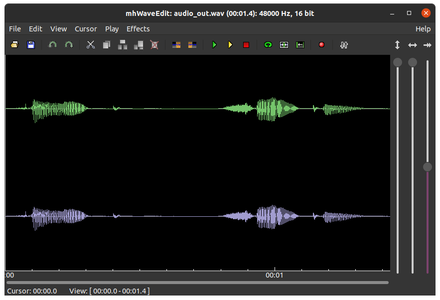

.. _build-testbench:

Build and Run Testbench
#######################

Retrieve the required firmware from the ``thesofproject`` repository in
Github as described in :ref:`build-from-scratch`. Start a shell at the
firmware repository top level in the ``$SOF_WORKSPACE/sof`` directory as also described.

.. code-block:: bash

   cd "$SOF_WORKSPACE"/sof

Run the following scripts to build the test pipelines, build the testbench,
and run the testbench with the provided quick check script:

.. code-block:: bash

   ./scripts/build-tools.sh -t
   ./scripts/rebuild-testbench.sh
   ./scripts/host-testbench.sh

The current version of ``host-testbench.sh`` outputs the following text if
the previous steps are successful:

::

   ==========================================================
   test volume with ./volume_run.sh 16 16 48000 zeros_in.raw volume_out.raw
   volume test passed!
   volume_out size check passed!
   ==========================================================
   test src with ./src_run.sh 32 32 44100 48000 zeros_in.raw src_out.raw
   src test passed!
   src_out size check passed!
   ==========================================================
   test eqiir with ./eqiir_run.sh 16 16 48000 zeros_in.raw eqiir_out.raw
   eqiir test passed!
   eqiir_out size check passed!

Note that more items are slated to be tested in this check so the output
will likely change. The testbench can be used for audio quality tests and
debugging new components under development.

host-testbench.sh
=================

In our example, the ``host-testbench.sh`` script shows that the IIR EQ test
is run with the following commands:

.. code-block:: bash

   cd tools/test/audio
   head -c 10240 < /dev/zero > zeros_in.raw
   ./eqiir_run.sh 16 16 48000 zeros_in.raw eqiir_out.raw

The directory that contains ``eqiir_run.sh`` is entered first. Next, a file
of 10240 bytes of zeros is created. As 16-bit data, it corresponds to 2560
frames of S16_LE format stereo frames (4 bytes per frame). At a 48 kHz rate,
it corresponds to 5.3 ms of audio stream. Audio test signals are usually
longer but this is sufficient for the quick testbench health check.

To process a music file with an under-development SOF component, a utility
to convert from wav, mp3, etc. to raw S16_LE/S24_LE/S32_LE format is needed.
The next command installs from the Ubuntu packages repository a lot of useful
tools for audio files converting, viewing, recording, playing, and editing.
FFMPEG can be used to import/export formats that the simpler tools ``sox``
and ``ecasound`` do not support. The last three items are light audio
waveform viewers and players with some editing and mixing capabilities.
Also, digital audio workstation (DAW) software such as Ardour, Qtractor, and
MusE can be used but there's more effort in using them for small quick tasks
such as in the following case.

.. code-block:: bash

   sudo apt install alsa-utils pulseaudio-utils sox ecasound ffmpeg audacity snd-gtk-pulse mhwaveedit

A sample music or voice or test signal file is needed. The above alsa-utils
package contains some wav files. The sound (and many other file types)
characteristics can be easily checked using this file command:

.. code-block:: bash

   $ file /usr/share/sounds/alsa/Front_Center.wav
   /usr/share/sounds/alsa/Front_Center.wav: RIFF (little-endian) data, WAVE audio, Microsoft PCM, 16 bit, mono 48000 Hz

This file has the correct default 48 kHz rate and 16 bits samples but it is
in a single channel format (mono). To fix it for testing, run the following
example command. Sox automatically converts the sample format to stereo by
duplicating the channels. Also the rate would be converted if the file would
be 44100 Hz sampled.

.. code-block:: bash

   sox /usr/share/sounds/alsa/Front_Center.wav --encoding signed-integer -L -r 48000 -c 2 -b 16 audio_in.raw

Now the testbench can be executed for the input file and the output can be
converted back to wav format:

.. code-block:: bash

   ./eqiir_run.sh 16 16 48000 audio_in.raw audio_out.raw
   sox --encoding signed-integer -L -r 48000 -c 2 -b 16 audio_out.raw audio_out.wav

The file can be played from the command line with the following command or
it can be launched to an audio editor tool such as mhWaveEdit:

.. code-block:: bash

   paplay audio_out.wav
   mhWaveEdit audio_out.wav

   Viewing the result with mhWaveEdit

Select the green **play** icon to play the clip in the application. Use the
mouse to zoom in on audio waveform details. Select the yellow **play** icon
to play a selected area.
