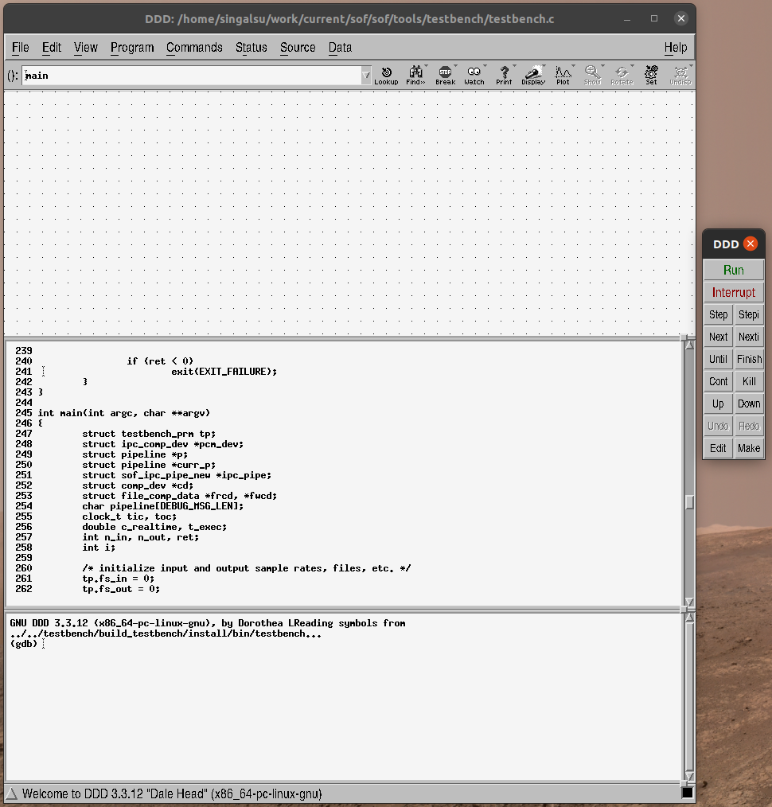
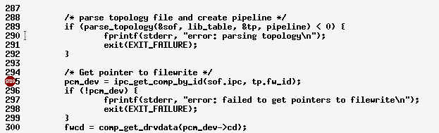
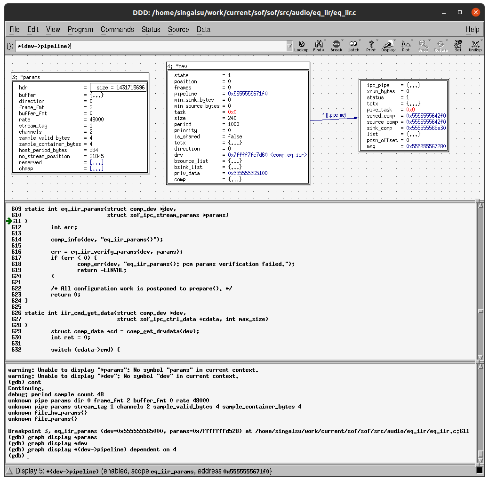

.. _debug-in-testbench:

Debug Component in Testbench
############################

GDB and DDD
***********

Code debugging with debugger is an efficient way to find issues in
components. The code may crash or operate incorrectly. The SOF data
structures can be understood better while seeing them in action.

In a testbench environment, a severe memory access mistake typically results
in a segmentation fault where the operating system traps the application when
it performs illegal memory access to RAM it has not allocated. The debugger
shows the stack trace of calls if this happens for quick spotting of
offending code.

A stable but incorrectly working component can be examined with breakpoints
and visualization of data structures.

To initiate debugging, the output from our previous IIR EQ example is
used (refer to :ref:`build-testbench`). The information for debugging is shown below:

.. code-block:: bash

   ./eqiir_run.sh 16 16 48000 audio_in.raw audio_out.raw

::

   Command:         ../../testbench/build_testbench/install/bin/testbench
   Argument:        -d -r 48000 -R 48000 -i audio_in.raw -o audio_out.raw -t ../../build_tools/test/topology/test-playback-ssp5-mclk-0-I2S-eq-iir-s16le-s16le-48k-24576k-codec.tplg -b S16_LE 
   LD_LIBRARY_PATH: ../../testbench/build_testbench/sof_ep/install/lib:../../testbench/build_testbench/sof_parser/install/lib

In the above output the command shows the path to the installed testbench
binary. The arguments specify the input and output sample rate, input
and output RAW data files, the topology to use for testing, and the sample
format. The command line options are described when invoking the binary with
switch ``-h``. But for the binary to work correctly, the dynamic libraries path must be instructed for the operating system. This is done by setting the
environment variable ``LD_LIBRARY_PATH`` to the above shown value.

.. code-block:: bash

   export LD_LIBRARY_PATH=../../testbench/build_testbench/sof_ep/install/lib:../../testbench/build_testbench/sof_parser/install/lib
   ../../testbench/build_testbench/install/bin/testbench -h

If the help text appears, the testbench binary started directly from the
command line works. Next, the testbench can be started in the Data Display
Debugger (DDD) application. DDD is a graphical front-end for the GNU
Debugger (GDB). DDD and the dependencies such as GDB needs to be installed
if it is missing from the development computer.

.. code-block:: bash

   sudo apt install ddd

The debugging is started to the previously used shell with the
``LD_LIBRARY_PATH`` set.

.. code-block:: bash

   ddd ../../testbench/build_testbench/install/bin/testbench

This opens the debugger window. From there, find the code line just after
topology parsing (currently 295) by scrolling the code window with a mouse
and placing a break point there with the right-mouse button (a red stop
sign). If issues happen at topology parsing or within the component in
instantiating in ``new()``, place the breakpoint to the ``parse_topology()``
line.

	    The ddd debugger start view.

	    Breakpoint added with right-mouse click.
	    
The breakpoint is placed after topology parsing since the component symbols
do not exist in debugger context before it is loaded by the topology. To run
the testbench until breakpoint, select **Program** -> **Run** from the menu
as shown in the image above. Then use your mouse to copy and paste the
argument line output from the previous script run and click **Run**:

::

   -d -r 48000 -R 48000 -i audio_in.raw -o audio_out.raw -t ../../build_tools/test/topology/test-playback-ssp5-mclk-0-I2S-eq-iir-s16le-s16le-48k-24576k-codec.tplg -b S16_L

The execution is now stopped to breakpoint. Since the symbols exist now, the
breakpoints can be added to the component life cycle after ``new()``. Use
the lowest window part with the prompt (gdb) for convenience.

.. code-block:: bash

   break eq_iir_cmd
   break eq_iir_params
   break eq_iir_prepare
   break eq_iir_copy
   break eq_iir_reset
   break eq_iir_free

Next, press **Cont** in the small remote control window next to the main ddd
window. The execution stops at the ``params()`` function in playback start.
To view stream parameters, mouse left-click on **params** in the function
arguments list and use the mouse to right-click "Display \*params". The same
can be done for the dev structure. The suppressed fields in brackets can be
expanded and pointers such as the field ``pipeline`` from dev can be viewed
by right-mouse clicking "Display \*()" from a viewed pointer field. The
boxes can be arranged with the mouse.

   Viewing data in ddd.

By further pressing **Cont**, the code can be run into ``prepare()``. The
next **Cont** press brings the execution to ``copy()``. A breakpoint can be
added to a known processing function:

.. code-block:: bash

   break eq_iir_s32_default

In the function, step with **Next** over code lines until the read frag
operation for the source buffer is completed. The input frame of two
channels to be consumed and produced can be added to view with the following
command:

.. code-block:: bash

   graph display x[0]@2
   graph display y[0]@2

You can also display the entire sink buffer content to see the circular
update over two periods of data. The format can be changed to hex if desired
with a right-mouse click of the data.

.. code-block:: bash

   graph display ((int16_t *)sinkb->stream.addr)[0]@192
   
.. note::

   DDD has data plotting capability but the feature does not work at the
   time of this writing. Such a feature can be useful in finding PCM code
   data glitches. For a simpler one-time view, ``.gdbinit`` can be set up
   with a macro script to plot the buffers with ``gnuplot``. Examples can be
   found via web search.

.. note::
   
   Due to code optimization with the ``-O`` flag, some symbols are optimized
   out and do not exist in context. Also, the code lines stepping may appear
   to be non-linear. The testbench can be built as a debug version with the
   cmake build type definition.

   .. code-block:: bash

      cd tools/testbench/build_testbench
      cmake -DCMAKE_BUILD_TYPE=Debug .. 
      make install

   At the time of this writing, the flag does not propagate properly
   into generated Makefiles. It may be necessary to manually edit
   ``flags.make`` to remove the ``-O3`` flags. They can be found by running:

   .. code-block:: bash

      grep -r "O3"

Valgrind
********

Valgrind is a C library run-time that does extensive checks for memory
access. It finds and reports issues that normally do not segfault the
testbench. Components with violations would keep running in the firmware but
would cause random instability and failures.

Using Valgrind is simple. The previously used command line for testbench run
is passed as an argument to the valgrind command:

.. code-block:: bash

   valgrind ../../testbench/build_testbench/install/bin/testbench -d -r 48000 -R 48000 -i audio_in.raw -o audio_out.raw -t ../../build_tools/test/topology/test-playback-ssp5-mclk-0-I2S-eq-iir-s16le-s16le-48k-24576k-codec.tplg -b S16_L

.. note::

   Valgrind finds issues from the current testbench version. The issues
   before component ``new()`` and after component ``free()`` are usually due
   to shortcuts taken in porting part of SOF to the testbench or from
   non-critical features like printing traces. Issues like these that are
   found during the component life cycle should be checked and fixed.

Gprof
*****

The hotspots of the components can be found with a profiling tool. The
functions that are called most frequently or where the majority of CPU time
is spent are the best candidates to optimize for speed.

The GNU C compiler (GCC) supports option ``-pg`` to enable the generation of
profiling data when running the executable. There is no cmake build option
for enabling profiling but the cmake files can be hand-edited to contain
``-pg`` instead of ``-g``.

A run of profiling enabled code generates the data file that is viewed with
the ``gprof`` command.

.. code-block:: bash

   ../../testbench/build_testbench/install/bin/testbench -d -r 48000 -R 48000 -i audio_in.raw -o audio_out.raw -t ../../build_tools/test/topology/test-playback-ssp5-mclk-0-I2S-eq-iir-s16le-s16le-48k-24576k-codec.tplg -b S16_L
   gprof ../../testbench/build_testbench/install/bin/testbench gmon.out
