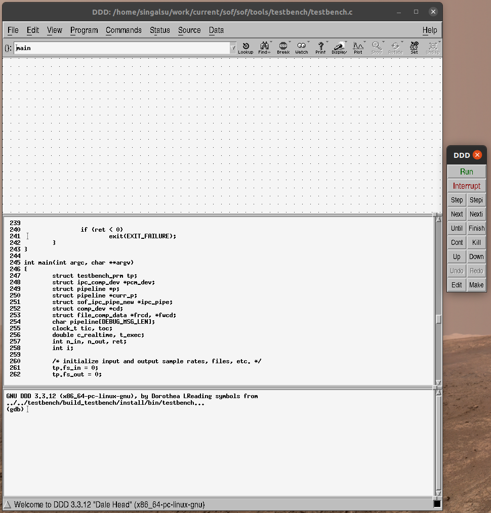
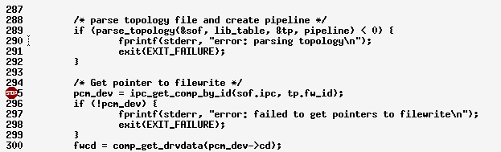
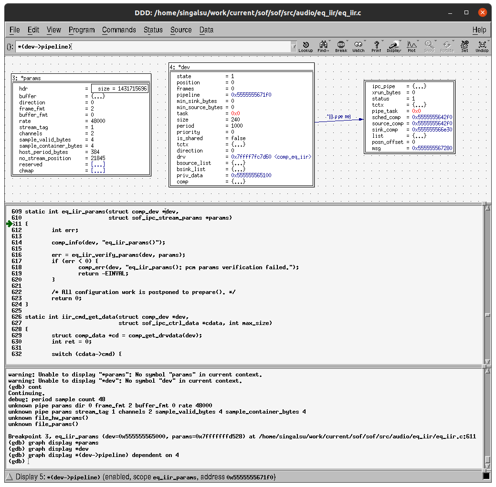

.. _debug-in-testbench:

Debug Component in Testbench
============================

Overview
--------

The Sound Open Firmware (SOF) testbench provides a fast, deterministic execution sandbox on
the host workstation (Linux x86_64) or within cycle-accurate Xtensa DSP simulators
(``xt-run``). Because it executes real SOF processing components directly from user space,
developers can leverage standard debugging, profiling, and sanitization tools without the
latency and overhead of flashing target hardware, configuring JTAG probes, or streaming live
audio over hardware buses.

In the testbench environment, memory corruption, invalid pointer dereferences, or buffer
overruns result in immediate segmentation faults or trap notifications with full backtraces,
drastically reducing debugging turn-around times.

Building Testbench with Debug Symbols
-------------------------------------

By default, production builds enable compiler optimizations (``-O3``), which may optimize
out local variables, inline critical functions, and reorder instruction sequences. For optimal
source-level debugging with GDB or LLDB, configure the CMake build with ``Debug`` mode and
disable optimizations:

.. code-block:: bash

   cd ~/work/sof-imr-work
   mkdir -p tools/testbench/build_testbench
   cd tools/testbench/build_testbench
   cmake -DCMAKE_BUILD_TYPE=Debug -DCMAKE_C_FLAGS="-O0 -g3" ..
   make -j$(nproc)
   make install

Alternatively, use the provided rebuild script:

.. code-block:: bash

   scripts/rebuild-testbench.sh

Ensure that runtime shared libraries can be located by verifying ``LD_LIBRARY_PATH`` or
running from the top-level repository tree:

.. code-block:: bash

   export LD_LIBRARY_PATH=tools/testbench/build_testbench/sof_ep/install/lib:tools/testbench/build_testbench/sof_parser/install/lib

Source-Level Debugging with GDB
-------------------------------

The native ``sof-testbench4`` binary can be launched directly inside the GNU Debugger (GDB).
Pass the complete simulation arguments after ``--args``:

.. code-block:: bash

   gdb --args tools/testbench/build_testbench/install/bin/sof-testbench4 \
       -r 48000 -c 2 -b S32_LE -p 1,2 \
       -t tools/build_tools/topology/topology2/development/sof-hda-benchmark-eqiir32.tplg \
       -i in.raw -o out.raw

Component Lifecycle Breakpoints
~~~~~~~~~~~~~~~~~~~~~~~~~~~~~~~

Every SOF processing component conforms to a well-defined lifecycle managed by the Module
Adapter interface. Setting breakpoints at each lifecycle transition allows inspecting
configuration structures, memory allocations, and audio buffers step-by-step:

.. code-block:: text

   (gdb) # 1. Topology Parsing and IPC setup
   (gdb) break tb_setup_widget_ipc
   (gdb) break tb_parse_ipc4_comp_tokens

   (gdb) # 2. Component Initialization (Allocates private context)
   (gdb) break eq_iir_init
   (gdb) break eq_iir_new

   (gdb) # 3. Parameter Configuration (Stream format, channels, sample rate)
   (gdb) break eq_iir_params

   (gdb) # 4. Preparation (Coefficient calculation, filter delay lines)
   (gdb) break eq_iir_prepare

   (gdb) # 5. Stream Processing Loop (Cyclic audio frame transformation)
   (gdb) break eq_iir_copy
   (gdb) break eq_iir_s32_default

   (gdb) # 6. Teardown and Cleanup
   (gdb) break eq_iir_reset
   (gdb) break eq_iir_free

Run the program inside GDB:

.. code-block:: text

   (gdb) run

Inspecting Component Data Structures
~~~~~~~~~~~~~~~~~~~~~~~~~~~~~~~~~~~~

When execution halts at ``comp_params()`` or ``comp_prepare()``, examine the audio stream
parameters and device context:

.. code-block:: text

   (gdb) # Inspect stream audio parameters (PCM rate, format, channel count)
   (gdb) print *params
   $1 = {direction = 0, frame_fmt = 2, rate = 48000, channels = 2, buffer_fmt = 0}

   (gdb) # Inspect the processing component device structure
   (gdb) print *dev
   $2 = {drv = 0x5555555c8120, state = 1, direction = 0, pipeline = 0x5555555e9400, ...}

   (gdb) # Inspect component-specific private state
   (gdb) print *(struct comp_data *)dev->priv_data

Inspecting Circular Audio Buffers
~~~~~~~~~~~~~~~~~~~~~~~~~~~~~~~~~

During the cyclic execution of ``comp_copy()``, the component consumes frames from its source
buffer and produces frames into its sink buffer. Inspecting the circular buffer pointers and
raw PCM contents helps identify buffer underflows, overflows, or phase misalignment:

.. code-block:: text

   (gdb) # Step into the processing loop
   (gdb) continue
   Continuing.
   Breakpoint 5, eq_iir_copy (mod=0x5555555e9480) at src/audio/eq_iir/eq_iir.c:284

   (gdb) # Inspect source and sink circular buffer metrics
   (gdb) print *sourceb
   $3 = {r_ptr = 0x7ffff7a0b000, w_ptr = 0x7ffff7a0b300, avail = 768, free = 1280, size = 2048, ...}
   (gdb) print *sinkb
   $4 = {r_ptr = 0x7ffff7a0c000, w_ptr = 0x7ffff7a0c000, avail = 0, free = 2048, size = 2048, ...}

   (gdb) # Display the first 16 interleaved 32-bit PCM samples from the source buffer
   (gdb) print /x ((int32_t *)sourceb->stream.addr)[0]@16

   (gdb) # Display output samples produced in the sink buffer
   (gdb) print /x ((int32_t *)sinkb->stream.addr)[0]@16

   (gdb) # Step over code lines to trace execution
   (gdb) next

.. tip::

   To continuously observe variables during stepping, use GDB's ``display`` command:

   .. code-block:: text

      (gdb) display ((int32_t *)sourceb->stream.addr)[0]
      (gdb) display ((int32_t *)sinkb->stream.addr)[0]

Graphical Debugging Workflows
-----------------------------

VS Code Integration
~~~~~~~~~~~~~~~~~~~

Modern IDEs such as Visual Studio Code provide visual breakpoint management, call stack
navigation, and memory viewing via the native GDB/LLDB bridge. Add the following launch
configuration to ``.vscode/launch.json``:

.. code-block:: json

   {
       "version": "0.2.0",
       "configurations": [
           {
               "name": "SOF Testbench (IPC4 GDB)",
               "type": "cppdbg",
               "request": "launch",
               "program": "${workspaceFolder}/tools/testbench/build_testbench/install/bin/sof-testbench4",
               "args": [
                   "-r", "48000",
                   "-c", "2",
                   "-b", "S32_LE",
                   "-p", "1,2",
                   "-t", "${workspaceFolder}/tools/build_tools/topology/topology2/development/sof-hda-benchmark-eqiir32.tplg",
                   "-i", "${workspaceFolder}/in.raw",
                   "-o", "${workspaceFolder}/out.raw"
               ],
               "stopAtEntry": false,
               "cwd": "${workspaceFolder}",
               "environment": [
                   { "name": "LD_LIBRARY_PATH", "value": "${workspaceFolder}/tools/testbench/build_testbench/sof_ep/install/lib" }
               ],
               "externalConsole": false,
               "MIMode": "gdb",
               "setupCommands": [
                   {
                       "description": "Enable pretty-printing for gdb",
                       "text": "-enable-pretty-printing",
                       "ignoreFailures": true
                   }
               ]
           }
       ]
   }

Classic DDD (Data Display Debugger)
~~~~~~~~~~~~~~~~~~~~~~~~~~~~~~~~~~~

For developers working in lightweight X11 environments, the Data Display Debugger (DDD)
provides graphical visualization of dynamic pointer graphs and circular data buffers:

.. code-block:: bash

   sudo apt install ddd
   ddd tools/testbench/build_testbench/install/bin/sof-testbench4

   Figure 318: The DDD debugger initial interface.

Scroll to the topology parsing sequence or component initialization and set breakpoints
using right-click:

   Figure 319: Setting component lifecycle breakpoints in DDD.

Inspect complex audio driver structs and pointer graphs visually:

   Figure 320: Visualizing pointer graphs and audio buffer structures in DDD.

Memory Leak and Safety Analysis with Valgrind
---------------------------------------------

Valgrind Memcheck executes the testbench within an instrumented virtual CPU, detecting invalid
heap memory reads/writes, out-of-bounds array access, use of uninitialized memory, and heap
memory leaks that might otherwise pass silently on host workstations but cause intermittent
crashes on embedded DSP targets.

Running Valgrind Directly
~~~~~~~~~~~~~~~~~~~~~~~~~

Invoke Valgrind directly on the testbench command line:

.. code-block:: bash

   valgrind --leak-check=full \
            --show-leak-kinds=all \
            --track-origins=yes \
            --error-exitcode=1 \
            tools/testbench/build_testbench/install/bin/sof-testbench4 \
            -r 48000 -c 2 -b S32_LE -p 1,2 \
            -t tools/build_tools/topology/topology2/development/sof-hda-benchmark-eqiir32.tplg \
            -i in.raw -o out.raw

Running Valgrind via Helper Script
~~~~~~~~~~~~~~~~~~~~~~~~~~~~~~~~~~

The ``scripts/sof-testbench-helper.sh`` script features integrated Valgrind testing via the
``-v`` switch:

.. code-block:: bash

   scripts/sof-testbench-helper.sh -v -m eqiir

.. note::

   When reviewing Valgrind reports, distinguish between one-time harness initialization
   allocations in ``testbench.c`` and leaks originating inside component lifecycle functions
   (such as missing ``rfree()`` calls inside ``comp_free()``). All component lifecycle leaks
   must be resolved before deploying firmware to physical DUTs.

Compiler Sanitizers (ASan and UBSan)
------------------------------------

AddressSanitizer (ASan) and UndefinedBehaviorSanitizer (UBSan) offer high-performance,
compiler-level memory error detection that executes significantly faster than Valgrind.
Compile the testbench with sanitizers enabled:

.. code-block:: bash

   cd tools/testbench/build_testbench
   cmake -DCMAKE_BUILD_TYPE=Debug \
         -DCMAKE_C_FLAGS="-fsanitize=address,undefined -fno-omit-frame-pointer -g" ..
   make -j$(nproc)
   make install

Run the testbench normally. If an out-of-bounds memory access, stack overflow, or integer
undefined behavior occurs, the runtime immediately aborts execution and outputs a detailed,
symbolicated call stack identifying the offending source file and line number.

Profiling and Hotspot Analysis
------------------------------

Optimizing DSP audio algorithms requires profiling CPU cycle consumption, identifying inner
loop hotspots, and verifying algorithmic Million Cycles Per Second (MCPS) budgets.

Host Workstation Profiling with Linux perf
~~~~~~~~~~~~~~~~~~~~~~~~~~~~~~~~~~~~~~~~~~

To profile host x86_64 execution and identify CPU-intensive functions:

.. code-block:: bash

   perf record -g tools/testbench/build_testbench/install/bin/sof-testbench4 \
       -r 48000 -c 2 -b S32_LE -p 1,2 \
       -t tools/build_tools/topology/topology2/development/sof-hda-benchmark-eqiir32.tplg \
       -i in.raw -o out.raw

   perf report

Cycle-Accurate DSP Profiling with Xtensa xt-run
~~~~~~~~~~~~~~~~~~~~~~~~~~~~~~~~~~~~~~~~~~~~~~~

While host profiling reveals general algorithmic complexity, it does not reflect Xtensa HiFi
DSP register architecture, VLIW SIMD execution, or zero-overhead hardware loops. Cycle-accurate
profiling requires building for an Xtensa target and simulating with Cadence ``xt-run``.

1. **Configure Environment and Build Xtensa Testbench**:

   .. code-block:: bash

      export XTENSA_TOOLS_ROOT=~/xtensa/XtDevTools
      export ZEPHYR_TOOLCHAIN_VARIANT=xt-clang
      scripts/rebuild-testbench.sh -p mtl
      source tools/testbench/build_xt_testbench/xtrun_env.sh

2. **Execute Simulation with Cycle Profiling**:

   .. code-block:: bash

      $XTENSA_PATH/xt-run --profile=profile.out \
          tools/testbench/build_xt_testbench/sof-testbench4 \
          -r 48000 -c 2 -b S32_LE -p 1,2 \
          -t tools/build_tools/topology/topology2/development/sof-hda-benchmark-eqiir32.tplg \
          -i in.raw -o out.raw

3. **Generate Call Graph and Flat Profile Report**:

   .. code-block:: bash

      $XTENSA_PATH/xt-gprof tools/testbench/build_xt_testbench/sof-testbench4 profile.out > profile-eqiir.txt
      less profile-eqiir.txt

Automated Profiling via Helper Script
~~~~~~~~~~~~~~~~~~~~~~~~~~~~~~~~~~~~~

The ``scripts/sof-testbench-helper.sh`` script automates Xtensa simulation, profiling data
collection, and report generation using the ``-x`` and ``-p`` flags:

.. code-block:: bash

   scripts/sof-testbench-helper.sh -x -m eqiir -p profile-eqiir.txt

The generated flat profile reveals cycle consumption per function call:

.. code-block:: text

   Flat profile:
                                               self      total
          cumulative       self             cycles     cycles
     %        cycles     cycles    calls     /call      /call  name
                (K)        (K)                (K)        (K)
   56.73     10144.51   10144.51   137088      0.07       0.07  iir_df1
   12.91     12453.23    2308.72     1428      1.62       8.72  eq_iir_s32_default
    3.23     13031.59     578.36     4290      0.13       3.61  module_adapter_copy
    2.22     13429.03     397.44     2860      0.14       0.67  file_process
    2.14     13811.37     382.34     3178      0.12       0.13  memmove

Batch Profiling Across Component Suites
~~~~~~~~~~~~~~~~~~~~~~~~~~~~~~~~~~~~~~~

To profile all benchmark topologies across a complete platform suite, run
``scripts/sof-testbench-build-profile.sh``:

.. code-block:: bash

   scripts/sof-testbench-build-profile.sh -p mtl -d tools/testbench/profile

The resulting reports in ``tools/testbench/profile/`` include individual flat profiles, call
trees, and estimated MCPS metrics for every processing component in the firmware repository.
