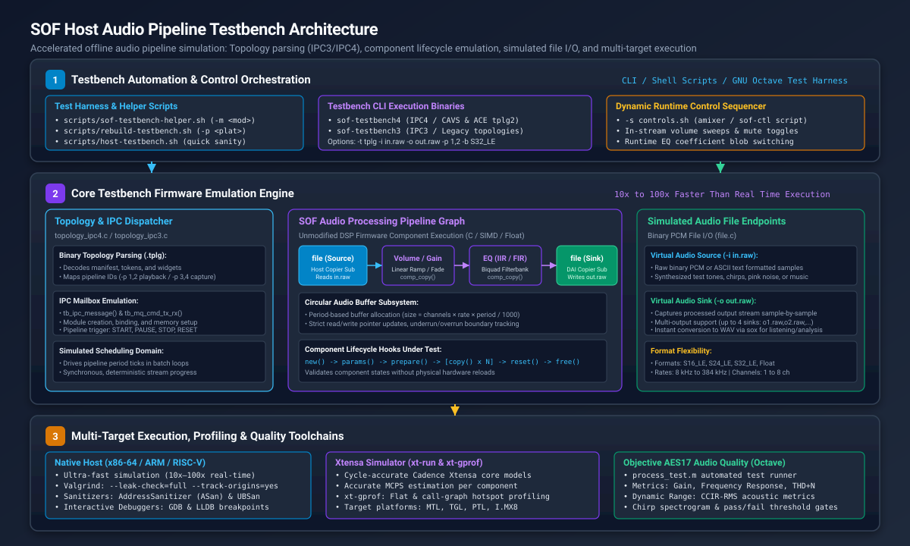
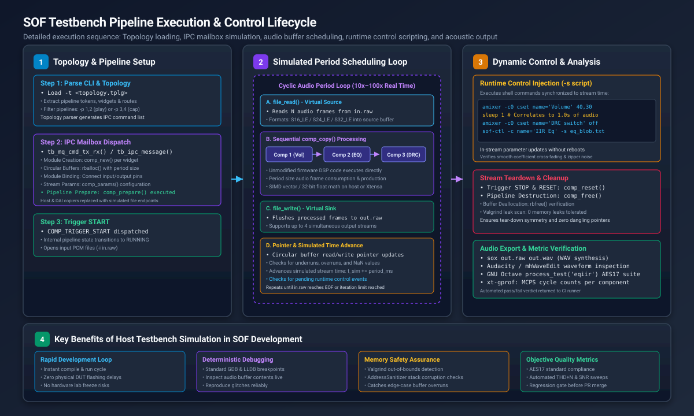

.. _testbench:

Testbench Host Audio Pipeline Simulation
########################################

The Sound Open Firmware (SOF) **Testbench** is a native host simulation environment that compiles and executes complete SOF audio processing pipelines and digital audio components offline on development workstations without requiring physical Digital Signal Processor (DSP) silicon or Device Under Test (DUT) hardware.

In the SOF firmware verification hierarchy (Level 2: Host Testbench), testbench fills the vital testing gap between component-level unit testing (Level 1: Zephyr Ztest) and cycle-accurate full-system simulation (Level 3: QEMU / Xtensa simulator). While unit tests validate individual functions in isolation, testbench instantiates full topology graphs, circular audio buffers, inter-component binding, runtime parameter propagation, and dynamic volume/EQ controls.

   Figure 316: SOF Host Audio Pipeline Testbench System Architecture across topology parsing (IPC3/IPC4), component emulation, simulated file I/O endpoints, and multi-target execution.

Key Architectural Capabilities
******************************

1. **Ultra-Fast Offline Execution**:
   Because testbench replaces physical hardware timers, audio serial ports (SSP, SoundWire, DMIC), and Direct Memory Access (DMA) controllers with file-based I/O buffers, pipelines execute as fast as the host CPU can process data. Native x86-64 and ARM64 execution typically runs **10x to 100x faster than real-time audio**, allowing multi-minute test streams to be validated in seconds.

2. **Unmodified DSP Code Execution**:
   Audio processing modules (such as Volume, Equalizer IIR/FIR, Dynamic Range Compressor, Crossover, DC Blocker, and Time-Domain Fixed Beamformer) run their actual firmware C code, 32-bit floating-point math, and generic fixed-point algorithms without test-specific modifications.

3. **Dual IPC Architecture Support**:
   Testbench provides native execution engines for both major SOF inter-processor communication architectures:
   
   * **IPC4 Engine (``sof-testbench4``)**: Simulates modern Intel CAVS and ACE platforms (Meteor Lake, Arrow Lake, Panther Lake), processing Topology 2.0 binaries, multi-pipeline routing (e.g. ``-p 1,2`` for playback, ``-p 3,4`` for capture), module adapter configurations, and large configuration blobs.
   * **IPC3 Engine (``sof-testbench3``)**: Simulates legacy SOF IPC3 platforms, parsing IPC3 topology binaries and executing legacy pipeline scheduling loops.

4. **Dynamic Runtime Control Scripting**:
   Testbench supports in-stream parameter modification using external shell scripts (``-s controls.sh``). Commands modeled after ``amixer`` and ``sof-ctl`` are synchronized with simulated stream time (using ``sleep``), allowing developers to test dynamic volume ramps, unmute transitions, and live EQ coefficient filter updates while audio is flowing.

5. **Cycle-Accurate Xtensa DSP Simulation**:
   When compiled with the Cadence Xtensa toolchain (``scripts/rebuild-testbench.sh -p <platform>``), testbench executes inside the cycle-accurate Cadence Xtensa simulator (``xt-run``). This generates exact Million Cycles Per Second (MCPS) telemetry and call-graph profiling reports (``xt-gprof``) for target DSP architectures (such as Intel CAVS 2.5 on Tiger Lake or ACE 1.5/3.0 on Arrow Lake / Panther Lake).

6. **Comprehensive Toolchain and Debugger Integration**:
   Because testbench is a standard user-space executable, developers can utilize standard Linux debugging tools, including the GNU Debugger (**GDB**), LLVM Debugger (**LLDB**), Valgrind memory leak/corruption checkers (``--leak-check=full``), and LLVM Sanitizers (**AddressSanitizer**, **UBSan**).

Pipeline Execution Lifecycle
****************************

Testbench coordinates a deterministic, multi-stage stream lifecycle that mirrors firmware behavior on physical hardware:

   Figure 317: SOF Testbench Pipeline Execution Sequence: Topology ingestion, IPC mailbox command emulation, cyclic audio period processing, dynamic control scripting, and acoustic export.

Phase 1: Topology Parsing & Graph Instantiation
===============================================

1. **Topology Ingestion (``topology_ipc4.c`` / ``topology_ipc3.c``)**:
   The user supplies a compiled binary topology file via ``-t <file.tplg>``. Testbench parses the topology manifest, extracts component tokens, widget UUIDs, buffer sizes, and routing connections.
2. **IPC Mailbox Emulation (``tb_ipc_message()`` / ``tb_mq_cmd_tx_rx()``)**:
   Testbench translates topology structures into an emulated IPC mailbox message queue. It dispatches module creation commands (invoking ``comp_new()`` for each widget) and circular audio buffer allocations (``rballoc()``).
3. **Endpoint Substitution**:
   Hardware-bound components (Host DMA Copier and DAI Copier) are automatically substituted with simulated ``file`` endpoints (``file.c``).
4. **Parameter Initialization & Preparation**:
   Stream sample rate, channel count, and bit depth parameters are configured via ``comp_params()``, followed by pipeline resource allocation via ``comp_prepare()``.

Phase 2: Stream Scheduling Loop
===============================

1. **Trigger Start**:
   The pipeline transition to ``RUNNING`` is triggered via ``COMP_TRIGGER_START``.
2. **Cyclic Period Processing**:
   Testbench enters a high-speed batch execution loop processing fixed period blocks (typically 1 ms or 48 frames at 48 kHz):
   
   * **Source Read (``file_read()``)**: Reads one period of raw PCM audio data from the input file (``-i in.raw``) into the source circular buffer.
   * **Pipeline Copy (``comp_copy()``)**: Each component in the pipeline graph is called sequentially. Data is transformed from input circular buffers to output circular buffers, advancing read and write pointers.
   * **Sink Write (``file_write()``)**: The sink endpoint extracts processed frames from the final audio buffer and flushes them to the output file (``-o out.raw``).
   * **Simulated Time Advance**: The internal simulation clock advances by the period duration (:math:`\Delta t = \frac{\text{period\_frames}}{F_s}`).

Phase 3: Dynamic Control Injection
==================================

While the period scheduling loop progresses, testbench monitors the optional control script specified by ``-s <script>``. As simulated stream time reaches the elapsed timestamps defined by ``sleep`` directives, testbench executes the corresponding mixer controls:

.. code-block:: bash

   #!/bin/sh
   # Example controls.sh: Modulate volume and EQ coefficients mid-stream
   amixer -c0 cset name='Post Mixer Analog Playback Volume' 35
   sleep 1
   amixer -c0 cset name='Post Mixer Analog Playback Volume' 50
   sleep 1
   sof-ctl -c name='Post Mixer Analog Playback IIR Eq bytes' -s tools/ctl/ipc4/eq_iir/bassboost.txt

Phase 4: Teardown and Metric Analysis
=====================================

1. **Pipeline Reset and Deallocation**:
   When the input file reaches End-Of-File (EOF) or the specified iteration count is reached, testbench issues ``COMP_TRIGGER_STOP`` and ``comp_reset()``, followed by ``comp_free()`` and buffer deallocation (``rbfree()``).
2. **Resource & Memory Leak Validation**:
   When executed under Valgrind or AddressSanitizer, testbench verifies that all allocated memory blocks are cleanly reclaimed with zero leaks or dangling references.
3. **Audio File Conversion**:
   Raw output streams (``out.raw``) are converted to standard RIFF WAV files via ``sox`` for listening, spectrogram inspection in Audacity, or objective quality verification.

Command-Line Interface (CLI) Reference
**************************************

Both ``sof-testbench4`` and ``sof-testbench3`` share a unified command-line parameter interface:

.. list-table::
   :widths: 18 20 62
   :header-rows: 1

   * - Flag
     - Argument
     - Description
   * - ``-t``
     - ``<topology.tplg>``
     - Path to the compiled binary topology file to instantiate.
   * - ``-i``
     - ``<in1.raw,in2.raw,...>``
     - Path to input raw PCM file(s). Supports up to 4 comma-separated inputs.
   * - ``-o``
     - ``<out1.raw,out2.raw,...>``
     - Path to output raw PCM file(s). Supports up to 4 comma-separated outputs.
   * - ``-p``
     - ``<p1,p2,...>``
     - Pipeline IDs to execute from the topology (e.g., ``-p 1,2`` for playback; ``-p 3,4`` for capture).
   * - ``-b``
     - ``<format>``
     - Sample format override: ``S16_LE``, ``S24_LE``, or ``S32_LE`` (default: ``S32_LE``).
   * - ``-c``
     - ``<channels>``
     - Number of input channels (e.g., ``1`` for mono, ``2`` for stereo, ``4``, ``8``).
   * - ``-n``
     - ``<channels>``
     - Number of output channels.
   * - ``-r``
     - ``<rate>``
     - Input stream sample rate in Hz (default: ``48000``).
   * - ``-R``
     - ``<rate>``
     - Output stream sample rate in Hz (default: ``48000``).
   * - ``-s``
     - ``<controls.sh>``
     - Shell script containing dynamic ``amixer``, ``sof-ctl``, and ``sleep`` commands.
   * - ``-d``
     - ``<level>``
     - Trace verbosity level: ``0`` (quiet), ``1`` (error), ``2`` (warn), ``3`` (info), ``4`` (debug).
   * - ``-C``
     - ``<count>``
     - Limit execution to a fixed number of ``comp_copy()`` iterations.
   * - ``-P``
     - ``<count>``
     - Number of dynamic pipeline iterations.
   * - ``-h``
     - None
     - Display command-line usage help text.

Automated Helper Scripts
************************

SOF provides three standard wrapper scripts located in ``scripts/`` to streamline testbench compilation, execution, and profiling:

1. ``scripts/rebuild-testbench.sh``:
   Builds the testbench binary. Supports native compilation (default), Xtensa simulator compilation (``-p <platform>``), and AFL fuzzer instrumentation (``-f``).
2. ``scripts/sof-testbench-helper.sh``:
   High-level test runner that handles WAV-to-RAW audio format conversions via ``sox``, locates default component benchmark topologies, executes testbench, and converts output back to WAV with a single command.
3. ``scripts/host-testbench.sh``:
   Quick sanity test suite that compiles and runs smoke tests for Volume, SRC, and IIR Equalizer components, verifying exit codes and output file sizes.

Quick Start: Simulating an Audio Pipeline
*****************************************

To build and run an audio pipeline test in under one minute:

.. code-block:: bash

   cd $SOF_WORKSPACE/sof

   # 1. Build host tools and native IPC4 testbench
   scripts/build-tools.sh
   scripts/rebuild-testbench.sh

   # 2. Run an IIR equalizer simulation using Front_Center.wav as input
   scripts/sof-testbench-helper.sh -m eqiir -i /usr/share/sounds/alsa/Front_Center.wav -o out.wav

   # 3. Listen to the processed output audio
   aplay out.wav

Detailed Guides
***************

Explore the dedicated guides below for comprehensive instructions on building, debugging, extending, and quality testing with the SOF Testbench:

.. toctree::
   :maxdepth: 1

   build_testbench
   debug_in_testbench
   prepare_new_component
   test_audio_quality
