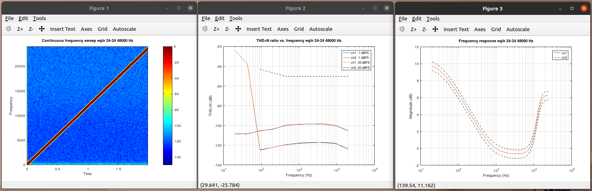

.. _test-audio-quality:

Test audio quality
##################

The directory tools/test/audio contains support for testing objective
audio quality parameters. The tests include e.g. gain, frequency
response (FR), dynamic range (DR), total harmonic distortion plus
noise (THD+N). The definitions can be found from Audio Engineering
Society's AES17 standard.

There's need to have Octave or Matlab installed to execute the
tests. Matlab is commercial product by MathWorks. GNU Octave is a free
software tool and (nearly) same m-language compatible tool that can be
used to run the same scripts. Octave and useful toolboxes for audio
development can be installed with:

.. code-block:: bash

   sudo apt install octave octave-signal octave-control octave-io

Octave can be started to correct directory for tests with:

.. code-block:: bash

   cd tools/test/audio
   octave --gui &

From Octave shell the test script for IIR EQ component can be launched
for all support sample formats:

.. code-block:: octave

   help process_test
   process_test('eqiir')

The end of test outputs a CSV format table for test results

::

   eqiir test result: Gain (dB)
   in \ out,       16,       24,       32
         16,    -7.33,        x,        x
         24,        x,    -7.33,        x
         32,        x,        x,    -7.33
   
   
   eqiir test result: Dynamic range (dB CCIR-RMS)
   in \ out,       16,       24,       32
         16,    82.43,        x,        x
         24,        x,   130.40,        x
         32,        x,        x,   149.12
   
   
   eqiir test result: Worst-case THD+N vs. frequency
   in \ out,       16,       24,       32
         16,   -54.93,        x,        x
         24,        x,   -98.01,        x
         32,        x,        x,   -99.55
   
   
   eqiir test result: Fails chirp/gain/DR/THD+N/FR
   in \ out,             16,             24,             32
         16,      0/0/0/0/0,              x,              x
         24,              x,      0/0/0/0/0,              x
         32,              x,              x,      0/0/0/0/0
   
   
   Number of passed tests = 15
   Number of failed tests = 0
   Number of non-applicable tests = 0
   Number of skipped tests = 0

The script is currently set up for batch processing in text console. To
enable graphics plot windows an edit can be done:

.. code-block:: diff

   diff --git a/tools/test/audio/process_test.m b/tools/test/audio/process_test.m
   index 1a802b462..6ec6cda2b 100644
   --- a/tools/test/audio/process_test.m
   +++ b/tools/test/audio/process_test.m
   @@ -48,8 +48,8 @@ t.full_test = 1;                       % 0 is quick check only, 1 is full set
    %  visibility set to to 0 only console text is seen. The plots are
    %  exported into plots directory in png format and can be viewed from
    %  there.
   -t.plot_close_windows = 1;  % Workaround for visible windows if Octave hangs
   -t.plot_visible = 'off';    % Use off for batch tests and on for interactive
   +t.plot_close_windows = 0;  % Workaround for visible windows if Octave hangs
   +t.plot_visible = 'on';     % Use off for batch tests and on for interactive
    t.files_delete = 1;        % Set to 0 to inspect the audio data files
    
    %% Prepare

When e.g. test for 24 bit to 24 bit output is executed with
process_test('eqiir', 24, 24) the following plots are generated. They
are useful to visually gain more insight about component's
characteristics.

   Test results for EQ IIR component: Chirp spectrogram, THD+N frequency sweep, measured FR.

For new components development when the test set is suitable, e.g. the
previous example "newcomp", this script needs small a addition. Also
there's need to create a newcomp_run.sh based on existing examples
found in the same directory. Also more customization can be done as
e.g. for re-defining the test pass/fail criteria for EQ components.

.. code-block:: diff

   diff --git a/tools/test/audio/process_test.m b/tools/test/audio/process_test.m
   index fd9055cae..1a802b462 100644
   --- a/tools/test/audio/process_test.m
   +++ b/tools/test/audio/process_test.m
   @@ -373,7 +373,7 @@ end
    function test = test_run_process(test, t)
    
    switch lower(test.comp)
   -       case {'eqiir', 'eqfir', 'dcblock', 'volume', 'tdfb'}
   +       case {'eqiir', 'eqfir', 'dcblock', 'volume', 'tdfb', 'newcomp'}
                  test.ex = sprintf('./%s_run.sh', lower(test.comp));
           otherwise
                   error('Unknown component');

