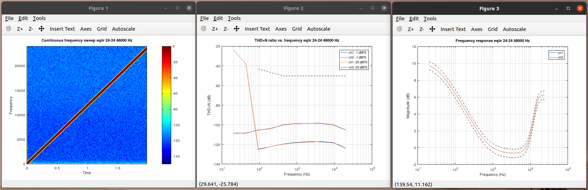
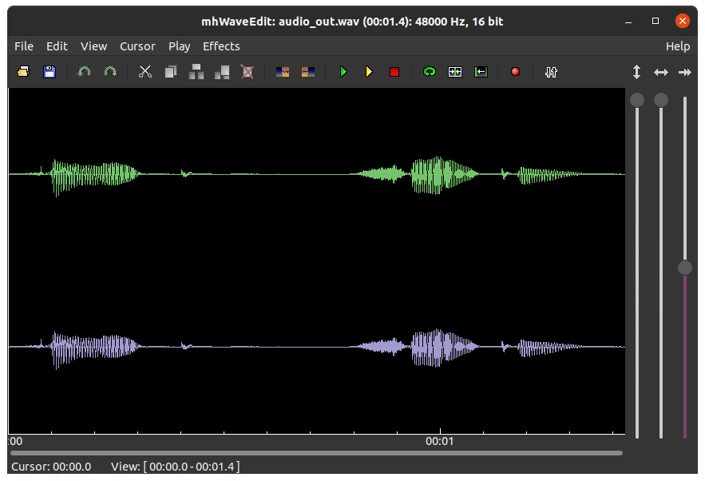

.. _test-audio-quality:

Test Audio Quality
==================

Overview
--------

Objective electroacoustic measurement is essential to verify that audio processing components
(such as equalizers, dynamic range compressors, sample rate converters, and beamformers) meet
rigorous acoustic and mathematical specifications.

The Sound Open Firmware (SOF) repository includes an automated, objective audio quality test
suite located in ``tools/test/audio/``. Built around the **AES17 standard** (the Audio
Engineering Society standard method for digital audio equipment measurement), this test
harness executes simulated audio pipelines via ``sof-testbench4`` or ``xt-run``, captures the
output PCM waveforms, and performs mathematical analysis of gain accuracy, frequency response,
dynamic range, and harmonic distortion.

AES17 Objective Measurement Metrics
-----------------------------------

The audio quality harness evaluates the following core parameters:

- **Gain Accuracy (dB)**:
  Measures the difference between the nominal and measured output signal level at 997 Hz.
  Verifies that processing algorithms maintain linear scaling across all word lengths and
  internal bit depths.
- **Frequency Response (FR)**:
  Evaluates the magnitude transfer function across the audible audio band (20 Hz to 20 kHz or
  Nyquist frequency limit). The measured response is verified against theoretical tolerance
  masks (such as ±0.5 dB passband ripple).
- **Dynamic Range (DR)**:
  Measured in dB CCIR-RMS in accordance with AES17 Section 8. Evaluated by stimulating the
  component with a low-level -60 dBFS test tone, removing the fundamental frequency with a
  notch filter, and measuring residual noise floor with CCIR weighting.
- **Total Harmonic Distortion plus Noise (THD+N)**:
  Quantifies non-linear distortion artifacts and harmonic spurs across a swept sine signal.
  Calculated as the ratio of the RMS sum of all harmonic components plus noise to the RMS
  amplitude of the fundamental tone.
- **Chirp Spectrogram Analysis**:
  A logarithmic frequency sweep (chirp) detects anti-aliasing filter leakage, digital clipping,
  asymmetric saturation, and non-linear phase distortion.

Prerequisites and Environment Setup
-----------------------------------

The test harness runs under either **GNU Octave** (recommended for open-source workflows) or
**MathWorks MATLAB**.

Install GNU Octave and Required Toolboxes
~~~~~~~~~~~~~~~~~~~~~~~~~~~~~~~~~~~~~~~~~

On Ubuntu or Debian workstations:

.. code-block:: bash

   sudo apt install octave octave-signal octave-control octave-io

On Fedora workstations:

.. code-block:: bash

   sudo dnf install octave octave-signal octave-control octave-io

Directory Layout
~~~~~~~~~~~~~~~~

The test harness resides in ``tools/test/audio/``:

- ``process_test.m``: Main test runner and AES17 metric calculator.
- ``comp_run.sh``: Underlying shell wrapper invoking ``sof-testbench4`` or ``xt-run``.
- ``test_utils/``: Octave/MATLAB helper routines for signal generation and filtering.
- ``std_utils/``: Standard mathematical and DSP utility routines.
- ``plots/``: Exported PNG graphs and spectrograms.
- ``reports/``: Exported CSV performance summaries.

Running Audio Quality Tests with process_test.m
-----------------------------------------------

Function Invocation Syntax
~~~~~~~~~~~~~~~~~~~~~~~~~~

The primary test entry point is ``process_test()``:

.. code-block:: octave

   [n_fail, n_pass, n_na] = process_test(comp, bits_in_list, bits_out_list, fs, fulltest, show_plots, xtrun)

Parameters:

- ``comp``: Component identifier string (e.g. ``'eqiir'``, ``'eqfir'``, ``'volume'``, ``'drc'``, ``'src'``, ``'tdfb'``).
- ``bits_in_list``: Array of input PCM bit depths to test (e.g. ``[16, 24, 32]`` or ``32``).
- ``bits_out_list``: Array of output PCM bit depths to test (e.g. ``[16, 24, 32]`` or ``32``).
- ``fs``: Sampling frequency in Hertz (default: ``48000``).
- ``fulltest``: ``0`` for rapid single-frequency smoke test; ``1`` for complete AES17 swept test.
- ``show_plots``: ``0`` for headless/batch execution; ``1`` to display interactive plot windows; ``2`` to display plots and preserve temporary audio PCM files.
- ``xtrun``: Optional simulator string (e.g. ``''`` for native host testbench, or ``'xt-run --turbo'`` for cycle-accurate Xtensa simulation).

Interactive Execution in GNU Octave
~~~~~~~~~~~~~~~~~~~~~~~~~~~~~~~~~~~

To run interactively from the Octave prompt:

.. code-block:: bash

   cd tools/test/audio
   octave --gui

Inside Octave, execute a full evaluation for the IIR equalizer:

.. code-block:: octave

   pkg load signal io;
   process_test('eqiir', [16 24 32], [16 24 32], 48000, 1, 1);

Headless Execution via Command Line
~~~~~~~~~~~~~~~~~~~~~~~~~~~~~~~~~~~

Run headlessly directly from bash:

.. code-block:: bash

   cd tools/test/audio
   octave -q --eval "pkg load signal io; [n_fail]=process_test('eqiir', 32, 32, 48000, 1, 0); exit(n_fail)"

Cycle-Accurate Xtensa Simulation Testing
~~~~~~~~~~~~~~~~~~~~~~~~~~~~~~~~~~~~~~~~

Run objective audio quality verification directly through the Cadence Xtensa simulator:

.. code-block:: octave

   process_test('eqiir', 32, 32, 48000, 1, 0, 'xt-run --turbo');

Interpreting Test Results
-------------------------

Upon completion, ``process_test.m`` outputs formatted CSV matrix tables detailing performance
across word lengths:

.. code-block:: text

   eqiir test result: Gain (dB)
   in \ out,       16,       24,       32
         16,    -7.33,        x,        x
         24,        x,    -7.33,        x
         32,        x,        x,    -7.33

   eqiir test result: Dynamic range (dB CCIR-RMS)
   in \ out,       16,       24,       32
         16,    82.43,        x,        x
         24,        x,   130.40,        x
         32,        x,        x,   149.12

   eqiir test result: Worst-case THD+N vs. frequency
   in \ out,       16,       24,       32
         16,   -54.93,        x,        x
         24,        x,   -98.01,        x
         32,        x,        x,   -99.55

   eqiir test result: Fails chirp/gain/DR/THD+N/FR
   in \ out,             16,             24,             32
         16,      0/0/0/0/0,              x,              x
         24,              x,      0/0/0/0/0,              x
         32,              x,              x,      0/0/0/0/0

   Number of passed tests = 15
   Number of failed tests = 0
   Number of non-applicable tests = 0
   Number of skipped tests = 0

Understanding Pass/Fail Criteria
~~~~~~~~~~~~~~~~~~~~~~~~~~~~~~~~

- **Gain**: Verified against expected filter insertion loss within ±0.1 dB.
- **Dynamic Range**: Must exceed defined acoustic noise floor minimums (≥ 80 dB for 16-bit, ≥ 120 dB for 24-bit, ≥ 140 dB for 32-bit).
- **THD+N**: Worst-case distortion across 20 Hz to 20 kHz must remain below component tolerance thresholds (e.g. < -90 dBFS for 24/32-bit processing).
- **Frequency Response**: Measured curve must fit within upper and lower tolerance envelopes across all audible octaves.

Visualizing Plots and Spectrograms
----------------------------------

When ``show_plots`` is set to ``1`` or ``2``, the harness generates three diagnostic plots:

   Figure 321: Test results for EQ IIR component: Chirp spectrogram (top), THD+N frequency sweep (bottom left), and measured frequency response against tolerance mask (bottom right).

1. **Logarithmic Chirp Spectrogram (Top)**:
   Displays time-frequency distribution of the swept sine stimulus. Harmonic spurs, aliasing
   ghosts, or truncation noise appear as spurious diagonal or horizontal artifacts.
2. **THD+N vs. Frequency (Bottom Left)**:
   Plots total harmonic distortion plus noise from 20 Hz to Nyquist limit against the maximum
   allowable distortion ceiling.
3. **Frequency Response vs. Theoretical Envelope (Bottom Right)**:
   Compares the actual simulated response against the mathematical filter response calculated
   from coefficients.

Inspecting Waveforms with Audio Editors
~~~~~~~~~~~~~~~~~~~~~~~~~~~~~~~~~~~~~~~

When debugging audio dropouts, initial state clicks, or DC bias, inspect the exported RAW PCM
files using waveform visualizers such as ``mhWaveEdit`` or Audacity:

.. code-block:: bash

   sudo apt install mhwaveedit
   mhwaveedit out.raw

   Figure 322: Inspecting processed audio waveforms and transient responses in mhWaveEdit.

Extending Audio Quality Tests for New Components
------------------------------------------------

To integrate a new component (e.g. ``newcomp``) into the objective audio test harness:

1. **Configure Execution Wrapper**:
   Add a component configuration block to ``tools/test/audio/comp_run.sh`` or create a
   dedicated ``newcomp_run.sh`` script specifying the benchmark topology:

   .. code-block:: bash

      COMP=newcomp
      DIRECTION=playback
      TESTBENCH=sof-testbench4

2. **Register in process_test.m**:
   Add the component identifier to the configuration handler in ``process_test.m``:

   .. code-block:: octave

      switch t.comp
          case {'eqiir', 'eqfir', 'dcblock', 'volume', 'tdfb', 'newcomp'}
              % Standard linear processing components
          case 'newcomp'
              % Optional: inject runtime controls via amixer or sof-ctl
              test.extra_opts = '-s tools/ctl/ipc4/newcomp/default.sh';
      end

3. **Define Pass/Fail Thresholds**:
   Specify customized tolerance masks and distortion ceilings:

   .. code-block:: octave

      test.g_db_tol = 0.05;      % Stricter 0.05 dB gain tolerance
      test.thdnf_max = -92;      % Minimum -92 dB THD+N
      test.dr_db_min = 125;      % Minimum 125 dB Dynamic Range

Automated CI and Regression Testing
-----------------------------------

The objective quality harness is fully scriptable for automated Continuous Integration (CI).
A simple shell script executes regression sweeps and halts with non-zero exit codes if any
audio quality regressions are detected:

.. code-block:: bash

   #!/bin/bash
   set -e

   cd tools/test/audio
   octave -q --eval "
       pkg load signal io;
       components = {'volume', 'eqiir', 'eqfir', 'dcblock'};
       total_fail = 0;
       for i = 1:length(components)
           fprintf('Testing component: %s\n', components{i});
           [n_fail] = process_test(components{i}, 32, 32, 48000, 1, 0);
           total_fail = total_fail + n_fail;
       end
       exit(total_fail);
   "

All generated diagnostic plots and CSV reports are written to ``tools/test/audio/plots/`` and
``tools/test/audio/reports/`` for automated CI artifact archiving and trend analysis.

