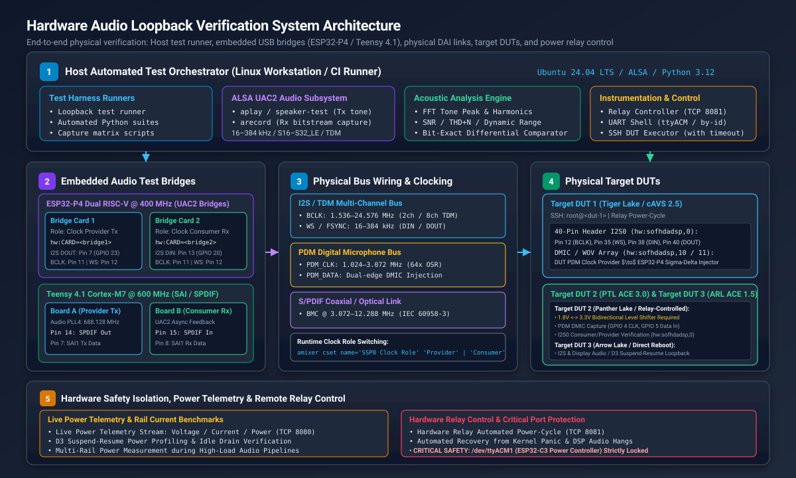
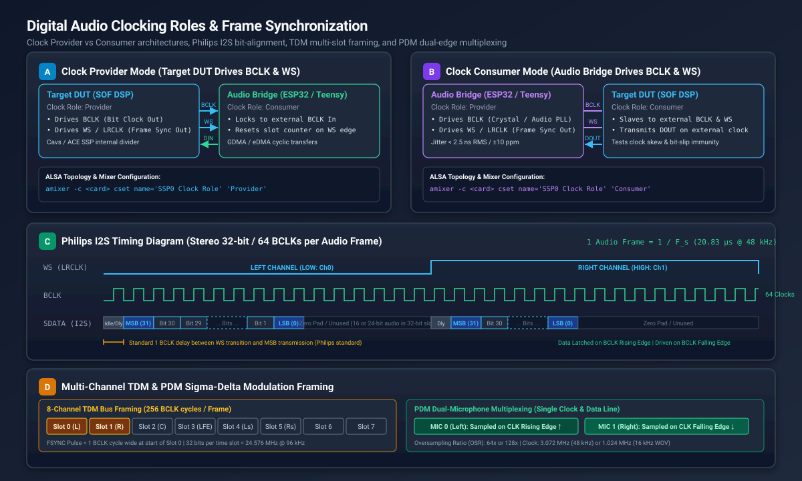

.. _sof_hardware_loopback_testing:

Hardware Audio Loopback Verification
####################################

Hardware audio loopback testing provides automated, bit-exact and acoustic verification of Sound Open Firmware (SOF) audio processing pipelines, digital audio interfaces (DAI), and platform drivers across physical development silicon.

While host-based unit tests (such as Zephyr Ztest and Twister) and kernel driver unit tests (ktest) validate software logic, state machines, and API contracts, they cannot detect physical hardware anomalies:

* **Clock Drift and Jitter**: Fractional frequency discrepancies between independent Phase-Locked Loops (PLLs) and Audio PLL clock roots.
* **Bus Bit-Slip and Phase Misalignment**: Sample-level shifts caused by serial controller FIFO threshold mismatches, Direct Memory Access (DMA) burst timing, or improper word select (WS) delay.
* **Pin Multiplexing and Slew Conflicts**: Incorrect SoC GPIO pad configurations, signal reflection, or drive-strength degradation at high bit clock frequencies.
* **Acoustic and Spectral Degradation**: Non-linear harmonic distortion (THD), clipping, or signal-to-noise ratio (SNR) degradation introduced by integer-to-float conversions, Equalizer (EQ) filter quantization, or Dynamic Range Compression (DRC) rounding.
* **Digital Microphone Modulation Faults**: Phase cancellation or decimated noise in Pulse Density Modulation (PDM) streams sampled on rising vs. falling clock edges.

By coupling physical Device Under Test (DUT) hardware—including Intel cAVS and ACE platforms (such as Tiger Lake, Panther Lake, and Arrow Lake)—with dedicated embedded audio test bridges (**ESP32-P4** and **Teensy 4.1**), SOF automated test suites validate complete audio pipelines in both **Clock Provider** and **Clock Consumer** modes without requiring manual oscilloscope probing.

   Hardware Audio Loopback System Architecture across host test runners, embedded bridges, physical DAI buses, target DUTs, and Saleae bus analyzers.

System Architecture
*******************

The SOF hardware loopback architecture is structured into five operational tiers:

1. **Host Automated Test Orchestration**:
   A Linux workstation runs automated audio loopback test suites (using Python test runners, ALSA command-line streaming utilities, or capture matrix scripts). The orchestrator coordinates stream generation, stream capture, DUT control over network SSH, serial UART console configuration, and acoustic analysis.

2. **ALSA USB Audio Class 2.0 (UAC2) Subsystem**:
   The test bridges enumerate as standard, class-compliant USB Audio Class 2.0 multi-channel audio devices on the host. Standard ALSA utilities (``aplay``, ``arecord``, ``speaker-test``) stream multi-rate audio bitstreams into and out of the bridge hardware.

3. **Embedded Audio Test Bridges**:
   Dedicated microcontrollers bridge host USB audio to physical digital audio buses:
   
   * **ESP32-P4 (Dual RISC-V @ 400 MHz)**: High-performance controller with single-precision floating-point unit (FPU) and General Direct Memory Access (GDMA). Configured as dual-card loopback pairs (Transmitter and Receiver) or dedicated target DUT bridges.
   * **Teensy 4.1 (NXP i.MX RT1062 Cortex-M7 @ 600 MHz)**: High-speed audio platform featuring on-chip Audio PLL4 (688.128 MHz), Synchronous Audio Interface (SAI), and native S/PDIF transceivers. Configured as a cross-connected pair (Board A and Board B).

4. **Physical Digital Audio Interfaces (DAI)**:
   Physical header wiring links the bridges directly to DUT expansion headers:
   
   * **I2S / TDM Multi-Channel Bus**: Bit clock (BCLK), frame synchronization (WS / FSYNC / LRCLK), serial data in (DIN), and serial data out (DOUT).
   * **PDM Digital Microphone Bus**: High-frequency PDM clock and single-bit sigma-delta modulated bitstream with dual-microphone edge multiplexing.
   * **S/PDIF Coaxial Link**: Biphase Mark Coded (BMC) IEC 60958-3 digital audio stream running at line rates up to 12.288 MHz.
   * **Common Reference Ground Network**: Low-impedance common ground reference preventing ground loop hum and logic threshold floating.

5. **Hardware Instrumentation and Safety Isolation**:
   A **Saleae Logic Pro 8** high-speed logic analyzer monitors physical bus transitions, measuring clock frequency, duty cycle, and RMS period jitter. Lab power distribution is managed via a dedicated ESP32-C3 relay server with strict port lockout policies.

Audio Test Bridge Hardware and Pinout Specifications
****************************************************

SOF testing employs specific microcontroller platforms with dedicated physical wiring harnesses.

ESP32-P4 Dual RISC-V Audio Bridge
=================================

The ESP32-P4 Function EV Board provides dual 400 MHz RISC-V cores with hardware FPU, supporting full-duplex 32-bit floating-point DSP processing, parametric Equalization (EQ), and Dynamic Range Compression (DRC) with only 10.4% CPU load.

Example: Dual-Card Loopback Wiring (Transmitter to Receiver)
-------------------------------------------------------------

For automated loopback testing without requiring a physical DUT boot, two bridge boards (Transmitter Board and Receiver Board) can be cross-connected back-to-back using 7 jumper wires on header J1:

.. list-table::
   :widths: 8 18 24 24 16 10
   :header-rows: 1

   * - Wire #
     - Bus / Signal
     - Transmitter (Provider Tx)
     - Receiver (Consumer Rx)
     - Header J1 Pins
     - Color
   * - 1
     - **I2S0 Data**
     - GPIO 23 (I2S DOUT / Tx Data)
     - GPIO 20 (I2S DIN / Rx Data)
     - Pin 7 -> Pin 13
     - Yellow
   * - 2
     - **I2S0 Bit Clock**
     - GPIO 21 (I2S BCLK)
     - GPIO 21 (I2S BCLK)
     - Pin 11 <-> Pin 11
     - Green
   * - 3
     - **I2S0 Frame Sync**
     - GPIO 22 (I2S WS / Word Select)
     - GPIO 22 (I2S WS / Word Select)
     - Pin 12 <-> Pin 12
     - Blue
   * - 4
     - **I2S Ground**
     - GND (Digital Ground Reference)
     - GND (Digital Ground Reference)
     - Pin 14 <-> Pin 14
     - Black
   * - 5
     - **PDM0 Data**
     - GPIO 5 (PDM DOUT / Modulated Out)
     - GPIO 3 (PDM DIN / PDM In)
     - Pin 16 -> Pin 19
     - Orange
   * - 6
     - **PDM0 Bit Clock**
     - GPIO 4 (PDM CLK / Clock Out)
     - GPIO 4 (PDM CLK / Clock In)
     - Pin 18 <-> Pin 18
     - White
   * - 7
     - **PDM Ground**
     - GND (Digital Ground Reference)
     - GND (Digital Ground Reference)
     - Pin 20 <-> Pin 20
     - Black

Example: Tiger Lake (cAVS 2.5) 40-Pin Header DUT to ESP32-P4 Pin Map
-----------------------------------------------------------------------

As an illustrative wiring configuration, an Intel Tiger Lake (TGL / cAVS 2.5) DUT connects to an ESP32-P4 bridge card via its 40-pin expansion header for ``capmat`` capture matrix and loopback testing:

.. list-table::
   :widths: 16 20 16 22 14 12
   :header-rows: 1

   * - Signal
     - Function
     - Target DUT 40-Pin Header
     - Intel TGL SoC Pad
     - ESP32-P4 GPIO
     - Direction (ESP32-P4)
   * - **I2S_CLK**
     - Bit Clock (BCLK)
     - Pin 12
     - ``71:INT34C5:00``
     - GPIO 21 (Pin 11)
     - Input (Consumer) / Output (Provider)
   * - **I2S_FRM**
     - Frame Sync (WS / LRCLK)
     - Pin 35
     - ``72:INT34C5:00``
     - GPIO 22 (Pin 12)
     - Input (Consumer) / Output (Provider)
   * - **I2S_DIN**
     - DUT Capture In
     - Pin 38
     - ``74:INT34C5:00``
     - GPIO 23 (Pin 7 DOUT)
     - Output (Host Playback -> DUT Record)
   * - **I2S_DOUT**
     - DUT Playback Out
     - Pin 40
     - ``73:INT34C5:00``
     - GPIO 20 (Pin 13 DIN)
     - Input (DUT Playback -> Host Capture)
   * - **PDM_CLK**
     - PDM Clock
     - Header Pin
     - DMIC IP Clock
     - GPIO 4 (Pin 18)
     - Input (Consumer) / Output (Provider)
   * - **PDM_DOUT**
     - PDM Modulated Out
     - Header Pin
     - DMIC Sigma-Delta Data
     - GPIO 5 (Pin 16)
     - Output (Host -> DUT DMIC Record)
   * - **GND**
     - Common Ground
     - Pins 6, 14, 39
     - Ground
     - GND (Pins 14, 20)
     - Reference Ground

Example: Panther Lake (ACE 3.0) PDM & I2S Pin Map
-------------------------------------------------

As an illustrative example of an ACE-generation platform with a capture-only digital microphone interface, an Intel Panther Lake (PTL / ACE 3.0) DUT connects to an ESP32-P4 bridge card where the DUT generates the PDM clock and the bridge injects a modulated bitstream:

* **PDM Bit Clock (GPIO 4 / Pin 18)**: Driven by DUT DMIC IP into ESP32-P4.
* **PDM Modulated Data Out (GPIO 5 / Pin 16)**: Sigma-Delta bitstream driven by ESP32-P4 into DUT DMIC capture.
* **I2S Bit Clock (GPIO 21 / Pin 11)**: Bidirectional BCLK for I2S audio verification.
* **I2S Frame Sync (GPIO 22 / Pin 12)**: Bidirectional WS / LRCLK for I2S audio verification.
* **I2S Data In (GPIO 20 / Pin 13)**: DUT Playback -> Host Capture.
* **I2S Data Out (GPIO 23 / Pin 7)**: Host Playback -> DUT Record.

Teensy 4.1 Audio Bridge (NXP i.MX RT1062)
=========================================

The lab utilizes two PJRC Teensy 4.1 development boards running SOF with Zephyr UAC2 firmware. The NXP i.MX RT1062 features an internal 688.128 MHz Audio PLL (PLL4), providing fractional frequency synthesis for bit-exact 48.000 kHz, 96.000 kHz, and 192.000 kHz audio.

.. list-table::
   :widths: 18 16 22 24 20
   :header-rows: 1

   * - Signal
     - Teensy Pin
     - RT1062 Pad
     - Function
     - Direction (Board A -> Board B)
   * - **SAI1 MCLK**
     - Pin 23
     - ``GPIO_AD_B1_00``
     - 12.288 MHz Reference Clock (MCLK)
     - Board A (Out) -> Board B (In)
   * - **SAI1 BCLK**
     - Pin 21
     - ``GPIO_AD_B1_02``
     - Bit Clock (1.536–24.576 MHz)
     - Board A (Out) -> Board B (In)
   * - **SAI1 FSYNC**
     - Pin 20
     - ``GPIO_AD_B1_01``
     - Word Select / Frame Sync
     - Board A (Out) -> Board B (In)
   * - **SAI1 TX_DATA0**
     - Pin 7
     - ``GPIO_B1_01``
     - I2S Transmit Serial Data
     - Board A Pin 7 -> Board B Pin 8
   * - **SAI1 RX_DATA0**
     - Pin 8
     - ``GPIO_B1_00``
     - I2S Receive Serial Data
     - Board B Pin 8 <- Board A Pin 7
   * - **SPDIF OUT**
     - Pin 14
     - ``GPIO_AD_B1_02`` (ALT3)
     - S/PDIF BMC Transmit (Fast Slew)
     - Board A Pin 14 -> Board B Pin 15
   * - **SPDIF IN**
     - Pin 15
     - ``GPIO_AD_B1_03`` (ALT3)
     - S/PDIF BMC Receive (Fast Slew)
     - Board B Pin 15 <- Board A Pin 14
   * - **GND**
     - GND
     - Common Ground
     - Reference Ground
     - Direct ground tie

Lab USB Device Identification Mapping
=====================================

To ensure reproducible test automation across reboots and USB reconnections, devices must be accessed via their persistent ``/dev/serial/by-id/`` paths rather than volatile ``/dev/ttyACM*`` device nodes:

.. list-table::
   :widths: 16 16 16 28 24
   :header-rows: 1

   * - Board Role
     - Target Hardware
     - Chip / MCU
     - Persistent By-ID Device Path
     - ALSA Card Name / Devices
   * - **ESP32-P4 Board 1**
     - Target DUT 1 (cAVS 2.5)
     - ESP32-P4
     - ``/dev/serial/by-id/usb-1a86_USB_Single_Serial_5B7B029850-if00``
     - ``dut1_i2s`` (``hw:Audio,0``), ``dut1_pdm`` (``hw:Audio,1``)
   * - **ESP32-P4 Board 2**
     - Target DUT 2 (ACE 3.0)
     - ESP32-P4
     - ``/dev/serial/by-id/usb-1a86_USB_Single_Serial_5B7B030033-if00``
     - ``dut2_i2s`` (``hw:Audio_1,0``), ``dut2_pdm`` (``hw:Audio_1,1``)
   * - **ESP32-P4 Bridge 1**
     - Loopback Provider Tx
     - ESP32-P4
     - ``/dev/serial/by-id/usb-1a86_USB_Single_Serial_5B7B029802-if00``
     - ``hw:CARD=Bridge1,DEV=0`` (``bridge1_tx``)
   * - **ESP32-P4 Bridge 2**
     - Loopback Consumer Rx
     - ESP32-P4
     - ``/dev/serial/by-id/usb-1a86_USB_Single_Serial_5B7B029471-if00``
     - ``hw:CARD=Bridge2,DEV=0`` (``bridge2_rx``)
   * - **Teensy 4.1 Board A**
     - Loopback Provider Tx
     - i.MX RT1062
     - USB Port Path ``3-12.4.1.3``
     - ``SOF Teensy 4.1 Audio A`` (dynamic ALSA card)
   * - **Teensy 4.1 Board B**
     - Loopback Consumer Rx
     - i.MX RT1062
     - USB Port Path ``3-12.4.1.2``
     - ``SOF Teensy 4.1 Audio B`` (dynamic ALSA card)
   * - **Power Controller**
     - Hardware Power Relays
     - ESP32-C3
     - ``/dev/serial/by-id/usb-Espressif_USB_JTAG_serial_debug_unit_28:37:2F:54:4E:98-if00``
     - None (Managed via TCP ports 8080/8081)

.. caution::

   **CRITICAL HARDWARE SAFETY RESTRICTION**:
   **NEVER touch, open, read, or write to** ``/dev/ttyACM1`` (``28:37:2F:54:4E:98``). It is the dedicated power relay controller. Any unexpected serial probe or character burst sent to ``/dev/ttyACM1`` will toggle the hardware relays and abruptly cut power to running host and DUT test systems.

Digital Audio Clocking Roles and Frame Timing
*********************************************

Testing digital audio links requires validating both clock provider and clock consumer modes. In audio hardware, the clock provider is responsible for generating the bit clock (BCLK) and frame synchronization (WS / LRCLK / FSYNC), whereas the clock consumer synchronizes its internal shift registers to the incoming clock signals.

   Digital Audio Clocking Roles: Provider vs Consumer configurations, Philips I2S bit-alignment, TDM multi-slot framing, and PDM dual-microphone multiplexing.

Clock Provider Mode (Target DUT Drives Clocks)
==============================================

In Clock Provider mode, the SOF DSP on the target DUT utilizes its internal fractional dividers to generate BCLK and WS:

* **DSP Operation**: The DSP divides its internal clock root (e.g., 24.576 MHz or 19.2 MHz) to generate exact audio frequencies. Transmit data is shifted onto DOUT on the falling edge of BCLK.
* **Audio Bridge Operation**: The bridge (ESP32-P4 or Teensy 4.1) operates in consumer mode, locking its receiver DMA to external transitions on BCLK and WS.
* **Verification Scope**: Verifies that the DUT's clock dividers, PLL configuration, and topology DAI definitions generate the correct line frequency with minimal clock jitter.

Clock Consumer Mode (Audio Bridge Drives Clocks)
================================================

In Clock Consumer mode, the audio bridge acts as the clock provider, driving crystal-locked BCLK and WS signals into the DUT:

* **Audio Bridge Operation**: Generates low-jitter clocks (RMS period jitter :math:`\sigma_T < 2.5\text{ ns}`).
* **DSP Operation**: The target DUT's serial port (SSP/SAI) synchronizes its internal shift registers to external clocks. DOUT is transmitted in lockstep with the external clock.
* **Verification Scope**: Tests the DUT's external clock synchronization, input setup and hold margins, and bit-slip immunity under slight clock offsets.

Dynamic Clock Role Switching
============================

Clock roles can be dynamically toggled at runtime using ALSA mixer kcontrols without reloading the kernel module or rebooting the target system:

.. code-block:: bash

   # Query current clock role on the target DUT
   amixer -c 0 cget name='SSP0 Clock Role'

   # Configure DUT as Clock Provider (DUT drives BCLK & WS)
   amixer -c 0 cset name='SSP0 Clock Role' 'Provider'

   # Configure DUT as Clock Consumer (DUT listens to external BCLK & WS)
   amixer -c 0 cset name='SSP0 Clock Role' 'Consumer'

Alternatively, the clock role can be toggled on the ESP32-P4 bridge via its UART serial shell:

.. code-block:: python

   import serial

   ser = serial.Serial("/dev/serial/by-id/usb-1a86_USB_Single_Serial_5B7B029850-if00", 115200, timeout=1.0)
   # Switch bridge to clock consumer role
   ser.write(b"sof mode i2s consumer\r\n")
   # Or switch bridge to clock provider role
   ser.write(b"sof mode i2s provider\r\n")
   ser.close()

Digital Audio Bus Protocols and Timing Specifications
=====================================================

Hardware loopback test suites validate three primary bus protocols:

Philips I2S Bus Protocol
------------------------

* **Word Select (WS / LRCLK)**: Low indicates Left Channel (Channel 0); High indicates Right Channel (Channel 1).
* **1-Clock Delay**: Data transmission begins exactly one BCLK cycle after the WS edge transition (standard Philips specification).
* **Edge Alignment**: Data is driven on the **falling edge** of BCLK and sampled on the **rising edge** of BCLK.
* **Slot Width**: Standard 32-bit slot width (:math:`64 \times F_s` bit clock frequency), with active audio samples (16-bit or 24-bit) MSB-aligned and zero-padded in the lower bits.

Time Division Multiplexed (TDM) Bus Protocol
--------------------------------------------

* **Multi-Channel Framing**: Multiple audio channels are serialized into contiguous time slots within a single audio frame period (:math:`1 / F_s`).
* **Frame Sync**: Frame sync is asserted as a 1-BCLK pulse at the start of Slot 0 or formatted as a 50% duty cycle square wave.
* **TDM-8 Configuration**: 8 slots :math:`\times` 32 bits = 256 BCLK cycles per frame (:math:`12.288\text{ MHz}` at 48 kHz, :math:`24.576\text{ MHz}` at 96 kHz).

Pulse Density Modulation (PDM) Digital Microphone Protocol
----------------------------------------------------------

* **Sigma-Delta Bitstream**: 1-bit oversampled bitstream operating at :math:`64 \times` or :math:`128 \times` the base audio sample rate (e.g., 3.072 MHz for 48 kHz, 1.024 MHz for 16 kHz Wake-on-Voice).
* **Dual-Microphone Multiplexing**: A single data line carries two audio channels. Microphone 0 (Left) is driven and sampled on the **rising edge** of PDM_CLK; Microphone 1 (Right) is driven and sampled on the **falling edge** of PDM_CLK.

Rate, Format, and Channel Verification Matrix
*********************************************

Hardware loopback test suites systematically sweep sample rates, bit depths, and channel configurations to guarantee bit-exactness and dynamic range integrity across all supported audio profiles:

.. list-table::
   :widths: 16 26 20 22 16
   :header-rows: 1

   * - Interface
     - Supported Sample Rates (:math:`F_s`)
     - Sample Formats
     - Channel Configurations
     - Clock Roles
   * - **I2S Stereo**
     - 16, 32, 44.1, 48, 88.2, 96, 176.4, 192, 384 kHz
     - ``S16_LE``, ``S24_LE``, ``S32_LE``
     - 2ch (Left / Right)
     - Provider & Consumer
   * - **TDM Multi-Channel**
     - 48, 96, 192 kHz
     - ``S16_LE``, ``S24_LE``, ``S32_LE``
     - 4ch, 6ch (5.1), 8ch (7.1)
     - Provider & Consumer
   * - **PDM / DMIC**
     - 16 kHz (WOV), 48 kHz (Standard)
     - ``S16_LE``, ``S24_LE``, ``S32_LE``
     - 1ch Mono, 2ch Stereo, 4ch Array
     - Provider & DMIC Injector
   * - **S/PDIF (Teensy 4.1)**
     - 44.1, 48, 88.2, 96, 176.4, 192 kHz
     - ``S16_LE``, ``S24_LE``
     - 2ch Linear PCM (IEC 60958-3)
     - Provider & Consumer

Automated Test Runners and Pre-Commit Gates
*******************************************

Automated Python test scripts execute loopback verification on local host and CI runners.

Automated ESP32-P4 Loopback Verification
=========================================

.. note::

   **Automated Loopback Verification Policy**:
   Before committing changes to Zephyr DAI drivers (GDMA, I2S, PDM registers) or SOF pipeline components (volume, EQ, mixer), run and verify automated loopback tests in both I2S and PDM modes across the physical loopback hardware link.

Execute automated verification tests:

.. code-block:: bash

   # Run complete automated verification suite (both I2S and PDM)
   python3 <path_to_tests>/test_loopback.py --mode all

   # Run targeted I2S loopback validation at 48 kHz
   python3 <path_to_tests>/test_loopback.py --mode i2s --rate 48000 --freq 1000.0

   # Run PDM digital microphone loopback validation
   python3 <path_to_tests>/test_loopback.py --mode pdm --rate 48000

   # Alternatively, verify directly using standard ALSA streaming utilities:
   aplay -D hw:CARD=Bridge1,DEV=0 -r 48000 -f S16_LE -c 2 test_1000hz.wav &
   arecord -D hw:CARD=Bridge2,DEV=0 -r 48000 -f S16_LE -c 2 -d 5 capture.wav

Pre-Commit Acceptance Thresholds:

.. list-table::
   :widths: 18 18 18 24 22
   :header-rows: 1

   * - Test Mode
     - Tone Frequency
     - Minimum SNR
     - Nominal Result
     - Symmetry & Criteria
   * - **I2S Mode**
     - 1000.0 Hz
     - :math:`\ge 80.0\text{ dB}`
     - **93.88 dB**
     - Bit-exact Left & Right (:math:`\max|\text{Ch0}-\text{Ch1}| = 0`)
   * - **PDM Mode**
     - 1000.0 Hz
     - :math:`\ge 65.0\text{ dB}`
     - **82.4–83.7 dB**
     - Channel symmetry (:math:`\max|\text{Ch0}-\text{Ch1}| \le 13500`)
   * - **DMIC Mode**
     - 1000.0 Hz
     - :math:`\ge 5.0\text{ dB}`
     - **7.1–20.9 dB**
     - External clock consumer Tx to provider Rx (:math:`\pm 35\text{ Hz}`)
   * - **Bluetooth LE**
     - Multi-Format
     - 7 / 7 Presets
     - **7 / 7 Passed**
     - 100% Over-The-Air streaming (> 1500 packets)

Automated Teensy 4.1 Loopback Verification
===========================================

The Teensy 4.1 test harness validates S/PDIF transceiver compliance and multi-channel SAI1 I2S streaming between Board A and Board B:

.. code-block:: bash

   # 1. Verify S/PDIF Hardware Loopback (Pin 14 Tx -> Pin 15 Rx)
   python3 <path_to_tests>/test_loopback.py --interface spdif --rate 48000

   # 2. Verify SAI1 I2S Hardware Loopback (Pins 7, 8, 20, 21, 23)
   python3 <path_to_tests>/test_loopback.py --interface i2s --rate 48000

   # 3. High-resolution 96 kHz S/PDIF verification
   python3 <path_to_tests>/test_loopback.py --interface spdif --rate 96000 --min-snr 75.0

Target DUT Capture Matrix Verification (``capmat`` / Automated ALSA Tests)
==========================================================================

For target DUTs, loopback tests execute across ALSA devices using remote execution with mandatory timeouts:

.. code-block:: bash

   # 1. Target DUT I2S Loopback: Transmit tone from host ESP32-P4 and record on DUT
   timeout 15 ssh -o ConnectTimeout=5 root@<dut> \
     'arecord -D hw:sofhdadsp,0 -f S16_LE -r 48000 -c 2 -d 5 /tmp/dut_i2s_rx.wav' &
   
   # Transmit 440 Hz tone from host
   speaker-test -D dut_i2s -r 48000 -c 2 -t sine -f 440 -l 1

   # 2. Target DUT PDM DMIC Injection: Transmit modulated PDM from host and record on DUT
   timeout 15 ssh -o ConnectTimeout=5 root@<dut> \
     'arecord -D hw:sofhdadsp,1 -f S16_LE -r 48000 -c 2 -d 5 /tmp/dut_dmic_cap.wav' &
   
   # Stream PDM test tone from host
   speaker-test -D dut_pdm -r 48000 -c 2 -t sine -f 880 -l 1

Acoustic Signal Processing and Analysis Algorithms
**************************************************

The loopback test suites implement rigorous digital signal processing algorithms to analyze captured audio buffers in memory.

FFT Dominant Tone Detection
===========================

Captured audio frames are windowed and transformed into the frequency domain using a Fast Fourier Transform (FFT):

1. **Hanning Window Application**:
   Reduces spectral leakage across non-integer cycle boundaries:
   
   .. math::

      w[n] = 0.5 \left( 1 - \cos\left(\frac{2\pi n}{N - 1}\right) \right), \quad 0 \le n < N

2. **Discrete Fourier Transform**:
   
   .. math::

      X[k] = \sum_{n=0}^{N-1} (x[n] \cdot w[n]) \, e^{-j \frac{2\pi k n}{N}}

3. **Peak Bin Discovery**:
   The dominant frequency is located by locating the maximum magnitude in the single-sided power spectrum:
   
   .. math::

      k_{\text{peak}} = \arg\max_{k > k_{\text{min}}} |X[k]|, \quad f_{\text{peak}} = \frac{k_{\text{peak}} \cdot F_s}{N}

   The detected tone must match the target test frequency within a tight margin (:math:`|f_{\text{peak}} - f_{\text{target}}| \le 1.0\text{ Hz}`).

Signal-to-Noise Ratio (SNR) Calculation
=======================================

SNR measures the ratio of fundamental signal power to background noise and distortion power:

1. **Signal Energy (:math:`S`)**:
   Sum of spectral power within a narrow frequency band (:math:`\pm 50\text{ Hz}`) centered on :math:`f_{\text{peak}}`:
   
   .. math::

      S = \sum_{k \in \text{band}} |X[k]|^2

2. **Noise Energy (:math:`N`)**:
   Sum of spectral power outside the fundamental band (excluding DC and sub-audio frequencies :math:`< 100\text{ Hz}`):
   
   .. math::

      N = \sum_{k \notin \text{band}, \, f_k > 100} |X[k]|^2

3. **Logarithmic Ratio**:
   
   .. math::

      \text{SNR} = 10 \log_{10}\left( \frac{S}{N} \right) \quad (\text{dB})

Total Harmonic Distortion plus Noise (THD+N)
============================================

THD+N evaluates pipeline linearity by measuring the ratio of harmonic components (:math:`2 f_{\text{peak}}, 3 f_{\text{peak}}, \dots, 5 f_{\text{peak}}`) plus residual noise to the fundamental signal:

.. math::

   \text{THD+N} = \frac{\sqrt{\sum_{h=2}^{5} |X[h \cdot k_{\text{peak}}]|^2 + N_{\text{residual}}}}{|X[k_{\text{peak}}]|} \times 100\%

Channel Differential and Bit-Exact Verification
===============================================

For stereo loops carrying identical dual-channel mono test tones, bit-exact differential testing ensures that neither channel suffers sample dropouts, polarity inversion, or gain skew:

.. math::

   \Delta_{\max} = \max_{n} |x_{\text{Left}}[n] - x_{\text{Right}}[n]|

In I2S loopback mode, :math:`\Delta_{\max}` must equal **0** (perfect bit-exact symmetry).

Saleae Logic Pro 8 High-Speed Bus Analysis
******************************************

When troubleshooting signal integrity or verifying new hardware revisions, a **Saleae Logic Pro 8** USB logic analyzer connects to physical DAI lines for automated measurement.

Automated Bus Analysis Tools
=============================

Automated logic analyzer captures can be controlled via CLI utilities (such as a local ``saleae-tool`` utility or the Saleae Logic 2 automation API):

.. code-block:: bash

   # 1. Start headless Logic 2 automation server (TCP port 10430)
   saleae-tool start-server

   # 2. Sweep all 8 digital channels to discover active clock signals
   saleae-tool capture-digital -c 0,1,2,3,4,5,6,7 -s 0.2

   # 3. Verify I2S clock frequencies, symmetry, and frame rates
   saleae-tool verify-i2s --bclk 0 --ws 1 --rate 48000 --channels 2 --bits 32

   # 4. Verify PDM digital microphone clock (3.072 MHz at 64x OSR)
   saleae-tool verify-pdm --clk 2 --rate 48000 --osr 64

Timing and Jitter Metrics
=========================

From captured transition edge timestamps :math:`t_i`, the analyzer computes:

* **Mean Period and Average Frequency**:
  
  .. math::

     \bar{T} = \frac{1}{M} \sum_{i=1}^{M} (t_{\text{rise}, i+1} - t_{\text{rise}, i}), \quad f_{\text{avg}} = \frac{1}{\bar{T}}

* **RMS Period Jitter**:
  
  .. math::

     \text{Jitter}_{\text{RMS}} = \sigma_T = \sqrt{\frac{1}{M}\sum_{i=1}^{M} (T_i - \bar{T})^2}

* **Duty Cycle Symmetry**:
  
  .. math::

     \text{Duty Cycle} = \frac{\bar{t}_{\text{high}}}{\bar{t}_{\text{high}} + \bar{t}_{\text{low}}} \times 100\%

  Audio bit clocks must satisfy :math:`50.0\% \pm 2.0\%` duty cycle.

Automated Python Logic Capture with Protocol Decoding
======================================================

Custom automated test scripts attach protocol decoders directly to the capture session:

.. code-block:: python

   import os
   from saleae import automation

   # Ensure clean local environment
   for k in ['http_proxy', 'https_proxy', 'all_proxy', 'grpc_proxy']:
       os.environ.pop(k, None)
   os.environ['no_proxy'] = 'localhost,127.0.0.1'

   with automation.Manager.connect(address="127.0.0.1", port=10430) as manager:
       # Configure digital channels
       device_config = automation.LogicDeviceConfiguration(
           enabled_digital_channels=[0, 1, 2],
           digital_sample_rate=500_000_000,
           digital_threshold_volts=3.3
       )
       capture_config = automation.CaptureConfiguration(
           capture_mode=automation.TimedCaptureMode(duration_seconds=0.5)
       )

       with manager.start_capture(device_configuration=device_config,
                                  capture_configuration=capture_config) as capture:
           capture.wait()

           # Attach I2S protocol decoder
           i2s_analyzer = capture.add_analyzer(
               "I2S",
               label="I2S Audio Decoder",
               settings={
                   "Clock": 0,            # BCLK channel index
                   "Frame": 1,            # WS / LRCLK channel index
                   "Data": 2,             # DOUT channel index
                   "Bits per Frame": 32
               }
           )

           # Export decoded frames
           capture.export_data_table(filepath="/tmp/i2s_decoded.csv",
                                     analyzers=[i2s_analyzer])

Hardware Troubleshooting and Diagnostics
****************************************

When audio loopback tests fail or exhibit low SNR, apply the following diagnostic guide:

.. list-table::
   :widths: 22 28 50
   :header-rows: 1

   * - Symptom / Failure
     - Root Cause
     - Diagnostic & Remediation Procedure
   * - **Low SNR (< 70 dB) or Harsh Buzz**
     - Ground Loop / Floating Logic Reference
     - Ensure dedicated black ground leads link header ground pins (ESP32-P4 Pin 14/20) directly to target DUT ground pins. Verify :math:`V_{\text{dc}} \approx 0.0\text{ V}` using ``saleae-tool capture-analog``.
   * - **Channel Swapping (Left / Right Inverted)**
     - Word Select (WS) Polarity Inversion
     - Check whether topology DAI config specifies ``SOF_DAI_CLK_INV_FRAME``. In standard Philips I2S, WS LOW corresponds to Left Channel (Channel 0). If inverted, modify the topology DAI node or add ``amixer cset name='SSP0 Invert Frame' 1``.
   * - **Bit-Slip / Metallic Distortion**
     - Setup / Hold Violation or Phase Offset
     - The first data bit (MSB) must occur exactly 1 BCLK cycle after the WS edge transition. If MSB is transmitted on clock 0, the audio words will be shifted left by 1 bit, causing a 6 dB boost and harsh clipping. Verify edge timing in Saleae Logic.
   * - **Silence / 0 dB SNR in PDM Mode**
     - Missing DMIC Clock or Pin Conflict
     - The DUT must drive the PDM clock into ESP32-P4 GPIO 4. Verify with ``saleae-tool verify-pdm --clk 4`` that the clock is actively toggling at 3.072 MHz. If absent, inspect the DUT DMIC driver status via ``dmesg | grep snd_soc_dmic``.
   * - **Buffer Underruns / Dropped Frames**
     - DMA Burst Size or Host Scheduling Jitter
     - Verify ALSA period size and buffer size parameters (e.g., ``--period-size=480 --buffer-size=1920``). Ensure CPU frequency scaling governors on the host test station are locked to ``performance`` mode.
   * - **Unresponsive DUT during Capture**
     - DSP Kernel Panic or Audio Hang
     - Ensure all remote SSH commands are wrapped with ``timeout 15 ssh -o ConnectTimeout=5 root@<dut> '...'``. Power-cycle the target DUT via networked relay if supported (e.g. ``echo "<relay_id> toggle" | nc 127.0.0.1 8081``) or trigger a soft reboot.
