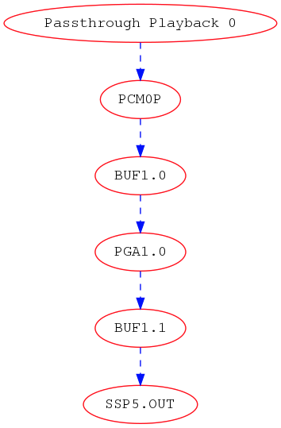
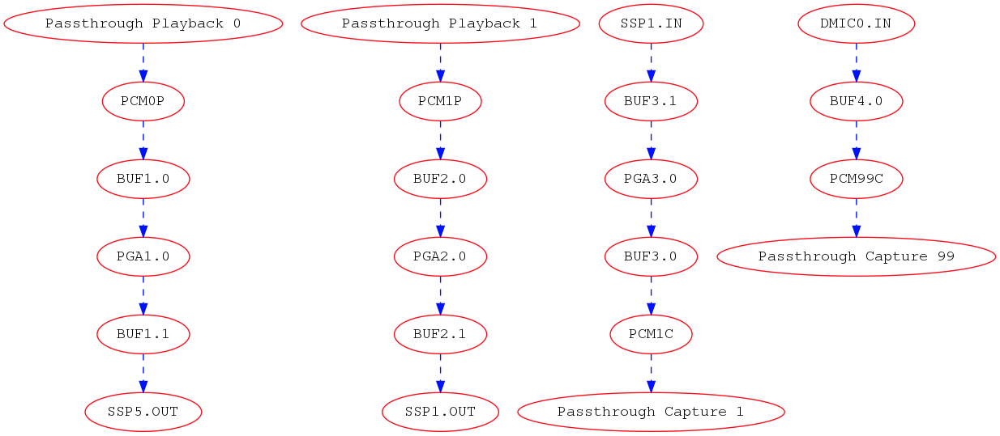

.. _topology:

SOF Topology
############

Topology defines the audio processing pipeline that is used by the
firmware. In SOF, topologies are defined using M4_ macro language,
which is making the conversion to text based ALSA topology file (based on
alsaconf syntax). This topology file is further processed with *alsatplg*
to binary, that can be sent to firmware.

More details about ALSA topology here_.

.. contents::

1. Topology Ingredients
***********************

Topology typically contains the following items:

1. Widgets
2. Tokens
3. Kcontrols
4. Pipelines
5. Backend DAI’s
6. DAI link configurations

The following sections will describe how to define these with M4.

1.1 Widgets
-----------

Widgets define the individual audio processing components that make up
the pipeline. Examples of widgets are volume, sample rate converter,
tone generator, host, dai, buffers etc. Widgets are defined using
macros that expand to include the respective sections containing
details such as pipeline information, type of widget and widget
specific data. Widget specific data includes information needed for
configuring the widget during initialization. These are defined using
vendor tuples that can be of type string, word or short.

1.2 Tokens/Vendor Tuples
------------------------

Tokens or vendor tuples allow us to add widget specific or platform
specific data. Widgets can have tokens that are common across all
widget types along with bespoke tokens required to configure the
particular widget type. For example, in the case of the volume
component, configuration data can include the volume step type and
volume ramp step in milliseconds which are specific to the pga type
widget. These are predefined in the sof_volume_tokens array in
tokens.m4 file as follows:

.. code-block:: bash

   SectionVendorTokens."sof_volume_tokens" {
       SOF_TKN_VOLUME_RAMP_STEP_TYPE           "250"
       SOF_TKN_VOLUME_RAMP_STEP_MS             "251"
   }

Example pga widget macro:

.. code-block:: bash

   W_PGA(name, format, periods_sink, periods_source, preload, kcontrol0. kcontrol1...etc)

This macro takes the following arguments:

| **name**: Name of the widget
| **format**: audio format
| **periods_sink**: Number of sink periods
| **periods_source**: Number of source periods
| **preload**: preload count
| **kcontrol0...kcontroln**: list of kcontrols associated with the widget

The W_PGA macro expands to include the following sections:

**SectionWidget**: This includes the pipeline information, type of widget,
data section and the mixers associated with the widget.
**SectionData**: This includes the configuration data for the widget. Note that there are 2 data sections. The first one is for including the common widget tokens such as sink period count, source period count and preload count which are “word” tokens. The second one is for including the audio format for the component which is of type “string”. Note that tokens are different types need to be specified in different sections even though they belong to the same sof_comp_tokens array definition.
**SectionVendorTuples**: This section includes the tokens and their respective values.
**Mixer**: The mixer section includes the list of kcontrols associated with the widget. Kcontrols are defined using the macros depending on type. More details can be found in the Kcontrols section.

.. code-block:: bash

   define(`W_PGA',
   `SectionVendorTuples."'N_PGA($1)`_tuples_w" {'
   `       tokens "sof_comp_tokens"'
   `       tuples."word" {'
   `               SOF_TKN_COMP_PERIOD_SINK_COUNT'         STR($3)
   `               SOF_TKN_COMP_PERIOD_SOURCE_COUNT'       STR($4)
   `               SOF_TKN_COMP_PRELOAD_COUNT'             STR($5)
   `       }'
   `}'
   `SectionData."'N_PGA($1)`_data_w" {'
   `       tuples "'N_PGA($1)`_tuples_w"'
   `}'
   `SectionVendorTuples."'N_PGA($1)`_tuples_str" {'
   `       tokens "sof_comp_tokens"'
   `       tuples."string" {'
   `               SOF_TKN_COMP_FORMAT'    STR($2)
   `       }'
   `}'
   `SectionData."'N_PGA($1)`_data_str" {'
   `       tuples "'N_PGA($1)`_tuples_str"'
   `}'
   `SectionWidget."'N_PGA($1)`" {'
   `       index "'PIPELINE_ID`"'
   `       type "pga"'
   `       no_pm "true"'
   `       data ['
   `               "'N_PGA($1)`_data_w"'
   `               "'N_PGA($1)`_data_str"'
   `       ]'
   `       mixer ['
                $6
   `       ]'

   `}')

Other widget macros can be found in their respective macro files in
the topology/m4 folder in the SOFT_ repo.

1.3 Kcontrols
-------------

These are kernel controls that are associated with widgets and are
exposed to the userspace. Examples of kcontrols are volume controls,
mute switches etc. These are defined using macros that include
information such as pipeline id, IO handlers and other control
specific information such as tlv data for volume controls. At the
moment, we only have predefined macro for mixer type
controls. Enum/byte type controls will be added in the future.

Example kcontrol macro for mixer type controls:

.. code-block:: bash

   C_CONTROLMIXER(name, index, ops, max, invert, tlv, KCONTROL_CHANNELS)

The arguments for the macro are as follows:

| **name**: Name of the mixer controls
| **index**: pipeline id
| **ops**: kcontrol IO handler ID
| **max**: max value
| **invert**: bool value indicating if the values are inverted
| **tlv**: tlv data for volume
| **kcontrol_channels**: number and name of the channels supported

1.4 Pipelines
-------------

Pipeline definitions contain the following:

1. Widget descriptions: These are the details of the widgets that make up the pipeline
2. Kcontrol descriptions: These are the kcontrols that are associated the widgets in the pipeline
3. Pipeline graph: These specify the connection between the widgets in the pipeline
4. PCM Capabilities: These contain the details about the pcm capabilities in terms of the formats, sample rates, channels etc supported by the pipeline. The macro is defined as below:

PCM_CAPABILITIES(name, formats, rate_min, rate_max, channels_min,
channels_max, periods_min, periods_max, period_size_min,
period_size_max, buffer_size_min, buffer_size_max)

Consider the following example of a audio playback pipeline (as
described in pipe-volume-plalyback.m4)

.. code-block:: bash

   host PCM_P --> B0 --> Volume 0 --> B1 --> sink DAI0

The pipeline description includes the following:

1. Widgets: 4 widgets corresponding to the Host, volume and 2 instances of buffers
2. Kcontrols: 1 mixer type kcontrol that is associated with the volume component
3. Pipeline graph: Showing the connections between the widgets as shown above
4. PCM Capabilities:  The capabilities supported by the audio playback pipeline as below:

| **supported formats**:  S32_LE,S24_LE,S16_LE
| **min sample rate**: 48000
| **max sample rate**: 48000
| **min number of channels**: 2
| **max number of channels**: 8
| **min number of periods**: 2
| **max number of periods**: 16
| **min period size**: 192
| **max period size**: 16384
| **min buffer size**: 65536
| **max buffer size**: 65536

The DAI component in the pipeline is defined using a separate pipeline
corresponding to whether it is a capture or a playback
pipeline. Please see the next section for more details.

1.5 Backend DAI
---------------

This section describes the BE (BackEnd) DAI’s for playback/capture
pipelines. The BE DAI’s are defined as a separate pipeline consisting
of the DAI widget and the pipeline graph section containing the
connection between the BE DAI and the pipeline buffer. For example
let’s consider the case of playback pipeline shown in the previous
section. The pipeline graph section would contain the connection
between the BE DAI and Buffer B1. Backend DAI’s are added using the
DAI_ADD macro defined as follows:

.. code-block:: bash

   DAI_ADD(pipeline, pipe id, dai type, dai_index, dai_be, buffer,
   periods, format, frames, deadline, priority, core)

| **pipeline**: is the name of the DAI pipeline ex: playback or capture dai
  pipeline as defined in pipe-dai-playback.m4 or pipe-dai-capture.m4
| **pipe id**: is the pipeline id with which the DAI is associated
| **dai type**: type of DAI ex: SSP or DMIC or HDA
| **dai_index**: index of the dai in the firmware. Please note that the
  DAI’s of different types can have the same dai_index. The dai_index
  information can be found by looking in platform-specific dai array
  definitions in the firmware. For example, for apollolake these are
  defined in src/platform/apollolake/dai.c.
| **dai_be**: name of CPU DAI as defined in DAI array in the platform driver.
| **buffer**: Source/sink buffer the DAI is connected to. This completes the
  pipeline graph connections.
| **periods**: number of periods
| **format**: DAI audio format
| **frames**: number of frames per period
| **deadline**: pipeline deadline in ms
| **priority**: priority that needs to be allocated for the dai pipeline
| **core**: core number to run the pipeline

1.6 Backend DAI link Config
---------------------------

This section describes the configuration details for the BE DAI links
in the audio pipeline. The BE DAI configuration is defined using the
following macro:

.. code-block:: bash

   DAI_CONFIG(type, dai_index, link_id, name, config)

where:

| **type**: type of DAI ex: SSP or DMIC or HDA
| **dai_index**: index of the DAI as defined in the firmware
| **link_id**: ID of the cpu dai for the link as defined in the SOF
  driver. Note that the link ID is a linearly incrementing number
  starting at 0 irrespective of DAI type
| **name**: CPU DAI name as defined in the SOF driver
| **config**: configuration details depending on the type of DAI.

The configuration parameters for SSP’s are defined using the following
macro:

.. code-block:: bash

   SSP_CONFIG(format, mclk, bclk, fsync, tdm, ssp_config_data)

where:

| **format**: is the SSP format ex: I2S or DSP_A or DSP_B etc
| **mclk**: master clock in Hz
| **bclk**: bit clock in Hz
| **fsync**: frame sync
| **TDM**: TDM info including the slots, width, tx mask and rx mask
| **ssp_config_data**: includes sample valid bits and mclk ID. Some SoC’s
  have more then one mclk exposed. So the right mclk ID needs to be
  specified. If omitted, this defaults to 0.

The configuration parameters for DMIC’s are defined using the
following macro:

.. code-block:: bash

   DMIC_CONFIG(driver_version, clk_min, clk_max, duty_min, duty_max,
   sample_rate, fifo word length, type, dai_index, pdm controller
   config)

where:

| **driver version**: dmic driver version in the firmware
| **clk_min**: min clock supported
| **clk_max**: max clock supported
| **duty min/max**: min and max duty cycle
| **sample rate**: audio sample rate
| **fifo word length**: sample word length
| **type**: DAI type
| **dai_index**: dai index as defined in the firmware'
| **pdm controller config**: PDM controller config indicating the number of
  active PDM’s, number of channels etc. These are platform specific and
  can be chosen predefined configurations such as MONO_PDM0_MICA,
  STEREO_PDM0, FOUR_CH_PDM0_PDM1 etc.

2. How to create a new topology?
********************************

Following sections will show how to define single and multipipeline
topologies.

2.1 Example topology with single pipeline
-----------------------------------------

The easiest way to create a new topology is to use one of the
pre-defined pipelines such as pipe-volume-playback and provide the
necessary details such as BE (Back End)/FE (Front End) DAI
information. There are a few predefined pipelines for playback and
capture with and without volume and src components in the SOFT
repo.This section demonstrates how to use one of the predefined
pipelines to create a new topology.

**Step 1**: Add a predefined pipeline

In this step, we add a predefined pipeline using the PIPELINE_PCM_ADD
macro. The macro is defined as follows:

.. code-block::bash

   PIPELINE_PCM_ADD(pipeline, pipe id, pcm, max channels, format,
   frames, deadline, priority, core)

| **pipeline**: name of the predefined pipeline
| **pipe id**: pipeline ID. This should be a unique ID identifying the pipeline
| **pcm**: PCM ID. This will be used to bind to the corrent front end DAI link
| **max channels**: max number of audio channels
| **format**: audio format for the pipeline
| **frames**: number of frame per period
| **deadline**: deadline for pipeline schedule
| **priority**: pipeline priority
| **core**: core ID

Example: In order to add an audio playback pipeline with a volume component:

.. code-block:: bash

   host PCM_P --> B0 --> Volume 0 --> B1 --> sink DAI0

with a deadline of 1000us, 48 frames per period and s32le audio
format, the PIPELINE_PCM_ADD macro should contain the following
arguments:

.. code-block:: bash

   PIPELINE_PCM_ADD(sof/pipe-volume-playback.m4, 1, 0, 2, s32le, 48, 1000, 0, 0)

Please note that the pipeline ID in the above definition is 1 and the
PCM ID is 0. These will be used to bind the PCM to the pipeline later.

**Step 2**: Add the BE DAI

Following the pipeline definition, the next step is to the add the BE
DAI and connect it to the desired pipeline. This is accomplished using
the DAI_ADD macro described in section 1.5.

Example: The following definition connects SSP 5 to the pipeline added
in Step 1.

.. code-block:: bash

   DAI_ADD(sof/pipe-dai-playback.m4, 1, SSP, 5, SSP5-Codec,
   PIPELINE_SOURCE_1, 2, s24le, 48, 1000, 0, 0)

Note: PIPELINE_SOURCE_1 is the endpoint in the pipeline with ID : 1
that the SSP 5 connects to.  “SSP5-Codec” is the name of the CPU DAI
for SSP5 defined in the SOF driver.

**Step 3**: Bind PCM with the pipeline

The next step is to bind the pipeline with the PCM or FE DAI
links. This is done using the macros PCM_PLAYBACK_ADD, PCM_DUPLEX_ADD
or PCM_CAPTURE_ADD depending on the capabilities desired for the
pipeline.

Example: For the playback pipeline defined in Steps 1 and 2, the macro
PCM_PLAYBACK_ADD is used to bind pipeline ID 1 with PCM ID 0 as
follows:

.. code-block:: bash

   PCM_PLAYBACK_ADD(Port5, 0, PIPELINE_PCM_1)

where “Port5” is the PCM name, 0 is the PCM ID and the last argument,
PIPEPINE_PCM_1 identifies the pipeline with the ID 1 to bind the PCM.

**Step 4**: Define the BE DAI configuration

The last step in topology definition contains the configuration for
the BE DAI’s in topology.

In the example case, there is one BE DAI (SSP 5) and this step defines
the configuration for SSP 5 using the DAI_CONFIG macro as described in
Section 1.6.

.. code-block:: bash

   DAI_CONFIG(SSP, 5, 0, SSP5-Codec,
       SSP_CONFIG(I2S, SSP_CLOCK(mclk, 24576000, codec_mclk_in),
       SSP_CLOCK(bclk, 3072000, codec_slave),
       SSP_CLOCK(fsync, 48000, codec_slave),
       SSP_TDM(2, 32, 3, 3),
       SSP_CONFIG_DATA(SSP, 5, 24)))

Putting together the different pieces from the 4 steps above, the
complete topology definition looks as follows:

.. code-block:: bash

   # Low Latency playback pipeline 1 on PCM 0 using max 2 channels of s32le.
   # Schedule 48 frames per 1000us deadline on core 0 with priority 0
   PIPELINE_PCM_ADD(sof/pipe-volume-playback.m4, 1, 0, 2, s32le, 48, 1000, 0, 0)

   # playback DAI is SSP5 using 2 periods
   # Buffers use s24le format, with 48 frame per 1000us on core 0 with priority 0
   DAI_ADD(sof/pipe-dai-playback.m4, 1, SSP, 5, SSP5-Codec,
   PIPELINE_SOURCE_1, 2, s24le, 48, 1000, 0, 0)

   # PCM Low Latency, id 0
   PCM_PLAYBACK_ADD(Port5, 0, PIPELINE_PCM_1)

   DAI_CONFIG(SSP, 5, 0, SSP5-Codec,
       SSP_CONFIG(I2S, SSP_CLOCK(mclk, 24576000, codec_mclk_in),
       SSP_CLOCK(bclk, 3072000, codec_slave),
       SSP_CLOCK(fsync, 48000, codec_slave),
       SSP_TDM(2, 32, 3, 3),
       SSP_CONFIG_DATA(SSP, 5, 24)))

The graph below shows the topology defined in Section 2.2 highlighting
the components in the pipeline and connections between them. Each node
in the graph below denotes a component as follows:

| **Passthrough Playback 0**: Name of the pipeline
| **PCM0P**: FE DAI
| **BUF1.0**: buffer component 0 in pipeline 1
| **PGA1.0**: volume component 0 in pipeline 1
| **BUF1.1**: buffer component 1 in pipeline 1
| **SSP5.OUT**: BE DAI corresponding to SSP 5
|

2.2 Example topology with multiple pipelines
--------------------------------------------

A typical topology definition includes multiple instances of
pipelines, the respective backend DAI’s for each pipeline and the DAI
configurations. An example topology definition is given below (example
taken from sof-apl-da7219.m4):

There are 4 pipelines one each for speaker playback, headset playback,
headset capture and DMIC capture.

**Step 1**: Define the pipelines

.. code-block:: bash

   # Low Latency playback pipeline 1 on PCM 0 using max 2 channels of s32le.
   # Schedule 48 frames per 1000us deadline on core 0 with priority 0
   PIPELINE_PCM_ADD(sof/pipe-volume-playback.m4,
       1, 0, 2, s32le,
       48, 1000, 0, 0)

   # Low Latency playback pipeline 2 on PCM 1 using max 2 channels of s32le.
   # Schedule 48 frames per 1000us deadline on core 0 with priority 0
   PIPELINE_PCM_ADD(sof/pipe-volume-playback.m4,
       2, 1, 2, s32le,
       48, 1000, 0, 0)

   # Low Latency capture pipeline 3 on PCM 1 using max 2 channels of s32le.
   # Schedule 48 frames per 1000us deadline on core 0 with priority 0
   PIPELINE_PCM_ADD(sof/pipe-volume-capture.m4,
       3, 1, 2, s32le,
       48, 1000, 0, 0)

   # Low Latency capture pipeline 4 on PCM 0 using max 4 channels of s32le.
   # Schedule 48 frames per 1000us deadline on core 0 with priority 0
   #PIPELINE_PCM_ADD(sof/pipe-volume-capture.m4,
   PIPELINE_PCM_ADD(sof/pipe-passthrough-capture.m4,
       4, 99, 4, s32le,
       48, 1000, 0, 0)

**Step 2**: Add the BE DAI’s for each pipeline

There are 4 DAI’s one each for the pipelines shown in Step 1:

.. code-block:: bash

   # playback DAI is SSP5 using 2 periods
   # Buffers use s16le format, with 48 frame per 1000us on core 0 with priority 0
   DAI_ADD(sof/pipe-dai-playback.m4,
       1, SSP, 5, SSP5-Codec,
       PIPELINE_SOURCE_1, 2, s16le,
       48, 1000, 0, 0)

   # playback DAI is SSP1 using 2 periods
   # Buffers use s16le format, with 48 frame per 1000us on core 0 with priority 0
   DAI_ADD(sof/pipe-dai-playback.m4,
       2, SSP, 1, SSP1-Codec,
       PIPELINE_SOURCE_2, 2, s16le,
       48, 1000, 0, 0)

   # capture DAI is SSP1 using 2 periods
   # Buffers use s16le format, with 48 frame per 1000us on core 0 with priority 0
   DAI_ADD(sof/pipe-dai-capture.m4,
       3, SSP, 1, SSP1-Codec,
       PIPELINE_SINK_3, 2, s16le,
       48, 1000, 0, 0)

   # capture DAI is DMIC0 using 2 periods
   # Buffers use s16le format, with 48 frame per 1000us on core 0 with priority 0
   DAI_ADD(sof/pipe-dai-capture.m4,
       4, DMIC, 0, dmic01,
       PIPELINE_SINK_4, 2, s32le,
       48, 1000, 0, 0)

**Step 3**: Bind PCM and pipelines

The next three macros define the PCM section for the backend DAI’s in
the pipeline. Note that PCM ID 1 is a duplex PCM showing that it is
associated with pipelines 2 and 3.

.. code-block:: bash

   PCM_PLAYBACK_ADD(Speakers, 0, PIPELINE_PCM_1)
   PCM_DUPLEX_ADD(Headset, 1, PIPELINE_PCM_2, PIPELINE_PCM_3)
   PCM_CAPTURE_ADD(DMIC01, 99, PIPELINE_PCM_4)

**Step 4**: BE DAI configuration:

The last section in topology defines the DAI configuration. Note that
there are only 3 DAI_CONFIG’s. Headset playback dai and capture DAI’s
use the same configuration as they are associated with the same
SSP1-Codec DAI.

.. code-block:: bash

   #SSP 5 (ID: 0) with 19.2 MHz mclk with MCLK_ID 0 (unused), 1.536 MHz blck
   DAI_CONFIG(SSP, 5, 0, SSP5-Codec,
       SSP_CONFIG(I2S, SSP_CLOCK(mclk, 19200000, codec_mclk_in),
           SSP_CLOCK(bclk, 1536000, codec_slave),
	   SSP_CLOCK(fsync, 48000, codec_slave),
	   SSP_TDM(2, 16, 3, 3),
	   SSP_CONFIG_DATA(SSP, 5, 16, 0)))

   #SSP 1 (ID: 1) with 19.2 MHz mclk with MCLK_ID 0, 1.92 MHz bclk
   DAI_CONFIG(SSP, 1, 1, SSP1-Codec,
       SSP_CONFIG(I2S, SSP_CLOCK(mclk, 19200000, codec_mclk_in),
           SSP_CLOCK(bclk, 1920000, codec_slave),
	   SSP_CLOCK(fsync, 48000, codec_slave),
	   SSP_TDM(2, 20, 3, 3),
	   SSP_CONFIG_DATA(SSP, 1, 16, 0)))

   # dmic01 (id: 2)
   DAI_CONFIG(DMIC, 0, 2, dmic01,
       DMIC_CONFIG(1, 500000, 4800000, 40, 60, 48000,
       DMIC_WORD_LENGTH(s32le), DMIC, 0,
       # FIXME: what is the right configuration
       # PDM_CONFIG(DMIC, 0, FOUR_CH_PDM0_PDM1)))
       PDM_CONFIG(DMIC, 0, STEREO_PDM0)))

The graph below shows the topology defined in Section 3.1.

3. Acronyms
***********

| **DAI**: Digital Audio Interface
| **BE**: Back End
| **FE**: Front End
| **DMIC**: Digital microphone
| **SSP**: Serial Synchronous Port

.. _M4: http://www.gnu.org/software/m4/m4.html
.. _here: https://www.alsa-project.org/main/index.php/ALSA_topology
.. _SOFT: https://github.com/thesofproject/soft
