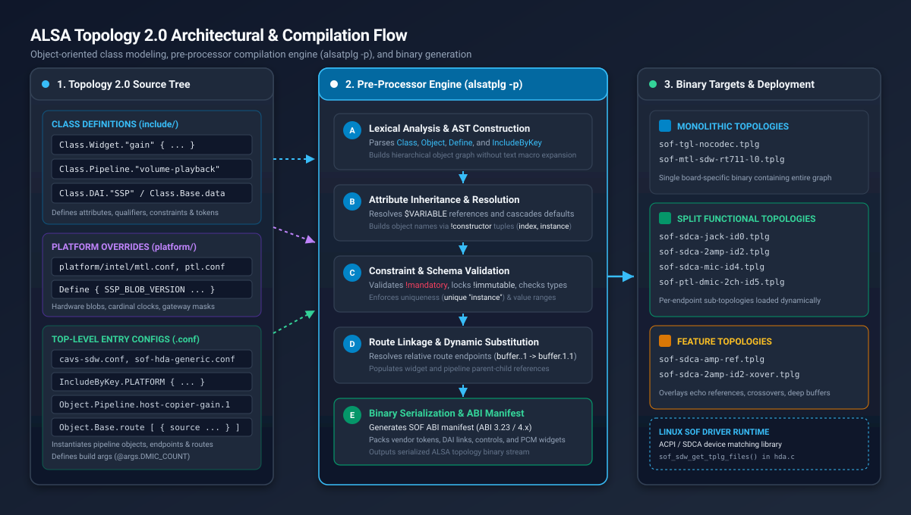
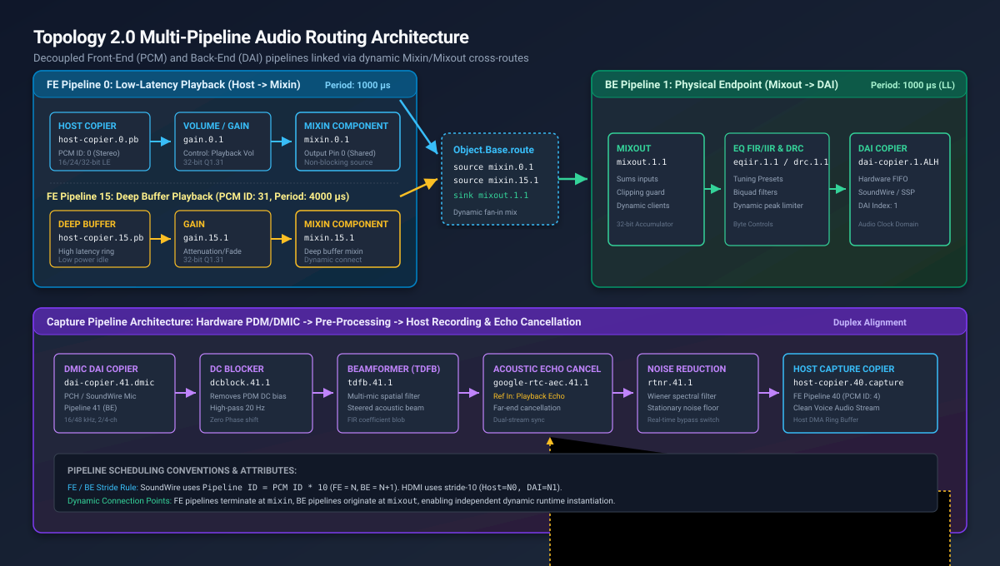
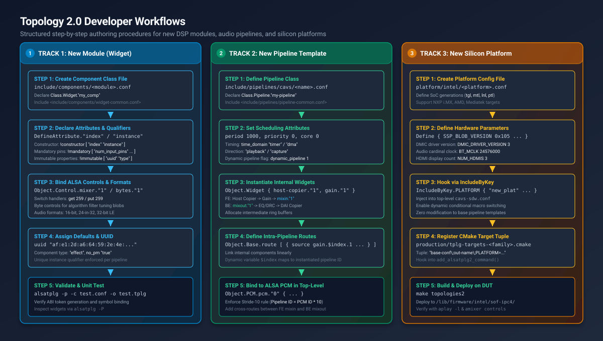
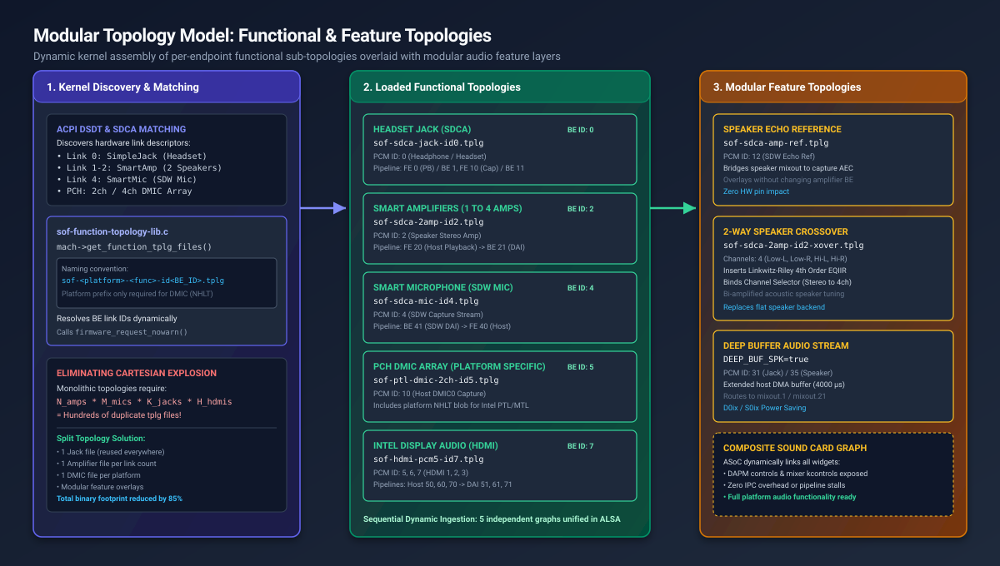

.. _topology2:

==================================================
ALSA Topology 2.0 Architecture & Developer Guide
==================================================

.. contents::
   :local:
   :depth: 3

Sound Open Firmware (SOF) utilizes **ALSA Topology 2.0 (Topology v2)** as its foundational configuration and audio graph description language. Built directly into upstream ALSA utilities (``alsatplg`` v1.2.7+), Topology 2.0 provides an **object-oriented pre-processing layer** on top of the standard ALSA configuration syntax.

By replacing legacy external macro expansion engines (such as ``m4``) with native class definitions, hierarchical inheritance, type validation, and dynamic attribute substitution, Topology 2.0 enables scalable, modular, and verified audio graph design across complex embedded Digital Signal Processors (DSPs).

   ALSA Topology 2.0 Architectural & Compilation Flow. Shows the object-oriented source structure, the 5-stage ``alsatplg -p`` pre-processor compilation engine, and binary target deployment across monolithic, functional, and feature topologies.

Architectural Motivation & Key Advantages
*****************************************

Traditional ALSA Topology v1 configurations relied heavily on the external macro processor ``m4``. While flexible, the ``m4`` approach suffered from significant maintenance and reliability challenges:

* **Lack of Type Safety & Validation**: Typographical errors in token names, invalid integer ranges, or mismatched UUIDs were not caught until firmware boot or audio playback failure on target hardware.
* **Obtuse Build Failures**: Pre-processor errors reported line numbers against intermediate expanded macro dumps rather than the original source files, complicating debugging.
* **Configuration Duplication**: Supporting variations of the same audio pipeline (e.g., changing bit depths or buffer sizes) required duplicating extensive blocks of boilerplate text.
* **Cartesian Explosion across Board SKUs**: Monolithic topology files required building hundreds of individual ``.tplg`` binaries for every hardware permutation (e.g., combinations of speaker amplifiers, microphones, headphone jacks, and display outputs).

Topology 2.0 resolves these issues through a structured, class-based object model:

* **Object-Oriented Syntax**: Developers define reusable templates using ``Class.Widget``, ``Class.Pipeline``, ``Class.DAI``, and ``Class.Control``, instantiating them cleanly as ``Object.Widget`` or ``Object.Pipeline``.
* **Native Compiler Integration**: The ``alsatplg -p`` compiler processes classes, attribute inheritance, and qualifiers directly within its internal Abstract Syntax Tree (AST), reporting precise line numbers and file contexts on syntax or constraint errors.
* **Dynamic Parameter Cascades**: Top-level arguments passed via ``-D KEY=VAL`` or ``@args`` dynamically cascade down nested object hierarchies via ``$VARIABLE`` substitution.
* **Split & Feature Topology Architecture**: Supports modular sound cards where the Linux kernel dynamically loads independent **Functional Topologies** (e.g. per-endpoint SDCA graphs) overlaid with **Feature Topologies** (e.g. echo reference loops, 2-way speaker crossovers, and noise suppressors).

Core Language Ingredients & Syntax Reference
********************************************

A Topology 2.0 configuration tree consists of five foundational language primitives:

1. **Classes** (``Class.<Group>.<Name>``): Reusable templates defining attributes, default values, qualifiers, and internal child objects.
2. **Objects** (``Object.<Group>.<Name>.<Instance>``): Concrete instantiations of classes with customized attributes.
3. **Arguments & Defines** (``@args``, ``Define``): Dynamic variables parameterized at build time or within configuration blocks.
4. **Conditional Includes** (``IncludeByKey.<Variable>``): Regular expression matching for platform or feature file inclusion.
5. **Route Bindings** (``Object.Base.route``): Declarative directed audio stream links connecting component source pins to sink pins.

.. list-table:: Core Topology 2.0 Language Constructs
   :widths: 22 20 58
   :header-rows: 1

   * - Keyword / Construct
     - Scope
     - Description
   * - ``Class.<Group>.<Name>``
     - Template Declaration
     - Defines an object template within a compiler group (``Base``, ``Widget``, ``Pipeline``, ``DAI``, ``Control``, ``PCM``).
   * - ``Object.<Group>.<Name>.<ID>``
     - Object Instantiation
     - Instantiates a concrete topology object, overriding default class attributes and registering it into the topology graph.
   * - ``DefineAttribute."<name>"``
     - Class Ingredient
     - Declares an attribute name and its data type (``string``, ``integer``, ``compound``).
   * - ``attributes { ... }``
     - Class Ingredient
     - Enforces object construction rules, mandatory fields, immutability, and uniqueness qualifiers.
   * - ``Define { ... }``
     - Variable Scoping
     - Assigns default values to local variables accessible via ``$VARIABLE`` notation.
   * - ``IncludeByKey.<Variable>``
     - Pre-processor
     - Evaluates a variable against regex patterns to conditionally include external configuration files.
   * - ``Object.Base.route``
     - Routing Graph
     - Declares directed connections from component source pins (``source``) to sink pins (``sink``).

Class Definitions
=================

Classes establish the schema and behavior of topology objects. A class definition begins with the ``Class`` keyword followed by two dot-separated tokens: the **class group** and the **class name**.

Supported Class Groups
----------------------

The ``alsatplg`` compiler natively recognizes six fundamental class groups:

* **``Class.Base``**: Low-level foundational constructs (e.g., data blobs, vendor tokens, audio format structures, route objects).
* **``Class.Widget``**: DSP audio processing modules and hardware endpoints (e.g., PGA/Gain, Mixin, Mixout, EQ, DRC, Copier, Buffer).
* **``Class.Pipeline``**: Reusable audio processing pipelines encapsulating scheduling parameters, internal widgets, and intra-pipeline routes.
* **``Class.DAI``**: Physical Digital Audio Interfaces (e.g., Intel SSP, SoundWire ALH, DMIC, NXP SAI, ESAI).
* **``Class.Control``**: ALSA userspace controls (e.g., mixer volume sliders, enum switches, binary configuration bytes).
* **``Class.PCM``**: ALSA PCM stream endpoints exposed to host applications (e.g., playback, capture, deep buffer).

Class Ingredients & Attributes
------------------------------

A robust class definition includes attribute declarations, attribute qualifiers, default properties, and optional child object composition:

.. code-block:: bash

   Class.Base."data" {
       # 1. Attribute declarations with explicit data types
       DefineAttribute."name" {
           type "string"
       }
       DefineAttribute."bytes" {
           type "compound"
       }

       # 2. Attribute qualifiers
       attributes {
           # Defines which attributes construct the object's instance identifier
           !constructor [
               "name"
           ]
           # Enforces mandatory provision at instantiation time
           !mandatory [
               "bytes"
           ]
           # Enforces uniqueness within the enclosing configuration node
           unique "name"
       }
   }

Attribute Qualifiers Matrix
---------------------------

Attribute qualifiers defined within the ``attributes {}`` node enforce compile-time validation:

.. list-table:: Topology 2.0 Attribute Qualifiers
   :widths: 20 18 62
   :header-rows: 1

   * - Qualifier
     - Target
     - Architectural Function
   * - ``!constructor``
     - Attribute Array
     - Specifies the ordered tuple of attributes used to construct the object's name (e.g., ``[ "index" "instance" ]``).
   * - ``!mandatory``
     - Attribute Array
     - Declares attributes that **must** be explicitly provided when instantiating the object; compilation fails if omitted.
   * - ``!immutable``
     - Attribute Array
     - Locks attributes to their class-defined default values; instantiators are prohibited from overriding them (e.g., ``uuid``, ``type``).
   * - ``!deprecated``
     - Attribute Array
     - Marks attributes scheduled for deprecation; compiler issues warnings if instantiated.
   * - ``unique``
     - Attribute Name
     - Enforces that no two objects of this class within the same configuration node share the same attribute value.

Constraints & Token References
------------------------------

Attributes can be constrained to specific ranges or enumerations and bound directly to SOF ABI vendor tokens:

.. code-block:: bash

   DefineAttribute."curve_type" {
       type "string"
       # Enforce valid enumeration options
       constraints {
           !valid_values [
               "windows_fade"
               "linear"
               "logarithmic"
           ]
       }
       # Map directly to SOF vendor token
       token_ref "sof_tkn_gain_curve_type"
   }

   DefineAttribute."buffer_size" {
       type "integer"
       # Enforce numeric boundary constraints
       constraints {
           min 64
           max 65536
       }
       token_ref "sof_tkn_buf_size"
   }

Objects & Instantiation
=======================

Objects represent concrete instances of classes. When an object is instantiated, ``alsatplg`` resolves its constructor tuple, assigns default attributes from the parent class, applies local overrides, and registers the object into the topology graph.

Instantiating an Object
-----------------------

To instantiate an object, declare ``Object.<Group>.<Class>.<Instance>``:

.. code-block:: bash

   # Instantiate a PGA / Gain widget in pipeline 1, instance 1
   Object.Widget.gain."1" {
       index 1
       curve_type "windows_fade"
       curve_duration 100000

       # Instantiate embedded mixer control
       Object.Control.mixer."1" {
           name "Main Playback Volume"
           max 32
       }
   }

Nested Objects & Attribute Inheritance
--------------------------------------

Topology 2.0 allows nesting child objects within parent objects or class definitions. Child objects automatically inherit attributes from their parent objects unless explicitly overridden:

.. code-block:: bash

   Class.Pipeline."volume-playback" {
       # Pipeline attributes
       DefineAttribute."index" {
           type "integer"
       }
       DefineAttribute."priority" {
           type "integer"
           default 0
       }

       # Internal child widgets inherit $index automatically
       Object.Widget {
           host-copier."1" {
               index $index
               stream_name "Playback Stream"
           }
           gain."1" {
               index $index
           }
           mixin."1" {
               index $index
           }
       }
   }

Dynamic Variables & Conditional Includes
========================================

Topology 2.0 provides macro-free parameterization through ``Define`` blocks, build arguments (``@args``), and regular-expression-driven ``IncludeByKey`` directives.

The Define Block & Variable Cascades
------------------------------------

The ``Define`` block sets default variable values that can be referenced using ``$VARIABLE`` notation throughout the file:

.. code-block:: bash

   Define {
       PLATFORM            "ptl"
       NUM_HDMIS           3
       DEEP_BUFFER_PCM_ID  31
       HEADSET_PCM_ID       0
       SPK_AMPS_COUNT       2
   }

   # Variable evaluation in object instantiation
   Object.PCM.pcm."0" {
       name "Headset Playback"
       id $HEADSET_PCM_ID
       direction "playback"
   }

Build Arguments (@args)
-----------------------

Top-level arguments allow passing parameters from the command line (via ``alsatplg -D KEY=VALUE``) or from CMake targets:

.. code-block:: bash

   @args.DMIC_COUNT {
       type integer
       default 2
   }

   @args.FORMAT {
       type string
       default "s32le"
   }

Conditional Includes (IncludeByKey)
-----------------------------------

The ``IncludeByKey`` directive inspects a variable's value against a table of regular expressions, including the matching file:

.. code-block:: bash

   # Platform-specific hardware definitions
   IncludeByKey.PLATFORM {
       "tgl"   "platform/intel/tgl.conf"
       "mtl"   "platform/intel/mtl.conf"
       "lnl"   "platform/intel/lnl.conf"
       "ptl"   "platform/intel/ptl.conf"
   }

   # Feature gating based on channel count
   IncludeByKey.DMIC_COUNT {
       "[1-2]" "platform/intel/dmic-2ch.conf"
       "[3-4]" "platform/intel/dmic-4ch.conf"
   }

Pipeline Architecture & Multi-Pipeline Audio Routing
****************************************************

SOF decouples audio processing graphs into **Front-End (FE) Host Pipelines** and **Back-End (BE) DAI Pipelines**, interconnected dynamically using ``mixin`` and ``mixout`` components.

   Topology 2.0 Multi-Pipeline Audio Routing Architecture. Demonstrates decoupled Front-End (FE) host pipelines mixing into Back-End (BE) DAI pipelines, complete with acoustic echo cancellation (AEC) feedback loops and full-duplex DMIC capture.

Front-End vs Back-End Decoupling
================================

* **Front-End (FE) Pipelines**:
  Bound directly to ALSA PCM stream devices (``/dev/snd/pcmC0D0p``). FE pipelines contain a Host Copier, optional sample rate conversion (SRC) or volume adjustment, and terminate at a **``mixin``** component. They run in the host timer/DMA domain and are instantiated or stopped dynamically when userspace opens or closes an audio stream.
* **Back-End (BE) Pipelines**:
  Bound to physical hardware digital audio interfaces (Intel SSP, SoundWire ALH, DMIC, NXP SAI). BE pipelines begin at a **``mixout``** component, route through post-processing stages (Parametric EQ FIR/IIR, Dynamic Range Compression DRC, Smart Amplifier protection), and terminate at a DAI Copier. BE pipelines remain active to maintain hardware clock synchronization and power state stability.

Inter-Pipeline Routing with Mixin and Mixout
============================================

The ``mixin`` and ``mixout`` components operate as zero-copy shared memory endpoints. Multiple FE pipelines can concurrently mix into a single BE mixout without sample rate mismatches or pipeline stalls:

.. code-block:: bash

   # Cross-pipeline routes connecting FE mixin outputs to BE mixout inputs
   Object.Base.route [
       {
           # Normal latency host playback stream (FE 0 -> BE 1)
           source  "mixin.0.1"
           sink    "mixout.1.1"
       }
       {
           # Deep buffer power-saving stream (FE 15 -> BE 1)
           source  "mixin.15.1"
           sink    "mixout.1.1"
       }
   ]

Dynamic Index Resolution
------------------------

In class definitions, internal routes reference relative component instances where the pipeline ID is unknown until instantiation:

.. code-block:: bash

   # Inside Class.Pipeline."volume-playback"
   Object.Base.route [
       {
           source  "gain.$index.1"
           sink    "mixin.$index.1"
       }
   ]

When instantiated as ``Object.Pipeline.volume-playback."5"``, ``alsatplg`` automatically expands ``$index`` to produce ``gain.5.1`` and ``mixin.5.1``.

Conventions & ID Allocation Rules
*********************************

To prevent hardware resource collisions and ensure predictable ALSA userspace enumeration, SOF enforces strict numbering conventions across PCM stream IDs and Pipeline IDs.

PCM ID Allocation Matrix
========================

Each ALSA PCM device requires a unique integer ID within the sound card:

.. list-table:: SOF PCM Stream ID Allocation Conventions
   :widths: 22 14 18 46
   :header-rows: 1

   * - Endpoint Description
     - SoundWire ID
     - HDA ID
     - Override Variable / Purpose
   * - **Primary Headphone / Jack**
     - 0
     - 0
     - Primary stereo playback/capture stream
   * - **Speaker Amplifier**
     - 2
     - —
     - High-power external stereo/multichannel smart amplifier
   * - **SoundWire Smart Mic**
     - 4
     - —
     - Digital SoundWire capture stream
   * - **Display Audio (HDMI 1)**
     - 5
     - 3
     - ``HDMI1_PCM_ID`` (Intel iDisp digital display output)
   * - **Display Audio (HDMI 2)**
     - 6
     - 4
     - ``HDMI2_PCM_ID``
   * - **Display Audio (HDMI 3)**
     - 7
     - 5
     - ``HDMI3_PCM_ID``
   * - **PCH DMIC0 Capture**
     - 10
     - 6
     - ``DMIC0_PCM_ID`` (Onboard digital microphone array)
   * - **PCH DMIC1 / Jack Echo Ref**
     - 11
     - —
     - ``SDW_JACK_ECHO_REF_PCM_ID``
   * - **Speaker Echo Reference**
     - 12
     - —
     - ``SDW_SPK_ECHO_REF_PCM_ID`` (AEC loopback reference)
   * - **Bluetooth Audio (BT/Offload)**
     - 20
     - —
     - ``BT_PCM_ID`` (Coexists with speaker amp via dedicated ID)
   * - **Deep Buffer (Jack Playback)**
     - 31
     - 31
     - ``DEEP_BUFFER_PCM_ID`` (Extended 4000 µs DMA ring for D0ix)
   * - **Deep Buffer (Speaker)**
     - 35
     - —
     - ``DEEP_BUFFER_PCM_ID_2``
   * - **Compress Offload (Jack)**
     - 50
     - 50
     - ``COMPR_PCM_ID`` (MP3/AAC hardware-decoded stream)
   * - **Compress Offload (Speaker)**
     - 52
     - —
     - ``COMPR_2_PCM_ID``

Pipeline ID Conventions & Stride-10 Rule
========================================

Pipeline IDs (the ``index`` attribute on pipeline objects) must be unique across the topology:

* **SoundWire Stride-10 Rule**:
  In SoundWire topologies, pipeline indexes follow the deterministic relationship:

  .. math::

     \text{Pipeline Index} = \text{PCM ID} \times 10

  * **Front-End (FE) Pipeline**: Assigned index :math:`N` (e.g. PCM 0 → FE Pipeline 0).
  * **Back-End (BE) Pipeline**: Assigned index :math:`N + 1` (e.g. BE Pipeline 1).
  * *Example*: Speaker Stream (PCM ID 2) → FE Host Pipeline 20, BE DAI Pipeline 21.
  * *Example*: SDW DMIC (PCM ID 4) → BE DAI Pipeline 41, FE Host Pipeline 40.
* **HDMI Stride-10 Rule**:
  HDMI display audio pipelines allocate Host pipelines at :math:`N0` and DAI pipelines at :math:`N1`:
  * HDMI 1: Host Pipeline 50, DAI Pipeline 51.
  * HDMI 2: Host Pipeline 60, DAI Pipeline 61.
  * HDMI 3: Host Pipeline 70, DAI Pipeline 71.
  * HDMI 4: Host Pipeline 80, DAI Pipeline 81.

Step-by-Step Developer Workflows
********************************

Developing new audio capabilities in SOF requires modifying or adding topology definitions. Below are comprehensive, step-by-step guides for the three most common development tasks:

1. **Creating a New Module (Component/Widget)**
2. **Creating a New Pipeline Template**
3. **Adding a New Silicon Platform**

   Structured Topology 2.0 Developer Workflows. Details the 5-step engineering procedures for authoring a new DSP module, a new pipeline template, and a new silicon platform.

Tutorial 1: Creating a New Module (Widget/Component)
====================================================

When introducing a new DSP processing algorithm (e.g. a custom spatializer, filter, or neural network spotter), developers must define a corresponding Topology 2.0 widget class.

Step 1: Create the Component Class File
---------------------------------------

Create a new file in ``tools/topology/topology2/include/components/<module_name>.conf`` (e.g. ``include/components/my_filter.conf``):

.. code-block:: bash

   #
   # My Custom Audio Filter Component Definition
   #
   # Usage:
   # Object.Widget.my_filter."1" {
   #     index 1
   # }
   #

   <include/controls/mixer.conf>
   <include/controls/bytes.conf>

   Class.Widget."my_filter" {
       # Pipeline ID to which this widget belongs
       DefineAttribute."index" {
           type "integer"
       }

       # Unique instance identifier within the pipeline
       DefineAttribute."instance" {
           type "integer"
       }

       # Include shared widget attributes (num_input_pins, formats, etc.)
       <include/components/widget-common.conf>

       attributes {
           # Construct name as: my_filter.<index>.<instance>
           !constructor [
               "index"
               "instance"
           ]
           !mandatory [
               "num_input_pins"
               "num_output_pins"
               "num_input_audio_formats"
               "num_output_audio_formats"
           ]
           !immutable [
               "uuid"
               "type"
           ]
           unique "instance"
       }

       # Embedded ALSA Controls
       Object.Control {
           # Binary tuning coefficients control
           bytes."1" {
               name "MyFilter Coefficients"
           }
           # Runtime bypass/enable switch
           mixer."1" {
               name "MyFilter Switch"
               Object.Base.channel.1 {
                   name "fc"
                   shift 0
               }
               Object.Base.ops.1 {
                   name "ctl"
                   info "volsw"
                   get 259    # SOF switch get handler
                   put 259    # SOF switch put handler
               }
               max 1
           }
       }

       # Default Widget Properties
       uuid            "a4:b2:3c:5d:7e:8f:90:12:34:56:78:9a:bc:de:f0:12"
       type            "effect"
       no_pm           "true"
       num_input_pins  1
       num_output_pins 1
   }

Step 2: Declare Audio Format Support
------------------------------------

If the component requires specific sample rates or bit depths, define supported input and output audio formats in the class definition or during object instantiation:

.. code-block:: bash

   Object.Base.input_audio_format [
       {
           in_rate             48000
           in_bit_depth        32
           in_valid_bit_depth  32
           in_channels         2
       }
   ]
   Object.Base.output_audio_format [
       {
           out_rate            48000
           out_bit_depth       32
           out_valid_bit_depth 32
           out_channels        2
       }
   ]

Step 3: Test Widget Compilation
-------------------------------

Validate that the new widget class compiles cleanly into an ALSA topology binary:

.. code-block:: bash

   alsatplg -p -c test-my-filter.conf -o test-my-filter.tplg

Tutorial 2: Creating a New Pipeline Template
============================================

Pipelines package a set of interconnected widgets into an autonomous, schedulable execution unit.

Step 1: Create the Pipeline Class File
--------------------------------------

Create a new file in ``tools/topology/topology2/include/pipelines/cavs/<pipeline_name>.conf`` (e.g. ``include/pipelines/cavs/my-processing-playback.conf``):

.. code-block:: bash

   #
   # Processing Playback Pipeline: Host Copier -> Gain -> MyFilter -> Mixin
   #

   <include/common/input_audio_format.conf>
   <include/common/output_audio_format.conf>
   <include/components/host-copier.conf>
   <include/components/gain.conf>
   <include/components/my_filter.conf>
   <include/components/mixin.conf>
   <include/components/pipeline.conf>

   Class.Pipeline."my-processing-playback" {

       <include/pipelines/pipeline-common.conf>

       attributes {
           !constructor [
               "index"
           ]
           !immutable [
               "direction"
           ]
           unique "instance"
       }

       # Internal Pipeline Widgets
       Object.Widget {
           host-copier."1" {
               type "aif_in"
               num_input_audio_formats 3
               num_output_audio_formats 1
               num_output_pins 1
           }

           gain."1" {
               num_input_audio_formats 1
               num_output_audio_formats 1
           }

           my_filter."1" {
               num_input_audio_formats 1
               num_output_audio_formats 1
           }

           mixin."1" {}

           pipeline."1" {
               priority    0
               lp_mode     0
           }
       }

       # Intra-Pipeline Linear Routes
       Object.Base.route [
           {
               source  "host-copier.$index.1"
               sink    "gain.$index.1"
           }
           {
               source  "gain.$index.1"
               sink    "my_filter.$index.1"
           }
           {
               source  "my_filter.$index.1"
               sink    "mixin.$index.1"
           }
       ]

       direction        "playback"
       dynamic_pipeline 1
       time_domain      "timer"
       period           1000
   }

Step 2: Instantiate in a Top-Level Topology
-------------------------------------------

Include your new pipeline in the board configuration file and bind it to an ALSA PCM device:

.. code-block:: bash

   Object.Pipeline.my-processing-playback."0" {
       index 0
       Object.Widget.host-copier.1 {
           stream_name "Main Playback"
           pcm_id      0
       }
   }

   # Cross-route from FE mixin to BE mixout
   Object.Base.route [
       {
           source  "mixin.0.1"
           sink    "mixout.1.1"
       }
   ]

Tutorial 3: Adding a New Silicon Platform
=========================================

Adding support for a new hardware platform (e.g. a new Intel SoC stepping or a new vendor DSP) requires configuring platform hardware tokens, DAI parameters, and CMake build targets.

Step 1: Create the Platform Configuration File
----------------------------------------------

Create a new configuration file in ``tools/topology/topology2/platform/<vendor>/<platform>.conf`` (e.g. ``platform/intel/new_soc.conf``):

.. code-block:: bash

   # Platform-specific definitions for new_soc
   Define {
       PLATFORM                 "new_soc"
       SSP_BLOB_VERSION         0x106
       DMIC_DRIVER_VERSION      4
       NUM_HDMIS                4
       BT_MCLK                  24576000
       HDA_HOST_OUTPUT_CLASS    "aif_in"
       HDA_HOST_INPUT_CLASS     "aif_out"
   }

Step 2: Hook into Top-Level Configurations
------------------------------------------

Add the new platform identifier to the ``IncludeByKey.PLATFORM`` dispatch table in top-level topology entry points (e.g. ``cavs-sdw.conf``, ``sof-hda-generic.conf``):

.. code-block:: bash

   IncludeByKey.PLATFORM {
       "tgl"        "platform/intel/tgl.conf"
       "mtl"        "platform/intel/mtl.conf"
       "lnl"        "platform/intel/lnl.conf"
       "ptl"        "platform/intel/ptl.conf"
       "new_soc"    "platform/intel/new_soc.conf"
   }

Step 3: Register CMake Production Targets
-----------------------------------------

Add target generation entries to ``production/tplg-targets-<family>.cmake`` using the semicolon-delimited tuple format:

.. code-block:: text

   "input-conf;output-name;variables"

Example entry in ``production/tplg-targets-ace3.cmake``:

.. code-block:: cmake

   list(APPEND TPLGS
       "cavs-sdw\;sof-newsoc-sdw-cs42l43-l0-cs35l56-l12\;PLATFORM=new_soc,NUM_SDW_AMP_LINKS=2,SDW_JACK=true"
       "sof-hda-generic\;sof-newsoc-hda-generic\;PLATFORM=new_soc,NUM_HDMIS=4,DMIC_COUNT=2"
   )

Step 4: Build and Verify on DUT
-------------------------------

Build the new topology target using CMake:

.. code-block:: bash

   # Build all Topology 2.0 targets
   cmake --build . --target topologies2

   # Or build the specific target
   cmake --build . --target sof-newsoc-sdw-cs42l43-l0-cs35l56-l12

Modular Topology Model: Functional vs Feature Topologies
********************************************************

Modern audio architectures—particularly those adhering to MIPI SoundWire Device Class Audio (SDCA)—demand high modularity. To avoid an unsustainable explosion of monolithic binary topology files, SOF introduces **Split Topologies**, dividing the audio graph into **Functional Topologies** and **Feature Topologies**.

   Modular Topology Model: Functional & Feature Topologies. Illustrates dynamic ACPI/SDCA endpoint discovery by the Linux SOF driver, sequential loading of per-endpoint functional sub-topologies, and modular layering of feature overlays into a single unified runtime ALSA graph.

Functional Topologies (Split Topologies)
========================================

A **Functional Topology** is an independent, self-contained topology binary that encapsulates exactly one physical audio function or hardware endpoint (e.g., a headphone jack, a stereo speaker amplifier array, a digital microphone, or display audio).

Naming Convention
-----------------

Split functional topology files follow a standardized naming structure:

.. code-block:: text

   sof-<platform>-<function>-id<BE_ID>.tplg

* **``<platform>``**: Platform family identifier (e.g., ``tgl``, ``mtl``, ``ptl``). Platform prefix is mandatory only for DMIC functions (due to platform-specific NHLT microphone array blobs) and omitted for generic SDCA endpoints.
* **``<function>``**: Specific audio endpoint capability:
  * ``sdca-jack``: SDCA headphone / headset combo jack.
  * ``sdca-<N>amp``: SDCA smart speaker amplifiers, where ``<N>`` indicates the number of amplifier links (e.g. ``sdca-1amp``, ``sdca-2amp``, ``sdca-4amp``).
  * ``sdca-mic``: SDCA digital microphone stream.
  * ``dmic-<N>ch``: PCH digital microphone array (e.g. ``dmic-2ch``, ``dmic-4ch``).
  * ``hdmi-pcm<ID>``: Intel display audio starting from PCM ID ``<ID>`` (e.g. ``hdmi-pcm5``).
* **``id<BE_ID>``**: The back-end DAI link ID allocated by the Linux machine driver.

Examples of Functional Topologies:

.. code-block:: text

   sof-sdca-jack-id0.tplg          # Headset jack on BE link 0
   sof-sdca-2amp-id2.tplg          # Dual smart amplifiers on BE link 2
   sof-sdca-mic-id4.tplg           # SoundWire microphone on BE link 4
   sof-ptl-dmic-2ch-id5.tplg       # PTL 2-channel PCH DMIC on BE link 5
   sof-hdmi-pcm5-id7.tplg          # Display audio starting at PCM 5 on BE link 7

Dynamic Kernel Assembly (sof-function-topology-lib.c)
-----------------------------------------------------

Rather than loading a single hardcoded topology file specified by ACPI, the modern SOF machine driver (``sof_sdw``) queries the hardware at boot:

1. **ACPI / SDCA Matching**: The driver inspects the ACPI DSDT table and scans the SoundWire bus to enumerate active peripheral devices (codecs, amplifiers, microphones).
2. **Topology List Assembly**: In ``sound/soc/intel/common/sof-function-topology-lib.c``, ``sof_sdw_get_tplg_files()`` inspects each registered DAI link and generates the required functional topology filenames matching detected peripherals.
3. **Sequential Firmware Request**: The kernel requests and parses each ``.tplg`` file sequentially using ``firmware_request_nowarn()``.
4. **Unified Graph Ingestion**: The SOF topology core parses the components and routes from each file, dynamically binding them into a cohesive ALSA sound card graph.

Feature Topologies
==================

A **Feature Topology** is an orthogonal topology overlay that adds specialized DSP processing capabilities or feedback pipelines to an existing functional graph without altering physical hardware DAI routing.

Common Feature Topologies
-------------------------

* **Speaker Echo Reference (``sof-sdca-amp-ref.tplg`` / ``sof-sdca-amp-ref-dai.tplg``)**:
  Extracts a reference tap from the speaker playback pipeline (``mixout.21``) and routes it into the capture domain for Acoustic Echo Cancellation (AEC). Enables clean full-duplex speakerphone communication during loud media playback.
* **Jack Echo Reference (``sof-sdca-jack-ref-dai.tplg``)**:
  Echo reference loopback for headphone/headset communication.
* **2-Way Speaker Crossover (``sof-sdca-2amp-id2-xover.tplg``)**:
  Splits stereo audio into 4 channels (Low-Left, Low-Right, High-Left, High-Right) using Linkwitz-Riley 4th order (LR4) IIR filters and a channel selector, targeting bi-amplified tweeter/woofer speaker systems.
* **Deep Buffer Audio Streams (``DEEP_BUF_SPK=true``)**:
  Instantiates high-latency (4000 µs) host DMA ring buffers, allowing the host CPU to remain asleep in deep ACPI S0ix / Modern Standby while audio continues playing seamlessly.

Build Configuration for Functional & Feature Topologies
-------------------------------------------------------

Split and feature topologies are configured in ``production/tplg-targets-sdca-generic.cmake``:

.. code-block:: text

   # Split Functional Topologies
   "cavs-sdw\;sof-sdca-jack-id0\;SDW_JACK_OUT_STREAM=Playback-SimpleJack,SDW_JACK_IN_STREAM=Capture-SimpleJack,NUM_HDMIS=0"
   "cavs-sdw\;sof-sdca-2amp-id2\;NUM_SDW_AMP_LINKS=2,SDW_JACK=false,SDW_AMP_FEEDBACK=false,SDW_SPK_STREAM=Playback-SmartAmp,NUM_HDMIS=0,DEEP_BUF_SPK=true"
   "cavs-sdw\;sof-sdca-mic-id4\;SDW_JACK=false,SDW_DMIC=1,NUM_HDMIS=0,SDW_DMIC_STREAM=Capture-SmartMic"

   # Feature Topologies (Echo Reference & Crossover Overlays)
   "cavs-sdw\;sof-sdca-amp-ref\;SDW_JACK=false,NUM_HDMIS=0,JACK_RATE=48000,SDW_AMP_FEEDBACK=false,SDW_SPK_ECHO_REF=true,SDW_SPK_ECHO_REF_PCM_ID=12"
   "cavs-sdw\;sof-sdca-2amp-id2-xover\;NUM_SDW_AMP_LINKS=2,SDW_JACK=false,SDW_AMP_FEEDBACK=false,SDW_SPK_STREAM=Playback-SmartAmp,NUM_HDMIS=0,SDW_AMP_NUM_CHANNELS=4,SDW_AMP_XOVER=true"

Compiling, Inspecting & Debugging Topologies
********************************************

Compiling with alsatplg
=======================

Topology 2.0 configuration files are compiled into binary ``.tplg`` files using ``alsatplg`` with the mandatory pre-processor flag (``-p``):

.. code-block:: bash

   # Basic compilation
   alsatplg -p -c cavs-sdw.conf -o sof-sdw-output.tplg

   # Compilation with parameter overrides
   alsatplg -D PLATFORM=ptl -D NUM_HDMIS=3 -D DMIC_COUNT=2 -p -c cavs-sdw.conf -o sof-ptl-sdw.tplg

Decompilation & Inspection (alsatplg -P)
========================================

To inspect how classes, object inheritance, and dynamic variables expand during pre-processing, use the uppercase ``-P`` flag to emit expanded ALSA conf text:

.. code-block:: bash

   # Convert Topology 2.0 object-oriented conf into flat ALSA conf v1
   alsatplg -D PLATFORM=ptl -P cavs-sdw.conf -o expanded_debug.conf

The output file contains the fully resolved object graph, allowing developers to verify exact widget IDs, constructor values, and route connections.

Target DUT Verification Commands
================================

Once deployed to ``/lib/firmware/intel/sof-ipc4/`` on the target DUT (Spider, Aphid, or Dragon Fly), verify topology loading and ALSA device registration:

.. code-block:: bash

   # 1. Inspect kernel dmesg for topology loading logs
   dmesg | grep -E "sof.*(tplg|topology|soundwire)"

   # 2. List registered ALSA playback and capture PCM devices
   aplay -l
   arecord -l

   # 3. Dump all mixer controls and kcontrols created by topology widgets
   amixer -c 0 scontrols
   amixer -c 0 contents

   # 4. Inspect active DSP pipelines and memory usage via debugfs
   cat /sys/kernel/debug/sof/memory_info

Troubleshooting & Diagnostic Matrix
***********************************

.. list-table:: Topology 2.0 Troubleshooting Guide
   :widths: 24 36 40
   :header-rows: 1

   * - Error / Symptom
     - Root Cause
     - Diagnostic & Resolution
   * - ``alsatplg: error: mandatory attribute missing``
     - An object omitted an attribute required by ``!mandatory`` in the class definition.
     - Inspect compiler error output for the attribute name; provide the missing attribute in the object instantiation block.
   * - ``alsatplg: error: unique qualifier violated``
     - Two objects of the same class within the same configuration node have identical constructor or instance values.
     - Ensure each widget or pipeline object within a node has a distinct instance number (e.g. ``gain."1"`` vs ``gain."2"``).
   * - ``IPC error: comp ID not found in pipeline``
     - Route refers to a widget name that does not exist, or route was defined with an incorrect pipeline index.
     - Run ``alsatplg -P`` to inspect expanded names. Verify that ``source`` and ``sink`` strings match exact widget constructor names.
   * - ``Failed to open topology file: sof-ptl-dmic-2ch-id5.tplg``
     - Split functional topology is missing from ``/lib/firmware/intel/sof-ipc4/``.
     - Verify that all split functional targets were compiled by checking ``production/tplg-targets-*.cmake``; copy missing ``.tplg`` files to the target root filesystem.
   * - ``ALSA audio underrun / XRUN on deep buffer stream``
     - Host buffer period size or ring geometry is insufficient for host sleep latency.
     - Ensure deep buffer pipeline period is set to 4000 µs with at least 4 periods allocated in ``host-copier``.
