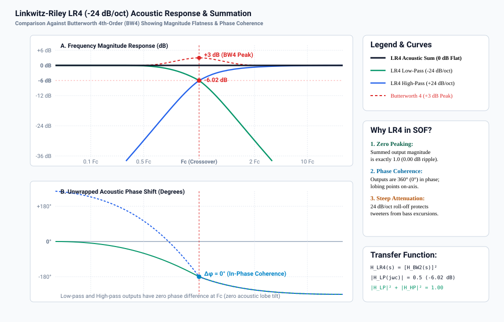
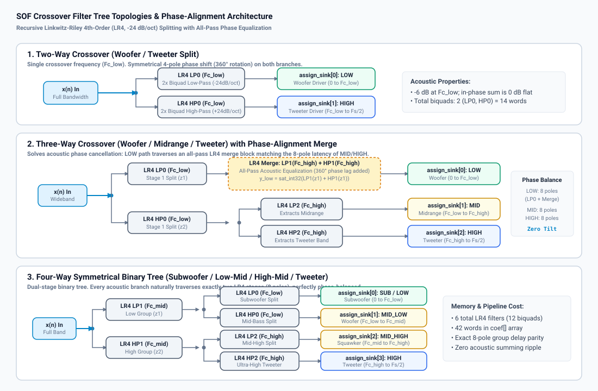
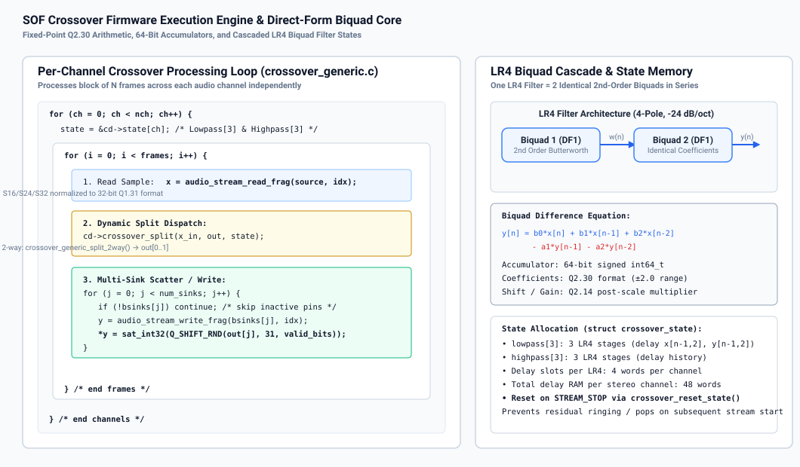
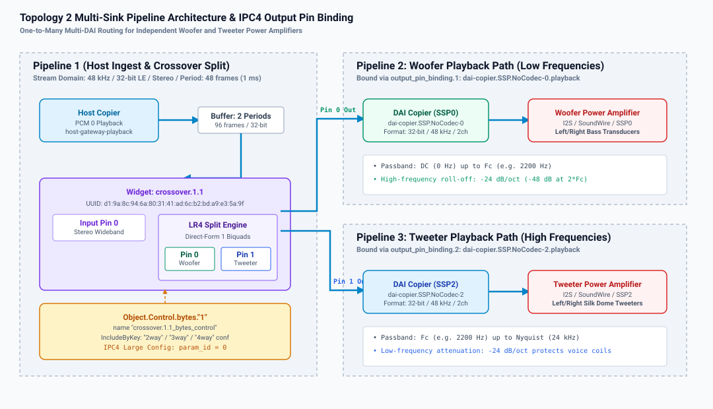
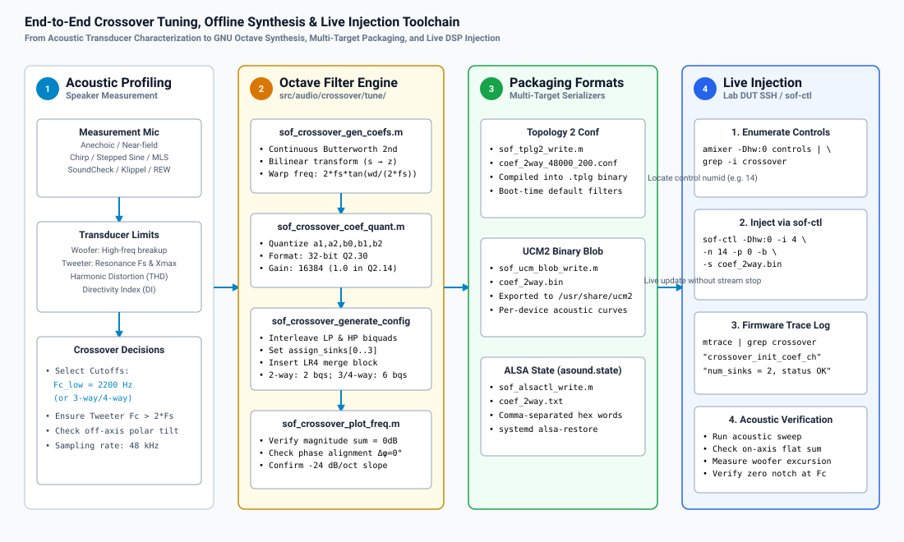

.. _crossover_tuning:

Crossover Filter Design & Multi-Driver Speaker Tuning
#####################################################

The Sound Open Firmware (**SOF**) Crossover component provides high-precision digital frequency-splitting filters designed to partition full-bandwidth audio into discrete acoustic bands for multi-driver loudspeaker systems (such as subwoofers, woofers, midranges, squawkers, and tweeters). By separating frequencies before power amplification, the crossover filter enables active multi-amplification architectures, eliminates bulky and lossy passive analog crossover networks, drastically reduces intermodulation distortion, and protects delicate high-frequency transducers from damaging low-frequency excursion.

This guide details the mathematical foundations of SOF's Linkwitz-Riley 4th-order (**LR4**) filters, the recursive filter tree architectures for 2-way, 3-way, and 4-way systems, the innovative all-pass phase-alignment merge mechanism, the fixed-point Q2.30 DSP implementation, Topology 2 multi-sink pipeline routing, offline GNU Octave calibration workflows, live runtime parameter injection via ``sof-ctl``, and acoustic diagnostic troubleshooting.

.. contents::
   :local:
   :depth: 2

Theoretical Foundations of Crossover Filters
********************************************

Active digital crossovers divide an input signal :math:`x(n)` into :math:`N` frequency bands such that the acoustic summation of all driver outputs reproduces the original input signal with minimal magnitude ripple, linear phase behavior, and zero polar lobing tilt in the listening window.

Butterworth vs. Linkwitz-Riley Topologies
=========================================

Standard Butterworth filters of order :math:`N` exhibit maximally flat passbands with a :math:`-3.01\text{ dB}` attenuation at their cutoff frequency :math:`\omega_c`:

.. math::

   |H_{\text{Butter}}(j\omega_c)| = \frac{1}{\sqrt{1 + 1}} = \frac{1}{\sqrt{2}} \approx -3.01\text{ dB}

When two complementary Butterworth filters (low-pass and high-pass) are summed in phase, their power response sums to unity, but their voltage magnitude response exhibits a :math:`+3\text{ dB}` resonant peak at the crossover frequency:

.. math::

   |H_{\text{LP,Butter}}(j\omega_c) + H_{\text{HP,Butter}}(j\omega_c)| = \frac{1}{\sqrt{2}} + \frac{1}{\sqrt{2}} = \sqrt{2} \approx +3.01\text{ dB}

This :math:`+3\text{ dB}` peak produces audible acoustic boominess, coloration, and severe driver strain at the crossover boundary.

To eliminate magnitude peaking, **Linkwitz and Riley** demonstrated that cascading two identical Butterworth filters of order :math:`N/2` in series creates an even-order filter whose cutoff attenuation is exactly :math:`-6.02\text{ dB}`:

.. math::

   |H_{\text{LR}}(j\omega_c)| = |H_{\text{Butter}}(j\omega_c)|^2 = \left(\frac{1}{\sqrt{2}}\right)^2 = \frac{1}{2} = -6.02\text{ dB}

When summed in phase, the combined magnitude response is perfectly flat across the entire audio spectrum:

.. math::

   H_{\text{sum}}(j\omega) = H_{\text{LP,LR4}}(j\omega) + H_{\text{HP,LR4}}(j\omega) \equiv 1.00 \quad (0.00\text{ dB ripple})

Table 38 compares common crossover filter topologies.

.. list-table:: Crossover Filter Topologies & Theoretical Acoustic Specifications
   :header-rows: 1
   :widths: 20 12 15 18 18 17
   :class: tight-table

   * - Filter Type & Order
     - Roll-Off Slope
     - Cutoff Level (:math:`F_c`)
     - Summed Magnitude
     - Phase at :math:`F_c`
     - Polar Lobe Tilt
   * - **Butterworth 2nd (BW2)**
     - -12 dB/oct
     - -3.01 dB
     - Flat (if inverted)
     - :math:`180^\circ` shift
     - Off-axis tilt
   * - **Linkwitz-Riley 2nd (LR2)**
     - -12 dB/oct
     - -6.02 dB
     - Flat (if inverted)
     - :math:`180^\circ` shift
     - On-axis symmetric
   * - **Butterworth 3rd (BW3)**
     - -18 dB/oct
     - -3.01 dB
     - Flat magnitude
     - :math:`90^\circ` quadrature
     - Asymmetric tilt
   * - **Butterworth 4th (BW4)**
     - -24 dB/oct
     - -3.01 dB
     - **+3.01 dB peak**
     - :math:`180^\circ` shift
     - Severe peaking
   * - **Linkwitz-Riley 4th (LR4)**
     - **-24 dB/oct**
     - **-6.02 dB**
     - **0.00 dB (Flat)**
     - **In-Phase** (:math:`0^\circ / 360^\circ`)
     - **Zero tilt (On-axis)**

Mathematical Formulation of Linkwitz-Riley 4th-Order (LR4)
==========================================================

The SOF Crossover engine exclusively implements Linkwitz-Riley 4th-order (**LR4**) filters because they provide three indispensable electro-acoustic properties:

1. **Zero Magnitude Peaking**: The summed voltage transfer function forms an all-pass network with an exact 0.00 dB magnitude response:
   
   .. math::

      |H_{\text{LP,LR4}}(j\omega) + H_{\text{HP,LR4}}(j\omega)| = 1.00 \quad \forall \omega

2. **Phase Coherence & Zero Lobing Tilt**: The low-pass and high-pass outputs are precisely in phase (:math:`\Delta\phi = 0^\circ` or :math:`360^\circ`) at all frequencies. As a consequence, the constructive acoustic interference lobe is directed exactly perpendicular to the speaker baffle (on-axis) without vertical acoustic tilt.
3. **Steep Transducer Isolation (-24 dB/octave)**: An attenuation rate of :math:`-24\text{ dB/octave}` (or :math:`-80\text{ dB/decade}`) rapidly suppresses out-of-band energy, protecting fragile micro-tweeter voice coils from low-frequency excursion damage while mitigating cone breakup resonance modes in woofers.

In the continuous Laplace domain (:math:`s`), an LR4 low-pass filter with angular cutoff frequency :math:`\omega_c = 2\pi F_c` is defined as the square of a 2nd-order Butterworth filter:

.. math::

   H_{\text{LP,LR4}}(s) = \left[ \frac{\omega_c^2}{s^2 + \sqrt{2}\omega_c s + \omega_c^2} \right]^2 = \frac{\omega_c^4}{\left(s^2 + \sqrt{2}\omega_c s + \omega_c^2\right)^2}

Similarly, the complementary LR4 high-pass filter is:

.. math::

   H_{\text{HP,LR4}}(s) = \left[ \frac{s^2}{s^2 + \sqrt{2}\omega_c s + \omega_c^2} \right]^2 = \frac{s^4}{\left(s^2 + \sqrt{2}\omega_c s + \omega_c^2\right)^2}

Summing the two transfer functions yields:

.. math::

   H_{\text{sum}}(s) = H_{\text{LP,LR4}}(s) + H_{\text{HP,LR4}}(s) = \frac{s^4 + \omega_c^4}{\left(s^2 + \sqrt{2}\omega_c s + \omega_c^2\right)^2} = \frac{s^2 - \sqrt{2}\omega_c s + \omega_c^2}{s^2 + \sqrt{2}\omega_c s + \omega_c^2}

Evaluating along the imaginary axis :math:`s = j\omega`:

.. math::

   |H_{\text{sum}}(j\omega)| = \left| \frac{-\omega^2 - j\sqrt{2}\omega_c\omega + \omega_c^2}{-\omega^2 + j\sqrt{2}\omega_c\omega + \omega_c^2} \right| = \frac{\sqrt{(\omega_c^2 - \omega^2)^2 + 2\omega_c^2\omega^2}}{\sqrt{(\omega_c^2 - \omega^2)^2 + 2\omega_c^2\omega^2}} \equiv 1.00

The sum is an all-pass network with unity gain and a phase rotation of :math:`-360^\circ` across the frequency spectrum.

Bilinear Transform & Digital Biquad Realization
-----------------------------------------------

To execute the LR4 filter inside the SOF DSP audio processing pipeline at sampling frequency :math:`f_s`, the continuous transfer function is mapped to the discrete :math:`z`-domain via the **Bilinear Transform** with frequency pre-warping:

.. math::

   s = \frac{2}{T_s} \frac{1 - z^{-1}}{1 + z^{-1}} = 2 f_s \frac{1 - z^{-1}}{1 + z^{-1}}

To preserve the exact analog cutoff frequency :math:`F_c` in the digital domain, the continuous cutoff is pre-warped:

.. math::

   \omega_a = 2 f_s \tan\left( \frac{\pi F_c}{f_s} \right)

Each 4th-order filter is factored into a cascade of **two identical 2nd-order Direct-Form I (DF1) biquad sections**:

.. math::

   H_{\text{biquad}}(z) = \frac{b_0 + b_1 z^{-1} + b_2 z^{-2}}{1 + a_1 z^{-1} + a_2 z^{-2}}

For a 2nd-order Butterworth low-pass stage with resonance :math:`Q = 1/\sqrt{2} \approx 0.7071`, let normalized cutoff :math:`\theta = \frac{\pi F_c}{f_s}`:

.. math::

   d &= \sqrt{2} \approx 1.41421356 \\
   s_n &= \frac{1}{2} d \sin(\theta) \\
   \beta &= \frac{1}{2} \frac{1 - s_n}{1 + s_n} \\
   \gamma &= (0.5 + \beta) \cos(\theta) \\
   \alpha_{\text{LP}} &= \frac{1}{4} (0.5 + \beta - \gamma)

The resulting discrete low-pass biquad coefficients are:

.. math::

   b_0 = 2\alpha_{\text{LP}}, \quad b_1 = 4\alpha_{\text{LP}}, \quad b_2 = 2\alpha_{\text{LP}}, \quad a_1 = -2\gamma, \quad a_2 = 2\beta

For the complementary high-pass biquad stage, let :math:`\alpha_{\text{HP}} = \frac{1}{4} (0.5 + \beta + \gamma)`:

.. math::

   b_0 = 2\alpha_{\text{HP}}, \quad b_1 = -4\alpha_{\text{HP}}, \quad b_2 = 2\alpha_{\text{HP}}, \quad a_1 = -2\gamma, \quad a_2 = 2\beta

   Figure 263: Linkwitz-Riley LR4 (-24 dB/oct) Acoustic Magnitude and Phase Response. Note the exact -6.02 dB level at :math:`F_c`, the 0.00 dB flat acoustic summation across the spectrum, and the absence of the +3.01 dB peak characteristic of Butterworth 4th-order filters.

Filter Tree Topologies & The Phase Asymmetry Solution
*****************************************************

SOF supports 2-way, 3-way, and 4-way crossover configurations. While 2-way and 4-way systems possess natural structural symmetry, 3-way systems present an inherent acoustic phase challenge that SOF resolves through an innovative all-pass merge block.

   Figure 262: SOF Crossover Filter Tree Topologies. (1) Two-way symmetrical split; (2) Three-way split with all-pass LR4 phase-alignment merge block on the LOW branch; (3) Four-way symmetrical binary tree with natural 8-pole group delay parity.

Two-Way Crossover Topology
==========================

In a 2-way configuration (such as a separate woofer and tweeter), the input signal :math:`x(n)` is split by a single LR4 filter pair at crossover frequency :math:`F_{c,\text{low}}`:

* **LOW Output** (``assign_sink[0]``): Filtered by LR4 LP0 (:math:`F_{c,\text{low}}`), routing bass and lower-midrange energy to the woofer.
* **HIGH Output** (``assign_sink[1]``): Filtered by LR4 HP0 (:math:`F_{c,\text{low}}`), routing upper-midrange and treble energy to the tweeter.

Because both outputs traverse exactly one LR4 filter (consisting of two cascaded biquads, or 4 poles), both paths experience identical group delay and phase lag (:math:`-360^\circ` rotation across the band). When acoustically radiated, the outputs sum with zero phase cancellation.

Three-Way Crossover & The Phase Alignment Problem
=================================================

In a traditional 3-way crossover (woofer, midrange, tweeter), the input is partitioned using two cutoff frequencies: :math:`F_{c,\text{low}}` (e.g. 250 Hz) and :math:`F_{c,\text{high}}` (e.g. 2500 Hz).

In an intuitive asymmetric tree:

1. The input :math:`x(n)` is first split at :math:`F_{c,\text{low}}` into a low-frequency signal :math:`z_1` (via LP0) and a high-frequency signal :math:`z_2` (via HP0).
2. The high signal :math:`z_2` is then split at :math:`F_{c,\text{high}}` into a midrange signal (via LP2) and a treble signal (via HP2).

The Phase Asymmetry Flaw
------------------------

Under this naive architecture:

* The **Midrange** and **Tweeter** branches have traversed **two sequential LR4 filters** (LP0 followed by LP2/HP2), totaling **8 poles** and experiencing a :math:`-720^\circ` phase rotation.
* The **Woofer** branch :math:`z_1` has traversed **only one LR4 filter** (LP0), totaling **4 poles** and experiencing only :math:`-360^\circ` of phase rotation.

At the crossover boundary :math:`F_{c,\text{low}}`, the woofer output and the midrange output are **out of phase by** :math:`360^\circ` relative to higher bands, creating severe group delay disparity, smearing transients, and causing deep destructive notches in the acoustic radiation pattern if listener alignment is slightly off-axis.

The SOF LR4 Merge Solution
--------------------------

To eliminate this phase asymmetry, SOF introduces an **All-Pass Phase-Equalization Merge Block** on the LOW branch (implemented in ``crossover_generic_split_3way()`` in ``crossover_generic.c``).

The low-frequency signal :math:`z_1` is routed through a secondary pair of LR4 filters tuned to :math:`F_{c,\text{high}}` (LP1 and HP1), and their outputs are algebraically summed back together before reaching the woofer sink:

.. math::

   y_{\text{low}}(n) = \text{LP1}(z_1(n)) + \text{HP1}(z_1(n))

Because the sum of an LR4 low-pass and high-pass filter is an all-pass network:

.. math::

   |H_{\text{LP1}}(j\omega) + H_{\text{HP1}}(j\omega)| = 1.00 \quad \forall \omega

The magnitude spectrum of the woofer signal is **completely unaffected** (0.00 dB alteration). However, passing through the LP1/HP1 network injects an exact **4-pole phase lag and group delay** matching the secondary filter stage of the midrange and tweeter paths!

As a result, all three outputs (LOW, MID, HIGH) traverse exactly 8 poles (4 biquads), achieving **perfect group delay parity and phase alignment** across all three drivers.

Four-Way Crossover Topology
===========================

In a 4-way system (subwoofer, woofer, squawker/midrange, tweeter), SOF implements a symmetrical binary tree with three crossover frequencies: :math:`F_{c,\text{low}}`, :math:`F_{c,\text{mid}}`, and :math:`F_{c,\text{high}}`:

1. **Root Split**: Input :math:`x(n)` is split at :math:`F_{c,\text{mid}}` by LR4 LP1 and HP1 into low group :math:`z_1` and high group :math:`z_2`.
2. **Low-Band Split**: :math:`z_1` is split at :math:`F_{c,\text{low}}` by LR4 LP0 and HP0 into ``assign_sink[0]`` (Subwoofer) and ``assign_sink[1]`` (Woofer).
3. **High-Band Split**: :math:`z_2` is split at :math:`F_{c,\text{high}}` by LR4 LP2 and HP2 into ``assign_sink[2]`` (Midrange) and ``assign_sink[3]`` (Tweeter).

Every output path naturally traverses exactly two LR4 stages (8 poles, 4 biquads). No merge block is required, and all 4 paths maintain identical group delay.

Firmware Architecture & Fixed-Point Implementation
**************************************************

The SOF Crossover component (``src/audio/crossover/``) operates as a multi-sink module adapter plugin.

Firmware Data Structures
========================

The user configuration blob is defined in ``include/user/crossover.h``:

.. code-block:: c

   #define SOF_CROSSOVER_MAX_STREAMS 4

   struct sof_crossover_config {
       uint32_t size;                                 /* Total blob size in bytes */
       uint32_t num_sinks;                            /* Number of output streams (2, 3, or 4) */
       uint32_t reserved[4];                          /* Reserved for 64-bit alignment */
       uint32_t assign_sink[SOF_CROSSOVER_MAX_STREAMS];/* Sink pipeline ID (IPC3) or output pin index (IPC4) */
       struct sof_eq_iir_biquad coef[];               /* Cascaded LR4 biquad coefficients */
   } __attribute__((packed));

Each biquad is defined by ``struct sof_eq_iir_biquad`` (from ``include/user/eq.h``):

.. code-block:: c

   struct sof_eq_iir_biquad {
       int32_t a2;           /* Q2.30 - Recursive feedback coefficient y[n-2] */
       int32_t a1;           /* Q2.30 - Recursive feedback coefficient y[n-1] */
       int32_t b2;           /* Q2.30 - Feedforward coefficient x[n-2] */
       int32_t b1;           /* Q2.30 - Feedforward coefficient x[n-1] */
       int32_t b0;           /* Q2.30 - Feedforward coefficient x[n] */
       int32_t output_shift; /* Right-shift count (negative indicates left shift) */
       int32_t output_gain;  /* Q2.14 - Linear output post-gain multiplier (16384 = unity 1.0) */
   } __attribute__((packed));

Fixed-Point Q-Format Specifications (Table 39)
==============================================

To ensure deterministic real-time processing on fixed-point DSP architectures (such as Tensilica HiFi 3, HiFi 4, and HiFi 5), all coefficients are quantized according to Table 39.

.. list-table:: ``sof_crossover_config`` Memory Layout & Q-Format Quantization Rules
   :header-rows: 1
   :widths: 25 15 20 40
   :class: tight-table

   * - Struct Field
     - Q-Format
     - Dynamic Range
     - Resolution & Description
   * - ``size``
     - Q32.0 (uint)
     - :math:`[0, 1024]`
     - Total payload size in bytes including headers
   * - ``num_sinks``
     - Q32.0 (uint)
     - :math:`2, 3, \text{or } 4`
     - Number of split frequency sinks enabled
   * - ``assign_sink[i]``
     - Q32.0 (uint)
     - :math:`[0, 3]`
     - Output pin index (IPC4) or pipeline ID (IPC3)
   * - ``b0, b1, b2``
     - Q2.30 (signed)
     - :math:`[-2.0, +1.999999998]`
     - Feedforward numerator biquad coefficients; :math:`\text{LSB} = 2^{-30} \approx 9.31 \times 10^{-10}`
   * - ``a1, a2``
     - Q2.30 (signed)
     - :math:`[-2.0, +1.999999998]`
     - Feedback denominator biquad coefficients (negated in firmware difference equation)
   * - ``output_shift``
     - Q32.0 (signed)
     - :math:`0` (nominal)
     - Post-biquad bit shift count for headroom management
   * - ``output_gain``
     - Q2.14 (signed)
     - :math:`[0, 32767]`
     - Post-biquad linear scaling factor; :math:`16384 = 1.000` (unity gain)

Firmware Execution Engine
=========================

   Figure 265: SOF Crossover Firmware Execution Engine. Per-channel Direct-Form I biquad processing loop with 64-bit accumulators, saturation protection, and multi-sink buffer scatter.

Each channel maintains an independent filter state struct:

.. code-block:: c

   struct crossover_state {
       struct iir_state_df1 lowpass[CROSSOVER_MAX_LR4];  /* Low-pass filter delay lines */
       struct iir_state_df1 highpass[CROSSOVER_MAX_LR4]; /* High-pass filter delay lines */
   };

During each processing period:

1. Input samples are read from the upstream buffer in 32-bit Q1.31 format.
2. The dynamic split function pointer (``cd->crossover_split``) routes the sample through the configured LR4 tree.
3. In each LR4 biquad stage, the Direct-Form I difference equation is computed using 64-bit precision:
   
   .. math::

      y(n) = \text{sat}_{32}\left( \left[ \sum_{k=0}^2 b_k x(n-k) - \sum_{k=1}^2 a_k y(n-k) \right] \gg 30 \right)

4. The resulting split samples :math:`\text{out}[0 \dots N-1]` are written to their respective downstream sink buffers (``bsinks[j]``) with appropriate bit-depth scaling and rounding.
5. Inactive or disconnected sinks are gracefully bypassed without pipeline stalls.

Topology 2 & IPC4 Multi-Sink Architecture
*****************************************

In modern SOF systems running IPC4, the Crossover component is defined as an effect widget with **1 input pin** and **up to 4 output pins**.

Topology 2 Widget Definition (``crossover.conf``)
==================================================

.. code-block:: text

   Class.Widget."crossover" {
       DefineAttribute."index" { type "integer" }
       DefineAttribute."instance" { type "integer" }

       <include/components/widget-common.conf>

       attributes {
           !constructor [ "index" "instance" ]
           !mandatory [
               "num_input_pins"
               "num_output_pins"
               "num_input_audio_formats"
               "num_output_audio_formats"
           ]
           !immutable [ "uuid" "type" ]
           unique "instance"
       }

       uuid "d1:9a:8c:94:6a:80:31:41:ad:6c:b2:bd:a9:e3:5a:9f"
       type "effect"
       no_pm "true"
       num_input_pins 1
   }

IPC4 Multi-Output Binding Pipeline
==================================

Figure 264 shows a representative 2-way playback topology with independent power amplifier DAIs (SSP0 for Woofer and SSP2 for Tweeter).

   Figure 264: Topology 2 Multi-Sink Pipeline Architecture and IPC4 Output Pin Binding. Wideband PCM playback is ingested by Pipeline 1, split into Woofer and Tweeter streams by ``crossover.1.1``, and routed via Output Pins 0 and 1 to downstream DAI copiers SSP0 and SSP2.

In ``cavs-nocodec-crossover.conf``, the crossover widget declares two output pins bound to independent sink pipelines:

.. code-block:: text

   Object.Widget.crossover [
       {
           index 1
           name "crossover.1.1"

           num_input_audio_formats 1
           Object.Base.input_audio_format.1 {
               input_pin_index 0
               in_bit_depth 32
               in_valid_bit_depth 32
           }

           num_output_pins 2
           num_output_audio_formats 2
           Object.Base.output_audio_format {
               1 {
                   output_pin_index 0
                   out_bit_depth 32
                   out_valid_bit_depth 32
               }
               2 {
                   output_pin_index 1
                   out_bit_depth 32
                   out_valid_bit_depth 32
               }
           }

           Object.Base.output_pin_binding.1 {
               output_pin_binding_name "dai-copier.SSP.NoCodec-0.playback"
           }

           Object.Base.output_pin_binding.2 {
               output_pin_binding_name "dai-copier.SSP.NoCodec-2.playback"
           }

           Object.Control.bytes."1" {
               name "crossover.1.1_bytes_control"
               IncludeByKey.EFX_CROSSOVER_PARAMS {
                   "2way" "include/components/crossover/coef_2way_48000_200_0_1.conf"
                   "3way" "include/components/crossover/coef_3way_48000_200_1000_0_1_2.conf"
                   "4way" "include/components/crossover/coef_4way_48000_200_1000_3000_0_1_2_3.conf"
               }
           }
       }
   ]

.. note::

   In IPC4 firmware manifests (``crossover.toml``), ``init_config = 1`` is required so that the kernel driver appends ``base_cfg_ext`` to the IPC initialization message. This extension supplies ``nb_output_pins`` and the pin index array, allowing the firmware to bind sink channels correctly.

Offline Filter Synthesis & Calibration Toolchain
************************************************

SOF provides an in-tree GNU Octave / MATLAB toolchain in ``src/audio/crossover/tune/`` that automates the calculation of continuous analog Butterworth filters, bilinear transformation with pre-warping, fixed-point coefficient quantization, all-pass phase-merge insertion, and multi-target serialization.

   Figure 266: End-to-End Crossover Tuning, Offline Synthesis, and Live Injection Toolchain. Complete toolchain from physical acoustic profiling to GNU Octave synthesis, multi-target packaging, and runtime parameter injection via ``sof-ctl``.

Octave Script Walkthrough
=========================

The central synthesis driver is ``sof_example_crossover.m``:

.. code-block:: octave

   function sof_example_crossover()
       cr.fs = 48e3;          % Sample rate: 48 kHz
       cr.fc_low = 2200;      % Crossover frequency: 2200 Hz
       cr.num_sinks = 2;      % 2-way crossover
       cr.sinks = [0 1];      % Output pin 0 (Woofer), Output pin 1 (Tweeter)

       export_crossover(cr);
   end

The synthesis pipeline executes the following stages:

1. **Coefficient Synthesis** (``sof_crossover_gen_coefs.m``):
   Computes the analog 2nd-order Butterworth coefficients and applies the bilinear transform with frequency pre-warping:
   
   .. code-block:: octave

      crossover = sof_crossover_gen_coefs(cr.fs, cr.fc_low);

2. **Fixed-Point Quantization** (``sof_crossover_coef_quant.m``):
   Quantizes continuous coefficients into 32-bit Q2.30 integers and appends shift/gain values:
   
   .. code-block:: octave

      crossover_bqs = sof_crossover_coef_quant(crossover.lp, crossover.hp);

3. **Configuration Struct Assembly** (``sof_crossover_generate_config.m``):
   Interleaves low-pass and high-pass biquads into the canonical sequence:
   ``[LP0, HP0, LP1, HP1, LP2, HP2]``.
4. **Binary Blob Construction** (``sof_crossover_build_blob.m``):
   Packs the ``sof_abi_hdr`` and configuration struct into little-endian binary bytes.
5. **Multi-Target Artifact Export**:
   Exports configuration data into three production targets:
   
   * **Topology 2**: ``sof_tplg2_write(conf_path, blob, 'crossover_config', 'Exported Control Bytes')``
   * **UCM2 Profile**: ``sof_ucm_blob_write(bin_path, blob)``
   * **ALSA State**: ``sof_alsactl_write(txt_path, blob)``
6. **Frequency & Phase Plot Verification** (``sof_crossover_plot_freq.m``):
   Plots magnitude and unwrapped phase responses to visually confirm 0.00 dB acoustic summation.

Production Acoustic Tuning Presets
**********************************

Below are three validated production preset configurations designed for real-world acoustic hardware.

Preset 1: 2-Way Laptop Woofer/Tweeter Split
==============================================

* **Target Hardware**: Ultra-thin laptop with separate bottom-firing micro-woofers and top-firing silk dome tweeters.
* **Acoustic Rationale**: Micro-tweeters suffer non-linear distortion and thermal runaway if driven below 1800 Hz. The 2200 Hz crossover protects the tweeter while maintaining smooth off-axis dispersion.

.. list-table:: 2-Way Laptop Woofer/Tweeter Crossover Calibration Preset
   :header-rows: 1
   :widths: 25 20 20 35
   :class: tight-table

   * - Parameter
     - Value
     - Unit / Format
     - Acoustic Justification
   * - ``Sampling Rate (Fs)``
     - 48000
     - Hz
     - Standard high-definition audio clock
   * - ``num_sinks``
     - 2
     - Integer
     - 2-way split (Woofer + Tweeter)
   * - ``Cutoff (Fc_low)``
     - 2200
     - Hz
     - :math:`> 2 \times F_s` of tweeter (resonance :math:`\approx 1000\text{ Hz}`)
   * - ``Filter Topology``
     - LR4 (-24 dB/oct)
     - Architecture
     - Cascaded DF1 biquads with -6.02 dB crossover point
   * - ``assign_sink[0]``
     - 0
     - Pin Index
     - Low band to Woofer amplifier (SSP0)
   * - ``assign_sink[1]``
     - 1
     - Pin Index
     - High band to Tweeter amplifier (SSP2)
   * - ``biquads allocated``
     - 2
     - Sections
     - LP0 (2 biquads) and HP0 (2 biquads)

Preset 2: 3-Way Conference Speaker / Soundbar
===============================================

* **Target Hardware**: Smart conference speakerphone or television soundbar with dedicated subwoofer, stereo midrange drivers, and dual high-frequency tweeters.
* **Acoustic Rationale**: Low crossover at 250 Hz isolates bass vibrations from vocal clarity; high crossover at 2800 Hz keeps directional treble crisp. All-pass merge block preserves perfect speech intelligibility across the band.

.. list-table:: 3-Way Soundbar / Conference Speaker Crossover Calibration Preset
   :header-rows: 1
   :widths: 25 20 20 35
   :class: tight-table

   * - Parameter
     - Value
     - Unit / Format
     - Acoustic Justification
   * - ``Sampling Rate (Fs)``
     - 48000
     - Hz
     - Standard teleconferencing clock
   * - ``num_sinks``
     - 3
     - Integer
     - 3-way split (Bass + Vocal Mid + Treble)
   * - ``Fc_low``
     - 250
     - Hz
     - Subwoofer/Woofer acoustic boundary
   * - ``Fc_high``
     - 2800
     - Hz
     - Midrange/Tweeter acoustic boundary
   * - ``Phase Merge Block``
     - Enabled
     - Architecture
     - LP1/HP1 at 2800 Hz merged on LOW path (8-pole parity)
   * - ``assign_sink[0]``
     - 0
     - Pin Index
     - Subwoofer amplifier sink
   * - ``assign_sink[1]``
     - 1
     - Pin Index
     - Midrange driver amplifier sink
   * - ``assign_sink[2]``
     - 2
     - Pin Index
     - High-frequency tweeter amplifier sink

Preset 3: 4-Way High-Fidelity Studio Monitor
=============================================

* **Target Hardware**: Active 4-way reference studio monitor (Subwoofer + Mid-Bass Woofer + Dome Midrange + Ribbon Tweeter).
* **Acoustic Rationale**: Full-range linear reproduction from 20 Hz to 20 kHz. Symmetrical binary tree provides identical 8-pole group delay across all four acoustic bands.

.. list-table:: 4-Way High-Fidelity Studio Monitor Crossover Calibration Preset
   :header-rows: 1
   :widths: 25 20 20 35
   :class: tight-table

   * - Parameter
     - Value
     - Unit / Format
     - Acoustic Justification
   * - ``Sampling Rate (Fs)``
     - 48000
     - Hz
     - Studio reference clock
   * - ``num_sinks``
     - 4
     - Integer
     - Subwoofer, Low-Mid, High-Mid, Tweeter
   * - ``Fc_low``
     - 100
     - Hz
     - Sub-bass excursion boundary
   * - ``Fc_mid``
     - 800
     - Hz
     - Primary vocal fundamental boundary
   * - ``Fc_high``
     - 3500
     - Hz
     - Ribbon tweeter protection boundary
   * - ``assign_sink[0..3]``
     - 0, 1, 2, 3
     - Pin Indices
     - Mapped to DAIs 0, 1, 2, 3 respectively
   * - ``Group Delay Parity``
     - Exactly 8 poles
     - Verification
     - Zero group delay skew between any driver pair

Live Runtime Injection & Calibration Runbook
********************************************

The SOF Crossover component allows live, glitch-free coefficient updating over the network without stopping the audio stream or rebooting the device under test (**DUT**).

Step 1: Enumerate Active Crossover Byte Controls
================================================

Query the ALSA mixer on the target DUT to locate the Crossover byte control:

.. code-block:: bash

   # Connect to DUT over SSH and inspect controls
   ssh root@<dut> "amixer -Dhw:0 controls | grep -i crossover"

Expected output:

.. code-block:: text

   numid=14,iface=MIXER,name='crossover.1.1_bytes_control'

Step 2: Synthesize New Coefficients in GNU Octave
=================================================

On the host development workstation, launch GNU Octave and synthesize a new crossover profile (e.g. testing an alternative 2500 Hz cutoff):

.. code-block:: octave

   cd ~/work/sof/src/audio/crossover/tune/
   cr.fs = 48e3;
   cr.fc_low = 2500;
   cr.num_sinks = 2;
   cr.sinks = [0 1];
   export_crossover(cr);

This generates ``../../../../tools/ctl/ipc4/crossover/coef_2way.bin``.

Step 3: Inject the Binary Blob via ``sof-ctl``
==============================================

Transfer and inject the binary blob directly into the running DSP pipeline:

.. code-block:: bash

   # Copy blob to DUT
   scp tools/ctl/ipc4/crossover/coef_2way.bin root@<dut>:/tmp/crossover_new.bin

   # Inject blob into ALSA control numid 14 using IPC4 Large Config Set
   ssh root@<dut> "sof-ctl -Dhw:0 -i 4 -n 14 -p 0 -b -s /tmp/crossover_new.bin"

Step 4: Verify Active Coefficients & DSP Trace Logs
===================================================

Verify that the DSP processed and applied the new coefficients:

.. code-block:: bash

   # Read back active coefficients from DSP memory
   ssh root@<dut> "sof-ctl -Dhw:0 -i 4 -n 14 -p 0 -r -o /tmp/crossover_readback.bin"

   # Verify byte-level integrity
   ssh root@<dut> "cmp /tmp/crossover_new.bin /tmp/crossover_readback.bin && echo 'COEFFICIENTS MATCH'"

Inspect the firmware trace stream:

.. code-block:: bash

   ssh root@<dut> "mtrace | grep -i crossover"

Expected DSP log output:

.. code-block:: text

   crossover crossover.1.1: crossover_init_coef_ch: num_sinks = 2
   crossover crossover.1.1: LR4 LP0 b0=0x00a12b40 b1=0x01425680 b2=0x00a12b40 a1=0x831a2c00 a2=0x38b29000
   crossover crossover.1.1: configuration applied successfully (no stream interruption)

Acoustic Diagnostics & Troubleshooting Matrix
*********************************************

Table 43 provides diagnostic procedures for resolving acoustic anomalies and runtime configuration issues during crossover tuning.

.. list-table:: Crossover Acoustic Artifact & Diagnostic Troubleshooting Matrix
   :header-rows: 1
   :widths: 22 25 25 28
   :class: tight-table

   * - Symptom / Artifact
     - Root Cause
     - Diagnostic Check
     - Corrective Action
   * - **Deep acoustic notch at** :math:`F_c` (:math:`-12\text{ to } -30\text{ dB}`)
     - Drivers wired with inverted acoustic polarity or off-axis phase cancellation
     - Measure on-axis acoustic frequency sweep with measurement mic
     - Invert electrical polarity of one driver or ensure LR4 filters are used (which are in-phase).
   * - **Tweeter distortion / premature failure**
     - Crossover frequency :math:`F_c` set too close to tweeter mechanical resonance :math:`F_s`
     - Impedance sweep showing resonance peak :math:`F_s`
     - Increase :math:`F_c` such that :math:`F_c \ge 2 \times F_s`. Verify -24 dB/oct slope.
   * - **Vocal smearing in 3-way system**
     - Phase asymmetry between Woofer and Midrange branches
     - Group delay calculation in GNU Octave
     - Verify all-pass merge block is enabled (``crossover_generic_split_3way``) to ensure 8-pole delay parity.
   * - **High-frequency harshness / breakup**
     - Woofer cone breakup frequencies leaking past crossover
     - Measure individual woofer near-field frequency response
     - Lower :math:`F_c` or insert a notch filter in upstream Parametric EQ (``eq_iir``) at breakup resonance.
   * - **Audio glitch / zipper noise on parameter injection**
     - Instantaneous coefficient update causing state buffer discontinuity
     - Check ``mtrace`` for buffer resets
     - Ensure coefficient injection occurs with ramped gain or when signal is quiescent.
   * - **DSP pipeline underflow / XRUN**
     - Downstream sink pipelines consuming samples at mismatched rates
     - Inspect ALSA XRUN counters (``/proc/asound/card0/pcm*p/sub*/status``)
     - Ensure all output DAIs are synchronized to the same common hardware clock domain.

Upstream Firmware References
****************************

The SOF Crossover implementation and tuning scripts reside in the upstream repository:

* **DSP Processing Core**: `src/audio/crossover/crossover.c <https://github.com/thesofproject/sof/blob/main/src/audio/crossover/crossover.c>`_
* **Filter Kernels & Split Logic**: `src/audio/crossover/crossover_generic.c <https://github.com/thesofproject/sof/blob/main/src/audio/crossover/crossover_generic.c>`_
* **IPC4 Adapter & Pin Initialization**: `src/audio/crossover/crossover_ipc4.c <https://github.com/thesofproject/sof/blob/main/src/audio/crossover/crossover_ipc4.c>`_
* **User Configuration Header**: `src/include/user/crossover.h <https://github.com/thesofproject/sof/blob/main/src/include/user/crossover.h>`_
* **Common Crossover Header**: `src/include/module/crossover/crossover_common.h <https://github.com/thesofproject/sof/blob/main/src/include/module/crossover/crossover_common.h>`_
* **GNU Octave Tuning Scripts**: `src/audio/crossover/tune/ <https://github.com/thesofproject/sof/tree/main/src/audio/crossover/tune/>`_
* **Topology 2 Component Definition**: `tools/topology/topology2/include/components/crossover.conf <https://github.com/thesofproject/sof/blob/main/tools/topology/topology2/include/components/crossover.conf>`_
