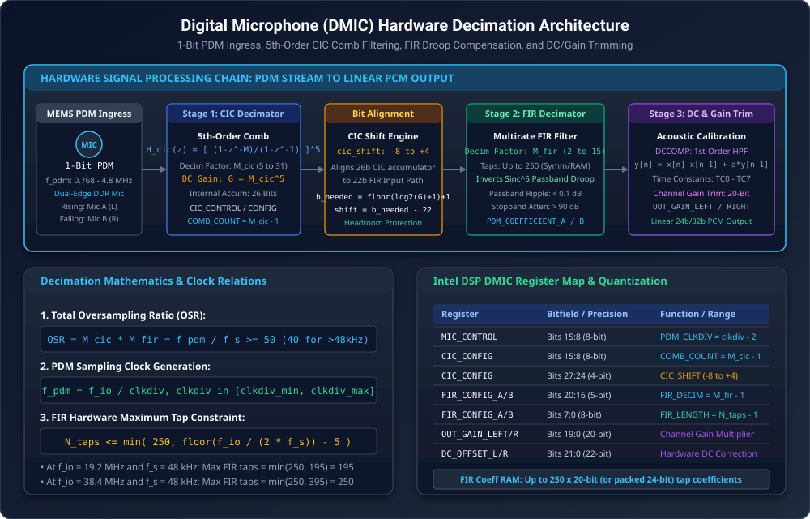
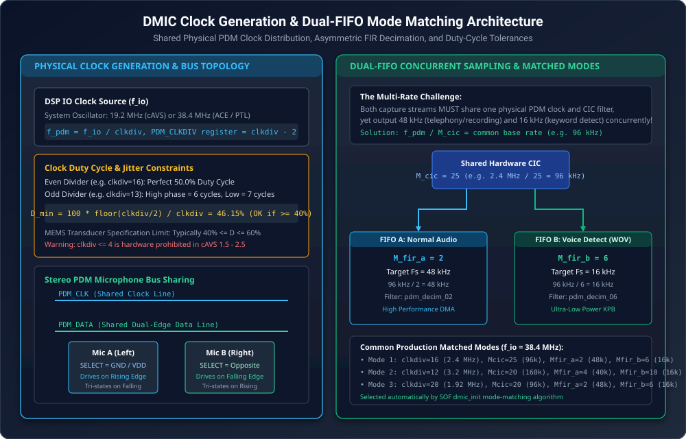
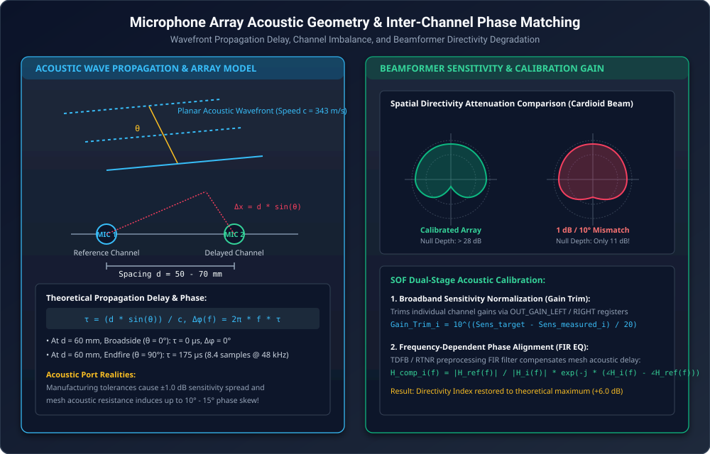
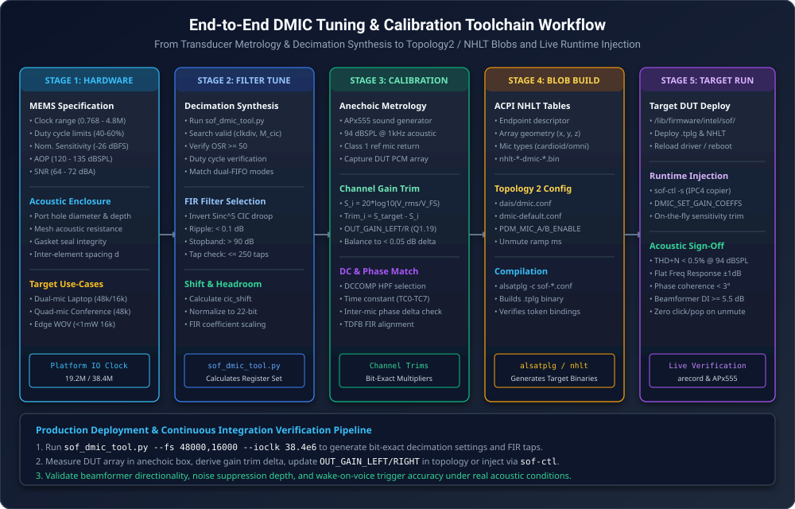

.. _dmic_tuning:

Digital Microphone (DMIC) Acoustic Calibration & Array Tuning Guide
###################################################################

Digital Microphone (DMIC) interfaces represent the primary audio capture ingress for modern Intel-based
computing platforms, including Tiger Lake (cAVS 2.5), Arrow Lake (ACE 1.5), and Panther Lake (ACE 3.0).
Unlike conventional analog microphone inputs that rely on external codecs, digital MEMS (Micro-Electro-Mechanical
Systems) microphones integrate the acoustic transducer, preamplifier, and a 4th-order or 5th-order
Sigma-Delta (:math:`\Sigma\Delta`) modulator directly into a sub-millimeter silicon package. The transducers
stream 1-bit oversampled Pulse Density Modulation (PDM) data directly into the DSP hardware.

The Sound Open Firmware (SOF) DMIC processing subsystem incorporates high-performance hardware decimation
engines, programmable clock generation, dual-FIFO multirate dispatchers, and acoustic sensitivity/phase
calibration filters. This guide provides an authoritative mathematical, architectural, and operational
reference for configuring DMIC hardware decimators, calculating clock dividers and duty cycles, aligning
microphone array phase and gain, compiling ACPI NHLT and ALSA Topology 2 binaries, and validating live
transducer performance on target Hardware Under Test (DUT).

.. contents:: Table of Contents
   :local:
   :depth: 3

Transducer Physics & PDM Digital Ingress
========================================

MEMS Digital Transducer Architecture
------------------------------------

Modern digital microphones convert ambient acoustic pressure fluctuations :math:`P(t)` (measured in Pascals,
where :math:`1\text{ Pa} = 94\text{ dBSPL}`) into a high-rate 1-bit PDM pulse stream. The acoustic sensor consists
of a flexible conductive diaphragm suspended over a rigid perforated backplate, forming a variable capacitor.
Sound waves passing through the acoustic port deflect the diaphragm, modulating the capacitance.

An on-chip Application-Specific Integrated Circuit (ASIC) amplifies the capacitive charge and converts the
continuous analog voltage into a 1-bit digital bitstream using an oversampled :math:`\Sigma\Delta` modulator.
The key acoustic metrology parameters governing digital microphones are summarized below:

* **Acoustic Sensitivity** (:math:`S`): The electrical signal level output by the microphone when subjected to a
  standard reference sound pressure level of :math:`1.0\text{ Pa}` (:math:`94\text{ dBSPL}`) at :math:`1\text{ kHz}`. For digital
  microphones, sensitivity is expressed in decibels relative to full scale (**dBFS**). A standard digital
  microphone has a nominal sensitivity of :math:`-26\text{ dBFS}` (with typical production distributions ranging
  from :math:`-38\text{ dBFS}` to :math:`-18\text{ dBFS}`).

* **Acoustic Overload Point (AOP)**: The maximum sound pressure level at which the total harmonic distortion
  (THD) reaches :math:`10\%` (or :math:`1\%` depending on manufacturer rating). Standard mobile microphones offer an
  AOP of :math:`120\text{ dBSPL}` to :math:`135\text{ dBSPL}`. Inputs exceeding the AOP cause severe clipping and
  :math:`\Sigma\Delta` modulator saturation.

* **Signal-to-Noise Ratio (SNR)**: The ratio between the nominal sensitivity level (:math:`94\text{ dBSPL}` at :math:`1\text{ kHz}`)
  and the A-weighted acoustic noise floor of the microphone (:math:`V_{\text{noise}}`), measured in :math:`\text{dBA}`:

  .. math::

     \text{SNR} = 94\text{ dBSPL} - \text{EIN}

  Where :math:`\text{EIN}` is the **Equivalent Input Noise** level in :math:`\text{dBSPL(A)}`. High-fidelity laptop arrays
  typically utilize microphones with an SNR between :math:`64\text{ dBA}` and :math:`72\text{ dBA}` (:math:`\text{EIN} \approx 22 - 30\text{ dBSPL}`).

Double-Data-Rate (DDR) Stereo Multiplexing
------------------------------------------

To minimize physical pin count and routing complexity across narrow laptop display hinges, digital microphones
use a shared two-wire interface consisting of a single clock line (``PDM_CLK``) and a single data line
(``PDM_DATA``). A pair of microphones (Mic A and Mic B) multiplexes onto this single data line using
Double-Data-Rate (DDR) timing governed by an external hardware ``SELECT`` pin:

.. table:: Stereo PDM Transducer Pin Configuration & Multiplexing
   :widths: 20 20 30 30

   +---------------+------------------+------------------------------+------------------------------+
   | Component     | SELECT Pin State | Clock Driving Edge           | Bus Release Phase            |
   +===============+==================+==============================+==============================+
   | **Mic A (L)** | Tied to Ground   | Rising Edge (Polarity 0)     | High-Z on Falling Edge       |
   +---------------+------------------+------------------------------+------------------------------+
   | **Mic B (R)** | Tied to VDD      | Falling Edge (Polarity 1)    | High-Z on Rising Edge        |
   +---------------+------------------+------------------------------+------------------------------+

When ``PDM_CLK`` rises, Mic A latches its instantaneous 1-bit comparator state onto ``PDM_DATA`` while Mic B
maintains high-impedance (tri-state). When ``PDM_CLK`` falls, Mic A releases the bus into high-impedance,
and Mic B drives its 1-bit state onto ``PDM_DATA``. The SOF hardware receiver samples both edges, de-interleaving
the stream into independent Left and Right channels.

Hardware Decimation Pipeline Architecture
=========================================

The DSP DMIC hardware controller ingests raw 1-bit PDM streams from up to 4 physical PDM controllers
(supporting up to 8 microphone channels) and decimates them to linear 24-bit or 32-bit PCM audio samples.
The complete signal chain is illustrated in :numref:`fig_dmic_pdm_decimation_pipeline`.

.. _fig_dmic_pdm_decimation_pipeline:

   Digital Microphone (DMIC) Hardware Decimation Signal Processing Pipeline

The signal processing chain consists of five sequential hardware stages:

1. **Cascaded Integrator-Comb (CIC) 5th-Order Filter**: High-ratio coarse decimation stage downsampling the
   overclocked 1-bit stream (:math:`f_{\text{pdm}}`) to an intermediate rate (:math:`f_{\text{cic}}`).
2. **Arithmetic Shifter & Headroom Normalizer**: Bit-alignment logic mapping the 26-bit CIC accumulator into
   the 22-bit input word of the FIR stage while preventing fixed-point overflow.
3. **Finite Impulse Response (FIR) Multirate Filter**: Precision shaping filter inverting the :math:`\text{sinc}^5`
   passband droop of the CIC filter and downsampling to the target audio sample rate (:math:`f_s`).
4. **DC-Offset Compensation (DCCOMP)**: First-order high-pass Infinite Impulse Response (IIR) filter
   eliminating transducer DC bias and thermal drift.
5. **Channel Gain Multipliers**: 20-bit scaling registers balancing acoustic sensitivities across all
   elements of the microphone array.

Stage 1: 5th-Order Cascaded Integrator-Comb (CIC) Filter
--------------------------------------------------------

The primary decimation stage is implemented as a 5th-order Cascaded Integrator-Comb (CIC) filter. Because
CIC filters require no multiplier units (utilizing only adders, subtractors, and delay registers), they
operate directly at the multi-megahertz PDM clock rate with minimal power dissipation.

The discrete-time transfer function of an :math:`N`-th order CIC filter with decimation factor :math:`M_{\text{cic}}` is:

.. math::

   H_{\text{CIC}}(z) = \left( \frac{1 - z^{-M_{\text{cic}}}}{1 - z^{-1}} \right)^N = \left( \sum_{k=0}^{M_{\text{cic}}-1} z^{-k} \right)^N

In Intel cAVS and ACE DSP architectures, the filter order is fixed at :math:`N = 5` (5 cascaded integrator stages
followed by 5 cascaded comb stages). The decimation factor :math:`M_{\text{cic}}` is programmable between
:math:`5 \le M_{\text{cic}} \le 31`.

The continuous-frequency magnitude response of the 5th-order CIC filter normalized to :math:`f_{\text{pdm}}` is:

.. math::

   |H_{\text{CIC}}(f)| = \left| \frac{\sin(\pi M_{\text{cic}} f / f_{\text{pdm}})}{\sin(\pi f / f_{\text{pdm}})} \right|^5

At zero frequency (:math:`f = 0`), the DC power gain of the filter is:

.. math::

   G_{\text{CIC}} = M_{\text{cic}}^N = M_{\text{cic}}^5

Because :math:`M_{\text{cic}} \le 31`, the maximum theoretical DC gain is :math:`31^5 = 28,629,151` (:math:`\approx 149.1\text{ dB}`).
The maximum bit growth through the five integration stages is:

.. math::

   B_{\text{growth}} = \lceil 5 \log_2(M_{\text{cic}}) \rceil

For :math:`M_{\text{cic}} = 31`, :math:`B_{\text{growth}} = \lceil 5 \times 4.954 \rceil = 25\text{ bits}`. Including the
1-bit input sign, the internal accumulator requires 26 bits of precision, which matches the hardware width
constant ``DMIC_HW_BITS_CIC = 26``.

Stage 2: Shifter Arithmetic & Headroom Normalization
----------------------------------------------------

The FIR decimation engine expects signed 22-bit inputs (``DMIC_HW_BITS_FIR_INPUT = 22``). To bridge the
26-bit CIC accumulator to the 22-bit FIR input without clipping, an arithmetic right shifter scales the
CIC output. The required word length :math:`B_{\text{needed}}` and the right shift offset are calculated by:

.. math::

   B_{\text{needed}} = \lfloor \log_2(M_{\text{cic}}^5) + 1 \rfloor + 1

.. math::

   \text{cic\_shift} = B_{\text{needed}} - \text{DMIC\_HW\_BITS\_FIR\_INPUT} = B_{\text{needed}} - 22

The shift value is programmed into the ``CIC_CONFIG`` register (bits 27:24) within the legal hardware range
:math:`-8 \le \text{cic\_shift} \le 4`. Because integer shifting attenuates signals by powers of 2 (:math:`2^{\text{cic\_shift}}`),
the residual fractional gain headroom is transferred to the FIR coefficient scaling multiplier:

.. math::

   G_{\text{to\_fir}} = \frac{2^{\text{DMIC\_HW\_BITS\_FIR\_INPUT} - 1}}{M_{\text{cic}}^5 \cdot 2^{-\text{cic\_shift}}} = \frac{2^{21}}{M_{\text{cic}}^5 \cdot 2^{-\text{cic\_shift}}}

Stage 3: FIR Decimator & Sinc Droop Inversion
---------------------------------------------

While the CIC filter suppresses high-frequency quantization noise, it introduces a pronounced :math:`\text{sinc}^5`
gain droop across the audio passband:

.. math::

   A_{\text{droop}}(f) \approx \left( \frac{\sin(\pi f / f_{\text{cic}})}{\pi f / f_{\text{cic}}} \right)^5

At the edge of the passband (:math:`f = 20\text{ kHz}` at :math:`f_s = 48\text{ kHz}`), this droop attenuates high audio
frequencies by up to :math:`-3.5\text{ dB}` to :math:`-6.0\text{ dB}`, degrading vocal clarity and acoustic accuracy.

The second decimation stage employs a precision multirate FIR filter that performs two critical tasks:

1. Downsamples the audio stream by decimation factor :math:`M_{\text{fir}}` (:math:`2 \le M_{\text{fir}} \le 15`).
2. Equalizes the passband by implementing an exact inverse :math:`\text{sinc}^5` frequency characteristic:

.. math::

   |H_{\text{FIR}}(f)| \approx \frac{1}{|H_{\text{CIC}}(f)|} \quad \text{for } 0 \le f \le f_{\text{pass}}

The FIR filters are configured with the following characteristics:

* **Passband Ripple**: :math:`\le \pm 0.1\text{ dB}` across :math:`0\text{ Hz}` to :math:`0.4375 \times f_s` (e.g. :math:`0 - 21\text{ kHz}` at :math:`48\text{ kHz}`).
* **Stopband Attenuation**: :math:`\ge 90\text{ dB}` to :math:`95\text{ dB}` beginning at :math:`0.5100 \times f_s`, preventing alias reflection.
* **Coefficient Storage**: Up to 250 filter taps (``DMIC_HW_FIR_LENGTH_MAX = 250``) stored in dedicated SRAM as
  20-bit signed integers (``DMIC_HW_BITS_FIR_COEF = 20``). Symmetric linear-phase filters exploit symmetry
  to store only :math:`\lceil N_{\text{taps}} / 2 \rceil` unique coefficients.

Pipeline Hardware Cycle Constraints
~~~~~~~~~~~~~~~~~~~~~~~~~~~~~~~~~~~

The FIR engine shares computational MAC units across active channels. For every audio output frame, the
maximum number of FIR taps :math:`N_{\text{taps}}` is bounded by the ratio between the DSP IO clock frequency
(:math:`f_{\text{io}}`) and the output sample rate (:math:`f_s`):

.. math::

   N_{\text{taps}} \le \min\left( 250, \, \left\lfloor \frac{f_{\text{io}}}{2 \cdot f_s} \right\rfloor - 5 \right)

The subtraction of 5 cycles represents the internal pipeline reload overhead (``DMIC_FIR_PIPELINE_OVERHEAD = 5``).
For standard clock configurations:

* At :math:`f_{\text{io}} = 19.2\text{ MHz}` and :math:`f_s = 48\text{ kHz}`: :math:`N_{\text{taps}} \le \min(250, \, 200 - 5) = 195\text{ taps}`.
* At :math:`f_{\text{io}} = 38.4\text{ MHz}` and :math:`f_s = 48\text{ kHz}`: :math:`N_{\text{taps}} \le \min(250, \, 400 - 5) = 250\text{ taps}` (clamped at hardware maximum).

Stage 4: DC-Offset Compensation (DCCOMP)
----------------------------------------

Digital MEMS microphones frequently exhibit intrinsic DC offsets resulting from diaphragm mechanical bias,
:math:`\Sigma\Delta` integrator leakage, and thermal drift. Uncompensated DC bias restricts downstream dynamic
headroom, induces audible clicks and pops during stream starts, and corrupts time-domain acoustic feature
extractors.

The hardware incorporates an independent first-order Infinite Impulse Response (IIR) DC-blocking high-pass
filter on each channel:

.. math::

   y[n] = x[n] - x[n-1] + \alpha \cdot y[n-1]

The feedback pole :math:`\alpha = 1 - 2^{-k}` determines the high-pass cutoff frequency :math:`f_c \approx 2^{-k} \cdot f_s / (2\pi)`.
The hardware provides 8 selectable time constants (``DCCOMP_TC0`` to ``DCCOMP_TC7``):

.. list-table:: DCCOMP Hardware Time Constants & Cutoff Frequencies
   :widths: 15 20 25 40
   :header-rows: 1

   * - Time Constant
     - Bit Shift (:math:`k`)
     - Cutoff Frequency @ 48 kHz
     - Settling Time (:math:`\tau`)
   * - **TC0**
     - 5
     - :math:`238.7\text{ Hz}`
     - :math:`0.67\text{ ms}` (Fastest settling)
   * - **TC1**
     - 6
     - :math:`119.4\text{ Hz}`
     - :math:`1.33\text{ ms}`
   * - **TC2**
     - 7
     - :math:`59.7\text{ Hz}`
     - :math:`2.67\text{ ms}`
   * - **TC3**
     - 8
     - :math:`29.8\text{ Hz}`
     - :math:`5.33\text{ ms}`
   * - **TC4**
     - 9
     - :math:`14.9\text{ Hz}`
     - :math:`10.67\text{ ms}`
   * - **TC5**
     - 10
     - :math:`7.5\text{ Hz}`
     - :math:`21.33\text{ ms}` (Production default)
   * - **TC6**
     - 11
     - :math:`3.7\text{ Hz}`
     - :math:`42.67\text{ ms}`
   * - **TC7**
     - 12
     - :math:`1.9\text{ Hz}`
     - :math:`85.33\text{ ms}` (Infrasonic audio)

Stage 5: Channel Output Gain Trimming
-------------------------------------

Acoustic enclosures, cosmetic mesh grilles, and manufacturing tolerances introduce sensitivity variations
between microphone capsules. To present a balanced multichannel stream to downstream beamformers, the hardware
provides a dedicated 20-bit linear gain multiplier register for each channel: ``OUT_GAIN_LEFT_A``,
``OUT_GAIN_RIGHT_A``, ``OUT_GAIN_LEFT_B``, and ``OUT_GAIN_RIGHT_B``.

The registers are encoded in unsigned :math:`Q1.19` fixed-point format (where :math:`1.0\text{ (unity gain)} = 2^{19} = 524,288 = \text{0x080000}`).
For a target acoustic trim of :math:`\Delta G\text{ dB}`, the register value is:

.. math::

   \text{OUT\_GAIN} = \text{round}\left( 10^{\frac{\Delta G}{20}} \times 2^{19} \right) \quad \text{clamped to } [0, \, \text{0x0FFFFF}]

Clock Generation & Dual-FIFO Architecture
=========================================

Primary Clock Division & Duty-Cycle Constraints
------------------------------------------------

The DSP clock generation block divides the platform main IO clock (:math:`f_{\text{io}} = 19.2\text{ MHz}` on
older cAVS platforms or :math:`38.4\text{ MHz}` on ACE platforms) to generate the physical ``PDM_CLK``:

.. math::

   f_{\text{pdm}} = \frac{f_{\text{io}}}{\text{clkdiv}}

The 8-bit divider parameter is programmed into the ``MIC_CONTROL`` register as :math:`\text{PDM\_CLKDIV} = \text{clkdiv} - 2`.
The relationship between main IO clock, divider, and resulting PDM frequencies is illustrated in :numref:`fig_dmic_clocking_modes`.

.. _fig_dmic_clocking_modes:

   DMIC Clock Generation and Dual-FIFO Mode Matching Architecture

Odd dividers generate asymmetric clock high and low periods, altering the clock duty cycle:

.. math::

   C_1 = \left\lfloor \frac{\text{clkdiv}}{2} \right\rfloor, \quad D_{\text{min}} = 100 \times \frac{C_1}{\text{clkdiv}}, \quad D_{\text{max}} = 100 - D_{\text{min}}

MEMS microphone datasheets enforce strict duty cycle operational limits, typically :math:`40\% \le D \le 60\%`.
If an odd divider produces a duty cycle outside this range (e.g. :math:`\text{clkdiv} = 3 \implies D_{\text{min}} = 33.3\%`),
the :math:`\Sigma\Delta` modulator comparator timing fails, leading to noise floor rise or phase distortion.
Furthermore, in cAVS 1.5 to 2.5 hardware, :math:`\text{clkdiv} \le 4` is strictly prohibited by hardware timing paths.

Dual-FIFO Multirate Mode Matching
---------------------------------

A platform often requires two concurrent capture streams operating at different sample rates:

1. **FIFO A (Communications / Recording)**: High-fidelity capture at :math:`f_{s,\text{A}} = 48\text{ kHz}`.
2. **FIFO B (Voice Wake / Keyword Detection)**: Ultra-low-power processing at :math:`f_{s,\text{B}} = 16\text{ kHz}`.

Because both FIFOs receive data from the same physical microphones, they **must share** the exact same PDM clock
frequency (:math:`f_{\text{pdm}}`) and the exact same CIC decimation factor (:math:`M_{\text{cic}}`). The multirate
adaptation is achieved entirely within the FIR decimation stage by selecting different decimation factors
:math:`M_{\text{fir,A}}` and :math:`M_{\text{fir,B}}`:

.. math::

   f_{\text{cic}} = \frac{f_{\text{pdm}}}{M_{\text{cic}}} = f_{s,\text{A}} \times M_{\text{fir,A}} = f_{s,\text{B}} \times M_{\text{fir,B}}

Taking the standard ratio between :math:`48\text{ kHz}` and :math:`16\text{ kHz}` (:math:`3:1`):

.. math::

   M_{\text{fir,B}} = 3 \times M_{\text{fir,A}}

For example, on a platform with :math:`f_{\text{io}} = 38.4\text{ MHz}`:

* Select :math:`\text{clkdiv} = 16 \implies f_{\text{pdm}} = 38.4\text{ MHz} / 16 = 2.40\text{ MHz}` (Duty cycle = :math:`50.0\%`).
* Select :math:`M_{\text{cic}} = 25 \implies f_{\text{cic}} = 2.40\text{ MHz} / 25 = 96\text{ kHz}`.
* For FIFO A (:math:`48\text{ kHz}`): Select :math:`M_{\text{fir,A}} = 2 \implies 96\text{ kHz} / 2 = 48\text{ kHz}`. Total :math:`\text{OSR} = 25 \times 2 = 50`.
* For FIFO B (:math:`16\text{ kHz}`): Select :math:`M_{\text{fir,B}} = 6 \implies 96\text{ kHz} / 6 = 16\text{ kHz}`. Total :math:`\text{OSR} = 25 \times 6 = 150`.

Both streams run concurrently from a single physical PDM wire pair without clock conflict.

Microphone Array Acoustic Calibration & Phase Matching
======================================================

Array Geometry & Spatial Directivity
------------------------------------

Modern laptops and smart devices combine multiple digital microphones into spatial arrays to run Time-Domain
Filter-and-Sum Beamformers (TDFB) or Real-Time Noise Reduction (RTNR) algorithms. The spatial geometry
and propagation delays are illustrated in :numref:`fig_dmic_array_phase_matching`.

.. _fig_dmic_array_phase_matching:

   Microphone Array Acoustic Geometry and Inter-Channel Phase Matching

For two microphones spaced by distance :math:`d`, an acoustic plane wave arriving at incident angle :math:`\theta` (where
:math:`\theta = 0^\circ` corresponds to broadside on-axis) experiences a physical propagation delay of:

.. math::

   \tau = \frac{d \cdot \sin(\theta)}{c}

Where :math:`c = 343\text{ m/s}` is the speed of sound in air at :math:`20^\circ\text{C}`. The corresponding frequency-dependent
phase shift is:

.. math::

   \Delta\phi(f) = 2\pi f \cdot \tau = \frac{2\pi f d \sin(\theta)}{c}

Impact of Acoustic & Transducer Mismatch
----------------------------------------

Spatial beamformers create directional beams and steerable nulls by forming linear combinations of delayed
microphone signals:

.. math::

   Y(f) = W_1(f) X_1(f) + W_2(f) X_2(f)

To place a deep null in the direction of ambient noise (:math:`\theta_{\text{null}}`), the beamformer weights are
designed so that :math:`W_1(f) X_1(f) + W_2(f) X_2(f) = 0`.

However, real-world hardware introduces two major sources of mismatch:

1. **Magnitude Imbalance** (:math:`\Delta G`): Component manufacturing tolerances cause :math:`\pm 1.0\text{ dB}` to
   :math:`\pm 1.5\text{ dB}` sensitivity variations. Cosmetic acoustic mesh resistance and port hole dust seals
   introduce further attenuation differences.
2. **Phase Skew** (:math:`\Delta\phi`): Acoustic port cavities act as acoustic low-pass Helmholtz resonators.
   Minor dimensional deviations in adhesive gasket thickness or acoustic port diameter shift the resonant
   frequency, introducing up to :math:`10^\circ` to :math:`15^\circ` of inter-channel phase error at :math:`4\text{ kHz}` to :math:`8\text{ kHz}`.

As shown in :numref:`fig_dmic_array_phase_matching`, a gain mismatch of just :math:`1.0\text{ dB}` degrades spatial null
depth from :math:`> 28\text{ dB}` down to :math:`< 11\text{ dB}`, allowing ambient office noise, keyboard clicks, and echo
to leak directly into the voice stream.

Acoustic Calibration Laboratory Setup
-------------------------------------

To eliminate channel imbalance, microphone arrays must undergo acoustic calibration in a controlled metrology
environment, illustrated in :numref:`fig_dmic_sensitivity_calibration_rig`.

.. _fig_dmic_sensitivity_calibration_rig:
.. figure:: images/dmic_tuning_sensitivity_calibration_rig.svg
   :alt: Digital Microphone Acoustic Metrology and Sensitivity Calibration Rig
   :width: 100%
   :align: center

   Digital Microphone Acoustic Metrology and Sensitivity Calibration Rig

The calibration test fixture requires:

1. **Anechoic Test Box / Enclosure**: Sound-isolated acoustic chamber providing :math:`\ge 40\text{ dB}` ambient noise
   attenuation and lined with acoustic wedges to eliminate boundary reflections above :math:`200\text{ Hz}`.
2. **Calibrated Reference Sound Source**: Coaxial loudspeaker located at a fixed distance (:math:`d = 0.5\text{ m}`
   or :math:`1.0\text{ m}`) on the broadside axis (:math:`\theta = 0^\circ`).
3. **Class 1 Reference Microphone**: Precision measurement microphone (e.g. Brüel & Kjær Type 4190 or GRAS 40AZ)
   calibrated using an acoustic calibrator to :math:`94.0\text{ dBSPL} \pm 0.1\text{ dB}` at :math:`1\text{ kHz}`.
4. **Audio Precision APx555 Analyzer**: Precision audio generator driving the sound source and recording the
   reference microphone return signal.
5. **Target Device Under Test (DUT)**: Connected via Ethernet or USB to record the uncalibrated multichannel
   DMIC PCM stream from SOF.

Sensitivity Calibration Procedure
~~~~~~~~~~~~~~~~~~~~~~~~~~~~~~~~~

1. **SPL Normalization**: The Audio Precision analyzer plays a :math:`1\text{ kHz}` sine wave and adjusts generator
   output until the reference microphone measures exactly :math:`94.0\text{ dBSPL}` at the DUT position.
2. **Raw Sensitivity Acquisition**: Record a 5-second PCM capture from the DUT at :math:`48\text{ kHz}` across all
   channels. Calculate the RMS digital level :math:`V_{\text{rms}, i}` for each channel :math:`i`:

   .. math::

      S_{\text{meas}, i} = 20 \log_{10}\left( \frac{V_{\text{rms}, i}}{V_{\text{FS}}} \right) \quad [\text{dBFS}]

3. **Gain Trim Calculation**: Given a target nominal sensitivity :math:`S_{\text{target}}` (typically :math:`-26.0\text{ dBFS}`):

   .. math::

      \Delta G_i = S_{\text{target}} - S_{\text{meas}, i} \quad [\text{dB}]

   .. math::

      \text{Trim}_{\text{linear}, i} = 10^{\frac{\Delta G_i}{20}}

4. **Register Programming**:

   * Hardware :math:`Q1.19` Register: :math:`\text{OUT\_GAIN}_i = \text{round}(\text{Trim}_{\text{linear}, i} \times 524,288)`.
   * IPC4 Copier :math:`Q10` Parameter: :math:`\text{gain\_coeffs}[i] = \text{round}(\text{Trim}_{\text{linear}, i} \times 1024)`.

Post-calibration measurement must verify that channel sensitivity spread is within :math:`\le 0.05\text{ dB}`
across all elements.

Control Plane ABI & Topology 2 Integration
==========================================

ACPI NHLT (Non-HD-Audio Link Table) Configuration
-------------------------------------------------

On Intel platforms, BIOS passes initial hardware decimation settings, clock dividers, and microphone array
geometry to the OS kernel via the ACPI **NHLT** (Non-HD-Audio Link Table). The table contains an endpoint
descriptor for the DMIC gateway, embedding the ``struct dmic_config_blob`` defined in ``src/include/ipc4/dmic.h``:

.. code-block:: c

   /* Excerpt from src/include/ipc4/dmic.h */
   struct dmic_config_blob {
       uint32_t ts_group[4];            /* Time-slot channel mappings */
       union dmic_global_cfg global_cfg;/* Clock-on delay & unmute fade settings */
       uint32_t channel_ctrl_mask : 8;  /* Active PDM channels */
       uint32_t clock_source : 8;       /* DSP IO clock selection (19.2M / 38.4M) */
       uint32_t rsvd : 16;
       struct dmic_channel_cfg channel_cfg[0];
       uint32_t pdm_ctrl_mask;          /* Bitmask of active PDM controllers (1..4) */
       struct dmic_pdm_ctrl_cfg pdm_ctrl_cfg[0];
   } __packed __aligned(4);

The nested ``struct dmic_pdm_ctrl_cfg`` holds the exact register images for each PDM controller:

* ``cic_control``: Soft reset, MIC A/B polarity, stereo mode.
* ``cic_config``: ``COMB_COUNT`` (:math:`M_{\text{cic}} - 1`) and ``CIC_SHIFT``.
* ``mic_control``: ``PDM_CLKDIV`` (:math:`\text{clkdiv} - 2`) and clock edge selection.
* ``fir_config[2]``: Length, decimation factor, DC offset, and channel gains for FIR A and B.
* ``fir_coeffs[0]``: Array of 20-bit FIR coefficients (or packed 24-bit representations).

ALSA Topology 2 Declarations
----------------------------

In Sound Open Firmware Topology 2, digital microphone DAIs are instantiated using ``Class.Dai."DMIC"``
defined in ``tools/topology/topology2/include/dais/dmic.conf``. A production topology declaration specifies:

.. code-block:: text

   # Production Topology 2 DMIC DAI instantiation
   Object.Dai.DMIC."0" {
       name "dmic01"
       dai_index 0
       direction "capture"
       driver_version 1
       io_clk 38400000
       sample_rate 48000
       clk_min 1000000
       clk_max 4800000
       duty_min 40
       duty_max 60
       num_pdm_active 2
       fifo_word_length 32
       unmute_ramp_time_ms 200

       Object.Base.hw_config."0" {
           id 0
       }
       Object.Base.pdm_config."0" {
           ctrl_id 0
           mic_a_enable 1
           mic_b_enable 1
       }
       Object.Base.pdm_config."1" {
           ctrl_id 1
           mic_a_enable 1
           mic_b_enable 1
       }
   }

Hardware Unmute Logarithmic Gain Ramp
-------------------------------------

When digital microphones power on and clocking begins, capacitive charge stabilization in the MEMS capsule
generates a low-frequency transient voltage thump. To eliminate audible pops, the SOF DMIC driver applies
an automated logarithmic unmute gain ramp:

.. math::

   T_{\text{ramp}} = \text{clamp}\left( \text{round}\left( \text{coef} \times f_s + \text{offset} \right), \, 10\text{ ms}, \, 1000\text{ ms} \right)

In ``src/include/sof/drivers/dmic.h``:

* ``LOGRAMP_START_DB`` = :math:`-90\text{ dB}` (starting gain).
* Linear ramp equation: :math:`T_{\text{ramp}} = 200\text{ ms}` at :math:`48\text{ kHz}` and :math:`400\text{ ms}` at :math:`16\text{ kHz}`.
* Hardware unmute triggers: Unmute CIC at :math:`1\text{ ms}` (``DMIC_UNMUTE_CIC = 1``) and unmute FIR at :math:`2\text{ ms}` (``DMIC_UNMUTE_FIR = 2``).

IPC4 Copier Runtime Gain Control
--------------------------------

Under IPC4, runtime acoustic trims can be injected without rebuilding the BIOS NHLT table. The driver
sends a ``DMA_CONTROL`` IPC containing the ``DMIC_SET_GAIN_COEFFICIENTS`` TLV (Type 2):

.. list-table:: IPC4 DMIC Gain Control TLV Structure
   :widths: 20 20 25 35
   :header-rows: 1

   * - Field
     - Byte Offset
     - Type / Format
     - Description
   * - **Type**
     - 0x00
     - uint32 (2)
     - ``DMIC_SET_GAIN_COEFFICIENTS = 2``
   * - **Length**
     - 0x04
     - uint32 (8)
     - Payload length in bytes (8 bytes)
   * - **gain_coeffs[0]**
     - 0x08
     - uint16 (Q10)
     - Channel 0 Gain Trim (:math:`1.0 = 1024`)
   * - **gain_coeffs[1]**
     - 0x0A
     - uint16 (Q10)
     - Channel 1 Gain Trim (:math:`1.0 = 1024`)
   * - **gain_coeffs[2]**
     - 0x0C
     - uint16 (Q10)
     - Channel 2 Gain Trim (:math:`1.0 = 1024`)
   * - **gain_coeffs[3]**
     - 0x0E
     - uint16 (Q10)
     - Channel 3 Gain Trim (:math:`1.0 = 1024`)

Standalone Python Calibration CLI Tool
======================================

To streamline decimation parameter calculation, mode matching, and gain trim packaging, SOF provides the
standalone CLI utility ``sof_dmic_tool.py`` located in ``tools/tune/dmic/``.

Searching Decimation Modes
--------------------------

To evaluate all valid single or dual-rate decimation modes for a platform IO clock:

.. code-block:: bash

   # Search matched modes for 48 kHz (comm) and 16 kHz (voice wake) on a 38.4 MHz platform
   python3 tools/tune/dmic/sof_dmic_tool.py modes --ioclk 38.4e6 --rates 48000,16000

Example Tool Output:

.. code-block:: text

   ==============================================================================
   SOF DMIC Decimation Mode Search (IO Clock = 38.40 MHz)
   ==============================================================================
   Dual-FIFO Matched Modes: FIFO A = 48000 Hz, FIFO B = 16000 Hz (Found 3 matches):
   Idx  clkdiv   PDM Clock    Duty     M_cic   M_fir_A   M_fir_B   CIC Shift
   ------------------------------------------------------------------------------
   0    8         4.80 MHz    50.0%  25      4         12        3
   1    10        3.84 MHz    50.0%  20      4         12        1
   2    16        2.40 MHz    50.0%  25      2         6         3
   ==============================================================================

Calculating Sensitivity Trims & Building Binary Blobs
-----------------------------------------------------

Given laboratory sensitivity measurements across a 4-channel microphone array:

.. code-block:: bash

   # Calibrate measured sensitivities to a target of -26.0 dBFS and output IPC4 binary blob
   python3 tools/tune/dmic/sof_dmic_tool.py gain-trim \
       --sens -25.2,-26.8,-24.9,-27.1 \
       --target -26.0 \
       --out dmic_gain_calibrated.bin

Example Tool Output:

.. code-block:: text

   ==============================================================================
   SOF Digital Microphone Acoustic Sensitivity Calibration
   Target Sensitivity: -26.00 dBFS at 94 dBSPL (1 kHz)
   ==============================================================================
   Ch   Meas (dBFS)   Trim (dB)   Linear    OUT_GAIN Reg (Q1.19)   Copier (Q10)
   ------------------------------------------------------------------------------
   0    -25.20        -0.80       0.9120    0x74BCC (478156 )     0x03A6 (934)
   1    -26.80        0.80        1.0965    0x8C596 (574870 )     0x0463 (1123)
   2    -24.90        -1.10       0.8810    0x70C63 (461923 )     0x0386 (902)
   3    -27.10        1.10        1.1350    0x91481 (595073 )     0x048A (1162)
   ==============================================================================
   Successfully generated binary IPC4 gain blob (16 bytes): dmic_gain_calibrated.bin

Production Calibration Recipes
==============================

Recipe 1: Dual-Microphone Laptop Bezel (Broadside Array)
--------------------------------------------------------

Designed for standard clamshell and convertible laptops with two microphones spaced :math:`60\text{ mm}` apart
in the top display bezel.

* **Target Use-Case**: High-definition video conferencing (Zoom, Teams) at :math:`48\text{ kHz}` combined with
  background voice wake detection at :math:`16\text{ kHz}`.
* **Clock Architecture**: :math:`f_{\text{io}} = 38.4\text{ MHz}`, :math:`\text{clkdiv} = 16 \implies f_{\text{pdm}} = 2.40\text{ MHz}` (Duty cycle: :math:`50.0\%`).
* **Filter Configuration**:
  * :math:`M_{\text{cic}} = 25 \implies f_{\text{cic}} = 96\text{ kHz}`, :math:`\text{cic\_shift} = 3`.
  * FIFO A (:math:`48\text{ kHz}`): :math:`M_{\text{fir,A}} = 2` (Filter: ``pdm_decim_int32_02``, 63 taps).
  * FIFO B (:math:`16\text{ kHz}`): :math:`M_{\text{fir,B}} = 6` (Filter: ``pdm_decim_int32_06``, 127 taps).
* **DCCOMP**: Mode ``TC5`` (:math:`f_c = 7.5\text{ Hz}`).
* **Unmute Ramp**: :math:`200\text{ ms}` logarithmic ramp.

Recipe 2: Quad-Microphone Conference Tabletop Array (Circular)
--------------------------------------------------------------

Designed for executive conference systems and smart hubs with 4 microphones arranged in a :math:`100\text{ mm}`
diameter circular geometry for :math:`360^\circ` spatial speaker tracking.

* **Target Use-Case**: 4-channel studio-quality capture with high acoustic overload ceiling (:math:`130\text{ dBSPL}`).
* **Clock Architecture**: :math:`f_{\text{io}} = 38.4\text{ MHz}`, :math:`\text{clkdiv} = 8 \implies f_{\text{pdm}} = 4.80\text{ MHz}` (High performance mode).
* **Filter Configuration**:
  * :math:`M_{\text{cic}} = 25 \implies f_{\text{cic}} = 192\text{ kHz}`, :math:`\text{cic\_shift} = 3`.
  * FIFO A (:math:`48\text{ kHz}`): :math:`M_{\text{fir,A}} = 4` (Filter: ``pdm_decim_int32_04``, 143 taps, Stopband: :math:`> 95\text{ dB}`).
* **DCCOMP**: Mode ``TC6`` (:math:`f_c = 3.7\text{ Hz}`) for extended low-frequency vocal response.
* **Sensitivity Alignment**: Calibrated to :math:`-26.0\text{ dBFS} \pm 0.05\text{ dB}` across all 4 channels.

Recipe 3: Ultra-Low-Power Edge Wake-on-Voice
--------------------------------------------

Designed for battery-constrained standby modes where the DSP monitors for keyword activation while drawing
sub-milliwatt power.

* **Target Use-Case**: Single or dual-mic keyword listening (:math:`16\text{ kHz}`).
* **Clock Architecture**: :math:`f_{\text{io}} = 19.2\text{ MHz}`, :math:`\text{clkdiv} = 25 \implies f_{\text{pdm}} = 768\text{ kHz}` (Ultra-low-power mode, :math:`D = 48.0\%`).
* **Filter Configuration**:
  * :math:`M_{\text{cic}} = 16 \implies f_{\text{cic}} = 48\text{ kHz}`, :math:`\text{cic\_shift} = 0`.
  * FIFO B (:math:`16\text{ kHz}`): :math:`M_{\text{fir}} = 3` (Filter: ``pdm_decim_int32_03``, 45 taps).
* **Power Dissipation**: :math:`< 1.2\text{ mW}` total digital subsystem power.

End-to-End Tuning Toolchain Workflow
====================================

The complete end-to-end DMIC engineering workflow is illustrated in :numref:`fig_dmic_tuning_toolchain_workflow`.

.. _fig_dmic_tuning_toolchain_workflow:

   End-to-End DMIC Tuning and Calibration Toolchain Workflow

The workflow encompasses 5 coordinated stages:

1. **Hardware Specification**: Reviewing microphone datasheet limits (PDM clock min/max, duty cycle tolerances,
   sensitivity, AOP) and physical acoustic port enclosure geometry.
2. **Filter Tuning & Mode Selection**: Running ``sof_dmic_tool.py`` or Octave ``dmic_init.m`` to select valid
   integer decimation tuples and generate droop-compensating FIR filter taps.
3. **Acoustic Calibration**: Measuring the DUT array in an anechoic box with an Audio Precision APx555,
   deriving channel sensitivity deltas, and calculating :math:`Q1.19` and :math:`Q10` gain trim coefficients.
4. **Blob Packaging & Compilation**: Populating ACPI NHLT descriptors and ALSA Topology 2 configuration files,
   then compiling target binary artifacts (``.tplg`` and ``nhlt-*.bin``).
5. **Target Deployment & Sign-Off**: Deploying binaries to the DUT, verifying live streams via ``arecord`` and
   ``sof-ctl``, and confirming that THD+N, frequency flatness, and beamformer directivity satisfy requirements.

Interactive Live Injection & Diagnostics Matrix
===============================================

Runtime Gain Verification via sof-ctl
-------------------------------------

To inspect or inject digital microphone gain trims on a live DUT over SSH:

.. code-block:: bash

   # Step 1: Query active mixer controls on the DMIC capture card
   ssh root@<dut> "amixer -c 0 scontrols | grep -i dmic"

   # Step 2: Set capture volume via ALSA mixer (in decibels)
   ssh root@<dut> "amixer -c 0 sset 'DMIC01 Capture Volume' 20dB"

   # Step 3: Inject binary gain calibration blob into active IPC4 copier component
   # Widget ID 12 corresponds to the DMIC ingress copier
   scp dmic_gain_calibrated.bin root@<dut>:/tmp/dmic_gain.bin
   ssh root@<dut> "sof-ctl -D hw:0 -w 12 -s /tmp/dmic_gain.bin"

   # Step 4: Record a 10-second multi-channel test capture to verify audio integrity
   ssh root@<dut> "arecord -D hw:0,1 -f S32_LE -c 4 -r 48000 -d 10 /tmp/dmic_test.wav"

Diagnostic Troubleshooting Matrix
---------------------------------

.. list-table:: Digital Microphone Troubleshooting & Diagnostics
   :widths: 20 25 25 30
   :header-rows: 1

   * - Symptom
     - Root Cause
     - Diagnostic Command
     - Remediation Action
   * - **Audible Thump/Click on Stream Start**
     - Capsule DC bias during clock power-up ramp
     - Inspect kernel dmesg: ``dmesg | grep dmic``
     - Increase ``unmute_ramp_time_ms`` in topology (e.g. from 50ms to 200ms); set ``DCCOMP`` to mode ``TC4`` or ``TC5``.
   * - **Digital Clipping / Hard Saturation at Moderate SPL Levels**
     - CIC shifter underflow or gain multiplier overflow
     - Analyze recorded WAV: peak at :math:`0\text{ dBFS}` with flat tops
     - Re-evaluate ``cic_shift`` using ``sof_dmic_tool.py``. Ensure :math:`\text{cic\_shift} \ge B_{\text{needed}} - 22`.
   * - **Severe Noise Floor Rise / Modulator Hash**
     - Non-compliant clock duty cycle (:math:`< 40\%`) from odd ``clkdiv``
     - Measure ``PDM_CLK`` on Saleae logic analyzer or oscilloscope
     - Avoid odd dividers that yield duty cycles outside :math:`[40\%, 60\%]`; select higher :math:`f_{\text{io}}` clock.
   * - **Degraded Beamformer Null Depth (< 15 dB)**
     - Channel gain spread :math:`> 0.5\text{ dB}` or acoustic port leakage
     - Run APx555 sensitivity sweep or compare RMS power across recorded channels
     - Re-run acoustic calibration in anechoic box; inject precise gain trims via ``DMIC_SET_GAIN_COEFFICIENTS`` TLV.
   * - **180° Inverted Channel Polarity**
     - Inverted clock edge selection in hardware
     - Inspect waveform polarity on dual-channel impulse stimulus
     - Toggle ``mic_swap`` or invert ``CIC_CONTROL_MIC_A/B_POLARITY`` bit in driver or topology.
   * - **FIFO Buffer Overrun / DSP Panic**
     - FIR tap count exceeds allowed MAC cycles per frame interval
     - Check SOF trace log: ``sof-logger -t`` shows DMA underrun errors
     - Reduce FIR tap count (:math:`N_{\text{taps}} \le \lfloor f_{\text{io}} / (2 f_s) \rfloor - 5`) or increase platform IO clock speed.

Related Documentation
=====================

* :ref:`time-domain-fixed-beamformer`: Time-Domain Fixed Beamformer array geometry and spatial filter design.
* :ref:`rtnr`: Real-Time Noise Reduction (RTNR) firmware processing guide.
* :ref:`kpb_wov`: Key Phrase Buffer (KPB) and Wake-on-Voice architecture.
* :ref:`runtime_tuning_sof_ctl`: Unified runtime parameter injection, ABI serialization, and ``sof-ctl`` guide.
* :ref:`drc_tuning`: Dynamic Range Compression & Multiband DRC tuning guide.
* :ref:`crossover_tuning`: Crossover Filter Design & Multi-Driver Speaker Tuning guide.
* :ref:`sound_dose_tuning`: Sound Dose Evaluator & Hearing Health Calibration guide.
