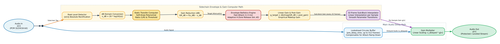
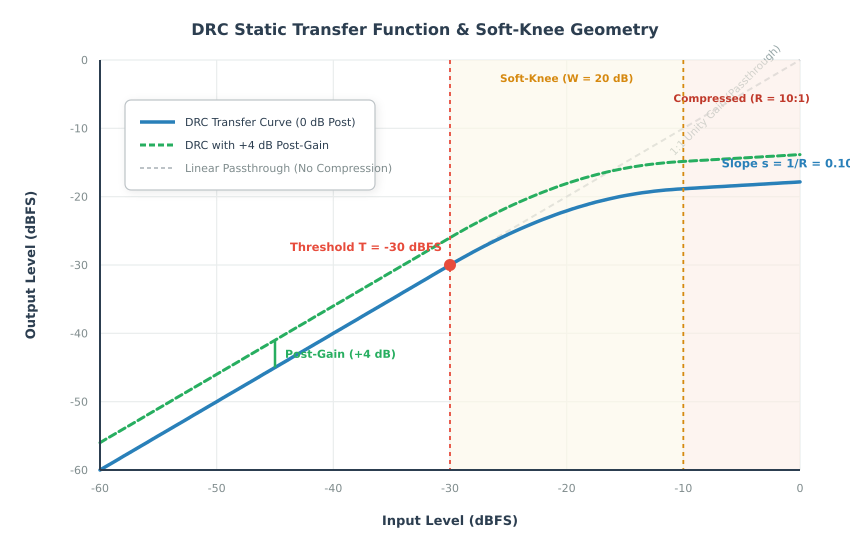
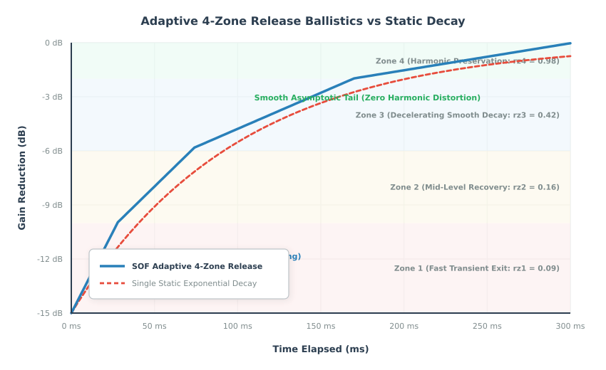
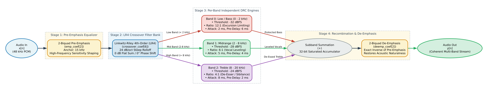
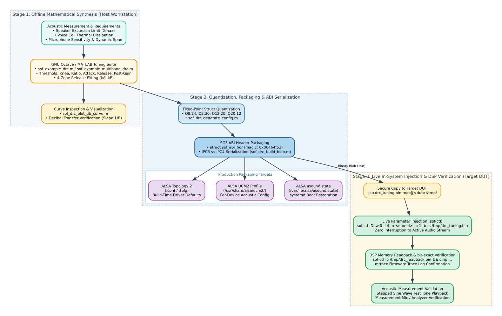

.. _drc_tuning:

Dynamic Range Compression & Multiband DRC Tuning Guide
######################################################

Sound Open Firmware (SOF) provides advanced dynamics processing algorithms designed to manage audio dynamics, protect micro-speaker transducers from physical and thermal damage, maximize loudness and speech intelligibility, and prevent ADC clipping during capture.

This guide details the complete tuning lifecycle for both the **Single-Band Dynamic Range Compressor (DRC)** and the **Multiband Dynamic Range Compressor (Multiband DRC)**: from mathematical curve synthesis and adaptive envelope ballistics to Linkwitz-Riley crossover splitting, offline GNU Octave / MATLAB calibration, Topology 2 / UCM2 packaging, and live in-system injection via ``sof-ctl``.

---

.. contents:: Table of Contents
   :local:
   :depth: 2

---

Theoretical Foundations of Dynamic Range Compression
*****************************************************

The dynamic range of an audio signal represents the ratio between the loudest peak and the quietest nuance or ambient noise floor. In modern consumer audio devices—especially thin-profile laptops, tablets, smart displays, and conference speakerphones—loudspeakers have small enclosures, low coil mass, and limited cone excursion limits (:math:`X_{\text{max}}`). Uncontrolled audio dynamics present two major hazards:

1. **Physical & Thermal Transducer Damage**: High-amplitude low-frequency peaks drive voice coils beyond linear excursion limits, bottoming out against magnet back plates or overheating voice coils (:math:`P = I^2 R`).
2. **Dynamic Clutter & Loss of Intelligibility**: In noisy acoustic environments, quiet whispers become inaudible while sudden movie explosions or notification chimes sound harsh and jarring.

A Dynamic Range Compressor acts as an automated, program-dependent gain control that narrows the dynamic span of an audio stream by attenuating signals that exceed a specified threshold, while leaving lower-level signals untouched or boosted via makeup gain.

.. _figure_drc_detector_arch:

   Figure 1: Single-Band DRC Processing Architecture: Sidechain Detector, Lookahead Circular Delay, and Division-Based Gain Interpolation

Static Transfer Curve & Soft-Knee Geometry
==========================================

The static behavior of a compressor defines the relationship between the input signal level (:math:`x_{\text{dB}}`) and the output signal level (:math:`y_{\text{dB}}`) under steady-state conditions:

* **Threshold** (:math:`T_{\text{dB}}`): The signal level above which compression begins. Levels below :math:`T_{\text{dB}}` traverse the compressor with unity gain (1:1 input-to-output slope).
* **Compression Ratio** (:math:`R:1`): The degree of attenuation applied once the signal enters the compression region. A ratio of 4:1 means that a 4 dB increase in input level yields only a 1 dB increase in output level (a slope of :math:`s = 1/R = 0.25`). A ratio of :math:`\infty:1` represents a brickwall limiter.
* **Knee Width** (:math:`W_{\text{dB}}`): The decibel range over which the transition from linear 1:1 passthrough to the compressed slope occurs.
* **Makeup Gain / Post-Gain** (:math:`M_{\text{dB}}`): A static gain boost applied to the compressed stream to restore subjective loudness after peak attenuation.

.. _figure_drc_static_curve:

   Figure 2: Static Transfer Curve & Soft-Knee Geometry: Linear Region, Exponential Knee, and Post-Gain Offset

Hard-Knee vs Soft-Knee Transitions
----------------------------------

In a conventional **hard-knee** compressor, the transition between the linear region (:math:`s = 1.0`) and the compressed region (:math:`s = 1/R`) is instantaneous at :math:`x_{\text{dB}} = T_{\text{dB}}`. This sharp derivative discontinuity creates rapid gain modulation, introducing audible high-frequency harmonic distortion (clipping artifacts) during transient crossings.

SOF implements an **exponential soft knee** in the linear domain to eliminate slope discontinuities. The transfer function across the three distinct regions is formulated as:

1. **Linear Region** (:math:`x < x_{\text{th}}`, where :math:`x_{\text{th}} = 10^{T_{\text{dB}} / 20}`):

   .. math::

      y = x

2. **Soft-Knee Region** (:math:`x_{\text{th}} \le x \le x_{\text{knee}}`, where :math:`x_{\text{knee}} = 10^{(T_{\text{dB}} + W_{\text{dB}}) / 20}`):

   .. math::

      y = x_{\text{th}} + \frac{1 - e^{-k (x - x_{\text{th}})}}{k}

   The constant :math:`k` governs the rate of curvature. It is calculated numerically using a bisection root solver to ensure that the slope at the upper boundary of the knee (:math:`x = x_{\text{knee}}`) matches the desired compressed slope (:math:`s = 1/R`):

   .. math::

      \left. \frac{d y_{\text{dB}}}{d x_{\text{dB}}} \right|_{x = x_{\text{knee}}} = \frac{1}{R}

3. **Compressed Region** (:math:`x > x_{\text{knee}}`):

   .. math::

      y = \text{ratio\_base} \cdot x^{1/R}

   where :math:`\text{ratio\_base}` is computed to ensure continuity at :math:`x_{\text{knee}}`:

   .. math::

      \text{ratio\_base} = y(x_{\text{knee}}) \cdot \left( x_{\text{knee}} \right)^{-1/R}

Perceptual Full-Range Makeup Gain
---------------------------------

Attenuating peaks reduces the total root-mean-square (RMS) energy of the stream. To compensate, SOF provides an empirical perceptual makeup gain calculation alongside user-defined post-gain:

.. math::

   G_{\text{makeup}} = \left( \frac{1}{\text{ratio\_base}} \right)^{0.6}

The total linear output multiplier applied to the processed audio is:

.. math::

   G_{\text{out}} = 10^{M_{\text{dB}} / 20} \cdot G_{\text{makeup}}

---

Detector Ballistics & Adaptive Release Dynamics
***********************************************

Static compression curves only determine steady-state attenuation. In real-time audio streams, how fast the compressor attenuates upon loud transients (**attack**) and how smoothly it recovers gain when the input drops (**release**) determine acoustic transparency.

.. _figure_drc_adaptive_release:

   Figure 3: Adaptive 4-Zone Release Curve vs Single Exponential Decay: Transient Protection without Acoustic Pumping

Attack Ballistics & Circular Lookahead Delay
============================================

When an abrupt transient occurs (such as a snare drum hit or a microphone pop), the compressor must attenuate gain rapidly to protect the downstream amplifier and speaker.

* **Attack Time Constant** (:math:`t_{\text{att}}`): The time required for the compressor gain to reduce by :math:`10\text{ dB}`. SOF enforces a minimum attack time of :math:`1\text{ ms}` (:math:`0.001\text{ s}`). The per-sample attack rate is governed by:

  .. math::

     \text{one\_over\_attack\_frames} = \frac{1}{t_{\text{att}} \cdot f_s}

* **Lookahead Pre-Delay Buffer** (``pre_delay_time``): Even with an attack time of :math:`1\text{ ms}`, an instantaneous step transient will leak through during the initial frames before the envelope detector ramps down gain. To solve this, SOF routes the main audio signal through a circular pre-delay buffer (``pre_delay_buffers``, up to 512 frames / ~6–10 ms), while feeding the sidechain detector without delay.
  The detector senses the upcoming peak and begins ramping down gain *before* the transient emerges from the pre-delay buffer. This eliminates transient overshoot without introducing harsh waveshaping distortion.

The Hazard of Static Release Times
==================================

Setting the release time constant presents a fundamental engineering dilemma in audio engineering:

* **Fast Release (< 50 ms)**: Restores dynamic clarity quickly following brief transients, but modulates low-frequency audio waveforms. When a 50 Hz sine wave passes through a fast-releasing compressor, the gain ramps up and down within each cycle, creating severe low-frequency harmonic distortion known as **breathing**.
* **Slow Release (> 500 ms)**: Cleanly avoids waveform distortion on bass, but causes noticeable **pumping**. A single loud transient causes the entire stream to duck and remain suppressed for hundreds of milliseconds, muffling trailing dialogue or background details.

SOF Adaptive 4-Zone Release Curve
=================================

SOF resolves this compromise through a non-linear, adaptive multi-segment release curve. Rather than using a single static exponential decay, SOF defines four release zones that adjust recovery speed based on how far below the envelope threshold the signal has dropped:

.. math::

   \mathbf{rz} = [rz_1, rz_2, rz_3, rz_4] = [0.09, 0.16, 0.42, 0.98]

These zones scale the baseline release frames (:math:`N_{\text{rel}} = t_{\text{rel}} \cdot f_s`). A 4th-order polynomial is fitted across the four zones:

.. math::

   y(x) = k_A + k_B x + k_C x^2 + k_D x^3 + k_E x^4

where :math:`x \in \{0, 1, 2, 3\}` corresponds to the release zones.

* When a short transient occurs and the signal level drops slightly, the compressor operates in the low zones (:math:`rz_1 = 0.09`), releasing rapidly to preserve dialogue clarity and room ambiance.
* During sustained loud passages, the compressor transitions toward the higher zones (:math:`rz_4 = 0.98`), smoothly decelerating gain recovery to prevent low-frequency harmonic distortion.

Division-Based Sub-Block Processing
===================================

Logarithmic decibel conversion and exponential curve evaluation require significant DSP cycle budgets. To optimize real-time performance on embedded DSP architectures (Tensilica Xtensa HiFi 3, HiFi 4, HiFi 5, and RISC-V), SOF employs **sub-block division processing**:

* Audio processing divides into sub-blocks of ``DRC_DIVISION_FRAMES = 32`` frames.
* Heavy logarithmic, exponential, and polynomial calculations execute once per sub-block.
* Individual samples within the 32-frame window are scaled using lightweight linear interpolation between boundary gain values.

---

Multiband DRC Architecture & Compound Pipeline
**********************************************

While single-band DRC provides effective protection for broadband signals, it suffers from **spectral pumping**: a high-energy kick drum (60 Hz) pulls down the wideband gain multiplier, causing midrange vocals (1 kHz) and high-frequency cymbals (10 kHz) to duck in unison.

The **Multiband Dynamic Range Compressor (Multiband DRC)** eliminates spectral pumping by splitting the audio spectrum into up to four independent frequency bands, applying tailored compression curves to each band, and recombining them into a coherent output.

.. _figure_multiband_drc_pipeline:

   Figure 4: Multiband DRC 4-Stage Compound Processing Pipeline: Emphasis, Linkwitz-Riley Crossover, N-Way DRC, and De-Emphasis

The 4-Stage Compound Processing Pipeline
========================================

Multiband DRC operates as a single-source-single-sink compound component comprising four integrated processing stages:

Stage 1: Pre-Emphasis Equalizer
-------------------------------

Human hearing sensitivity decreases at extreme high frequencies, and high-frequency content typically carries less energy than bass. Multiband DRC incorporates a 2-biquad IIR pre-emphasis filter (`emp_coef[2]`) that shapes the incoming audio before crossover splitting.

* **Anchor Frequency**: Typically set to :math:`15\text{ kHz}`.
* **Stage Gain**: User-defined pre-emphasis boost (e.g. :math:`0.01`).
* **Stage Ratio**: Progressive frequency ratio between cascaded stages (:math:`2.0`).

Stage 2: Linkwitz-Riley 4th-Order (LR4) Crossover Filter Bank
-------------------------------------------------------------

To divide the audio spectrum into frequency bands without introducing phase distortion or amplitude irregularities, SOF utilizes cascaded Linkwitz-Riley 4th-order (LR4) filter networks (`crossover_coef[6]`):

* **Flat Magnitude Summation**: Each LR4 crossover section consists of two cascaded 2nd-order Butterworth filters (:math:`Q = 0.7071`, combined :math:`Q = 0.5`). The lowpass and highpass outputs sum with a mathematically flat :math:`0\text{ dB}` magnitude response across the crossover frequency :math:`F_c`.
* **Zero Phase Difference**: The lowpass and highpass branches exhibit a :math:`360^\circ` (:math:`0^\circ`) phase alignment at :math:`F_c`, preventing destructive comb filtering when the bands recombine.
* **Band Counts**: Supports 2-band, 3-band, or 4-band frequency splits using up to six LR4 biquad pairs.

Stage 3: Per-Band Independent DRC Engines
-----------------------------------------

Each split band feeds an independent instance of the single-band DRC engine:

* **Band 0 (Low / Bass)**: Tuned with a low threshold, high ratio (:math:`10:1` to :math:`\infty:1`), fast attack (:math:`1\text{ ms} - 3\text{ ms}`), and moderate lookahead to clamp woofer cone excursion and voice coil thermal dissipation.
* **Band 1 (Mid / Dialogue)**: Tuned with a moderate threshold, gentle ratio (:math:`2:1` to :math:`4:1`), and slower attack (:math:`5\text{ ms} - 10\text{ ms}`) to ensure natural, intelligible vocals without pumping.
* **Band 2 (High / Treble)**: Tuned with an elevated threshold and fast release to control high-frequency sibilance (de-essing) and protect micro-tweeters.

Stage 4: Summation & De-Emphasis Equalizer
------------------------------------------

The outputs of all active per-band DRC engines sum into a single composite stream, which passes through a 2-biquad IIR de-emphasis filter (`deemp_coef[2]`). The de-emphasis filter applies the exact inverse frequency response of the Stage 1 pre-emphasis filter, restoring the original acoustic spectral balance.

---

Fixed-Point Data Structures & Quantization Formats
**************************************************

Firmware components operate on fixed-point DSP hardware without native floating-point units. All tuning parameters are converted into packed, 32-bit fixed-point representations before transmission to the DSP.

Single-Band DRC Parameter Structure (`struct sof_drc_params`)
==============================================================

The Single-Band DRC configuration is defined in ``src/audio/drc/drc_user.h``:

.. code-block:: c

   struct sof_drc_params {
       int32_t enabled;                        /* 1 = enable, 0 = disable */
       int32_t db_threshold;                  /* Q8.24  - Threshold in dB */
       int32_t db_knee;                       /* Q8.24  - Knee width in dB */
       int32_t ratio;                         /* Q8.24  - Compression ratio */
       int32_t pre_delay_time;                /* Q2.30  - Lookahead time in seconds */
       int32_t linear_threshold;              /* Q2.30  - Threshold in linear scale */
       int32_t slope;                         /* Q2.30  - Inverse ratio (1 / ratio) */
       int32_t K;                             /* Q12.20 - Knee curvature coefficient */
       int32_t knee_alpha;                    /* Q8.24  - Pre-calculated knee parameter */
       int32_t knee_beta;                     /* Q8.24  - Pre-calculated knee parameter */
       int32_t knee_threshold;                /* Q8.24  - Threshold + knee in linear dB */
       int32_t ratio_base;                    /* Q2.30  - Linear base multiplier */
       int32_t output_linear_gain;            /* Q8.24  - Total post-makeup linear gain */
       int32_t one_over_attack_frames;        /* Q2.30  - Attack rate per frame */
       int32_t sat_release_frames_inv_neg;    /* Q2.30  - Saturation release rate */
       int32_t sat_release_rate_at_neg_two_db;/* Q2.30  - Rate at -2 dB */
       int32_t kSpacingDb;                    /* Q32.0  - Decibel spacing per step */
       int32_t kA;                            /* Q20.12 - Polynomial coefficient A */
       int32_t kB;                            /* Q20.12 - Polynomial coefficient B */
       int32_t kC;                            /* Q20.12 - Polynomial coefficient C */
       int32_t kD;                            /* Q20.12 - Polynomial coefficient D */
       int32_t kE;                            /* Q20.12 - Polynomial coefficient E */
   } __attribute__((packed));

Fixed-Point Q-Format Specifications (Table 33)
----------------------------------------------

.. list-table:: Table 33: DRC Parameter Fixed-Point Formats & Quantization Rules
   :header-rows: 1
   :widths: 30 15 20 35
   :class: tight-table

   * - Struct Field
     - Q-Format
     - Range
     - Resolution / Multiplier
   * - ``db_threshold``, ``db_knee``
     - Q8.24
     - :math:`[-128.0, +127.99]`
     - :math:`2^{-24} \approx 5.96 \times 10^{-8}`
   * - ``ratio``, ``output_linear_gain``
     - Q8.24
     - :math:`[0.0, +127.99]`
     - :math:`2^{-24} \approx 5.96 \times 10^{-8}`
   * - ``pre_delay_time``, ``slope``
     - Q2.30
     - :math:`[0.0, +1.999]`
     - :math:`2^{-30} \approx 9.31 \times 10^{-10}`
   * - ``linear_threshold``, ``ratio_base``
     - Q2.30
     - :math:`[0.0, +1.999]`
     - :math:`2^{-30} \approx 9.31 \times 10^{-10}`
   * - ``one_over_attack_frames``
     - Q2.30
     - :math:`[0.0, +1.999]`
     - :math:`2^{-30} \approx 9.31 \times 10^{-10}`
   * - ``K`` (Knee Curvature)
     - Q12.20
     - :math:`[0.0, +2047.99]`
     - :math:`2^{-20} \approx 9.54 \times 10^{-7}`
   * - ``kA``, ``kB``, ``kC``, ``kD``, ``kE``
     - Q20.12
     - :math:`[-524288, +524287]`
     - :math:`2^{-12} \approx 2.44 \times 10^{-4}`
   * - ``kSpacingDb``
     - Q32.0
     - :math:`[-2^{31}, 2^{31}-1]`
     - Integer decibels

Multiband DRC Parameter Structure (`struct sof_multiband_drc_config`)
=====================================================================

Multiband DRC encapsulates all crossover and per-band parameters into a single compound structure defined in ``src/audio/multiband_drc/user/multiband_drc.h``:

.. code-block:: c

   struct sof_multiband_drc_config {
       uint32_t size;                          /* Total payload size in bytes */
       uint32_t num_bands;                     /* Number of active bands: 1 to 4 */
       uint32_t enable_emp_deemp;              /* 1 = enable emphasis, 0 = bypass */
       uint32_t reserved[8];                   /* Reserved for future expansion */

       /* 2-Biquad Pre-Emphasis Equalizer */
       struct sof_eq_iir_biquad emp_coef[2];

       /* 2-Biquad De-Emphasis Equalizer */
       struct sof_eq_iir_biquad deemp_coef[2];

       /* Linkwitz-Riley LR4 Crossover Filter Bank (up to 6 biquad pairs) */
       struct sof_eq_iir_biquad crossover_coef[6];

       /* Flexible array member: num_bands * struct sof_drc_params */
       struct sof_drc_params drc_coef[];
   };

---

Offline Calibration & Synthesis Workflows
*****************************************

The SOF firmware tree includes comprehensive GNU Octave and MATLAB tuning scripts under ``src/audio/drc/tune/`` and ``src/audio/multiband_drc/tune/`` to synthesize filter coefficients, plot static curves, and export binary blobs wrapped with ABI headers.

.. _figure_drc_toolchain_workflow:

   Figure 5: End-to-End Tuning Toolchain: Octave Synthesis, ABI Serialization, and Multi-Target Packaging

Single-Band DRC Synthesis Workflow
==================================

The top-level script for Single-Band DRC tuning is ``src/audio/drc/tune/sof_example_drc.m``.

Step 1: Define Tuning Parameters
--------------------------------

Edit ``sof_example_drc.m`` or create a custom tuning script defining acoustic parameters:

.. code-block:: octave

   % Small micro-speaker excursion protection preset
   params.enabled = 1;
   params.threshold = -30;         % Threshold: -30 dBFS
   params.knee = 20;               % Soft-knee width: 20 dB
   params.ratio = 10;              % High ratio: 10:1 limiting
   params.attack = 0.003;          % Attack time: 3 ms
   params.release = 0.25;          % Base release: 250 ms
   params.pre_delay = 0.006;       % Lookahead delay: 6 ms
   params.release_zone = [0.09 0.16 0.42 0.98]; % 4 adaptive release zones
   params.release_spacing = 5;     % Spacing per step: 5 dB
   params.post_gain = 3;           % Makeup post-gain: +3 dB

Step 2: Synthesize Fixed-Point Coefficients
-------------------------------------------

Invoke ``sof_drc_gen_coefs.m`` to generate the fixed-point parameter struct:

.. code-block:: octave

   sample_rate = 48000;
   coefs = sof_drc_gen_coefs(params, sample_rate);

   % Convert coefficients into struct sof_drc_config
   config = sof_drc_generate_config(coefs);

Step 3: Plot and Inspect Static Decibel Curve
---------------------------------------------

Visualize the synthesized static compression curve to verify threshold, knee shape, and slope:

.. code-block:: octave

   sof_drc_plot_db_curve(coefs);

The script displays input decibels versus output decibels, rendering the linear passthrough region, the smooth quadratic knee curvature, and the post-gain makeup offset.

Step 4: Serialize and Export Blobs
----------------------------------

Serialize the configuration struct into binary and text formats wrapped with the SOF ABI header:

.. code-block:: octave

   endian = "little";

   % IPC3 Binary and ALSA CSV format
   blob_ipc3 = sof_drc_build_blob(config, endian, 3);
   sof_ucm_blob_write("drc_speaker_ipc3.bin", blob_ipc3);
   sof_alsactl_write("drc_speaker_ipc3.txt", blob_ipc3);

   % IPC4 Binary and ALSA CSV format
   blob_ipc4 = sof_drc_build_blob(config, endian, 4);
   sof_ucm_blob_write("drc_speaker_ipc4.bin", blob_ipc4);
   sof_alsactl_write("drc_speaker_ipc4.txt", blob_ipc4);

   % Topology 2 Component Definition (.conf)
   sof_tplg2_write("drc_speaker.conf", blob_ipc4, "drc_config", ...
                   "Exported with sof_example_drc.m", "octave sof_example_drc.m");

Multiband DRC Synthesis Workflow
================================

The top-level script for Multiband DRC tuning is ``src/audio/multiband_drc/tune/sof_example_multiband_drc.m``.

Step 1: Configure Multi-Band Frequency Splits and Dynamics
----------------------------------------------------------

Define band boundaries, pre-emphasis filters, and per-band dynamics curves:

.. code-block:: octave

   rz1 = [0.09 0.16 0.42 0.98];

   prm.name = "multimedia_3band";
   prm.sample_rate = 48000;
   prm.num_bands = 3;                  % 3-Way Frequency Division
   prm.enable_emp_deemp = 1;           % Enable pre/de-emphasis filters
   prm.stage_gain = 0.01;
   prm.stage_ratio = 2.0;

   % Lower frequency boundaries for bands [Low, Mid, High, Ultra-High]
   prm.band_lower_freq  = [     0   2000   8000  16000 ];
   prm.enable_bands     = [     1      2      3      0 ];

   % Per-Band Dynamics
   prm.threshold        = [   -32    -28    -24    -24 ]; % Stricter on bass
   prm.knee             = [    20     18     16     16 ];
   prm.ratio            = [    12      6      4      4 ]; % Heavy limiting on bass
   prm.attack           = [ 0.002  0.005  0.008  0.008 ]; % Fast attack on bass
   prm.release          = [   0.2    0.25   0.3    0.3 ];
   prm.pre_delay        = [ 0.006  0.004  0.002  0.002 ]; % Longer lookahead on bass
   prm.release_spacing  = [     5      5      5      5 ];
   prm.post_gain        = [     2      1      0      0 ];
   prm.release_zone     = [  rz1'   rz1'   rz1'   rz1' ];

Step 2: Generate Quantized Compound Blobs
-----------------------------------------

Invoke ``sof_example_multiband_drc.m`` or run the subroutines:

.. code-block:: octave

   % 1. Synthesize Emphasis / De-emphasis biquads
   [emp_coefs, deemp_coefs] = sof_iir_gen_quant_coefs(iir_params, sample_rate, prm.enable_emp_deemp);

   % 2. Synthesize Linkwitz-Riley LR4 Crossover biquads
   crossover_coefs = sof_crossover_gen_quant_coefs(prm.num_bands, sample_rate, ...
                                                   prm.band_lower_freq(2) / (sample_rate / 2), ...
                                                   prm.band_lower_freq(3) / (sample_rate / 2), ...
                                                   0);

   % 3. Synthesize per-band DRC quantized parameters
   drc_coefs = sof_drc_gen_quant_coefs(prm.num_bands, sample_rate, drc_params);

   % 4. Build composite binary blobs wrapped with ABI header
   blob_ipc4 = sof_multiband_drc_build_blob(prm.num_bands, prm.enable_emp_deemp, ...
                                           emp_coefs, deemp_coefs, crossover_coefs, ...
                                           drc_coefs, "little", 4);

   % 5. Export to files
   sof_tplg2_write("multiband_drc_3band.conf", blob_ipc4, "multiband_drc_config");
   sof_ucm_blob_write("multiband_drc_3band.bin", blob_ipc4);
   sof_alsactl_write("multiband_drc_3band.txt", blob_ipc4);

---

Production Preset Profiles & Practical Tuning Recipes
*****************************************************

Different acoustic applications require distinct dynamics strategies. The following recipes provide validated starting configurations:

Preset 1: Micro-Speaker Excursion Protection (Table 34)
=======================================================

* **Target**: Thin laptop and tablet speakers susceptible to cone bottoming out and voice coil thermal damage.
* **Strategy**: Aggressive threshold, high ratio, fast attack, and extended lookahead.

.. list-table:: Table 34: Micro-Speaker Excursion Protection Recipe
   :header-rows: 1
   :widths: 30 20 50
   :class: tight-table

   * - Parameter
     - Recommended
     - Acoustic Rationale
   * - ``threshold``
     - :math:`-30\text{ dBFS}`
     - Catches high-energy passages before mechanical limits
   * - ``knee``
     - :math:`20\text{ dB}`
     - Smooth entry avoiding audible distortion
   * - ``ratio``
     - :math:`10:1` to :math:`12:1`
     - Near-brickwall limiting preventing speaker blowout
   * - ``attack``
     - :math:`2\text{ ms}`
     - Clamps sharp transients immediately
   * - ``release``
     - :math:`200\text{ ms}`
     - Balanced recovery avoiding rapid breathing
   * - ``pre_delay``
     - :math:`6\text{ ms}`
     - Allows gain ramp-down before transient emerges
   * - ``post_gain``
     - :math:`+3\text{ dB}`
     - Restores perceived loudness in compact enclosures

Preset 2: Voice Capture & Digital Microphone Leveling (Table 35)
================================================================

* **Target**: Conference microphone arrays, DMIC voice capture, and automatic speech recognition (ASR).
* **Strategy**: Transparent leveling of quiet talkers while preventing ADC clipping.

.. list-table:: Table 35: Digital Microphone Capture Leveling Recipe
   :header-rows: 1
   :widths: 30 20 50
   :class: tight-table

   * - Parameter
     - Recommended
     - Acoustic Rationale
   * - ``threshold``
     - :math:`-35\text{ dBFS}`
     - Active across normal speaking levels
   * - ``knee``
     - :math:`25\text{ dB}`
     - Ultra-wide soft knee for imperceptible compression
   * - ``ratio``
     - :math:`4:1` to :math:`6:1`
     - Transparent leveling preserving speech naturalness
   * - ``attack``
     - :math:`5\text{ ms}`
     - Lets natural consonant attack pass without dulling
   * - ``release``
     - :math:`350\text{ ms}`
     - Slow recovery preventing room reverberation amplification
   * - ``pre_delay``
     - :math:`2\text{ ms}`
     - Minimal lookahead to keep capture latency ultralow
   * - ``post_gain``
     - :math:`0\text{ dB}`
     - Headroom maintained for downstream beamforming / AEC

Preset 3: Multimedia 3-Band Acoustic Tuning (Table 36)
=======================================================

* **Target**: Premium laptop audio playback, soundbars, and gaming headphones.
* **Strategy**: Multiband frequency isolation preventing bass kicks from ducking vocals or treble.

.. list-table:: Table 36: Multimedia 3-Band DRC Frequency & Parameter Matrix
   :header-rows: 1
   :widths: 25 20 20 35
   :class: tight-table

   * - Band Specification
     - Crossover Range
     - Dynamics Parameters
     - Functional Objective
   * - **Band 0 (Bass)**
     - :math:`0 - 2\text{ kHz}`
     - :math:`T = -32\text{ dBFS}`, :math:`R = 12:1`, :math:`A = 2\text{ ms}`
     - Strict excursion control on woofers; prevents bass resonance buzzing
   * - **Band 1 (Midrange)**
     - :math:`2\text{ kHz} - 8\text{ kHz}`
     - :math:`T = -28\text{ dBFS}`, :math:`R = 6:1`, :math:`A = 5\text{ ms}`
     - Transparent vocal presence leveling; enhances dialogue intelligibility
   * - **Band 2 (Treble)**
     - :math:`8\text{ kHz} - 20\text{ kHz}`
     - :math:`T = -24\text{ dBFS}`, :math:`R = 4:1`, :math:`A = 8\text{ ms}`
     - Gentle sibilance control (de-esser); protects sensitive micro-tweeters

---

Runtime Parameter Injection & Live In-System Verification
*********************************************************

Modern SOF topologies expose DRC parameters as ALSA byte controls, allowing acoustic engineers to inject new calibration profiles into active streaming pipelines without recompiling firmware or rebooting the target device.

Step 1: Enumerate Target ALSA Controls on DUT
=============================================

Connect to the target Device Under Test (DUT) over SSH and locate the active DRC controls:

.. code-block:: bash

   # Query ALSA controls matching DRC or Multiband DRC
   ssh root@<dut-ip> "amixer -Dhw:0 controls | grep -i drc"

   # Expected Output (IPC4 Example):
   # numid=19,iface=MIXER,name='DRC1.0 19 DRC'
   # numid=24,iface=MIXER,name='MULTIBAND_DRC1.0 24 MULTIBAND_DRC'

Step 2: Transfer and Inject New Calibration Blob
================================================

Copy the synthesized binary blob to the target DUT and inject it into the active DSP pipeline using ``sof-ctl``:

.. code-block:: bash

   # Copy blob to DUT
   scp drc_speaker_ipc4.bin root@<dut-ip>:/tmp/drc_tuning.bin

   # Inject blob into control numid=19 (IPC4 param_id=1, binary mode)
   ssh root@<dut-ip> "sof-ctl -Dhw:0 -i 4 -n 19 -p 1 -b -s /tmp/drc_tuning.bin"

   # Expected Output:
   # Applying configuration "/tmp/drc_tuning.bin" into device hw:0 control numid=19.
   # Success.

Step 3: Read Back and Bit-Verify Active Coefficients
====================================================

Confirm that the DSP accepted and installed the new parameters into memory by reading back the active control payload:

.. code-block:: bash

   # Read back active parameters from DSP
   ssh root@<dut-ip> "sof-ctl -Dhw:0 -i 4 -n 19 -p 1 -o /tmp/drc_readback.bin"

   # Verify bit-exact match against source blob
   ssh root@<dut-ip> "cmp /tmp/drc_tuning.bin /tmp/drc_readback.bin && echo 'VERIFIED: Bit-exact match!'"

Step 4: Monitor Real-Time DSP Execution via Traces
==================================================

Monitor DSP firmware trace logs during parameter injection to verify configuration confirmation:

.. code-block:: bash

   # Inspect trace logs over SSH
   ssh root@<dut-ip> "mtrace | grep -i drc"

   # Expected Trace Log:
   # [DSP] drc_set_config(): DRC configuration updated, num_channels=2, sample_rate=48000
   # [DSP] drc_set_config(): threshold=-30 dB, knee=20 dB, ratio=10:1, makeup=3 dB

Step 5: Acoustic Verification with Stepped Amplitude Tones
==========================================================

To verify compression behavior acoustically:

1. Generate a stepped 1 kHz sine wave with amplitude steps at :math:`-40\text{ dBFS}, -30\text{ dBFS}, -20\text{ dBFS}, -10\text{ dBFS}, \text{and } 0\text{ dBFS}`.
2. Play the tone through the playback pipeline while capturing audio from the speaker output via a calibrated microphone or loopback card:

   .. code-block:: bash

      # Play stepped test tone on DUT
      ssh root@<dut-ip> "aplay -Dplughw:0,0 /usr/share/sounds/stepped_tone_1khz.wav"

3. Measure output levels at each step to plot the physical transfer curve. Verify that below :math:`-30\text{ dBFS}`, output increases linearly (:math:`1\text{ dB}` per input step), and above :math:`-30\text{ dBFS}`, output increases by only :math:`0.1\text{ dB}` per :math:`1\text{ dB}` input step (:math:`10:1` ratio).

---

Tuning Diagnostics & Acoustic Artifact Matrix
*********************************************

During the tuning process, incorrect parameter combinations can introduce audible artifacts or cause driver rejection. Table 37 provides diagnostic remedies:

.. list-table:: Table 37: DRC Tuning Diagnostics & Acoustic Artifact Matrix
   :header-rows: 1
   :widths: 20 30 50
   :class: tight-table

   * - Symptom / Artifact
     - Root Cause
     - Corrective Tuning Action
   * - **Pumping / Breathing**
     - Release time too fast on broadband signals; baseline noise rises audibly between speech syllables.
     - Increase ``release`` time constant (:math:`\ge 200\text{ ms}`) or deploy Multiband DRC to isolate low frequencies from vocals.
   * - **Transient Distortion**
     - Attack time too slow; sharp peaks punch through unattenuated and clip downstream DAC/amplifier.
     - Decrease ``attack`` time (:math:`1 - 3\text{ ms}`) and increase lookahead ``pre_delay`` (:math:`6\text{ ms}`) to ramp gain down ahead of peak arrival.
   * - **Dull / Muffled Treble**
     - Single-band compressor ducks entire spectrum during heavy bass notes.
     - Migrate to 3-band Multiband DRC. Set woofer crossover to :math:`2\text{ kHz}` so low-frequency excursion clamping leaves treble unaffected.
   * - **Crossover Phasing**
     - Inverted band polarities or non-Linkwitz-Riley filter poles causing nulls at :math:`F_c`.
     - Verify that crossover biquad coefficients adhere to Linkwitz-Riley 4th-order (LR4) specification (:math:`Q = 0.7071` cascaded).
   * - **Driver Error -EINVAL**
     - ABI magic header mismatch or payload size does not match packed struct size.
     - Ensure blob is serialized with ``sof_drc_build_blob.m`` or ``sof_multiband_drc_build_blob.m`` matching active ABI version.
   * - **Driver Error -EBUSY**
     - Parameter update attempted while pipeline is in an active DMA lock.
     - Trigger playback stream briefly or ensure pipeline state is ``RUNNING`` or ``PREPARED`` during control update.

---

Upstream References & Code Links
********************************

* **Firmware Implementation**:
  - DRC Core: `thesofproject/sof: src/audio/drc/drc.c <https://github.com/thesofproject/sof/tree/main/src/audio/drc/drc.c>`_
  - DRC Generic Implementation: `thesofproject/sof: src/audio/drc/drc_generic.c <https://github.com/thesofproject/sof/tree/main/src/audio/drc/drc_generic.c>`_
  - DRC SIMD HiFi4 Vector Engine: `thesofproject/sof: src/audio/drc/drc_hifi4.c <https://github.com/thesofproject/sof/tree/main/src/audio/drc/drc_hifi4.c>`_
  - Multiband DRC Core: `thesofproject/sof: src/audio/multiband_drc/multiband_drc.c <https://github.com/thesofproject/sof/tree/main/src/audio/multiband_drc/multiband_drc.c>`_
  - Multiband DRC Generic: `thesofproject/sof: src/audio/multiband_drc/multiband_drc_generic.c <https://github.com/thesofproject/sof/tree/main/src/audio/multiband_drc/multiband_drc_generic.c>`_
* **Data Structures & Headers**:
  - `thesofproject/sof: src/audio/drc/drc_user.h <https://github.com/thesofproject/sof/tree/main/src/audio/drc/drc_user.h>`_
  - `thesofproject/sof: src/audio/multiband_drc/user/multiband_drc.h <https://github.com/thesofproject/sof/tree/main/src/audio/multiband_drc/user/multiband_drc.h>`_
* **Tuning Scripts**:
  - `thesofproject/sof: src/audio/drc/tune/ <https://github.com/thesofproject/sof/tree/main/src/audio/drc/tune/>`_
  - `thesofproject/sof: src/audio/multiband_drc/tune/ <https://github.com/thesofproject/sof/tree/main/src/audio/multiband_drc/tune/>`_
* **Topology 2 Definitions**:
  - DRC Widget: `thesofproject/sof: tools/topology/topology2/include/components/drc.conf <https://github.com/thesofproject/sof/tree/main/tools/topology/topology2/include/components/drc.conf>`_
  - Multiband DRC Widget: `thesofproject/sof: tools/topology/topology2/include/components/multiband_drc.conf <https://github.com/thesofproject/sof/tree/main/tools/topology/topology2/include/components/multiband_drc.conf>`_
