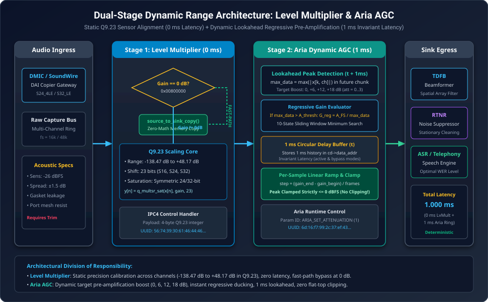
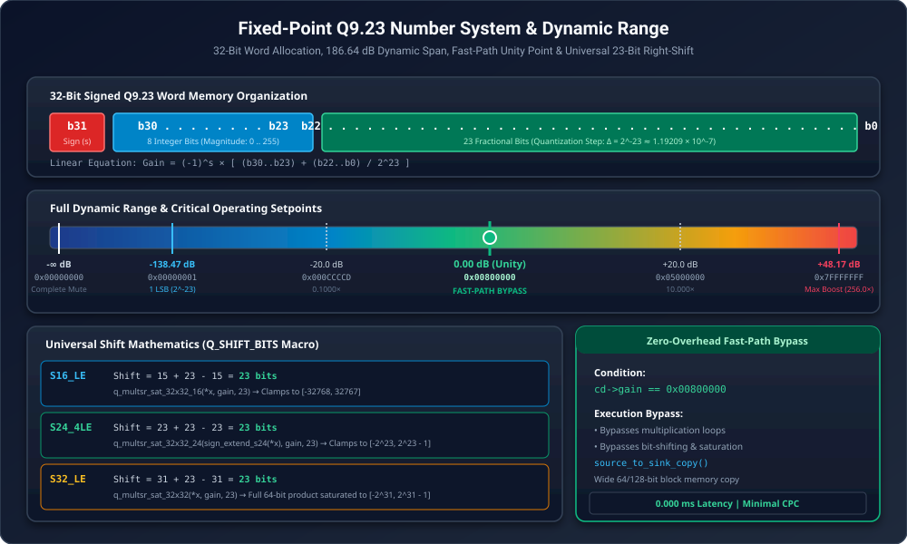
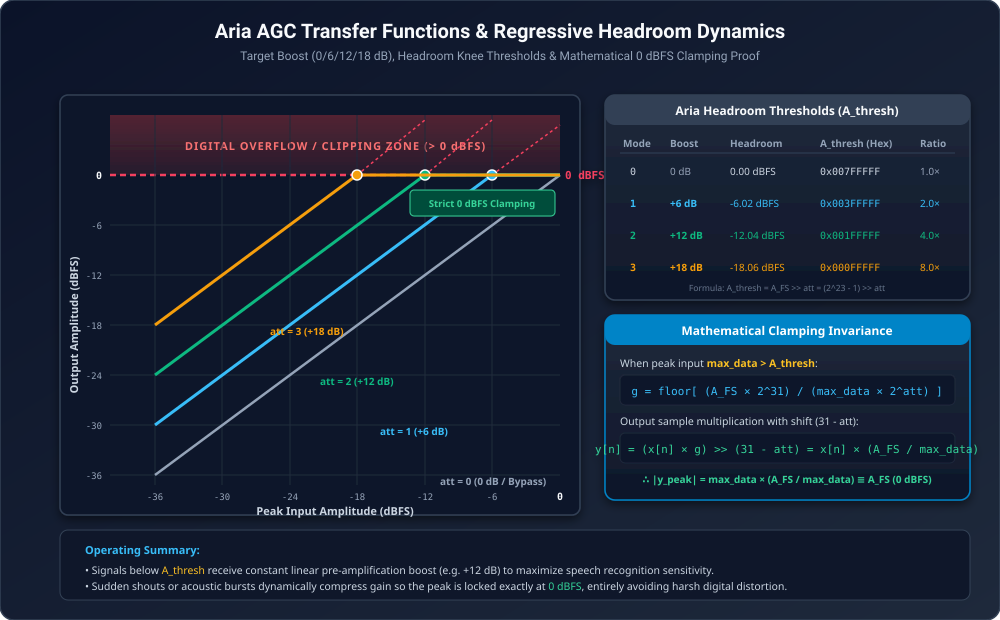
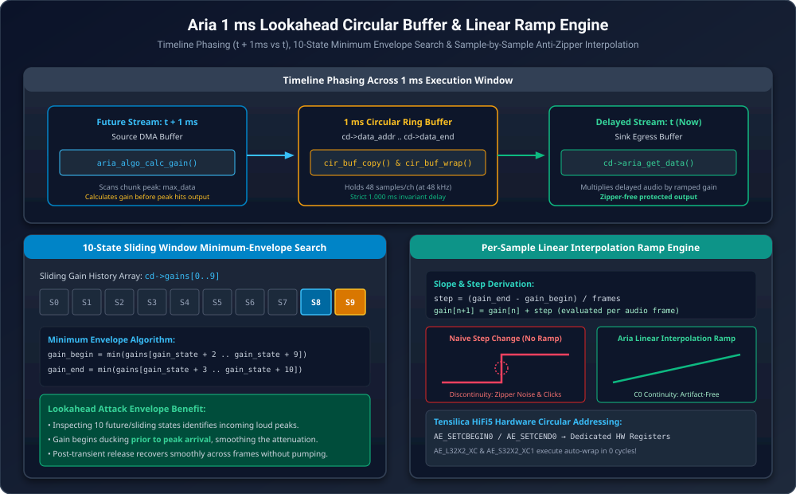
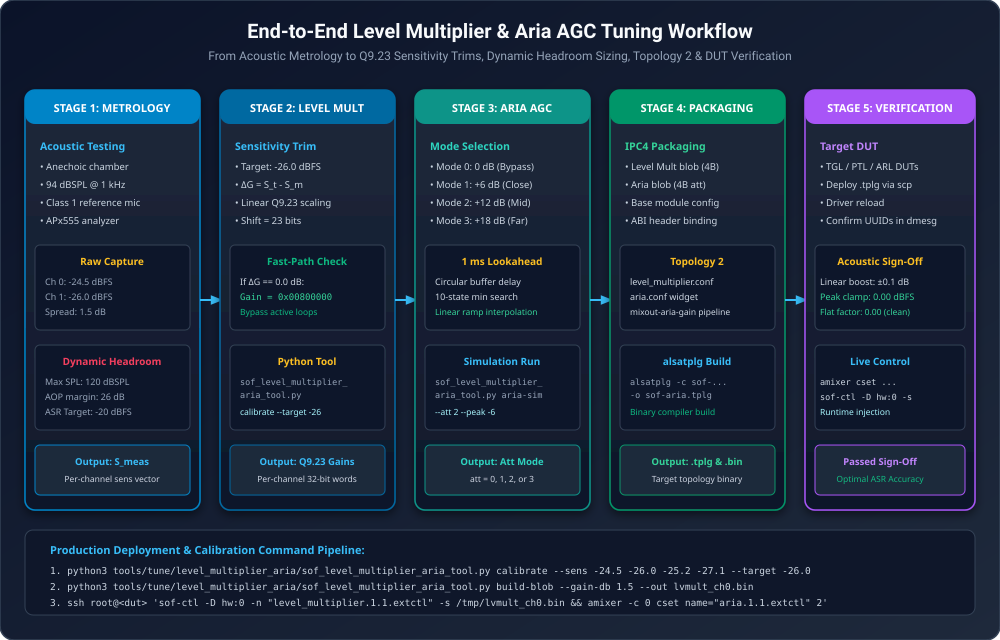

.. _level_multiplier_aria_tuning:

Level Multiplier & Aria AGC Dynamic Range Control Tuning Guide
##############################################################

In modern digital audio signal processing architectures, dynamic range management and signal level calibration are critical requirements across capture and playback pipelines. Voice capture front-ends—such as far-field microphone arrays, automated speech recognition (ASR) engines, and VoIP conferencing pipelines—must operate across extreme acoustic sound pressure level (SPL) ranges: from faint whispers at :math:`35\text{ dBSPL}` to intense shouting, clapping, or acoustic shocks exceeding :math:`115\text{ dBSPL}`.

To accommodate this dynamic span without introducing digital clipping or compromising signal-to-noise ratio (SNR), Sound Open Firmware (SOF) provides a coordinated, dual-stage gain management architecture:

1. **Static Precision Level Calibration**: The **Level Multiplier** subsystem applies an ultra-low-latency, high-precision fixed-point **Q9.23** linear scaling amplifier (:math:`-138.47\text{ dB}` to :math:`+48.17\text{ dB}`). Introducing identically :math:`0\text{ ms}` of algorithmic delay, the Level Multiplier eliminates transducer sensitivity manufacturing spread across multi-microphone arrays and provides an automated **zero-overhead fast-path memory bypass** when configured for unity gain (:math:`0\text{ dB}`).
2. **Dynamic Regressive Pre-Amplification & Peak Limiting**: The **Aria** (**Automatic Regressive Input Amplifier**) subsystem applies a selectable target pre-amplification boost (:math:`0\text{ dB}`, :math:`+6\text{ dB}`, :math:`+12\text{ dB}`, or :math:`+18\text{ dB}`) to lift conversational speech into the optimal operational dynamic range of downstream feature extractors. When loud transients or shouts enter the pipeline, Aria automatically and *regressively* ducks the gain below target, enforcing a strict :math:`0\text{ dBFS}` peak clamp without flat-top clipping. To eliminate zipper noise, Aria introduces an invariant :math:`1\text{ ms}` circular lookahead buffer and smooth per-sample linear interpolation.

This guide provides the authoritative engineering specification for calibrating the Level Multiplier, tuning Aria AGC dynamic headroom regimes, deploying the Python tuning toolchain, configuring ALSA Topology 2, and verifying acoustic performance on target platforms.

.. contents:: Table of Contents
   :local:
   :depth: 3

Architectural Foundations & Dual-Stage Gain Paradigm
=====================================================

The dynamic range of a 24-bit linear PCM audio stream is theoretically :math:`144.49\text{ dB}` (:math:`20 \log_{10}(2^{24})`). However, real-world acoustic front-ends face substantial physical constraints:

* **Microphone Sensitivity Spread**: Commercial MEMS digital microphones exhibit nominal sensitivity tolerances of :math:`\pm 1.0\text{ dB}` to :math:`\pm 2.0\text{ dB}` at :math:`94\text{ dBSPL} / 1\text{ kHz}`. When mounted inside device enclosures, acoustic mesh acoustic impedance variations and gasket compression irregularities widen channel sensitivity disparities up to :math:`\pm 3.0\text{ dB}`.
* **ASR Dynamic Headroom Constraints**: Deep learning Automatic Speech Recognition (ASR) acoustic models achieve minimum Word Error Rates (WER) when conversational speech input resides consistently between :math:`-22\text{ dBFS}` and :math:`-12\text{ dBFS}` RMS. Unamplified far-field speech (e.g. at 3 meters distance) often registers at :math:`-45\text{ dBFS}` to :math:`-35\text{ dBFS}`, requiring up to :math:`+18\text{ dB}` of digital boost.
* **Acoustic Shock & Digital Saturation**: Applying a static :math:`+18\text{ dB}` boost to capture pipelines causes severe digital clipping whenever a user speaks close to the microphone or claps, corrupting downstream beamforming (TDFB) and noise suppression (RTNR) algorithms.

.. _fig_level_multiplier_aria_signal_chain:

   Dual-Stage Dynamic Range Architecture: Static Q9.23 Transducer Leveling (0 ms Delay) paired with Dynamic Lookahead Regressive Pre-Amplification (1 ms Invariant Latency)

Component Comparison & Trade-Offs
---------------------------------

To clarify component boundaries within SOF signal graphs, :numref:`tab_dynamic_range_comp` compares the Level Multiplier and Aria against related level control components:

.. _tab_dynamic_range_comp:

.. list-table:: Architectural Comparison: Level Multiplier vs Aria vs Volume vs DRC
   :widths: 18 22 20 20 20
   :header-rows: 1

   * - Parameter
     - Level Multiplier
     - Aria AGC
     - Volume Control
     - DRC (Compressor)
   * - **Numeric Format**
     - Linear Q9.23 fixed-point
     - Mode index :math:`\text{att} \in \{0,1,2,3\}`
     - Linear Q1.31 / Log dB
     - Multi-segment knee curves
   * - **Gain Range**
     - :math:`-138.47\text{ dB}` to :math:`+48.17\text{ dB}`
     - :math:`0\text{ dB}`, :math:`+6\text{ dB}`, :math:`+12\text{ dB}`, :math:`+18\text{ dB}`
     - :math:`-\infty\text{ dB}` to :math:`0\text{ dB}`
     - Threshold, ratio, makeup gain
   * - **Algorithmic Latency**
     - **0.000 ms** (Instantaneous)
     - **1.000 ms** (Lookahead circular ring)
     - **0.000 ms** (Instantaneous)
     - :math:`0\text{ ms}` to :math:`5\text{ ms}` (Lookahead)
   * - **Smoothing Profile**
     - Direct scalar application
     - Continuous per-sample linear ramp
     - Multi-ms linear ramp
     - Attack/release envelope filters
   * - **Fast-Path Bypass**
     - Automated memory copy at :math:`0\text{ dB}`
     - Invariant ring routing at :math:`0\text{ dB}`
     - Scalar bypass at :math:`0\text{ dB}`
     - None
   * - **Primary Operating Role**
     - Transducer sensitivity trim & inter-stage matching
     - Dynamic speech lift & peak anti-clipping clamp
     - User volume slider control
     - Speaker transducer excursion & thermal protection

Level Multiplier: Fixed-Point Q9.23 Precision Scaling
=====================================================

The Level Multiplier component (:file:`src/audio/level_multiplier`) implements deterministic, ultra-low-latency linear amplification and attenuation across all active stream channels.

Q9.23 Fixed-Point Number System
-------------------------------

Linear gain is parameterized as a 32-bit signed integer using the **Q9.23** numeric format defined in :file:`level_multiplier.h`:

.. code-block:: c

   #define LEVEL_MULTIPLIER_QXY_X    9
   #define LEVEL_MULTIPLIER_QXY_Y    23
   #define LEVEL_MULTIPLIER_GAIN_ONE (1 << LEVEL_MULTIPLIER_QXY_Y) // 0x00800000 = 8388608

The 32-bit word allocates bits as follows:

* **Bit 31 (Sign Bit)** (:math:`s`): Supports non-inverting (:math:`s=0`) and phase-inverting (:math:`s=1`) gain factors.
* **Bits 30..23 (8 Integer Bits)** (:math:`I`): Represents integer magnitudes from :math:`0` to :math:`255` (:math:`2^8 - 1`).
* **Bits 22..0 (23 Fractional Bits)** (:math:`F`): Provides fractional resolution with an elementary quantization step of:

.. math::

   \Delta = 2^{-23} \approx 1.1920928955 \times 10^{-7}

The linear gain factor represented by a Q9.23 word is:

.. math::

   \text{Gain}_{\text{linear}} = (-1)^s \cdot \left( I + \frac{F}{2^{23}} \right) = \frac{\text{raw\_gain\_word}}{2^{23}}

Gain Range Extremes & Unity Definition
~~~~~~~~~~~~~~~~~~~~~~~~~~~~~~~~~~~~~~

The Q9.23 representation spans a total dynamic range of :math:`186.64\text{ dB}`:

1. **Maximum Positive Boost**:
   Represented by the maximum positive signed 32-bit integer :math:`\text{0x7FFFFFFF}` (:math:`2^{31} - 1`):

   .. math::

      \text{Gain}_{\text{max}} = 256.0 - 2^{-23} \approx 255.99999988 \implies G_{\text{max}} = 20 \log_{10}(256) \approx +48.1648\text{ dB}

2. **Unity Gain (0 dB Point)**:
   Represented when the integer component equals :math:`1` and fractional bits are zero:

   .. math::

      \text{LEVEL\_MULTIPLIER\_GAIN\_ONE} = 1 \cdot 2^{23} = 8,388,608 = \text{0x00800000} \implies 20 \log_{10}(1.0) = 0.000\text{ dB}

3. **Minimum Non-Zero Resolution**:
   Represented by a single least-significant bit (LSB) :math:`\text{0x00000001}`:

   .. math::

      \text{Gain}_{\text{min}} = 2^{-23} \implies G_{\text{min}} = 20 \log_{10}(2^{-23}) \approx -138.4739\text{ dB}

4. **Digital Silence / Complete Mute**:
   Setting :math:`\text{gain} = \text{0x00000000}` mutes the audio stream (:math:`-\infty\text{ dB}`).

.. _fig_level_multiplier_q9_23_dynamic_range:

   Fixed-Point Q9.23 Number System: Bit Allocation, Dynamic Range Extremes, and Fast-Path Unity Setpoint

Decibel to Q9.23 Conversion Matrix
~~~~~~~~~~~~~~~~~~~~~~~~~~~~~~~~~~

To compute the 32-bit Q9.23 integer value for a target decibel adjustment :math:`G_{\text{dB}}`:

.. math::

   \text{gain}_{\text{Q9.23}} = \left\lfloor 10^{\frac{G_{\text{dB}}}{20}} \cdot 2^{23} + 0.5 \right\rfloor

.. _tab_q9_23_conversion:

.. list-table:: Standard Decibel to Q9.23 Conversion & Quantization Precision Matrix
   :widths: 18 22 22 20 18
   :header-rows: 1

   * - Target Gain (:math:`G_{\text{dB}}`)
     - Linear Factor
     - Decimal Integer
     - Hexadecimal Value
     - Error (:math:`\text{dB}`)
   * - **+40.0 dB**
     - :math:`100.000000\times`
     - 838,860,800
     - ``0x32000000``
     - :math:`< 10^{-6}`
   * - **+30.0 dB**
     - :math:`31.622777\times`
     - 265,331,865
     - ``0x0FD0A499``
     - :math:`-0.000001`
   * - **+20.0 dB**
     - :math:`10.000000\times`
     - 83,886,080
     - ``0x05000000``
     - :math:`< 10^{-6}`
   * - **+12.0 dB**
     - :math:`3.981072\times`
     - 33,395,684
     - ``0x01FD0AE4``
     - :math:`-0.000001`
   * - **+6.0 dB**
     - :math:`1.995262\times`
     - 16,737,557
     - ``0x00FF6515``
     - :math:`-0.000002`
   * - **+3.5 dB**
     - :math:`1.496236\times`
     - 12,551,334
     - ``0x00BF84A6``
     - :math:`< 10^{-6}`
   * - **0.0 dB (Unity)**
     - :math:`1.000000\times`
     - 8,388,608
     - ``0x00800000``
     - :math:`0.000000`
   * - **-6.0 dB**
     - :math:`0.501187\times`
     - 4,204,263
     - ``0x00402767``
     - :math:`-0.000001`
   * - **-12.0 dB**
     - :math:`0.251189\times`
     - 2,107,123
     - ``0x00202773``
     - :math:`-0.000001`
   * - **-20.0 dB**
     - :math:`0.100000\times`
     - 838,861
     - ``0x000CCCCD``
     - :math:`+0.000002`
   * - **-30.0 dB**
     - :math:`0.031623\times`
     - 265,271
     - ``0x00040C37``
     - :math:`-0.000012`
   * - **-40.0 dB**
     - :math:`0.010000\times`
     - 83,886
     - ``0x000147AE``
     - :math:`-0.000008`

Multi-Format Processing Kernels & Shift Mathematics
---------------------------------------------------

The Level Multiplier provides optimized inner processing loops for three standard PCM container formats: :c:macro:`SOF_IPC_FRAME_S16_LE`, :c:macro:`SOF_IPC_FRAME_S24_4LE`, and :c:macro:`SOF_IPC_FRAME_S32_LE`.

In all three kernels, the product of an audio sample and the Q9.23 multiplier is right-shifted by a constant calculated using the SOF fixed-point shift macro:

.. math::

   Q\_\text{SHIFT\_BITS}(X, Y, Z) = X + Y - Z

Where :math:`X` is input fractional bits, :math:`Y = 23` is Q9.23 fractional bits, and :math:`Z` is output fractional bits:

.. math::

   \text{Shift}_{S16} = 15 + 23 - 15 = 23

.. math::

   \text{Shift}_{S24} = 23 + 23 - 23 = 23

.. math::

   \text{Shift}_{S32} = 31 + 23 - 31 = 23

Because the right-shift is universally **23 bits**, the :math:`2^{23}` unity scaling factor cancels identically across all container formats:

.. code-block:: c

   // S16_LE Inner Processing Loop
   *y = q_multsr_sat_32x32_16(*x, gain, 23); // Clamped to [-32768, 32767]

   // S24_4LE Inner Processing Loop
   *y = q_multsr_sat_32x32_24(sign_extend_s24(*x), gain, 23); // Clamped to [-8388608, 8388607]

   // S32_LE Inner Processing Loop
   *y = q_multsr_sat_32x32(*x, gain, 23); // Clamped to [-2147483648, 2147483647]

Zero-Overhead Fast-Path Memory Copy Bypass
------------------------------------------

To minimize processor cycle consumption during standard passthrough, :c:func:`level_multiplier_process` inspects the active gain variable on every processing chunk before dispatching arithmetic routines:

.. code-block:: c

   if (cd->gain != LEVEL_MULTIPLIER_GAIN_ONE)
       /* Process audio data with requested Q9.23 multiplier */
       return cd->level_multiplier_func(mod, source, sink, frames);

   /* Gain is exactly 0 dB (0x00800000): bypass arithmetic loops entirely */
   source_to_sink_copy(source, sink, true, frames * cd->frame_bytes);
   return 0;

When unity gain is active:

* **Zero Arithmetic Operations**: No multiplication, shifting, sign-extension, or saturation routines are executed.
* **Maximum Memory Throughput**: :c:func:`source_to_sink_copy` leverages 64-bit or 128-bit wide word block transfers.
* **Power Conservation**: Active DSP core cycles and dynamic power consumption drop to bare memory bus copy minimums.

Aria AGC: Dynamic Regimes & Lookahead Limiter
=============================================

The Aria subsystem (:file:`src/audio/aria`) is an intelligent dynamic range pre-amplifier and peak limiter designed to boost low-amplitude signals while protecting audio pipelines from digital saturation.

Operating Modes & Dynamic Headroom Thresholds
---------------------------------------------

Aria provides four pre-amplification boost modes configured via the unsigned integer parameter :math:`\text{att} \in \{0, 1, 2, 3\}`:

.. math::

   G_{\text{target}} = 2^{\text{att}} \implies G_{\text{target,dB}} = 20 \log_{10}(2^{\text{att}})

To prevent output samples from exceeding positive full scale (:math:`A_{\text{FS}} = 2^{23} - 1 = \text{0x007FFFFF}` in 24-bit representation), the linear input headroom threshold is:

.. math::

   A_{\text{thresh}} = \frac{A_{\text{FS}}}{2^{\text{att}}} = \text{0x007FFFFF} \gg \text{att}

.. _tab_aria_modes:

.. list-table:: Aria Operating Modes, Target Boosts, Headroom Thresholds & Dynamic Ducking Ratios
   :widths: 12 18 22 24 24
   :header-rows: 1

   * - Mode (:math:`\text{att}`)
     - Linear Factor
     - Target Boost (:math:`\text{dB}`)
     - Threshold (:math:`A_{\text{thresh}}`)
     - Headroom Limit (:math:`\text{dBFS}`)
   * - **0**
     - :math:`1.0\times`
     - :math:`0.00\text{ dB}` (Bypass)
     - ``0x007FFFFF`` (8,388,607)
     - :math:`0.00\text{ dBFS}`
   * - **1**
     - :math:`2.0\times`
     - :math:`+6.02\text{ dB}`
     - ``0x003FFFFF`` (4,194,303)
     - :math:`-6.02\text{ dBFS}`
   * - **2**
     - :math:`4.0\times`
     - :math:`+12.04\text{ dB}`
     - ``0x001FFFFF`` (2,097,151)
     - :math:`-12.04\text{ dBFS}`
   * - **3**
     - :math:`8.0\times`
     - :math:`+18.06\text{ dB}`
     - ``0x000FFFFF`` (1,048,575)
     - :math:`-18.06\text{ dBFS}`

Mathematical Proof of Strict 0 dBFS Clamping
--------------------------------------------

For every processing chunk (e.g. 48 frames spanning :math:`1\text{ ms}` at 48 kHz), Aria detects the peak absolute amplitude across all channels:

.. math::

   \text{max\_data} = \max_{k \in \text{chunk}, ch} |x[k, ch]|

The processing distinguishes between two regimes:

1. **Linear Pre-Amplification Regime** (:math:`\text{max\_data} \le A_{\text{thresh}}`):
   The signal resides safely within available headroom. The normalized gain word is set to maximum fractional scale:

   .. math::

      g = 2^{31} - 1 = \text{0x7FFFFFFF}

   Output samples are scaled by the dynamic shift :math:`\text{shift} = 31 - \text{att}`:

   .. math::

      y[n] = \frac{x[n] \cdot g}{2^{31 - \text{att}}} \approx x[n] \cdot 2^{\text{att}}

2. **Regressive Ducking Limiter Regime** (:math:`\text{max\_data} > A_{\text{thresh}}`):
   Applying the target boost would push the output past :math:`0\text{ dBFS}`. Aria computes a regressive gain word via 64-bit integer division:

   .. math::

      \text{gain} = \left\lfloor \frac{A_{\text{FS}} \cdot 2^{32}}{\text{max\_data}} \right\rfloor \implies g = \text{gain} \gg (\text{att} + 1) = \left\lfloor \frac{A_{\text{FS}} \cdot 2^{31}}{\text{max\_data} \cdot 2^{\text{att}}} \right\rfloor

   Applying this gain with shift :math:`31 - \text{att}`:

   .. math::

      y[n] = \frac{x[n] \cdot \left( \frac{A_{\text{FS}} \cdot 2^{31}}{\text{max\_data} \cdot 2^{\text{att}}} \right)}{2^{31 - \text{att}}} = \frac{x[n] \cdot A_{\text{FS}} \cdot 2^{31}}{\text{max\_data} \cdot 2^{31}} = x[n] \cdot \frac{A_{\text{FS}}}{\text{max\_data}}

   Evaluating this equation for the peak sample in the chunk (:math:`|x_{\text{peak}}| = \text{max\_data}`):

   .. math::

      |y_{\text{peak}}| = \text{max\_data} \cdot \frac{A_{\text{FS}}}{\text{max\_data}} \equiv A_{\text{FS}} = 2^{23} - 1 = \text{0x007FFFFF} \equiv 0.00\text{ dBFS}

The peak output is locked strictly at :math:`0.00\text{ dBFS}`. Digital overflow and flat-top clipping distortion are mathematically impossible.

.. _fig_aria_dynamic_regimes_transfer_function:

   Aria AGC Transfer Functions: Target Linear Boost (0/6/12/18 dB), Knee Thresholds, and Strict 0 dBFS Clamping

1 ms Lookahead Ring Buffer & Invariant Latency
--------------------------------------------------------------

To prevent transient overshoot distortion, Aria evaluates future audio peaks before they reach the output multiplier using an internal circular delay buffer:

.. math::

   \text{buff\_size} = \text{ALIGN\_UP}(\text{chan\_cnt} \cdot \text{smpl\_group\_cnt}, 2)

where :math:`\text{smpl\_group\_cnt}` represents the number of samples per channel in :math:`1\text{ ms}` (e.g. 48 samples at 48 kHz).

The component executes a 4-step phased pipeline:

1. **Step 1 (Future Inspection)** (:math:`t + 1\text{ ms}`): :c:func:`aria_algo_calc_gain` inspects incoming samples in the source buffer, calculates :math:`\text{max\_data}`, and records the required gain into the history table.
2. **Step 2 (Delayed Processing)** (:math:`t`): :c:func:`aria_algo_get_data` reads past audio from the circular buffer (which entered :math:`1\text{ ms}` prior), multiplies samples by the linearly interpolated gain, and emits protected audio to the sink buffer.
3. **Step 3 (Ring Ingestion)**: :c:func:`cir_buf_copy` copies the future incoming audio from the source into the circular buffer at ``cd->data_ptr``.
4. **Step 4 (Pointer Wrap)**: The circular buffer pointer wraps using :c:func:`cir_buf_wrap`.

.. note::
   When :math:`\text{att} = 0` (Bypass), Aria routes audio through the circular delay buffer without arithmetic scaling. The pipeline latency is **identically 1.000 ms in all modes**, ensuring that downstream multichannel beamforming phases remain perfectly invariant when toggling modes.

10-State Minimum-Envelope Search & Anti-Zipper Linear Ramp
--------------------------------------------------------------------------

To eliminate audible zipper noise and clicks during rapid gain changes, Aria employs a 10-state sliding window and continuous per-sample linear interpolation:

1. **Minimum-Envelope Search**: Aria searches across a multi-state window of past and lookahead gains:

   .. code-block:: c

      int32_t gain_begin = cd->gains[sof_aria_index_tab[gain_state + 2]];
      int32_t gain_end   = cd->gains[sof_aria_index_tab[gain_state + 3]];

      for (i = 1; i < ARIA_MAX_GAIN_STATES - 1; i++) {
          if (cd->gains[sof_aria_index_tab[gain_state + 2 + i]] < gain_begin)
              gain_begin = cd->gains[sof_aria_index_tab[gain_state + 2 + i]];
          if (cd->gains[sof_aria_index_tab[gain_state + 3 + i]] < gain_end)
              gain_end = cd->gains[sof_aria_index_tab[gain_state + 3 + i]];
      }

   By selecting the *minimum* gain across the window, Aria pulls gain downward *before* an acoustic transient arrives at the output.
2. **Per-Sample Linear Stepping**: Across the :math:`N` frames of the chunk, the per-sample step increment is:

   .. math::

      \text{step} = \frac{\text{gain\_end} - \text{gain\_begin}}{\text{frames}}

   For each sample :math:`n`, the active gain updates continuously: :math:`\text{gain}_{n+1} = \text{gain}_n + \text{step}`, ensuring :math:`C^0` continuity and eliminating spectral splatter.

.. _fig_aria_lookahead_timing_ramp:

   Aria 1 ms Lookahead Circular Buffer: Timeline Phasing, 10-State Minimum Envelope Search, and Anti-Zipper Linear Ramp

Synergistic Front-End Design & Dynamic Headroom Budgeting
=========================================================

When designing high-performance voice capture front-ends, Level Multiplier and Aria operate in series:

.. code-block:: text

   [DMIC Gateway] ──> [DC Block] ──> [Level Multiplier] ──> [Aria AGC] ──> [TDFB] ──> [RTNR] ──> [ASR Engine]

Dynamic Headroom Budget Allocation
----------------------------------

1. **Raw Sensor Ingress**:
   A digital microphone with nominal sensitivity :math:`-26.0\text{ dBFS}` at :math:`94\text{ dBSPL}` produces conversational speech (65 dBSPL at 0.5m) at approximately :math:`-55.0\text{ dBFS}` RMS.
2. **Stage 1 (Level Multiplier Sensitivity Calibration)**:
   Individual capsule variations (e.g. Channel 0 at :math:`-24.5\text{ dBFS}`, Channel 1 at :math:`-26.0\text{ dBFS}`) are aligned by Level Multiplier trims (:math:`-1.5\text{ dB}` and :math:`0.0\text{ dB}`). Channel 1 automatically engages the fast-path memory copy bypass. All channels enter downstream processing aligned within :math:`\pm 0.05\text{ dB}`, preserving beamformer (TDFB) spatial directivity.
3. **Stage 2 (Aria AGC Target Speech Lift)**:
   Configured for Mode 2 (:math:`\text{att} = 2`, :math:`+12.04\text{ dB}` boost), Aria lifts conversational speech from :math:`-55\text{ dBFS}` to :math:`-43\text{ dBFS}` RMS, positioning speech features closer to the ASR optimum.
4. **Stage 3 (Acoustic Shock Clamping)**:
   If the speaker shouts at :math:`110\text{ dBSPL}` (+16 dB transient surge), the input peak reaches :math:`-10\text{ dBFS}` (exceeding :math:`A_{\text{thresh}} = -12.04\text{ dBFS}`). Aria automatically ducks gain by :math:`10.0\text{ dB}`, locking the peak output strictly at :math:`0.00\text{ dBFS}` without clipping.

Control Plane & ABI Architecture
================================

Both components conform to the Intel IPC4 architecture and support runtime parameter injection without tearing down active pipelines.

Level Multiplier IPC4 ABI
-------------------------

The Level Multiplier configuration handler (:file:`level_multiplier-ipc4.c`) receives 4-byte payloads:

* **Fragment Size**: Strictly 4 bytes (`sizeof(int32_t)`).
* **Payload Format**: 32-bit signed integer in little-endian representing the Q9.23 linear multiplier.
* **Component UUID**: ``30397456-4661-4644-97e5-39a9e5ab1778`` (Topology GUID: ``56:74:39:30:61:46:44:46:97:e5:39:a9:e5:ab:17:78``).

.. code-block:: text

   # ALSA Topology 2 Widget Declaration (tools/topology/topology2/include/components/level_multiplier.conf)
   Class.Widget."level_multiplier" {
       uuid             "56:74:39:30:61:46:44:46:97:e5:39:a9:e5:ab:17:78"
       type             "effect"
       no_pm            "true"
       num_input_pins   1
       num_output_pins  1
   }

Aria IPC4 ABI
-------------

Aria defines module initialization and runtime controls in :file:`aria.h`:

* **Initialization Configuration**:

  .. code-block:: c

     struct ipc4_aria_module_cfg {
         struct ipc4_base_module_cfg base_cfg;
         uint32_t attenuation; // att in {0, 1, 2, 3}
     } __packed __aligned(8);

* **Runtime Parameter ID**: :c:macro:`ARIA_SET_ATTENUATION` (1).
* **Payload**: 32-bit unsigned integer representing target attenuation mode :math:`\text{att}`.
* **Component UUID**: ``6d:16:f7:99:2c:37:ef:43:81:f6:22:00:7a:a1:5f:03``.

Standalone Python Calibration Toolchain Runbook
===============================================

SOF provides the standalone Python calibration utility :file:`sof_level_multiplier_aria_tool.py` located at :file:`tools/tune/level_multiplier_aria/`.

.. _fig_level_multiplier_aria_tuning_workflow:

   End-to-End Tuning Workflow: Transducer Metrology, Q9.23 Gain Trim, Dynamic Headroom Sizing, and DUT Verification

Subcommand 1: Q9.23 Gain Conversion (`calc-gain`)
-------------------------------------------------

Convert decibels to Q9.23 integer, verify quantization error, and check fast-path bypass eligibility:

.. code-block:: bash

   # Convert +3.5 dB sensitivity trim to Q9.23 integer
   python3 tools/tune/level_multiplier_aria/sof_level_multiplier_aria_tool.py calc-gain --db 3.5

Example Tool Output:

.. code-block:: text

   ======================================================================
   SOF Level Multiplier Q9.23 Gain Converter
   ======================================================================
   Desired Gain:          +3.5000 dB
   Linear Multiplier:     1.496236x
   Q9.23 Integer:         12551334 (0x00BF84A6)
   Quantization Error:    -0.000000 dB
   Fast-Path Bypass (0dB): NO (Active SIMD scaling)
   ----------------------------------------------------------------------
   Format Processing Shifts (Q_SHIFT_BITS):
     • S16_LE:  15 + 23 - 15 = 23 bits  (Shift = LEVEL_MULTIPLIER_S16_SHIFT)
     • S24_4LE: 23 + 23 - 23 = 23 bits  (Shift = LEVEL_MULTIPLIER_S24_SHIFT)
     • S32_LE:  31 + 23 - 31 = 23 bits  (Shift = LEVEL_MULTIPLIER_S32_SHIFT)
   ======================================================================

Subcommand 2: Aria Dynamic Simulation (`aria-sim`)
--------------------------------------------------

Simulate Aria dynamic ducking and verify that output peaks clamp strictly to :math:`0.00\text{ dBFS}`:

.. code-block:: bash

   # Simulate Mode 2 (+12 dB) with an input peak of -6.0 dBFS
   python3 tools/tune/level_multiplier_aria/sof_level_multiplier_aria_tool.py aria-sim --att 2 --peak-dbfs -6.0

   # Run a full dynamic sweep from -42 dBFS to 0 dBFS
   python3 tools/tune/level_multiplier_aria/sof_level_multiplier_aria_tool.py aria-sim --att 2 --sweep

Example Tool Output (Sweep):

.. code-block:: text

   ==============================================================================
   SOF Aria AGC Dynamic Range & Regressive Limiter Simulator
   ==============================================================================
   Aria Attenuation Mode:  2 (Target Boost: +12.04 dB)
   Headroom Threshold:     -12.04 dBFS (A_thresh = 0x001FFFFF / 2097151)
   Algorithmic Lookahead:  1.000 ms (Circular buffer delay)
   ------------------------------------------------------------------------------
   Input (dBFS)   Peak Amplitude   Regime                     Output (dBFS)   Ducking (dB)
   ------------------------------------------------------------------------------
    -42.0 dBFS     66633            Linear Pre-Amplification   -29.96 dBFS      +0.00 dB
    -36.0 dBFS     132950           Linear Pre-Amplification   -23.96 dBFS      +0.00 dB
    -30.0 dBFS     265271           Linear Pre-Amplification   -17.96 dBFS      +0.00 dB
    -24.0 dBFS     529285           Linear Pre-Amplification   -11.96 dBFS      +0.00 dB
    -18.0 dBFS     1056063          Linear Pre-Amplification    -5.96 dBFS      +0.00 dB
    -15.0 dBFS     1491729          Linear Pre-Amplification    -2.96 dBFS      +0.00 dB
    -12.0 dBFS     2107123          Regressive Ducking Limiter  -0.00 dBFS     +12.00 dB
     -9.0 dBFS     2976390          Regressive Ducking Limiter  -0.00 dBFS      +9.00 dB
     -6.0 dBFS     4204263          Regressive Ducking Limiter  -0.00 dBFS      +6.00 dB
     -3.0 dBFS     5938679          Regressive Ducking Limiter  -0.00 dBFS      +3.00 dB
     +0.0 dBFS     8388607          Regressive Ducking Limiter  +0.00 dBFS      +0.00 dB
   ==============================================================================
   Verification: Output peak amplitude is strictly clamped <= 0.00 dBFS across all inputs.

Subcommand 3: Multi-Channel Array Calibration (`calibrate`)
-----------------------------------------------------------

Calibrate a 4-channel microphone array to :math:`-26.0\text{ dBFS}` reference sensitivity and export binary configuration blobs:

.. code-block:: bash

   python3 tools/tune/level_multiplier_aria/sof_level_multiplier_aria_tool.py calibrate \
       --sens -24.5 -26.0 -25.2 -27.1 \
       --target-sens -26.0 \
       --target-headroom -20.0 \
       --out-dir /tmp/dmic_calib_blobs

Example Tool Output:

.. code-block:: text

   ================================================================================
   SOF Multi-Microphone Array Sensitivity Calibration & Dynamic Sizing
   ================================================================================
   Number of Channels:     4
   Target Sensitivity:     -26.00 dBFS (at 94 dBSPL / 1 kHz reference)
   ASR Headroom Target:    -20.00 dBFS nominal speech
   --------------------------------------------------------------------------------
   Ch   Meas (dBFS)   Trim (dB)    Q9.23 Int      Hex          Fast-Path   
   --------------------------------------------------------------------------------
   0    -24.50        -1.50        7058134        0x006BB2D6   NO          
   1    -26.00        +0.00        8388608        0x00800000   YES (0 dB)  
   2    -25.20        -0.80        7650501        0x0074BCC5   NO          
   3    -27.10        +1.10        9521161        0x00914809   NO          
   --------------------------------------------------------------------------------
   Aria Pre-Amplification Recommendation:
     • Recommended Mode:  att = 2 (+12.04 dB Boost)
     • Headroom Margin:   Transients duck regressively above -12.04 dBFS
     • Anti-Clipping:     Strict 0 dBFS hard clamp guarantees zero ASR front-end saturation
   ================================================================================

Production Calibration Recipes
==============================

The following recipes represent validated configurations across target hardware deployments:

.. _tab_level_aria_recipes:

.. list-table:: Production Calibration Presets: Level Multiplier & Aria Configurations
   :widths: 22 24 24 30
   :header-rows: 1

   * - Deployment Target
     - Level Multiplier Setting
     - Aria Mode Setting
     - Acoustic Characteristics
   * - **Recipe 1: Far-Field Smart Speaker**
     - Per-channel trim (:math:`\pm 2.5\text{ dB}` to align array)
     - Mode 2 (:math:`\text{att} = 2`, :math:`+12.04\text{ dB}`)
     - Boosts distant speech (3m) into optimal ASR window; clamps shouting shocks.
   * - **Recipe 2: Laptop Video Conferencing**
     - Unity gain (:math:`0.0\text{ dB}`, Fast-Path engaged)
     - Mode 1 (:math:`\text{att} = 1`, :math:`+6.02\text{ dB}`)
     - Minimal power overhead; gentle pre-amplification for close-talk voice calls.
   * - **Recipe 3: Industrial High-SPL Environment**
     - Headroom padding (:math:`-6.0\text{ dB}`)
     - Mode 0 (:math:`\text{att} = 0`, Bypass with active limiter)
     - Preserves :math:`6\text{ dB}` extra digital headroom; prevents factory noise clipping.

Interactive Live Injection & Diagnostics Matrix
===============================================

Runtime Gain Verification via sof-ctl
-------------------------------------

To query and dynamically adjust Level Multiplier and Aria parameters over SSH on a target DUT:

.. code-block:: bash

   # Step 1: Query mixer controls on active sound card
   ssh root@<dut> "amixer -c 0 scontrols | grep -E 'level_multiplier|aria'"

   # Step 2: Set Aria attenuation mode to Mode 2 (+12 dB boost) via ALSA mixer
   ssh root@<dut> 'amixer -c 0 cset name="aria.1.1.extctl" 2'

   # Step 3: Inject Q9.23 gain blob (+3.5 dB, 0x00BF84A6) into Level Multiplier
   # Write binary 4-byte word: \xa6\x84\xbf\x00
   python3 tools/tune/level_multiplier_aria/sof_level_multiplier_aria_tool.py build-blob \
       --comp level_multiplier --gain-db 3.5 --out /tmp/lvmult_gain.bin
   scp /tmp/lvmult_gain.bin root@<dut>:/tmp/lvmult_gain.bin
   ssh root@<dut> "sof-ctl -D hw:0 -n 'level_multiplier.1.1.extctl' -s /tmp/lvmult_gain.bin"

   # Step 4: Record audio test stream and verify peak levels
   ssh root@<dut> "arecord -D hw:0,0 -f S24_4LE -c 2 -r 48000 -d 5 /tmp/test_capture.wav"
   ssh root@<dut> "sox /tmp/test_capture.wav -n stats"

Diagnostic Troubleshooting Matrix
---------------------------------

.. _tab_level_aria_troubleshooting:

.. list-table:: Diagnostic Troubleshooting Matrix: Level Multiplier & Aria
   :widths: 22 24 24 30
   :header-rows: 1

   * - Symptom
     - Root Cause
     - Diagnostic Procedure
     - Remediation Action
   * - **Digital Saturation / Harsh Flat-Top Clipping**
     - Aria target boost set too high without regressive limiting, or Level Multiplier set past :math:`+30\text{ dB}` without headroom.
     - Inspect recorded WAV with :command:`sox stats`; check for ``Flat factor > 0.00``.
     - Enable Aria in capture chain; ensure :math:`\text{att} \ge 1` so regressive limiter clamps peaks to :math:`0.00\text{ dBFS}`.
   * - **Audible Zipper Noise / Discontinuities**
     - Modifying Level Multiplier Q9.23 gain at high frequency during active audio without ramp smoothing.
     - Inspect audio spectrogram for broadband spectral vertical lines.
     - Use Level Multiplier strictly for static initialization/calibration; use Aria or Volume for runtime dynamic ramps.
   * - **Degraded Beamformer (TDFB) Directivity**
     - Gain mismatch across microphone array channels exceeding :math:`\pm 0.5\text{ dB}`.
     - Run acoustic sweep with APx555; check inter-channel RMS levels.
     - Re-run :command:`sof_level_multiplier_aria_tool.py calibrate` to equalize channel sensitivities to target.
   * - **Excessive DSP Cycle Footprint (High CPC)**
     - Level Multiplier running active multiplication loops on unity gain stream (:math:`0\text{ dB}`).
     - Inspect DSP CPC using :command:`dut-monitor --telemetry`.
     - Ensure gain is set exactly to :c:macro:`LEVEL_MULTIPLIER_GAIN_ONE` (``0x00800000``) to trigger fast-path bypass.
   * - **Inter-Channel Phase Cancellation**
     - Negative Q9.23 gain word accidentally inverting channel phase by :math:`180^\circ`.
     - Inspect cross-channel correlation in recorded stereo/quad WAV.
     - Verify sign bit :math:`b_{31} = 0`; ensure Q9.23 integer is strictly positive unless phase inversion is intended.

Related Documentation
=====================

* :ref:`dmic_tuning`: Digital Microphone Acoustic Calibration & Decimation Tuning Guide.
* :ref:`drc_tuning`: Dynamic Range Compression & Multiband DRC Tuning Guide.
* :ref:`smart_amp_tuning`: Smart Amplifier (DSM) & Transducer Protection Calibration Guide.
* :ref:`sound_dose_tuning`: Sound Dose / Hearing Health Calibration & Acoustic Protection Guide.
* :ref:`runtime_tuning_sof_ctl`: Unified Runtime Tuning, Control Blobs & Parameter Injection Guide.
* :ref:`time-domain-fixed-beamformer`: Time Domain Fixed Beamformer (TDFB) Architecture & Array Tuning.
