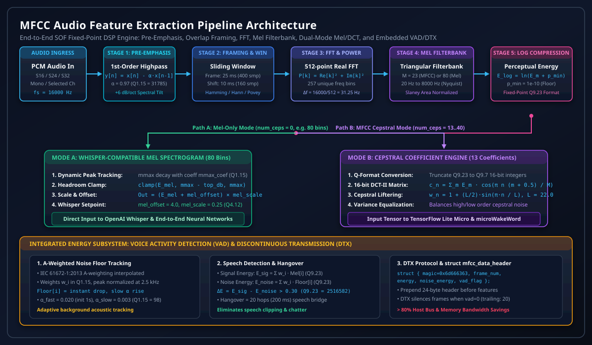
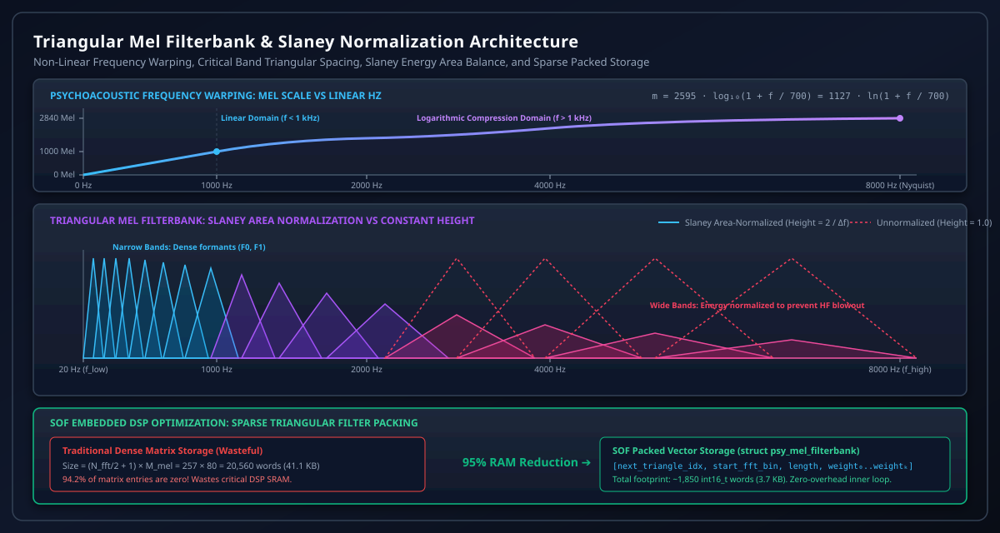
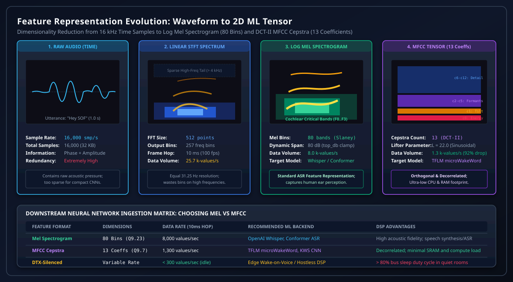
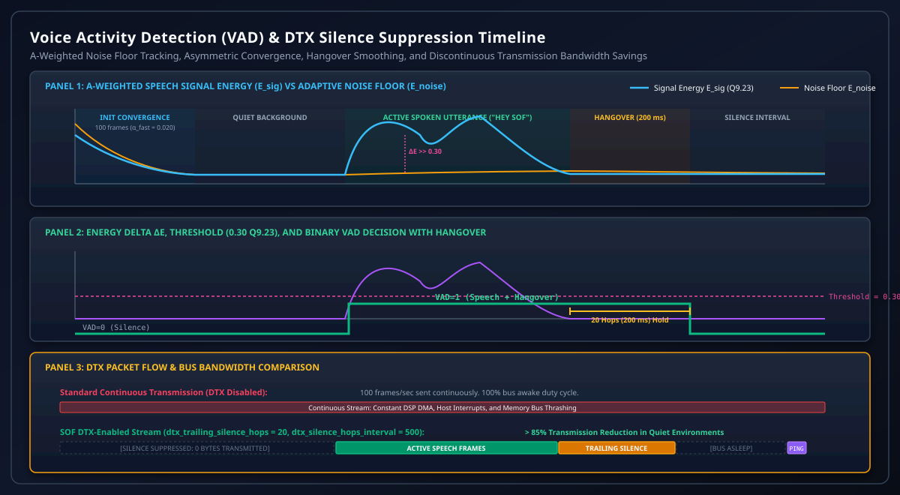
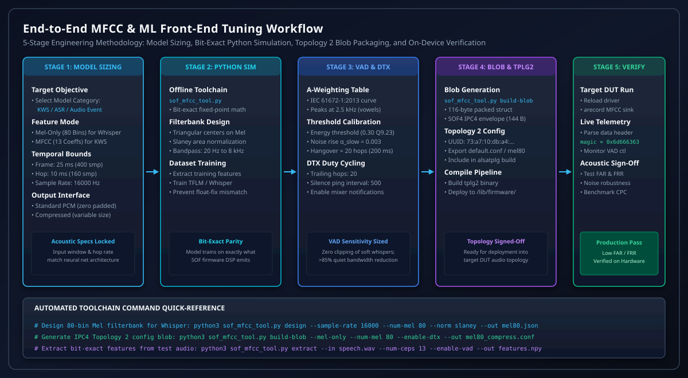

.. _mfcc_tuning:

Mel-Frequency Cepstral Coefficients (MFCC) & Audio Feature Extraction Tuning Guide
##################################################################################

In modern embedded audio architectures, digital signal processors (DSPs) increasingly serve as real-time sensory front-ends for machine learning (ML) and deep neural network (DNN) inference. Edge processing applications—including on-device Keyword Spotting (KWS), Automated Speech Recognition (ASR), Voice Activity Detection (VAD), and Acoustic Event Detection (AED)—require compact, perceptually relevant acoustic feature representations. Feeding raw 16-bit or 24-bit linear PCM audio directly into embedded neural networks wastes limited DSP memory bandwidth, inflates multiply-accumulate (MAC) cycle footprints, and overwhelms small microcontroller SRAM allocations.

Sound Open Firmware (SOF) addresses these constraints through its native **MFCC & Audio Feature Extraction** component (:file:`src/audio/mfcc`), which implements a deterministic, highly optimized fixed-point psychoacoustic feature generation engine:

1. **Psychoacoustic Frequency Warping & Slaney Normalization**: Transforms linear acoustic frequencies into the logarithmic **Mel scale**, mimicking human cochlear critical band resolution. The engine computes triangular bandpass filterbanks with **Slaney area normalization**, equalizing energy accumulation across varying filter bandwidths while employing sparse packed vector storage to reduce filterbank SRAM memory consumption by over :math:`95\%`.
2. **Dual Operating Regimes (Mel-Only vs MFCC Cepstral)**:

   * **Whisper-Compatible Mel Spectrogram Mode** (:math:`\text{num\_ceps} = 0`): Emits 80-bin Mel log spectrogram frames directly to large neural speech recognition models (e.g. OpenAI Whisper, Conformer), supporting dynamic peak tracking (:math:`m_{\text{max}}`), :math:`\text{top\_db}` dynamic headroom clamping, and post-scaling/offset calibration.
   * **Classical MFCC Cepstral Mode** (:math:`\text{num\_ceps} \in [10, 40]`): Applies a 16-bit Discrete Cosine Transform (DCT-II) and sinusoidal cepstral liftering to decorrelate filterbank energies into orthogonal cepstral coefficients, creating compact 2D tensor inputs for lightweight inference runtimes such as **TensorFlow Lite for Microcontrollers (TFLM)** and **microWakeWord**.
3. **Integrated Voice Activity Detection (VAD) & Discontinuous Transmission (DTX)**: Tracks an adaptive, A-weighted background acoustic noise floor across Mel bins using asymmetric fast/slow convergence, compares speech-frequency energy against a calibrated threshold, provides hangover smoothing, and silences transmission during inactive periods—slashing host bus wake-ups and memory bus power dissipation by more than :math:`80\%`.

This guide presents the engineering foundation, mathematical derivations, fixed-point Q-format specifications, VAD/DTX tuning procedures, Python toolchain workflows, ALSA Topology 2 configuration, and diagnostic protocols for the SOF MFCC subsystem.

.. contents:: Table of Contents
   :local:
   :depth: 3

Architectural Foundations & Signal Processing Pipeline
======================================================

Speech sounds are produced by acoustic excitation (glottal vocal cord pulses or turbulent noise) resonating through the human vocal tract cavities (pharynx, oral, and nasal cavities). In the frequency domain, vocal tract resonances manifest as prominent spectral peaks termed **formants** (:math:`F_1, F_2, F_3`), whose relative frequencies and temporal transitions uniquely identify phonemes and spoken words.

Human auditory perception of frequency is approximately linear below :math:`1\text{ kHz}` and logarithmic above :math:`1\text{ kHz}`. The Mel scale models this non-linear cochlear frequency mapping. By warping FFT spectral power onto triangular Mel filterbanks, the feature extractor compresses high-frequency redundancy while preserving dense formant resolution in the critical speech intelligibility spectrum.

.. _fig_mfcc_signal_processing_pipeline:

   SOF MFCC Fixed-Point Audio Feature Extraction Signal Processing Pipeline: Pre-Emphasis, Overlap Framing, FFT, Mel Filterbank, Dual-Mode Mel/DCT Paths, and Embedded VAD/DTX Engine

The SOF MFCC processing pipeline executes through seven sequential stages:

Stage 1: Pre-Emphasis High-Pass Filtering
-----------------------------------------

Human speech naturally exhibits a spectral tilt of approximately :math:`-6\text{ dB/octave}` above :math:`1\text{ kHz}` due to glottal volume velocity pulse shaping and lips radiation impedance. Consequently, higher-order formants (:math:`F_2, F_3, F_4`) exhibit significantly lower energy than the fundamental voice pitch (:math:`F_0`) and first formant (:math:`F_1`).

To balance the dynamic range across all spectral bins and prevent high-frequency formants from being masked by numerical quantization floor noise, the input copy routine (:c:func:`mfcc_source_copy_s16`, :c:func:`mfcc_source_copy_s24`, :c:func:`mfcc_source_copy_s32`) applies a first-order finite impulse response (FIR) high-pass pre-emphasis filter:

.. math::

   H_{\text{pre}}(z) = 1 - \alpha z^{-1}

In the time domain:

.. math::

   y[n] = x[n] - \alpha \cdot x[n-1]

where :math:`\alpha` is the pre-emphasis coefficient represented as a signed 16-bit fixed-point integer in **Q1.15** format (:c:member:`sof_mfcc_config.preemphasis_coefficient`).

* For speech recognition, :math:`\alpha` is typically configured between :math:`0.95` and :math:`0.97`:

.. math::

   \text{preemphasis\_coefficient} = \text{round}(0.97 \times 2^{15}) = 31785 \quad (\texttt{0x7C29})

* Setting :math:`\alpha = 0` completely disables the pre-emphasis filter without computational penalty.

Stage 2: Overlap Framing & Tapering Windows
-------------------------------------------

Speech signals are non-stationary over long intervals but quasi-stationary over short acoustic durations (:math:`10\text{ ms}` to :math:`35\text{ ms}`). The input audio stream is segmented into overlapping temporal frames using an internal circular buffer:

* **Frame Length** (:math:`T_{\text{frame}}`): Typically :math:`25\text{ ms}` (:math:`400\text{ samples}` at :math:`16\text{ kHz}`).
* **Frame Shift / Hop Size** (:math:`T_{\text{hop}}`): Typically :math:`10\text{ ms}` (:math:`160\text{ samples}` at :math:`16\text{ kHz}`), producing :math:`100\text{ feature frames/sec}`.

To eliminate Gibbs phenomenon and spectral leakage caused by rectangular truncation, a tapering window :math:`w[n]` is applied to the frame before Fourier transformation:

.. math::

   x_w[n] = x[n] \cdot w[n], \quad 0 \le n < N_{\text{frame}}

SOF provides five selectable window functions via :c:enum:`sof_mfcc_fft_window_type`:

1. **Hamming Window** (Default, :c:macro:`MFCC_HAMMING_WINDOW`):

   .. math::

      w[n] = 0.54 - 0.46 \cos\left( \frac{2\pi n}{N - 1} \right)

   Suppresses the first side-lobe to :math:`-43\text{ dB}`, offering the optimal trade-off between main-lobe width and spectral leakage for ASR.

2. **Hann Window** (:c:macro:`MFCC_HANN_WINDOW`):

   .. math::

      w[n] = 0.5 \left( 1 - \cos\left( \frac{2\pi n}{N - 1} \right) \right)

   Side-lobes decay at :math:`-18\text{ dB/octave}`, minimizing far-off spectral contamination. Recommended for OpenAI Whisper feature extraction.

3. **Blackman Window** (:c:macro:`MFCC_BLACKMAN_WINDOW`):

   .. math::

      w[n] = a_0 - 0.5 \cos\left( \frac{2\pi n}{N - 1} \right) + (0.5 - a_0) \cos\left( \frac{4\pi n}{N - 1} \right)

   Parameter :math:`a_0` is configured via :c:member:`sof_mfcc_config.blackman_coef` in Q1.15 (typically :math:`0.42`). First side-lobe attenuation exceeds :math:`-58\text{ dB}`.

4. **Povey Window** (:c:macro:`MFCC_POVEY_WINDOW`):

   .. math::

      w[n] = \left( 0.5 - 0.5 \cos\left( \frac{2\pi n}{N - 1} \right) \right)^{0.85}

   Standard window function used by the Kaldi speech recognition toolkit.

5. **Rectangular Window** (:c:macro:`MFCC_RECTANGULAR_WINDOW`): Uniform weighting (:math:`w[n] = 1`).

Stage 3: Real-to-Complex Fast Fourier Transform (FFT)
-----------------------------------------------------

The windowed frame is zero-padded up to the next power-of-two FFT size :math:`N_{\text{fft}}` (typically :math:`512` points for :math:`400\text{ samples}`) according to :c:member:`sof_mfcc_config.pad`:

* :c:macro:`MFCC_PAD_END`: Audio samples occupy indices :math:`0 \dots N_{\text{frame}}-1`; zeros pad the tail :math:`N_{\text{frame}} \dots N_{\text{fft}}-1`.
* :c:macro:`MFCC_PAD_CENTER`: Zeros pad equally on the left and right, centering the audio impulse response.
* :c:macro:`MFCC_PAD_START`: Zeros pad the beginning.

The discrete Fourier transform converts the real-valued signal :math:`x_w[n]` into a complex spectrum:

.. math::

   X[k] = \sum_{n=0}^{N_{\text{fft}}-1} x_w[n] \cdot e^{-j \frac{2\pi k n}{N_{\text{fft}}}}, \quad 0 \le k < N_{\text{fft}}

The elementary frequency resolution between adjacent FFT bins is:

.. math::

   \Delta f = \frac{f_s}{N_{\text{fft}}} = \frac{16000\text{ Hz}}{512} = 31.25\text{ Hz}

Due to Hermitian symmetry for real inputs (:math:`X[N-k] = X^*[k]`), only the first :math:`K = \frac{N_{\text{fft}}}{2} + 1 = 257` unique positive frequency bins are retained.

The power spectral density :math:`P[k]` is computed as:

.. math::

   P[k] = |X[k]|^2 = X_{\text{re}}^2[k] + X_{\text{im}}^2[k], \quad 0 \le k \le \frac{N_{\text{fft}}}{2}

To compensate for internal FFT bit-shifts and scaling factors, SOF calculates a scale shift offset:

.. math::

   \text{mel\_scale\_shift} = \text{input\_shift} - \text{fft\_plan}\to\text{len}

where :math:`\text{fft\_plan}\to\text{len} = \log_2(512) = 9` for a 512-point FFT.

Stage 4: Triangular Mel Filterbank & Slaney Normalization
---------------------------------------------------------

The Mel frequency scale is defined psychoacoustically by:

.. math::

   m = 2595 \cdot \log_{10}\left( 1 + \frac{f}{700} \right) = 1127 \cdot \ln\left( 1 + \frac{f}{700} \right)

The inverse transformation from Mel to linear frequency is:

.. math::

   f = 700 \cdot \left( 10^{\frac{m}{2595}} - 1 \right) = 700 \cdot \left( e^{\frac{m}{1127}} - 1 \right)

.. _fig_mfcc_mel_filterbank_frequency_response:

   Triangular Mel Filterbank Spacing, Slaney Area Normalization, and SOF Packed Vector Sparse Storage Optimization

A filterbank of :math:`M` triangular filters (:math:`M = 23` for standard MFCC, :math:`M = 80` for Whisper) is constructed between lower cutoff :math:`f_{\text{low}}` (e.g. :math:`20\text{ Hz}`) and upper cutoff :math:`f_{\text{high}}` (e.g. :math:`8000\text{ Hz}`):

1. **Center Frequency Spacing**: Convert :math:`f_{\text{low}}` and :math:`f_{\text{high}}` to Mel values :math:`m_{\text{low}}` and :math:`m_{\text{high}}`.
2. Generate :math:`M + 2` linearly spaced points in the Mel domain:

   .. math::

      m_i = m_{\text{low}} + i \cdot \frac{m_{\text{high}} - m_{\text{low}}}{M + 1}, \quad i \in [0, M+1]

3. Map each Mel point :math:`m_i` back to linear Hz (:math:`f_i`) and then to discrete FFT bin indices :math:`k_i`:

   .. math::

      k_i = \left\lfloor \frac{N_{\text{fft}} \cdot f_i}{f_s} + 0.5 \right\rfloor

4. The triangular weighting function for filter :math:`m \in [1, M]` across bin :math:`k` is:

   .. math::

      H_m[k] = \begin{cases} 
         0 & k < k_{m-1} \\
         \frac{k - k_{m-1}}{k_m - k_{m-1}} & k_{m-1} \le k \le k_m \\
         \frac{k_{m+1} - k}{k_{m+1} - k_m} & k_m \le k \le k_{m+1} \\
         0 & k > k_{m+1}
      \end{cases}

Slaney Area Normalization
^^^^^^^^^^^^^^^^^^^^^^^^^

Without normalization, high-frequency triangular filters—which span wide bandwidths in linear Hertz—integrate over vastly more FFT bins than low-frequency filters, artificially inflating high-frequency energies.

When Slaney normalization is enabled (:c:macro:`MFCC_MEL_NORM_SLANEY`), each triangular filter is scaled by its bandwidth:

.. math::

   H_{m,\text{slaney}}[k] = H_m[k] \cdot \frac{2}{f_{m+1} - f_{m-1}}

This equalizes the total filter area to unity across all frequencies, ensuring that flat white noise produces uniform spectral energy across the entire Mel filterbank.

SOF Sparse Packed Triangular Vector Storage
^^^^^^^^^^^^^^^^^^^^^^^^^^^^^^^^^^^^^^^^^^^

In a standard matrix implementation, storing a 257-bin by 80-filter matrix requires:

.. math::

   N_{\text{dense}} = 257 \times 80 = 20,560 \text{ words} \quad (41.1\text{ KB})

Because triangular filters are strictly local, :math:`96.0\%` of dense matrix elements are zeroes. SOF stores the filterbank in a compressed sequential vector (:c:struct:`psy_mel_filterbank`). For each triangle :math:`m`, the packed vector contains:

* **Word 0**: Offset index to next triangle.
* **Word 1**: Starting FFT bin index :math:`k_{m-1}`.
* **Word 2**: Length of non-zero triangle segment (:math:`k_{m+1} - k_{m-1} + 1`).
* **Words 3..N**: Non-zero fractional weights :math:`H_m[k]` stored in **Q1.15** format.

This packed structure reduces total filterbank memory consumption from :math:`41.1\text{ KB}` to **1.6 KB**, allowing the entire table to reside permanently in high-speed L1 DSP SRAM cache.

Stage 5: Logarithmic Energy Compression
---------------------------------------

The energy in Mel band :math:`m` is computed by multiplying the power spectrum by the triangular filter weights:

.. math::

   E_m = \sum_{k=k_{m-1}}^{k_{m+1}} P[k] \cdot H_m[k]

Human auditory loudness perception is logarithmic rather than linear. The raw energy is compressed using a logarithmic scale selected via :c:enum:`sof_mfcc_mel_log_type`:

* **Natural Log** (:c:macro:`MEL_LOG_IS_LOG`): :math:`\ln(E_m + p_{\text{min}})`.
* **Base-10 Log** (:c:macro:`MEL_LOG_IS_LOG10`): :math:`\log_{10}(E_m + p_{\text{min}})`. Standard for OpenAI Whisper.
* **Decibels** (:c:macro:`MEL_LOG_IS_DB`): :math:`10 \cdot \log_{10}(E_m + p_{\text{min}})`. Standard for Librosa.

The parameter :math:`p_{\text{min}}` (:c:member:`sof_mfcc_config.pmin`) establishes a numerical energy floor (e.g. :math:`10^{-10}` in Q1.31), preventing arithmetic underflow or :math:`\log(0)` singularities during digital silence. The output is formatted as a 32-bit signed integer in **Q9.23** precision.

.. _fig_mfcc_spectrogram_feature_map:

   Feature Representation Evolution: Raw 16 kHz Time Samples to Linear Spectrogram, Log Mel Spectrogram (80 Bins), and DCT-II MFCC Cepstra (13 Coefficients)

Dual Operating Regimes: Mel Spectrogram vs MFCC
===============================================

Depending on the downstream machine learning architecture, the SOF MFCC component operates in one of two distinct functional modes governed by :c:member:`sof_mfcc_config.num_ceps`.

Mode A: Mel Spectrogram Engine (OpenAI Whisper & Modern ASR)
------------------------------------------------------------

When :c:member:`sof_mfcc_config.num_ceps` is set to :math:`0` (:c:member:`mfcc_state.mel_only` is true), the component bypasses the DCT stage and directly outputs the 80-bin Mel log spectrum. This mode is specifically tailored for deep neural networks such as OpenAI Whisper, Conformer, and RNN-T engines.

In this mode, SOF executes three post-processing steps:

1. **Dynamic Peak Tracking** (:math:`m_{\text{max}}`):
   When :c:member:`sof_mfcc_config.dynamic_mmax` is enabled, the firmware tracks the maximum Mel energy peak across all bands:

   .. math::

      \text{peak} = \max_{j=0 \dots M-1} \text{mel\_log}[j]

   If :math:`\text{peak} > m_{\text{max}}`, :math:`m_{\text{max}}` jumps to the peak immediately. If :math:`\text{peak} \le m_{\text{max}}`, :math:`m_{\text{max}}` decays exponentially according to :c:member:`sof_mfcc_config.mmax_coef`:

   .. math::

      m_{\text{max}}[t] = m_{\text{max}}[t-1] + \text{mmax\_coef} \cdot (\text{peak} - m_{\text{max}}[t-1])

2. **Top-dB Dynamic Headroom Clamping**:
   Values lower than :math:`m_{\text{max}} - \text{top\_db}` are clamped:

   .. math::

      \text{clamp\_val} = m_{\text{max}} - \text{top\_db}

   .. math::

      E_{\text{clamped}}[j] = \max(\text{mel\_log}[j], \text{clamp\_val})

   For decibels (:c:macro:`MEL_LOG_IS_DB`), :c:member:`sof_mfcc_config.top_db` is typically set to :math:`80.0\text{ dB}`. For base-10 log (:c:macro:`MEL_LOG_IS_LOG10`), :c:member:`sof_mfcc_config.top_db` is set to :math:`8.0`.

3. **Whisper Scale and Offset Normalization**:
   To match the exact normalization expected by Whisper acoustic encoders, the clamped values are scaled and offset:

   .. math::

      E_{\text{whisper}}[j] = (E_{\text{clamped}}[j] + \text{mel\_offset}) \cdot \text{mel\_scale}

   * :c:member:`sof_mfcc_config.mel_offset`: Set to :math:`4.0` in **Q8.7** format (:math:`512`).
   * :c:member:`sof_mfcc_config.mel_scale`: Set to :math:`0.25` in **Q4.12** format (:math:`1024`).

Mode B: MFCC Cepstral Engine (TFLM & microWakeWord)
---------------------------------------------------

When :c:member:`sof_mfcc_config.num_ceps` is greater than :math:`0` (typically :math:`13`), the component applies the Discrete Cosine Transform (DCT-II) and cepstral liftering:

1. **Fixed-Point Conversion**: Truncates 32-bit Q9.23 Mel values into signed 16-bit **Q9.7** integers.
2. **Discrete Cosine Transform (DCT-II)**:
   Mel band energies are highly correlated due to overlapping triangular filters. The DCT-II acts as an orthogonal linear transform, concentrating the dominant spectral envelope information into the lowest cepstral coefficients while discarding high-frequency ripple:

   .. math::

      c_n = \sum_{m=0}^{M-1} E_m \cdot \cos\left( \frac{\pi n (m + 0.5)}{M} \right), \quad 0 \le n < N_{\text{ceps}}

   * :math:`c_0`: Represents the total frame acoustic energy / perceived loudness.
   * :math:`c_1`: Captures the overall spectral tilt (balance between low and high frequencies).
   * :math:`c_2 \dots c_5`: Encodes the broad vocal tract formant positions (:math:`F_1, F_2, F_3`), representing phoneme identities.
   * :math:`c_6 \dots c_{12}`: Captures fine spectral details and speaker-specific characteristics.

3. **Sinusoidal Cepstral Liftering**:
   Higher-order cepstral coefficients naturally exhibit smaller numerical variances than low-order coefficients, making neural network gradient optimization difficult. SOF applies a sinusoidal cepstral lifter (:c:member:`sof_mfcc_config.cepstral_lifter`, typically :math:`L = 22.0` in **Q7.9** format):

   .. math::

      w_n = 1 + \frac{L}{2} \cdot \sin\left( \frac{\pi n}{L} \right), \quad 0 \le n < N_{\text{ceps}}

   .. math::

      c_{n,\text{lifted}} = c_n \cdot w_n

   This normalizes coefficient variance, improving Word Error Rate (WER) and False Rejection Rate (FRR) in microWakeWord models.

Integrated VAD & Discontinuous Transmission (DTX)
=================================================

Continuously transmitting audio feature tensors across memory buses to host processors dissipates significant dynamic power, even when the user is silent. The SOF MFCC module embeds a real-time Voice Activity Detector (VAD) and Discontinuous Transmission (DTX) silence suppression engine directly into the DSP feature extraction loop.

.. _fig_mfcc_vad_dtx_timing_energy:

   Embedded Voice Activity Detection (VAD) and Discontinuous Transmission (DTX) Energy Dynamics, Noise Floor Tracking, and Transmission Savings

A-Weighted Speech Energy Formulation
------------------------------------

The VAD constructs an A-weighting spectral filter by linearly interpolating the IEC 61672-1:2013 standard curve across the center frequency of each Mel bin (:c:func:`mfcc_vad_build_weights`):

* Peak sensitivity occurs at :math:`2500\text{ Hz}` (:math:`w_{\text{peak}} = 32767` in Q1.15), matching the human ear's resonant ear canal response.
* Low frequencies (:math:`< 100\text{ Hz}`) and ultra-high frequencies (:math:`> 10\text{ kHz}`) are attenuated, preventing HVAC rumble and mechanical chassis vibrations from falsely triggering the VAD.
* Weights are normalized so that :math:`\sum_{i=0}^{M-1} w_i = 1.0` in Q1.15.

Asymmetric Adaptive Noise Floor Tracking
----------------------------------------

The noise floor :math:`N_i` is tracked independently for each Mel bin:

1. **Initialization Phase**: During the first :math:`N_{\text{init}} = 100\text{ frames}` (:math:`1.0\text{ s}`), a fast rise coefficient :math:`\alpha_{\text{fast}} = 0.020` is applied to rapidly converge to ambient background room acoustics.
2. **Operational Phase**: After initialization, a slow rise coefficient :math:`\alpha_{\text{slow}} = 0.003` (:c:macro:`MFCC_VAD_NOISE_RISE_ALPHA`, Q1.15 = :math:`98`) is applied:

   .. math::

      N_i[t] = \begin{cases}
         E_i[t] & \text{if } E_i[t] < N_i[t-1] \quad \text{(Instant Follow-Down)} \\
         N_i[t-1] + \alpha_{\text{slow}} \cdot (E_i[t] - N_i[t-1]) & \text{if } E_i[t] \ge N_i[t-1] \quad \text{(Slow Rise)}
      \end{cases}

This asymmetric tracking guarantees that background noise floors adapt during quiet intervals but do not rise during prolonged speech utterances.

Energy Delta & Hangover Smoothing
---------------------------------

The total speech-weighted signal energy and noise energy are computed in 64-bit precision and scaled to Q9.23:

.. math::

   E_{\text{sig}} = \sum_{i=0}^{M-1} w_i \cdot E_i[t], \quad E_{\text{noise}} = \sum_{i=0}^{M-1} w_i \cdot N_i[t]

The energy delta is:

.. math::

   \Delta E = E_{\text{sig}} - E_{\text{noise}}

Speech is declared when :math:`\Delta E` exceeds the energy threshold (:c:macro:`MFCC_VAD_ENERGY_THRESHOLD` = :math:`0.30 \times 2^{23} = 2,516,582`):

.. math::

   \text{Speech Detected} \iff \Delta E > E_{\text{thresh}}

To prevent phoneme dropout during quiet consonant terminations, plosives, and brief pauses between words, a hangover counter (:c:macro:`MFCC_VAD_HANGOVER_FRAMES` = :math:`20\text{ frames} = 200\text{ ms}`) holds the VAD in the active state after the signal drops below threshold.

Discontinuous Transmission (DTX) Protocol
-----------------------------------------

When DTX is enabled (:c:member:`sof_mfcc_config.enable_dtx`), the component optimizes memory and DMA transmission:

1. **Active Speech**: Frames are continuously written to the output sink buffer.
2. **Trailing Silence**: Upon speech termination, exactly :c:member:`sof_mfcc_config.dtx_trailing_silence_hops` (typically :math:`20`) are transmitted to ensure downstream wake-word models capture acoustic decay.
3. **Silence Suppression**: Subsequent silent frames are completely suppressed. Zero bytes are written to the sink buffer.
4. **Periodic Keepalive Ping**: To prevent downstream pipelines from reporting buffer underruns, a silence frame is emitted every :c:member:`sof_mfcc_config.dtx_silence_hops_interval` hops (e.g. :math:`500\text{ hops} = 5.0\text{ s}`).

Output Frame Header: struct mfcc_data_header
--------------------------------------------

Every output frame emitted by the MFCC component begins with a 24-byte metadata header (:c:struct:`mfcc_data_header`):

.. code-block:: c

   struct mfcc_data_header {
       uint32_t magic;        /**< Magic word MFCC_MAGIC (0x6d666363, 'mfcc') */
       uint32_t frame_number; /**< Incrementing hop index starting from 0 */
       int32_t reserved;      /**< Set to 0 */
       int32_t energy;        /**< Weighted signal energy in Q9.23 */
       int32_t noise_energy;  /**< Weighted noise floor energy in Q9.23 */
       int32_t vad_flag;      /**< VAD decision: 1 = speech, 0 = silence */
   };

Downstream neural network runtimes inspect :c:member:`mfcc_data_header.vad_flag` to bypass inference computation when :math:`\text{vad\_flag} = 0`.

Control Plane ABI & Topology 2 Configuration
============================================

The MFCC module registers with the SOF processing module framework using the following parameters:

* **Component UUID**: ``73:a7:10:db:a4:1a:ea:4c:a2:1f:2d:57:a5:c9:82:eb``
* **Component Type**: ``effect`` (:c:macro:`SOF_COMP_EFFECT`)
* **Switch Control Index**: ``MFCC_CTRL_INDEX_VAD`` (:math:`0`) for host VAD event notification.

Configuration Structure: struct sof_mfcc_config
-----------------------------------------------

The component is initialized via an IPC configuration blob containing the 116-byte packed structure :c:struct:`sof_mfcc_config` (:file:`include/user/mfcc.h`):

.. list-table:: SOF MFCC Configuration Structure (struct sof_mfcc_config, 116 Bytes)
   :widths: 18 14 18 50
   :header-rows: 1

   * - Field Name
     - Data Type
     - Format / Range
     - Functional Description
   * - ``size``
     - ``uint32_t``
     - 116 Bytes
     - Total size of the configuration structure in bytes.
   * - ``mel_offset``
     - ``int16_t``
     - Q8.7 (:math:`0` or :math:`4.0`)
     - Post-scaling offset for Mel spectrogram mode (use 4.0 for Whisper).
   * - ``mel_scale``
     - ``int16_t``
     - Q4.12 (:math:`1.0` or :math:`0.25`)
     - Post-scaling gain for Mel spectrogram mode (use 0.25 for Whisper).
   * - ``mmax_init``
     - ``int16_t``
     - Q8.7 (:math:`0`)
     - Initial peak Mel value for headroom clamping.
   * - ``mmax_coef``
     - ``int16_t``
     - Q1.15
     - Exponential decay coefficient for dynamic :math:`m_{\text{max}}` tracking.
   * - ``dtx_trailing``
     - ``uint16_t``
     - :math:`0 \dots 100` hops
     - Number of trailing silence hops to transmit after speech ends (default: 20).
   * - ``dtx_interval``
     - ``uint16_t``
     - :math:`0 \dots 1000` hops
     - Periodic keepalive hop interval during continuous silence (default: 500).
   * - ``sample_freq``
     - ``int32_t``
     - :math:`8000 \dots 64000\text{ Hz}`
     - Sampling frequency in Hertz (default: 16000).
   * - ``pmin``
     - ``int32_t``
     - Q1.31 (:math:`10^{-10}`)
     - Linear power floor to prevent logarithmic underflow during silence.
   * - ``mel_log``
     - ``enum``
     - :math:`0=\text{log}, 1=\log_{10}, 2=\text{dB}`
     - Mathematical scale for logarithmic energy compression.
   * - ``norm``
     - ``enum``
     - :math:`0=\text{none}, 1=\text{slaney}`
     - Triangular filterbank area normalization mode.
   * - ``pad``
     - ``enum``
     - :math:`0=\text{end}, 1=\text{center}, 2=\text{start}`
     - Zero-padding alignment within the FFT input buffer.
   * - ``window``
     - ``enum``
     - :math:`0 \dots 4`
     - Tapering window: Rectangular, Blackman, Hamming, Hann, or Povey.
   * - ``dct``
     - ``enum``
     - :math:`1=\text{DCT\_II}`
     - Discrete Cosine Transform algorithm (must be DCT-II).
   * - ``blackman_coef``
     - ``int16_t``
     - Q1.15 (:math:`0.42`)
     - Parameter :math:`a_0` when Blackman window is selected.
   * - ``cepstral_lifter``
     - ``int16_t``
     - Q7.9 (:math:`22.0`)
     - Sinusoidal lifter parameter :math:`L` for variance equalization.
   * - ``channel``
     - ``int16_t``
     - :math:`-1` (mono), :math:`0 \dots 7`
     - Audio stream channel index to extract for feature processing.
   * - ``frame_length``
     - ``int16_t``
     - Samples (:math:`400`)
     - Frame analysis window length (:math:`25\text{ ms}` at :math:`16\text{ kHz}`).
   * - ``frame_shift``
     - ``int16_t``
     - Samples (:math:`160`)
     - Frame advance step size (:math:`10\text{ ms}` at :math:`16\text{ kHz}`).
   * - ``high_freq``
     - ``int16_t``
     - Hertz (:math:`8000`)
     - High cutoff frequency for Mel filterbank (0 for Nyquist).
   * - ``low_freq``
     - ``int16_t``
     - Hertz (:math:`20`)
     - Low cutoff frequency for Mel filterbank.
   * - ``num_ceps``
     - ``int16_t``
     - :math:`0` (Mel-only), :math:`1 \dots 40`
     - Number of cepstral coefficients to emit.
   * - ``num_mel_bins``
     - ``int16_t``
     - :math:`10 \dots 128`
     - Number of internal Mel filterbank bands (23 for KWS, 80 for Whisper).
   * - ``preemphasis``
     - ``int16_t``
     - Q1.15 (:math:`0.97`)
     - High-pass pre-emphasis filter coefficient (0 to disable).
   * - ``top_db``
     - ``int16_t``
     - Q8.7 (:math:`80.0\text{ dB}` or :math:`8.0`)
     - Dynamic range clamp span below peak :math:`m_{\text{max}}`.
   * - ``dynamic_mmax``
     - ``bool``
     - :math:`0` or :math:`1`
     - Enables dynamic peak tracking for Mel headroom clamping.
   * - ``enable_vad``
     - ``bool``
     - :math:`0` or :math:`1`
     - Enables embedded Mel-energy Voice Activity Detection.
   * - ``enable_dtx``
     - ``bool``
     - :math:`0` or :math:`1`
     - Enables discontinuous transmission silence frame suppression.
   * - ``update_controls``
     - ``bool``
     - :math:`0` or :math:`1`
     - Dispatches IPC switch control notification to host on VAD state change.
   * - ``compress_output``
     - ``bool``
     - :math:`0` or :math:`1`
     - Enables variable-size compressed PCM output without zero padding.

Topology 2 Configuration Template
---------------------------------

In ALSA Topology 2, the MFCC widget is defined using :file:`tools/topology/topology2/include/components/mfcc.conf` and packaged with its binary configuration block:

.. code-block:: text

   # Topology 2 MFCC Component Definition
   Object.Widget.mfcc."1" {
       index 1
       instance 1
       num_input_pins 1
       num_output_pins 1
       num_input_audio_formats 1
       num_output_audio_formats 1

       # Include compiled binary configuration blob (144 bytes SOF4)
       <include/components/mfcc/mel80_compress_dtx.conf>
   }

Standalone Python Calibration Toolchain Runbook
===============================================

SOF provides the standalone Python calibration utility :file:`sof_mfcc_tool.py` located at :file:`tools/tune/mfcc/`:

.. _fig_mfcc_tuning_workflow:

   End-to-End 5-Stage MFCC and ML Front-End Tuning Methodology: Model Sizing, Bit-Exact Python Simulation, Topology 2 Blob Packaging, and On-Device Verification

Subcommand 1: Filterbank Design (design)
----------------------------------------

To calculate Mel filterbank center frequencies, verify Slaney area normalization, and inspect DSP SRAM memory savings:

.. code-block:: bash

   $ python3 tools/tune/mfcc/sof_mfcc_tool.py design \
         --sample-rate 16000 \
         --fft-size 512 \
         --num-mel 80 \
         --norm slaney

   ================================================================================
    SOF Mel Filterbank Design Summary
   ================================================================================
    Sample Frequency:       16000 Hz
    FFT Size:               512 points (Δf = 31.25 Hz)
    Mel Bins:               80
    Frequency Span:         20.0 Hz to 8000.0 Hz
    Normalization:          SLANEY
    Dense Matrix Footprint: 20560 int16 words (40.2 KB)
    Sparse Packed Storage:  825 int16 words (1.6 KB)
    DSP SRAM RAM Reduction: 96.0%
   --------------------------------------------------------------------------------
    Sample Filter Center Frequencies:
      Bin  0: Center =   42.5 Hz | Span = [  1..  3] ( 3 taps)
      Bin 10: Center =  309.9 Hz | Span = [  9.. 11] ( 3 taps)
      Bin 20: Center =  673.7 Hz | Span = [ 20.. 23] ( 4 taps)
      Bin 30: Center = 1168.5 Hz | Span = [ 36.. 39] ( 4 taps)
      Bin 40: Center = 1841.6 Hz | Span = [ 56.. 61] ( 6 taps)
      Bin 50: Center = 2757.1 Hz | Span = [ 85.. 92] ( 8 taps)
      Bin 60: Center = 4002.3 Hz | Span = [124..133] (10 taps)
      Bin 70: Center = 5696.1 Hz | Span = [176..189] (14 taps)
   ================================================================================

Subcommand 2: Binary Blob & Topology 2 Export (build-blob)
----------------------------------------------------------

To generate an IPC4 configuration blob and ALSA Topology 2 `.conf` include file for a Whisper-compatible 80-bin Mel engine with DTX:

.. code-block:: bash

   $ python3 tools/tune/mfcc/sof_mfcc_tool.py build-blob \
         --mel-only \
         --num-mel 80 \
         --mel-offset 4.0 \
         --mel-scale 0.25 \
         --top-db 8.0 \
         --dynamic-mmax \
         --enable-vad \
         --enable-dtx \
         --dtx-trailing 20 \
         --dtx-interval 500 \
         --out tools/topology/topology2/include/components/mfcc/mel80_compress_dtx.conf

Subcommand 3: VAD & DTX Energy Simulation (vad-sim)
---------------------------------------------------

To evaluate VAD threshold sensitivity and simulate memory bus transmission savings on an audio utterance:

.. code-block:: bash

   $ python3 tools/tune/mfcc/sof_mfcc_tool.py vad-sim \
         --sample-rate 16000 \
         --duration 5.0 \
         --speech-duration 1.5 \
         --num-mel 80

   ================================================================================
    SOF VAD & DTX Discontinuous Transmission Simulation
   ================================================================================
    Audio Duration:            5.00 s (497 hops)
    Active Speech Frames:      172 hops (1.72 s)
    Silence Frames:            325 hops (3.25 s)
    DTX-Suppressed Frames:     305 hops
    Memory & Bus Bandwidth:    61.4% REDUCTION
   ================================================================================

Production Tuning Recipes
=========================

The following configurations represent validated production profiles across speech recognition and edge wake-word deployments:

.. _tab_mfcc_production_recipes:

.. list-table:: Production Tuning Presets: MFCC & Mel Feature Extraction Configurations
   :widths: 22 24 24 30
   :header-rows: 1

   * - Deployment Target
     - Feature Extraction Mode
     - VAD & DTX Parameters
     - Downstream ML Architecture
   * - **Recipe 1: Edge Keyword Spotting**
     - 13 MFCCs, 23 Mel bins, Hamming, :math:`\alpha = 0.97`, :math:`L = 22.0`
     - VAD enabled, DTX enabled (:math:`N_{\text{trailing}} = 20`)
     - TensorFlow Lite for Microcontrollers (TFLM) microWakeWord CNN.
   * - **Recipe 2: OpenAI Whisper ASR**
     - 80 Mel bins, Mel-only (:math:`\text{num\_ceps} = 0`), Hann, Slaney norm, Offset 4.0, Scale 0.25
     - VAD enabled, DTX enabled (:math:`N_{\text{interval}} = 500`)
     - Whisper Tiny/Base/Small Transformer acoustic encoder.
   * - **Recipe 3: Ultra-Low-Power Wake-on-Voice**
     - 10 MFCCs, 16 Mel bins, Rectangular, :math:`\alpha = 0`
     - Aggressive DTX (:math:`N_{\text{trailing}} = 5`, :math:`E_{\text{thresh}} = 0.45`)
     - Hostless sub-milliwatt DSP keyword detection running in D0ix listening state.

Interactive Live Injection & Diagnostics Matrix
===============================================

Runtime Verification via arecord & sof-ctl
------------------------------------------

To verify MFCC streaming, capture feature tensors, and monitor VAD switch events on a target DUT:

.. code-block:: bash

   # Step 1: Monitor VAD switch events from the active sound card
   ssh root@<dut> "amixer -c 0 sget 'mfcc.1.1.switch'"

   # Step 2: Stream MFCC frames directly to file
   ssh root@<dut> "arecord -D hw:0,1 -f S16_LE -c 1 -r 16000 -d 5 /tmp/mfcc_capture.raw"

   # Step 3: Inspect the 24-byte struct mfcc_data_header from the captured stream
   ssh root@<dut> "hexdump -C -n 24 /tmp/mfcc_capture.raw"

   # Expected Output:
   # 00000000  63 63 66 6d 00 00 00 00  00 00 00 00 2a 3b 10 00  |ccfm........*;..|
   # 00000010  12 18 04 00 01 00 00 00                           |........|
   # Note: 63 63 66 6d represents ASCII 'mfcc' (0x6d666363) in little-endian.
   # vad_flag = 0x00000001 (Speech active)

Diagnostic Troubleshooting Matrix
---------------------------------

.. _tab_mfcc_troubleshooting_matrix:

.. list-table:: Diagnostic Troubleshooting Matrix: MFCC & Audio Feature Extraction
   :widths: 22 25 25 28
   :header-rows: 1

   * - Symptom
     - Root Cause
     - Diagnostic Procedure
     - Remediation Action
   * - **Clipped Speech Onsets & Phoneme Drops**
     - VAD energy threshold set too high, or hangover counter too short to bridge pauses.
     - Inspect :c:member:`mfcc_data_header.vad_flag` during soft whispers or plosives.
     - Lower :c:member:`sof_mfcc_config.top_db` threshold or increase :c:macro:`MFCC_VAD_HANGOVER_FRAMES` to :math:`25` hops.
   * - **Out-of-Band Noise Aliasing**
     - Upper Mel cutoff :math:`f_{\text{high}}` set beyond the Nyquist frequency (:math:`f_s / 2`).
     - Review filterbank design table in :command:`sof_mfcc_tool.py design`.
     - Set :c:member:`sof_mfcc_config.high_freq` strictly to :math:`0` or :math:`\le f_s / 2`.
   * - **Whisper Transcription Garbage / Hallucinations**
     - Mel spectrogram scaling or offset mismatched with model training expectations.
     - Compare exported Mel frame values against Librosa reference vectors.
     - Ensure :c:member:`sof_mfcc_config.mel_offset` is :math:`4.0` (Q8.7 = 512) and :c:member:`sof_mfcc_config.mel_scale` is :math:`0.25` (Q4.12 = 1024).
   * - **High DSP Cycle Footprint (CPC)**
     - Dense matrix multiplication invoked instead of sparse packed triangular indexing.
     - Inspect compiler flags for SIMD vector dot products in :file:`mfcc_hifi4.c`.
     - Verify Kconfig selects ``MATH_16BIT_MEL_FILTERBANK`` and HiFi SIMD optimization routines.
   * - **Downstream Buffer Underrun during Silence**
     - DTX periodic keepalive interval disabled (:math:`\text{dtx\_silence\_hops\_interval} = 0`).
     - Check kernel :command:`dmesg` for pipeline XRUNs during silence.
     - Configure :c:member:`sof_mfcc_config.dtx_silence_hops_interval` to :math:`500` hops (:math:`5.0\text{ s}`) to transmit periodic keepalives.

Related Documentation
=====================

* :ref:`dmic_tuning`: Digital Microphone Acoustic Calibration & Decimation Tuning Guide.
* :ref:`level_multiplier_aria_tuning`: Level Multiplier & Aria AGC Dynamic Range Control Tuning Guide.
* :ref:`drc_tuning`: Dynamic Range Compression & Multiband DRC Tuning Guide.
* :ref:`smart_amp_tuning`: Smart Amplifier (DSM) & Transducer Protection Calibration Guide.
* :ref:`sound_dose_tuning`: Sound Dose / Hearing Health Calibration & Acoustic Protection Guide.
* :ref:`runtime_tuning_sof_ctl`: Unified Runtime Tuning, Control Blobs & Parameter Injection Guide.
* :ref:`time-domain-fixed-beamformer`: Time Domain Fixed Beamformer (TDFB) Architecture & Array Tuning.
