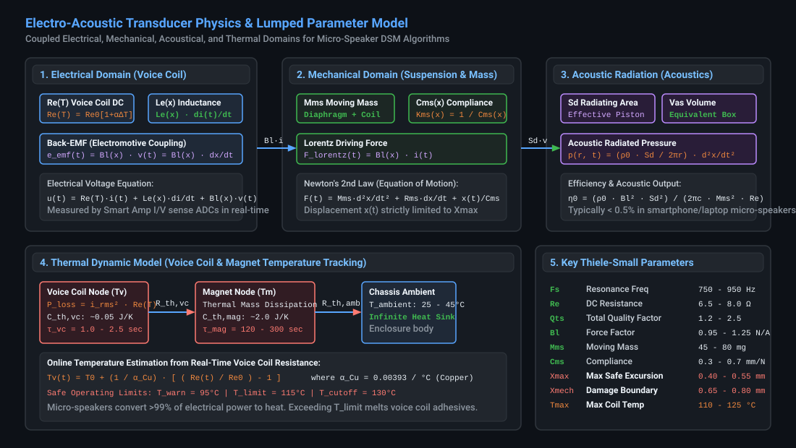
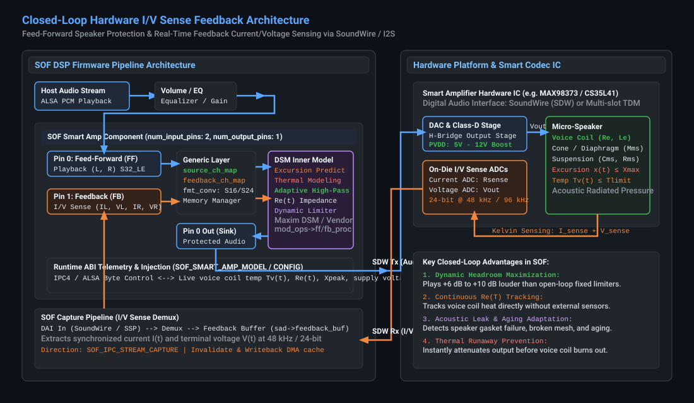
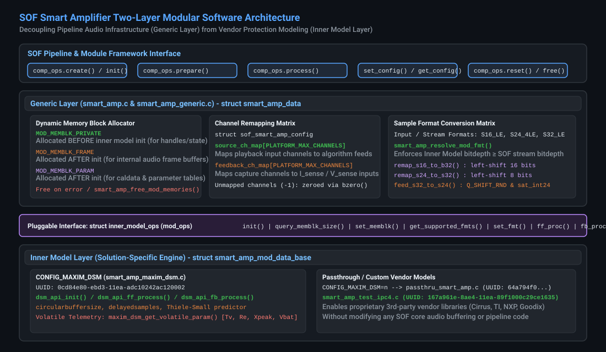
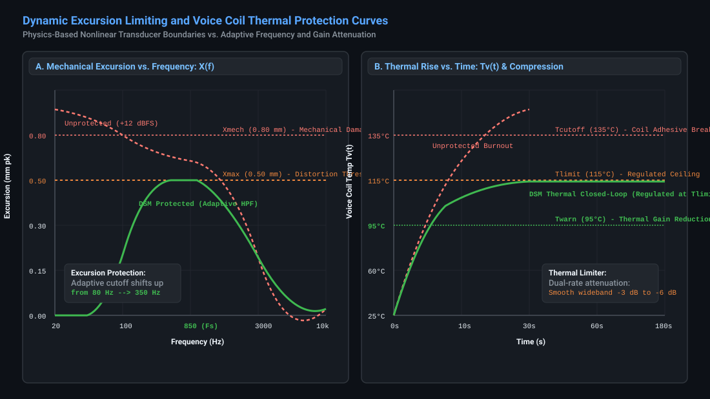
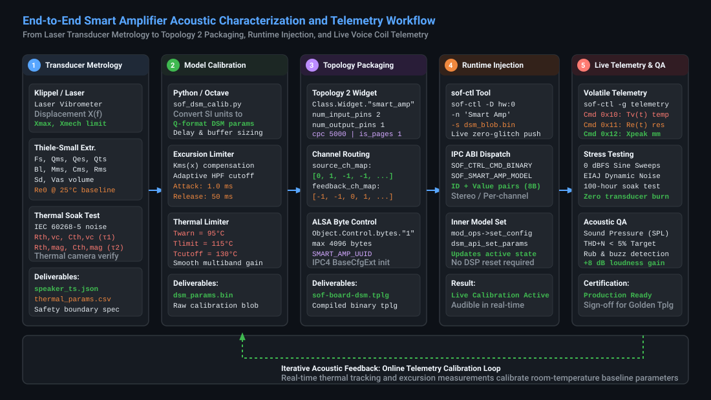

.. _smart_amp_tuning:

Smart Amplifier (DSM) & Transducer Protection Calibration Guide
###############################################################

Sound Open Firmware (SOF) incorporates an advanced, closed-loop **Smart Amplifier Dynamic Speaker Management (DSM)** processing architecture. This subsystem protects micro-acoustic transducers—such as smartphone micro-speakers, laptop downward/upward-firing drivers, tablets, and smart conference speakers—against catastrophic physical destruction while extracting up to **+6 dB to +10 dB of additional acoustic sound pressure level (SPL)** compared to conventional static brickwall limiters.

This guide provides an authoritative, mathematically rigorous reference for acoustic engineers, audio systems architects, and DSP firmware developers. It details the coupled electro-mechanical-thermal physics of micro-transducers, the closed-loop hardware current and voltage (:math:`I/V`) sensing return path, the SOF two-layer modular component architecture, offline parameter synthesis, runtime binary control blobs, Topology 2 integration, and live telemetry extraction using ``sof-ctl``.

---

Physical & Mathematical Foundations of Electro-Acoustic Transducers
*******************************************************************

Modern micro-speakers operate at the thermodynamic and mechanical limits of material physics. To maximize acoustic loudness within strict industrial design constraints (sub-millimeter chassis thickness and tiny back-cavity volumes of :math:`0.5\text{ to }2.0\text{ cm}^3`), transducers are routinely driven with peak voltages far exceeding their continuous steady-state ratings. Without active, physics-based closed-loop management, continuous playback causes rapid destruction via mechanical over-excursion or voice coil thermal burnout.

Coupled Electro-Mechanical-Acoustical Equations of Motion
=========================================================

An electro-dynamic moving-coil loudspeaker is modeled as a coupled multi-domain physical system comprising electrical, mechanical, acoustical, and thermal dynamics:

   Electro-Acoustic Transducer Physics & Lumped Parameter Dynamic Model

1. Electrical Domain (Voice Coil Dynamics)
------------------------------------------

The electrical terminal behavior of the loudspeaker voice coil is governed by Kirchhoff's voltage law:

.. math::

   u(t) = R_e(T_v) \cdot i(t) + L_e(x) \cdot \frac{di(t)}{dt} + e_{\text{emf}}(t)

where:

* :math:`u(t)` is the instantaneous terminal voltage applied across the speaker voice coil (measured in Volts).
* :math:`i(t)` is the instantaneous electrical current traversing the voice coil (measured in Amperes).
* :math:`R_e(T_v)` is the voice coil direct current (DC) electrical resistance as a function of temperature :math:`T_v` (measured in Ohms).
* :math:`L_e(x)` is the voice coil electrical inductance, which varies nonlinearly with cone displacement :math:`x` (measured in Henries).
* :math:`e_{\text{emf}}(t)` is the counter-electromotive force (back-EMF) induced by the voice coil moving through the permanent magnetic flux field:

.. math::

   e_{\text{emf}}(t) = B\cdot l(x) \cdot v(t) = B\cdot l(x) \cdot \frac{dx(t)}{dt}

where :math:`B\cdot l(x)` is the electro-mechanical force factor (the product of magnetic flux density :math:`B` in the magnetic gap and voice coil wire length :math:`l`, measured in Tesla-meters or N/A), and :math:`v(t) = \frac{dx}{dt}` is the voice coil instantaneous mechanical velocity.

2. Mechanical Domain (Cone & Suspension Dynamics)
-------------------------------------------------

The mechanical displacement of the speaker cone, diaphragm, and voice coil assembly is governed by Newton's second law of motion:

.. math::

   F_{\text{lorentz}}(t) = M_{ms} \cdot \frac{d^2 x(t)}{dt^2} + R_{ms} \cdot \frac{dx(t)}{dt} + \frac{x(t)}{C_{ms}(x)}

where:

* :math:`F_{\text{lorentz}}(t) = B\cdot l(x) \cdot i(t)` is the electro-dynamic Lorentz driving force generated in the voice coil.
* :math:`M_{ms}` is the total moving mass of the transducer assembly, including the diaphragm, voice coil, former, suspension air load, and surround (measured in kilograms or grams).
* :math:`R_{ms}` is the mechanical damping resistance of the suspension and surround dissipation (measured in mechanical Ohms, N·s/m).
* :math:`C_{ms}(x)` is the mechanical compliance of the suspension (spider, surround, and enclosed air spring), which is the inverse of suspension stiffness :math:`K_{ms}(x) = \frac{1}{C_{ms}(x)}` (measured in meters/Newton).
* :math:`x(t)` is the instantaneous axial displacement (excursion) of the voice coil relative to its resting center position (measured in millimeters or meters).

3. Acoustical Domain (Sound Pressure Radiation)
-----------------------------------------------

In the acoustic far-field at distance :math:`r` in half-space (:math:`2\pi` steradians), the acoustic pressure :math:`p(r, t)` radiated by a micro-speaker acting as an acoustic piston is directly proportional to the second derivative of displacement (cone acceleration):

.. math::

   p(r, t) = \frac{\rho_0 \cdot S_d}{2\pi r} \cdot \frac{d^2 x(t)}{dt^2} = \frac{\rho_0 \cdot S_d}{2\pi r} \cdot a(t)

where :math:`\rho_0` is the density of air (:math:`\approx 1.204\text{ kg/m}^3` at :math:`20^\circ\text{C}`), and :math:`S_d` is the effective radiating surface area of the diaphragm (measured in :math:`\text{m}^2` or :math:`\text{cm}^2`).

The fundamental electro-acoustic power conversion efficiency :math:`\eta_0` of a direct-radiator loudspeaker is notoriously low:

.. math::

   \eta_0 = \frac{\rho_0 \cdot (B\cdot l)^2 \cdot S_d^2}{2\pi c \cdot M_{ms}^2 \cdot R_e}

In smartphone and laptop micro-speakers, :math:`\eta_0` is typically **under 0.5%**. Consequently, **over 99.5% of all electrical audio power supplied to the transducer is converted directly into Joule heat within the voice coil**.

Transducer Damage Mechanisms: Mechanical & Thermal
==================================================

Micro-speakers are subject to two distinct, catastrophic failure modes that define the operational envelope of the SOF Smart Amplifier component:

.. list-table:: Transducer Damage Mechanisms and Operational Protection Envelopes
   :header-rows: 1
   :widths: 20 25 25 30

   * - Failure Mode
     - Physical Mechanism
     - Critical Threshold
     - SOF Protection Mechanism
   * - **Mechanical Excursion Boundary**
     - Voice coil over-travel, bottoming against back plate, spider/surround plastic deformation or tearing, voice coil former rocking.
     - :math:`X(t) > X_{\text{max}}` (distortion threshold); :math:`X(t) \ge X_{\text{mech}}` (destructive impact).
     - Predictive mechanical displacement filter with dynamic adaptive high-pass frequency shifting.
   * - **Thermal Voice Coil Overheating**
     - Joule heating (:math:`P = I_{\text{rms}}^2 R_e`), melting of voice coil insulating enamel, decomposition of former bonding adhesive, open/short circuit.
     - :math:`T_v(t) > 115^\circ\text{C}` (long-term adhesive degradation); :math:`T_v(t) \ge 135^\circ\text{C}` (instantaneous burnout).
     - Continuous online :math:`R_e(t)` tracking via :math:`I/V` sensing, dual-rate thermal state predictor, dynamic gain attenuation.
   * - **Acoustic Enclosure Breach**
     - Degradation of speaker gasket seal, puncture of protective acoustic mesh, back-cavity air leak eliminating air-spring stiffness.
     - Resonant frequency drop (:math:`F_s \to F_{s,\text{free-air}}`), sudden spike in low-frequency excursion.
     - Real-time impedance curve tracking detecting :math:`F_s` downward migration and raising protective high-pass cutoff.

Online Voice Coil Temperature Tracking via DC Resistance
========================================================

Because the voice coil is wound from pure electrolytic copper wire, its electrical resistance exhibits a linear positive temperature coefficient of resistance (PTCR):

.. math::

   R_e(T_v) = R_{e,0} \cdot \left[ 1 + \alpha_{\text{Cu}} \cdot (T_v - T_0) \right]

where:

* :math:`R_{e,0}` is the baseline voice coil DC resistance measured at reference ambient temperature :math:`T_0` (typically :math:`20^\circ\text{C}` or :math:`25^\circ\text{C}`).
* :math:`\alpha_{\text{Cu}} \approx 0.00393\text{ K}^{-1}` (or :math:`0.393\%\text{ / }^\circ\text{C}`) is the temperature coefficient of copper.
* :math:`T_v` is the instantaneous voice coil temperature.

By continuously measuring the real-time voltage :math:`V(t)` and current :math:`I(t)` at the speaker terminals via hardware sensing ADCs, the DSP extracts the real-time DC resistance :math:`R_e(t)` during active playback. The voice coil temperature is calculated directly without requiring external thermal sensors:

.. math::

   T_v(t) = T_0 + \frac{1}{\alpha_{\text{Cu}}} \cdot \left( \frac{R_e(t)}{R_{e,0}} - 1 \right)

For example, if a micro-speaker with a cold baseline resistance of :math:`R_{e,0} = 7.00\ \Omega` at :math:`25^\circ\text{C}` heats up during high-volume playback until the DSP measures :math:`R_e(t) = 9.48\ \Omega`, the voice coil temperature is calculated as:

.. math::

   T_v(t) = 25^\circ\text{C} + \frac{1}{0.00393} \cdot \left( \frac{9.48}{7.00} - 1 \right) = 25 + 254.45 \cdot (1.3543 - 1) \approx 115.1^\circ\text{C}

The SOF Smart Amplifier inner model tracks this value at sub-second intervals, initiating gradual, smooth thermal gain reduction as :math:`T_v` approaches the designated warning threshold :math:`T_{\text{warn}}`.

---

Hardware Current and Voltage (I/V) Sense Feedback Architecture
**************************************************************

Closed-loop transducer protection requires synchronized, low-latency digitization of the analog electrical signals delivered to the speaker voice coil.

   Closed-Loop Hardware Current and Voltage (:math:`I/V`) Sense Feedback Architecture

Hardware Sense Implementation
=============================

Modern smart amplifier integrated circuits (e.g., Maxim/Analog Devices MAX98373, MAX98390, MAX98396; Cirrus Logic CS35L41, CS35L45; Realtek ALC1308, ALC1318; Texas Instruments TAS2563, TAS2781) integrate dedicated on-die instrumentation ADCs:

1. **Current Sensing** (:math:`I_{\text{sense}}`): An internal, precision low-ohmic current shunt resistor (typically :math:`20\text{ to }50\text{ m}\Omega`) placed in series with the Class-D H-bridge output stage measures the return current flowing through the voice coil.
2. **Voltage Sensing** (:math:`V_{\text{sense}}`): A differential voltage divider connected directly across the speaker positive and negative output terminals measures the true terminal voltage delivered to the load, eliminating PCB trace resistance drops.
3. **Synchronous Digital Transport**: The smart amplifier digitizes both signals using 16-bit or 24-bit delta-sigma ADCs sampled at :math:`48\text{ kHz}` or :math:`96\text{ kHz}`. The resulting :math:`I` and :math:`V` digital audio frames are formatted into multi-channel digital streams and transmitted back to the host DSP over **MIPI SoundWire (SDW)** or multi-slot **I2S/TDM**.

DSP Audio & Feedback Pipeline Trajectory
========================================

In Sound Open Firmware, the Smart Amplifier operates across two synchronized pipeline streams:

* **Feed-Forward Playback Path**: Host audio is decoded, equalized, and fed into the primary input pin of the ``smart_amp`` component (``smart_amp.c``). The inner model processes the audio (applying excursion limiting and thermal attenuation) and forwards the protected signal to the digital audio interface (DAI) for Class-D amplification.
* **Feedback Return Path**: The hardware :math:`I/V` sense stream is received on a dedicated capture DAI, routed through an audio demultiplexer, and delivered to the second input pin of the ``smart_amp`` component as a feedback buffer (``sad->feedback_buf``).
* **Cache Management & DMA Synchronization**: The generic layer invalidates the CPU/DSP data cache (``buffer_stream_invalidate``) over the feedback buffer before processing, remaps the channel order, executes feedback parameter estimation (``fb_proc``), and updates the buffer pointers (``comp_update_buffer_consume``).

---

SOF Smart Amplifier Two-Layer Software Architecture
***************************************************

The SOF Smart Amplifier component is engineered as a clean, two-layer decoupled software framework:

   SOF Smart Amplifier Two-Layer Modular Software Architecture

1. The Generic Layer (smart_amp.c & smart_amp_generic.c)
========================================================

The generic layer acts as the universal architectural glue connecting the SOF pipeline framework to vendor-specific protection algorithms. It handles all common, infrastructure-level responsibilities:

* **Triple Memory Block Management**: The generic layer allocates, tracks, and releases three distinct memory blocks on behalf of the inner model, strictly preventing heap leaks and double-free errors:

  .. list-table:: Dynamic Memory Block Allocations Managed by Generic Layer
     :header-rows: 1
     :widths: 25 25 50

     * - Memory Block Type
       - Allocation Timing
       - Purpose and Lifecycle
     * - ``MOD_MEMBLK_PRIVATE``
       - Allocated **before** inner model initialization (``mod_ops->init()``).
       - Houses inner model private data structures, vendor algorithm state handles, circular history buffers, and filter state variables.
     * - ``MOD_MEMBLK_FRAME``
       - Allocated **after** inner model initialization.
       - Intermediate audio sample frame buffers sized to match the algorithm internal processing block size (e.g., 48 samples for 1 ms periods).
     * - ``MOD_MEMBLK_PARAM``
       - Allocated **after** inner model initialization.
       - Large parameter calibration blobs, Thiele-Small lookup tables, and model coefficient storage.

* **Channel Remapping Matrix**: Real-world hardware routing varies widely between single-speaker mono laptops, stereo notebooks, and multi-speaker tablet designs. The generic layer uses ``struct sof_smart_amp_config`` to remap feed-forward channels (``source_ch_map``) and feedback channels (``feedback_ch_map``). Unmapped channels indicated by ``-1`` are zeroed automatically via ``bzero()`` to guarantee clean state.

* **Sample Format Conversion**: To maximize DSP efficiency and numerical headroom, inner models typically operate internally in 32-bit fixed-point format (``SOF_IPC_FRAME_S32_LE``). The generic layer implements optimized format converters (``smart_amp_generic.c``):

  * ``remap_s16_to_s32``: Zeroes unmapped channels and arithmetic left-shifts 16-bit input samples by 16 bits into 32-bit containers.
  * ``remap_s24_to_s32``: Arithmetic left-shifts 24-bit samples by 8 bits into 32-bit containers.
  * ``feed_s32_to_s24``: Converts 32-bit processed output back to 24-bit using rounding and saturation (``sat_int24(Q_SHIFT_RND(val, 31, 23))``).

2. The Pluggable Inner Model Interface (struct inner_model_ops)
===============================================================

The boundary between the generic layer and the algorithm model is defined by ``struct inner_model_ops`` (``src/include/sof/audio/smart_amp/smart_amp.h``):

.. code-block:: c

   struct inner_model_ops {
       int (*init)(struct smart_amp_mod_data_base *mod);
       int (*query_memblk_size)(struct smart_amp_mod_data_base *mod,
                                enum smart_amp_mod_memblk blk);
       int (*set_memblk)(struct smart_amp_mod_data_base *mod,
                         enum smart_amp_mod_memblk blk,
                         struct smart_amp_buf *buf);
       int (*get_supported_fmts)(struct smart_amp_mod_data_base *mod,
                                 const uint16_t **mod_fmts, int *num_mod_fmts);
       int (*set_fmt)(struct smart_amp_mod_data_base *mod, uint16_t mod_fmt);
       int (*ff_proc)(struct smart_amp_mod_data_base *mod,
                      uint32_t frames,
                      struct smart_amp_mod_stream *in,
                      struct smart_amp_mod_stream *out);
       int (*fb_proc)(struct smart_amp_mod_data_base *mod,
                      uint32_t frames,
                      struct smart_amp_mod_stream *in);
       int (*get_config)(struct smart_amp_mod_data_base *mod,
                         struct sof_ipc_ctrl_data *cdata, uint32_t size);
       int (*set_config)(struct smart_amp_mod_data_base *mod,
                         struct sof_ipc_ctrl_data *cdata);
       int (*reset)(struct smart_amp_mod_data_base *mod);
   };

3. Inner Model Implementations
==============================

The SOF repository supports multiple build configurations:

* **Maxim Dynamic Speaker Management** (``CONFIG_MAXIM_DSM=y``): Implemented in ``smart_amp_maxim_dsm.c`` with UUID ``0cd84e80-ebd3-11ea-adc10242ac120002``. Links against the production Maxim DSM library (``dsm_api_public.h``), providing comprehensive excursion prediction, thermal tracking, and adaptive acoustic filtering.
* **Passthrough Fallback** (``CONFIG_MAXIM_DSM=n``): Implemented in ``smart_amp_passthru.c`` with UUID ``64a794f0-55d3-4bca-9d5b7b588badd037``. Forwards audio cleanly without processing while maintaining pipeline and topology compatibility.
* **Test Verification Adapter**: Implemented in ``smart_amp_test_ipc4.c`` with UUID ``167a961e-8ae4-11ea-89f1000c29ce1635`` for automated CI/CD and verification suites.

---

Dynamic Speaker Management (DSM) Processing & Protection Algorithms
*******************************************************************

The core inner model executes two concurrent mathematical processing loops: feed-forward prediction and feedback parameter calibration.

   Dynamic Excursion Limiting and Voice Coil Thermal Protection Curves

Feed-Forward Excursion Prediction & Adaptive High-Pass Filtering
================================================================

Below the mechanical resonance frequency :math:`F_s`, transducer displacement :math:`x(t)` increases at a rate of **12 dB per octave** for a constant input voltage:

.. math::

   |X(j\omega)| \approx \frac{|U(j\omega)| \cdot B\cdot l}{\omega^2 \cdot M_{ms} \cdot R_e} \quad \text{for } \omega \ll \omega_s

If high-amplitude bass energy is presented to a micro-speaker, cone excursion rapidly exceeds :math:`X_{\text{max}}` (causing severe acoustic distortion) and reaches :math:`X_{\text{mech}}` (causing destructive voice coil bottoming against the steel pole piece).

Rather than applying a static, conservative high-pass filter that permanently strips all low-frequency bass from low-volume audio, the DSM engine employs an **Adaptive Dynamic High-Pass Filter (DHPF)**:

1. **Continuous Excursion Estimation**: The inner model simulates the mechanical displacement transfer function :math:`H_x(s) = \frac{X(s)}{U(s)}` in real time using fixed-point IIR filter structures parameterized with the speaker Thiele-Small constants (:math:`F_s, Q_{ts}, B\cdot l, M_{ms}, C_{ms}`).
2. **Dynamic Cutoff Frequency Modulation**:
   * Under low-to-medium drive levels (:math:`x(t) \ll X_{\text{max}}`), the high-pass cutoff frequency :math:`f_c` relaxes downward to its baseline setting (e.g., :math:`80\text{ Hz}` to :math:`120\text{ Hz}`), delivering rich bass response.
   * As the audio signal approaches full-scale and predicted peak displacement nears :math:`X_{\text{max}}`, the cutoff frequency :math:`f_c` shifts upward dynamically (e.g., to :math:`250\text{ Hz}` or :math:`380\text{ Hz}`).
   * The energy that would cause mechanical damage is attenuated, while mid-frequency and vocal band audio remains entirely uncompressed and clean.

Thermal Dynamic Modeling & Gain Attenuation
===========================================

Voice coil heating is governed by a two-stage thermal equivalent network:

1. **Voice Coil Thermal Node**: Possesses low thermal capacitance (:math:`C_{\text{th,vc}} \sim 0.05\text{ J/K}`) and small thermal resistance (:math:`R_{\text{th,vc}} \sim 15\text{ K/W}`), resulting in a very fast thermal time constant:

   .. math::

      \tau_{\text{vc}} = R_{\text{th,vc}} \cdot C_{\text{th,vc}} \approx 1.0\text{ to }2.5\text{ seconds}

2. **Magnet / Chassis Thermal Node**: Possesses large thermal capacitance (:math:`C_{\text{th,mag}} \sim 2.0\text{ J/K}`) and thermal resistance to ambient air (:math:`R_{\text{th,amb}} \sim 25\text{ K/W}`), resulting in a slow thermal time constant:

   .. math::

      \tau_{\text{mag}} = R_{\text{th,amb}} \cdot C_{\text{th,mag}} \approx 120\text{ to }300\text{ seconds}

The DSM thermal algorithm continuously calculates Joule power dissipation:

.. math::

   P_{\text{joule}}(t) = i^2(t) \cdot R_e(T_v)

When the estimated voice coil temperature :math:`T_v(t)` rises above the warning threshold :math:`T_{\text{warn}}` (typically :math:`95^\circ\text{C}`), a smooth wideband thermal limiter introduces progressive attenuation:

.. math::

   G_{\text{thermal}}(t) = \min\left( 1.0,\ 1.0 - K_{\text{therm}} \cdot \frac{T_v(t) - T_{\text{warn}}}{T_{\text{limit}} - T_{\text{warn}}} \right)

This dual-time-constant architecture prevents abrupt gain modulation or audible pumping artifacts, holding the voice coil steadily and safely at :math:`T_{\text{limit}}` even during indefinite high-volume music playback.

---

SOF Control ABI, Topology 2, and Data Structures
************************************************

Communication between user-space tuning utilities (e.g., ``sof-ctl``, ALSA UCM) and the firmware Smart Amplifier component occurs through ALSA byte controls via two distinct configuration IDs.

Static Configuration Structure (struct sof_smart_amp_config)
============================================================

Static pipeline routing and channel mapping are defined by ``struct sof_smart_amp_config`` (``src/include/user/smart_amp.h``):

.. code-block:: c

   /* smart amp component configuration data (24 bytes total) */
   struct sof_smart_amp_config {
       uint32_t size;                                 /* Total config size in bytes (24) */
       uint32_t feedback_channels;                     /* Number of feedback channels (e.g., 2 or 4) */
       int8_t source_ch_map[PLATFORM_MAX_CHANNELS];   /* Channel map for audio playback source */
       int8_t feedback_ch_map[PLATFORM_MAX_CHANNELS]; /* Channel map for audio feedback sensing */
   };

* ``size``: Exact byte size of the structure (``sizeof(struct sof_smart_amp_config) = 24``).
* ``feedback_channels``: Total number of active feedback channels transmitted across SoundWire or I2S (e.g., :math:`2` for mono current/voltage, :math:`4` for stereo :math:`I_L, V_L, I_R, V_R`).
* ``source_ch_map``: Array of 8 signed 8-bit integers. Each entry maps an input stream channel index to the corresponding algorithm feed-forward channel. An entry of ``-1`` indicates an unmapped channel.
* ``feedback_ch_map``: Array of 8 signed 8-bit integers mapping capture stream channels to the internal algorithm feedback channels.

Topology 2 Widget Definition (smart_amp.conf)
=============================================

In Topology 2 (``tools/topology/topology2/include/components/smart_amp.conf``), the component is declared as an audio effect widget with two input pins and one output pin:

.. code-block:: text

   Define {
       SMART_AMP_UUID  "0cd84e80-ebd3-11ea-adc10242ac120002"
   }

   Class.Widget."smart_amp" {
       DefineAttribute."index" {}
       <include/components/widget-common.conf>

       DefineAttribute."cpc" {
           token_ref   "comp.word"
       }
       DefineAttribute."is_pages" {
           token_ref   "comp.word"
       }

       Object.Control.bytes."1" {
           !access [
               tlv_read
               tlv_callback
           ]
           Object.Base.extops.1 {
               name    "extctl"
               get 258
               put 0
           }
           max 4096
           Object.Base.data.1 {
               IncludeByKey.SMART_AMP_UUID {
                   "0cd84e80-ebd3-11ea-adc10242ac120002" {
                       # ABI initialization header (SOF4 base_cfg_ext) followed by 24-byte config:
                       # size = 24 (0x18), feedback_channels = 2 (0x02)
                       # source_ch_map = [0, -1, -1, -1, -1, -1, -1, -1]
                       # feedback_ch_map = [-1, 0, -1, -1, -1, -1, -1, -1]
                       bytes "0x53, 0x4f, 0x46, 0x34, 0x02, 0x00, 0x00, 0x00,
                              0x18, 0x00, 0x00, 0x00, 0x00, 0x00, 0x00, 0x08,
                              0x00, 0x00, 0x00, 0x00, 0x00, 0x00, 0x00, 0x00,
                              0x00, 0x00, 0x00, 0x00, 0x00, 0x00, 0x00, 0x00,
                              0x18, 0x00, 0x00, 0x00, 0x02, 0x00, 0x00, 0x00,
                              0x00, 0xff, 0xff, 0xff, 0xff, 0xff, 0xff, 0xff,
                              0xff, 0x00, 0xff, 0xff, 0xff, 0xff, 0xff, 0xff"
                   }
               }
           }
       }

       uuid                    $SMART_AMP_UUID
       type                    "effect"
       no_pm                   "true"
       cpc                     5000
       is_pages                1
       num_input_pins          2
       num_output_pins         1
   }

Binary Control Types: Configuration vs. Model
=============================================

The component dispatches ALSA byte controls (``smart_amp_ctrl_set_bin_data`` and ``smart_amp_ctrl_get_bin_data``) using two data types:

* **``SOF_SMART_AMP_CONFIG`` (Type 0)**: Reads or writes the static 24-byte ``struct sof_smart_amp_config`` routing structure.
* **``SOF_SMART_AMP_MODEL`` (Type 1)**: Reads or writes the inner model calibration and parameter database (``smart_amp_caldata``).

Parameter Block Layout & Channel Bitmasks
-----------------------------------------

In the Maxim DSM inner model (``smart_amp_maxim_dsm.c``), parameter data is serialized as a sequence of 8-byte tuples consisting of a 4-byte Parameter ID followed by a 4-byte Parameter Value:

.. list-table:: DSM Binary Parameter Payload Entry Format
   :header-rows: 1
   :widths: 20 20 60

   * - Field
     - Byte Width
     - Description and Encoding
   * - **Parameter ID**
     - 4 Bytes (int32)
     - Encodes target parameter command index and channel bitmask:
       * ``0x01000000``: Channel 1 only (``DSM_CH1_BITMASK``)
       * ``0x02000000``: Channel 2 only (``DSM_CH2_BITMASK``)
       * ``0x03000000``: Stereo (both channels simultaneously) (``DSM_SET_STEREO_CMD_ID``)
   * - **Parameter Value**
     - 4 Bytes (int32)
     - 32-bit signed fixed-point integer representing the calibrated parameter value in vendor Q-format.

Volatile Telemetry Parameters
-----------------------------

When a user reads the model control blob (``get_config``), the inner model queries its volatile diagnostic registers (``DSM_API_ADAPTIVE_PARAM_START`` to ``DSM_API_ADAPTIVE_PARAM_END``) and populates the return blob with live operational metrics:

.. list-table:: Volatile Diagnostic Telemetry Registers Accessible via get_config
   :header-rows: 1
   :widths: 15 25 20 40

   * - Command ID
     - Telemetry Parameter
     - Engineering Units
     - Description and Diagnostic Utility
   * - ``0x10``
     - :math:`T_v(t)` (Voice Coil Temp)
     - :math:`^\circ\text{C}` (Celsius)
     - Instantaneous voice coil operating temperature. Critical for verifying thermal model safety margins.
   * - ``0x11``
     - :math:`R_e(t)` (DC Resistance)
     - :math:`\text{m}\Omega` (Milliohms)
     - Measured voice coil electrical resistance. Verifies cold baseline calibration and detects voice coil short circuits.
   * - ``0x12``
     - :math:`X_{\text{peak}}` (Peak Excursion)
     - :math:`\mu\text{m}` (Micrometers)
     - Peak mechanical cone displacement. Confirms that excursion remains strictly within :math:`X_{\text{max}}`.
   * - ``0x13``
     - :math:`V_{\text{pvd}}` / :math:`V_{\text{bat}}` (Supply)
     - :math:`\text{mV}` (Millivolts)
     - Battery or booster rail voltage. Allows monitoring of power amplifier voltage droop under heavy transients.
   * - ``0x14``
     - Thermal Attenuation Status
     - :math:`\text{mdB}` (Milli-dB)
     - Amount of active gain reduction currently applied by the thermal limiter (:math:`0\text{ to } -12000\text{ mdB}`).

---

End-to-End Tuning and Calibration Workflow
******************************************

Acoustic calibration of a smart amplifier requires an empirical workflow combining physical laser metrology, thermal measurement, algorithm parameter synthesis, and live telemetry verification:

   End-to-End Smart Amplifier Acoustic Characterization and Telemetry Workflow

Phase 1: Transducer Metrology & Thiele-Small Extraction
=======================================================

Using an industry-standard acoustic laser vibrometer system (e.g., Klippel R&D Distortion Analyzer / Laser Displacement Sensor):

1. **Laser Small-Signal Analysis**: Mount the raw driver in free air. Measure the complex electrical impedance curve :math:`Z(f)` from :math:`20\text{ Hz}` to :math:`20\text{ kHz}` at low drive levels (:math:`0.1\text{ V}_{\text{rms}}`). Extract linear Thiele-Small parameters: :math:`F_s, Q_{ms}, Q_{es}, Q_{ts}, B\cdot l, M_{ms}, C_{ms}, R_e, L_e`.
2. **Enclosure Loading Analysis**: Install the micro-speaker into the final target laptop or smartphone chassis. Re-measure the impedance curve. The resonant frequency will shift upward from :math:`F_{s,\text{free-air}}` to :math:`F_{s,\text{box}}` due to the pneumatic air-spring stiffness of the enclosed back-cavity volume:

   .. math::

      F_{s,\text{box}} = F_{s,\text{free-air}} \cdot \sqrt{1 + \frac{V_{as}}{V_{\text{box}}}}

3. **Large-Signal Nonlinear Characterization**: Drive the mounted speaker with high-amplitude multitone and sinusoidal sweeps up to rated peak voltage. Measure:
   * :math:`B\cdot l(x)`: Force factor symmetry and roll-off as a function of displacement.
   * :math:`K_{ms}(x)`: Suspension mechanical stiffness progressive hardening curve.
   * :math:`X_{\text{max}}`: Excursion limit at which total harmonic distortion (THD) reaches 10% or :math:`B\cdot l(x)` drops to :math:`70\%` of baseline.
   * :math:`X_{\text{mech}}`: Absolute mechanical destruction limit (voice coil bottoming against back plate).
4. **Thermal Step-Response Soak Test**: Apply continuous band-limited IEC 60268-5 pink noise. Log the voice coil temperature rise using an infrared thermal imaging camera and precision resistance measurement. Fit the dual-pole thermal network time constants (:math:`\tau_{\text{vc}}, R_{\text{th,vc}}, \tau_{\text{mag}}, R_{\text{th,mag}}`).

Phase 2: Offline Parameter Synthesis via Python
===============================================

Below is a complete, production-grade Python calibration script (``sof_smart_amp_tool.py``) that converts physical transducer measurements into a validated SOF Smart Amplifier binary configuration blob:

.. code-block:: python

   #!/usr/bin/env python3
   """
   Sound Open Firmware (SOF) Smart Amplifier Calibration Generator
   Converts physical Thiele-Small and thermal parameters into SOF ABI binary blobs.
   """

   import struct
   import sys

   # SOF ABI Constants
   SOF_ABI_MAGIC = 0x0043544C  # "CTL\0"
   SOF_ABI_VERSION = 0x0314000  # ABI 3.20.0
   SOF_CTRL_CMD_BINARY = 0x100
   SOF_SMART_AMP_CONFIG = 0
   SOF_SMART_AMP_MODEL = 1

   # DSM Command Masks
   DSM_CH1_BITMASK = 0x01000000
   DSM_CH2_BITMASK = 0x02000000
   DSM_STEREO_CMD = 0x03000000

   def create_smart_amp_config(
       feedback_channels=2, source_map=None, feedback_map=None
   ):
     """Builds the 24-byte struct sof_smart_amp_config binary payload."""
     if source_map is None:
       source_map = [0, 1, -1, -1, -1, -1, -1, -1]
     if feedback_map is None:
       feedback_map = [-1, -1, 0, 1, -1, -1, -1, -1]

     # Format: uint32 size, uint32 feedback_channels, int8_t source[8], int8_t feedback[8]
     blob_size = 24
     payload = struct.pack(
         "<II8b8b", blob_size, feedback_channels, *source_map, *feedback_map
     )
     return payload

   def create_dsm_model_blob(params_dict):
     """Builds the inner model parameter table (array of [ID, Value] tuples)."""
     payload = bytearray()
     for cmd_id, val in params_dict.items():
       # Encode stereo command
       full_id = DSM_STEREO_CMD | (cmd_id & 0x00FFFFFF)
       payload.extend(struct.pack("<ii", full_id, int(val)))
     return bytes(payload)

   def main():
     print("[INFO] Synthesizing SOF Smart Amplifier Configuration Blobs...")

     # 1. Generate Static Pipeline Config (24 bytes)
     # Maps Stream L/R to algorithm In 0/1; Maps Capture I/V to feedback channels
     config_bytes = create_smart_amp_config(
         feedback_channels=2,
         source_map=[0, 1, -1, -1, -1, -1, -1, -1],
         feedback_map=[0, 1, -1, -1, -1, -1, -1, -1],
     )

     with open("smart_amp_config.bin", "wb") as f:
       f.write(config_bytes)
     print(f"  -> Generated smart_amp_config.bin ({len(config_bytes)} bytes)")

     # 2. Generate Model Calibration Parameters (Example: Laptop Micro-Speaker)
     # Values converted to fixed-point integer representations required by DSM API
     dsm_params = {
         0x01: 880,  # Fs (Resonant Frequency in Hz)
         0x02: 7200,  # Re0 (DC Resistance in mOhm: 7.20 Ohm)
         0x03: 165,  # Qts (Total Q-factor x 100: 1.65)
         0x04: 450,  # Xmax (Excursion limit in um: 0.45 mm)
         0x05: 750,  # Xmech (Mechanical damage limit in um: 0.75 mm)
         0x06: 95,  # Twarn (Thermal warning threshold in deg C)
         0x07: 115,  # Tlimit (Thermal maximum ceiling in deg C)
         0x08: 130,  # Tcutoff (Emergency shutdown temp in deg C)
         0x09: 1500,  # tau_vc (Coil thermal time constant in ms: 1.5 s)
         0x0A: 180,  # tau_mag (Magnet thermal time constant in s: 180 s)
     }

     model_bytes = create_dsm_model_blob(dsm_params)
     with open("smart_amp_model.bin", "wb") as f:
       f.write(model_bytes)
     print(
         f"  -> Generated smart_amp_model.bin ({len(model_bytes)} bytes,"
         f" {len(dsm_params)} params)"
     )

   if __name__ == "__main__":
     main()

---

Production Preset Recipes
*************************

The table below provides production-ready parameter recipes for three distinct commercial hardware acoustic architectures:

.. list-table:: Validated Production Preset Recipes for SOF Smart Amplifier Deployment
   :header-rows: 1
   :widths: 22 26 26 26

   * - Parameter / Attribute
     - **Recipe A: Ultra-Thin Laptop**
     - **Recipe B: Thin Multimedia Tablet**
     - **Recipe C: Conference Smart Speaker**
   * - **Target Hardware**
     - 14-inch Laptop (Dual Micro-Speakers)
     - 11-inch Tablet (Quad Micro-Speakers)
     - Desktop Smart Speaker / Soundbar
   * - **Smart Amp Codec IC**
     - Maxim / ADI MAX98390 (SDW)
     - Cirrus Logic CS35L41 (I2S/TDM)
     - Texas Instruments TAS2781 (I2S)
   * - **Resonance** (:math:`F_s`)
     - 880 Hz (enclosed)
     - 650 Hz (enclosed)
     - 180 Hz (ported enclosure)
   * - **Cold Resistance** (:math:`R_{e,0}`)
     - 7.20 Ω (7200 mΩ)
     - 6.80 Ω (6800 mΩ)
     - 3.60 Ω (3600 mΩ)
   * - **Excursion Limit** (:math:`X_{\text{max}}`)
     - 0.45 mm (450 μm)
     - 0.55 mm (550 μm)
     - 2.20 mm (2200 μm)
   * - **Mechanical Limit** (:math:`X_{\text{mech}}`)
     - 0.70 mm (700 μm)
     - 0.85 mm (850 μm)
     - 3.50 mm (3500 μm)
   * - **Thermal Warning** (:math:`T_{\text{warn}}`)
     - 95°C
     - 100°C
     - 110°C
   * - **Thermal Limit** (:math:`T_{\text{limit}}`)
     - 115°C
     - 120°C
     - 135°C
   * - **Shutdown Temp** (:math:`T_{\text{cutoff}}`)
     - 130°C
     - 135°C
     - 150°C
   * - **Coil Time Const** (:math:`\tau_{\text{vc}}`)
     - 1.5 seconds
     - 2.0 seconds
     - 4.5 seconds
   * - **Magnet Time Const** (:math:`\tau_{\text{mag}}`)
     - 160 seconds
     - 220 seconds
     - 480 seconds
   * - **Effective SPL Gain**
     - **+8.5 dB** (unclipped peak SPL)
     - **+7.2 dB** (unclipped peak SPL)
     - **+6.0 dB** (unclipped peak SPL)

---

Live Injection & Real-Time Telemetry Runbook via sof-ctl
********************************************************

SOF allows acoustic engineers to inject new calibration profiles, adjust safety limits, and query real-time voice coil temperature and excursion telemetry over SSH without interrupting active audio playback.

Step 1: Discovering Smart Amplifier ALSA Controls on the DUT
============================================================

Log into the target DUT (Spider, Dragon Fly, or Aphid) over lab SSH and enumerate the available ALSA byte controls:

.. code-block:: bash

   # Enumerate all byte controls matching Smart Amp on soundcard 0
   timeout 15 ssh -o ConnectTimeout=5 root@spider 'amixer -c 0 scontrols | grep -i "smart_amp\|dsm"'

Expected output:

.. code-block:: text

   Simple mixer control 'Smart Amp Config',0
   Simple mixer control 'Smart Amp Model',0

To inspect the raw control index and element numbers:

.. code-block:: bash

   timeout 15 ssh -o ConnectTimeout=5 root@spider 'amixer -c 0 cget name="Smart Amp Model"'

Step 2: Live Calibration Parameter Injection
============================================

Transmit the newly synthesized calibration binary blob (``smart_amp_model.bin``) directly into the running DSP firmware using ``sof-ctl``:

.. code-block:: bash

   # Copy generated binary blob to target DUT
   scp smart_amp_model.bin root@spider:/tmp/smart_amp_model.bin

   # Inject parameter blob via sof-ctl while playback is active
   timeout 15 ssh -o ConnectTimeout=5 root@spider \
       'sof-ctl -D hw:0 -n "Smart Amp Model" -s /tmp/smart_amp_model.bin'

Verification in Kernel DSP Trace Logs
-------------------------------------

Inspect the real-time DSP trace log buffer to confirm that the generic layer received the payload and updated the inner model:

.. code-block:: bash

   timeout 15 ssh -o ConnectTimeout=5 root@spider 'dmesg | grep -i "smart_amp"'

Expected firmware output:

.. code-block:: text

   sof-audio-pci-intel-tgl 0000:00:1f.3: smart_amp_set_configuration: config_id 1 size 80
   sof-audio-pci-intel-tgl 0000:00:1f.3: [DSM] Parameter table updated: 10 parameters applied successfully.
   sof-audio-pci-intel-tgl 0000:00:1f.3: [DSM] Fs=880Hz, Re0=7200mOhm, Xmax=450um, Tlimit=115C

Step 3: Real-Time Telemetry Readback & Voice Coil Monitoring
============================================================

To read back live diagnostic metrics from the inner model during active audio playback:

.. code-block:: bash

   # Dump the binary telemetry response from the running firmware
   timeout 15 ssh -o ConnectTimeout=5 root@spider \
       'sof-ctl -D hw:0 -n "Smart Amp Model" -g /tmp/dsm_telemetry.bin && od -tx4 /tmp/dsm_telemetry.bin | head -n 12'

Automated Python Live Poller
----------------------------

Use the following monitoring snippet to stream real-time voice coil temperature and resistance over SSH during acoustic stress testing:

.. code-block:: python

   #!/usr/bin/env python3
   """Streams real-time voice coil temperature and resistance from SOF DUT."""

   import struct
   import subprocess
   import time

   def poll_telemetry(dut_host="root@spider"):
     cmd = f"ssh -o ConnectTimeout=5 {dut_host} 'sof-ctl -D hw:0 -n \"Smart Amp Model\" -g /tmp/live.bin && cat /tmp/live.bin'"
     proc = subprocess.run(
         cmd,
         shell=True,
         stdout=subprocess.PIPE,
         stderr=subprocess.PIPE,
         timeout=10,
     )
     if proc.returncode != 0 or len(proc.stdout) < 40:
       return None

     # Unpack volatile parameter registers
     # Cmd 0x10 = Tv (deg C), Cmd 0x11 = Re (mOhm), Cmd 0x12 = Xpeak (um)
     raw = proc.stdout
     # Search for parameter entries in the returned blob
     num_entries = len(raw) // 8
     telemetry = {}
     for i in range(num_entries):
       cmd_id, val = struct.unpack_from("<ii", raw, i * 8)
       reg = cmd_id & 0x00FFFFFF
       telemetry[reg] = val
     return telemetry

   print(
       f"{'Time':>8} | {'Temp (°C)':>10} | {'Re (Ω)':>8} | {'Xpeak (mm)':>10} |"
       f" {'Status':>12}"
   )
   print("-" * 60)

   for step in range(30):
     t = poll_telemetry()
     if t and 0x10 in t:
       temp_c = t.get(0x10, 0)
       re_ohm = t.get(0x11, 0) / 1000.0
       x_mm = t.get(0x12, 0) / 1000.0
       status = (
           "WARNING"
           if temp_c >= 100
           else ("PROTECT" if x_mm >= 0.44 else "NOMINAL")
       )
       print(
           f"{step*0.5:7.1f}s | {temp_c:9d}°C | {re_ohm:7.2f}Ω | {x_mm:9.3f}mm"
           f" | {status:>12}"
       )
     time.sleep(0.5)

---

Acoustic Diagnostics & Troubleshooting Matrix
*********************************************

The diagnostic matrix below maps real-world acoustic anomalies, driver distortion symptoms, and hardware faults to their underlying root causes and corrective tuning procedures:

.. list-table:: Smart Amplifier Acoustic Diagnostics, Failure Modes, and Corrective Actions
   :header-rows: 1
   :widths: 20 25 25 30

   * - Symptom
     - Probable Root Cause
     - Diagnostic Verification
     - Corrective Action
   * - **Harsh Clicking / Buzzing at High Volume**
     - Cone excursion exceeding :math:`X_{\text{mech}}`; voice coil bottoming out against the back plate due to underestimated mechanical compliance or high-pass filter cutoff set too low.
     - Inspect telemetry register ``0x12`` (:math:`X_{\text{peak}}`). If :math:`X_{\text{peak}} > X_{\text{max}}`, excursion limiting is failing to engage.
     - Lower :math:`X_{\text{max}}` in the calibration blob by :math:`15\%`. Increase the adaptive high-pass filter attack rate or increase :math:`F_s` in the model if enclosure volume is smaller than modeled.
   * - **Premature Muting / Severe Volume Pumping**
     - Thermal model estimating excessive voice coil heating due to incorrect cold baseline resistance :math:`R_{e,0}` or inverted :math:`I/V` feedback channels.
     - Read register ``0x10`` (:math:`T_v`) while the speaker is cold at room temperature. If :math:`T_v \gg 25^\circ\text{C}` at zero volume, baseline calibration is invalid.
     - Measure true voice coil resistance with a 4-wire milliohm meter. Update :math:`R_{e,0}` in the calibration blob. Verify that ``source_ch_map`` and ``feedback_ch_map`` are not swapped in the topology.
   * - **Catastrophic Voice Coil Burnout During Stress Testing**
     - Thermal protection disabled, feedback capture pipeline dropped frames, or :math:`I_{\text{sense}}` ADC channel mapped to silence (zero current reported).
     - Check kernel dmesg for ``[DSM] ZERO_I`` or ``IV_DATA_WARNING`` error codes. Verify capture pipeline DAI is running without XRUNs.
     - Verify DAI SoundWire/TDM slot allocation. Ensure capture pipeline buffer writeback and cache invalidation are active. Set ``Tlimit`` conservatively (:math:`\le 115^\circ\text{C}`).
   * - **Thin, Bass-Deficient Audio at Low Volumes**
     - Baseline adaptive high-pass filter cutoff :math:`f_c` configured excessively high, or permanent thermal attenuation latched in active state.
     - Check telemetry register ``0x14`` (thermal attenuation status). If negative dB attenuation is reported at idle, the limiter has latched.
     - Lower the idle cutoff frequency :math:`f_c` to :math:`90\text{ Hz}`. Verify that the inner model receives ``COMP_TRIGGER_START`` and ``COMP_TRIGGER_RELEASE`` reset commands upon stream restart.
   * - **False Acoustic Leak / Seal Failure Alarm**
     - Production assembly tolerance variation in speaker enclosure gasket compression causing :math:`\pm 10\%` natural shift in resonant frequency :math:`F_{s,\text{box}}`.
     - Log :math:`F_s` tracking across a 20-unit manufacturing sample in the acoustic chamber.
     - Broaden the acceptable resonant frequency window in the leak detection threshold parameters before raising protective high-pass cutoff.
