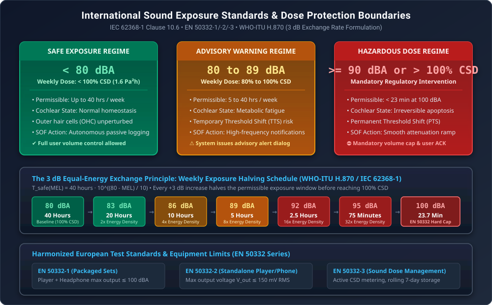
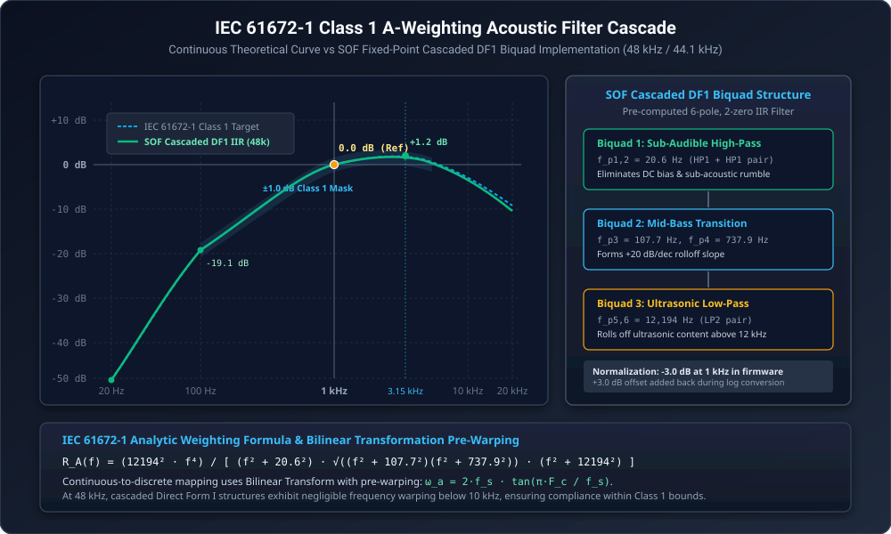
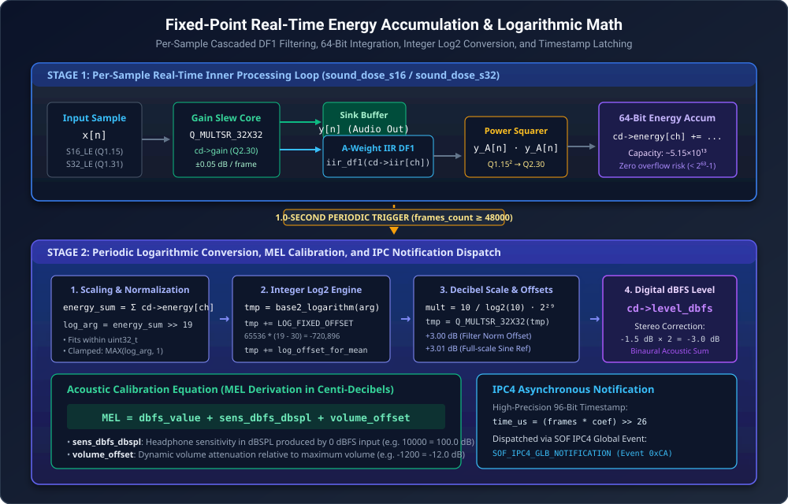
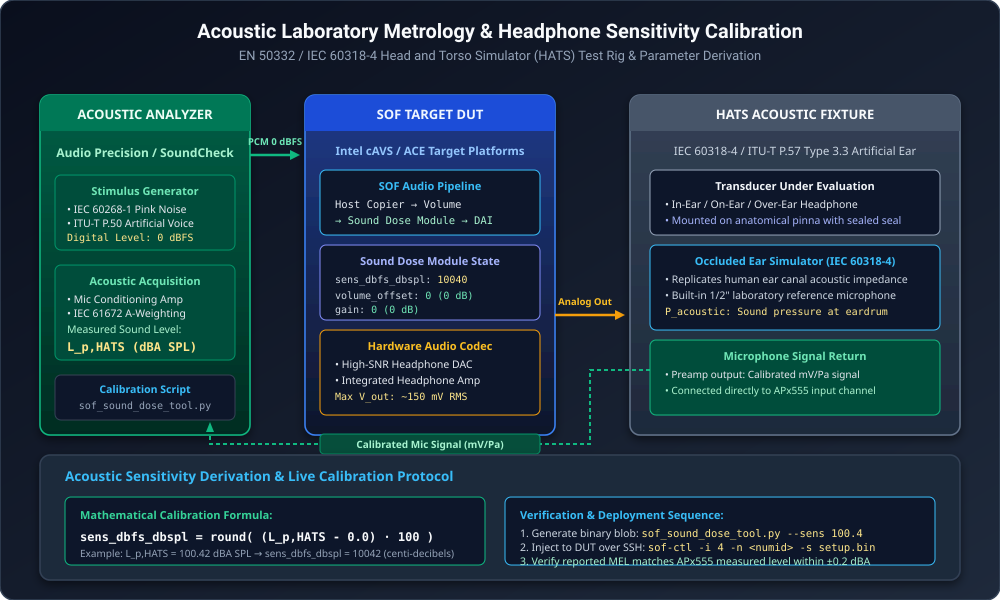
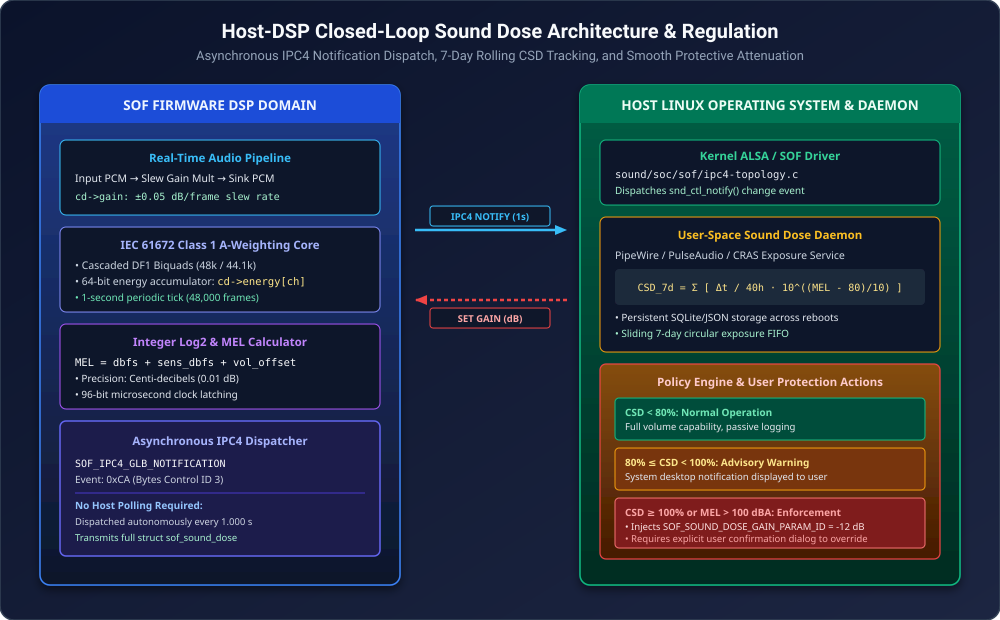

.. _sound_dose_tuning:

Sound Dose / Hearing Health Calibration & Acoustic Protection Guide
###################################################################

The **Sound Dose Evaluator** is an autonomous, real-time auditory safety subsystem in Sound Open Firmware (SOF). Designed to comply with international consumer audio health regulations—specifically **IEC 62368-1 Clause 10.6**, **EN 50332-1/-2/-3**, and **WHO-ITU H.870**—the Sound Dose module continuously analyzes audio streams routed to headphones, headsets, and personal listening devices. It computes spectral energy exposure in real time using an **IEC 61672-1 Class 1 A-weighting** biquad filter cascade, translates digital audio levels into physical sound pressure levels (:math:`\text{dBA SPL}`), tracks cumulative exposure across rolling temporal windows, and autonomously reports exposure metrics to the host operating system while providing artifact-free dynamic attenuation when safe exposure limits are exceeded.

This guide provides the complete mathematical, electro-acoustic, and operational calibration methodology required to tune, measure, and deploy the Sound Dose module on Sound Open Firmware platforms.

.. contents:: Table of Contents
   :local:
   :depth: 3

Theoretical Foundations & Regulatory Mandates
=============================================

Auditory Physiology & Cellular Damage Mechanisms
------------------------------------------------

Prolonged exposure to high sound pressure levels induces irreversible physiological damage to the human auditory system. The human inner ear contains the **cochlea**, a fluid-filled, spiral-shaped cavity lined with the basilar membrane. Transduction of acoustic vibrations into neural impulses is performed by approximately 15,000 hair cells:

* **Inner Hair Cells (IHCs)**: Primary sensory transducers that release neurotransmitters to auditory nerve fibers in response to stereocilia deflection.
* **Outer Hair Cells (OHCs)**: Electromotile amplifiers that actively alter their length via the motor protein prestin, providing up to 50 dB of mechanical amplification for quiet sounds and sharpening frequency selectivity.

When exposed to excessive acoustic energy, outer hair cells undergo intense metabolic overload. This causes severe oxidative stress, marked accumulation of reactive oxygen species (ROS), intracellular calcium excitotoxicity, mitochondrial swelling, and structural rupture of stereocilia tip-links. While moderate over-exposure leads to a **Temporary Threshold Shift (TTS)** that recovers over several hours as cellular homeostasis is restored, repeated or severe acoustic trauma results in permanent hair cell apoptosis and spiral ganglion synaptic decoupling—causing irreversible **Permanent Threshold Shift (PTS)**, high-frequency sensorineural hearing loss, and chronic tinnitus.

   Acoustic Safety Standards & Calculated Sound Dose (CSD) Exposure Regimes

International Regulatory Standards (IEC 62368-1 & EN 50332)
------------------------------------------------------------

To protect consumers against premature hearing loss, international regulatory bodies have enacted strict standards governing personal music players and mobile computing platforms:

* **IEC 62368-1 Clause 10.6**: Audio energy safety standard establishing permissible listening duration, warning notifications, and mandatory attenuation thresholds for consumer audio equipment.
* **EN 50332-1**: Specifies test methods for packaged equipment (personal player bundled with manufacturer headphones). The maximum acoustic sound pressure level must not exceed **100 dBA SPL** with an input test signal of 0 dBFS pink noise.
* **EN 50332-2**: Specifies test methods for standalone players and headphones sold independently. The player maximum electrical output voltage must not exceed **150 mV RMS**, and the wideband headphone characteristic voltage (:math:`WBCV`) must be :math:`\ge 75\text{ mV}` to produce 94 dBA SPL.
* **EN 50332-3 & WHO-ITU H.870**: Standardizes **Calculated Sound Dose (CSD)** and exposure dose monitoring across rolling 7-day listening intervals.

The 3 dB Equal Energy Exchange Principle
-----------------------------------------

The human ear integrates acoustic power over time. The cumulative acoustic energy dose :math:`E_{\text{dose}}` is defined by:

.. math::

   E_{\text{dose}} = \int_0^T p_A^2(t)\,dt

where :math:`p_A(t)` is the instantaneous A-weighted acoustic sound pressure in Pascals. Because acoustic sound intensity doubles with every :math:`+3\,\text{dB}` increase, the permissible exposure duration before reaching **100% CSD** halves with each +3 dB increase in sound pressure level:

.. math::

   T_{\text{safe}}(\text{MEL}) = 40\,\text{hours} \cdot 10^{\frac{80 - \text{MEL}}{10}}

The international reference baseline for **100% CSD** corresponds to continuous exposure of **80 dBA for 40 hours per week**, representing an acoustic energy dosage of:

.. math::

   \text{Dose}_{\text{ref}} = (20\,\mu\text{Pa} \cdot 10^{80/20})^2 \cdot 40\,\text{hours} \approx 1.6\,\text{Pa}^2\text{h}

.. table:: Sound Pressure Level vs Maximum Permissible Weekly Exposure Time (IEC 62368-1 / WHO-ITU H.870)
   :widths: 15 25 35 25

   +-----------------------+-----------------------------+-----------------------------------+------------------------------------+
   | Sound Level (dBA)     | Permissible Time per Week   | Relative Energy Density           | Regulatory Action                  |
   +=======================+=============================+===================================+====================================+
   | **< 80 dBA**          | Unlimited (> 40 hours)      | Baseline (1.0x)                   | Safe Zone (Normal playback)        |
   +-----------------------+-----------------------------+-----------------------------------+------------------------------------+
   | **83 dBA**            | 20 hours                    | 2.0x                              | Normal playback                    |
   +-----------------------+-----------------------------+-----------------------------------+------------------------------------+
   | **86 dBA**            | 10 hours                    | 4.0x                              | Advisory tracking                  |
   +-----------------------+-----------------------------+-----------------------------------+------------------------------------+
   | **89 dBA**            | 5 hours                     | 8.0x                              | Advisory warning dialog            |
   +-----------------------+-----------------------------+-----------------------------------+------------------------------------+
   | **92 dBA**            | 2.5 hours (150 min)         | 16.0x                             | Warning threshold                  |
   +-----------------------+-----------------------------+-----------------------------------+------------------------------------+
   | **95 dBA**            | 1.25 hours (75 min)         | 32.0x                             | Mandatory prompt                   |
   +-----------------------+-----------------------------+-----------------------------------+------------------------------------+
   | **100 dBA**           | 23.7 minutes                | 100.0x                            | EN 50332 Maximum Volume Cap        |
   +-----------------------+-----------------------------+-----------------------------------+------------------------------------+
   | **>= 105 dBA**        | < 7.5 minutes               | 316.0x                            | Instantaneous trauma danger zone   |
   +-----------------------+-----------------------------+-----------------------------------+------------------------------------+

IEC 61672-1 Class 1 A-Weighting Acoustic Filter
===============================================

Continuous Weighting Formulation
--------------------------------

Human auditory sensitivity varies substantially across the audible spectrum, exhibiting peak sensitivity in the 2 kHz to 4 kHz region (corresponding to the acoustic resonance of the outer ear canal) and rolling off sharply below 500 Hz. The **IEC 61672-1:2013** standard defines the A-weighting frequency curve to approximate the inverse equal-loudness response of the human ear at low-to-moderate sound levels:

.. math::

   R_A(f) = \frac{12194^2 \cdot f^4}{(f^2 + 20.6^2) \cdot \sqrt{(f^2 + 107.7^2)(f^2 + 737.9^2)} \cdot (f^2 + 12194^2)}

The relative decibel weighting :math:`A(f)` referenced to 1000 Hz is given by:

.. math::

   A(f) = 20 \log_{10}(R_A(f)) - 20 \log_{10}(R_A(1000))

   IEC 61672-1 Class 1 A-Weighting Acoustic Filter Cascade

Discrete Cascaded Direct Form I (DF1) Realization
-------------------------------------------------

To evaluate A-weighting in real time on fixed-point DSPs without excessive instruction overhead, SOF decomposes the 6-pole, 2-zero continuous analog prototype into three cascaded second-order Direct Form I (DF1) IIR biquad sections (`struct iir_state_df1`):

1. **Biquad 1 (Sub-Audible High-Pass)**: Two real poles at 20.6 Hz and two zeros at DC (:math:`s=0`), eliminating DC offsets and sub-audible physical rumble.
2. **Biquad 2 (Mid-Bass Transition)**: Real poles at 107.7 Hz and 737.9 Hz shaping the rising slope between 100 Hz and 1 kHz.
3. **Biquad 3 (Ultrasonic Low-Pass)**: Conjugate pole pair at 12,194 Hz rolling off ultrasonic and high-frequency content above 12 kHz.

The continuous poles and zeros are mapped to discrete :math:`z`-plane coefficients using the Bilinear Transformation with frequency pre-warping:

.. math::

   s \leftarrow \frac{2}{T_s} \frac{1 - z^{-1}}{1 + z^{-1}}, \quad \omega_a = \frac{2}{T_s} \tan\left(\frac{\omega_d T_s}{2}\right)

Pre-computed coefficient sets are stored in ``sound_dose_iir_48k.h`` and ``sound_dose_iir_44k.h``.

Firmware Normalization Strategy
-------------------------------

.. note::
   In the filter synthesis toolchain (``sof_sound_dose_time_domain_filters.m``), the IIR filter cascade is intentionally normalized to **-3.0 dB at 1 kHz** (``eq.iir_norm_offs_db = -3``).

Because the A-weighting transfer function exhibits a :math:`+1.2\text{ dB}` resonance peak around 3.15 kHz, normalizing to 0 dB at 1 kHz would cause digital full-scale sinusoidal signals at 3.15 kHz to exceed :math:`0\text{ dBFS}`, inducing clipping and saturation in 16-bit or 32-bit fixed-point arithmetic. By attenuating by -3.0 dB in the filter stage, SOF guarantees complete mathematical headroom.

The :math:`+3.00\text{ dB}` normalization offset (``SOUND_DOSE_WEIGHT_FILTERS_OFFS_Q16 = 196608``) is algebraically restored during the logarithmic decibel conversion in ``sound_dose_calculate_mel()``.

Real-Time 64-Bit Energy Integration & Logarithmic Math
======================================================

The Sound Dose module executes a two-stage evaluation pipeline: an inner per-sample filtering and energy accumulation loop, followed by a periodic 1-second logarithmic decibel conversion and timestamping step.

   Fixed-Point Real-Time Energy Accumulation & Logarithmic Decibel Math

Stage 1: Per-Sample Real-Time Processing Loop
---------------------------------------------

For each incoming audio frame, the module executes the following operations per channel:

1. **Protective Gain Multiplier**: Multiplies the input sample by the internal dynamic gain :math:`g \in Q2.30`:

   .. code-block:: c

      sample = sat_int32(Q_MULTSR_32X32((int64_t)cd->gain, *x,
                                        SOUND_DOSE_GAIN_Q, SOUND_DOSE_S32_Q, SOUND_DOSE_S32_Q));
      *y = sample;

2. **A-Weighting Filtering**: Passes the scaled sample through the cascaded Direct Form I IIR filter:

   .. code-block:: c

      weighted = iir_df1(iir, sample) >> 16;

3. **Power Squaring & Accumulation**: Computes instantaneous power and accumulates it into a per-channel 64-bit signed integer buffer:

   .. code-block:: c

      cd->energy[ch] += (int64_t)weighted * weighted;

**Mathematical Headroom Analysis**:
Under full-scale 0 dBFS square-wave input, each sample squared yields :math:`2^{30}` in :math:`Q2.30` representation. Over 1 second at 48 kHz (48,000 frames), the maximum accumulated energy is:

.. math::

   E_{\text{max}} = 48000 \times 2^{30} \approx 5.15396 \times 10^{13}

Because a 64-bit signed integer supports values up to :math:`2^{63}-1 \approx 9.22337 \times 10^{18}`, the accumulator maintains a margin of more than :math:`178,000\times` above full-scale saturation, completely preventing accumulator overflow.

Stage 2: Periodic 1-Second Logarithmic Decibel Conversion
---------------------------------------------------------

When the accumulated frame count reaches the 1-second boundary (``cd->frames_count >= cd->report_count``), ``sound_dose_calculate_mel()`` converts the accumulated energy into Momentary Exposure Level (MEL):

1. **Multichannel Summation**: Sums energy across all active channels:

   .. math::

      E_{\text{sum}} = \sum_{ch=0}^{C-1} E_{ch}

2. **Bit-Shift Normalization**: Scales :math:`E_{\text{sum}}` down by 19 bits (``SOUND_DOSE_ENERGY_SHIFT = 19``) so that the argument fits securely within a 32-bit unsigned integer:

   .. code-block:: c

      log_arg = (uint32_t)(energy_sum >> SOUND_DOSE_ENERGY_SHIFT);
      log_arg = MAX(log_arg, 1);

3. **Integer Base-2 Logarithm**: Computes base-2 logarithm using ``base2_logarithm(log_arg)``, returning a :math:`Q16.16` signed integer.

4. **Fixed Offset & Mean Normalization**:
   - Adds ``SOUND_DOSE_LOG_FIXED_OFFSET = 65536 * (19 - 30) = -720896`` to compensate for the :math:`Q2.30` scaling and the 19-bit right shift.
   - Adds ``cd->log_offset_for_mean`` (:math:`\log_2(1/48000) \times 2^{16} = -1019134`), which divides total energy by frame count to compute mean acoustic power.

5. **Decibel Conversion & Offsets**: Multiplies by :math:`\frac{10}{\log_2(10)} \cdot 2^{29}` (``SOUND_DOSE_TEN_OVER_LOG2_10_Q29 = 1616142483``) in :math:`Q29` fixed-point arithmetic:

   .. code-block:: c

      tmp = Q_MULTSR_32X32((int64_t)tmp, SOUND_DOSE_TEN_OVER_LOG2_10_Q29,
                           SOUND_DOSE_LOGOFFS_Q, SOUND_DOSE_LOGMULT_Q, SOUND_DOSE_LOGOFFS_Q);
      cd->level_dbfs = tmp + SOUND_DOSE_WEIGHT_FILTERS_OFFS_Q16 + SOUND_DOSE_DFBS_OFFS_Q16;

   - ``SOUND_DOSE_WEIGHT_FILTERS_OFFS_Q16``: Adds back the :math:`+3.00\text{ dB}` normalization attenuation.
   - ``SOUND_DOSE_DFBS_OFFS_Q16``: Adds :math:`+3.01\text{ dB}` (:math:`197263`) to calibrate against a full-scale sinusoidal peak-to-RMS reference.

6. **Binaural Stereo Spatial Correction**:
   For multichannel and stereo streams, sums the acoustic power delivered to both ears and subtracts :math:`-1.5\text{ dB}` per channel:

   .. code-block:: c

      if (cd->channels > 1)
          cd->level_dbfs += cd->channels * SOUND_DOSE_MEL_CHANNELS_SUM_FIX;

   For a stereo headphone (2 channels), this subtracts :math:`-3.0\text{ dB}` (:math:`-1.5 \times 2`), aligning digital stereo power with binaural hearing threshold definitions.

7. **Momentary Exposure Level (MEL) Derivation**:
   Translates digital :math:`\text{dBFS}` into physical acoustic sound pressure level :math:`\text{dBA SPL}` (expressed in centi-decibels, :math:`0.01\text{ dB}`):

   .. math::

      \text{MEL} = \text{dbfs\_value} + \text{sens\_dbfs\_dbspl} + \text{volume\_offset}

8. **96-Bit Fixed-Point Microsecond Timestamping**:
   Calculates exact stream presentation timestamp from continuous frame count without floating-point math:

   .. code-block:: c

      tmp_l = (cd->total_frames_count & 0xffffffff) * cd->rate_to_us_coef;
      tmp_h = (cd->total_frames_count >> 32) * cd->rate_to_us_coef;
      cd->feature->stream_time_us = (tmp_l >> 26) + ((tmp_h & ((1LL << 32) - 1)) << 6);

   where ``SOUND_DOSE_1M_OVER_48K_Q26 = 1398101333`` (:math:`\text{round}\left(\frac{1000000}{48000} \cdot 2^{26}\right)`).

Acoustic Metrology & Headphone Sensitivity Calibration
======================================================

Measurement Laboratory Setup
----------------------------

Accurate Sound Dose monitoring requires precise acoustic calibration of the physical headphone output path. Transducer sensitivity must be measured using standardized acoustic laboratory metrology equipment.

   Acoustic Laboratory Metrology & Headphone Sensitivity Calibration Test Rig

The standardized measurement setup consists of:

1. **Head and Torso Simulator (HATS)**: Brüel & Kjær Type 4128C / Type 5128 or GRAS KEMAR 45BB fitted with anatomically accurate anthropomorphic pinnae.
2. **Occluded Ear Simulator**: Conforming to **IEC 60318-4** (formerly IEC 60711) and **ITU-T P.57 Type 3.3 / Type 4.3**, replicating the acoustic transfer impedance of the human ear canal up to 10 kHz.
3. **Calibrated Pressure Microphone**: 1/2" laboratory reference microphone mounted at the eardrum reference point (DRP).
4. **Microphone Preamplifier**: Calibrated with an acoustic pistonphone (e.g. 94.0 dBA SPL at 1000 Hz).
5. **Precision Audio Analyzer**: Audio Precision APx555 or equivalent high-dynamic-range test instrument.

Physical Calibration Runbook
----------------------------

Follow this step-by-step procedure to determine the acoustic sensitivity parameter ``sens_dbfs_dbspl`` for a specific device and headphone combination:

1. **Acoustic Calibration Verification**:
   Mount the acoustic sound calibrator (94.0 dBSPL at 1 kHz) onto the HATS ear simulator microphone. Verify the analyzer reads :math:`94.0 \pm 0.1\text{ dBA}`.

2. **Transducer Mounting & Seal Inspection**:
   Place the headphone or in-ear monitor onto the artificial ear. For over-ear headphones, apply the standardized 5 Newton headband clamping force. Verify acoustic seal integrity by injecting a 100 Hz test tone; improper sealing results in bass leakage and false low sensitivity readings.

3. **Digital Stimulus Injection**:
   Play standard **IEC 60268-1 Pink Noise** (crest factor 6 dB to 12 dB) at **0 dBFS digital peak** through the SOF audio pipeline. Ensure the ALSA user volume slider is set to maximum (0 dBFS digital gain).

4. **Acoustic Sound Pressure Measurement**:
   Record the unattenuated acoustic sound pressure level :math:`L_{p,\text{HATS}}` on the analyzer in dBA SPL (using 10-second :math:`L_{\text{eq}}` time averaging).

5. **Sensitivity Parameter Calculation**:
   Compute the sensitivity parameter in centi-decibels (:math:`100\text{ units} = 1\text{ dB}`):

   .. math::

      \text{sens\_dbfs\_dbspl} = \text{round}\left( L_{p,\text{HATS}} \times 100 \right)

   *Example*: If a 0 dBFS pink noise stream generates :math:`100.42\text{ dBA SPL}` at the artificial eardrum, the parameter value is:

   .. math::

      \text{sens\_dbfs\_dbspl} = 10042

6. **Linearity Verification**:
   Reduce playback volume in 6 dB steps (-6 dBFS, -12 dBFS, -18 dBFS, -24 dBFS). Verify that the measured sound pressure level drops by exactly 6 dB at each step.

Wideband Headphone Characteristic Voltage (WBCV)
------------------------------------------------

For standalone playback devices complying with **EN 50332-2**, measure the maximum electrical output voltage :math:`V_{\text{max}}` delivered into a standard :math:`32\,\Omega` resistive test load. Under EN 50332-2 Clause 4:

.. math::

   V_{\text{max}} \le 150\,\text{mV RMS}

For standalone headphones, the Wideband Characteristic Voltage (:math:`WBCV`) is the electrical input voltage required to generate 94 dBA SPL at the artificial ear:

.. math::

   WBCV = V_{\text{test}} \cdot 10^{\frac{94 - L_{p,\text{measured}}}{20}} \ge 75\,\text{mV}

Control Plane & ABI Specification
=================================

Parameter Identifiers & Controls
--------------------------------

The Sound Dose module exposes four parameter IDs over the SOF control plane.

.. table:: Sound Dose Control Parameter IDs & Functional Roles
   :widths: 10 30 20 40

   +----------+---------------------------------+-------------+--------------------------------------------------------------+
   | Param ID | Identifier                      | Direction   | Description                                                  |
   +==========+=================================+=============+==============================================================+
   | **0**    | SOF_SOUND_DOSE_SETUP_PARAM_ID   | Host -> DSP | Sets static transducer sensitivity (sens_dbfs_dbspl).        |
   +----------+---------------------------------+-------------+--------------------------------------------------------------+
   | **1**    | SOF_SOUND_DOSE_VOLUME_PARAM_ID  | Host -> DSP | Dynamic user volume attenuation offset (volume_offset).      |
   +----------+---------------------------------+-------------+--------------------------------------------------------------+
   | **2**    | SOF_SOUND_DOSE_GAIN_PARAM_ID    | Host -> DSP | Internal protective gain attenuation (gain).                 |
   +----------+---------------------------------+-------------+--------------------------------------------------------------+
   | **3**    | SOF_SOUND_DOSE_PAYLOAD_PARAM_ID | DSP -> Host | 1-second exposure telemetry payload (struct sof_sound_dose). |
   +----------+---------------------------------+-------------+--------------------------------------------------------------+

ABI Data Structures & Memory Layouts
------------------------------------

All decibel parameters in the Sound Dose ABI are formatted as **16-bit signed integers in centi-decibels** (:math:`\text{dB} \times 100`).

.. table:: Sound Dose Firmware Data Structures & Binary Memory Layout
   :widths: 25 15 20 40

   +-------------------------------------+----------+-----------------+----------------------------------------------------------+
   | Structure / Field                   | Type     | Units / Format  | Description & Bounds                                     |
   +=====================================+==========+=================+==========================================================+
   | **struct sound_dose_setup_config**  |          |                 | **Parameter ID 0 (4 bytes total)**                       |
   +-------------------------------------+----------+-----------------+----------------------------------------------------------+
   | sens_dbfs_dbspl                     | int16_t  | centi-dB (x100) | Transducer sensitivity: -1000 to +13000 (-10 to +130 dB) |
   +-------------------------------------+----------+-----------------+----------------------------------------------------------+
   | reserved                            | int16_t  | padding         | Reserved for 32-bit alignment                            |
   +-------------------------------------+----------+-----------------+----------------------------------------------------------+
   | **struct sound_dose_volume_config** |          |                 | **Parameter ID 1 (4 bytes total)**                       |
   +-------------------------------------+----------+-----------------+----------------------------------------------------------+
   | volume_offset                       | int16_t  | centi-dB (x100) | Volume attenuation: -10000 to +4000 (-100 to +40 dB)     |
   +-------------------------------------+----------+-----------------+----------------------------------------------------------+
   | reserved                            | int16_t  | padding         | Reserved for 32-bit alignment                            |
   +-------------------------------------+----------+-----------------+----------------------------------------------------------+
   | **struct sound_dose_gain_config**   |          |                 | **Parameter ID 2 (4 bytes total)**                       |
   +-------------------------------------+----------+-----------------+----------------------------------------------------------+
   | gain                                | int16_t  | centi-dB (x100) | Protective gain: -10000 to 0 (-100 to 0 dB)              |
   +-------------------------------------+----------+-----------------+----------------------------------------------------------+
   | reserved                            | int16_t  | padding         | Reserved for 32-bit alignment                            |
   +-------------------------------------+----------+-----------------+----------------------------------------------------------+
   | **struct sof_sound_dose**           |          |                 | **Parameter ID 3 Container (28 bytes total)**            |
   +-------------------------------------+----------+-----------------+----------------------------------------------------------+
   | mel_value                           | int16_t  | centi-dB (x100) | Calculated Momentary Exposure Level (dBA SPL)            |
   +-------------------------------------+----------+-----------------+----------------------------------------------------------+
   | dbfs_value                          | int16_t  | centi-dB (x100) | Digital weighted signal level (dBFS x100)                |
   +-------------------------------------+----------+-----------------+----------------------------------------------------------+
   | current_sens_dbfs_dbspl             | int16_t  | centi-dB (x100) | Active sensitivity parameter readback                    |
   +-------------------------------------+----------+-----------------+----------------------------------------------------------+
   | current_volume_offset               | int16_t  | centi-dB (x100) | Active volume offset readback                            |
   +-------------------------------------+----------+-----------------+----------------------------------------------------------+
   | current_gain                        | int16_t  | centi-dB (x100) | Active protective gain readback                          |
   +-------------------------------------+----------+-----------------+----------------------------------------------------------+
   | reserved16                          | uint16_t | padding         | Reserved for alignment                                   |
   +-------------------------------------+----------+-----------------+----------------------------------------------------------+
   | reserved32[4]                       | uint32_t | padding         | Reserved for future multi-band metrics (16 bytes)        |
   +-------------------------------------+----------+-----------------+----------------------------------------------------------+

Host-DSP Closed-Loop Exposure Regulation
========================================

Closed-Loop Regulation Architecture
-----------------------------------

The Sound Dose module provides a true closed-loop regulation system spanning the SOF DSP firmware and the host operating system.

   Host-DSP Closed-Loop Sound Dose Architecture & Regulation

Asynchronous Notification Pipeline
----------------------------------

Rather than requiring the host driver to poll telemetry continuously across PCI/I2C buses, the Sound Dose module uses an autonomous event-driven architecture:

1. Every 1.000 second, ``sound_dose_report_mel()`` formats an IPC notification message.
2. The message is transmitted to the host driver via ``SOF_IPC4_GLB_NOTIFICATION`` with event ID ``SOF_IPC4_NOTIFY_MODULE_EVENTID_ALSA_MAGIC_VAL | SOF_IPC4_BYTES_CONTROL_PARAM_ID``.
3. The Linux kernel SOF driver (``sound/soc/sof/ipc4-topology.c``) intercepts the notification and dispatches an ALSA control change event via ``snd_ctl_notify()``.
4. User-space daemons (such as PipeWire, PulseAudio, or ChromeOS CRAS) receive the event instantly without consuming host CPU polling cycles.

Smooth Slew Gain Ramping
------------------------

When the host exposure daemon determines that the user has exceeded safe exposure limits, it injects a gain attenuation command via ``SOF_SOUND_DOSE_GAIN_PARAM_ID`` (e.g. :math:`-12.0\text{ dB}`).

To prevent audible clicks, pops, or transient zipper noise, SOF implements an exponential per-frame gain slew rate:

.. code-block:: c

   if (cd->new_gain < cd->gain) {
       cd->gain = Q_MULTSR_32X32((int64_t)cd->gain, SOUND_DOSE_GAIN_DOWN_Q30, 30, 30, 30);
       cd->gain = MAX(cd->gain, cd->new_gain);
   } else if (cd->new_gain > cd->gain) {
       cd->gain = Q_MULTSR_32X32((int64_t)cd->gain, SOUND_DOSE_GAIN_UP_Q30, 30, 30, 30);
       cd->gain = MIN(cd->gain, SOUND_DOSE_GAIN_ONE_Q30);
   }

* **Down-Slew Rate**: ``SOUND_DOSE_GAIN_DOWN_Q30 = 1067578625`` (:math:`10^{-0.05/20} \cdot 2^{30}`), reducing gain by **0.05 dB per audio frame**.
* **Up-Slew Rate**: ``SOUND_DOSE_GAIN_UP_Q30 = 1079940603`` (:math:`10^{+0.05/20} \cdot 2^{30}`), restoring gain by **0.05 dB per audio frame**.

At 48 kHz, a 6 dB attenuation executes smoothly over 120 frames (2.5 ms), ensuring rapid hearing protection while remaining imperceptible to the listener.

.. note::
   The byte control ``SOF_SOUND_DOSE_GAIN_PARAM_ID`` is an internal kernel control not exposed in standard user-facing mixer interfaces (such as ``alsamixer``). This prevents users from trivially bypassing regulatory protection by moving the volume slider.

Python Calibration Toolchain
============================

The Sound Open Firmware repository provides calibration and injection tooling to generate binary control blobs and monitor live telemetry over SSH.

The following Python script (``sof_sound_dose_tool.py``) handles binary blob generation, parameter conversions, and remote execution:

.. code-block:: python

   #!/usr/bin/env python3
   """Sound Open Firmware Sound Dose Calibration & Telemetry Tool.

   SPDX-License-Identifier: BSD-3-Clause
   Copyright(c) 2026 Intel Corporation.
   """

   import argparse
   import struct
   import subprocess
   import sys

   # SOF IPC4 ABI Constants
   SOF_IPC4_ABI_MAGIC = 0x34435049  # 'IPC4'
   SOF_ABI_VERSION = 0x00040000

   # Param IDs
   PARAM_ID_SETUP = 0
   PARAM_ID_VOLUME = 1
   PARAM_ID_GAIN = 2
   PARAM_ID_PAYLOAD = 3

   def pack_ipc4_blob(param_id: int, payload: bytes) -> bytes:
       """Encapsulate payload with SOF IPC4 control header."""
       header = struct.pack("<IIII", SOF_IPC4_ABI_MAGIC, SOF_ABI_VERSION, len(payload), param_id)
       return header + payload

   def build_setup_blob(sens_dbspl: float) -> bytes:
       """Build Parameter ID 0: Setup sensitivity blob."""
       sens_centidb = int(round(sens_dbspl * 100.0))
       if not (-1000 <= sens_centidb <= 13000):
           raise ValueError(f"Sensitivity {sens_dbspl} dB out of bounds [-10, +130] dB")
       payload = struct.pack("<hh", sens_centidb, 0)
       return pack_ipc4_blob(PARAM_ID_SETUP, payload)

   def build_volume_blob(vol_db: float) -> bytes:
       """Build Parameter ID 1: Volume offset blob."""
       vol_centidb = int(round(vol_db * 100.0))
       if not (-10000 <= vol_centidb <= 4000):
           raise ValueError(f"Volume offset {vol_db} dB out of bounds [-100, +40] dB")
       payload = struct.pack("<hh", vol_centidb, 0)
       return pack_ipc4_blob(PARAM_ID_VOLUME, payload)

   def build_gain_blob(gain_db: float) -> bytes:
       """Build Parameter ID 2: Gain attenuation blob."""
       gain_centidb = int(round(gain_db * 100.0))
       if not (-10000 <= gain_centidb <= 0):
           raise ValueError(f"Gain {gain_db} dB out of bounds [-100, 0] dB")
       payload = struct.pack("<hh", gain_centidb, 0)
       return pack_ipc4_blob(PARAM_ID_GAIN, payload)

   def parse_telemetry_payload(data: bytes):
       """Unpack and display struct sof_sound_dose telemetry."""
       if len(data) < 28:
           print(f"Error: Payload size {len(data)} < 28 bytes")
           return
       mel, dbfs, sens, vol, gain, r16 = struct.unpack_from("<hhhhhH", data, 0)
       print("=" * 60)
       print("Sound Open Firmware Sound Dose Live Telemetry")
       print("=" * 60)
       print(f"Momentary Exposure Level (MEL): {mel / 100.0:6.2f} dBA SPL")
       print(f"Digital Weighted Level:         {dbfs / 100.0:6.2f} dBFS")
       print(f"Configured Sensitivity:         {sens / 100.0:6.2f} dBA SPL (at 0 dBFS)")
       print(f"Active Volume Offset:           {vol / 100.0:6.2f} dB")
       print(f"Protective Gain Attenuation:    {gain / 100.0:6.2f} dB")
       print("=" * 60)

   def main():
       parser = argparse.ArgumentParser(description="SOF Sound Dose Tuning & Blob Tool")
       subparsers = parser.add_subparsers(dest="cmd", required=True)

       # Generate Setup Blob
       p_setup = subparsers.add_parser("gen-setup", help="Generate setup sensitivity blob")
       p_setup.add_argument("--sens", type=float, required=True, help="Headphone sensitivity in dBA SPL at 0 dBFS")
       p_setup.add_argument("--out", type=str, default="sound_dose_setup.bin", help="Output binary file")

       # Generate Volume Blob
       p_vol = subparsers.add_parser("gen-vol", help="Generate volume offset blob")
       p_vol.add_argument("--offset", type=float, required=True, help="Volume attenuation in dB (e.g. -10.0)")
       p_vol.add_argument("--out", type=str, default="sound_dose_vol.bin", help="Output binary file")

       # Generate Gain Blob
       p_gain = subparsers.add_parser("gen-gain", help="Generate gain attenuation blob")
       p_gain.add_argument("--gain", type=float, required=True, help="Gain attenuation in dB (e.g. -6.0)")
       p_gain.add_argument("--out", type=str, default="sound_dose_gain.bin", help="Output binary file")

       # Parse Payload
       p_parse = subparsers.add_parser("parse", help="Parse received binary telemetry payload")
       p_parse.add_argument("file", type=str, help="Binary file to parse")

       args = parser.parse_args()

       if args.cmd == "gen-setup":
           blob = build_setup_blob(args.sens)
           with open(args.out, "wb") as f:
               f.write(blob)
           print(f"Generated setup blob: {args.out} (Sensitivity: {args.sens} dBA SPL)")
       elif args.cmd == "gen-vol":
           blob = build_volume_blob(args.offset)
           with open(args.out, "wb") as f:
               f.write(blob)
           print(f"Generated volume blob: {args.out} (Offset: {args.offset} dB)")
       elif args.cmd == "gen-gain":
           blob = build_gain_blob(args.gain)
           with open(args.out, "wb") as f:
               f.write(blob)
           print(f"Generated gain blob: {args.out} (Gain: {args.gain} dB)")
       elif args.cmd == "parse":
           with open(args.file, "rb") as f:
               data = f.read()
           parse_telemetry_payload(data)

   if __name__ == "__main__":
       main()

Production Acoustic Calibration Profiles
========================================

Transducer Sensitivity Recipes
------------------------------

Because different headphone styles exhibit radically different electrical-to-acoustic sensitivities, modern audio systems configure distinct sensitivity presets based on jack detection, impedance sensing, or digital accessory descriptors.

.. table:: Production Acoustic Calibration Recipes for Headphone Classes
   :widths: 25 15 15 20 25

   +---------------------------------------+---------------+----------------+------------------------+---------------------------+
   | Headphone Category                    | Typical Z (Ω) | Sens (dBSPL/V) | 0 dBFS Acoustic Output | sens_dbfs_dbspl Parameter |
   +=======================================+===============+================+========================+===========================+
   | **High-Sensitivity IEMs**             | 16 Ω          | 118 dBSPL/V    | 108.5 dBA SPL          | **10850** (+108.50 dB)    |
   +---------------------------------------+---------------+----------------+------------------------+---------------------------+
   | **Standard Consumer Over-Ear**        | 32 Ω          | 102 dBSPL/V    | 96.0 dBA SPL           | **9600** (+96.00 dB)      |
   +---------------------------------------+---------------+----------------+------------------------+---------------------------+
   | **Studio Reference Headphone**        | 250 Ω         | 96 dBSPL/V     | 88.2 dBA SPL           | **8820** (+88.20 dB)      |
   +---------------------------------------+---------------+----------------+------------------------+---------------------------+
   | **USB-C / SoundWire Digital Headset** | N/A (Digital) | Factory Cal    | 100.0 dBA SPL          | **10000** (+100.00 dB)    |
   +---------------------------------------+---------------+----------------+------------------------+---------------------------+

Acoustic Profile Analysis
-------------------------

* **Preset 1: High-Sensitivity In-Ear Monitors (IEMs)**:
  In-ear monitors seal tightly within the ear canal, producing extremely high acoustic sound pressure with minimal electrical drive voltage (118 dBSPL/V at 16 Ω). Without proper calibration, a user listening at moderate volume settings could easily reach 95 dBA SPL, exhausting the weekly 100% CSD allocation in under 75 minutes. A calibrated sensitivity of ``10850`` ensures accurate logging and prompts early advisory warnings.
* **Preset 2: Standard Consumer Over-Ear Headphones**:
  The default baseline profile for 32 Ω over-ear headphones. At maximum amplifier output (150 mV RMS under EN 50332-2), typical headphones achieve approximately 96 dBA SPL (``sens_dbfs_dbspl = 9600``).
* **Preset 3: High-Impedance Studio Reference Headphones**:
  Professional studio headphones (250 Ω to 600 Ω) require higher drive voltages to generate equivalent acoustic output. Calibrating with ``8820`` avoids false positive dose alerts, allowing full dynamic headroom without premature regulatory throttling.
* **Preset 4: Digital USB-C & SoundWire Headsets**:
  Digital headsets incorporate an integrated DAC and headphone amplifier with known fixed acoustic gain. The sensitivity is calibrated during factory assembly and programmed directly into topology or accessory descriptors.

ALSA Topology 2 Integration
===========================

Widget Declaration & Pin Topologies
-----------------------------------

In ALSA Topology 2, the Sound Dose module is instantiated as an effect widget in ``sound_dose.conf``:

.. code-block:: text

   Class.Widget."sound_dose" {
       DefineAttribute."index" { type "integer" }
       DefineAttribute."instance" { type "integer" }

       <include/components/widget-common.conf>

       attributes {
           !constructor [ "index" "instance" ]
           !mandatory [
               "num_input_pins"
               "num_output_pins"
               "num_input_audio_formats"
               "num_output_audio_formats"
           ]
           !immutable [ "uuid" "type" ]
           unique "instance"
       }

       uuid            "7c:9d:3f:a4:75:ea:d5:44:94:2d:96:79:91:a3:38:09"
       type            "effect"
       no_pm           "true"
       num_input_pins  1
       num_output_pins 1
   }

Control Bindings
----------------

The module binds four byte controls in ``sound_dose_controls_playback.conf``:

.. code-block:: text

   Object.Control {
       bytes."1" {
           name '$ANALOG_PLAYBACK_PCM Sound Dose setup bytes'
           max 44
           IncludeByKey.BENCH_SOUND_DOSE_PARAMS {
               "default" "include/components/sound_dose/setup_sens_100db.conf"
           }
       }
       bytes."2" {
           name '$ANALOG_PLAYBACK_PCM Sound Dose volume bytes'
           max 44
           <include/components/sound_dose/setup_vol_0db.conf>
       }
       bytes."3" {
           name '$ANALOG_PLAYBACK_PCM Sound Dose gain bytes'
           max 44
           <include/components/sound_dose/setup_gain_0db.conf>
       }
       bytes."4" {
           name '$ANALOG_PLAYBACK_PCM Sound Dose data bytes'
           max 256
           <include/components/sound_dose/setup_data_init.conf>
       }
   }

Interactive Live Injection Runbook & Troubleshooting
====================================================

Target DUT SSH Deployment Sequence
----------------------------------

Execute the following commands on the host to configure, calibrate, and verify the Sound Dose module on a target DUT:

1. **Synthesize Acoustic Setup Blob**:
   Generate a binary sensitivity blob for an over-ear headset measured at 96.0 dBA SPL:

   .. code-block:: bash

      python3 sof_sound_dose_tool.py gen-setup --sens 96.0 --out setup_sens_96db.bin

2. **Locate Mixer Controls on Target DUT**:
   Query the ALSA control numbers on the target platform:

   .. code-block:: bash

      timeout 15 ssh root@<dut> "amixer controls | grep -i 'Sound Dose'"

   *Example Output*:

   .. code-block:: text

      numid=42,iface=MIXER,name='Analog Playback Sound Dose setup bytes'
      numid=43,iface=MIXER,name='Analog Playback Sound Dose volume bytes'
      numid=44,iface=MIXER,name='Analog Playback Sound Dose gain bytes'
      numid=45,iface=MIXER,name='Analog Playback Sound Dose data bytes'

3. **Inject Calibration Blob via sof-ctl**:
   Inject the sensitivity configuration blob into the active audio pipeline:

   .. code-block:: bash

      scp setup_sens_96db.bin root@<dut>:/tmp/
      timeout 15 ssh root@<dut> "sof-ctl -i 4 -n 42 -p 0 -b -s /tmp/setup_sens_96db.bin"

4. **Verify Live Exposure Telemetry**:
   Read back the 1-second telemetry payload:

   .. code-block:: bash

      timeout 15 ssh root@<dut> "sof-ctl -i 4 -n 45 -p 0 -b -g /tmp/sound_dose_data.bin"
      scp root@<dut>:/tmp/sound_dose_data.bin /tmp/
      python3 sof_sound_dose_tool.py parse /tmp/sound_dose_data.bin

5. **Test Protective Gain Attenuation**:
   Command a -10 dB protective gain reduction and verify smooth attenuation:

   .. code-block:: bash

      python3 sof_sound_dose_tool.py gen-gain --gain -10.0 --out gain_m10db.bin
      scp gain_m10db.bin root@<dut>:/tmp/
      timeout 15 ssh root@<dut> "sof-ctl -i 4 -n 44 -p 0 -b -s /tmp/gain_m10db.bin"

Diagnostic Troubleshooting Matrix
---------------------------------

.. table:: Sound Dose Acoustic Calibration & Firmware Diagnostics Matrix
   :widths: 20 25 25 30

   +-------------------------------------+---------------------------------------+------------------------------------+-------------------------------------------------------------+
   | Symptom / Anomaly                   | Root Cause Analysis                   | Acoustic Manifestation             | Corrective Engineering Action                               |
   +=====================================+=======================================+====================================+=============================================================+
   | **MEL reports higher than HATS**    | Over-estimated transducer sensitivity | Premature regulatory intervention; | Re-measure transducer sensitivity on HATS using standard    |
   |                                     | parameter (sens_dbfs_dbspl).          | false 100% CSD warnings.           | 0 dBFS pink noise. Re-inject calibrated centi-dB parameter. |
   +-------------------------------------+---------------------------------------+------------------------------------+-------------------------------------------------------------+
   | **Premature CSD accumulation**      | Volume offset parameter out of sync   | Weekly sound dose accumulates at   | Ensure host volume daemon transmits volume_offset updates   |
   |                                     | with hardware mixer attenuation.      | full volume rate even when quiet.  | to Parameter ID 1 whenever main volume slider is adjusted.  |
   +-------------------------------------+---------------------------------------+------------------------------------+-------------------------------------------------------------+
   | **Clicks or pops on attenuation**   | Direct step gain change bypassing     | Audible zipper noise or transient  | Verify cd->gain updates via Q_MULTSR_32X32 with             |
   |                                     | smooth per-frame exponential slew.    | pop artifact during regulation.    | SOUND_DOSE_GAIN_DOWN_Q30 (0.05 dB/frame).                   |
   +-------------------------------------+---------------------------------------+------------------------------------+-------------------------------------------------------------+
   | **Missing 1s IPC notifications**    | IPC4 notification event ID mismatch   | Host daemon fails to update CSD    | Verify primary->r.notif_type = SOF_IPC4_MODULE_NOTIFICATION |
   |                                     | or disabled global notifications.     | rolling accumulator; stays at 0%.  | and kernel driver handles SOF_IPC4_GLB_NOTIFICATION.        |
   +-------------------------------------+---------------------------------------+------------------------------------+-------------------------------------------------------------+
   | **Asymmetric L/R exposure reading** | Acoustic seal leakage on one HATS     | L/R channels report divergent MEL; | Inspect artificial pinna seating; check headband clamping   |
   |                                     | pinna or unbalanced headphone driver. | false high stereo dose sum.        | force (5 N); verify driver DC resistance balance.           |
   +-------------------------------------+---------------------------------------+------------------------------------+-------------------------------------------------------------+

Related Documentation
=====================

* :ref:`sound_dose`: High-level Sound Dose Evaluator Architecture guide.
* :ref:`runtime_tuning_sof_ctl`: Unified runtime tuning and control blobs architecture guide.
* :ref:`smart_amp_tuning`: Smart Amplifier (DSM) & Transducer Protection calibration guide.
* :ref:`drc_tuning`: Dynamic Range Compression & Multiband DRC tuning guide.
