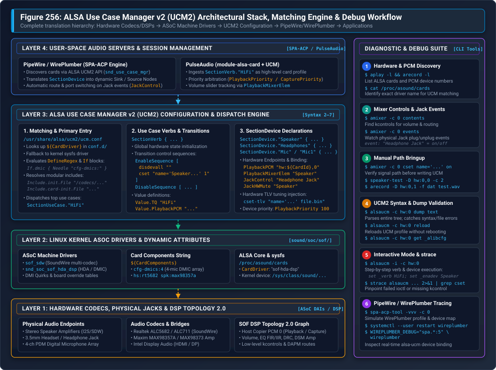

.. _ucm2_guide:

=======================================================
ALSA Use Case Manager v2 (UCM2) Architecture & Runbook
=======================================================

.. contents::
   :local:
   :depth: 3

Sound Open Firmware (SOF) operates in conjunction with the Linux kernel Advanced Linux Sound Architecture (ALSA) System on Chip (ASoC) subsystem and user-space sound servers (such as **PipeWire**, **WirePlumber**, and **PulseAudio**). While ALSA kernel drivers and SOF Topology 2.0 define hardware audio endpoints and DSP processing graphs, the **ALSA Use Case Manager v2 (UCM2)** serves as the critical orchestration layer that translates low-level hardware mixer controls and raw PCM streams into standardized, high-level audio use cases, logical devices, and dynamic switching sequences.

Without UCM2, user-space audio servers would perceive only disconnected Pulse-Code Modulation (PCM) streams and hundreds of unmapped, vendor-specific kernel mixer controls (`kcontrols`). UCM2 bridges this gap by declaring high-level audio endpoints (such as *Speaker*, *Headphones*, *Digital Microphone*, and *HDMI*), defining automated hardware mute policies on physical jack insertion, and applying calibrated Digital Signal Processor (DSP) tuning payloads.

   Figure 256: ALSA Use Case Manager v2 (UCM2) Architectural Stack, Matching Engine & Diagnostic Flow. Illustrates the multi-tier translation from physical codecs, amplifiers, and SOF DSP topology graphs up through ASoC machine drivers, dynamic card matching, UCM2 dispatch, PipeWire/WirePlumber SPA-ACP node generation, and interactive command-line debugging.

Architectural Motivation & Role in Modern Audio
************************************************

The Low-Level ALSA Control Dilemma
==================================

When an SOF audio card binds under Linux, the kernel exposes two distinct interfaces to user space:

1. **PCM Devices** (enumerated via ``/proc/asound/pcm``, ``aplay -l``, and ``arecord -l``): Expose raw audio streaming endpoints (e.g. ``hw:0,0`` for primary media playback, ``hw:0,1`` for deep-buffer streams, ``hw:0,6`` for 4-channel microphone capture).
2. **Mixer Controls** (enumerated via ``amixer -c 0 contents``): Expose dozens or hundreds of discrete integer, boolean, and Type-Length-Value (TLV) byte controls generated by codec drivers, amplifier bridges, and SOF DSP topology widgets (such as ``Speaker Playback Volume``, ``Speaker Switch``, ``PGA Boost``, ``Left DAC Mux``, and ``Dmic0 Capture Switch``).

Neither the kernel driver nor ALSA Topology informs user space which specific combinations of kcontrols must be toggled to route audio to the internal stereo speakers versus an external 3.5mm headphone jack. Furthermore, modern platforms introduce complex operational challenges:

* **Physical Jack Presence Detection**: Plugging in a pair of analog headphones requires detecting an electrical impedance change via a GPIO or codec interrupt, muting the power amplifiers driving the internal chassis speakers, and activating the headphone charge-pump without generating audible pops or clicks.
* **Component Variations across OEM SKUs**: A single laptop motherboard model may be assembled with either two or four digital microphones, different vendor smart amplifiers (e.g. Maxim MAX98373 vs. Cirrus CS35L41), or alternative secondary codecs.
* **DSP Tuning Injection**: Advanced post-processing algorithms (such as Linkwitz-Riley crossovers, Dynamic Range Compression, and Acoustic Echo Cancellation) require runtime binary parameter blobs (cset-tlv) injected into the DSP based on the active output path.

Evolution from Legacy UCM1 to UCM2
==================================

Legacy UCM (UCM1) proved insufficient for modern embedded DSP architectures due to rigid directory layouts, lack of variable scoping, and inability to reuse common codec profiles across different hardware platforms. 

UCM2 addresses these limitations through a completely redesigned architectural specification:

.. list-table:: Architectural Comparison: Legacy UCM1 vs. Modern UCM2
   :widths: 22 38 40
   :header-rows: 1

   * - Architectural Dimension
     - Legacy UCM1 Specification
     - Modern UCM2 Specification
   * - **Configuration Root**
     - ``/usr/share/alsa/ucm/<CardName>/``
     - ``/usr/share/alsa/ucm2/conf.d/<CardDriver>/``
   * - **Card Lookup Scheme**
     - Strict match against ALSA card short name.
     - Dual-tier lookup: ALSA driver name (``${CardDriver}``) with kernel sysfs driver fallback.
   * - **Code Reusability**
     - None; complete configuration duplicated per board.
     - Modular libraries: ``codecs/``, ``platforms/``, ``common/``, and ``lib/``.
   * - **Variant Matching**
     - Hardcoded static files.
     - Dynamic conditionals (``If.condition``) matching ``${CardComponents}`` and DMI tables.
   * - **Syntax Versions**
     - Fixed Syntax 1.
     - Evolutionary syntax releases (**Syntax 2** through **Syntax 7**).
   * - **Tuning Integration**
     - Manual command-line scripts.
     - Native ``cset-tlv`` binary blob injection from ``/lib/firmware/``.

Core Architectural Primitives
=============================

A complete UCM2 configuration model is composed of four foundational entities:

1. **Use Cases (Verbs)**: Top-level operating modes representing a cohesive system scenario. In modern Linux desktops, ``HiFi`` (High Fidelity playback and capture) is the universally standard verb. Specialty environments (e.g. automotive or mobile telephony) may additionally define ``VoiceCall`` or ``Record``.
2. **Devices (SectionDevice)**: Logical audio endpoints within a verb (such as ``Speaker``, ``Headphones``, ``Mic``, ``Headset``, and ``HDMI1``). Devices define associated PCM numbers, volume mixer elements, jack control strings, and priority levels.
3. **Modifiers (SectionModifier)**: Optional, dynamic audio path overlays that alter the routing or processing of an active device without switching the overarching verb (e.g. engaging an echo-cancellation loopback tap).
4. **Sequences**: Ordered, deterministic execution lists of control actions applied during state changes:
   * ``EnableSequence``: Applied when opening a verb or enabling a logical device.
   * ``DisableSequence``: Applied when closing a verb or disabling a logical device.
   * ``BootSequence`` / ``FixedBootSequence``: Executed once during card initialization to establish safe baseline electrical levels and query hardware geometry.

UCM2 Directory Hierarchy & Matching Engine
******************************************

Directory Layout
================

Modern UCM2 configurations are installed under ``/usr/share/alsa/ucm2/``:

.. code-block:: text

   /usr/share/alsa/ucm2/
   ├── ucm.conf                       # Global lookup and entry redirector
   ├── conf.d/                        # Primary symlink directory matching ALSA driver names
   │   ├── sof-hda-dsp/               # Intel HDA / DMIC DSP systems
   │   │   └── sof-hda-dsp.conf       # Primary card entry
   │   ├── sof-soundwire/             # Intel SoundWire multi-codec systems
   │   └── USB-Audio/                 # USB audio cards and docks
   ├── Intel/                         # Intel platform profiles
   │   ├── sof-hda-dsp/
   │   │   ├── sof-hda-dsp.conf
   │   │   ├── HiFi.conf              # Use case verb definition
   │   │   └── dsp.conf               # DSP pipeline and variant variables
   │   └── SOF/                       # Generic legacy/Baytrail/Cherrytrail SOF profiles
   ├── AMD/                           # AMD ACP audio platform profiles
   ├── NXP/                           # NXP i.MX audio platform profiles
   ├── MediaTek/                      # MediaTek MTK platform profiles
   ├── codecs/                        # Modular codec initialization and device snippets
   │   ├── rt5682/                    # Realtek ALC5682 headset codec
   │   │   ├── init.conf              # Power rails and DAI initialization
   │   │   └── HiFi.conf              # Headphones, Headset, and Mic device definitions
   │   ├── max98357a/                 # Maxim mono/stereo I2S speaker amplifiers
   │   └── hda/                       # Standard High Definition Audio codec templates
   ├── common/                        # Common cross-platform helper sequences
   │   ├── ctl/led.conf               # Mute LED binding (mic / speaker)
   │   └── pcm/hdmi.conf              # Multi-stream HDMI / DisplayPort splitters
   └── lib/                           # Core shared macro and initialization routines
       ├── card-init.conf             # Standard card power and boot sequencing
       └── ctl-remap.conf             # Control alias remapping

Resolution Precedence & Card Matching
======================================

When an application or sound daemon calls ``snd_use_case_mgr_open()``, the ALSA library evaluates ``/usr/share/alsa/ucm2/ucm.conf``. The lookup engine determines the matching configuration file using strict resolution precedence:

1. **conf.d Scheme**: Checks for a file or symlink under ``/usr/share/alsa/ucm2/conf.d/<DriverName>/<DriverName>.conf``, where ``<DriverName>`` is the ALSA driver name reported in ``/proc/asound/cards`` (e.g. ``sof-hda-dsp``).
2. **sysfs Kernel Driver Fallback**: If the ALSA driver name is not found in ``conf.d/``, UCM inspects the kernel driver symlink target:
   
   .. code-block:: bash

      readlink /sys/class/sound/card0/device/driver
      # Output: ../../../bus/platform/drivers/sof-audio-pci-intel-tgl

3. **Card Name Fallback**: Checks for directories matching the raw card short name or card long name.
4. **conf.virt.d Scheme**: For virtual audio devices aggregating multiple physical sound cards, UCM resolves profiles under ``conf.virt.d/``.

Dynamic Hardware Variant Matching
=================================

SOF machine drivers dynamically construct a **Card Components String** (``${CardComponents}``) that describes the physical hardware topology discovered via ACPI DSDT, NHLT tables, or DMI quirks.

UCM2 profiles leverage ``DefineRegex`` and conditional blocks (``If.condition``) to parse these component strings and dynamically customize the resulting audio graph.

For example, on Intel Tiger Lake and Panther Lake platforms with digital microphone arrays and external codecs, the kernel machine driver exports:

.. code-block:: text

   CardComponents = "cfg-dmics:4 hs:rt5682 spk:max98357a iec61937-pcm:5,6"

The top-level configuration (``sof-hda-dsp.conf``) parses these flags at runtime:

.. code-block:: text

   Define {
       DeviceMic "Mic"
       DeviceDmic ""
   }

   # Extract DMIC array channel count
   If.devdmic {
       Condition {
           Type String
           Haystack "${CardComponents}"
           Needle "cfg-dmics:"
       }
       True {
           Define.DeviceDmic "Mic1"
           Define.DeviceMic "Mic2"
           FixedBootSequence [
               exec "-nhlt-dmic-info -o ${var:LibDir}/dmics-nhlt.json"
           ]
       }
   }

UCM2 Syntax & Language Specification
************************************

Syntax Version Progression
==========================

Every modern UCM2 configuration file must begin with a ``Syntax`` declaration specifying the feature set required by the parser:

.. list-table:: ALSA UCM Syntax Version Capabilities
   :widths: 12 18 70
   :header-rows: 1

   * - Syntax
     - Minimum alsa-lib
     - Key Features & Capabilities Introduced
   * - **Syntax 2**
     - v1.2.1
     - Base UCM2 specification: ``conf.d`` layout, variable expansion (``${CardId}``), ``If`` conditionals.
   * - **Syntax 3**
     - v1.2.2
     - Regular expression matching (``DefineRegex``), substring searching, ``Include`` directives.
   * - **Syntax 4**
     - v1.2.4
     - Inline macro declarations (``Macro``), control existence checking (``Type ControlExists``).
   * - **Syntax 6**
     - v1.2.6
     - Dynamic control creation (``cset-new``), compound string operations, DMI table lookups.
   * - **Syntax 7**
     - v1.2.8+
     - Extended LED controls (``SetLED``), variable scoping (``${var:Name}``), sysfs attribute injection.

SectionUseCase & SectionVerb
============================

The top-level configuration file declares use cases referencing dedicated verb files:

.. code-block:: text

   Syntax 7

   SectionUseCase."HiFi" {
       File "/Intel/sof-hda-dsp/HiFi.conf"
       Comment "Play HiFi quality Music"
   }

Within ``HiFi.conf``, the ``SectionVerb`` defines baseline setup and teardown:

.. code-block:: text

   SectionVerb {
       EnableSequence [
           disdevall ""
           cset "name='Speaker Playback Switch' on"
           cset "name='Capture Switch' on"
       ]

       DisableSequence [
           cset "name='Speaker Playback Switch' off"
       ]

       Value {
           TQ "HiFi"
       }
   }

SectionDevice Declarations
==========================

Each physical or logical endpoint is declared as a ``SectionDevice``:

.. code-block:: text

   SectionDevice."Speaker" {
       Comment "Chassis Stereo Speakers"

       EnableSequence [
           cset "name='Speaker Playback Switch' on"
           cset "name='Speaker Playback Volume' 85%"
       ]

       DisableSequence [
           cset "name='Speaker Playback Switch' off"
       ]

       Value {
           PlaybackPriority 100
           PlaybackPCM "hw:${CardId},0"
           PlaybackMixerElem "Speaker"
           PlaybackChannels 2
       }
   }

Value Block Configuration Reference
===================================

The ``Value`` block conveys essential properties used by user-space audio servers:

.. list-table:: Critical UCM2 Value Block Parameters
   :widths: 25 22 53
   :header-rows: 1

   * - Parameter Key
     - Example Value
     - Functional Role
   * - ``PlaybackPCM``
     - ``"hw:${CardId},0"``
     - Identifies the ALSA PCM playback device associated with this endpoint.
   * - ``CapturePCM``
     - ``"hw:${CardId},6"``
     - Identifies the ALSA PCM capture device associated with this endpoint.
   * - ``PlaybackMixerElem``
     - ``"Speaker"``, ``"Headphone"``
     - Identifies the ALSA simple mixer element to bind for volume/mute sliders.
   * - ``PlaybackVolume``
     - ``"name='Speaker Playback Volume'"``
     - Direct kcontrol binding if simple mixer element is absent.
   * - ``JackControl``
     - ``"Headphone Jack"``
     - Names the ALSA boolean jack control monitored for presence events.
   * - ``JackHWMute``
     - ``"Speaker"``
     - Instructs audio servers to automatically disable ``Speaker`` when this jack is engaged.
   * - ``PlaybackPriority``
     - ``100`` (High), ``50`` (Low)
     - Priority metric for sound servers to select the default output sink.
   * - ``CapturePriority``
     - ``200``, ``100``
     - Priority metric for sound servers to select the default capture source.
   * - ``PlaybackChannels``
     - ``2``, ``4``, ``6``
     - Channel geometry constraints enforced by audio server pipelines.
   * - ``EDIDFile``
     - ``"/sys/class/drm/..."``
     - Path to monitor EDID data for HDMI/DisplayPort audio capabilities.

Execution Commands Reference
============================

Control sequences support several primitive execution commands:

* ``cset "name='<Control Name>' <Value>"``: Sets an ALSA integer, boolean, or enum control value.
* ``cset-tlv "name='<Control Name>' <Path/To/Blob.bin>"``: Writes a raw binary parameter block into a byte control (used for DSP tuning payloads).
* ``cset-new "name='<Control>' <Definition>"``: Instantiates a virtual ALSA control at runtime.
* ``disdevall ""``: Disables all active devices within the verb.
* ``enadev "<Device>"`` / ``disdev "<Device>"``: Programmatically enables or disables another device.
* ``exec "<Shell Command>"``: Executes an external shell utility (prefixed with ``-`` to ignore non-zero exit codes).
* ``msleep <DurationMs>``: Pauses execution for the specified milliseconds to permit analog bias settling.

Step-by-Step Guide: Authoring a New UCM2 Profile
************************************************

Step 1: Hardware Enumeration & Discovery
========================================

Before writing any configuration files, inspect the target platform using standard ALSA utilities to identify PCMs, mixer controls, and jacks.

1. **Determine the ALSA Driver Name and Card Index**:

   .. code-block:: bash

      cat /proc/asound/cards

   *Example output:*

   .. code-block:: text

      0 [sofhdadsp      ]: sof-hda-dsp - sof-hda-dsp
                           Dell Inc.-XPS+13+9310-0DXM88
                           driver name: sof-hda-dsp

   Here, the driver name is ``sof-hda-dsp`` and the card index is ``0``.

2. **Enumerate Playback and Capture PCMs**:

   .. code-block:: bash

      aplay -l
      arecord -l

   Identify which PCM device corresponds to your target path (e.g. ``hw:0,0`` for stereo playback, ``hw:0,6`` for microphone capture).

3. **Dump All Kernel Mixer Controls**:

   .. code-block:: bash

      amixer -c 0 contents > /tmp/controls.txt

   Review ``/tmp/controls.txt`` to identify the volume sliders, mute switches, and inter-widget routing controls.

4. **Monitor Jack Detection Events**:

   .. code-block:: bash

      amixer -c 0 events

   Physically insert and remove a 3.5mm headset into the audio jack. Observe the output:

   .. code-block:: text

      event numid=28,iface=CARD,name='Headphone Jack'
      event numid=29,iface=CARD,name='Mic Jack'

Step 2: Manual Signal Path Bringup via ALSA CLI
===============================================

Never write a UCM profile before verifying that audio can pass through the system using raw ALSA commands.

1. **Unmute the Playback Path**:

   .. code-block:: bash

      amixer -c 0 cset name='Speaker Playback Switch' on
      amixer -c 0 cset name='Speaker Playback Volume' 80%

2. **Test Raw Audio Playback**:

   .. code-block:: bash

      speaker-test -D hw:0,0 -c 2 -r 48000 -twav

   Verify that audio is clearly audible from the internal speakers.

3. **Test Raw Audio Capture**:

   .. code-block:: bash

      arecord -D hw:0,6 -f S16_LE -r 48000 -c 4 -d 5 /tmp/test_mic.wav
      aplay -D hw:0,0 /tmp/test_mic.wav

   Verify that all microphone channels record without distortion or clipping.

Step 3: Creating the Top-Level Card Configuration
=================================================

Create the top-level configuration entry under ``/usr/share/alsa/ucm2/conf.d/<CardDriver>/<CardDriver>.conf``:

.. code-block:: text

   # /usr/share/alsa/ucm2/conf.d/my-board/my-board.conf
   Syntax 7

   # Include standard initialization library
   Include.card-init.File "/lib/card-init.conf"

   Define {
       SpeakerChannels 2
   }

   # Associate the primary HiFi use case
   SectionUseCase."HiFi" {
       File "HiFi.conf"
       Comment "Play High Fidelity Audio"
   }

Step 4: Authoring the Use Case & Devices (HiFi.conf)
====================================================

Create ``HiFi.conf`` alongside the top-level configuration:

.. code-block:: text

   # /usr/share/alsa/ucm2/conf.d/my-board/HiFi.conf
   Syntax 7

   SectionVerb {
       EnableSequence [
           disdevall ""
           cset "name='Speaker Playback Switch' on"
           cset "name='Speaker Playback Volume' 80%"
           cset "name='Capture Switch' on"
       ]

       DisableSequence [
           cset "name='Speaker Playback Switch' off"
           cset "name='Capture Switch' off"
       ]

       Value.TQ "HiFi"
   }

   SectionDevice."Speaker" {
       Comment "Internal Stereo Speakers"

       EnableSequence [
           cset "name='Speaker Switch' on"
       ]

       DisableSequence [
           cset "name='Speaker Switch' off"
       ]

       Value {
           PlaybackPriority 100
           PlaybackPCM "hw:${CardId},0"
           PlaybackMixerElem "Speaker"
           PlaybackChannels "${var:SpeakerChannels}"
       }
   }

   SectionDevice."Headphones" {
       Comment "Analog Headphones"

       EnableSequence [
           cset "name='Headphone Switch' on"
       ]

       DisableSequence [
           cset "name='Headphone Switch' off"
       ]

       Value {
           PlaybackPriority 200
           PlaybackPCM "hw:${CardId},0"
           PlaybackMixerElem "Headphone"
           JackControl "Headphone Jack"
           JackHWMute "Speaker"
       }
   }

   SectionDevice."Mic" {
       Comment "Digital Microphone Array"

       EnableSequence [
           cset "name='Dmic0 Capture Switch' on"
       ]

       DisableSequence [
           cset "name='Dmic0 Capture Switch' off"
       ]

       Value {
           CapturePriority 100
           CapturePCM "hw:${CardId},6"
           CaptureMixerElem "Dmic0"
           CaptureChannels 4
       }
   }

Step 5: Codec & HDMI Modularization
===================================

To avoid code duplication across boards sharing the same audio codec, extract codec-specific initialization into ``/usr/share/alsa/ucm2/codecs/<codec>/``.

For display audio, include the standardized HDMI helper:

.. code-block:: text

   # Include multi-display HDMI/DP audio devices
   Include.hdmi.File "/common/pcm/hdmi.conf"

User-Space Audio Server Integration
***********************************

WirePlumber SPA-ACP Engine
==========================

Modern Linux desktop distributions route audio through **PipeWire** using **WirePlumber** as its session and policy manager. WirePlumber interacts with ALSA through its **Simple Plugin Architecture (SPA) Audio Card Profile (ACP)** module:

1. **Card Discovery**: WirePlumber queries ``snd_use_case_mgr_open()`` upon receiving a udev soundcard announcement.
2. **Node Creation**: Each enabled UCM ``SectionDevice`` is mapped directly to a PipeWire Audio Node:
   * ``PlaybackPCM`` $	o$ creates a Playback Sink Node (``alsa_output.pci-0000_00_1f.3-platform-sof_sdw.HiFi__Speaker__sink``).
   * ``CapturePCM`` $	o$ creates a Capture Source Node (``alsa_input.pci-0000_00_1f.3-platform-sof_sdw.HiFi__Mic__source``).
3. **Hardware Volume Sliders**: The node binds its software volume slider to the ALSA simple mixer element declared in ``PlaybackMixerElem``.
4. **Jack Presence Monitoring**: WirePlumber listens to events on the ``JackControl`` string. When the headphone jack goes high, WirePlumber executes the device transition sequence:
   * Invokes ``Speaker`` disable sequence.
   * Invokes ``Headphones`` enable sequence.
   * Updates desktop GUI audio routing indicators.

Inspecting WirePlumber Audio Profiles
=====================================

PipeWire provides a standalone diagnostic tool, ``spa-acp-tool``, to simulate and inspect how WirePlumber will ingest your UCM2 profile without requiring a running desktop session:

.. code-block:: bash

   spa-acp-tool -vvv -c 0

*Expected output excerpt:*

.. code-block:: text

   Card 0: name:'sof-hda-dsp'
     Profile 'HiFi':
       Description: 'Play HiFi quality Music'
       Priority: 8000
       Device 'Speaker':
         Direction: Output
         Priority: 100
         Playback PCM: hw:0,0
         Mixer Element: Speaker
       Device 'Headphones':
         Direction: Output
         Priority: 200
         Playback PCM: hw:0,0
         Mixer Element: Headphone
         Jack: 'Headphone Jack' (status: unplugged)

Comprehensive Debugging Methodologies & Runbooks
************************************************

Runbook 1: Sound Card Falling Back to Generic or Null Output
============================================================

**Symptom**: System sound settings show only generic fallback or "Null Output"; audio playback produces no sound.

**Root Causes**:
1. UCM cannot locate a profile matching the ALSA driver name in ``/proc/asound/cards``.
2. A syntax error exists in the ``.conf`` files, causing ``snd_use_case_mgr_open()`` to fail during parse.

**Diagnostic Steps**:

1. **Verify ALSA Driver Name**:

   .. code-block:: bash

      cat /proc/asound/cards

   Verify that a matching directory or symlink exists under ``/usr/share/alsa/ucm2/conf.d/<DriverName>``.

2. **Execute Full Syntax Dump**:

   .. code-block:: bash

      alsaucm -c hw:0 dump text

   *If a syntax error exists, ``alsaucm`` prints the exact line and filename:*

   .. code-block:: text

      ALSA lib ucm_conf.py:124:(parse_value) unknown value PlaybackPCM1 at line 14
      alsaucm: error failed to open sound card hw:0: -22

3. **Check File Permissions**:
   Ensure all ``.conf`` files under ``/usr/share/alsa/ucm2/`` have ``644`` read permissions.

Runbook 2: Audio Routing Ineffective or Muted
=============================================

**Symptom**: PipeWire creates the sink, but no sound emits from the physical speakers.

**Root Causes**:
1. Missing kernel kcontrols in the enable sequence (e.g. power amplifier DAPM widget is powered down).
2. ``PlaybackMixerElem`` does not match the actual ALSA simple mixer element name.

**Diagnostic Steps**:

1. **Trace Control Operations with strace**:

   .. code-block:: bash

      strace -e ioctl alsaucm -c hw:0 set _verb HiFi set _enadev Speaker 2>&1 | grep -i SNDRV_CTL_IOCTL_ELEM_WRITE

   Observe whether each ``cset`` in your sequence successfully writes to the hardware.

2. **Verify Simple Mixer Elements**:

   .. code-block:: bash

      amixer -c 0 scontrols

   Ensure the string in ``PlaybackMixerElem`` exactly matches one of the simple controls listed (e.g. ``Simple mixer control 'Speaker',0``).

Runbook 3: Headphone Jack Auto-Switching Fails
==============================================

**Symptom**: Audio continues playing through internal speakers when headphones are plugged in.

**Root Causes**:
1. ``JackControl`` string in UCM does not match the kernel input jack name.
2. ``JackHWMute`` parameter is omitted or misspelled.

**Diagnostic Steps**:

1. **Identify the Physical Jack Control Name**:

   .. code-block:: bash

      amixer -c 0 events

   Plug in the headphone. Look for the exact control name emitted:

   .. code-block:: text

      event numid=15,iface=CARD,name='Headphone Jack'

2. **Check WirePlumber Live Jack Monitoring**:

   .. code-block:: bash

      systemctl --user stop wireplumber
      WIREPLUMBER_DEBUG="spa.*:5" wireplumber 2>&1 | grep -i jack

   Verify that WirePlumber receives the jack change notification and executes the profile port switch.

Runbook 4: Fast In-System Hot-Reloading Workflow
================================================

During active driver bringup, you do not need to reboot the system or reload kernel modules to test UCM2 edits.

1. Edit the configuration file under ``/usr/share/alsa/ucm2/``.
2. Validate syntax immediately:

   .. code-block:: bash

      alsaucm -c hw:0 reload

3. Restart the user-space session manager:

   .. code-block:: bash

      systemctl --user restart wireplumber

4. Verify the updated device status:

   .. code-block:: bash

      wpctl status

Production Verification Checklist
*********************************

Before committing and deploying a new UCM2 profile for an SOF platform, verify the following quality criteria:

* [ ] **Syntax Validation**: ``alsaucm -c hw:<N> dump text`` completes with zero errors or warnings.
* [ ] **Card Components Cleanliness**: Machine driver exports accurate ``${CardComponents}`` strings matching platform SKU variations.
* [ ] **Zero Pop/Click Transitions**: Verified that ``EnableSequence`` and ``DisableSequence`` apply proper mute ordering and delay settling (``msleep``).
* [ ] **Jack Detection Auto-Mute**: Physical insertion of headphones reliably mutes internal speakers and transfers stream routing within 200 ms.
* [ ] **Volume Calibration**: PipeWire and desktop GUI volume sliders scale monotonically from 0% (silence) to 100% (rated SPL) without clipping.
* [ ] **Inclusive Language Policy**: Verified compliance against ``rules-woke.yaml`` (zero non-inclusive terms).
