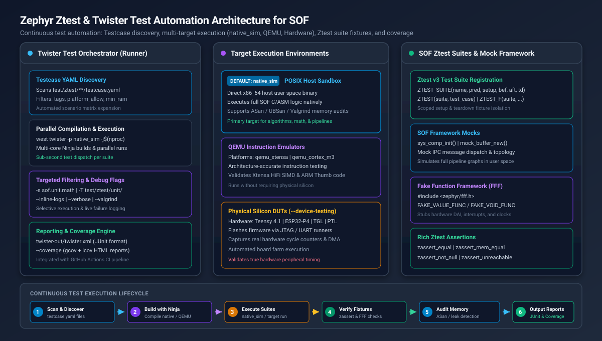
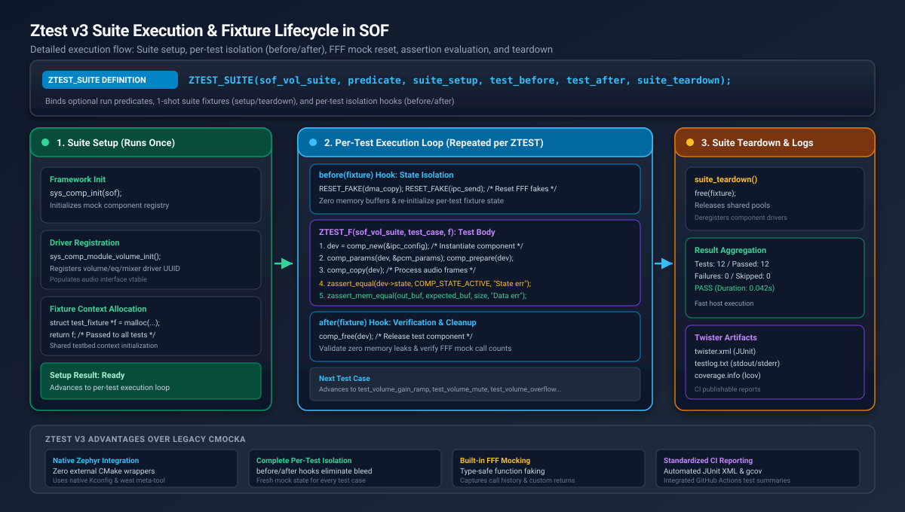

.. _unit_tests:

Unit Testing with Zephyr Ztest & Twister
########################################

.. contents::
   :local:
   :depth: 3

Overview and Testing Strategy in SOF
************************************

Sound Open Firmware (SOF) employs a rigorous, layered testing pyramid to guarantee
algorithmic correctness, real-time performance, and stability across diverse
silicon targets (including Intel CAVS/ACE DSPs, NXP i.MX microcontrollers, ARM
Cortex-M platforms such as Teensy 4.1, and RISC-V bridges like ESP32-P4).

At the foundation of this testing pyramid are **unit tests** authored using
Zephyr's native **Ztest** framework and orchestrated by the **Twister** test
runner.

.. list-table:: SOF Firmware Verification Hierarchy
   :widths: 18 22 25 35
   :header-rows: 1

   * - Testing Tier
     - Execution Target
     - Scope & Focus
     - Turnaround Speed
   * - **1. Unit Tests (Ztest)**
     - ``native_sim`` (Host POSIX)
     - Isolated DSP algorithms, math routines, ring buffers, memory allocators, FFF mocks.
     - **Milliseconds** (Sub-second per suite)
   * - **2. Host Testbench**
     - Host binary (``testbench``)
     - Pipeline WAV-in to WAV-out processing, multi-component DAG execution, bit-exactness.
     - **Seconds** (Full pipeline streams)
   * - **3. QEMU Simulation**
     - ``qemu_xtensa``, ``qemu_cortex_m3``
     - Instruction-accurate SIMD (Xtensa HiFi, ARM Thumb), cache behavior, and register logic.
     - **Seconds to Minutes**
   * - **4. Hardware Loopbacks**
     - ESP32-P4 / Teensy 4.1
     - Real DAI interfaces (I2S, PDM, S/PDIF, SoundWire), hardware clocking, TDM slots.
     - **Minutes**
   * - **5. Target DUT & ktest**
     - Real Silicon DUTs (TGL, PTL, ARL)
     - Full system audio playback/capture, driver probing, IPC message pumps, and bisection.
     - **Minutes to Hours**

Why Ztest and Twister?
======================

* **Upstream Zephyr Integration**: Ztest and Twister are standard Zephyr RTOS
  components. SOF unit tests leverage upstream Kconfig, CMake, and test harness
  infrastructure without proprietary test wrappers or external dependencies.
* **Deprecation of Legacy CMocka**: Prior versions of SOF relied on the CMocka
  framework coupled with custom wrapper scripts. CMocka has been retired in favor
  of Ztest v3, bringing native fixture support, type-safe assertions, and seamless
  CI integration.
* **Rapid Test-Driven Development (TDD)**: Tests run natively in host user space
  using the ``native_sim`` target. Developers can write a failing test, implement
  the firmware logic, and verify the fix in seconds without flashing physical
  hardware.
* **Continuous Integration Enforcement**: Twister automatically executes on every
  pull request in GitHub Actions, generating standardized JUnit XML reports and
  enforcing line/branch coverage metrics.

.. _ztest-twister-architecture:

System Architecture
*******************

The SOF unit testing architecture separates the execution orchestration handled
by Twister from the test suites and mock frameworks executed inside the target
sandboxes.

   Zephyr Ztest & Twister Test Automation Architecture for SOF

Architecture Components
=======================

1. **Twister Test Runner (Host Orchestrator)**:

   * **Discovery Engine**: Recursively parses ``testcase.yaml`` specification
     files across ``test/ztest/`` to build an execution matrix.
   * **Filter & Selector**: Evaluates platform allowlists, test tags (e.g.
     ``unit``, ``math``, ``audio``), and Kconfig dependencies.
   * **Parallel Build & Run Engine**: Compiles test applications with Ninja and
     executes binaries concurrently across available host CPU cores.
   * **Report Generator**: Produces unified JUnit XML reports (``twister.xml``),
     detailed failure logs, and Gcov/lcov code coverage analyses.

2. **Target Execution Environments**:

   * **``native_sim`` (POSIX Host Sandbox)**: Compiles SOF C logic directly as a
     native 64-bit Linux executable. Executes in user space in milliseconds.
     Supports compiler sanitizers (ASan, UBSan) and memory checkers (Valgrind).
   * **QEMU Emulators (``qemu_xtensa``, ``qemu_cortex_m3``, ``qemu_riscv64``)**:
     Runs tests within instruction-accurate virtual processors, verifying
     architecture-specific assembly and SIMD intrinsics.
   * **Physical Silicon (``--device-testing``)**: Automatically flashes and
     executes test suites on real target hardware via JTAG or serial runners.

3. **SOF Ztest Suites & Mock Framework**:

   * **Ztest v3 Test Harness**: Provides modular test suite definitions,
     fixtures, assertions, and test filtering.
   * **Fake Function Framework (FFF)**: Embedded stubbing library
     (``<zephyr/fff.h>``) providing type-safe function mocking, call history
     inspection, and custom return sequences.
   * **SOF Subsystem Mocks**: Simulates the SOF component framework
     (``sys_comp_init()``), mock memory allocators (``fast-get``, ``objpool``),
     mock audio buffers, and IPC messaging in user space.

.. _ztest-lifecycle:

Ztest v3 Lifecycle and Fixture Model
************************************

Ztest v3 provides a structured fixture lifecycle to guarantee state isolation
between test cases and prevent side-effects from bleeding across tests.

   Ztest v3 Suite Execution & Fixture Lifecycle in SOF

Lifecycle Stages
================

1. **Suite Declaration (``ZTEST_SUITE``)**:

   The test suite is registered using the ``ZTEST_SUITE`` macro, binding the
   suite name to optional predicates and lifecycle callback functions:

   .. code-block:: c

      ZTEST_SUITE(suite_name, predicate, suite_setup, test_before, test_after, suite_teardown);

   * ``predicate``: Optional function pointer returning boolean. If false, the
     entire suite is skipped at runtime.
   * ``suite_setup``: Executed once before any test in the suite runs.
   * ``test_before``: Executed immediately before each individual test case.
   * ``test_after``: Executed immediately after each individual test case.
   * ``suite_teardown``: Executed once after all tests in the suite complete.

2. **Suite Setup Hook (``suite_setup``)**:

   Initializes shared framework infrastructure:

   * Initializes the SOF component registry via ``sys_comp_init(sof)``.
   * Registers component driver interfaces (e.g. ``sys_comp_module_volume_interface_init()``).
   * Allocates shared fixture context structures passed to test cases.

3. **Per-Test Isolation Hooks (``before`` / ``after``)**:

   * **``test_before(fixture)``**: Resets Fake Function Framework (FFF) call
     histories using ``RESET_FAKE()``, clears audio buffers, and initializes
     input test data.
   * **``test_after(fixture)``**: Verifies that components transitioned to the
     expected terminal states, checks for mock expectation compliance, and frees
     temporary test buffers.

4. **Suite Teardown Hook (``suite_teardown``)**:

   Releases shared fixture memory, deregisters components, and releases allocated
   memory pools.

Assertion Reference
===================

Ztest provides comprehensive assertion macros that print file, line number, and
custom diagnostic messages upon failure:

.. list-table:: Core Ztest Assertion Macros
   :widths: 35 65
   :header-rows: 1

   * - Macro
     - Description & Verification
   * - ``zassert_true(cond, msg, ...)``
     - Verifies that boolean expression ``cond`` evaluates to true.
   * - ``zassert_false(cond, msg, ...)``
     - Verifies that boolean expression ``cond`` evaluates to false.
   * - ``zassert_equal(a, b, msg, ...)``
     - Verifies scalar equality (``a == b``).
   * - ``zassert_not_equal(a, b, msg, ...)``
     - Verifies scalar inequality (``a != b``).
   * - ``zassert_null(ptr, msg, ...)``
     - Asserts that pointer ``ptr`` is ``NULL``.
   * - ``zassert_not_null(ptr, msg, ...)``
     - Asserts that pointer ``ptr`` is not ``NULL``.
   * - ``zassert_mem_equal(a, b, size, msg, ...)``
     - Verifies that two memory buffers are bitwise identical for ``size`` bytes.
   * - ``zassert_between_inclusive(val, min, max, msg, ...)``
     - Verifies that scalar ``val`` lies within ``[min, max]``.
   * - ``zassert_unreachable(msg, ...)``
     - Immediately fails if an unexpected code branch is reached.
   * - ``zassume_true(cond, msg, ...)``
     - Soft precondition assumption. If false, skips the test rather than failing.

.. _ztest-mocking:

Mocking Hardware and Subsystems with FFF
****************************************

SOF unit tests rely on the **Fake Function Framework (FFF)** (embedded in
Zephyr under ``<zephyr/fff.h>``) to mock hardware drivers, DMA controllers,
interrupts, and IPC messaging.

Declaring and Using Fakes
=========================

To mock a function, declare the fake in a header or test source file:

.. code-block:: c

   #include <zephyr/ztest.h>
   #include <zephyr/fff.h>

   /* Initialize FFF globals */
   DEFINE_FFF_GLOBALS;

   /* Define fake function: int dma_copy(struct dma_chan *chan, uint32_t bytes) */
   FAKE_VALUE_FUNC(int, dma_copy, void *, uint32_t);

   /* Define void fake: void ipc_msg_send(struct ipc_msg *msg) */
   FAKE_VOID_FUNC(ipc_msg_send, void *);

Using FFF in Test Cases
=======================

FFF fakes record call history, captured arguments, and can return custom values
or sequences:

.. code-block:: c

   static void test_before_hook(void *fixture)
   {
       /* Reset fake call histories before every test */
       RESET_FAKE(dma_copy);
       RESET_FAKE(ipc_msg_send);
   }

   ZTEST(sof_driver_suite, test_dma_transfer_success)
   {
       /* Configure fake to return success */
       dma_copy_fake.return_val = 0;

       int ret = trigger_audio_transfer(1024);

       /* Verify return value and mock invocation */
       zassert_equal(ret, 0, "Transfer should succeed");
       zassert_equal(dma_copy_fake.call_count, 1, "dma_copy must be called once");
       zassert_equal(dma_copy_fake.arg1_val, 1024, "Byte count mismatch");
   }

   ZTEST(sof_driver_suite, test_dma_transfer_retry_on_failure)
   {
       /* Configure a return sequence: fail twice, then succeed */
       int return_sequence[] = {-EIO, -EBUSY, 0};
       SET_RETURN_SEQ(dma_copy, return_sequence, 3);

       int ret = trigger_audio_transfer_with_retries(512);

       zassert_equal(ret, 0, "Transfer should recover on 3rd attempt");
       zassert_equal(dma_copy_fake.call_count, 3, "Expected 3 attempts");
   }

.. _testcase-yaml:

Testcase Configuration: testcase.yaml
*************************************

Twister discovers test scenarios by parsing ``testcase.yaml`` files located
within test directories.

Specification Schema
====================

.. code-block:: yaml

   # SPDX-License-Identifier: BSD-3-Clause
   # testcase.yaml definition for SOF unit tests

   common:
     # Tags applied to all test scenarios in this file
     tags:
       - unit
       - audio
     # Restrict to native simulation target for fast host execution
     platform_allow:
       - native_sim
     # Required harness type
     harness: ztest

   tests:
     sof.unit.audio.volume:
       # Descriptive scenario metadata
       extra_configs:
         - CONFIG_SOF_VOLUME=y
         - CONFIG_SOF_AUDIO_IPC=y
       # Minimum RAM required for execution
       min_ram: 32
       # Filter expression based on Kconfig
       filter: not CONFIG_SOC_SERIES_NONE

     sof.unit.audio.volume.overflow:
       extra_configs:
         - CONFIG_SOF_VOLUME=y
         - CONFIG_SOF_MATH_CHECK_OVERFLOW=y
       tags:
         - unit
         - audio
         - overflow

Configuration Keys Reference
============================

.. list-table::
   :widths: 25 20 55
   :header-rows: 1

   * - Key
     - Type
     - Description
   * - ``tests.<name>``
     - String
     - Unique identifier for the test scenario.
   * - ``tags``
     - List of strings
     - Keywords used by Twister's ``-t / --tag`` filter.
   * - ``platform_allow``
     - List of strings
     - Explicit list of supported platforms (e.g. ``native_sim``, ``qemu_xtensa``).
   * - ``platform_exclude``
     - List of strings
     - Platforms on which this test must not run.
   * - ``extra_configs``
     - List of strings
     - Additional Kconfig options injected into ``prj.conf`` for this scenario.
   * - ``extra_args``
     - List of strings
     - Additional CMake arguments (e.g. ``CONF_FILE=prj_extra.conf``).
   * - ``harness``
     - String
     - Test harness type. Set to ``ztest`` for standard unit test suites.
   * - ``filter``
     - Expression
     - Boolean Kconfig expression. The test builds only if the expression evaluates to true.

.. _running-twister:

Running Unit Tests with Twister
*******************************

The ``west twister`` command provides a comprehensive command-line interface for
building and executing test suites.

Common Execution Commands
=========================

Execute All Unit Tests on native_sim
------------------------------------

.. code-block:: bash

   cd ~/work/sof
   west twister -T test/ztest/unit/ -p native_sim --inline-logs

Target a Specific Test Suite Directory
--------------------------------------

.. code-block:: bash

   # Run all tests in the math directory
   west twister -T test/ztest/unit/math/ -p native_sim

Run a Specific Test Scenario by Name
------------------------------------

.. code-block:: bash

   # Target the specific scenario defined in testcase.yaml
   west twister -T test/ztest/unit/ -s sof.unit.math.basic.arithmetic -p native_sim --inline-logs

Filter Tests by Tag
-------------------

.. code-block:: bash

   # Execute all tests tagged with 'math'
   west twister -T test/ztest/unit/ -t math -p native_sim

Run Parallel Execution Across Cores
-----------------------------------

.. code-block:: bash

   # Utilize all available CPU threads to build and run in parallel
   west twister -T test/ztest/unit/ -p native_sim -j $(nproc) -c

Twister CLI Flags Reference
===========================

.. list-table::
   :widths: 30 70
   :header-rows: 1

   * - Flag
     - Purpose and Behavior
   * - ``-T / --testsuite-root <path>``
     - Root directory scanned by Twister to locate ``testcase.yaml`` files.
   * - ``-p / --platform <name>``
     - Target execution platform (e.g. ``native_sim``, ``qemu_xtensa``).
   * - ``-s / --sub-test <name>``
     - Selects a single scenario identifier defined in ``testcase.yaml``.
   * - ``-t / --tag <tag>``
     - Filters scenarios matching the given tag string.
   * - ``-j / --jobs <N>``
     - Number of parallel build and test execution worker threads.
   * - ``-c / --clobber-output``
     - Removes previous output directory (``twister-out/``) before starting.
   * - ``--inline-logs``
     - Streams stdout and stderr output from failing tests directly to terminal.
   * - ``-v / --verbose``
     - Increases diagnostic verbosity (repeat for higher verbosity: ``-vv``).
   * - ``--coverage``
     - Enables Gcov instrumentation and generates coverage reports.
   * - ``--valgrind``
     - Runs compiled ``native_sim`` binaries under Valgrind memcheck.

.. _code-coverage:

Code Coverage and Memory Sanitation
***********************************

Generating Code Coverage Reports (Gcov & Lcov)
==============================================

Twister integrates natively with Gcov to measure statement, branch, and function
coverage:

1. Execute Twister with the ``--coverage`` flag:

   .. code-block:: bash

      west twister -T test/ztest/unit/ -p native_sim --coverage -c

2. Generate a visual HTML coverage dashboard using ``genhtml``:

   .. code-block:: bash

      genhtml -o twister-out/coverage_html/ twister-out/coverage.info

3. Open ``twister-out/coverage_html/index.html`` in your browser to inspect
   line-by-line execution coverage.

Memory Auditing with AddressSanitizer (ASan)
============================================

To catch memory corruption, buffer overflows, and use-after-free bugs before
they reach hardware, enable AddressSanitizer (ASan) in ``native_sim``:

1. Add ASan options to ``prj.conf`` or pass them via Twister:

   .. code-block:: ini

      CONFIG_ASAN=y
      CONFIG_UBSAN=y

2. Run Twister with inline logging:

   .. code-block:: bash

      west twister -T test/ztest/unit/ -p native_sim \
        -c --inline-logs --extra-args="CONFIG_ASAN=y"

If an invalid memory access or stack-buffer-overflow occurs, ASan halts execution
immediately and prints a detailed stack trace with source file line numbers.

Memory Leak Detection with Valgrind
===================================

Run tests under Valgrind to identify uninitialized memory reads and memory leaks:

.. code-block:: bash

   west twister -T test/ztest/unit/ -p native_sim --valgrind --inline-logs

.. _ztest-tutorials:

Step-by-Step Developer Tutorials
********************************

Tutorial 1: Authoring a New Ztest Suite for a Core Math Routine
===============================================================

In this tutorial, we author a complete Ztest suite verifying fixed-point
multiplication routines.

Directory Structure
-------------------

Create a new directory under ``test/ztest/unit/math/fixed_point/``:

.. code-block:: text

   test/ztest/unit/math/fixed_point/
   ├── CMakeLists.txt
   ├── prj.conf
   ├── testcase.yaml
   └── test_fixed_point_ztest.c

1. CMakeLists.txt
-----------------

.. code-block:: cmake

   cmake_minimum_required(VERSION 3.20.0)

   find_package(Zephyr REQUIRED HINTS $ENV{ZEPHYR_BASE})
   project(test_fixed_point)

   set(SOF_ROOT "${PROJECT_SOURCE_DIR}/../../../../..")

   target_include_directories(app PRIVATE
       ${SOF_ROOT}/src/include
       ${SOF_ROOT}/zephyr/include
   )

   target_sources(app PRIVATE
       test_fixed_point_ztest.c
       ${SOF_ROOT}/src/math/numbers.c
   )

2. prj.conf
-----------

.. code-block:: ini

   CONFIG_ZTEST=y
   CONFIG_SOF_FULL_ZEPHYR_APPLICATION=n

3. testcase.yaml
----------------

.. code-block:: yaml

   # SPDX-License-Identifier: BSD-3-Clause
   tests:
     sof.unit.math.fixed_point:
       tags:
         - unit
         - math
       platform_allow:
         - native_sim
       harness: ztest

4. test_fixed_point_ztest.c
---------------------------

.. code-block:: c

   // SPDX-License-Identifier: BSD-3-Clause
   /*
    * Copyright(c) 2026 Intel Corporation.
    */

   #include <zephyr/ztest.h>
   #include <sof/math/numbers.h>

   /* Test case: verify Q1.31 fractional multiplication */
   ZTEST(sof_math_suite, test_q31_multiplication)
   {
       /* 0.5 in Q1.31 = 0x40000000 */
       int32_t a = 0x40000000;
       int32_t b = 0x40000000;

       /* Expected: 0.5 * 0.5 = 0.25 (0x20000000 in Q1.31) */
       int32_t result = q_multsr_32x32(a, b, 31);

       zassert_equal(result, 0x20000000, "0.5 * 0.5 in Q1.31 must equal 0.25 (0x20000000)");
   }

   /* Test case: verify saturation at maximum bounds */
   ZTEST(sof_math_suite, test_q31_saturation)
   {
       int32_t a = 0x7FFFFFFF; /* +1.0 in Q1.31 */
       int32_t b = 0x7FFFFFFF;

       int32_t result = q_multsr_32x32(a, b, 31);

       /* Should saturate to INT32_MAX */
       zassert_between_inclusive(result, 0x7FFFFF00, 0x7FFFFFFF,
                                 "Saturated multiply must remain within valid Q31 bound");
   }

   /* Register the suite */
   ZTEST_SUITE(sof_math_suite, NULL, NULL, NULL, NULL, NULL);

Tutorial 2: Testing an Audio Component with Mock Framework
==========================================================

Below is a complete pattern for testing a volume audio processing component:

.. code-block:: c

   // SPDX-License-Identifier: BSD-3-Clause
   #include <zephyr/ztest.h>
   #include <rtos/sof.h>
   #include <sof/audio/component.h>
   #include <sof/audio/pipeline.h>
   #include <sof/ipc/topology.h>

   extern void sys_comp_module_volume_interface_init(void);

   /* Fixture context struct */
   struct volume_fixture {
       struct comp_dev *dev;
       struct comp_ipc_config config;
   };

   static void *volume_suite_setup(void)
   {
       struct sof *sof = sof_get();
       sys_comp_init(sof);

       /* Register volume component driver */
       sys_comp_module_volume_interface_init();

       struct volume_fixture *f = malloc(sizeof(*f));
       return f;
   }

   static void volume_test_before(void *data)
   {
       struct volume_fixture *f = (struct volume_fixture *)data;
       memset(&f->config, 0, sizeof(f->config));
       f->config.id = 1;
       f->config.type = SOF_COMP_VOLUME;
       f->config.core = 0;

       /* Create fresh component instance before each test */
       f->dev = comp_new(&f->config);
       zassert_not_null(f->dev, "Volume component creation failed");
   }

   static void volume_test_after(void *data)
   {
       struct volume_fixture *f = (struct volume_fixture *)data;
       if (f->dev) {
           comp_free(f->dev);
           f->dev = NULL;
       }
   }

   static void volume_suite_teardown(void *data)
   {
       free(data);
   }

   /* Register suite with complete fixture hooks */
   ZTEST_SUITE(volume_comp_suite, NULL, volume_suite_setup,
               volume_test_before, volume_test_after, volume_suite_teardown);

   /* Test case: verify component initial state */
   ZTEST_F(volume_comp_suite, test_volume_initial_state)
   {
       zassert_equal(fixture->dev->state, COMP_STATE_READY,
                     "Component state should be COMP_STATE_READY");
   }

Tutorial 3: Debugging Failing Tests with GDB
============================================

When a test crashes or fails an assertion, you can inspect it interactively with
GDB:

1. Locate the compiled executable within the Twister output directory:

   .. code-block:: text

      twister-out/native_sim/sof.unit.math.fixed_point/zephyr/zephyr.exe

2. Launch GDB:

   .. code-block:: bash

      gdb --args twister-out/native_sim/sof.unit.math.fixed_point/zephyr/zephyr.exe

3. Set breakpoints at test failure handlers:

   .. code-block:: text

      (gdb) break z_ztest_abort
      (gdb) break q_multsr_32x32
      (gdb) run
      (gdb) bt
      (gdb) print a
      (gdb) print b

.. _cmocka-migration:

Legacy CMocka to Ztest Migration Guide
**************************************

For developers migrating older SOF tests from the legacy CMocka framework:

.. list-table:: API Translation Matrix: CMocka vs Ztest v3
   :widths: 45 55
   :header-rows: 1

   * - Legacy CMocka Primitive
     - Modern Zephyr Ztest Equivalent
   * - ``assert_true(c)``
     - ``zassert_true(c, "msg")``
   * - ``assert_false(c)``
     - ``zassert_false(c, "msg")``
   * - ``assert_int_equal(a, b)``
     - ``zassert_equal(a, b, "msg")``
   * - ``assert_int_not_equal(a, b)``
     - ``zassert_not_equal(a, b, "msg")``
   * - ``assert_null(p)``
     - ``zassert_null(p, "msg")``
   * - ``assert_non_null(p)``
     - ``zassert_not_null(p, "msg")``
   * - ``assert_memory_equal(a, b, s)``
     - ``zassert_mem_equal(a, b, s, "msg")``
   * - ``will_return(func, val)``
     - FFF: ``func_fake.return_val = val;``
   * - ``expect_value(func, param, val)``
     - FFF: ``zassert_equal(func_fake.param_val, val, "msg");``
   * - ``cmocka_unit_test_setup_teardown()``
     - Ztest: ``ZTEST_SUITE(name, NULL, setup, before, after, teardown)``
