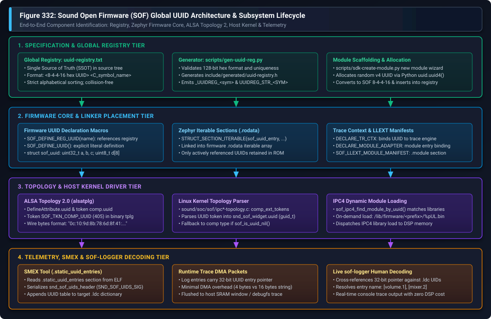
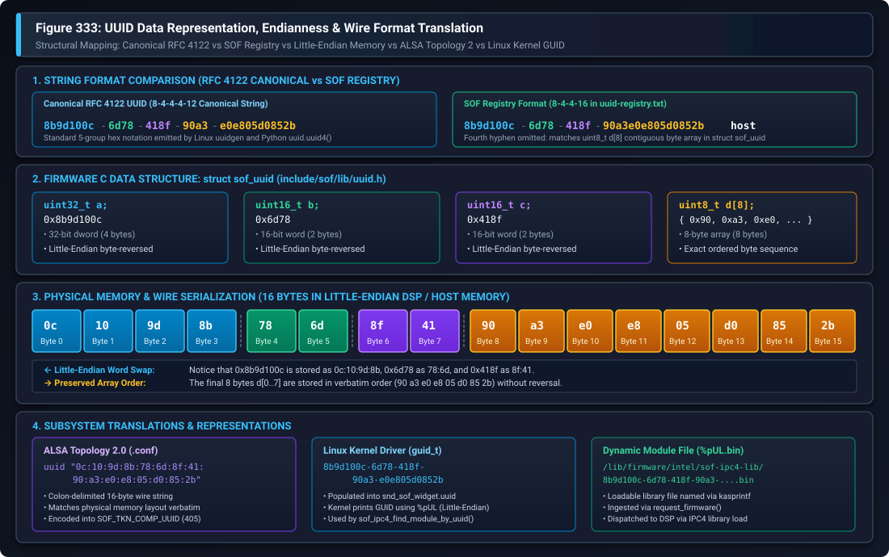

.. _uuid:

UUID Subsystem & Component Identification
#########################################

Sound Open Firmware (SOF) employs **Universally Unique Identifiers (UUIDs)** as the foundational, collision-free mechanism for identifying audio processing components, dynamic loadable modules (LLEXT), digital audio interface (DAI) endpoints, schedulers, and telemetry logging contexts.

This guide provides a comprehensive developer reference for the SOF UUID architecture across all layers of the stack: the global central registry (`uuid-registry.txt`), compile-time header generation, Zephyr RTOS iterable linker sections, ALSA Topology 2.0 configuration, Linux kernel driver parsing, on-demand IPC4 dynamic module loading, and offline/live telemetry log decoding with ``smex`` and ``sof-logger``.

---

Architectural Motivation & The ABI Alignment Problem
****************************************************

In early firmware releases, audio signal processing components were identified via an enumerated integer type (``enum sof_comp_type``). Each new component added a new enum value. However, this approach suffered from severe Application Binary Interface (ABI) fragility across distributed release cycles:

1. **Combinatorial Version Mismatch**:
   An audio subsystem deployment consists of three independent artifacts: the **Topology File** (compiled via ALSA topology tools), the **Linux Kernel Driver** (part of the upstream kernel or distribution package), and the **DSP Firmware Binary** (embedded ROM or signed file in ``/lib/firmware/``). With integer enumeration, there exist :math:`2^3 = 8` potential combinations of component support across topology, driver, and firmware. If an older kernel driver or topology encountered an unrecognized integer enum, audio graph creation failed completely.

2. **Enum Reordering & Collision Risks**:
   If an in-tree or out-of-tree branch renumbered or reordered enum entries, or if two independent vendors developed custom algorithms in parallel, identical integer values collided. One vendor's equalizer component could inadvertently execute another vendor's echo canceller with catastrophic acoustic and memory corruption consequences.

3. **Out-of-Tree & Dynamic Loadable Modules (LLEXT)**:
   Modern SOF firmware supports dynamic linking of loadable extensions (LLEXT) at runtime. Proprietary, third-party, and out-of-tree DSP algorithms cannot rely on centralized, contiguous integer numbering schemes.

Decentralized 128-Bit Identification
====================================

UUIDs (version 4 randomly generated, RFC 4122 compliant) resolve this architectural challenge by providing a permanent, collision-free, distributed namespace. Every component type, processing module, scheduler task, and DAI gateway possesses a globally unique 128-bit identifier.

For backwards compatibility, SOF implements automatic fallback logic: if an older topology file without UUID tokens is loaded, the firmware detects a nil UUID (``sof_is_uuid_nil()``) and falls back to matching legacy component types.

---

System Architecture & End-to-End Lifecycle
******************************************

The SOF UUID subsystem spans four coordinated architectural tiers, depicted in Figure 332:

   Figure 332: Sound Open Firmware (SOF) Global UUID Architecture & Subsystem Lifecycle

The lifecycle progresses through four distinct stages:

1. **Specification & Global Registry Tier**:
   The component developer generates a unique 128-bit identifier and registers it in ``uuid-registry.txt``. During firmware and tools build configuration, ``scripts/gen-uuid-reg.py`` validates the format and uniqueness of every entry, generating the C header ``include/generated/uuid-registry.h``.

2. **Firmware Core & Linker Placement Tier**:
   The component driver invokes ``SOF_DEFINE_REG_UUID()`` or ``SOF_DEFINE_UUID()``. In Zephyr RTOS builds, the definition is placed into an iterable section in ``.rodata`` using ``STRUCT_SECTION_ITERABLE(sof_uuid_entry, ...)``. Memory footprint is strictly optimized: only UUID entries referenced by linked components remain in the final ELF binary. Components bind their trace logging engine via ``DECLARE_TR_CTX()``, and dynamically loadable modules declare their entry points via ``SOF_LLEXT_MODULE_MANIFEST()``.

3. **Topology & Host Kernel Driver Tier**:
   The audio pipeline topology specifies the component UUID in ALSA Topology 2.0 (``.conf``) syntax. The ``alsatplg`` compiler serializes the UUID into token ``SOF_TKN_COMP_UUID`` (token ID 405). The Linux kernel driver (``sound/soc/sof/ipc*-topology.c``) extracts the 16-byte token into ``struct snd_sof_widget.uuid`` (a Linux ``guid_t``). In IPC4 systems, if the module is not already resident in DSP memory, the driver queries ``/lib/firmware/<prefix>/%pUL.bin`` and transfers the module binary on demand.

4. **Telemetry, SMEX & sof-logger Decoding Tier**:
   Post-build, the ``smex`` utility parses the firmware ELF binary, extracts the ``.static_uuid_entries`` section, and serializes the UUID table into the ``.ldc`` log dictionary. At runtime, DSP trace messages pass a compact 32-bit UUID pointer over DMA rather than a 16-byte structure or human-readable string. The host ``sof-logger`` utility matches the 32-bit pointer against the ``.ldc`` dictionary and outputs clean, human-readable component tags (such as ``[volume.1]`` or ``[mixer.0]``).

---

Data Representation, Endianness & Wire Format Translation
*********************************************************

A critical aspect of UUID management in SOF is understanding the translation between canonical RFC 4122 string representations, the SOF internal C structure, physical memory serialization, ALSA topology token strings, and Linux kernel GUIDs.

Figure 333 illustrates the structural byte-by-byte mapping:

   Figure 333: UUID Data Representation, Endianness & Wire Format Translation

The SOF UUID Structure: ``struct sof_uuid``
===========================================

In firmware source code (``src/include/sof/lib/uuid.h``), a UUID is defined as:

.. code-block:: c

   struct sof_uuid {
       uint32_t a;
       uint16_t b;
       uint16_t c;
       uint8_t  d[8];
   } __packed;

This structure divides the 128-bit identifier into four fields:

* ``uint32_t a``: 32-bit integer representing the first 8 hex characters.
* ``uint16_t b``: 16-bit integer representing the second group (4 hex characters).
* ``uint16_t c``: 16-bit integer representing the third group (4 hex characters).
* ``uint8_t d[8]``: An 8-byte array representing the final 16 hex characters.

The "Little-Endian Word Swap" Trap
==================================

Because SOF runs on little-endian processors (x86 host, Tensilica Xtensa DSP, ARM Cortex-M7, and RISC-V), integer types are stored in memory **Least Significant Byte (LSB) first**.

Consider the host component UUID:

* **RFC 4122 Canonical UUID**: ``8b9d100c-6d78-418f-90a3-e0e805d0852b``
* **SOF Registry String**: ``8b9d100c-6d78-418f-90a3e0e805d0852b``

When parsed into ``struct sof_uuid``:

* Field ``a = 0x8b9d100c`` is stored in memory as 4 bytes: ``0x0c, 0x10, 0x9d, 0x8b``
* Field ``b = 0x6d78`` is stored in memory as 2 bytes: ``0x78, 0x6d``
* Field ``c = 0x418f`` is stored in memory as 2 bytes: ``0x8f, 0x41``
* Field ``d[8]`` is an array of 8 individual bytes, so its byte order is preserved verbatim:
  ``0x90, 0xa3, 0xe0, 0xe8, 0x05, 0xd0, 0x85, 0x2b``

Byte-by-Byte Mapping Table
--------------------------

The following table details the physical byte-by-byte mapping from Byte 0 to Byte 15:

.. list-table:: SOF UUID Byte-by-Byte Translation Matrix
   :widths: 8 16 18 16 22 20
   :header-rows: 1

   * - Byte Index
     - RFC 4122 Field
     - Value in RFC 4122
     - ``struct sof_uuid``
     - Wire / RAM Value (LE)
     - Topology 2 Byte
   * - **0**
     - ``time_low[0]``
     - ``8b``
     - ``a`` (LSB)
     - ``0x0c``
     - ``0c``
   * - **1**
     - ``time_low[1]``
     - ``9d``
     - ``a``
     - ``0x10``
     - ``10``
   * - **2**
     - ``time_low[2]``
     - ``10``
     - ``a``
     - ``0x9d``
     - ``9d``
   * - **3**
     - ``time_low[3]``
     - ``0c``
     - ``a`` (MSB)
     - ``0x8b``
     - ``8b``
   * - **4**
     - ``time_mid[0]``
     - ``6d``
     - ``b`` (LSB)
     - ``0x78``
     - ``78``
   * - **5**
     - ``time_mid[1]``
     - ``78``
     - ``b`` (MSB)
     - ``0x6d``
     - ``6d``
   * - **6**
     - ``time_hi[0]``
     - ``41``
     - ``c`` (LSB)
     - ``0x8f``
     - ``8f``
   * - **7**
     - ``time_hi[1]``
     - ``8f``
     - ``c`` (MSB)
     - ``0x41``
     - ``41``
   * - **8**
     - ``clock_seq_hi``
     - ``90``
     - ``d[0]``
     - ``0x90``
     - ``90``
   * - **9**
     - ``clock_seq_low``
     - ``a3``
     - ``d[1]``
     - ``0xa3``
     - ``a3``
   * - **10**
     - ``node[0]``
     - ``e0``
     - ``d[2]``
     - ``0xe0``
     - ``e0``
   * - **11**
     - ``node[1]``
     - ``e8``
     - ``d[3]``
     - ``0xe8``
     - ``e8``
   * - **12**
     - ``node[2]``
     - ``05``
     - ``d[4]``
     - ``0x05``
     - ``05``
   * - **13**
     - ``node[3]``
     - ``d0``
     - ``d[5]``
     - ``0xd0``
     - ``d0``
   * - **14**
     - ``node[4]``
     - ``85``
     - ``d[6]``
     - ``0x85``
     - ``85``
   * - **15**
     - ``node[5]``
     - ``2b``
     - ``d[7]``
     - ``0x2b``
     - ``2b``

.. warning::
   **Do NOT copy canonical RFC 4122 strings directly into Topology 2 files!**
   In ALSA Topology 2 (``.conf``), UUID attributes represent the **exact in-memory byte sequence**. You must apply the Little-Endian byte reversal to fields ``a``, ``b``, and ``c``. Copying ``8b:9d:10:0c:...`` into topology will cause driver and firmware lookups to fail because the firmware expects ``0c:10:9d:8b:...``.

---

The Global UUID Registry & Tooling
**********************************

All UUIDs utilized in shipped SOF binary artifacts (firmware images, topology files, and loadable libraries) must be registered in ``uuid-registry.txt`` located at the root of the firmware repository.

Registry Syntax & Rules
=======================

The ``uuid-registry.txt`` file adheres to strict formatting requirements:

1. **Format**: Each non-comment line consists of two whitespace-separated tokens:
   ``<UUID-in-SOF-format> <C_symbol_name>``
2. **SOF 8-4-4-16 String Notation**:
   Because ``struct sof_uuid`` groups the last 8 bytes as an unbroken array ``uint8_t d[8]``, the SOF registry omits the fourth hyphen found in standard RFC 4122 strings.
   
   * Standard RFC 4122: ``b77e677e-5ff4-4188-af14-fba8bdbf8682``
   * SOF Registry: ``b77e677e-5ff4-4188-af14fba8bdbf8682 volume``
3. **Symbol Constraints**:
   Names must be unique, legal C identifiers of at most 31 characters.
4. **Strict Alphabetical Sorting**:
   Entries must remain sorted alphabetically by C symbol name. The build validation script asserts alphabetical ordering and rejects out-of-order pull requests.
5. **Immutability**:
   Once an identifier is assigned and shipped in any public release or topology, its mapping can never be altered or reused.

Build-Time Header Generation: ``gen-uuid-reg.py``
=================================================

During CMake configuration, ``scripts/gen-uuid-reg.py`` parses ``uuid-registry.txt`` and validates every entry against regular expressions:

.. code-block:: python

   # Validate 8-4-4-16 hex pattern and symbol identifier
   assert re.match(r'[0-9a-f]{8}(?:-[0-9a-f]{4}){2}-[0-9a-f]{16}', uu)
   assert re.match(r'[a-zA-Z_][a-zA-Z0-9_]*', sym)
   assert len(sym) < 32

It generates ``build/include/generated/uuid-registry.h``, emitting two macro definitions for each symbol:

.. code-block:: c

   /* Generated initializer for struct sof_uuid */
   #define _UUIDREG_volume { 0xb77e677e, 0x5ff4, 0x4188, { 0xaf, 0x14, 0xfb, 0xa8, 0xbd, 0xbf, 0x86, 0x82 } }

   /* Generated string literal for tooling and rimage */
   #define UUIDREG_STR_VOLUME "b77e677e-5ff4-4188-af14fba8bdbf8682"

Automated Module Allocation: ``sdk-create-module.py``
=====================================================

When developing a new processing module, the developer can run ``scripts/sdk-create-module.py`` to scaffold the module source tree. The script automatically allocates a fresh version 4 UUID using Python's standard library, converts it to the 8-4-4-16 format, and inserts it into ``uuid-registry.txt`` in sorted order:

.. code-block:: python

   # Generate new random v4 UUID
   new_uuid = str(uuid.uuid4())

   # Strip the last hyphen to conform to SOF 8-4-4-16 format
   parts = new_uuid.rsplit('-', 1)
   custom_format_uuid = ''.join(parts)

   # Insert into data list and sort alphabetically
   data_entries.append((custom_format_uuid, new_name))
   data_entries.sort(key=lambda item: item[1])

---

Firmware C Implementation & Zephyr RTOS Integration
***************************************************

SOF provides clean C preprocessor macros in ``src/include/sof/lib/uuid.h`` for declaring and referencing UUIDs.

Declaration Macros
==================

To define a UUID sourced directly from ``uuid-registry.txt``, invoke ``SOF_DEFINE_REG_UUID()``:

.. code-block:: c

   #include <sof/lib/uuid.h>

   /* Defines volume_uuid using registry definition _UUIDREG_volume */
   SOF_DEFINE_REG_UUID(volume);

This expands into:

.. code-block:: c

   _DEF_UUID("volume", volume_uuid, _UUIDREG_volume)

For specialized or private modules not tracked in the global registry, ``SOF_DEFINE_UUID()`` permits explicit byte definition:

.. code-block:: c

   SOF_DEFINE_UUID("custom_filter", custom_filter_uuid,
                   0x12345678, 0xabcd, 0xef01,
                   0x23, 0x45, 0x67, 0x89, 0xab, 0xcd, 0xef, 0x01);

Zephyr Iterable Sections (``.rodata``)
======================================

In modern Zephyr RTOS builds, ``_DEF_UUID`` utilizes Zephyr's iterable sections mechanism:

.. code-block:: c

   #ifdef __ZEPHYR__
   #define _UUID(uuid_name)    (&_##uuid_name)
   #define _RT_UUID(uuid_name) (&uuid_name)
   #define _DEF_UUID(entity_name, uuid_name, initializer)          \
       const STRUCT_SECTION_ITERABLE(sof_uuid_entry, _##uuid_name) = \
           { .id = initializer, .name = entity_name };            \
       extern const struct sof_uuid                                \
           __attribute__((alias("_" #uuid_name))) uuid_name
   #endif

This design provides three critical advantages:

1. **Linker Script Independence**:
   Zephyr's ``STRUCT_SECTION_ITERABLE`` automatically aggregates all ``struct sof_uuid_entry`` instances into a contiguous array inside ``.rodata`` without requiring platform-specific linker script edits.
2. **Dead Code & Data Elimination**:
   The compiler emits the UUID entry with alias bindings. If a component driver is not selected in Kconfig, its UUID entry is eliminated by the linker during garbage collection (``--gc-sections``).
3. **Trace Dictionary Extraction**:
   The ``smex`` utility scans the resulting contiguous array to build the log dictionary.

Binding UUIDs to Tracing & Module Adapters
==========================================

Once declared, the UUID is bound to the component's trace logging context and module adapter:

.. code-block:: c

   /* 1. Declare trace context with volume_uuid */
   DECLARE_TR_CTX(volume_tr, SOF_UUID(volume_uuid), LOG_LEVEL_INFO);

   /* 2. Declare module adapter interface */
   DECLARE_MODULE_ADAPTER(volume_interface, volume_uuid, volume_tr);

   /* 3. Initialize module in SOF subsystem */
   SOF_MODULE_INIT(volume, sys_comp_module_volume_interface_init);

Dynamic Loadable Modules (LLEXT)
================================

For loadable LLEXT extensions (built with ``CONFIG_COMP_MODULE=y``), the module manifest embeds the UUID directly into the relocatable ELF extension's ``.module`` section:

.. code-block:: c

   #include <module/module/llext.h>

   SOF_LLEXT_MOD_ENTRY(volume, &volume_interface);

   static const struct sof_man_module_manifest mod_manifest __section(".module") __used =
       SOF_LLEXT_MODULE_MANIFEST("VOLUME", volume_llext_entry, 1,
                                 SOF_REG_UUID(volume), 40);

   SOF_LLEXT_BUILDINFO;

---

ALSA Topology Integration
*************************

SOF audio pipelines are instantiated dynamically by parsing ALSA topology configuration files.

Topology 2.0 (Modern Standard: ``.conf``)
=========================================

In ALSA Topology 2.0, component UUIDs are defined as class attributes and instantiated on individual widgets:

Class Definition (``widget-common.conf``)
-----------------------------------------

.. code-block:: text

   Class.Widget."pga" {
       ...
       DefineAttribute.uuid {
           type "string"
           token_ref "comp.uuid"
       }
   }

The token reference ``comp.uuid`` maps to token ID ``SOF_TKN_COMP_UUID`` (value 405) in the topology token registry.

Widget Instantiation (``volume.conf``)
--------------------------------------

When instantiating the widget, the UUID attribute is assigned the 16 colon-separated hex bytes in little-endian wire order:

.. code-block:: text

   Object.Widget.pga.0 {
       name "PGA.1.1"
       index 1
       type "pga"
       no_pm 1

       # Volume UUID: b77e677e-5ff4-4188-af14fba8bdbf8682
       # Wire format: 7e:67:7e:b7 : f4:5f : 88:41 : af:14:fb:a8:bd:bf:86:82
       uuid "7e:67:7e:b7:f4:5f:88:41:af:14:fb:a8:bd:bf:86:82"

       # Prohibit instantiators from altering the UUID
       !immutable [ "uuid" "type" ]
   }

When compiled with ``alsatplg``, the string is parsed into a 16-byte binary tuple and packaged into the ``.tplg`` binary stream.

Topology 1.0 (Legacy Standard: ``.m4``)
=======================================

In legacy Topology 1.0 m4 macros, the UUID was defined using the ``DECLARE_SOF_RT_UUID`` macro and passed via ``SOF_TKN_COMP_UUID``:

.. code-block:: text

   # Legacy m4 declaration
   DECLARE_SOF_RT_UUID("volume", volume_uuid, 0xb77e677e, 0x5ff4, 0x4188,
                       0xaf, 0x14, 0xfb, 0xa8, 0xbd, 0xbf, 0x86, 0x82)

   W_PGA(0, PIPELINE_ID, SOF_TKN_COMP_UUID, STR(volume_uuid), ...)

---

Host Linux Kernel Driver Architecture
*************************************

The Linux kernel SOF driver (``sound/soc/sof/``) handles UUID extraction during topology loading and binds audio widgets to firmware modules.

Token Parsing
=============

In both ``ipc3-topology.c`` and ``ipc4-topology.c``, the driver defines extended component tokens:

.. code-block:: c

   /* Component extended tokens */
   static const struct sof_topology_token comp_ext_tokens[] = {
       {SOF_TKN_COMP_UUID, SND_SOC_TPLG_TUPLE_TYPE_UUID, get_token_uuid,
        offsetof(struct snd_sof_widget, uuid)},
       {SOF_TKN_COMP_CORE_ID, SND_SOC_TPLG_TUPLE_TYPE_WORD, get_token_u32,
        offsetof(struct snd_sof_widget, core)},
       ...
   };

The parser reads the 16 bytes into ``swidget->uuid`` of type ``guid_t`` (Linux kernel 128-bit Globally Unique Identifier type).

IPC3 Component Matching
=======================

In IPC3 architectures, the kernel driver embeds the UUID into ``struct sof_ipc_comp_new_ext`` and transmits it to the DSP during pipeline creation:

.. code-block:: c

   static const struct comp_driver *get_drv(struct sof_ipc_comp *comp)
   {
       ...
       /* If UUID is provided by topology */
       if (comp->ext_data_offset) {
           /* Check for nil UUID: fallback if legacy topology without UUID */
           if (sof_is_uuid_nil(comp_ext->uuid))
               goto comp_type_match;

           /* Search firmware driver registry by UUID */
           drv = comp_driver_find_by_uuid(&comp_ext->uuid);
           if (drv)
               return drv;

           return NULL;
       }

   comp_type_match:
       /* Fallback to traditional component type */
       return comp_driver_find_by_type(comp->type);
   }

IPC4 Module Matching & On-Demand Library Loading
================================================

In IPC4 architectures (Intel cAVS 2.5 and ACE 1.5+), the kernel driver uses the UUID to look up the module descriptor and dynamically load missing libraries:

.. code-block:: c

   static int sof_ipc4_widget_set_module_info(struct snd_sof_widget *swidget)
   {
       struct snd_soc_component *scomp = swidget->scomp;
       struct snd_sof_dev *sdev = snd_soc_component_get_drvdata(scomp);

       /* Find module descriptor by widget UUID */
       swidget->module_info = sof_ipc4_find_module_by_uuid(sdev, &swidget->uuid);
       if (swidget->module_info)
           return 0;

       dev_err(sdev->dev, "failed to find module info for widget %s with UUID %pUL\n",
               swidget->widget->name, &swidget->uuid);
       return -EINVAL;
   }

If the module is not resident in the DSP's base firmware image, ``sof_ipc4_find_module_by_uuid()`` in ``ipc4-loader.c`` triggers dynamic loading:

.. code-block:: c

   static int sof_ipc4_load_library_by_uuid(struct snd_sof_dev *sdev,
                                            unsigned long lib_id, const guid_t *uuid)
   {
       const char *lib_filename;
       int ret;

       /* Construct path: /lib/firmware/<prefix>/<uuid>.bin */
       lib_filename = kasprintf(GFP_KERNEL, "%s/%pUL.bin",
                                sdev->pdata->fw_lib_prefix, uuid);
       if (!lib_filename)
           return -ENOMEM;

       /* Request firmware file and send IPC4 module load command */
       ret = sof_ipc4_load_library(sdev, lib_id, lib_filename, false);
       kfree(lib_filename);

       return ret;
   }

.. note::
   The kernel format specifier ``%pUL`` outputs the GUID string formatted in Little-Endian byte order, which exactly corresponds to the file name in ``/lib/firmware/intel/sof-ipc4-lib/<uuid>.bin``.

---

Telemetry, SMEX & sof-logger Decoding
*************************************

In high-throughput audio DSP systems, passing 16-byte UUID structures or full string identifiers over trace DMA would consume excessive memory bus bandwidth. SOF solves this by using a build-time dictionary extraction scheme.

SMEX Dictionary Extraction
==========================

During firmware compilation, the ``smex`` tool inspects the ELF binary and extracts all entries from the ``.static_uuid_entries`` section (or Zephyr iterable section):

.. code-block:: c

   /* smex/ldc.c */
   ret = elf_read_section(src, ".static_uuid_entries", &section, &buffer);

   memcpy(header.sig, SND_SOF_UIDS_SIG, SND_SOF_UIDS_SIG_SIZE);
   header.base_address = section->vaddr;
   header.data_length = section->size;

   /* Write UIDs header and payload to .ldc dictionary */
   fwrite(&header, sizeof(struct snd_sof_uids_header), 1, image->ldc_out_fd);
   fwrite(buffer, 1, section->size, image->ldc_out_fd);

Runtime Trace DMA Efficiency
============================

When firmware logs an event via ``tr_info()`` or Zephyr ``LOG_INF()``, it passes only the **32-bit memory address** of the component's ``struct sof_uuid_entry`` in the log packet. This consumes only 4 bytes of DMA buffer space per message.

Live sof-logger Decoding
========================

When ``sof-logger`` processes incoming trace DMA packets:

1. It reads the ``.ldc`` file generated by ``smex``.
2. It locates the ``SND_SOF_UIDS_SIG`` header and maps the base virtual address.
3. For each log packet, it calculates the entry offset:
   ``offset = (uintptr_t)entry_ptr - uids_dict->base_address``
4. It reads the null-terminated symbol name from the dictionary and prints a readable component identifier:

.. code-block:: text

   [  14.283120] (0) comp: volume.1 <b77e677e-5ff4-4188-af14-fba8bdbf8682> gain set to -6 dB
   [  14.283145] (0) comp: mixer.0 <bc06c037-12aa-417c-9a97-89282e321a76> channels routed

---

Developer Checklist & Troubleshooting
*************************************

Adding a New Component UUID
===========================

Follow this step-by-step checklist when introducing a new audio component or module:

1. **Allocate a Random Version 4 UUID**:
   Run ``uuidgen`` on Linux or execute Python:

   .. code-block:: bash

      python3 -c "import uuid; print(uuid.uuid4())"

2. **Register in ``uuid-registry.txt``**:
   Remove the fourth hyphen to format as 8-4-4-16 and insert the entry into ``uuid-registry.txt`` in strict alphabetical order:

   .. code-block:: text

      # Example addition
      f4a82b10-3c91-4e78-9a2bf0d87c6e1104 my_new_filter

3. **Define in Component Source**:
   In your component's C source file, include ``sof/lib/uuid.h`` and declare the identifier:

   .. code-block:: c

      #include <sof/lib/uuid.h>

      SOF_DEFINE_REG_UUID(my_new_filter);
      DECLARE_TR_CTX(my_filter_tr, SOF_UUID(my_new_filter_uuid), LOG_LEVEL_INFO);
      DECLARE_MODULE_ADAPTER(my_filter_interface, my_new_filter_uuid, my_filter_tr);

4. **Add to Topology 2.0 (``.conf``)**:
   Perform the little-endian word swap on fields ``a``, ``b``, and ``c``, and define the colon-delimited wire string in your widget configuration:

   .. code-block:: text

      Object.Widget.my_new_filter.0 {
          # f4a82b10-3c91-4e78-9a2bf0d87c6e1104
          # Wire: 10:2b:a8:f4 : 91:3c : 78:4e : 9a:2b:f0:d8:7c:6e:11:04
          uuid "10:2b:a8:f4:91:3c:78:4e:9a:2b:f0:d8:7c:6e:11:04"
          !immutable [ "uuid" "type" ]
      }

Common Troubleshooting Pitfalls
===============================

Issue 1: ``assert sym not in all_syms`` or Registry Build Failure
-----------------------------------------------------------------
* **Symptom**: CMake configuration fails during ``scripts/gen-uuid-reg.py`` execution.
* **Root Cause**: The UUID string has an invalid format, duplicate UUID or symbol name, or ``uuid-registry.txt`` entries are out of alphabetical order.
* **Solution**: Ensure all names are unique, lowercase hex strings are valid 8-4-4-16, and sort entries alphabetically.

Issue 2: Kernel Error: ``failed to find module info for widget ... with UUID %pUL``
-----------------------------------------------------------------------------------
* **Symptom**: Linux kernel prints a topology parsing failure and rejects audio graph creation.
* **Root Cause**: The UUID compiled into the ``.tplg`` file does not match any built-in firmware module or available loadable library.
* **Solution**: Verify the little-endian word swap in the Topology 2.0 configuration. Ensure the first three fields are reversed byte-by-byte into LSB order.

Issue 3: Unresolved Symbol in Firmware Link: ``_UUIDREG_<name>``
----------------------------------------------------------------
* **Symptom**: Firmware compilation fails with undeclared identifier in ``SOF_DEFINE_REG_UUID(my_comp)``.
* **Root Cause**: ``uuid-registry.txt`` was edited, but the generated header ``include/generated/uuid-registry.h`` was not rebuilt.
* **Solution**: Re-run the CMake configuration step or delete the build directory to regenerate headers.
