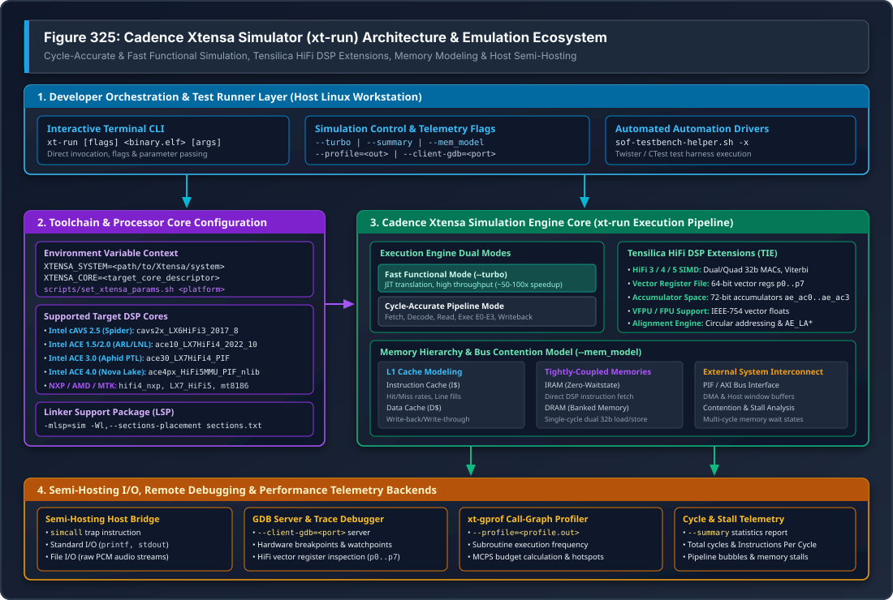
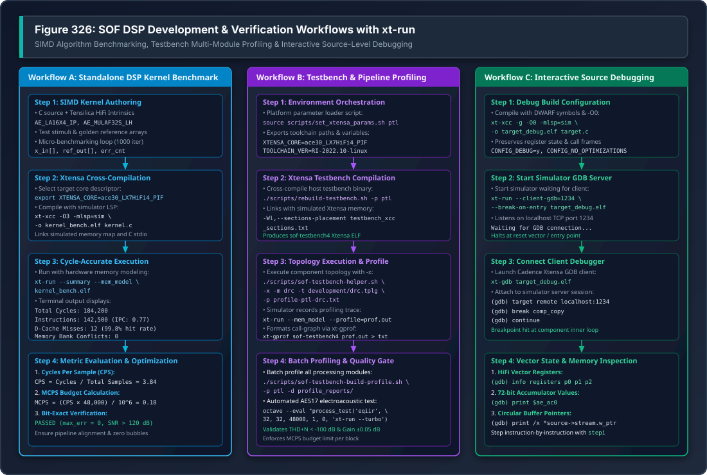

.. _xtrun:

Xtensa Simulator (xt-run) Architecture & Verification Guide
###########################################################

.. contents::
   :local:
   :depth: 3

Sound Open Firmware (SOF) utilizes the proprietary **Cadence Xtensa Simulator**
(``xt-run``) as an instruction-accurate and cycle-accurate execution engine
for pre-silicon DSP algorithm verification, SIMD optimization, host audio
pipeline simulation, and automated unit testing across diverse Tensilica
HiFi architectures.

While host-native POSIX simulation (:ref:`unit_tests`) allows rapid sub-second
test execution and QEMU (``qemu_xtensa``) provides functional execution of
generic kernel primitives, neither can model the micro-architectural nuances of
Tensilica HiFi DSP pipelines. The Cadence Xtensa Simulator bridges this critical
verification gap by executing target-compiled Xtensa ELF binaries with exact
hardware register sets, vector arithmetic pipelines, pipeline stall accounting,
cache hit/miss dynamics, and memory bus contention modeling.

---

Overview & Role in the SOF Verification Pyramid
***********************************************

SOF employs a structured 5-tier verification pyramid to validate DSP firmware
from isolated mathematical algorithms up to full system driver integration on
physical silicon.

.. list-table:: SOF Firmware Verification Hierarchy & Simulator Position
   :widths: 16 22 26 36
   :header-rows: 1

   * - Tier Level
     - Execution Target
     - Scope & Focus
     - Telemetry & Speed
   * - **Tier 1: Unit Tests**
     - ``native_sim`` (Host POSIX)
     - Isolated C algorithms, mocks, ring buffers, state machines.
     - **Milliseconds**; functional logic only (no SIMD execution).
   * - **Tier 2: Host Testbench**
     - Native Host (``sof-testbench4``)
     - Pipeline WAV-to-WAV streaming, multi-component DAG topologies.
     - **Seconds** (10x--100x faster than real time).
   * - **Tier 3: DSP Simulation**
     - **Cadence xt-run** & ``qemu_xtensa``
     - **Cycle-accurate HiFi3/4/5 SIMD**, cache modeling, MCPS budgets.
     - **Seconds to Minutes**; bit-exact hardware validation.
   * - **Tier 4: Hardware Bridges**
     - ESP32-P4 / Teensy 4.1
     - Real DAI buses (I2S, PDM, S/PDIF), clock provider/consumer sync.
     - **Minutes**; physical silicon interface verification.
   * - **Tier 5: Silicon DUTs**
     - Physical Boards (Spider, Dragon Fly, Aphid)
     - Mainline Linux kernel ALSA driver, IPC pumps, power D0ix/D3.
     - **Minutes to Hours**; end-to-end production verification.

Why xt-run is Essential in SOF Development
==========================================

1. **Cycle-Accurate DSP Execution**:
   Unlike generic emulators, ``xt-run`` simulates the exact execution pipeline of
   the target Tensilica core (such as the 5-stage or 7-stage pipeline in HiFi 3,
   HiFi 4, and HiFi 5). It accounts for register read-after-write (RAW) stalls,
   branch misprediction penalties, and multi-cycle arithmetic instruction delays.

2. **Proprietary Tensilica Instruction Extension (TIE) Simulation**:
   SOF audio algorithms rely heavily on Tensilica HiFi SIMD intrinsics (e.g.
   ``AE_LA16X4_IP``, ``AE_MULAF32S_LH``, ``AE_ROUND32F64SSYM``, and VFPU vector
   floating-point instructions). These instructions cannot be executed natively
   on x86 host CPUs. ``xt-run`` provides full bit-exact emulation of all TIE
   instructions, vector registers (``p0``--``p7``), and 72-bit accumulators
   (``ae_ac0``--``ae_ac3``).

3. **Million Cycles Per Second (MCPS) Budget Auditing**:
   Audio processing components operating within real-time DSP pipelines have
   strict cycle budgets per period tick (typically 1 ms at 48 kHz, or 48 audio
   frames). By executing within ``xt-run`` with the ``--profile`` and
   ``--summary`` options, developers calculate exact Million Cycles Per Second
   (MCPS) consumption before deploying code to physical development boards.

4. **Pre-Silicon Architecture Bringup**:
   New silicon generations (such as Intel Panther Lake ACE 3.0 or Nova Lake
   HiFi 5) require functional firmware validation months before physical test
   wafers arrive from the fabrication facility. ``xt-run`` allows the SOF team
   to compile and execute audio firmware against pre-release processor core
   descriptors.

5. **Hardware Memory Alignment & Bank Contention Detection**:
   Tensilica DSP architectures enforce strict memory alignment rules. Loading a
   64-bit vector from an unaligned address or attempting simultaneous dual 32-bit
   accesses to the same physical SRAM memory bank triggers hardware exceptions.
   ``xt-run`` traps these alignment violations and memory bank collisions during
   simulation.

---

Xtensa Simulator System Architecture
************************************

The Cadence Xtensa Simulator operates as a modular simulation platform
integrating core execution engines, processor configuration registries, host
semi-hosting interfaces, and performance profiling tools.

.. _xtrun_system_architecture:

   Figure 325: Cadence Xtensa Simulator (xt-run) Architecture & Emulation Ecosystem

Architectural Layers Breakdown
==============================

The simulation framework shown in :numref:`xtrun_system_architecture`
is organized into four operational layers:

1. **Developer Orchestration & Test Runner Layer (Host Linux Workstation)**:
   The user space execution environment. Developers invoke ``xt-run`` directly
   via the command-line interface or through automated orchestration scripts
   such as ``scripts/sof-testbench-helper.sh`` (for pipeline audio simulations)
   and Zephyr's Twister test runner (for automated unit test execution).

2. **Toolchain & Processor Core Configuration**:
   The Xtensa toolchain relies on an external configuration registry defined by
   ``XTENSA_SYSTEM``. The ``XTENSA_CORE`` environment variable selects the
   hardware-specific core configuration file, defining the instruction set,
   pipeline depth, cache geometry, memory map, and coprocessor availability.
   Linker Support Packages (LSP), such as ``-mlsp=sim``, provide the memory
   map and startup vectors for simulator execution.

3. **Cadence Xtensa Simulation Engine Core**:
   The central execution engine supporting two distinct operational modes:

   * **Fast Functional Mode (``--turbo``)**: Employs dynamic binary
     translation (JIT) to achieve 50x to 100x execution speedups. Ideal for
     functional regression testing and CI test gates where cycle timing is not
     required.
   * **Cycle-Accurate Pipeline Mode**: Models instruction fetch, instruction
     decode, operand read, multi-stage execution (E0 through E3), and writeback.
     Simulates Tensilica HiFi3/4/5 vector registers (``p0``--``p7``), 72-bit
     accumulators, and VFPU vector floating-point coprocessors.
   * **Memory Hierarchy Model (``--mem_model``)**: Simulates L1 instruction
     and data caches (cache hits, misses, line fills, and writebacks),
     zero-waitstate Tightly-Coupled Memories (IRAM and DRAM), and external
     Processor Interface (PIF) / AXI bus latency and bank conflicts.

4. **Semi-Hosting I/O, Debugging & Telemetry Backends**:
   Bridges simulated processor operations to host operating system facilities:

   * **Semi-Hosting Host Bridge**: The Xtensa ``simcall`` trap instruction
     intercepts system calls, routing standard C library operations (``printf``,
     ``fopen``, ``fread``, ``fwrite``) directly to the host filesystem and
     terminal.
   * **GDB Server (``--client-gdb``)**: Exposes a TCP socket enabling remote
     source-level debugging with ``xt-gdb``.
   * **Call-Graph Profiler (``xt-gprof``)**: Processes binary profiling logs
     (``profile.out``) generated by ``--profile`` to produce detailed call
     graphs and subroutine execution statistics.
   * **Cycle & Stall Telemetry (``--summary``)**: Emits a concise execution
     summary detailing total cycles, instructions executed, instructions per
     cycle (IPC), and pipeline stall cycles.

---

Environment Configuration & Target Processor Core Matrix
********************************************************

Running simulations with ``xt-run`` requires setting up the Cadence toolchain
paths and selecting the target core descriptor matching the target hardware
platform.

Core Environment Variables
==========================

.. list-table:: Cadence Xtensa Simulator Environment Variables
   :widths: 24 36 40
   :header-rows: 1

   * - Environment Variable
     - Example Path / Value
     - Purpose & Role
   * - ``XTENSA_TOOLS_ROOT``
     - ``/opt/xtensa/XtDevTools/install/tools``
     - Root installation directory containing Cadence tool releases.
   * - ``XTENSA_SYSTEM``
     - ``$XTENSA_TOOLS_ROOT/RI-2022.10-linux/XtensaTools/config``
     - Path to the processor core configuration registry.
   * - ``XTENSA_CORE``
     - ``ace30_LX7HiFi4_PIF``
     - Specific processor core descriptor matching target hardware.
   * - ``XTENSA_PATH``
     - ``$XTENSA_TOOLS_ROOT/RI-2022.10-linux/XtensaTools/bin``
     - Directory containing ``xt-xcc``, ``xt-clang``, ``xt-run``, ``xt-gdb``.
   * - ``XTENSA_BUILDS``
     - ``$HOME/xtensa/builds/RI-2022.10-linux``
     - Target core system build tree containing include files and LSPs.

SOF Target Platform & Processor Core Matrix
===========================================

SOF supports multiple hardware architectures across Intel, NXP, AMD, and
MediaTek. The table below lists the mapping between SOF platform targets,
Xtensa core descriptors, toolchain versions, and DSP capabilities:

.. list-table:: SOF Target Platform to Xtensa Core Mapping Matrix
   :widths: 15 15 28 20 22
   :header-rows: 1

   * - SOF Platform
     - DUT Target
     - Xtensa Core Descriptor
     - Toolchain Version
     - DSP Architecture
   * - ``tgl``
     - Spider
     - ``cavs2x_LX6HiFi3_2017_8``
     - ``RG-2017.8-linux``
     - LX6 + HiFi 3 SIMD
   * - ``tgl-h``
     - Spider (H)
     - ``cavs2x_LX6HiFi3_2017_8``
     - ``RG-2017.8-linux``
     - LX6 + HiFi 3 SIMD
   * - ``mtl``
     - Dragon Fly
     - ``ace10_LX7HiFi4_2022_10``
     - ``RI-2022.10-linux``
     - LX7 + HiFi 4 SIMD + VFPU
   * - ``lnl``
     - Lunar Lake
     - ``ace10_LX7HiFi4_2022_10``
     - ``RI-2022.10-linux``
     - LX7 + HiFi 4 SIMD
   * - ``ptl``
     - Aphid
     - ``ace30_LX7HiFi4_PIF``
     - ``RI-2022.10-linux``
     - LX7 + HiFi 4 SIMD + PIF
   * - ``nvl``
     - Nova Lake
     - ``ace4px_HiFi5MMU_PIF_nlib``
     - ``RI-2022.10-linux``
     - LX8 + HiFi 5 SIMD + MMU
   * - ``imx8``
     - NXP i.MX 8
     - ``hifi4_nxp_v3_3_1_2_2017``
     - ``RG-2017.8-linux``
     - LX6 + HiFi 4 SIMD
   * - ``imx8m``
     - NXP i.MX 8M
     - ``hifi4_mscale_v0_0_2_2017``
     - ``RG-2017.8-linux``
     - LX6 + HiFi 4 SIMD
   * - ``imx8ulp``
     - NXP 8ULP
     - ``hifi4_nxp2_ulp_prod``
     - ``RG-2017.8-linux``
     - LX7 + HiFi 4 SIMD
   * - ``rn``
     - Renoir
     - ``ACP_3_1_001_PROD_2019_1``
     - ``RI-2019.1-linux``
     - HiFi 5 SIMD
   * - ``rmb``
     - Rembrandt
     - ``LX7_HiFi5_PROD``
     - ``RI-2019.1-linux``
     - LX7 + HiFi 5 SIMD
   * - ``mt8186``
     - MediaTek
     - ``hifi5_7stg_I64D128``
     - ``RI-2020.5-linux``
     - HiFi 5 (7-stage pipeline)
   * - ``mt8195``
     - MediaTek
     - ``hifi4_8195_PROD``
     - ``RI-2019.1-linux``
     - HiFi 4 SIMD

Automating Setup with set_xtensa_params.sh
==========================================

The SOF repository provides ``scripts/set_xtensa_params.sh`` to automate setting
these variables based on the target platform argument:

.. code-block:: bash

   # Source environment parameters for Intel Panther Lake (PTL / Aphid)
   source scripts/set_xtensa_params.sh ptl

   # Verify exported core and toolchain settings
   echo "Core:      $XTENSA_CORE"
   echo "Version:   $TOOLCHAIN_VER"
   echo "Compiler:  $SOF_CC_BASE"

Linker Support Packages (LSP) & Section Placement
=================================================

Cadence cross-compilers require a Linker Support Package (LSP) to resolve
physical memory layouts, vector addresses, and CRT0 startup initialization:

* **Simulator LSP (``-mlsp=sim``)**: Configures a generic flat memory map
  suitable for execution inside ``xt-run``, enabling semi-hosting traps for
  ``printf`` and file I/O.
* **Hardware Target LSPs**: Tailored for physical silicon memory windows, SRAM
  banks, and bootloader ROM entry points. Hardware LSPs cannot run inside
  ``xt-run`` without platform emulation models.
* **Custom Section Placement**: SOF uses custom section placement scripts
  (``testbench_xcc_sections.txt``) to organize large audio buffers, heap
  pools, and BSS memory during testbench cross-compilation without colliding
  with simulator reset vectors:

  .. code-block:: bash

     export LDFLAGS="-mlsp=sim -Wl,--sections-placement tools/testbench/testbench_xcc_sections.txt"

---

Simulator CLI Options & Telemetry Control
*****************************************

The ``xt-run`` executable provides extensive command-line flags controlling
execution modes, memory modeling, profiling, and debugging hooks.

Command-Line Options Reference
==============================

.. list-table:: xt-run Command-Line Options
   :widths: 28 72
   :header-rows: 1

   * - CLI Option Flag
     - Functional Description & Usage
   * - ``--turbo``
     - **Fast Functional Execution**: Enables JIT dynamic translation,
       providing 50x to 100x acceleration. Disables cycle counting; returns
       target exit status. Ideal for automated CI test suites.
   * - ``--summary``
     - **Execution Statistics Report**: Prints a post-execution telemetry
       report detailing total elapsed cycles, instructions executed,
       Instructions Per Cycle (IPC), and pipeline stalls.
   * - ``--mem_model``
     - **Memory & Cache Simulation**: Enables detailed simulation of L1 I-cache,
       L1 D-cache, wait states, and memory bank access conflicts.
   * - ``--profile=<out.profile>``
     - **Execution Profiling**: Generates a binary execution profile compatible
       with ``xt-gprof`` for call-graph generation and MCPS analysis.
   * - ``--client-gdb=<port>``
     - **Remote GDB Server**: Halts the simulator and listens on the specified
       TCP port for an incoming connection from ``xt-gdb``.
   * - ``--break-on-entry``
     - **Halt on Reset Vector**: Halts execution at the target entry point when
       running with ``--client-gdb``.
   * - ``--exit_with_target_code``
     - **Exit Code Propagation**: Propagates the target binary's ``exit(code)``
       directly to the host shell process return code. **Mandatory for CI**.
   * - ``--trace``
     - **Instruction Disassembly Trace**: Dumps executed instructions and
       register modifications to stderr.
   * - ``--trace-cycles``
     - **Cycle Timestamped Trace**: Prepend cycle timestamps to the instruction
       trace output.
   * - ``--core=<core_name>``
     - **Core Override**: Explicitly overrides the ``XTENSA_CORE`` environment
       variable for a single simulation invocation.

Interpreting the --summary Telemetry Report
===========================================

When invoked with ``--summary``, ``xt-run`` outputs detailed micro-architectural
telemetry upon target termination:

.. code-block:: text

   ======================================================================
   Simulation Summary for Core: ace30_LX7HiFi4_PIF
   ======================================================================
   Total Cycles:                  184,200
   Instructions Executed:         142,500
   Instructions Per Cycle (IPC):  0.7736
   Pipeline Bubbles / Stalls:      41,700 (22.64%)
     - RAW Register Stalls:        18,400 (9.99%)
     - Memory Wait States:         14,200 (7.71%)
     - Branch Penalty Cycles:       9,100 (4.94%)
   L1 Instruction Cache:
     - Accesses:                  142,500
     - Misses:                         18 (99.98% Hit Rate)
   L1 Data Cache:
     - Accesses:                   68,400
     - Misses:                         12 (99.98% Hit Rate)
   Memory Bank Contention:              0 conflicts
   Target Exit Status:                  0 (SUCCESS)
   ======================================================================

---

SOF Verification Workflows
**************************

SOF developers utilize ``xt-run`` across three primary verification workflows:
standalone DSP kernel benchmarking, host audio pipeline testbench profiling, and
interactive source-level debugging.

.. _xtrun_verification_workflows:

   Figure 326: SOF DSP Development & Verification Workflows with xt-run

Workflow A: Standalone SIMD Algorithm Benchmarking
==================================================

Workflow A enables rapid prototyping, SIMD vectorization, and cycle-count
optimization of isolated DSP algorithms before integration into SOF components:

1. **Kernel Authoring**:
   Author the algorithm using Tensilica HiFi C intrinsics. The example below
   benchmarks a 32-bit audio volume scaling loop using HiFi 4 vector intrinsics:

   .. code-block:: c
      :caption: standalone_gain_benchmark.c

      #include <stdio.h>
      #include <stdint.h>
      #include <xtensa/tie/xt_hifi4.h>

      #define FRAMES 48
      #define CHANNELS 2
      #define ITERATIONS 1000

      int32_t audio_in[FRAMES * CHANNELS] __attribute__((aligned(8)));
      int32_t audio_out[FRAMES * CHANNELS] __attribute__((aligned(8)));

      void apply_gain_simd(const int32_t *src, int32_t *dst, int32_t gain, int samples)
      {
          ae_f32x2 v_gain = AE_MOVDA32(gain);
          const ae_f32x2 *p_src = (const ae_f32x2 *)src;
          ae_f32x2 *p_dst = (ae_f32x2 *)dst;
          int i;

          for (i = 0; i < samples / 2; i++) {
              ae_f32x2 sample = AE_L32X2_I(p_src, 0);
              p_src++;
              ae_f32x2 scaled = AE_MULFP32X2RAS(sample, v_gain);
              AE_S32X2_I(scaled, p_dst, 0);
              p_dst++;
          }
      }

      int main(void)
      {
          int32_t gain_factor = 0x40000000; // 0.5 (-6 dB) in Q1.31
          int iter;

          // Initialize test stimuli
          for (iter = 0; iter < FRAMES * CHANNELS; iter++) {
              audio_in[iter] = 0x20000000;
          }

          // Benchmark execution loop
          for (iter = 0; iter < ITERATIONS; iter++) {
              apply_gain_simd(audio_in, audio_out, gain_factor, FRAMES * CHANNELS);
          }

          printf("Benchmark completed: %d iterations\n", ITERATIONS);
          return 0;
      }

2. **Cross-Compilation with xt-xcc / xt-clang**:
   Compile the source targeting the desired Xtensa core using the ``-mlsp=sim``
   simulator LSP and ``-O3`` optimization:

   .. code-block:: bash

      export XTENSA_CORE=ace30_LX7HiFi4_PIF
      xt-xcc -O3 -mlsp=sim -o gain_bench.elf standalone_gain_benchmark.c

3. **Execution & Cycle Extraction**:
   Execute the compiled binary with cycle accounting and memory modeling:

   .. code-block:: bash

      xt-run --summary --mem_model gain_bench.elf

4. **Telemetry Analysis & MCPS Calculation**:
   Extract total cycles from the summary report to determine the Cycles Per
   Sample (CPS) and Million Cycles Per Second (MCPS):

   .. math::

      \text{CPS} = \frac{\text{Total Cycles} - \text{Overhead Cycles}}{\text{ITERATIONS} \times \text{FRAMES} \times \text{CHANNELS}}

   .. math::

      \text{MCPS} = \frac{\text{CPS} \times 48{,}000}{10^6}

Workflow B: Host Audio Pipeline Testbench Profiling (Topology 2.0)
==================================================================

Workflow B couples the SOF Host Audio Pipeline Testbench (:ref:`testbench`)
with ``xt-run`` to simulate complete multi-component topologies and generate
hierarchical profiling reports:

1. **Build Testbench for Xtensa Architecture**:
   Cross-compile ``sof-testbench4`` for the target hardware platform:

   .. code-block:: bash

      # Configure toolchain environment for Panther Lake
      source scripts/set_xtensa_params.sh ptl

      # Build testbench binary linked with simulator LSP
      ./scripts/rebuild-testbench.sh -p ptl

   This produces the Xtensa ELF binary at
   ``tools/testbench/build_xt_testbench/sof-testbench4``.

2. **Execute Single Component Profile via Helper Script**:
   Invoke ``scripts/sof-testbench-helper.sh`` with the ``-x`` flag to execute
   inside ``xt-run`` and generate call-graph profile outputs:

   .. code-block:: bash

      ./scripts/sof-testbench-helper.sh -x \
          -m drc \
          -t tools/topology/topology2/development/sof-hda-benchmark-drc32.tplg \
          -p profile-ptl-drc.txt

   Under the hood, the helper script sources ``xtrun_env.sh``, launches the
   simulator with profiling enabled:

   .. code-block:: bash

      $XTENSA_PATH/xt-run --mem_model --profile=profile.out \
          tools/testbench/build_xt_testbench/sof-testbench4 \
          -t sof-hda-benchmark-drc32.tplg -p 1,2 -i in.raw -o out.raw

   It then processes the profile trace via ``xt-gprof``:

   .. code-block:: bash

      $XTENSA_PATH/xt-gprof tools/testbench/build_xt_testbench/sof-testbench4 \
          profile.out > profile-ptl-drc.txt

3. **Automated Batch Profiling Across All Modules**:
   Execute ``scripts/sof-testbench-build-profile.sh`` to cross-compile and
   benchmark all standard SOF processing modules across 24-bit and 32-bit
   formats:

   .. code-block:: bash

      export SOF_WORKSPACE=~/work/sof-ptl
      ./scripts/sof-testbench-build-profile.sh -p ptl -d profile_reports/

   The generated text reports quantify execution time per function, identifying
   hotspots in circular buffer management, coefficient interpolation, and SIMD
   inner loops.

4. **Objective Electroacoustic AES17 Quality Gate**:
   Execute GNU Octave electroacoustic test scripts with ``xt-run --turbo`` to
   validate Total Harmonic Distortion plus Noise (THD+N) and gain accuracy:

   .. code-block:: bash

      octave --eval "process_test('eqiir', 32, 32, 48000, 1, 0, 'xt-run --turbo');"

Workflow C: Interactive Source-Level DSP Debugging
==================================================

Workflow C connects Cadence's ``xt-gdb`` debugger to ``xt-run`` over a local TCP
socket, allowing developers to step through vectorized assembly, inspect vector
registers, and debug memory corruption:

1. **Compile with Debug Symbols**:
   Build the target application or testbench with debug flags (``-g -O0``):

   .. code-block:: bash

      xt-xcc -g -O0 -mlsp=sim -o debug_target.elf debug_target.c

2. **Start Simulator GDB Server**:
   Launch ``xt-run`` with the ``--client-gdb`` and ``--break-on-entry`` flags:

   .. code-block:: bash

      xt-run --client-gdb=1234 --break-on-entry debug_target.elf

   The simulator initializes the virtual processor, loads the ELF into simulated
   memory, halts at the reset vector, and waits on TCP port 1234.

3. **Connect xt-gdb Client**:
   In a separate terminal, launch ``xt-gdb`` and attach to the simulator
   session:

   .. code-block:: bash

      xt-gdb debug_target.elf
      (gdb) target remote localhost:1234
      (gdb) break comp_copy
      (gdb) continue

4. **Inspect Tensilica HiFi Hardware State**:
   Once halted at a breakpoint, inspect core and vector registers:

   .. code-block:: text

      (gdb) info registers p0 p1 p2
      p0             0x0000000100000002  {0x1, 0x2}
      p1             0x0000000300000004  {0x3, 0x4}
      p2             0x0000000500000006  {0x5, 0x6}

      (gdb) print $ae_ac0
      $1 = 0x000000000000123456

      (gdb) print /x *source->stream.w_ptr
      $2 = 0x20004000

      (gdb) stepi
      0x00000428 in apply_gain_simd () at standalone_gain_benchmark.c:26
      26              ae_f32x2 scaled = AE_MULFP32X2RAS(sample, v_gain);

---

MCPS Budgeting & Memory Access Profiling
****************************************

Understanding and optimizing DSP compute consumption requires transforming raw
simulator cycle telemetry into architectural Million Cycles Per Second (MCPS)
budgets.

Mathematical Formulations
=========================

For an audio processing module operating on blocks of :math:`N_{\text{frames}}`
audio frames at a sampling frequency of :math:`f_s` Hz with :math:`N_{\text{ch}}`
channels:

1. **Cycles Per Sample (CPS)**:

   .. math::

      \text{CPS} = \frac{\text{Cycles}_{\text{period}}}{N_{\text{frames}} \times N_{\text{ch}}}

2. **Million Cycles Per Second (MCPS)**:

   .. math::

      \text{MCPS} = \frac{\text{Cycles}_{\text{period}} \times \left(\frac{f_s}{N_{\text{frames}}}\right)}{10^6}

3. **Peak DSP Load Factor**:
   For a DSP core clocked at :math:`F_{\text{clk}}` MHz (e.g. 400 MHz on
   Intel CAVS/ACE):

   .. math::

      \text{Load} = \left(\frac{\text{MCPS}}{F_{\text{clk}}}\right) \times 100\%

Typical SOF Processing Module MCPS Budgets
==========================================

The table below outlines target MCPS budgets for standard SOF processing
modules operating at 48 kHz stereo (2-channel, 1 ms period tick):

.. list-table:: Target MCPS Budgets on Tensilica HiFi 4 (48 kHz Stereo)
   :widths: 22 18 20 40
   :header-rows: 1

   * - Processing Module
     - Target Budget
     - Typical Measured
     - Primary Optimization Bottleneck
   * - **Volume / Gain**
     - :math:`< 0.2` MCPS
     - :math:`0.08` MCPS
     - 64-bit vector load/store alignment.
   * - **Mixin / Mixout**
     - :math:`< 0.2` MCPS
     - :math:`0.12` MCPS
     - Memory bus read bandwidth across streams.
   * - **Parametric EQ (IIR)**
     - :math:`< 1.0` MCPS
     - :math:`0.45` MCPS
     - Second-order Direct Form II Biquad feedback.
   * - **Parametric EQ (FIR)**
     - :math:`< 2.5` MCPS
     - :math:`1.20` MCPS
     - Vector multiply-accumulate (MAC) depth.
   * - **Dynamic Range (DRC)**
     - :math:`< 3.0` MCPS
     - :math:`1.65` MCPS
     - Peak detector envelope log/exp calculations.
   * - **SRC (44.1k to 48k)**
     - :math:`< 5.0` MCPS
     - :math:`2.80` MCPS
     - Polyphase FIR filter phase interpolation.
   * - **Beamformer (TDFB)**
     - :math:`< 4.0` MCPS
     - :math:`2.10` MCPS
     - Multi-channel microphone array FIR summing.
   * - **RTNR Noise Reduction**
     - :math:`< 15.0` MCPS
     - :math:`8.50` MCPS
     - STFT time-frequency transform & Wiener gain.

Cache & Memory Contention Analysis
==================================

Running ``xt-run`` with ``--mem_model`` simulates physical memory bank
conflicts. On Tensilica architectures, Tightly-Coupled Data RAM (DRAM) is
divided into interleaved memory banks (typically two 32-bit banks). When a SIMD
instruction attempts to load two 32-bit values that reside in the same bank
during the same clock cycle, the core introduces a hardware stall cycle.

To eliminate memory bank stalls:

* Align all audio buffers to 8-byte boundaries using
  ``__attribute__((aligned(8)))``.
* Structure interleaved stereo samples such that Left channel samples occupy
  even words (Bank 0) and Right channel samples occupy odd words (Bank 1).
* Use aligned vector load intrinsics (``AE_L32X2_I`` or ``AE_LA16X4_IP``)
  rather than unaligned pointer dereferences.

---

Systematic Troubleshooting & Diagnostics
****************************************

When developing or simulating with ``xt-run``, developers may encounter
exceptions, licensing errors, or memory alignment traps. The table below
provides actionable root-cause diagnostics and remediation procedures:

.. list-table:: Systematic Troubleshooting for Cadence xt-run
   :widths: 26 34 40
   :header-rows: 1

   * - Error Symptom
     - Underlying Root Cause
     - Remediation Procedure
   * - ``EXCCAUSE = 9: LoadStoreAlignmentCause``
     - Unaligned memory access. A 32-bit or 64-bit vector load/store
       instruction was executed on a non-aligned memory address.
     - Enforce 8-byte alignment on all buffer allocations with
       ``__attribute__((aligned(8)))``. Use ``AE_LA*`` alignment pointers for
       circular ring buffers with arbitrary offsets.
   * - ``Error: Core configuration '<core>' not found``
     - The requested ``XTENSA_CORE`` is not registered in the system registry
       defined by ``XTENSA_SYSTEM``.
     - Verify ``XTENSA_SYSTEM`` points to the valid config directory. Check
       available cores in ``$XTENSA_SYSTEM/``. Source
       ``scripts/set_xtensa_params.sh <platform>``.
   * - ``FlexLM License checkout failed: Cannot connect to license server``
     - Cadence toolchain license daemon is unreachable, license expired, or
       ``LM_LICENSE_FILE`` / ``CADENCE_LICENSE_FILE`` is unset.
     - Verify network connectivity to the lab license server. Check license
       environment variables: ``echo $XTENSA_TOOLS_ROOT``.
   * - ``Linker error: section '.text' will not fit in region 'sram'``
     - Executable binary size exceeds the simulated memory boundary allocated
       by the default simulator LSP (``-mlsp=sim``).
     - Link with custom section placement script: ``-Wl,--sections-placement
       tools/testbench/testbench_xcc_sections.txt`` to expand data/heap
       reservations.
   * - ``xt-run returns 0 even though unit test failed``
     - The binary terminated via ``return code`` or ``exit(code)``, but
       ``xt-run`` was invoked without ``--exit_with_target_code``.
     - Always pass ``--exit_with_target_code`` in automated scripts and CI
       runners to propagate non-zero exit codes to the shell.
   * - ``simcall error: Bad file descriptor / Host I/O fail``
     - Simulated semi-hosting attempted to write to an unopened file or
       exceeded host OS open file limits.
     - Check file path existence in simulated code. Verify that file pointers
       returned by ``fopen()`` are non-null before executing ``fread()`` or
       ``fwrite()``.
