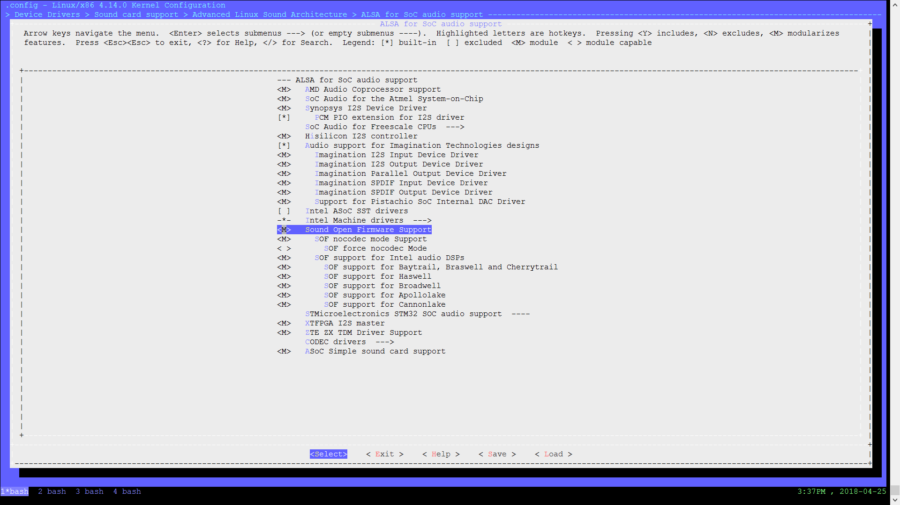

.. _build_from_scratch:

Build From Scratch
##################

.. contents:: 
   :local:
   :depth: 3

You may enable and test |SOF| on a Target machine or VM

.. _supported_targets:

Currently Supported Targets
***************************

* BYT: `SOF on Minnowboard Turbot </display/LINUXAUDIO/SOF+on+Minnowboard+Turbot>`__
* HSW:
* BDW:
* APL: `SOF on GP MRB </display/LINUXAUDIO/SOF+on+GP+MRB>`__
* CNL: `SOF on Cannon Lake </display/LINUXAUDIO/SOF+on+Cannon+Lake>`__

Build SOF binaries
******************

The following steps describe how to install the |SOF| development
environment on Ubuntu 16.04.

This WIKI example code take ~/work/reef/ as the working dir. We keep
most of the git repos in this folder and think they are siblings.

Create the build environment
============================

It's best to put all the SOF code under one common directory structure
to make development easier. We also need to install some dependencies.

.. code-block:: bash

  $ sudo apt-get install libgtk-3-dev libsdl-dev libspice-protocol-dev libspice-server-dev libusb-1.0-0-dev libusbredirhost-dev libtool-bin iasl valgrind texinfo virt-manager kvm libvirt-bin virtinst libfdt-dev libssl-dev pkg-config
  $ mkdir sof
  $ cd sof

Install the xtensa cross compiler (choose one)
==============================================

Choose one of the following 3 options:

1. Use the xtensa cross compiler binaries
-----------------------------------------

The xtensa GCC cross compiler, GDB and binutils are required to build
and debug xtensa binaries on x86 hosts. Each DSP target requires a
different compiler.

.. csv-table:: 
  :header: "Target", "Compiler"
  :widths: 50, 50

  "Baytrail, Cherrytrail, Braswell","xtensa-byt-elf.tar.bz2"
  "Haswell Broadwell", "xtensa-hsw-elf.tar.bz2"
  "Broxton Skylake Kabylake", "xtensa-bxt-elf.tar.bz2"
  "Sue creek", "xtensa-sue-elf.tar.bz2"
  "Canonlake", "xtensa-cnl-elf.tar.bz2"
  "Shared headers", "xtensa-root.tar.bz2"

The pre-compiled cross toolchains can be downloaded from
`bee.sh.intel.com <http://bee.sh.intel.com/>`__

You will need an account on bee with audio group access to checkout the
code. please contact with ying.huang@intel.com to get the right.

TODO: Merge access request wiki into one.

Now in SOF folder scp
`user@bee.sh.intel.com:/git/audio/reef-archive/\*.bz2 <mailto:user@bee.sh.intel.com:/git/audio/reef/*.bz2>`__
you will see six tar packages:

.. code-block:: console 

  -rw-rw-r-- 1 liam audio 22289290 6月 28 2016 xtensa-bxt-elf.tar.bz2
  -rw-rw-r-- 1 liam audio 22328053 6月 28 2016 xtensa-byt-elf.tar.bz2
  -rw-r--r-- 1 pxl audio 22353435 5月 18 14:16 xtensa-cnl-elf.tar.bz2
  -rw-rw-r-- 1 liam audio 22357873 7月 27 2016 xtensa-hsw-elf.tar.bz2
  -rw-rw-r-- 1 liam audio 12777297 5月 18 14:24 xtensa-root.tar.bz2
  -rw-rw-r-- 1 liam audio 126476764 3月 7 2017 xtensa-sue-elf.tar.bz2

.. code-block:: bash

   $ tar xvjf xtensa-bxt-elf.tar.bz2
   $ tar xvjf xtensa-byt-elf.tar.bz2
   $ tar xvjf xtensa-hsw-elf.tar.bz2
   $ tar xvjf xtensa-cnl-elf.tar.bz2
   $ tar xvjf xtensa-sue-elf.tar.bz2
   $ tar xvjf xtensa-root.tar.bz2

This will install the xtensa cross compilers locally. Please now add
sof/xtensa-platforms-elf/bin,to your $PATH

.. code-block:: bash

  $ export PATH=~/work/sof/xtensa-byt-elf/bin/:$PATH
  $ export PATH=~/work/sof/xtensa-sue-elf/bin/:$PATH
  $ export PATH=~/work/sof/xtensa-bxt-elf/bin/:$PATH
  $ export PATH=~/work/sof/xtensa-hsw-elf/bin/:$PATH
  $ export PATH=~/work/sof/xtensa-cnl-elf/bin/:$PATH

This will make sure the xtensa compilers can be run from your bash
shell.

2. Build Toolchain from source
------------------------------

.. code-block:: bash

  $ cd ~/work/sof/
  $ git clone htts://github.com/01org/osadsp-crosstool-ng.git ct-ng.git
  $ cd ct-ng.git

Build crosstool-NG

.. code-block:: bash

  $ ./bootstrap
  $ ./configure --prefix=`pwd`
  $ make 
  $ make install

Now build the xtensa cross compiler for platforms.

Now we support platform to be byt, hsw, bxy, cnl, sue

.. code-block:: bash

  $ ./ct-ng xtensa-byt-elf
  $ ./ct-ng build

The cross compiler is now built in builds folder

Now add the Xtensa cross compiler to your PATH.

.. code-block:: bash

  export PATH=~/work/sof/ct-ng.git/builds/xtensa-byt-elf/bin:$PATH

Build the headers

.. code-block:: bash

  $ cd ~/work/reef/
  $ git clone https://github.com/jcmvbkbc/newlib-xtensa.git
  $ cd newlib-xtensa.git
  $ git checkout -b xtensa origin/xtensa
  $ ./configure --target=xtensa-byt-elf --prefix=~/work/sofcd ../xtensa-root
  $ make
  $ make install

Above is the example for BYT, you may need to repeat for other
platforms.

3. Use xt-xcc
-------------

First follow the below instruction to set up the Xtensa Xplorer

`Xtensa Xplorer Set Up on Ubuntu </display/LINUXAUDIO/Xtensa+Xplorer+Set+Up+on+Ubuntu>`_

.. note:: 

  Xplorer tools version varies from platform to platform. Please see
  the platform pages for more information.

Install alsa-lib alsa-utils alsa-plugins
========================================

This is needed for the topology build and some new features of alsa and
may need to be installed in both the host and target machines.

Download the code from Git using ssh:

.. code-block:: bash

   $ git clone git://git.alsa-project.org/alsa-lib.git
   $ git clone git://git.alsa-project.org/alsa-utils.git
   $ git clone git://git.alsa-project.org/alsa-plugins.git

or http:

.. code-block:: bash

   $ git clone http://git.alsa-project.org/http/alsa-lib.git
   $ git clone http://git.alsa-project.org/http/alsa-utils.git
   $ git clone http://git.alsa-project.org/http/alsa-plugins.git

The release download can be found here: https://www.alsa-project.org/main/index.php/Download

From each folder run this to build and install:

.. code-block:: bash

   $ ./gitcompile
   $ sudo make install

Copy to the x86\_64-linux-gnu folder

.. code-block:: bash

   $ sudo cp /usr/lib/libasound.\* /usr/lib/x86\_64-linux-gnu/
   $ sudo cp /usr/lib/alsa\_lib/\* /usr/lib/x86\_64-linux-gnu/alsa-lib

Install the image builder
=========================

Checkout and install the ELF firmware image builder (called rimage). 
rimage converts ELF executables to binary audio DSP images using the
CoE file format.

Enter your sof folder and run:

.. code-block:: bash

    $ git clone git://git.alsa-project.org/sound-open-firmware.git sof.git
    $ cd sof.git
    $ ./autogen.sh
    $ ./configure --enable-rimage
    $ make
    $ sudo make install

.. note:: 
   
   If building the topology files fails there is need to git clone
   the alsa-lib, build it, but omit the last "make install" step to avoid
   audio issues on your development computer. For example if alsa-lib was
   build under ~/sof-sdk/alsa-lib run the rimage make with command
   "LD\_LIBRARY\_PATH=$HOME/sof-sdk/alsa-lib/src/.libs make".

Build SOF firmware source code and build an image
=================================================

Still in sof.git

For BYT:

.. code-block:: bash

   $ ./configure --with-arch=xtensa --with-platform=baytrail --with-root-dir=`pwd`/../xtensa-root/xtensa-byt-elf --host=xtensa-byt-elf

For BXT:

.. code-block:: bash

   $ ./configure --with-arch=xtensa --with-platform=broxton --with-root-dir=`pwd`/../xtensa-root/xtensa-bxt-elf --host=xtensa-bxt-elf

For CNL:

.. code-block:: bash

    $ ./configure --with-arch=xtensa --with-platform=cannonlake --with-root-dir=`pwd`/../xtensa-root/xtensa-sue-elf --host=xtensa-sue-elf

Run: 

.. code-block:: bash 

    $ make
    $ make bin

The last make bin step converts the ELF binary to CoE binary format
using rimage.

Copy the firmware binary(e.g. sof-byt.ri) to /lib/firmware/intel/ onto your
target machine

.. code-block:: bash

    $ scp src/arch/xtensa/sof-byt.ri root@targethost:/lib/firmware/intel/

or VM (make sure the VM is booted after #10, then run the following command
on reef source):

.. code-block:: bash

    $ scp -P 5555 src/arch/xtensa/sof-byt.ri root@localhost:/lib/firmware/intel/

.. _build_tools_and_topology:

Build tools and topology from sound-open-firmware-tools
=======================================================

Goto your sof workspace folder.

.. code-block:: bash

    $ git clone git://git.alsa-project.org/sound-open-firmware-tools.git soft.git
    $ cd soft.git
    $ ./autogen.sh
    $ ./configure
    $ make
    $ sudo make install

The make will create tplg files in topology folder

Copy the firmware binary(e.g. sof-byt.ri) to /lib/firmware/intel/ on your
target machine

.. code-block:: bash

    $ scp topology/sof-byt-rt5651.tplg root@targethost:/lib/firmware/intel/

or VM (make sure the VM is booted after #10, then run the following command on reef source folder):

.. code-block:: bash

    $ scp -P 5555 topology/sof-byt-rt5651.tplg root@localhost:/lib/firmware/intel/

Build your kernel
=================

Use this branch: https://github.com/plbossart/sound/tree/topic/sof-v4.14

Go to your sof workspace folder

.. code-block:: bash

    $ git clone https://github.com/plbossart/sound.git
    $ cd sound

Recommended branch for the following is topic/sof-v4.14

.. code-block:: bash

    $ make menuconfig

Navigate to :menuselection:`Device Drivers --> Sound card support --> Advanced Linux Sound Architecture --> ALSA for SoC audio support`

Select SOF related options (You may also need to disable SST HDA audio
drivers or to add them into blacklist)

|image0|

Exit and save the config

.. code-block:: bash

    $ make deb-pkg -j8
    $ cd ..

Copy the deb packages to you target machine

.. code-block:: bash

    $ scp linux-*_amd64.deb  root@targethost:~/debs/

or VM (make sure the VM is booted after #10, then run the following command on reef source folder):

.. code-block:: bash

    $ scp -P 5555 linux-*_amd64.deb root@localhost:~/debs/

Set up target machine
*********************

Check that your target is :ref:`supported <supported_targets>` before
continuing, otherwise you may need a VM.

Install the kernel
==================

Go to ~/debs/ and install the deb packages you copied to the target machine
in the previous step

.. code-block:: bash

    $ sudo dpkg -i * linux-*_amd64.deb

Install the rmbox tools
=======================

See host :ref:`build <build_tools_and_topology>` steps.

Set up user group
=================

*root* user can not run ``pluseaudio``, so please create another user to
test PCMs. You also need to add this user to the audio group to have
access to PCMs

.. code-block:: bash

    $ usermod -G audio-a <userid>

Enable and test with SOF
========================

Reboot the system and run ``aplay -l`` to verify the presence of the sound
card and other devices. 

.. code-block:: bash

    $ aplay -l
    **** List of PLAYBACK Hardware Devices ****
    card 0: sofbytcrrt5651 [sof-bytcr-rt5651], device 0: Passthrough (*) []
     Subdevices: 1/1
     Subdevice #0: subdevice #0

If anything goes wrong, please review and save ``dmesg`` output.

Create a VM
***********

Install the Qemu VMs
====================

Qemu can be used to debug and perform introspection without running the
firmware on real hardware.

.. code-block:: bash

    $ cd ../sof
    $ git clone user@bee.sh.intel.com:/git/audio/reef/qemu-xtensa
    $ git checkout embargo
    $ ./configure --prefix=. --target-list=xtensa-softmmu,x86_64-softmmu --enable-gtk --enable-sdl --enable-spice --audio-drv-list=alsa --enable-libusb --enable-usb-redir --enable-coroutine-pool --disable-opengl --enable-fdt
    $ make

Do not ``make install`` qemu as this will overwrite your distros Qemu
version.

Create a new Ubuntu VM
======================

A VM running Linux is required for testing driver and firmware
together. It's best to install the VM using an iso file (e.g. Ubuntu
15.10). There are plenty of instructions on how to create an Ubuntu VM
online, and it's best to use Virtual Machine `Manager`_ (installed as part
of environment setup in stage

.. note:: 
   Use a minimum file system size for your VM of 16GB, and set VM RAM
   size to 2GB 

After the VM has been created you will need to copy the file system
image file to your local reef directory and own it as your user.

.. code-block:: bash

    $ cd ../sof
    $ sudo cp /var/lib/libvirt/images/image-name .
    $ sudo chown user.user image-name

Update the qemu scripts
=======================

Update the qemu init scripts to point to your VM
image file and reef image. This wont be required in the future, but
please edit the following files, and make sure they point to your
VM image and reef firmware image files.

.. code-block:: bash

    $ cd qemu
    $ vi xtensa-host.sh
    $ vi x86-host.sh

Update the kernel on your VM
============================

Update the default kernel to use your kernel with
Reef firmware support.

.. code-block:: bash
   
   #start the VM
   $ ./x86-host.sh 
   # Copy the kernel to the VM. SSH is running on localhost port 5555 for VM
   $ scp -P 5555 linux.deb user@\ `localhost:/home/user <http://localhost/home/user>`__
   # Log onto VM and install kernel.deb
   $ ssh -p 5555 user@localhost
   # install the kernel and shutdown VM

.. todo:: 

   steps appear to be missing from this update kernel instructions

Run the driver and firmware on VMs
==================================

It's important to start the DSP VM first, so it is ready for the
driver running on the other VM.

Open two terminals:

#. Xtensa VM

   .. code-block:: bash

      $ ./xtensa-host.sh byt

#. Host OS (Ubuntu)

   .. code-block:: bash

      $ ./x86-host.sh byt
 
You will now see the FW booting and responding to IPC from the kernel
in terminal 1.

.. _Manager: http://virt-manager.org/
