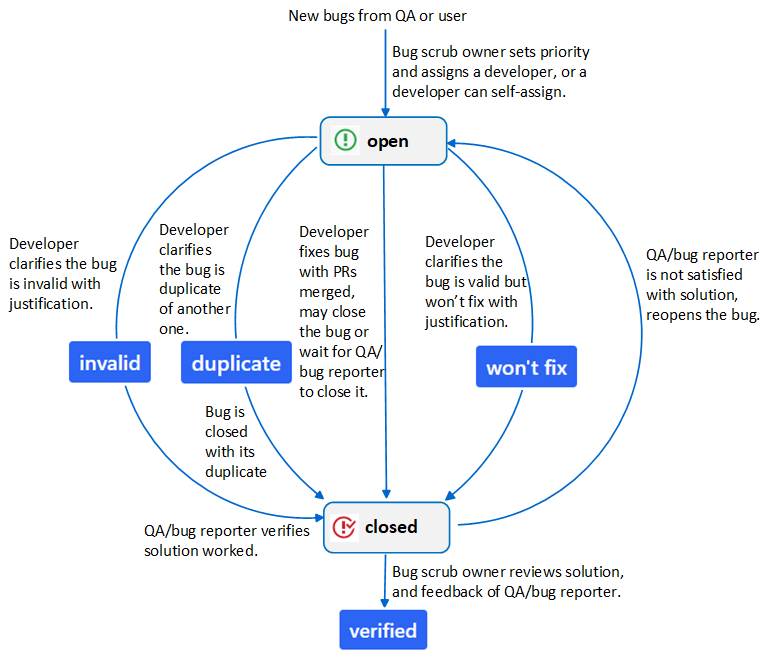
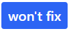
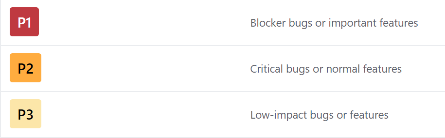
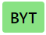
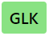
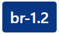
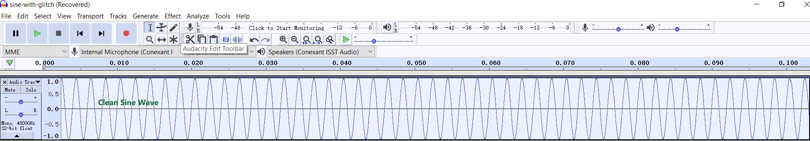
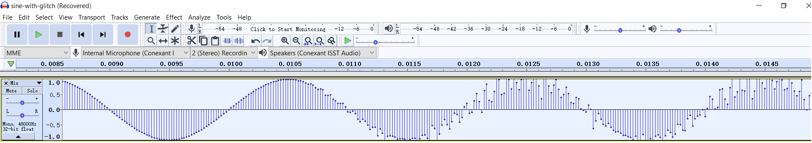
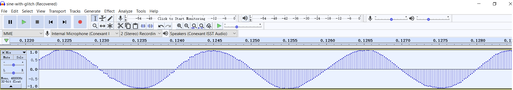

.. _bug_tracking:

Bug Tracking
############################
Bug type of issues have a label |label-bug|.

.. |label-bug| image:: images/label-bug.png
        :scale: 70

GitHub issues only have 2 states: open, closed. So *labels* are defined
to assist SOF bug tracking.

.. contents::
   :local:
   :depth: 3

Life Cycle of a Bug
*********************
The life cycle of a bug is also the workflow for bugs. Here is a graphic
representation of this life cycle.

Labels
********
Please find the labels from https://github.com/thesofproject/sof/labels.

* *Solution*, *priority* and *platform* labels are common for SOF
  firmware, linux kernel driver and tool repositories.

* *Branch* labels are repository-specific.

Solution Labels
----------------
Usually a developer will fix a bug by submitting pull requests. This
is the default solution and so doesn't any solution label.

Otherwise, **developers** need to add a label |label-invalid|,
|label-duplicate| or |label-won't-fix| to indicate the solution with
justication.

.. |label-duplicate| image:: images/label-duplicate.png
        :scale: 70

Label |label-verified| is only added by the **bug scrub owner** after
reviewing the solution and feedback from QA and bug reporter.

.. |label-verified| image:: images/label-verified.png
        :scale: 70

Priority Labels
-----------------
**Bug scrub owner** should use them to set priority to a bug according
to its impact.

Plaform and Branch Labels
----------------------------
Used by **QA** and **bug reporter**.

*Platform* labels are used to specify a platform or multiple platforms on
which a bug is observed, e.g. |label-byt|, |label-apl|, |label-glk| ...

.. |label-apl| image:: images/label-platform-apl.png
        :scale: 70

*Branch* labels are used specify a branch or multiple branches on which
a bug is observed, e.g. |label-branch-v1.2|, |label-branch-glk|,
|label-branch-master| ...

.. |label-branch-glk| image:: images/label-branch-glk.png
        :scale: 70

.. note::
    *Platform* labels should always be applied.

    *Branch* labels are usually only applied when the branch is not
    the default branch for developing/release on the platform.

    **QA** should *update (add/remove)* platform and branch labels
    according to texample-trace-point.pnghe latest bug status.

Other optional Labels
-----------------------

Two optional labels can be used to call for attention.

* |label-blocked| - Blocked by some dependency, whichh applies to either
  feature implementation or bug reproduction.

* |label-need-info| - Further information is requested.

.. |label-blocked| image:: images/label-blocked.png
        :scale: 70

How to Report a Bug
********************
Please
`create a issue <https://help.github.com/articles/creating-an-issue/>`_
and apply label |label-bug|.

And please provide the following information:

* Title
     * The title should be a clear and concise summary of the bug.

     * The title must be unique and descriptive. Bad examples are
       "ipc timeout" and "topology failed to load". Ideally the title
       should contain keywords from the kernel, firmware, or user space
       error message.

     * The title should also contain a prefix indicating the area of
       failure e.g. "ipc:", "topology:", "pipeline:"

* Environment
    * Branch name and commit hash of 3 repositories: sof (firmware),
      linux (kernel driver) and soft (tools & topology).

    * Name of the topology file

    * Name of the platform(s) on which the bug is observed.

    * Reproducibility Rate. If you can only reproduce it randomly,
      it's useful to report how many times the bug has been reproduced
      vs. the number of attempts it’s taken to reproduce the bug.

* Steps to reproduce
   * The steps must be precise. And please help to narrow down the steps.

   * Please number the steps from beginning to end so developers can
     easily follow through by repeating the same process

* Expected Result
   * Describe what the user should expect.

* Actual Result
   * In contrast to the expected behavior, describe what currently happens.

* Proof
    * Please paste the relevant *dmesg* and *firmware logger data* to the
      comment box. The pasted data should contain the actual crash or
      error but also the conditions prior to the bug, i.e. also copy the
      10 lines before the crash.

      For firmare boot failure, the pasted dmesg must include the
      *trace point* which indicates the progress of firmware boot process:

      |trace-point|

    * Entire kernel message and firmware logger text should also be
      attached for reference.

    * If you cannot hear sound for playback or capture, please attach
      your amixer settings. If there is a mixer setting seems wrong,
      please paste the relevant amixer item in the comment box.

    * For audio quality issues (eg. noise, glitch sound and distortion
      etc), it's helpful to

      * play/capture a sine wave, attach the captured wave file with
        quality issue.

        *note:* You can
        use `Audacity <https://www.audacityteam.org/>`_
        to `generate a sine wave  <https://acad.carleton.edu/courses/musc108-00-f14/pages/11/11Lab1.html>`_.
        Here is the screenshot of a sine wave:
	|sine-wav|

      * share the parameters of the sine wave: frequency, sample rate,
        format and number of channels.

      * share the waveform screenshot where the glitch/distortion happens
        shown by Audacity (> 10ms).

        Here is an example of a sine wave with glitch sound:
        |sine-with-glitch|

        Please also zoom in to show the start of the glitch sound,
        |start-of-glitch|

	and the end of the glitch.
        |end-of-glitch|

.. |trace-point| image:: images/example-trace-point.png
        :scale: 75

.. |sine-with-glitch| image:: images/audacity-sine-wave-with-glitch.png
        :scale: 75

.. note::
    If you have multiple issues, please file them separately so they can
    be tracked more easily.

    Please use `markdown <https://guides.github.com/features/mastering-markdown/>`_
    for formatting example commands, code, diffs, patches etc.

How to Close a Bug
********************

* For bugs fixed by pull requests

    *Developers* can use
    `keywords <https://help.github.com/articles/closing-issues-using-keywords/>`_
    to close one or multiple bugs via pull requests automatically.

    *Developers* can also leave the bug open, and *QA* should close the
    bug if it cannot be reproduced after verification.

* For bugs with label |label-invalid| or |label-won't-fix|,
  *develpers* should close them with justification.

* For bugs with label |label-duplicate|,
  please keep the bug open until its duplicate is resolved and closed.

.. note::
    After the pull request(s) is merged, *developer* should always
    **@** *bug reporter* and **@** *QA engineer* who tracks this bug
    to verify the solution.

    Usually the right QA engineer is the bug reporter or who updates the
    bug status in the comment box. If you don't know who is the QA
    engineer, please **@** *bug scrub owner*.

.. _reStructuredText: http://sphinx-doc.org/rest.html
.. _Sphinx: http://sphinx-doc.org/
