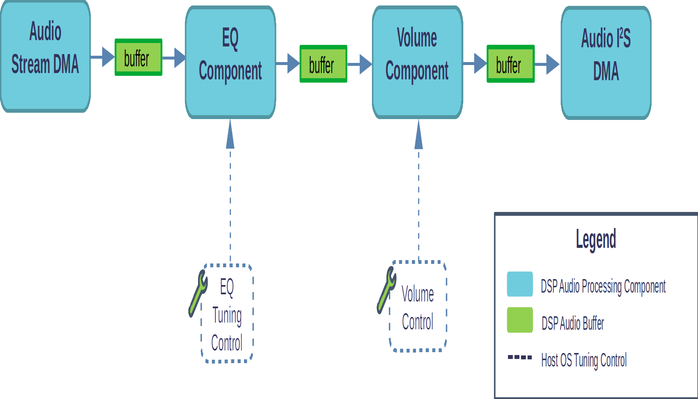
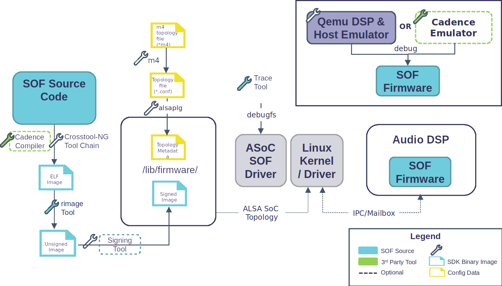

.. _introduction:

Introduction to the SOF Project
###############################

|SOF| (SOF) is an open source audio Digital Signal Processing (DSP) firmware
infrastructure and SDK. SOF provides infrastructure, real-time control
pieces, and audio drivers as a community project. The project is governed by
the |SOF| |TSC| (TSC) that includes prominent and active developers from the
community. SOF is developed in public and hosted on the github platform.

The firmware and SDK are intended for developers who are interested in
audio or signal processing on modern DSPs. SOF provides a framework where
audio developers can create, test, and tune the following:

- Audio processing pipelines and topologies.

- Audio processing components.

- DSP infrastructure and drivers.

- Host OS infrastructure and drivers.

	`Example Equalizer pipeline with host OS control of EQ coefficients and pipeline volume.`

|SOF| has a modular and generic codebase and can be ported to different DSP
architectures or host platforms. See the list of currently supported DSP
architecures and supported platforms.

SDK Introduction and Overview
=============================

The |SOF| SDK is comprised of many ingredients that can be customized for
use in the firmware/software development lifecycle. Customization allows for
a "best fit" development approach where the SDK can be optimized for a
particular process or environment. Some SDK ingredients are optional while
there can be more than once choice for other ingredients as shown in the diagram below.

	`SDK example configuration showing development flow for SOF on the Intel Apollo Lake platform running Linux OS. Note the choice of compiler toolchains and choice of optional DSP emulators.`

SOF source code, tools, and topologies
--------------------------------------

All firmware, tools, and topologies exists in the main SOF git repository.
On a high level, the repo contains:

- Firmware - written in C with some architecture-specific assembler; it does not link to external dependencies.

- Test Bench - allows firmware components and pipelines to run on developers' host PCs.

- Image Tools - C tools for converting ELF files to binary firmware images that can run on HW.

- Debug Tools - scripts and tools that can be used to debug firmware.

- Trace Tools - text-based tools that can display tracing data from firmware.

- Tuning Tools - MATLAB/Octave scripts that can be used to create tuning coefficients for audio components.

- Runtime Tools - command line applications that can be used to exchange data with running firmware.

- Topologies - real and example topologies that show construction of simple and complex audio processing pipelines.

Host OS Drivers
---------------

SOF can be configured and controlled by a host OS driver or it can
optionally run as standalone firmware. SOF host drivers currently support
Linux OS.

The SOF driver has a modular stack-based architecture that is dual-licensed
BSD & GPL code, allowing it to be ported to other OSes and RTOSes.

The host driver is responsible for:

- Loading firmware from the host file system into DSP memories and booting.

- Loading topologies from the host file system into DSP.

- Exposing audio control devices to applications.

- Exposing audio data endpoints to applications.

- Managing IPC communication between the host and DSP.

- Abstraction of the host-side DSP hardware to common API operations.

The Linux SOF ALSA/ASoC driver is upstream in Linux v5.2 onwards.

Firmware Toolchain
------------------

GNU GCC can be used as a free SOF compiler alongside proprietary DSP vendor
compilers. The choice of compiler is up to the user, depending on features
and budget. GCC complier is open source.

DSP Emulator
------------

Qemu can be used to provide a functional emulator to simultaneously trace and
debug driver and DSP firmware code. Proprietary emulators are also available.

Emulation is also used within SOF CI for feature validation prior to merging
new code.

General FAQ
===========

What license does the firmware use?
  The firmware is released using a standard BSD 3-clause license with some
  files released under MIT.

Do I need to open source my firmware code changes?
  No. The firmware BSD and MIT licensed code means you can keep code
  changes private. Patches are always welcomed if you do decide to open
  source work.

What license does the host driver use?
  Most of the host driver code is dual-licensed BSD or GLPLv2 only
  (user's choice). The part of the driver that is GPLv2 only is the Linux
  integration layer at the top of the driver stack.

Do I need to open source my driver code changes?
  No, for the bottom two layers of the driver stack. For example, if you are
  porting the driver to another OS, these changes can be kept private. Note
  that all driver GPL source files are Linux-specific and should not be
  ported to another OS.

How can I get involved?
  The best way to get involved is via github. You can also join our
  low-volume `mailing list <http://alsa-project.org/mailman/listinfo/sound-open-firmware>`_.

What is the development model?
  |SOF| is entirely developed on github. Patches via Pull Requests are
  reviewed, discussed, and tested by CI before being merged. The intended
  release cadence is every 6 - 8 weeks. A stable release is tagged after
  passing QA; development continues for the next release.

Who works on |SOF|?
  Professional developers from a number of companies (check the git
  logs if you want to know) with some hobbyist developers, too.

How do I add support for host architecture X?
  See the SOF architecture pages.

How do I add support for host platform X?
  Adding a new host platform is a lot simpler than adding a new DSP
  architecture. A new host platform consists of adding a new src/platform/
  directory, together with mappings for memory, IRQs, GPIOs, and peripheral
  devices in the DSP memory space. New drivers may also have to be added
  (e.g. for DMA, I2S) to the drivers directory.

How do I port to other OSes?
  See the SOF host architecture page.

What audio components are supported?
  |SOF| now supports a small library of free and open source components that
  are distrubuted alongside the source code. SOF can also support proprietary
  audio processing components provided they are wrapped to use the SOF
  component API. See the audio components page for a list of open
  source components and their capabilites.

How do I create my own pipelines?
  Pipelines are currently defined using the M4 macro processing language.
  The M4 topology is then preprocessed to the alsaconf format before being
  compiled into a binary. An Eclipse-based GUI for pipeline construction is
  currently under development.

  Today, both static (built in) and dynamic (loaded at runtime) pipelines are
  supported in upstream.

Can I add my own media encoder/decoders?
  Yes.

Can I add non-audio functions?
  Yes. The instruction sets used by DSPs are also good at non-audio
  processing tasks such as low-power sensor signal processing. If
  your DSP has physical IO ports to which other non-audio devices can be connected, then data can also be processed from these devices.

Toolchain FAQ
=============

Which Xtensa toolchains does SOF currently support?
  Two toolchain families are currently supported by SOF: The GCC and the Cadence XCC.

  These families are subdivided into toolchains per Xtensa ISA because the Tensilica architecture contains a variable instruction set so you must use the toolchain variant that matches your platform.

  1. Custom, open-source GCC toolchains built with crosstool-NG as
     documented in the getting started guide. These must be built from
     source. For instructions, refer to the following:

     - :ref:`build-toolchains-from-source` in the Getting Started Guide
       for building SOF from scratch

     - `Toolchains and embedded distributions <http://wiki.linux-xtensa.org/index.php/Toolchain_and_Embedded_Distributions>`_

  2. Cadence's partially closed source toolchains. The Cadence XCC compiler
     is proprietary but uses the open source GNU binutils. XCC must be
     bought from Cadence. For more information, see:

     - :ref:`build-3rd-party-toolchain`

     - `Cadence IP portfolio <https://ip.cadence.com/ipportfolio/tensilica-ip>`_

     The Cadence binutils patches or overlays are located in the SOF git
     repo.

     Note that Cadence is not the only Tensilica user; some Xtensa
     toolchains come from `elsewhere <https://docs.zephyrproject.org/latest/boards/xtensa/index.html>`_. However, as of June 2020, all platforms
     supported by SOF come from Cadence.

What are the primary differences between Cadence and gcc toolchains?
  gcc toolchains are completely open source. Cadence's toolchains use either
  a gcc-based or a clang-based open source frontend and a closed-source
  backend that matches the platform.

  XCC supports full Xtensa HiFi SIMD intrinsics whereas GCC has no HiFi SIMD
  support. This can lead to large performance differences, especially in
  code that deals with audio processing.

Cadence xt-xcc or Cadence xt-clang?
  It depends on the platform. As of June 2020, most platforms supported by
  SOF rely on xt-xcc. Going forward, all newer platforms require xt-clang.
  The gcc frontend doesn't support unusually large registers, hence the move
  to xt-clang.

  Note that xt-xcc does not fully support C99. xt-clang does.

Is support for other toolchains forthcoming?
  Going forward, we would like to support the LLVM C compiler. Patches are
  welcome.
