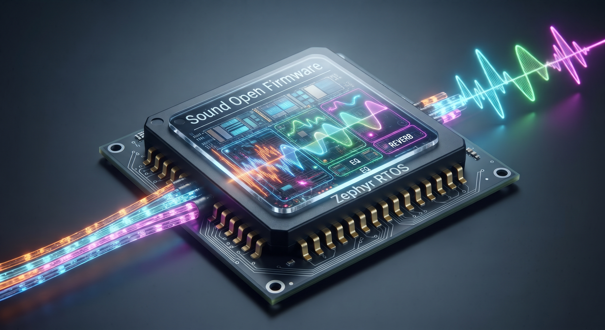

.. _introduction:

Introduction to the SOF Project
###############################

Sound Open Firmware (SOF) is a permissively licensed, open-source, vendor-independent audio Digital Signal Processing (DSP) firmware infrastructure, SDK, and host driver framework. 

Governed under the Linux Foundation and directed by the SOF Technical Steering Committee (TSC), the project provides transparent, real-time audio processing infrastructure for modern computing devices spanning embedded microcontrollers to multi-core client architectures.

Project Mission
***************

The mission of the SOF project is to:

1. **Democratize Audio DSP Development**: Provide open-source audio firmware and software infrastructure that can be blended with audio processing algorithms (including 3rd-party proprietary algorithms) to provide developers with a rich, customizable method to bring high-quality audio processing to many devices.
2. **Standardize Across Architectures**: Enable a unified firmware core and API capable of running seamlessly across diverse DSP architectures (Xtensa HiFi3/HiFi4/HiFi5, ARM Cortex-M, RISC-V) and silicon vendors (Intel, AMD, NXP, MediaTek, Espressif, PJRC).
3. **Foster Innovation in Audio Algorithms**: Empower audio algorithm researchers and software engineers to develop, deploy, and tune advanced signal processing modules (e.g. spatial audio, voice processing, noise cancellation, neural audio processing) with standard tooling.
4. **Deliver Enterprise-Grade Reliability & Low Power**: Support aggressive power gating (D0ix runtime idle, D3 cold suspend), dynamic memory paging (IMR), and low-latency audio pipelines meeting demanding client and embedded requirements.

Benefits of Audio DSP Offloading
********************************

Modern computing platforms incorporate dedicated audio DSPs to offload real-time signal processing from host general-purpose CPUs. Offloading audio workloads to SOF provides four foundational advantages:

1. **Lower Power than Host CPU**: Audio DSPs are purpose-built architectures optimized for continuous, energy-efficient streaming with specialized SIMD instruction sets (such as Tensilica HiFi or ARM Helium) and aggressive power gating (D0ix states, power-islanded SRAM pools). Offloading allows power-hungry host CPU cores and high-speed DRAM interfaces to remain in deep sleep states (C-states / S0ix) during audio playback and always-on voice listening.
2. **Lower Latency Processing than Host**: Operating on dedicated real-time DSP hardware running the Zephyr RTOS enables deterministic, sub-millisecond pipeline scheduling without the scheduling jitter, thread preemption, page faults, or context-switching overhead inherent in general-purpose host operating systems.
3. **More Vertical Audio Stack**: All audio pre-processing (microphone array beamforming, acoustic echo cancellation, noise suppression) and post-processing (parametric equalization, dynamic range compression, speaker protection, spatial audio) are centralized directly within the DSP firmware for all physical audio endpoints (SoundWire, I2S, HD-Audio, USB, Bluetooth). This establishes a consistent, high-fidelity signal chain independent of host OS variants or user-space sound servers.
4. **Free Up Host CPU for Other Work**: Intensive signal processing tasks—such as high-order polyphase sample rate conversion (SRC), multi-stream mixing, codec decoding/encoding, and neural speech enhancement—execute entirely on the DSP, liberating valuable host CPU cycles and memory bandwidth for applications, gaming, and OS workloads.

Architecture Overview
*********************

Sound Open Firmware supports two foundational deployment models tailored for diverse device form-factors:

* **Host-Based Architecture**: Where the audio DSP is coupled to a host application processor running **Linux**, **Android**, or **ChromeOS**. The host OS driver stack (mainline Linux ``sound/soc/sof/``) manages firmware lifecycle, dynamic topology loading, and power management (D0ix/D3), while audio data streams through host DMA memory windows via IPC (IPC3/IPC4).
* **Hostless (Standalone / Embedded) Architecture**: Where SOF runs autonomously on microcontrollers and standalone DSPs (such as the **ESP32-P4** or **Teensy 4.1 / i.MX RT1062**) atop the Zephyr RTOS. These systems process audio directly between physical hardware peripherals (I2S, SoundWire, PDM microphones, and Bluetooth transceivers) using ROM-embedded static topologies.

.. seealso::
   For complete system stack diagrams, hostless designs, real-time pipeline DAGs, and memory hierarchy details, refer to the comprehensive :ref:`Architecture & System Design <architectures>` documentation.

Development & Build Workflows
*****************************

The SOF project provides a comprehensive SDK comprising modern LLVM/Clang cross-compiler toolchains with Integrated Assembler (IAS), firmware image packaging and signing utilities (``rimage``), real-time string dictionary extractors (``smex``), QEMU DSP simulation environments, and automated hardware-in-the-loop test bridges.

.. seealso::
   To explore the full SDK development workflow diagram and step-by-step compilation guides, see the :ref:`Getting Started Guides <getting_started>`.

Licensing & Governance
**********************

The SOF project embraces open, permissive licensing to encourage broad industry adoption while protecting community contributions:

Firmware License
================
* **BSD 3-Clause License**: The core firmware codebase is released under the permissive BSD 3-Clause license, with certain helper components under MIT.
* **Proprietary & 3rd-Party Modules**: The permissive license permits commercial vendors and research teams to implement custom or proprietary audio processing modules without being forced to open-source proprietary IP.

Host Driver License
===================
* **Dual BSD / GPLv2**: Core platform-independent driver abstractions are dual-licensed BSD 3-Clause / GPLv2.
* **Linux Kernel Upstream (GPLv2)**: The Linux kernel integration layers upstream in ``sound/soc/sof/`` are licensed under the GNU General Public License v2 (GPLv2).

Topology & SDK Tools License
============================
* All topology definitions, build scripts, packaging utilities (`rimage`), and development tools are licensed under permissive licenses (BSD 3-Clause or MIT).

Project Governance
==================
SOF is an open-source project hosted under the Linux Foundation. Technical direction is governed by the **Technical Steering Committee (TSC)**, representing member companies, independent developers, and audio hardware manufacturers. All architectural decisions, RFCs, and code reviews are conducted transparently in public on GitHub.

Frequently Asked Questions (FAQ)
********************************

Can I create and load custom audio processing modules?
  Yes. You can either build your module directly into the firmware image or package it as a dynamic LLEXT module loaded on demand by the host OS.

Which IPC protocols are supported?
  SOF supports both **IPC3** (legacy lightweight message protocol) and **IPC4** (structured multi-part message protocol designed for modern Intel and AMD architectures).

How can I test SOF without hardware?
  You can run the SOF **Host Testbench** on any Linux development machine to test audio processing components with WAV files, or run **QEMU DSP simulation** (`native_sim`, `qemu_xtensa`) for end-to-end driver and firmware boot simulation.

Where can I review hardware compatibility?
  Refer to the living :ref:`Supported Platforms Matrix <platforms>` for the full list of supported Intel CAVS/ACE, AMD, NXP, MediaTek, Teensy 4.1, and ESP32-P4 targets.
