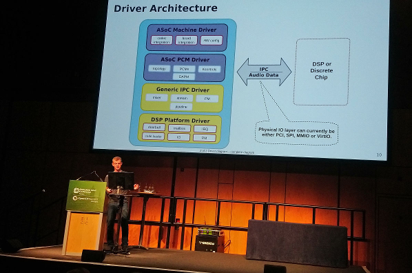

.. _presentations:

Presentations
#############

The following presentations from past conferences are available.

"Sound Open Firmware" by Liam Girdwood
   | *Open Source Summit + Embedded Linux Conference Europe 2018*
   | :download:`Sound Open Firmware <pdf/SOF_ELCE.pdf>`

"Journey from Closed to Open: Lesson Learned from Open Sourcing Sound Open Firmware" by Liam Girdwood
   | *Open Source Firmware Conference Europe 2018*
   | :download:`Lessons Learned <pdf/SOF_OSFC.pdf>`

"Audio Demo" by Seppo Ingalsuo and Ranjani Sridharan
   | *Open Source Summit + Embedded Linux Conference Europe 2018*
   | :download:`Audio Demo <pdf/SOF_DEMO_equalizer.pdf>`

*Figure 1: Liam Girdwood presenting at ELCE 2018*

SOF Mentions
************

`Linux Audio Miniconf 2018 Report <https://blog.sirena.org.uk/2018/11/01/linux-audio-miniconf-2018-report/#more-129>`_, Edinburgh

